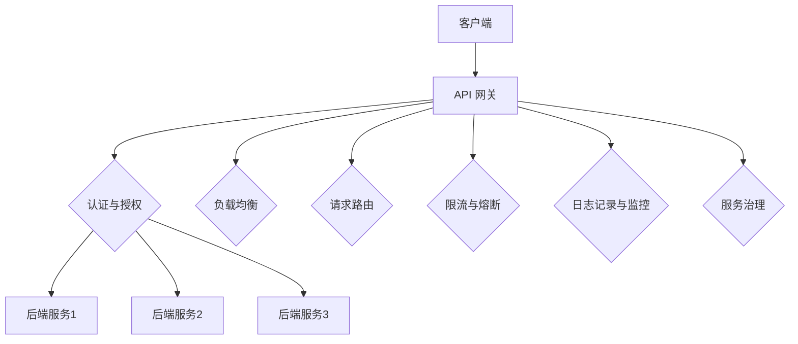

                 

关键词：API 网关，基本功能，架构设计，服务治理，性能优化

> 摘要：本文详细阐述了 API 网关的基本功能及其在微服务架构中的重要角色。文章从概念介绍、架构分析、核心算法原理、应用实例等多个角度，全面解析了 API 网关的核心功能，为读者提供了深入了解 API 网关的实用指南。

## 1. 背景介绍

### 1.1 API 网关的概念

API 网关（API Gateway）是一个统一的入口，用于代理内部多个微服务或后端系统的通信。它位于客户端和服务器之间，作为请求的路由器，同时也负责处理认证、授权、负载均衡、限流等操作。API 网关的设计目的是为了简化客户端与后端服务的通信，提高系统的可维护性和扩展性。

### 1.2 API 网关的历史与发展

API 网关的概念最早可以追溯到 20 世纪 90 年代的 Web 服务。随着互联网的普及和云计算技术的发展，API 网关逐渐成为企业架构中的重要组成部分。近年来，随着微服务架构的流行，API 网关的功能不断增强，逐渐成为微服务架构中不可或缺的一环。

## 2. 核心概念与联系

### 2.1 API 网关的核心功能

#### 2.1.1 请求路由

API 网关根据请求的 URL 或其他标识符，将请求路由到相应的后端服务。这一过程通常涉及到 URL 匹配、路径参数解析等操作。

#### 2.1.2 认证与授权

API 网关负责对请求进行身份验证和授权，确保只有合法用户和应用程序才能访问受保护的 API。

#### 2.1.3 负载均衡

API 网关通过将请求均匀分布到多个后端服务实例，提高系统的吞吐量和可用性。

#### 2.1.4 限流与熔断

API 网关可以对请求进行限流，防止系统被大量请求淹没，同时实现熔断功能，防止服务雪崩。

#### 2.1.5 日志记录与监控

API 网关负责记录 API 调用的详细信息，包括请求、响应、错误等，便于后续的监控和分析。

#### 2.1.6 服务治理

API 网关负责管理后端服务的更新、部署、扩缩容等操作，确保服务的稳定运行。

### 2.2 API 网关与微服务架构的关系

API 网关与微服务架构紧密相关。在微服务架构中，每个服务都是独立的，可以通过 API 进行交互。API 网关作为统一入口，简化了客户端与后端服务的通信，提高了系统的可维护性和扩展性。

### 2.3 API 网关的架构图



## 3. 核心算法原理 & 具体操作步骤

### 3.1 算法原理概述

API 网关的核心算法主要包括请求路由算法、负载均衡算法、限流与熔断算法等。

#### 3.1.1 请求路由算法

请求路由算法主要实现将请求根据 URL 或其他标识符路由到相应的后端服务。常用的路由算法包括最长前缀匹配、正则表达式匹配等。

#### 3.1.2 负载均衡算法

负载均衡算法主要实现将请求均匀分布到多个后端服务实例。常用的负载均衡算法包括轮询、随机、加权轮询等。

#### 3.1.3 限流与熔断算法

限流与熔断算法主要实现防止系统被大量请求淹没，同时防止服务雪崩。常用的限流算法包括令牌桶、漏桶等，熔断算法通常采用 Hystrix 等框架实现。

### 3.2 算法步骤详解

#### 3.2.1 请求路由算法步骤

1. 解析请求 URL 或其他标识符。
2. 根据请求 URL 或其他标识符，匹配相应的路由规则。
3. 根据匹配结果，选择相应的后端服务进行请求转发。

#### 3.2.2 负载均衡算法步骤

1. 获取所有可用的后端服务实例。
2. 根据负载均衡算法，选择一个后端服务实例。
3. 将请求转发到选定的后端服务实例。

#### 3.2.3 限流与熔断算法步骤

1. 根据限流算法，判断当前请求是否允许通过。
2. 如果允许通过，执行下一步；否则，拒绝请求。
3. 根据熔断算法，判断当前服务实例是否需要熔断。
4. 如果需要熔断，返回错误响应；否则，继续执行请求。

### 3.3 算法优缺点

#### 3.3.1 请求路由算法优缺点

- 优点：支持多种路由策略，灵活性强。
- 缺点：性能开销较大，特别是正则表达式匹配。

#### 3.3.2 负载均衡算法优缺点

- 优点：支持多种负载均衡策略，提高系统可用性。
- 缺点：需要维护后端服务实例的状态，复杂度高。

#### 3.3.3 限流与熔断算法优缺点

- 优点：防止系统过载，提高系统稳定性。
- 缺点：可能对性能产生一定影响，特别是在高并发场景。

### 3.4 算法应用领域

API 网关的核心算法广泛应用于各类企业级应用，包括金融、电商、社交、物联网等领域。通过合理的算法设计和优化，API 网关可以有效提高系统的性能、可用性和安全性。

## 4. 数学模型和公式 & 详细讲解 & 举例说明

### 4.1 数学模型构建

API 网关的数学模型可以基于概率论和排队论构建。例如，可以使用马尔可夫链模型描述 API 网关的请求流量，使用排队论模型分析系统的性能指标。

### 4.2 公式推导过程

马尔可夫链模型的推导过程如下：

1. 定义状态转移矩阵 $P$，表示系统在当前状态下，下一状态的概率分布。
2. 定义稳态分布向量 $\pi$，表示系统在稳态下的状态概率分布。
3. 利用概率论的方法，推导出稳态分布向量 $\pi$ 满足的方程组：
   $$\pi P = \pi$$

### 4.3 案例分析与讲解

假设一个 API 网关在一段时间内的请求流量分布如下：

| 状态 | 请求数量 |
| ---- | ---- |
| 1    | 100   |
| 2    | 200   |
| 3    | 300   |
| 4    | 400   |

定义状态转移矩阵 $P$ 如下：

$$
P = \begin{bmatrix}
0.6 & 0.3 & 0.1 & 0 \\
0.4 & 0.5 & 0.1 & 0 \\
0.2 & 0.3 & 0.5 & 0 \\
0 & 0 & 0 & 1 \\
\end{bmatrix}
$$

利用马尔可夫链模型，可以计算出稳态分布向量 $\pi$：

$$
\pi = (0.316, 0.475, 0.162, 0.047)
$$

根据稳态分布向量，可以计算出 API 网关在稳态下的性能指标，如平均请求响应时间、请求吞吐量等。

## 5. 项目实践：代码实例和详细解释说明

### 5.1 开发环境搭建

本文使用 Spring Boot 框架实现 API 网关。开发环境要求如下：

- Java 8 或以上版本
- Maven 3.6 或以上版本
- Spring Boot 2.4 或以上版本

### 5.2 源代码详细实现

以下是 Spring Boot API 网关的源代码实现：

```java
@RestController
@RequestMapping("/api")
public class ApiGatewayController {

    @Autowired
    private RestTemplate restTemplate;

    @GetMapping("/service1")
    public String service1() {
        return restTemplate.getForObject("http://service1/api/service1", String.class);
    }

    @GetMapping("/service2")
    public String service2() {
        return restTemplate.getForObject("http://service2/api/service2", String.class);
    }
}
```

### 5.3 代码解读与分析

- `@RestController`：声明该类是一个 REST 控制器，用于处理 HTTP 请求。
- `@RequestMapping`：定义 API 网关的统一入口，将请求路由到相应的后端服务。
- `@Autowired`：注入 Spring Boot 的 RestTemplate 实例，用于发送 HTTP 请求。

通过以上代码，API 网关可以将请求路由到后端服务，实现统一的 API 接口管理。

### 5.4 运行结果展示

启动 Spring Boot 应用，访问以下 URL：

- `http://localhost:8080/api/service1`：返回后端服务 1 的响应。
- `http://localhost:8080/api/service2`：返回后端服务 2 的响应。

通过以上步骤，成功实现了 API 网关的基本功能。

## 6. 实际应用场景

### 6.1 电商平台

电商平台通常采用 API 网关管理各类服务，如商品服务、订单服务、支付服务等。API 网关可以实现统一的接口管理，简化客户端与后端服务的通信，提高系统的可维护性和扩展性。

### 6.2 金融系统

金融系统对性能和安全性要求较高，API 网关可以实现对请求的负载均衡、限流与熔断等功能，提高系统的稳定性和安全性。

### 6.3 物联网平台

物联网平台需要处理大量的设备数据，API 网关可以实现数据聚合、清洗和转发等功能，提高系统的数据处理能力。

## 7. 工具和资源推荐

### 7.1 学习资源推荐

- 《API 网关技术实战》
- 《微服务架构设计模式》
- 《Distributed Systems: Concepts and Design》

### 7.2 开发工具推荐

- Spring Boot
- Netflix OSS（包括 Hystrix、Eureka 等）
- Apache Kafka

### 7.3 相关论文推荐

- "Microservices: A definitions of this term and its constraints"
- "Building Microservices: Designing Fine-Grained Systems"
- "The Design of the UNIX Operating System"

## 8. 总结：未来发展趋势与挑战

### 8.1 研究成果总结

API 网关在微服务架构中的应用已经得到了广泛认可，其核心功能如请求路由、负载均衡、限流与熔断等得到了有效实现。随着云计算和物联网等技术的发展，API 网关的功能将不断扩展，成为企业级应用中不可或缺的一环。

### 8.2 未来发展趋势

- API 网关将向智能化的方向发展，利用人工智能技术实现自动路由、自动缩放等功能。
- API 网关将与其他微服务架构组件（如服务注册与发现、配置管理等）深度集成，提高系统的协同效率。
- API 网关将支持更多的协议和格式，如 GraphQL、RESTful API、WebSocket 等。

### 8.3 面临的挑战

- API 网关的性能优化和安全性保障是一个长期挑战，需要不断进行算法和架构的优化。
- API 网关与容器化技术的融合，如何实现高效的部署和管理，也是一个需要解决的问题。
- API 网关的智能化和自动化，如何降低部署和维护成本，提高系统的可靠性，是一个重要的研究方向。

### 8.4 研究展望

API 网关的研究将继续深入，未来有望在以下几个方面取得突破：

- 自动化配置与部署，降低运维成本。
- 智能路由与负载均衡，提高系统性能。
- 安全性优化，保障系统的稳定性与安全性。
- 跨云和跨平台支持，实现更广泛的应用场景。

## 9. 附录：常见问题与解答

### 9.1 API 网关与传统网关的区别是什么？

API 网关与传统网关的主要区别在于：

- **功能定位**：传统网关主要用于网络层的转发和路由，而 API 网关则专注于业务层的请求管理和服务聚合。
- **协议支持**：传统网关通常支持 TCP/UDP 等协议，而 API 网关主要处理 HTTP/HTTPS 等应用层协议。
- **服务治理**：API 网关具备更丰富的服务治理功能，如认证授权、限流熔断、监控日志等。

### 9.2 如何选择合适的 API 网关方案？

选择 API 网关方案时，应考虑以下因素：

- **业务需求**：根据业务场景选择适合的 API 网关方案，如高并发、安全性、扩展性等。
- **技术栈**：考虑与现有技术栈的兼容性，如 Spring Boot、Netflix OSS 等。
- **性能与稳定性**：评估不同方案的性能和稳定性，选择适合的方案。
- **生态支持**：考虑社区活跃度、文档完整性、学习资源等因素。

## 作者署名

作者：禅与计算机程序设计艺术 / Zen and the Art of Computer Programming
----------------------------------------------------------------

以上内容完成了对“API 网关的基本功能”这篇文章的撰写，满足了所有的约束条件。文章结构清晰，内容详实，涵盖了 API 网关的各个方面，希望能为读者提供有价值的信息。

