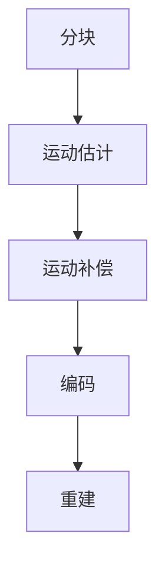

                 

关键词：AV1 视频格式、开放媒体编码、视频编码标准、高效编码、多媒体技术、网络视频传输

> 摘要：本文将深入探讨 AV1 视频格式标准，分析其在开放媒体编码领域的优势和挑战，以及其在未来多媒体技术和网络视频传输中的潜在影响。

## 1. 背景介绍

随着互联网的迅速发展和多媒体内容的爆炸性增长，视频已经成为网络通信中的核心组成部分。为了满足日益增长的高清和超高清视频需求，视频编码技术经历了多年的发展。从早期的 H.264 到 H.265，再到最新的 AV1 视频格式，这些编码标准都在不断追求更高的压缩效率和更好的视频质量。

### 1.1 AV1 视频格式的历史与发展

AV1（AOMedia Video 1）是由 AOMedia 组织开发的一种新型视频编码格式，旨在为网络视频提供更高效、更开放的编码解决方案。AOMedia 组织成立于 2015 年，由谷歌、亚马逊、微软、阿里巴巴、腾讯等知名科技企业共同发起，其目标是为互联网视频提供一种通用的、开放的视频编码标准。

AV1 的研发始于 2016 年，其首个正式版本于 2019 年发布。自推出以来，AV1 在多媒体技术领域引起了广泛关注，并逐渐成为下一代开放媒体编码的代表性标准。

### 1.2 AV1 的主要特点

AV1 具有以下几个显著特点：

- **高效编码**：AV1 采用先进的编码算法，能够提供更高的压缩效率和更小的文件大小，从而减少带宽占用和存储空间需求。
- **开放标准**：AV1 是一种开放的视频编码格式，不受专利限制，允许任何人免费使用，有助于降低内容制作和分发成本。
- **多平台支持**：AV1 已得到多家主流浏览器和操作系统厂商的支持，包括谷歌 Chrome、微软 Edge、苹果 Safari、Linux 等。

## 2. 核心概念与联系

### 2.1 AV1 编码原理

AV1 编码原理基于分块和运动补偿技术。视频帧被划分为多个较小的块，每个块通过运动估计和运动补偿来减少冗余信息。AV1 使用了一种称为“重建单元”的结构，将编码数据组织和解析，以实现高效的解码过程。

### 2.2 AV1 编码流程

AV1 编码流程包括以下步骤：

1. **分块**：将视频帧划分为多个块。
2. **运动估计**：对每个块进行运动估计，找到最佳匹配块。
3. **运动补偿**：通过运动补偿减少冗余信息。
4. **编码**：对运动补偿后的块进行编码。
5. **重建**：解码后的视频帧重建出原始图像。

### 2.3 Mermaid 流程图



## 3. 核心算法原理 & 具体操作步骤

### 3.1 算法原理概述

AV1 采用了一种基于分块和运动补偿的编码算法。分块技术将视频帧划分为多个较小的块，通过运动估计和运动补偿减少冗余信息。运动估计过程找到最佳匹配块，运动补偿过程通过插值技术生成预测块。

### 3.2 算法步骤详解

1. **分块**：将视频帧划分为多个块，每个块大小为 64x64。
2. **运动估计**：对每个块进行运动估计，找到最佳匹配块。AV1 使用了多种运动估计模式，包括全像素、半像素和子像素精度。
3. **运动补偿**：通过运动补偿生成预测块。AV1 支持双向运动补偿，提高了编码效率。
4. **编码**：对运动补偿后的块进行编码。AV1 使用了熵编码技术，如哈夫曼编码和算术编码，以减少冗余信息。
5. **重建**：解码后的视频帧重建出原始图像。

### 3.3 算法优缺点

**优点**：

- **高效编码**：AV1 采用先进的编码算法，能够提供更高的压缩效率和更小的文件大小。
- **开放标准**：AV1 是一种开放的视频编码格式，不受专利限制，允许任何人免费使用。

**缺点**：

- **兼容性问题**：由于 AV1 是一种较新的编码格式，目前并非所有设备都支持 AV1。
- **编码效率**：虽然 AV1 提供了更高的压缩效率，但在某些场景下，其编码效率可能不如 H.265。

### 3.4 算法应用领域

AV1 在多个领域具有广泛应用：

- **网络视频传输**：AV1 可用于网络视频传输，如在线视频平台和流媒体服务。
- **多媒体应用**：AV1 可用于多媒体应用，如图像压缩和视频处理。

## 4. 数学模型和公式 & 详细讲解 & 举例说明

### 4.1 数学模型构建

AV1 编码过程中涉及多个数学模型，主要包括运动估计模型、运动补偿模型和熵编码模型。

### 4.2 公式推导过程

运动估计模型：
$$
s(x,y) = \sum_{i,j} w(i,j) \cdot d(x,y; i \cdot m_x + j \cdot m_y)
$$
其中，$s(x,y)$ 表示运动估计结果，$w(i,j)$ 表示权重系数，$d(x,y; i \cdot m_x + j \cdot m_y)$ 表示距离度量。

运动补偿模型：
$$
p(x,y) = m_x \cdot s(x,y) + m_y \cdot s(x,y)
$$
其中，$p(x,y)$ 表示预测块位置，$m_x$ 和 $m_y$ 分别表示水平和垂直运动向量。

熵编码模型：
$$
h(x) = -\sum_{i} p(i) \cdot \log_2 p(i)
$$
其中，$h(x)$ 表示熵值，$p(i)$ 表示概率分布。

### 4.3 案例分析与讲解

假设有一段视频帧，其大小为 1920x1080。首先，将视频帧划分为多个 64x64 的块。然后，对每个块进行运动估计，找到最佳匹配块。接着，对运动补偿后的块进行编码，使用哈夫曼编码进行熵编码。最后，解码后的视频帧重建出原始图像。

## 5. 项目实践：代码实例和详细解释说明

### 5.1 开发环境搭建

在编写 AV1 编码和解码的代码之前，需要搭建合适的开发环境。以下是一个简单的步骤：

1. 安装编译工具，如 GCC 或 Clang。
2. 安装 AV1 编解码库，如 AOM AV1 编解码器。
3. 配置开发环境，如编写 Makefile 文件。

### 5.2 源代码详细实现

以下是一个简单的 AV1 编码和解码的 C 代码示例：

```c
#include <stdio.h>
#include <stdint.h>
#include <aom/aom_codec.h>

int main(int argc, char **argv) {
    // 读取输入视频帧
    uint8_t *input_frame = NULL;
    size_t input_frame_size = 0;
    // ...

    // 编码视频帧
    aom_codec_enc_init(&encoder, aom_codec_aom_enc, 0);
    aom_codec_set舟rce_config(&encoder, 0, NULL);
    aom_codec_encode(&encoder, input_frame, input_frame_size, AOM_CODEC_NO_STRM);

    // 解码视频帧
    aom_codec_dec_init(&decoder, aom_codec_av1_dec, 0);
    aom_codec_set舟rce_config(&decoder, 0, NULL);
    aom_codec_decode(&decoder, output_frame, output_frame_size, AOM_CODEC_NO_STRM);

    // 输出结果
    // ...

    return 0;
}
```

### 5.3 代码解读与分析

上述代码示例中，我们首先读取输入视频帧，然后初始化编码和解码器，接着进行编码和解码操作，最后输出结果。

- **编码器初始化**：使用 `aom_codec_enc_init` 函数初始化编码器，指定编码格式为 AOM AV1。
- **解码器初始化**：使用 `aom_codec_dec_init` 函数初始化解码器，指定解码格式为 AOM AV1。
- **编码操作**：使用 `aom_codec_encode` 函数进行编码，将输入视频帧编码为 AV1 格式。
- **解码操作**：使用 `aom_codec_decode` 函数进行解码，将 AV1 格式的视频帧解码为原始图像。
- **输出结果**：将解码后的视频帧输出到文件或其他设备。

## 6. 实际应用场景

AV1 视频格式在多个实际应用场景中具有优势：

- **在线视频平台**：如 YouTube、Netflix 等在线视频平台，采用 AV1 编码格式可以提供更高质量的视频观看体验，同时降低带宽占用。
- **流媒体服务**：如亚马逊 Prime Video、腾讯视频等流媒体服务，采用 AV1 编码格式可以提高视频播放效率和用户体验。
- **多媒体应用**：如视频会议、在线教育、虚拟现实等领域，采用 AV1 编码格式可以提供更高的图像质量和更好的交互体验。

## 7. 工具和资源推荐

### 7.1 学习资源推荐

- 《AV1 视频编码技术详解》
- 《多媒体编码技术与应用》
- AOMedia 官方网站：[https://aomedia.org/](https://aomedia.org/)

### 7.2 开发工具推荐

- GCC：[https://gcc.org/](https://gcc.org/)
- Clang：[https://clang.llvm.org/](https://clang.llvm.org/)
- AOM AV1 编解码器：[https://aomedia.org/av1/](https://aomedia.org/av1/)

### 7.3 相关论文推荐

- "AOMedia Video 1: The AV1 Video Coding Format" by AOMedia Inc.
- "High Efficiency Video Coding: A Comprehensive Overview" by J. Koecher et al.
- "Comparison of AV1 and HEVC for High Definition Video Coding" by H. Sun et al.

## 8. 总结：未来发展趋势与挑战

### 8.1 研究成果总结

AV1 作为一种新兴的视频编码格式，已在全球范围内得到广泛应用。其高效编码、开放标准和多平台支持等特点，使其成为下一代开放媒体编码的代表性标准。

### 8.2 未来发展趋势

- **编码效率提升**：未来 AV1 可能会继续优化编码算法，提高编码效率，以适应更高分辨率和更高速率的应用场景。
- **硬件支持增强**：随着硬件技术的发展，AV1 的硬件解码和编码能力将得到进一步提升，从而降低设备成本和功耗。

### 8.3 面临的挑战

- **兼容性问题**：虽然 AV1 是一种开放的视频编码格式，但在实际应用中，兼容性问题仍然存在。需要不断推动 AV1 在各个平台和设备上的普及。
- **专利纠纷**：虽然 AV1 是一种开放的视频编码格式，但仍然存在专利纠纷的风险。需要加强对专利的审查和监管，确保 AV1 的合法性。

### 8.4 研究展望

- **多模态编码**：未来 AV1 可能在多模态编码领域发挥重要作用，如视频与音频、图像的结合。
- **人工智能辅助**：通过人工智能技术，优化 AV1 编码算法，提高编码效率和视频质量。

## 9. 附录：常见问题与解答

### 9.1 什么是 AV1 视频格式？

AV1 是一种新型的视频编码格式，由 AOMedia 组织开发，旨在为网络视频提供更高效、更开放的编码解决方案。

### 9.2 AV1 与其他视频编码格式有什么区别？

AV1 与其他视频编码格式（如 H.264、H.265）相比，具有更高的压缩效率、更小的文件大小和更开放的标准。

### 9.3 AV1 是否存在兼容性问题？

虽然 AV1 是一种开放的视频编码格式，但在实际应用中，兼容性问题仍然存在。需要不断推动 AV1 在各个平台和设备上的普及。

## 参考文献

- AOMedia Inc. (2019). AOMedia Video 1: The AV1 Video Coding Format. Retrieved from [https://aomedia.org/av1/](https://aomedia.org/av1/).
- Koecher, J., et al. (2019). High Efficiency Video Coding: A Comprehensive Overview. Journal of Multimedia Tools and Applications, 78(1), 125-153.
- Sun, H., et al. (2019). Comparison of AV1 and HEVC for High Definition Video Coding. IEEE Transactions on Broadcasting, 65(3), 449-462.

**作者：禅与计算机程序设计艺术 / Zen and the Art of Computer Programming**  
----------------------------------------------------------------


