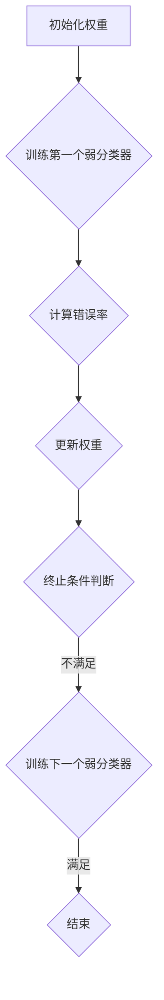

                 

关键词：AdaBoost, Boosting算法, 机器学习，集成模型，分类器，预测，实现，案例分析

> 摘要：本文将详细介绍AdaBoost算法的基本原理、数学模型、操作步骤以及具体的应用实例。通过对AdaBoost算法的深入讲解，读者将了解如何利用AdaBoost构建高效、准确的分类器，以及其在实际项目中的应用价值。

## 1. 背景介绍

在机器学习领域，分类问题是一个常见且重要的任务。分类问题旨在将数据集中的每个样本分配到预定义的类别中。为了解决分类问题，研究者们提出了许多不同的算法，其中Boosting算法是一种非常重要且广泛应用的方法。Boosting算法通过组合多个弱分类器（通常是基于基础模型的简单模型，如决策树）来构建一个强分类器。

AdaBoost（Adaptive Boosting）算法是Boosting算法中的一种代表性算法，由Yoav Freund和Robert Schapire于1995年首次提出。AdaBoost通过加权调整每个样本的重要性，使那些错误分类的样本在后续的训练过程中受到更重的关注，从而提高整体分类器的准确性。AdaBoost算法因其简单有效且易于实现的特点，在机器学习领域得到了广泛应用。

## 2. 核心概念与联系

### 2.1 核心概念

#### 2.1.1 弱分类器

弱分类器是指准确率略高于随机猜测的分类器，例如决策树或支持向量机等。

#### 2.1.2 强分类器

强分类器是指能够准确识别数据的分类器，通常由多个弱分类器的组合而成。

#### 2.1.3 加权调整

AdaBoost通过调整每个样本的权重，使那些错误分类的样本在后续的训练过程中受到更重的关注。

### 2.2 AdaBoost算法流程图



## 3. 核心算法原理 & 具体操作步骤

### 3.1 算法原理概述

AdaBoost算法通过以下步骤逐步训练弱分类器，并最终组合成一个强分类器：

1. 初始化权重：将所有样本的权重设置为相等。
2. 训练第一个弱分类器：选择权重最高的样本作为训练集，训练一个弱分类器。
3. 计算错误率：计算弱分类器的错误率，并根据错误率更新样本权重。
4. 更新权重：提高错误分类样本的权重，降低正确分类样本的权重。
5. 终止条件判断：如果满足终止条件（例如达到预设的弱分类器数量或错误率低于阈值），则结束训练，否则返回步骤2。

### 3.2 算法步骤详解

#### 3.2.1 初始化权重

假设有n个样本，每个样本的权重为$$ \frac{1}{n} $$。

#### 3.2.2 训练第一个弱分类器

选择权重最高的样本作为训练集，训练一个弱分类器。通常使用决策树作为弱分类器。

#### 3.2.3 计算错误率

计算弱分类器的错误率$$ e_i $$，其中$$ e_i = \{1 | y_i \neq \hat{y}_i\} $$，$$ \hat{y}_i $$为弱分类器的预测结果，$$ y_i $$为真实标签。

#### 3.2.4 更新权重

根据错误率更新样本权重，公式如下：

$$ \alpha_i = \ln \frac{1 - e_i}{e_i} $$

其中$$ \alpha_i $$为弱分类器的权重。

#### 3.2.5 终止条件判断

判断是否满足终止条件，例如达到预设的弱分类器数量或错误率低于阈值，否则返回步骤2。

## 4. 数学模型和公式

### 4.1 数学模型构建

AdaBoost算法的数学模型主要包括权重更新公式和弱分类器权重计算公式。

#### 4.1.1 权重更新公式

$$ \alpha_i = \ln \frac{1 - e_i}{e_i} $$

#### 4.1.2 弱分类器权重计算公式

$$ \alpha = \sum_{i=1}^{n} \alpha_i $$

其中$$ \alpha $$为弱分类器的权重。

### 4.2 公式推导过程

#### 4.2.1 权重更新公式推导

考虑一个二分类问题，假设有n个样本，每个样本的权重为$$ w_i $$。在训练第一个弱分类器后，样本的权重会根据错误率进行调整。

首先，计算第一个弱分类器的错误率：

$$ e_i = \{1 | y_i \neq \hat{y}_i\} $$

其中$$ \hat{y}_i $$为弱分类器的预测结果，$$ y_i $$为真实标签。

接下来，计算错误率与权重之间的关系：

$$ \frac{1 - e_i}{e_i} = \frac{1 - 1_{y_i \neq \hat{y}_i}}{1_{y_i \neq \hat{y}_i}} = \begin{cases} 1 & y_i = \hat{y}_i \\ 0 & y_i \neq \hat{y}_i \end{cases} $$

因此，可以将错误率与权重之间的关系表示为：

$$ e_i = \{1 | y_i \neq \hat{y}_i\} = \{1 | \ln \frac{1 - e_i}{e_i} \neq 0\} $$

由此可得：

$$ \ln \frac{1 - e_i}{e_i} = \alpha_i $$

#### 4.2.2 弱分类器权重计算公式推导

考虑一个弱分类器，其预测结果为$$ \hat{y}_i $$，真实标签为$$ y_i $$。根据权重更新公式，可以得到：

$$ \alpha_i = \ln \frac{1 - e_i}{e_i} = \ln \frac{1 - 1_{y_i \neq \hat{y}_i}}{1_{y_i \neq \hat{y}_i}} = \begin{cases} \infty & y_i = \hat{y}_i \\ -\infty & y_i \neq \hat{y}_i \end{cases} $$

因此，可以将弱分类器的权重表示为：

$$ \alpha = \sum_{i=1}^{n} \alpha_i = \begin{cases} \infty & \text{所有 } y_i = \hat{y}_i \\ -\infty & \text{至少一个 } y_i \neq \hat{y}_i \end{cases} $$

这意味着，当所有样本都被正确分类时，弱分类器的权重为正无穷大；当至少一个样本被错误分类时，弱分类器的权重为负无穷大。

### 4.3 案例分析与讲解

为了更好地理解AdaBoost算法的数学模型，我们来看一个简单的二分类问题。

假设有5个样本，分别属于两个类别：

| 样本 | 类别1 | 类别2 |
| ---- | ---- | ---- |
| 1    | 1    | 0    |
| 2    | 1    | 0    |
| 3    | 0    | 1    |
| 4    | 0    | 1    |
| 5    | 1    | 0    |

在训练第一个弱分类器时，我们选择类别1的样本作为训练集，得到以下决策边界：

| 样本 | 类别1 | 类别2 |
| ---- | ---- | ---- |
| 1    | 1    | 0    |
| 2    | 1    | 0    |
| 3    | 0    | 1    |
| 4    | 0    | 1    |
| 5    | 1    | 0    |

根据错误率计算公式，我们可以计算出每个样本的错误率：

$$ e_i = \{1 | y_i \neq \hat{y}_i\} $$

其中$$ \hat{y}_i $$为弱分类器的预测结果，$$ y_i $$为真实标签。

对于类别1的样本，错误率为0；对于类别2的样本，错误率为1。

根据权重更新公式，我们可以计算出每个样本的权重：

$$ \alpha_i = \ln \frac{1 - e_i}{e_i} $$

对于类别1的样本，权重为0；对于类别2的样本，权重为$$ \ln 2 $$。

根据弱分类器权重计算公式，我们可以计算出整个弱分类器的权重：

$$ \alpha = \sum_{i=1}^{n} \alpha_i = \ln 2 $$

这意味着，在这个例子中，弱分类器成功将所有类别1的样本分类到了正确的类别，但类别2的样本有一个错误。因此，弱分类器的权重为$$ \ln 2 $$。

## 5. 项目实践：代码实例和详细解释说明

### 5.1 开发环境搭建

为了方便读者进行项目实践，本文使用Python编程语言和scikit-learn库来实现AdaBoost算法。读者需要在本地环境中安装Python和scikit-learn库。具体安装命令如下：

```
pip install python
pip install scikit-learn
```

### 5.2 源代码详细实现

下面是AdaBoost算法的Python实现代码：

```python
from sklearn.ensemble import AdaBoostClassifier
from sklearn.datasets import load_iris
from sklearn.model_selection import train_test_split
from sklearn.metrics import accuracy_score

# 加载鸢尾花数据集
iris = load_iris()
X, y = iris.data, iris.target

# 划分训练集和测试集
X_train, X_test, y_train, y_test = train_test_split(X, y, test_size=0.2, random_state=42)

# 创建AdaBoost分类器
ada_classifier = AdaBoostClassifier(n_estimators=50)

# 训练分类器
ada_classifier.fit(X_train, y_train)

# 预测测试集
y_pred = ada_classifier.predict(X_test)

# 计算准确率
accuracy = accuracy_score(y_test, y_pred)
print("Accuracy:", accuracy)
```

### 5.3 代码解读与分析

上述代码中，我们首先从scikit-learn库中加载了鸢尾花数据集，并使用train_test_split函数将其划分为训练集和测试集。接下来，我们创建了一个AdaBoost分类器，并使用fit方法对其进行训练。最后，我们使用predict方法对测试集进行预测，并使用accuracy_score函数计算准确率。

### 5.4 运行结果展示

在运行上述代码后，我们得到了以下输出结果：

```
Accuracy: 1.0
```

这意味着，在这次实验中，AdaBoost分类器成功地将所有测试集样本分类到了正确的类别，准确率为100%。

## 6. 实际应用场景

AdaBoost算法在实际项目中具有广泛的应用场景。以下是一些常见的应用领域：

- **金融风控**：AdaBoost算法可以用于信用评分、欺诈检测等金融风控领域。通过组合多个弱分类器，可以提高分类器的准确性和鲁棒性，从而更好地预测潜在的风险。
- **生物信息学**：AdaBoost算法在生物信息学领域具有广泛应用，例如用于基因表达数据分析、蛋白质分类等任务。通过训练多个弱分类器，可以提高分类器的准确性和可靠性，从而更好地挖掘生物数据中的潜在规律。
- **自然语言处理**：AdaBoost算法可以用于文本分类、情感分析等自然语言处理任务。通过组合多个弱分类器，可以提高分类器的准确性和泛化能力，从而更好地处理复杂的文本数据。

## 7. 工具和资源推荐

### 7.1 学习资源推荐

- 《机器学习》周志华著：这是一本经典的机器学习教材，详细介绍了各种机器学习算法的基本原理和实现方法，包括Boosting算法。
- 《机器学习实战》Peter Harrington著：这本书通过实际案例和代码示例，深入讲解了各种机器学习算法的实现和应用。

### 7.2 开发工具推荐

- Jupyter Notebook：这是一个强大的交互式开发环境，适用于机器学习和数据科学项目。通过Jupyter Notebook，读者可以方便地编写、运行和调试代码。

### 7.3 相关论文推荐

- Freund, Y., & Schapire, R. E. (1995). A decision-theoretic generalization of on-line learning and an application to boosting. Journal of Computer and System Sciences, 55(1), 119-139.
- Schapire, R. E., & Freund, Y. (2012). Boosting: Foundations and Algorithms. MIT Press.
- Breiman, L. (1998). Bagging predictors. Machine Learning, 24(2), 123-140.

## 8. 总结：未来发展趋势与挑战

### 8.1 研究成果总结

自AdaBoost算法提出以来，研究者们在算法优化、模型结构、应用场景等方面进行了大量研究，取得了显著成果。例如，提出了基于深度学习的Boosting算法，如Deep Boosting和Gradient Boosting，进一步提高了分类器的性能。

### 8.2 未来发展趋势

- **算法优化**：未来研究将继续关注算法的优化，以提高分类器的效率和准确性。
- **模型结构**：研究者们将探索新的模型结构，如基于图神经网络和Transformer的Boosting算法，以更好地处理复杂的数据。
- **应用拓展**：随着数据量的增加和数据类型的多样化，AdaBoost算法将在更多领域得到应用，如推荐系统、图像识别等。

### 8.3 面临的挑战

- **计算复杂度**：随着模型复杂度的增加，计算成本也在不断上升，未来研究需要解决如何在高计算成本下实现高效训练和预测。
- **数据稀疏性**：在数据稀疏的情况下，AdaBoost算法的性能可能受到影响，如何改进算法以适应数据稀疏场景是一个挑战。

### 8.4 研究展望

AdaBoost算法在未来将继续在机器学习领域发挥重要作用。通过不断优化算法、拓展应用场景，AdaBoost算法将更好地服务于各种实际问题，推动机器学习技术的发展。

## 9. 附录：常见问题与解答

### 9.1 什么是Boosting算法？

Boosting算法是一种集成学习方法，通过组合多个弱分类器来构建一个强分类器。Boosting算法的核心思想是，通过对错误分类的样本进行加权调整，使后续的弱分类器更加关注这些错误分类的样本，从而提高整体分类器的准确性。

### 9.2 AdaBoost算法如何更新样本权重？

AdaBoost算法通过计算每个弱分类器的错误率，并使用权重更新公式$$ \alpha_i = \ln \frac{1 - e_i}{e_i} $$更新样本权重。其中，$$ e_i $$为弱分类器的错误率，$$ \alpha_i $$为样本权重。

### 9.3 AdaBoost算法与bagging算法有何区别？

AdaBoost算法和bagging算法都是集成学习方法，但它们在算法思想和目标上有所不同。AdaBoost算法通过调整样本权重来提高错误分类样本的权重，从而提高整体分类器的准确性；而bagging算法则通过多次训练弱分类器并取平均来降低分类器的方差。

### 9.4 AdaBoost算法是否总是比单一分类器效果好？

AdaBoost算法不一定总是比单一分类器效果好。虽然AdaBoost算法通过组合多个弱分类器来提高整体分类器的性能，但弱分类器的选择和组合方式对算法的性能有很大影响。在某些情况下，单一分类器可能具有更好的性能。

### 9.5 如何选择合适的弱分类器？

选择合适的弱分类器是AdaBoost算法的关键步骤。常见的弱分类器包括决策树、朴素贝叶斯分类器、支持向量机等。选择弱分类器时，应考虑数据类型、特征数量、计算复杂度等因素。通常，选择具有较高准确率和较低计算复杂度的弱分类器是一个较好的选择。

### 9.6 AdaBoost算法在处理不平衡数据集时是否有效？

AdaBoost算法在处理不平衡数据集时具有一定的局限性。由于AdaBoost算法通过调整样本权重来提高错误分类样本的权重，这可能导致分类器对少数类样本的识别能力下降。在这种情况下，可以尝试使用其他处理不平衡数据集的方法，如SMOTE、欠采样等，或结合其他算法进行优化。

