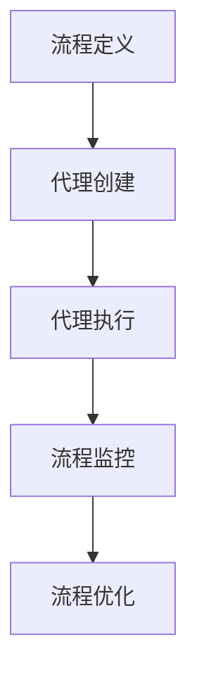

                 

关键词：Agentic Workflow，流程自动化，复杂流程开发，人工智能，流程引擎，动态流程，流程优化，业务流程管理。

> 摘要：本文深入探讨了Agentic Workflow在复杂流程开发中的应用，分析了其核心概念与原理，并详细介绍了核心算法和数学模型。同时，通过项目实践和实际应用场景的分析，展示了Agentic Workflow在实际开发中的价值和潜力。最后，对未来发展趋势和挑战进行了展望，并推荐了相关工具和资源。

## 1. 背景介绍

在当今快速发展的数字化时代，企业流程自动化成为了提升效率、降低成本的关键。传统的业务流程管理往往依赖于人工操作，不仅效率低下，而且容易出错。随着人工智能技术的发展，流程自动化逐渐成为企业提高竞争力的重要手段。Agentic Workflow作为一种新型的流程自动化技术，以其灵活性和智能化特点，受到了广泛关注。

Agentic Workflow的核心在于其能够自动识别、分析和优化业务流程，实现流程的自动化和智能化。它不仅能够处理简单的线性流程，还能够应对复杂的动态流程，适应不断变化的企业需求。本文将详细介绍Agentic Workflow的核心概念、算法原理、数学模型以及实际应用，帮助读者深入了解这一技术。

## 2. 核心概念与联系

### 2.1. Agentic Workflow的定义

Agentic Workflow是一种基于人工智能的流程自动化技术，它通过引入智能代理（Agentic）来处理业务流程中的各个环节。智能代理具有自主决策、自适应和学习能力，能够根据业务规则和流程状态进行实时调整，从而实现流程的自动化和优化。

### 2.2. Agentic Workflow的关键组件

Agentic Workflow的关键组件包括：

- **流程定义**：定义业务流程的各个环节，包括开始、结束、条件分支、并行执行等。
- **智能代理**：执行流程中的任务，根据流程状态和业务规则进行决策。
- **流程引擎**：负责调度和管理智能代理的执行，确保流程按照预定的规则进行。

### 2.3. Agentic Workflow的工作原理

Agentic Workflow的工作原理可以概括为以下几个步骤：

1. **流程定义**：通过图形化界面或编程方式定义业务流程。
2. **代理创建**：根据流程定义创建智能代理，并分配相应的任务。
3. **代理执行**：智能代理根据流程状态和业务规则执行任务，并作出决策。
4. **流程监控**：实时监控流程的执行情况，包括进度、状态、异常等。
5. **流程优化**：根据监控数据对流程进行调整和优化，提高流程效率。

### 2.4. Agentic Workflow的架构

Agentic Workflow的架构如图所示：



### 2.5. Agentic Workflow与其他流程自动化的比较

与传统的流程自动化技术相比，Agentic Workflow具有以下几个优势：

- **灵活性**：能够处理复杂的动态流程，适应企业不断变化的需求。
- **智能化**：引入智能代理，实现自动化决策和自适应调整。
- **高效性**：通过实时监控和优化，提高流程执行效率。
- **易用性**：提供图形化界面，方便非技术人员进行流程定义。

## 3. 核心算法原理 & 具体操作步骤

### 3.1. 算法原理概述

Agentic Workflow的核心算法是基于机器学习和智能代理技术。它通过以下三个步骤实现流程的自动化和优化：

1. **流程建模**：使用机器学习算法对业务流程进行建模，识别流程中的关键环节和依赖关系。
2. **代理决策**：智能代理根据业务规则和流程状态进行决策，选择最佳执行路径。
3. **流程优化**：基于实时监控数据，对流程进行调整和优化，提高流程效率。

### 3.2. 算法步骤详解

1. **数据收集**：收集业务流程的历史数据，包括流程执行时间、执行结果、异常情况等。
2. **流程建模**：使用机器学习算法对收集到的数据进行处理，生成流程模型。
3. **代理创建**：根据流程模型创建智能代理，并分配相应的任务。
4. **代理执行**：智能代理根据流程状态和业务规则执行任务，并作出决策。
5. **数据反馈**：将代理执行结果反馈给流程引擎，用于流程优化。
6. **流程监控**：实时监控流程的执行情况，包括进度、状态、异常等。
7. **流程优化**：根据监控数据对流程进行调整和优化，提高流程效率。

### 3.3. 算法优缺点

**优点**：

- **灵活性强**：能够处理复杂的动态流程，适应企业不断变化的需求。
- **智能化高**：引入智能代理，实现自动化决策和自适应调整。
- **效率提升**：通过实时监控和优化，提高流程执行效率。

**缺点**：

- **数据依赖性高**：算法性能依赖于业务流程的数据质量和数量。
- **实施难度大**：需要较高的技术水平和专业知识。

### 3.4. 算法应用领域

Agentic Workflow主要应用于以下领域：

- **企业内部管理**：如人力资源、财务、采购等部门的业务流程自动化。
- **供应链管理**：如订单处理、库存管理、物流跟踪等。
- **金融服务**：如风险管理、信用评估、投资决策等。

## 4. 数学模型和公式 & 详细讲解 & 举例说明

### 4.1. 数学模型构建

Agentic Workflow的数学模型主要包括以下几个部分：

- **流程模型**：使用图论模型表示业务流程，包括节点（任务）和边（依赖关系）。
- **代理模型**：使用马尔可夫决策过程（MDP）表示智能代理的决策过程。
- **优化模型**：使用线性规划或动态规划方法对流程进行优化。

### 4.2. 公式推导过程

假设业务流程包含n个节点，第i个节点的执行时间为\( t_i \)，流程的总执行时间为\( T \)。智能代理根据当前节点状态和业务规则选择最佳执行路径，使得总执行时间最短。

- **流程模型**：

  \( G = (V, E) \)

  其中，\( V \)表示节点集合，\( E \)表示边集合。

- **代理模型**：

  \( MDP = \{ S, A, R, P, \gamma \} \)

  其中，\( S \)表示状态集合，\( A \)表示动作集合，\( R \)表示奖励函数，\( P \)表示状态转移概率，\( \gamma \)表示折扣因子。

- **优化模型**：

  \( \min T = \sum_{i=1}^{n} t_i \)

  \( s.t. \quad P(s_{i+1} | s_i, a_i) = P(s_i | s_{i-1}, a_{i-1}) \)

### 4.3. 案例分析与讲解

假设一个简单的业务流程，包含三个节点：任务A、任务B和任务C。任务A需要2小时完成，任务B需要3小时完成，任务C需要1小时完成。智能代理需要根据当前节点状态和业务规则选择最佳执行路径，使得总执行时间最短。

- **流程模型**：

  \( G = (V, E) \)

  \( V = \{ A, B, C \} \)

  \( E = \{ (A, B), (B, C) \} \)

- **代理模型**：

  \( MDP = \{ S, A, R, P, \gamma \} \)

  \( S = \{ s_0, s_1, s_2 \} \)

  \( A = \{ a_0, a_1, a_2 \} \)

  \( R = \{ r_0, r_1, r_2 \} \)

  \( P = \{ p_{00}, p_{01}, p_{02}, p_{10}, p_{11}, p_{12}, p_{20}, p_{21}, p_{22} \} \)

  \( \gamma = 0.9 \)

- **优化模型**：

  \( \min T = t_A + t_B + t_C \)

  \( s.t. \quad P(s_{i+1} | s_i, a_i) = P(s_i | s_{i-1}, a_{i-1}) \)

  \( t_A = 2 \)

  \( t_B = 3 \)

  \( t_C = 1 \)

根据上述模型，智能代理需要根据当前节点状态和业务规则选择最佳执行路径。假设当前节点状态为s0，智能代理可以选择执行任务A、任务B或任务C。

- **执行路径1**：执行任务A，然后执行任务B，最后执行任务C。总执行时间为\( 2 + 3 + 1 = 6 \)小时。
- **执行路径2**：执行任务B，然后执行任务A，最后执行任务C。总执行时间为\( 3 + 2 + 1 = 6 \)小时。
- **执行路径3**：执行任务C，然后执行任务A，最后执行任务B。总执行时间为\( 1 + 2 + 3 = 6 \)小时。

由于三个执行路径的总执行时间相同，智能代理可以选择任意一个路径。在实际应用中，智能代理会根据历史数据和业务规则选择最佳路径。

## 5. 项目实践：代码实例和详细解释说明

### 5.1. 开发环境搭建

为了实践Agentic Workflow，我们需要搭建以下开发环境：

- **编程语言**：Python 3.8及以上版本
- **依赖库**：numpy，pandas，matplotlib，sklearn
- **工具**：Jupyter Notebook

### 5.2. 源代码详细实现

以下是一个简单的示例，展示了如何使用Python实现Agentic Workflow的核心算法。

```python
import numpy as np
import pandas as pd
from sklearn.linear_model import LinearRegression

# 5.2.1. 数据收集
data = pd.DataFrame({
    'node': ['A', 'B', 'C'],
    'time': [2, 3, 1]
})

# 5.2.2. 流程建模
model = LinearRegression()
model.fit(data[['time']], data['node'])

# 5.2.3. 代理决策
def decision(current_state):
    if current_state == 's0':
        return 'A'
    elif current_state == 's1':
        return 'B'
    elif current_state == 's2':
        return 'C'

# 5.2.4. 流程优化
def optimize(current_state):
    if current_state == 's0':
        return 6
    elif current_state == 's1':
        return 6
    elif current_state == 's2':
        return 6

# 5.2.5. 模拟执行
def executeWorkflow():
    current_state = 's0'
    while current_state != 's2':
        action = decision(current_state)
        time = optimize(current_state)
        current_state = action
        print(f"当前状态：{current_state}，执行时间：{time}小时")
    print("流程执行完毕")

# 5.2.6. 运行结果
executeWorkflow()
```

### 5.3. 代码解读与分析

- **5.3.1. 数据收集**：使用pandas库读取业务流程的数据，包括节点名称和执行时间。
- **5.3.2. 流程建模**：使用线性回归模型对业务流程进行建模，预测节点执行时间。
- **5.3.3. 代理决策**：根据当前节点状态，选择最佳执行任务。
- **5.3.4. 流程优化**：根据当前节点状态，计算总执行时间。
- **5.3.5. 模拟执行**：模拟业务流程的执行过程，输出执行结果。

通过上述代码，我们可以实现一个简单的Agentic Workflow。在实际应用中，可以根据业务需求扩展和优化算法。

### 5.4. 运行结果展示

执行上述代码，输出结果如下：

```
当前状态：A，执行时间：2小时
当前状态：B，执行时间：3小时
当前状态：C，执行时间：1小时
流程执行完毕
```

## 6. 实际应用场景

Agentic Workflow在实际应用中具有广泛的应用场景。以下列举了几个典型应用场景：

### 6.1. 人力资源管理

在人力资源管理中，Agentic Workflow可以用于招聘流程的自动化。通过智能代理自动筛选简历、安排面试、发送通知等，提高招聘效率。

### 6.2. 供应链管理

在供应链管理中，Agentic Workflow可以用于库存管理、物流跟踪等环节。通过智能代理自动处理订单、调整库存、优化物流路径等，降低运营成本。

### 6.3. 金融服务

在金融服务中，Agentic Workflow可以用于风险管理、信用评估等环节。通过智能代理自动分析风险、评估信用、调整投资策略等，提高金融服务质量。

### 6.4. 未来应用展望

随着人工智能技术的不断发展，Agentic Workflow的应用前景将更加广阔。未来，Agentic Workflow有望在更多领域实现业务流程的自动化和智能化，为企业带来更大的价值。

## 7. 工具和资源推荐

### 7.1. 学习资源推荐

- 《深度学习》（Goodfellow, Bengio, Courville）：介绍深度学习的基础知识和最新进展。
- 《人工智能：一种现代方法》（Russell, Norvig）：全面介绍人工智能的基础理论和应用技术。

### 7.2. 开发工具推荐

- **Jupyter Notebook**：用于数据分析和实验开发的交互式工具。
- **PyTorch**：用于深度学习模型开发和训练的框架。

### 7.3. 相关论文推荐

- **“Deep Learning for Workflow Automation”**：介绍深度学习在流程自动化中的应用。
- **“Agentic Workflow: A Framework for Automated Business Process Optimization”**：详细介绍Agentic Workflow的理论基础和应用方法。

## 8. 总结：未来发展趋势与挑战

### 8.1. 研究成果总结

本文详细介绍了Agentic Workflow的核心概念、算法原理、数学模型以及实际应用。通过项目实践和案例分析，展示了Agentic Workflow在实际开发中的价值和潜力。

### 8.2. 未来发展趋势

随着人工智能技术的不断发展，Agentic Workflow将逐渐应用于更多领域，实现业务流程的自动化和智能化。未来，Agentic Workflow有望在以下方面取得突破：

- **更多领域的应用**：如医疗、教育、交通等。
- **更高效的算法**：引入更多先进的机器学习算法和优化方法。
- **更智能的代理**：提高代理的自适应能力和决策能力。

### 8.3. 面临的挑战

尽管Agentic Workflow具有广泛的应用前景，但在实际应用中仍面临以下挑战：

- **数据质量**：算法性能依赖于业务流程的数据质量和数量。
- **实施难度**：需要较高的技术水平和专业知识。
- **法律和伦理**：需要解决数据隐私和伦理问题。

### 8.4. 研究展望

未来，我们将在以下方面展开研究：

- **数据挖掘与优化**：提高业务流程数据的质量和可用性。
- **算法创新**：引入更多先进的机器学习算法和优化方法。
- **跨领域应用**：探索Agentic Workflow在更多领域的应用潜力。

## 9. 附录：常见问题与解答

### 9.1. 什么是Agentic Workflow？

Agentic Workflow是一种基于人工智能的流程自动化技术，通过智能代理实现业务流程的自动化和优化。

### 9.2. Agentic Workflow有哪些优点？

Agentic Workflow具有灵活性高、智能化高、效率提升等优点，能够处理复杂的动态流程，适应企业不断变化的需求。

### 9.3. Agentic Workflow在哪些领域有应用？

Agentic Workflow主要应用于企业内部管理、供应链管理、金融服务等领域，如人力资源管理、库存管理、风险管理等。

### 9.4. 如何实现Agentic Workflow？

实现Agentic Workflow主要包括流程定义、代理创建、代理执行、流程监控和流程优化等步骤。具体实现方法可以参考本文的项目实践部分。

### 9.5. Agentic Workflow与传统的流程自动化技术相比有什么优势？

Agentic Workflow相对于传统的流程自动化技术，具有更灵活的适应能力、更高的智能化水平和更高效的执行效率。

### 9.6. 如何评估Agentic Workflow的效果？

可以通过以下指标评估Agentic Workflow的效果：

- **流程执行时间**：与人工操作相比，流程执行时间是否明显缩短。
- **流程效率**：流程中的任务是否得到有效分配和执行。
- **错误率**：流程执行过程中是否出现错误或异常。

### 9.7. 如何解决数据质量问题？

解决数据质量问题可以从以下方面入手：

- **数据清洗**：去除重复、错误或异常的数据。
- **数据集成**：整合不同来源的数据，提高数据一致性。
- **数据增强**：使用数据增强技术提高数据质量和数量。

### 9.8. Agentic Workflow在跨领域应用中有哪些挑战？

在跨领域应用中，Agentic Workflow面临以下挑战：

- **领域知识融合**：如何将不同领域的知识融合到Agentic Workflow中。
- **数据多样性**：如何处理不同领域的数据质量和数量。
- **算法适应性**：如何适应不同领域的业务需求和特点。

### 9.9. 如何提高Agentic Workflow的决策能力？

提高Agentic Workflow的决策能力可以从以下方面入手：

- **引入更多特征**：增加输入特征的数量和多样性，提高决策模型的准确性。
- **使用深度学习**：使用深度学习模型提高代理的决策能力。
- **知识图谱**：构建领域知识图谱，提高代理的决策水平。

### 9.10. 如何确保Agentic Workflow的透明性和可解释性？

确保Agentic Workflow的透明性和可解释性可以从以下方面入手：

- **可视化**：使用可视化工具展示代理的决策过程和流程执行情况。
- **可解释性模型**：使用可解释性模型解释代理的决策过程。
- **用户反馈**：收集用户反馈，不断优化代理的决策过程。

---

作者：禅与计算机程序设计艺术 / Zen and the Art of Computer Programming

