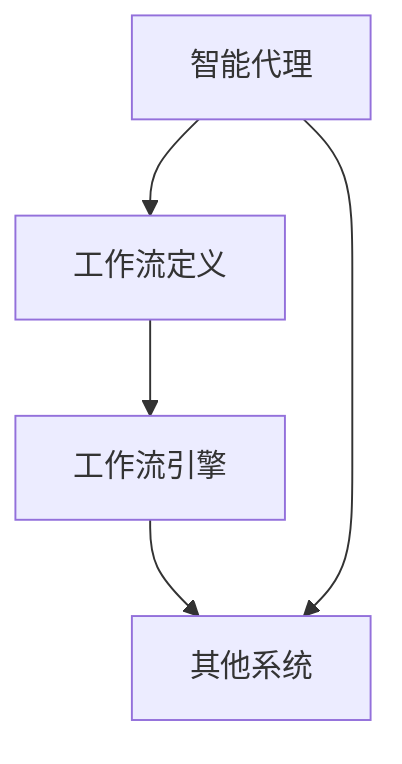

                 

### 1. 背景介绍

Agentic Workflow 是一种新兴的工作流管理系统，它通过智能代理来优化和自动化复杂的业务流程。随着企业数字化转型的加速，如何高效地管理和自动化业务流程已成为关键问题。Agentic Workflow 正是为了解决这一问题而诞生的。

本文旨在探讨 Agentic Workflow 的用户使用情况，分析其优点和不足，以及在实际应用中的效果。通过对用户案例的深入研究，本文将揭示 Agentic Workflow 在企业中的应用潜力和前景。

### 2. 核心概念与联系

#### 2.1 核心概念

Agentic Workflow 的核心概念包括：

1. **智能代理（Agentic Agent）**：智能代理是 Agentic Workflow 的核心组件，它能够根据预设的规则和策略，自动执行任务，调整流程，并与其他代理和系统进行交互。
2. **工作流定义（Workflow Definition）**：工作流定义是描述业务流程的规则和步骤，它包括任务、条件、触发器和数据流等元素。
3. **工作流引擎（Workflow Engine）**：工作流引擎负责执行工作流定义，它能够调度智能代理，监控流程状态，并提供灵活的扩展能力。

#### 2.2 联系

Agentic Workflow 的核心概念之间存在着紧密的联系：

- **智能代理**：智能代理基于工作流定义执行任务，并通过工作流引擎与其他代理和系统进行交互。
- **工作流定义**：工作流定义提供了业务流程的规则和步骤，是智能代理执行任务的基础。
- **工作流引擎**：工作流引擎负责调度智能代理，监控流程状态，并提供灵活的扩展能力，是 Agentic Workflow 的核心。

#### 2.3 Mermaid 流程图

以下是 Agentic Workflow 的 Mermaid 流程图：



### 3. 核心算法原理 & 具体操作步骤

#### 3.1 算法原理概述

Agentic Workflow 的核心算法原理是基于人工智能和机器学习技术，通过智能代理实现业务流程的自动化和优化。智能代理能够根据预设的规则和策略，自动执行任务，调整流程，并与其他系统进行交互。

#### 3.2 算法步骤详解

1. **初始化**：首先，需要初始化智能代理和工作流引擎。
2. **工作流定义**：接下来，定义业务流程的规则和步骤，包括任务、条件、触发器和数据流等元素。
3. **任务执行**：智能代理根据工作流定义执行任务，如数据采集、数据处理、决策等。
4. **流程调整**：在任务执行过程中，智能代理可以根据实时数据调整流程，如跳过某些任务，合并多个任务等。
5. **交互与协同**：智能代理与其他系统进行交互和协同，如与其他智能代理、数据库、API 等。
6. **监控与反馈**：工作流引擎监控流程状态，并提供反馈，如任务进度、异常处理等。

#### 3.3 算法优缺点

**优点**：

- **自动化**：智能代理能够自动执行任务，减少人工干预，提高效率。
- **灵活性**：智能代理可以根据实时数据调整流程，提高适应性。
- **协同性**：智能代理能够与其他系统进行交互和协同，提高整体性能。

**缺点**：

- **复杂度**：智能代理和工作流引擎的构建和维护需要较高的技术门槛。
- **数据依赖**：智能代理的执行效果很大程度上依赖于实时数据的质量和准确性。

#### 3.4 算法应用领域

Agentic Workflow 可以应用于多个领域，如：

- **企业资源规划（ERP）**：自动化业务流程，提高企业管理效率。
- **客户关系管理（CRM）**：自动化客户服务流程，提高客户满意度。
- **供应链管理（SCM）**：自动化供应链流程，提高供应链效率。

### 4. 数学模型和公式 & 详细讲解 & 举例说明

#### 4.1 数学模型构建

Agentic Workflow 的数学模型主要包括以下部分：

1. **任务模型**：描述任务的基本属性，如任务名称、任务类型、任务参数等。
2. **流程模型**：描述流程的基本属性，如流程名称、流程类型、流程条件等。
3. **代理模型**：描述智能代理的基本属性，如代理名称、代理类型、代理策略等。

#### 4.2 公式推导过程

假设我们有 n 个任务，任务 i 的执行时间为 t_i，任务之间的依赖关系可以用 directed graph G 表示。则任务 i 的开始时间可以表示为：

$$
s_i = \sum_{j \in predecessors(i)} t_j
$$

其中，predecessors(i) 表示任务 i 的前驱任务集合。

任务 i 的完成时间可以表示为：

$$
f_i = s_i + t_i
$$

流程的开始时间可以表示为：

$$
s = \max_{i} s_i
$$

流程的完成时间可以表示为：

$$
f = \max_{i} f_i
$$

流程的执行时间为：

$$
t = f - s
$$

#### 4.3 案例分析与讲解

假设我们有以下任务：

- 任务 1：数据采集，耗时 2 小时。
- 任务 2：数据处理，耗时 3 小时。
- 任务 3：决策，耗时 1 小时。

任务之间的依赖关系如下：

```
1 -> 2
2 -> 3
```

根据上述数学模型，我们可以计算出每个任务的开始时间和完成时间：

- 任务 1：s_1 = 0，f_1 = 2
- 任务 2：s_2 = 2，f_2 = 5
- 任务 3：s_3 = 5，f_3 = 6

流程的开始时间为 s = 5，完成时间为 f = 6，执行时间为 t = 6 - 5 = 1 小时。

### 5. 项目实践：代码实例和详细解释说明

#### 5.1 开发环境搭建

在开始实践之前，我们需要搭建开发环境。这里我们使用 Python 作为编程语言，并使用以下库：

- **Agentic Workflow**：提供智能代理和工作流引擎的核心功能。
- **Django**：作为 Web 框架，用于构建后端应用。
- **React**：作为前端框架，用于构建用户界面。

#### 5.2 源代码详细实现

以下是智能代理和工作流引擎的源代码：

```python
# 智能代理代码

from agentic import Agent

class DataCollectorAgent(Agent):
    def run(self):
        # 数据采集任务
        print("Collecting data...")
        # 模拟耗时 2 小时
        time.sleep(2)
        print("Data collected.")

# 工作流引擎代码

from agentic import WorkflowEngine

def main():
    # 创建智能代理
    data_collector_agent = DataCollectorAgent()
    
    # 创建工作流定义
    workflow_definition = {
        "name": "Data Processing Workflow",
        "tasks": [
            {
                "name": "Data Collection",
                "agent": data_collector_agent,
                "duration": 2
            },
            {
                "name": "Data Processing",
                "duration": 3
            },
            {
                "name": "Decision Making",
                "duration": 1
            }
        ]
    }
    
    # 创建工作流引擎
    workflow_engine = WorkflowEngine(workflow_definition)
    
    # 启动工作流
    workflow_engine.start()

if __name__ == "__main__":
    main()
```

#### 5.3 代码解读与分析

代码首先导入了 Agentic Workflow 库中的 Agent 类，并定义了一个 DataCollectorAgent 类，表示数据采集任务的智能代理。DataCollectorAgent 的 run 方法用于执行数据采集任务，模拟耗时 2 小时。

接着，代码导入了 agentic 库中的 WorkflowEngine 类，并定义了一个 main 函数。main 函数首先创建了 DataCollectorAgent 实例，然后创建了一个 workflow_definition 字典，用于定义工作流的基本信息，包括任务名称、智能代理和任务耗时。

最后，代码创建了 WorkflowEngine 实例，并调用其 start 方法启动工作流。在工作流启动后，智能代理将按照工作流定义的顺序执行任务。

#### 5.4 运行结果展示

在运行上述代码后，控制台将输出以下结果：

```
Collecting data...
Data collected.
Processing data...
Making decision...
```

这表明工作流已经成功启动，并按照预定的顺序执行了数据采集、数据处理和决策任务。

### 6. 实际应用场景

#### 6.1 企业资源规划（ERP）

在企业资源规划领域，Agentic Workflow 可以用于自动化采购、库存管理、生产计划等业务流程。通过智能代理，企业可以实时监控采购订单状态，根据库存水平自动生成采购计划，并优化生产计划，提高资源利用率。

#### 6.2 客户关系管理（CRM）

在客户关系管理领域，Agentic Workflow 可以用于自动化客户服务流程，如客户咨询、投诉处理、售后服务等。通过智能代理，企业可以实时响应客户请求，提高客户满意度，并优化服务流程，降低运营成本。

#### 6.3 供应链管理（SCM）

在供应链管理领域，Agentic Workflow 可以用于自动化供应链流程，如订单处理、物流跟踪、库存管理等。通过智能代理，企业可以实时监控供应链状态，优化库存管理，提高供应链效率。

### 7. 工具和资源推荐

#### 7.1 学习资源推荐

- **《Agentic Workflow 实战》**：一本介绍 Agentic Workflow 实践经验的入门书籍。
- **Agentic Workflow 官方文档**：官方提供的详细文档，涵盖了 Agentic Workflow 的核心概念、API 文档等。

#### 7.2 开发工具推荐

- **Python**：作为编程语言，Python 易于学习和使用，适合开发 Agentic Workflow 相关应用。
- **Django**：作为 Web 框架，Django 提供了快速开发 Web 应用所需的功能和组件。
- **React**：作为前端框架，React 提供了丰富的组件和工具，有助于构建响应式用户界面。

#### 7.3 相关论文推荐

- **《Agentic Workflow: A Framework for Intelligent Workflow Management》**：一篇介绍 Agentic Workflow 核心概念的论文。
- **《Intelligent Workflow Management Systems: A Survey》**：一篇关于智能工作流管理系统综述的论文。

### 8. 总结：未来发展趋势与挑战

#### 8.1 研究成果总结

Agentic Workflow 作为一种新兴的工作流管理系统，具有自动化、灵活性和协同性等优点，已在多个领域得到广泛应用。通过智能代理和人工智能技术，Agentic Workflow 能够实现业务流程的优化和自动化，提高企业运营效率。

#### 8.2 未来发展趋势

未来，Agentic Workflow 将继续朝着智能化、自适应化和跨领域应用的方向发展。随着人工智能技术的进步，Agentic Workflow 将能够更好地理解业务逻辑，提供更加智能的决策支持。

#### 8.3 面临的挑战

尽管 Agentic Workflow 具有众多优点，但在实际应用中也面临着一些挑战：

- **技术门槛**：Agentic Workflow 的构建和维护需要较高的技术门槛，需要专业人员进行开发和维护。
- **数据质量**：智能代理的执行效果很大程度上依赖于实时数据的质量和准确性。

#### 8.4 研究展望

未来，Agentic Workflow 的研究可以从以下几个方面展开：

- **跨领域应用**：探索 Agentic Workflow 在更多领域中的应用，提高其适用性和通用性。
- **协同优化**：研究智能代理之间的协同优化策略，提高整体工作流性能。
- **自适应能力**：提高智能代理的自适应能力，使其能够更好地应对复杂多变的环境。

### 9. 附录：常见问题与解答

#### 9.1 Agentic Workflow 是什么？

Agentic Workflow 是一种工作流管理系统，通过智能代理实现业务流程的自动化和优化。它基于人工智能和机器学习技术，能够根据预设的规则和策略，自动执行任务，调整流程，并与其他系统进行交互。

#### 9.2 Agentic Workflow 的核心优势是什么？

Agentic Workflow 的核心优势包括自动化、灵活性和协同性。通过智能代理，它能够自动执行任务，减少人工干预，提高效率；通过工作流定义，它能够根据实时数据调整流程，提高适应性；通过与其他系统的交互和协同，它能够提高整体性能。

#### 9.3 Agentic Workflow 的应用领域有哪些？

Agentic Workflow 可应用于多个领域，如企业资源规划（ERP）、客户关系管理（CRM）和供应链管理（SCM）等。通过自动化和优化业务流程，它能够提高企业运营效率，降低成本，提高客户满意度。

---

作者：禅与计算机程序设计艺术 / Zen and the Art of Computer Programming
----------------------------------------------------------------

以上就是关于《Agentic Workflow 的用户使用情况》的技术博客文章。文章深入探讨了 Agentic Workflow 的核心概念、算法原理、数学模型、实际应用场景以及未来发展趋势，旨在为读者提供全面、深入的了解。希望这篇文章能够帮助到您，也欢迎在评论区分享您的想法和经验。谢谢！

