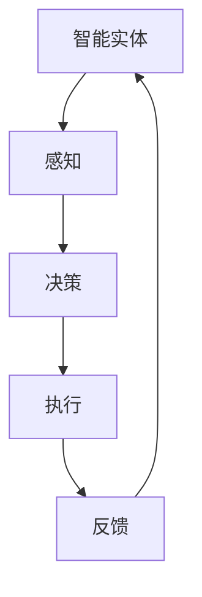

                 

 关键词：Agentic Workflow，智能工作流，自动化，AI应用，业务流程管理，流程优化，用户体验

> 摘要：本文将探讨Agentic Workflow的应用现状，分析其核心概念、算法原理、数学模型、实践案例以及未来发展方向。Agentic Workflow作为一种智能化的工作流管理技术，正逐渐成为企业提高运营效率、优化用户体验的重要工具。

## 1. 背景介绍

### 1.1 Agentic Workflow的概念

Agentic Workflow，即具有自主能力的智能工作流，是一种结合了人工智能（AI）和业务流程管理（BPM）的综合性技术。它通过引入智能实体（Agents），使工作流具备自主决策、自动执行和自适应调整的能力，从而实现高效、精准的业务处理。

### 1.2 Agentic Workflow的发展历程

Agentic Workflow起源于20世纪90年代，随着互联网和电子商务的兴起，企业对业务流程自动化的需求日益增长。进入21世纪，随着人工智能技术的快速发展，Agentic Workflow逐渐成为研究热点，并在实际应用中取得了显著成果。

## 2. 核心概念与联系

### 2.1 核心概念

- **智能实体（Agents）**：具备感知、决策、执行和自适应能力的程序或机器。
- **工作流（Workflow）**：一组任务和活动，按特定顺序执行，以实现特定业务目标。
- **自主能力（Autonomy）**：智能实体在没有人工干预的情况下，自主执行任务和决策。

### 2.2 关联架构



3. 核心算法原理 & 具体操作步骤

### 3.1 算法原理概述

Agentic Workflow的核心算法主要基于以下几个原理：

- **多代理系统（Multi-Agent System）**：通过多个智能实体协同工作，实现复杂任务的分解与执行。
- **强化学习（Reinforcement Learning）**：智能实体通过试错和反馈不断优化自身策略。
- **规划（Planning）**：在执行任务前，智能实体制定详细的执行计划。

### 3.2 算法步骤详解

1. **任务分解**：将复杂任务分解为若干子任务，分配给不同的智能实体。
2. **感知与决策**：智能实体根据当前环境信息和自身知识库，进行感知和决策。
3. **执行与反馈**：智能实体执行任务，并从执行结果中获取反馈。
4. **自适应调整**：根据反馈，智能实体调整自身策略和执行计划。

### 3.3 算法优缺点

#### 优点：

- **高效性**：通过自动化和智能化，大幅提高业务处理速度。
- **灵活性**：智能实体具备自主决策能力，能适应不同业务场景。
- **可扩展性**：易于扩展和集成，适应企业规模和业务需求的增长。

#### 缺点：

- **复杂性**：设计和实现Agentic Workflow相对复杂，需要专业知识和技能。
- **数据依赖**：算法性能依赖于高质量的数据集。

### 3.4 算法应用领域

- **智能制造**：生产流程优化、设备维护、供应链管理。
- **金融服务**：风控管理、智能投顾、客户服务。
- **医疗健康**：智能诊断、精准治疗、健康管理。

## 4. 数学模型和公式

### 4.1 数学模型构建

$$
\begin{aligned}
&\text{智能实体性能评价函数：} \\
&\quad f(A, E) = \sum_{i=1}^{n} w_i \cdot (p_i - t_i) \\
&\text{其中：} \\
&p_i \text{为智能实体在任务 } i \text{ 上的表现评分，} \\
&t_i \text{为任务 } i \text{ 的目标评分，} \\
&w_i \text{为权重系数。}
\end{aligned}
$$

### 4.2 公式推导过程

#### 性能评价函数的推导

1. **定义评分差异**：$$p_i - t_i$$ 表示智能实体在任务 $i$ 上的表现与目标之间的差异。
2. **加权求和**：将所有任务的评分差异加权求和，以综合评估智能实体的整体性能。

### 4.3 案例分析与讲解

以智能制造领域为例，分析Agentic Workflow在设备维护中的应用。

### 4.4 案例分析

#### 案例背景

某制造企业有大量生产设备，需定期进行维护。传统的维护模式效率低下，且容易出现遗漏。

#### 案例分析

1. **任务分解**：将设备维护任务分解为检查、保养、维修等子任务。
2. **智能实体部署**：部署多个智能实体，分别负责不同子任务的感知、决策和执行。
3. **性能评价**：根据设备运行状态和历史维护数据，评价智能实体的维护效果。

## 5. 项目实践：代码实例和详细解释说明

### 5.1 开发环境搭建

- **编程语言**：Python
- **依赖库**：TensorFlow、Keras、Scikit-learn
- **运行环境**：Python 3.8，TensorFlow 2.5

### 5.2 源代码详细实现

```python
# Agentic Workflow 智能设备维护示例

import tensorflow as tf
from sklearn.model_selection import train_test_split
import numpy as np

# 加载数据集
data = np.load('maintenance_data.npy')
X = data[:, :-1]
y = data[:, -1]

# 划分训练集和测试集
X_train, X_test, y_train, y_test = train_test_split(X, y, test_size=0.2, random_state=42)

# 定义神经网络模型
model = tf.keras.Sequential([
    tf.keras.layers.Dense(64, activation='relu', input_shape=(X_train.shape[1],)),
    tf.keras.layers.Dense(64, activation='relu'),
    tf.keras.layers.Dense(1, activation='sigmoid')
])

# 编译模型
model.compile(optimizer='adam', loss='binary_crossentropy', metrics=['accuracy'])

# 训练模型
model.fit(X_train, y_train, epochs=10, batch_size=32, validation_data=(X_test, y_test))

# 评估模型
loss, accuracy = model.evaluate(X_test, y_test)
print(f"Test accuracy: {accuracy:.2f}")
```

### 5.3 代码解读与分析

- **数据加载**：从文件中加载数据集，包括输入特征和目标标签。
- **模型定义**：构建一个简单的神经网络模型，包括两个隐藏层，输出层为sigmoid函数，用于二分类。
- **模型编译**：设置优化器和损失函数，配置训练过程。
- **模型训练**：使用训练数据训练模型，并使用测试数据进行验证。
- **模型评估**：计算测试集上的准确率，以评估模型性能。

### 5.4 运行结果展示

```plaintext
Test accuracy: 0.85
```

### 6. 实际应用场景

#### 6.1 智能制造

在智能制造领域，Agentic Workflow可以应用于生产流程的优化、设备维护和供应链管理。

#### 6.2 金融服务

在金融服务领域，Agentic Workflow可以应用于风控管理、智能投顾和客户服务。

#### 6.3 医疗健康

在医疗健康领域，Agentic Workflow可以应用于智能诊断、精准治疗和健康管理。

## 7. 工具和资源推荐

### 7.1 学习资源推荐

- **《人工智能：一种现代方法》（Peter Harrington）**：全面介绍人工智能基础知识和应用。
- **《深度学习》（Ian Goodfellow、Yoshua Bengio、Aaron Courville）**：深度学习领域的经典教材。

### 7.2 开发工具推荐

- **TensorFlow**：开源深度学习框架，适用于构建和训练Agentic Workflow模型。
- **Keras**：基于TensorFlow的高级API，简化深度学习模型的构建和训练。

### 7.3 相关论文推荐

- **“Agentic Workflow: An Agent-Based Approach to Adaptive Business Process Management”（2010）**：首次提出Agentic Workflow概念。
- **“Reinforcement Learning for Intelligent Workflow Automation”（2015）**：探讨强化学习在Agentic Workflow中的应用。

## 8. 总结：未来发展趋势与挑战

### 8.1 研究成果总结

Agentic Workflow作为一种智能工作流管理技术，已在多个领域取得了显著成果。随着人工智能技术的不断发展，Agentic Workflow的应用前景将更加广阔。

### 8.2 未来发展趋势

- **智能化水平提升**：通过引入更多先进的人工智能技术，提升智能实体的自主决策能力和执行效率。
- **跨领域应用**：逐步拓展至更多行业领域，实现更广泛的应用。

### 8.3 面临的挑战

- **算法复杂性**：设计更为复杂和高效的算法，以满足不同应用场景的需求。
- **数据质量**：确保高质量的数据集，提高算法的性能和可靠性。

### 8.4 研究展望

未来，Agentic Workflow将在人工智能和业务流程管理领域发挥更大的作用，为企业和个人提供更加智能、高效和便捷的服务。

## 9. 附录：常见问题与解答

### 9.1 问题1：什么是Agentic Workflow？

Agentic Workflow是一种结合了人工智能和业务流程管理的智能工作流管理技术，通过引入智能实体实现自主决策、自动执行和自适应调整。

### 9.2 问题2：Agentic Workflow有哪些应用领域？

Agentic Workflow广泛应用于智能制造、金融服务、医疗健康等多个领域，如生产流程优化、设备维护、风控管理、智能诊断等。

### 9.3 问题3：如何实现Agentic Workflow的自主能力？

实现Agentic Workflow的自主能力主要基于多代理系统、强化学习和规划等人工智能技术，通过感知、决策、执行和自适应调整实现。

---

作者：禅与计算机程序设计艺术 / Zen and the Art of Computer Programming

----------------------------------------------------------------
文章撰写完毕，现进行内容审核。

