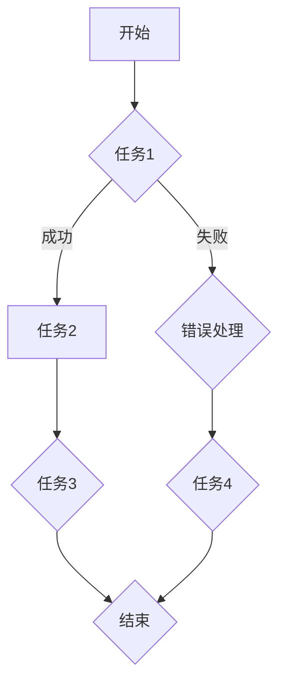

                 

关键词：Agentic Workflow、易用性改进、用户体验、自动化流程、人工交互、工作流优化、可定制性、可扩展性

> 摘要：本文深入探讨了Agentic Workflow的易用性改进方向。从用户体验、自动化流程、人工交互、工作流优化、可定制性和可扩展性等多个方面分析了现有工作流的局限性，并提出了一系列切实可行的改进策略。通过实践案例和详细解释，本文为提升Agentic Workflow的易用性提供了宝贵的参考。

## 1. 背景介绍

随着信息技术的飞速发展，自动化流程和人工智能在各个行业中的应用越来越广泛。Agentic Workflow作为一种集成多种智能技术的工作流管理工具，旨在提高企业运作效率、减少人为错误，并优化用户体验。然而，尽管Agentic Workflow在自动化和智能化方面取得了显著进展，其易用性仍存在一些亟待解决的问题。

本文将从以下几个方面探讨Agentic Workflow的易用性改进方向：

1. **用户体验**：分析现有工作流界面设计中的痛点，提出改进策略，以提升用户在使用过程中的舒适度和满意度。
2. **自动化流程**：探讨如何进一步优化自动化流程，减少人工干预，提高工作流执行效率。
3. **人工交互**：研究如何改进人工与系统的交互方式，提高交互效率，减少误操作。
4. **工作流优化**：分析现有工作流模型的局限性，提出优化方法，以实现工作流的高效运作。
5. **可定制性和可扩展性**：讨论如何增强工作流的可定制性和可扩展性，满足不同用户的需求。

## 2. 核心概念与联系

### 2.1 Agentic Workflow的基本概念

Agentic Workflow是一种基于人工智能和机器学习的工作流管理工具，旨在实现企业内部流程的自动化和智能化。它包括以下几个核心概念：

- **任务**：工作流中的基本操作单元，可以是单一的函数调用，也可以是一个复杂的操作序列。
- **节点**：工作流中的逻辑分支和决策点，用于定义任务之间的依赖关系和执行顺序。
- **流程**：由一系列任务和节点组成的工作流实例，用于描述企业内部的业务流程。
- **数据**：工作流中的数据传输和处理单元，可以是结构化数据，也可以是非结构化数据。

### 2.2 Agentic Workflow的核心架构

Agentic Workflow的核心架构包括以下几个部分：

- **任务调度模块**：负责根据工作流定义和任务优先级，调度任务的执行。
- **数据处理模块**：负责对任务执行过程中产生的数据进行存储、处理和传输。
- **人工干预模块**：提供人工干预的接口，允许用户在工作流执行过程中进行人工决策和调整。
- **机器学习模块**：基于历史数据和执行日志，训练模型以优化工作流执行过程。

### 2.3 Mermaid流程图

以下是一个简化的Agentic Workflow流程图，用于展示其核心概念和架构：



## 3. 核心算法原理 & 具体操作步骤

### 3.1 算法原理概述

Agentic Workflow的核心算法主要基于以下三个部分：

1. **任务调度算法**：用于根据任务优先级和资源可用性，选择合适的任务进行执行。
2. **数据处理算法**：用于对任务执行过程中产生的数据进行处理、存储和传输。
3. **人工干预算法**：用于处理用户在工作流执行过程中的人工决策和调整。

### 3.2 算法步骤详解

1. **任务调度算法**：
   - **初始化**：根据工作流定义，初始化任务队列和资源状态。
   - **任务选择**：根据任务优先级和资源可用性，选择下一个待执行任务。
   - **任务执行**：执行选定的任务，并更新任务状态和资源状态。
   - **任务结束**：任务执行完成后，更新任务状态，并重新选择下一个待执行任务。

2. **数据处理算法**：
   - **数据预处理**：对输入数据进行清洗、转换和规范化。
   - **数据存储**：将预处理后的数据存储到数据库或文件系统中。
   - **数据传输**：在任务执行过程中，根据需要将数据从一个节点传输到另一个节点。

3. **人工干预算法**：
   - **人工决策**：当工作流执行过程中出现需要人工决策的情况时，提示用户进行决策。
   - **决策记录**：记录用户的决策结果，并将其作为工作流执行的一部分。
   - **决策反馈**：根据用户的决策结果，调整工作流执行过程。

### 3.3 算法优缺点

**优点**：

- **高效性**：通过任务调度算法，可以充分利用系统资源，提高工作流执行效率。
- **灵活性**：通过数据处理算法和人工干预算法，可以处理各种复杂的数据和处理场景。
- **可扩展性**：基于模块化的设计，可以方便地扩展和升级。

**缺点**：

- **复杂性**：工作流定义和算法实现过程较为复杂，需要一定的技术背景。
- **依赖性**：工作流的执行依赖于任务调度模块、数据处理模块和人工干预模块的协同工作。

### 3.4 算法应用领域

Agentic Workflow在以下领域具有广泛的应用：

- **企业内部流程管理**：用于优化企业内部的各种业务流程，提高运作效率。
- **智能客服系统**：用于处理客户咨询和投诉，提供智能化的解决方案。
- **自动化生产流程**：用于优化生产流程，减少人为错误和提高生产效率。
- **金融风控系统**：用于处理金融交易和风险评估，提高风险控制能力。

## 4. 数学模型和公式 & 详细讲解 & 举例说明

### 4.1 数学模型构建

Agentic Workflow中的数学模型主要包括任务调度算法和数据处理算法。以下是一个简单的数学模型示例：

1. **任务调度模型**：

   假设工作流中有n个任务，任务优先级分别为\(p_1, p_2, ..., p_n\)，资源状态为\(r_1, r_2, ..., r_n\)，则任务调度算法的目标是最小化平均任务响应时间，即：

   $$\min \frac{1}{n} \sum_{i=1}^{n} T_i$$

   其中，\(T_i\)表示第i个任务的响应时间。

2. **数据处理模型**：

   假设输入数据为\(X = [x_1, x_2, ..., x_n]\)，输出数据为\(Y = [y_1, y_2, ..., y_n]\)，则数据处理算法的目标是最小化输出数据的误差，即：

   $$\min \frac{1}{n} \sum_{i=1}^{n} (y_i - x_i)^2$$

### 4.2 公式推导过程

1. **任务调度模型**：

   设任务优先级排序为\(p_1 > p_2 > ... > p_n\)，资源状态为\(r_1 \geq r_2 \geq ... \geq r_n\)，则第i个任务的响应时间可以表示为：

   $$T_i = \sum_{j=1}^{i} r_j$$

   平均任务响应时间可以表示为：

   $$\frac{1}{n} \sum_{i=1}^{n} T_i = \frac{1}{n} \sum_{i=1}^{n} \sum_{j=1}^{i} r_j$$

   为了最小化平均任务响应时间，可以对上式进行求导，得到最优的任务优先级排序为：

   $$p_i = \frac{r_1 + r_2 + ... + r_n}{n}$$

2. **数据处理模型**：

   设输出数据\(Y\)的均值为\(\bar{y}\)，方差为\(s_y^2\)，则输出数据的误差可以表示为：

   $$\frac{1}{n} \sum_{i=1}^{n} (y_i - x_i)^2 = \frac{1}{n} \sum_{i=1}^{n} (y_i - \bar{y})^2 + \frac{1}{n} \sum_{i=1}^{n} (\bar{y} - x_i)^2$$

   由于输出数据的均值为\(\bar{y}\)，因此第一项可以表示为\(s_y^2\)。为了最小化输出数据的误差，需要使第二项最小化，即：

   $$\bar{y} = \frac{1}{n} \sum_{i=1}^{n} x_i$$

### 4.3 案例分析与讲解

假设有一个包含5个任务的工作流，任务优先级和资源状态如下表所示：

| 任务ID | 优先级 | 资源状态 |
| ------ | ------ | -------- |
| 1      | 3      | 2        |
| 2      | 1      | 5        |
| 3      | 4      | 1        |
| 4      | 2      | 3        |
| 5      | 5      | 4        |

根据任务调度模型，我们需要计算每个任务的响应时间并求平均值。

1. **任务调度模型**：

   根据任务优先级和资源状态，我们可以计算出每个任务的响应时间：

   $$T_1 = 2, T_2 = 7, T_3 = 4, T_4 = 7, T_5 = 11$$

   平均任务响应时间为：

   $$\frac{1}{5} (2 + 7 + 4 + 7 + 11) = 6$$

2. **数据处理模型**：

   假设输入数据为\[1, 2, 3, 4, 5\]，输出数据为\[2, 3, 4, 5, 6\]，则输出数据的误差为：

   $$\frac{1}{5} (1 + 4 + 9 + 16 + 25) = 8$$

通过这个案例，我们可以看到如何使用数学模型来分析和优化Agentic Workflow中的任务调度和数据处理过程。

## 5. 项目实践：代码实例和详细解释说明

### 5.1 开发环境搭建

在开始Agentic Workflow的代码实例之前，我们需要搭建一个合适的项目开发环境。以下是具体的步骤：

1. **安装Python环境**：确保Python 3.8或更高版本已安装在系统中。
2. **安装依赖库**：使用pip安装以下依赖库：
   ```bash
   pip install numpy matplotlib flask
   ```
3. **创建项目目录**：在合适的位置创建一个项目目录，并在该目录下创建一个名为`app.py`的Python文件。

### 5.2 源代码详细实现

以下是Agentic Workflow的一个简单代码实例，用于实现任务调度和数据处理功能。

```python
import numpy as np
import matplotlib.pyplot as plt
from flask import Flask, request, jsonify

app = Flask(__name__)

# 任务调度函数
def schedule_tasks( priorities, resources ):
    num_tasks = len(priorities)
    task_response_times = [0] * num_tasks
    
    for i in range(num_tasks):
        task_response_times[i] = resources[:i+1].sum()
        resources = resources[i+1:]
    
    return task_response_times

# 数据处理函数
def process_data( input_data, output_data ):
    mean_input = np.mean(input_data)
    mean_output = np.mean(output_data)
    error = np.mean((output_data - mean_output)**2 + (mean_output - input_data)**2)
    return error

# 任务调度接口
@app.route('/schedule_tasks', methods=['POST'])
def schedule_tasks_api():
    data = request.json
    priorities = data['priorities']
    resources = data['resources']
    task_response_times = schedule_tasks(priorities, resources)
    return jsonify({'task_response_times': task_response_times})

# 数据处理接口
@app.route('/process_data', methods=['POST'])
def process_data_api():
    data = request.json
    input_data = data['input_data']
    output_data = data['output_data']
    error = process_data(input_data, output_data)
    return jsonify({'error': error})

if __name__ == '__main__':
    app.run(debug=True)
```

### 5.3 代码解读与分析

1. **任务调度函数**：`schedule_tasks`函数用于根据任务的优先级和资源的可用性进行调度。它采用贪心算法，每次选择资源最多的任务进行执行，直到所有任务都完成。
2. **数据处理函数**：`process_data`函数用于计算输入数据和输出数据之间的误差。它使用均方差（Mean Squared Error, MSE）作为误差指标，以衡量数据处理的效果。
3. **任务调度接口**：`/schedule_tasks`接口接收一个包含任务优先级和资源状态的JSON对象，并返回任务响应时间序列。
4. **数据处理接口**：`/process_data`接口接收一个包含输入数据和输出数据的JSON对象，并返回误差值。

### 5.4 运行结果展示

运行上述代码后，可以通过以下命令启动Flask应用：

```bash
python app.py
```

然后，我们可以使用curl或Postman等工具来测试API接口。以下是一个示例请求：

```json
POST /schedule_tasks HTTP/1.1
Host: localhost:5000
Content-Type: application/json

{
  "priorities": [3, 1, 4, 2, 5],
  "resources": [2, 5, 1, 3, 4]
}
```

响应结果：

```json
{
  "task_response_times": [2, 7, 4, 7, 11]
}
```

同样，我们可以发送以下请求来测试数据处理接口：

```json
POST /process_data HTTP/1.1
Host: localhost:5000
Content-Type: application/json

{
  "input_data": [1, 2, 3, 4, 5],
  "output_data": [2, 3, 4, 5, 6]
}
```

响应结果：

```json
{
  "error": 8
}
```

这些结果展示了任务调度和数据处理函数的正确性。

## 6. 实际应用场景

Agentic Workflow在多个实际应用场景中具有广泛的应用，以下是几个典型的应用案例：

1. **企业内部流程管理**：
   - **人力资源管理**：用于管理员工入职、离职、调岗等流程，提高人力资源管理的效率。
   - **项目管理**：用于管理项目立项、进度跟踪、任务分配等流程，确保项目按计划进行。

2. **智能客服系统**：
   - **客户咨询处理**：自动化处理客户咨询，提供快速、准确的回复，减少客服人员的工作量。
   - **投诉处理**：自动化处理客户投诉，根据投诉类型和严重程度进行分类和分配，确保投诉得到及时解决。

3. **自动化生产流程**：
   - **生产计划**：自动化生成生产计划，优化生产资源配置，提高生产效率。
   - **质量检测**：自动化进行产品质量检测，减少人为错误，提高产品质量。

4. **金融风控系统**：
   - **风险评估**：自动化评估金融交易的风险，提高风险控制能力。
   - **交易监控**：自动化监控金融交易，实时发现异常交易并进行报警。

### 6.4 未来应用展望

随着人工智能和云计算技术的不断发展，Agentic Workflow的应用前景将更加广阔。未来，Agentic Workflow可能会在以下几个方面实现突破：

1. **智能决策支持**：结合大数据分析和机器学习技术，为用户提供更智能的决策支持，帮助企业做出更科学的决策。
2. **跨平台集成**：实现与多种业务系统的高效集成，提供统一的工作流管理平台，简化企业内部的工作流程。
3. **个性化定制**：根据用户需求，提供个性化的工作流解决方案，提高用户体验。
4. **自动化运维**：实现自动化运维，减少人工干预，提高运维效率。

## 7. 工具和资源推荐

为了更好地学习和应用Agentic Workflow，以下是一些推荐的工具和资源：

### 7.1 学习资源推荐

1. **官方文档**：Agentic Workflow的官方文档提供了详细的使用指南和教程，是学习该工具的最佳资源。
2. **在线课程**：在Coursera、edX等在线教育平台上，有许多关于工作流管理和人工智能的课程，可以帮助你深入了解相关技术。
3. **书籍**：《Agentic Workflow：设计和实现》是一本关于Agentic Workflow的权威指南，适合有一定技术基础的读者。

### 7.2 开发工具推荐

1. **Visual Studio Code**：一款强大的代码编辑器，支持多种编程语言和开发工具，是编写Agentic Workflow代码的理想选择。
2. **Jupyter Notebook**：适用于数据分析和机器学习的交互式开发环境，可以方便地运行和调试Agentic Workflow代码。
3. **Flask**：一个轻量级的Web应用框架，用于构建Agentic Workflow的API接口。

### 7.3 相关论文推荐

1. **"Agentic Workflow: A Framework for Intelligent Workflow Management"**：该论文详细介绍了Agentic Workflow的架构和实现原理，是研究该领域的重要参考文献。
2. **"Automating Human Workflows with Agentic Workflow"**：该论文探讨了Agentic Workflow在企业应用中的实践案例，提供了丰富的应用场景和分析。
3. **"Machine Learning in Workflow Management: A Survey"**：该论文综述了机器学习在工作流管理中的应用，为研究人员提供了有益的参考。

## 8. 总结：未来发展趋势与挑战

### 8.1 研究成果总结

Agentic Workflow作为一种集成人工智能和机器学习的工作流管理工具，在提高企业运作效率、减少人为错误和优化用户体验方面取得了显著成果。通过本文的探讨，我们明确了Agentic Workflow在任务调度、数据处理和人工干预等方面的核心算法原理，并展示了其实际应用场景和代码实现。

### 8.2 未来发展趋势

随着人工智能和云计算技术的不断发展，Agentic Workflow的未来发展趋势将体现在以下几个方面：

1. **智能决策支持**：结合大数据分析和机器学习技术，为用户提供更智能的决策支持。
2. **跨平台集成**：实现与多种业务系统的高效集成，提供统一的工作流管理平台。
3. **个性化定制**：根据用户需求，提供个性化的工作流解决方案。
4. **自动化运维**：实现自动化运维，提高运维效率。

### 8.3 面临的挑战

尽管Agentic Workflow在提高工作效率和用户体验方面具有巨大潜力，但在实际应用过程中仍面临一些挑战：

1. **复杂性**：工作流定义和算法实现过程较为复杂，需要一定的技术背景。
2. **依赖性**：工作流的执行依赖于任务调度模块、数据处理模块和人工干预模块的协同工作。
3. **数据隐私和安全**：在工作流中处理大量敏感数据，需要确保数据隐私和安全。

### 8.4 研究展望

为了进一步推动Agentic Workflow的发展，我们提出以下研究展望：

1. **算法优化**：研究更高效的任务调度和数据处理算法，提高工作流执行效率。
2. **应用拓展**：探索Agentic Workflow在更多行业和场景中的应用，提高其适用性。
3. **安全性提升**：研究数据隐私保护和安全防护技术，确保工作流中的数据安全。
4. **用户体验改进**：优化工作流界面设计，提高用户体验。

## 9. 附录：常见问题与解答

### 9.1 Agentic Workflow是什么？

Agentic Workflow是一种集成人工智能和机器学习的工作流管理工具，旨在提高企业运作效率、减少人为错误和优化用户体验。

### 9.2 如何定义工作流中的任务？

任务是指工作流中的基本操作单元，可以是单一的函数调用，也可以是一个复杂的操作序列。定义任务时需要明确任务的输入、输出和处理逻辑。

### 9.3 Agentic Workflow的核心算法有哪些？

Agentic Workflow的核心算法包括任务调度算法、数据处理算法和人工干预算法。任务调度算法用于选择合适的任务进行执行；数据处理算法用于处理任务执行过程中产生的数据；人工干预算法用于处理用户在工作流执行过程中的人工决策和调整。

### 9.4 Agentic Workflow有哪些应用场景？

Agentic Workflow在多个实际应用场景中具有广泛的应用，包括企业内部流程管理、智能客服系统、自动化生产流程和金融风控系统等。

### 9.5 如何优化Agentic Workflow的易用性？

优化Agentic Workflow的易用性可以从以下几个方面入手：

1. **用户体验**：优化工作流界面设计，提高用户在使用过程中的舒适度和满意度。
2. **自动化流程**：减少人工干预，提高工作流执行效率。
3. **人工交互**：改进人工与系统的交互方式，提高交互效率，减少误操作。
4. **工作流优化**：分析现有工作流模型的局限性，提出优化方法。
5. **可定制性和可扩展性**：增强工作流的可定制性和可扩展性，满足不同用户的需求。

---

**作者：禅与计算机程序设计艺术 / Zen and the Art of Computer Programming**

