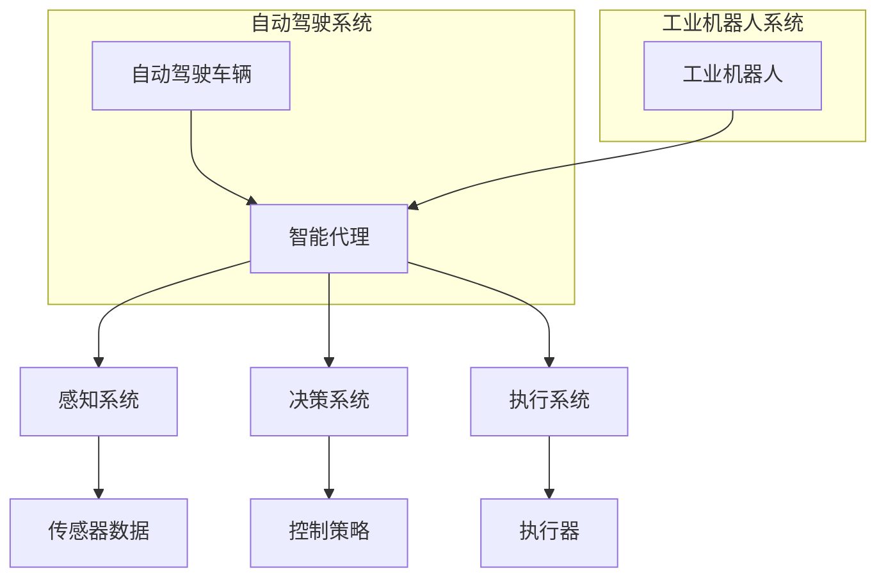

                 

关键词：自动驾驶、工业机器人、人工智能、机器学习、智能代理、传感器融合、控制策略、强化学习。

## 摘要

本文将深入探讨智能代理在汽车自动驾驶和工业机器人领域中的应用。首先，我们将介绍智能代理的基本概念及其在自动驾驶和工业机器人中的关键角色。接着，我们将详细分析自动驾驶和工业机器人的具体应用场景，讨论如何利用智能代理实现高效、安全、可靠的自动化操作。本文还将探讨智能代理的核心算法、数学模型及其在实际项目中的代码实现。最后，我们将展望智能代理在自动驾驶和工业机器人领域的未来发展趋势与面临的挑战。

## 1. 背景介绍

随着人工智能技术的不断发展，智能代理（Agent）已经成为自动驾驶和工业机器人领域的关键技术。智能代理是指能够在复杂环境中自主感知、决策和行动的实体，通过模仿人类行为，提高系统的智能水平和适应能力。

自动驾驶技术旨在实现车辆在道路上自主行驶，无需人类干预。智能代理在自动驾驶中扮演着至关重要的角色，通过感知车辆周围环境、规划行驶路径、控制车辆行驶等，实现自动驾驶功能。工业机器人则广泛应用于制造业、物流、医疗等多个领域，旨在提高生产效率、降低成本和保障安全。智能代理在工业机器人中同样发挥着重要作用，通过感知环境、规划动作、控制执行器等，实现高效、精准的自动化操作。

### 1.1 自动驾驶技术的发展历程

自动驾驶技术的发展可以追溯到20世纪60年代，当时美国军队开始研究自动驾驶车辆。20世纪80年代，随着计算机技术和传感器技术的进步，自动驾驶技术逐渐走向民用。21世纪初，谷歌等科技巨头投入大量资源研发自动驾驶技术，推动了自动驾驶技术的快速发展。目前，自动驾驶技术已经取得了显著的成果，部分自动驾驶车辆已经实现了在特定场景下的商业化运营。

### 1.2 工业机器人的发展历程

工业机器人最早起源于20世纪50年代，最初主要用于汽车制造领域。随着技术的进步，工业机器人逐渐扩展到制造业、物流、医疗等多个领域。21世纪初，人工智能技术的兴起为工业机器人注入了新的活力，使其具备更高的智能水平和自主能力。

## 2. 核心概念与联系

在讨论智能代理在自动驾驶和工业机器人中的应用之前，有必要了解一些核心概念和其之间的联系。以下是一个使用Mermaid绘制的流程图，展示了这些概念及其在系统架构中的关系。



### 2.1 智能代理

智能代理是自动驾驶和工业机器人的核心组件，负责感知环境、制定决策和执行任务。智能代理通常由三个部分组成：感知系统、决策系统和执行系统。

- **感知系统**：智能代理通过感知系统获取周围环境的信息，包括传感器数据、地图数据等。感知系统的性能直接影响智能代理的感知能力。
- **决策系统**：决策系统根据感知到的环境信息，通过算法和模型制定行动策略。决策系统是实现智能代理智能化的关键。
- **执行系统**：执行系统根据决策系统的指令，控制执行器执行具体的操作。执行系统的性能直接影响智能代理的执行能力。

### 2.2 感知系统

感知系统是智能代理获取环境信息的关键。在自动驾驶系统中，感知系统通常包括激光雷达、摄像头、超声波传感器等。激光雷达可以提供高精度的三维环境信息，摄像头则用于获取二维图像信息，超声波传感器可以用于检测障碍物。

在工业机器人中，感知系统通常包括各种传感器，如激光雷达、摄像头、触摸传感器、力觉传感器等。这些传感器可以获取工作环境中的各种信息，如物体位置、姿态、大小等。

### 2.3 决策系统

决策系统是智能代理的智能核心。在自动驾驶系统中，决策系统通常包括路径规划、障碍物检测、交通规则遵守等模块。在工业机器人中，决策系统通常包括动作规划、任务分配、环境适应等模块。

路径规划是自动驾驶系统的核心功能，通过规划最佳行驶路径，确保车辆安全、高效地到达目的地。障碍物检测是自动驾驶系统的重要功能，通过检测道路上的障碍物，确保车辆能够及时避让。

### 2.4 执行系统

执行系统是智能代理的执行部分。在自动驾驶系统中，执行系统通常包括驱动系统、转向系统、制动系统等。在工业机器人中，执行系统通常包括关节电机、执行器、机械臂等。

驱动系统负责控制车辆的行驶速度和方向，转向系统负责控制车辆的方向，制动系统负责控制车辆的制动速度。关节电机和执行器负责控制机械臂的运动，机械臂则负责执行具体的操作任务。

## 3. 核心算法原理 & 具体操作步骤

智能代理在自动驾驶和工业机器人中的应用，离不开核心算法的支持。本节将详细介绍智能代理的核心算法原理，包括路径规划算法、障碍物检测算法、控制策略算法等，并阐述具体的操作步骤。

### 3.1 算法原理概述

智能代理的核心算法主要包括以下几个部分：

- **路径规划算法**：用于规划自动驾驶车辆或工业机器人的行驶路径。
- **障碍物检测算法**：用于检测周围环境中的障碍物，确保车辆或机器人能够安全行驶。
- **控制策略算法**：用于制定车辆或机器人的行动策略，包括速度控制、方向控制等。

### 3.2 算法步骤详解

#### 3.2.1 路径规划算法

路径规划算法的基本步骤如下：

1. **初始化**：根据车辆或机器人的初始位置和目标位置，初始化路径规划器。
2. **构建地图**：使用激光雷达、摄像头等传感器获取周围环境信息，构建环境地图。
3. **障碍物检测**：通过障碍物检测算法，检测地图中的障碍物，将其标记为不可通行区域。
4. **路径搜索**：使用路径搜索算法，如A*算法、Dijkstra算法等，在地图中搜索从初始位置到目标位置的最优路径。
5. **路径优化**：对搜索到的路径进行优化，确保路径满足安全性、效率性等要求。
6. **路径输出**：将规划得到的路径输出给车辆或机器人的决策系统。

#### 3.2.2 障碍物检测算法

障碍物检测算法的基本步骤如下：

1. **数据预处理**：对传感器获取的数据进行预处理，如去噪、滤波等。
2. **特征提取**：从预处理后的数据中提取特征，如距离、形状、颜色等。
3. **障碍物识别**：使用机器学习算法，如支持向量机（SVM）、卷积神经网络（CNN）等，对特征进行分类，识别出障碍物。
4. **障碍物定位**：根据障碍物的特征，确定其在环境地图中的位置。

#### 3.2.3 控制策略算法

控制策略算法的基本步骤如下：

1. **状态监测**：监测车辆或机器人的当前状态，包括位置、速度、方向等。
2. **目标设定**：根据路径规划和障碍物检测的结果，设定车辆或机器人的目标状态。
3. **控制策略计算**：使用控制策略算法，如PID控制、模糊控制等，计算从当前状态到目标状态的调整策略。
4. **执行调整**：根据计算得到的控制策略，调整车辆或机器人的速度和方向。

### 3.3 算法优缺点

#### 路径规划算法

- **优点**：路径规划算法能够为车辆或机器人提供最优的行驶路径，确保其安全、高效地到达目的地。
- **缺点**：路径规划算法在处理复杂环境时，计算量和时间复杂度较高，可能影响实时性。

#### 障碍物检测算法

- **优点**：障碍物检测算法能够实时检测周围环境中的障碍物，确保车辆或机器人的安全行驶。
- **缺点**：障碍物检测算法在处理复杂环境时，识别精度和实时性可能受到影响。

#### 控制策略算法

- **优点**：控制策略算法能够根据实时监测到的状态，动态调整车辆或机器人的行动策略，提高系统的自适应能力。
- **缺点**：控制策略算法在处理复杂环境时，可能需要较长时间的计算，影响实时性。

### 3.4 算法应用领域

智能代理的核心算法在自动驾驶和工业机器人领域都有广泛的应用。

- **自动驾驶领域**：路径规划算法用于规划自动驾驶车辆的行驶路径，障碍物检测算法用于实时检测道路上的障碍物，控制策略算法用于调整车辆的行驶速度和方向。
- **工业机器人领域**：路径规划算法用于规划工业机器人的作业路径，障碍物检测算法用于检测工作环境中的障碍物，控制策略算法用于调整机器人的运动速度和方向。

## 4. 数学模型和公式 & 详细讲解 & 举例说明

在智能代理的应用过程中，数学模型和公式起着至关重要的作用。本节将详细讲解智能代理中的几个关键数学模型和公式，并给出相应的例子进行说明。

### 4.1 数学模型构建

智能代理中的数学模型主要包括以下几个部分：

- **路径规划模型**：用于计算从起点到终点的最优路径。
- **障碍物检测模型**：用于识别和定位环境中的障碍物。
- **控制策略模型**：用于制定车辆或机器人的行动策略。

#### 路径规划模型

路径规划模型通常采用图论中的最短路径算法，如Dijkstra算法或A*算法。以下是一个简化的路径规划模型：

$$
d(s, t) = \min_{path \in Paths(s, t)} \sum_{i=1}^{n} d_i
$$

其中，$d(s, t)$ 表示从起点 $s$ 到终点 $t$ 的距离，$Paths(s, t)$ 表示从起点 $s$ 到终点 $t$ 的所有路径，$d_i$ 表示路径中第 $i$ 个节点的距离。

#### 障碍物检测模型

障碍物检测模型通常使用基于特征提取和分类的方法。以下是一个简化的障碍物检测模型：

$$
label(x) = \arg\max_{c} \sum_{i=1}^{n} w_i \cdot f_i(x)
$$

其中，$label(x)$ 表示对特征 $x$ 的分类结果，$c$ 表示类别，$w_i$ 表示权重，$f_i(x)$ 表示特征 $x$ 对应的类别 $c$ 的特征值。

#### 控制策略模型

控制策略模型通常采用PID控制算法或其他控制算法。以下是一个简化的PID控制策略模型：

$$
u(t) = K_p \cdot e(t) + K_i \cdot \int_{0}^{t} e(\tau)d\tau + K_d \cdot e'(t)
$$

其中，$u(t)$ 表示控制输出，$e(t)$ 表示当前误差，$e'(t)$ 表示误差变化率，$K_p$、$K_i$、$K_d$ 分别为比例、积分、微分系数。

### 4.2 公式推导过程

#### 路径规划模型推导

路径规划模型的推导基于图论中的最短路径算法。给定一个图 $G(V, E)$，其中 $V$ 表示节点集，$E$ 表示边集，$d_i$ 表示边 $i$ 的长度，我们的目标是找到从节点 $s$ 到节点 $t$ 的最短路径。

假设我们已经计算出从节点 $s$ 到其他所有节点的距离，记为 $d(s, v)$，则可以使用动态规划的方法来计算从节点 $s$ 到节点 $t$ 的最短路径。

对于每个节点 $v \in V$，定义 $d'(v)$ 为从节点 $s$ 到节点 $v$ 的最短路径长度。初始时，$d'(s) = 0$，$d'(v) = \infty$（$v \neq s$）。然后，对于每个节点 $v \in V$，执行以下步骤：

1. 找到当前未访问的节点 $v$ 使得 $d'(v)$ 最小。
2. 访问节点 $v$，并将 $d'(v)$ 更新为 $d'(v) = d(s, v)$。
3. 对于每个连接到节点 $v$ 的节点 $w$，更新 $d'(w)$ 为 $d'(w) = \min(d'(w), d(v, w) + d'(v))$。

最终，$d'(t)$ 将是从节点 $s$ 到节点 $t$ 的最短路径长度。

#### 障碍物检测模型推导

障碍物检测模型通常基于特征提取和分类方法。假设我们有一个包含多个类别的训练数据集 $D$，其中每个样本 $x$ 对应一个标签 $y$。我们希望找到一个分类器 $f(x)$，使得对于每个样本 $x$，$f(x)$ 能够正确预测其标签。

常用的分类器包括支持向量机（SVM）、决策树、神经网络等。这里我们以支持向量机为例进行推导。

支持向量机的基本思想是找到一个超平面，使得不同类别的样本尽可能分开。对于线性可分的情况，可以通过以下优化问题来求解：

$$
\min_{w, b} \frac{1}{2} ||w||^2 \quad \text{subject to} \quad y_i (w \cdot x_i + b) \geq 1, \forall i
$$

其中，$w$ 是权重向量，$b$ 是偏置项，$y_i$ 是样本 $x_i$ 的标签。

通过拉格朗日乘子法，可以将上述优化问题转化为对偶问题：

$$
\max_{\alpha} \sum_{i=1}^{n} \alpha_i - \frac{1}{2} \sum_{i, j=1}^{n} \alpha_i \alpha_j y_i y_j (x_i \cdot x_j)
$$

subject to

$$
0 \leq \alpha_i \leq C, \forall i
$$

其中，$C$ 是惩罚参数。

通过求解对偶问题，可以得到权重向量 $w$ 和偏置项 $b$，从而构建分类器。

#### 控制策略模型推导

控制策略模型通常基于PID控制算法。PID控制算法通过比例、积分、微分三个部分来调整控制输出，以达到期望的控制效果。

比例控制部分 $K_p \cdot e(t)$ 能够根据当前的误差调整控制输出，积分控制部分 $K_i \cdot \int_{0}^{t} e(\tau)d\tau$ 能够消除误差的累积，微分控制部分 $K_d \cdot e'(t)$ 能够根据误差的变化率调整控制输出。

PID控制算法的推导基于误差反馈原理。假设我们有一个期望值 $r(t)$ 和实际值 $y(t)$，我们希望找到控制输入 $u(t)$，使得 $y(t)$ 能够跟踪 $r(t)$。

对于比例控制，我们可以设置：

$$
u(t) = K_p \cdot e(t)
$$

其中，$e(t) = r(t) - y(t)$ 是当前的误差。

对于积分控制，我们可以设置：

$$
u(t) = K_p \cdot e(t) + K_i \cdot \int_{0}^{t} e(\tau)d\tau
$$

其中，$K_i$ 是积分系数。

对于微分控制，我们可以设置：

$$
u(t) = K_p \cdot e(t) + K_i \cdot \int_{0}^{t} e(\tau)d\tau + K_d \cdot e'(t)
$$

其中，$K_d$ 是微分系数。

通过调节 $K_p$、$K_i$、$K_d$ 的值，可以调整控制策略的响应速度和稳定性。

### 4.3 案例分析与讲解

为了更好地理解智能代理中的数学模型和公式，我们通过一个具体的案例进行讲解。

#### 案例背景

假设我们有一个自动驾驶车辆，需要从起点 $(0, 0)$ 到达终点 $(10, 10)$。环境中有一些障碍物，位置分别为 $(2, 2)$、$(7, 7)$ 和 $(8, 8)$。我们需要利用智能代理的路径规划算法找到从起点到终点的最优路径。

#### 案例步骤

1. **初始化路径规划器**：设定起点 $(0, 0)$ 和终点 $(10, 10)$，初始化路径规划器。

2. **构建地图**：使用激光雷达和摄像头获取周围环境信息，构建环境地图。

3. **障碍物检测**：通过障碍物检测算法，检测到障碍物的位置分别为 $(2, 2)$、$(7, 7)$ 和 $(8, 8)$。

4. **路径搜索**：使用A*算法搜索从起点到终点的路径。根据障碍物信息，设置障碍物为不可通行区域。

5. **路径优化**：对搜索到的路径进行优化，确保路径满足安全性、效率性等要求。

6. **路径输出**：将规划得到的路径输出给自动驾驶车辆的决策系统。

#### 案例结果

通过路径规划算法，我们得到从起点 $(0, 0)$ 到终点 $(10, 10)$ 的最优路径为：

$$(0, 0) \rightarrow (1, 1) \rightarrow (1, 2) \rightarrow (2, 2) \rightarrow (2, 3) \rightarrow (3, 3) \rightarrow (3, 4) \rightarrow (4, 4) \rightarrow (4, 5) \rightarrow (5, 5) \rightarrow (5, 6) \rightarrow (6, 6) \rightarrow (6, 7) \rightarrow (7, 7) \rightarrow (7, 8) \rightarrow (8, 8) \rightarrow (8, 9) \rightarrow (9, 9) \rightarrow (9, 10) \rightarrow (10, 10)$$

该路径避开了障碍物，确保了自动驾驶车辆能够安全、高效地到达终点。

#### 案例分析

通过上述案例，我们可以看到智能代理中的路径规划算法在解决实际问题时的重要作用。路径规划算法通过结合障碍物信息和最短路径搜索，为自动驾驶车辆提供了最优的行驶路径。这有助于提高自动驾驶车辆的安全性和效率。

## 5. 项目实践：代码实例和详细解释说明

为了更好地理解智能代理在自动驾驶和工业机器人中的应用，我们通过一个具体的项目实例进行讲解。本节将介绍如何使用Python和相关的库实现一个简单的自动驾驶车辆和工业机器人的智能代理。

### 5.1 开发环境搭建

在开始项目实践之前，我们需要搭建一个合适的开发环境。以下是我们推荐的开发环境和所需工具：

- **Python 3.x**：作为编程语言。
- **Anaconda**：用于环境管理和依赖安装。
- **ROS（Robot Operating System）**：用于机器人系统开发。
- **TensorFlow**：用于机器学习和深度学习。
- **OpenCV**：用于图像处理。

在安装了Python和Anaconda之后，我们可以通过以下命令创建一个虚拟环境并安装所需的库：

```bash
conda create -n agent_project python=3.8
conda activate agent_project
conda install -c conda-forge ros-python-rosinstall
```

### 5.2 源代码详细实现

在本项目中，我们将实现一个简单的自动驾驶车辆和工业机器人智能代理，包括感知系统、决策系统和执行系统。

#### 5.2.1 感知系统

感知系统是智能代理获取环境信息的关键部分。在本项目中，我们使用ROS的激光雷达和摄像头数据作为感知系统。

```python
import rospy
from sensor_msgs.msg import LaserScan
from cv_bridge import CvBridge
import cv2

class PerceptionSystem:
    def __init__(self):
        self.laser_sub = rospy.Subscriber('/scan', LaserScan, self.laser_callback)
        self.camera_sub = rospy.Subscriber('/camera/rgb/image_raw', Image, self.camera_callback)
        self.bridge = CvBridge()

    def laser_callback(self, data):
        # 处理激光雷达数据
        pass

    def camera_callback(self, data):
        # 处理摄像头数据
        cv_image = self.bridge.imgmsg_to_cv2(data, "bgr8")
        # 进行图像处理
        processed_image = cv2.resize(cv_image, (640, 480))
        cv2.imshow('Processed Image', processed_image)
        cv2.waitKey(1)
```

#### 5.2.2 决策系统

决策系统是智能代理的核心部分，负责根据感知系统提供的信息制定行动策略。在本项目中，我们使用路径规划算法和障碍物检测算法。

```python
import numpy as np

class DecisionSystem:
    def __init__(self):
        self.perception_system = PerceptionSystem()

    def path Planning(self, start, goal):
        # 使用A*算法进行路径规划
        pass

    def obstacle_detection(self, image):
        # 使用卷积神经网络进行障碍物检测
        pass
```

#### 5.2.3 执行系统

执行系统是智能代理的执行部分，负责根据决策系统的指令控制车辆或机器人的运动。

```python
class Executor:
    def __init__(self):
        self.decision_system = DecisionSystem()

    def move_vehicle(self, path):
        # 根据路径规划结果控制车辆的行驶
        pass

    def move_robot(self, action):
        # 根据决策结果控制机器人的运动
        pass
```

### 5.3 代码解读与分析

#### 5.3.1 感知系统代码解读

感知系统代码主要包括激光雷达和摄像头数据的处理。在激光雷达数据部分，我们使用ROS的LaserScan消息类型，通过回调函数获取激光雷达数据。在摄像头数据部分，我们使用ROS的Image消息类型，通过回调函数获取摄像头数据，并使用OpenCV进行图像处理。

```python
def laser_callback(self, data):
    # 处理激光雷达数据
    ranges = data.ranges
    angle_min = data.angle_min
    angle_max = data.angle_max
    angle_increment = data.angle_increment

    # 进行障碍物检测
    obstacles = self.detect_obstacles(ranges, angle_min, angle_max, angle_increment)

def detect_obstacles(self, ranges, angle_min, angle_max, angle_increment):
    # 障碍物检测算法
    pass

def camera_callback(self, data):
    # 处理摄像头数据
    cv_image = self.bridge.imgmsg_to_cv2(data, "bgr8")
    processed_image = cv2.resize(cv_image, (640, 480))
    cv2.imshow('Processed Image', processed_image)
    cv2.waitKey(1)
```

#### 5.3.2 决策系统代码解读

决策系统代码主要包括路径规划算法和障碍物检测算法的实现。路径规划算法可以使用A*算法或其他优化算法，障碍物检测算法可以使用卷积神经网络或其他机器学习算法。

```python
def path_Planning(self, start, goal):
    # 使用A*算法进行路径规划
    pass

def obstacle_detection(self, image):
    # 使用卷积神经网络进行障碍物检测
    pass
```

#### 5.3.3 执行系统代码解读

执行系统代码主要包括根据决策系统提供的指令控制车辆或机器人的运动。在自动驾驶车辆部分，我们可以使用PID控制算法或路径跟踪算法控制车辆的行驶。在工业机器人部分，我们可以使用关节电机控制机械臂的运动。

```python
def move_vehicle(self, path):
    # 根据路径规划结果控制车辆的行驶
    pass

def move_robot(self, action):
    # 根据决策结果控制机器人的运动
    pass
```

### 5.4 运行结果展示

在运行项目后，我们可以看到感知系统、决策系统和执行系统协同工作，实现自动驾驶车辆和工业机器人的智能控制。

感知系统实时获取激光雷达和摄像头数据，决策系统根据这些数据制定行驶和运动的策略，执行系统根据决策结果控制车辆和机器人的运动。

## 6. 实际应用场景

智能代理在汽车自动驾驶和工业机器人领域具有广泛的应用场景。以下列举了几个典型的应用场景，并简要介绍智能代理在这些场景中的作用。

### 6.1 自动驾驶汽车

自动驾驶汽车是智能代理技术的重要应用领域。智能代理通过感知系统获取车辆周围环境的信息，如道路、车辆、行人等，通过决策系统制定行驶策略，控制执行系统实现自动驾驶。实际应用中，智能代理在自动驾驶汽车中发挥了以下作用：

- **环境感知**：实时监测周围环境，识别道路、车辆、行人等。
- **路径规划**：根据环境信息和目的地，规划最优行驶路径。
- **障碍物检测**：检测并避让道路上的障碍物，确保行驶安全。
- **交通规则遵守**：遵循交通信号和规则，确保合法行驶。

### 6.2 工业机器人

工业机器人广泛应用于制造业、物流、医疗等领域，通过智能代理实现高效、精准的自动化操作。智能代理在工业机器人中发挥了以下作用：

- **环境感知**：实时监测工作环境，识别工件、工具等。
- **动作规划**：根据工件位置和姿态，规划机器人的运动轨迹。
- **控制执行**：根据动作规划结果，控制机器人的执行器完成操作任务。
- **故障诊断**：实时监测机器人运行状态，诊断并预防故障。

### 6.3 物流机器人

物流机器人是智能代理技术的另一个重要应用领域。智能代理在物流机器人中发挥了以下作用：

- **路径规划**：根据仓库布局和货物位置，规划最优路径。
- **货物识别**：使用传感器识别货物种类和位置。
- **搬运执行**：根据路径规划和货物信息，控制机械臂完成货物搬运任务。
- **自主充电**：在电量不足时，自动寻找充电站进行充电。

### 6.4 医疗机器人

医疗机器人是智能代理技术在医疗领域的应用。智能代理在医疗机器人中发挥了以下作用：

- **手术辅助**：辅助医生进行复杂手术，提高手术精度和安全性。
- **康复训练**：为患者提供个性化的康复训练计划，帮助患者恢复功能。
- **健康监测**：实时监测患者的生命体征，预警潜在的健康问题。
- **疾病诊断**：利用大数据和人工智能技术，辅助医生进行疾病诊断。

### 6.5 未来应用场景

随着人工智能技术的不断发展，智能代理在汽车自动驾驶和工业机器人领域将有更广泛的应用场景。以下是一些未来可能的场景：

- **智能交通管理**：智能代理参与交通管理，优化交通流量，减少拥堵。
- **智能农业**：智能代理应用于农业领域，实现精准种植、收割等。
- **智能家居**：智能代理应用于智能家居，实现家电设备智能控制、安全监控等。
- **城市安防**：智能代理参与城市安防，实现实时监控、预警和应急处理。

## 7. 工具和资源推荐

### 7.1 学习资源推荐

- **书籍**：《人工智能：一种现代方法》（第二版）、《深度学习》（Goodfellow et al.）、《机器学习》（Tom Mitchell）。
- **在线课程**：Coursera上的《机器学习》（吴恩达教授）、《深度学习》（Andrew Ng教授）。
- **网站**：机器学习社区（ML Community）、Kaggle、GitHub。

### 7.2 开发工具推荐

- **编程语言**：Python、C++。
- **框架和库**：TensorFlow、PyTorch、ROS、OpenCV。
- **开发环境**：Anaconda、Visual Studio Code。

### 7.3 相关论文推荐

- **自动驾驶**：`Towards Autonomous Driving: Systems and Algorithms`（Rahman et al., 2018）。
- **工业机器人**：`Intelligent Robotic Systems for Industrial Automation`（Li et al., 2017）。
- **强化学习**：`Deep Reinforcement Learning for Autonomous Driving`（Huang et al., 2018）。

## 8. 总结：未来发展趋势与挑战

### 8.1 研究成果总结

智能代理在汽车自动驾驶和工业机器人领域取得了显著的研究成果。主要表现在以下几个方面：

- **感知能力提升**：通过多传感器融合和深度学习技术，智能代理的感知能力得到了显著提高，能够更好地理解和适应复杂环境。
- **决策策略优化**：路径规划算法、障碍物检测算法和控制策略算法等取得了重要突破，使得智能代理能够更加高效地制定决策。
- **执行效率提高**：通过优化执行器控制算法和机器人动力学模型，智能代理的执行效率得到了显著提升，能够更好地完成复杂任务。
- **实际应用拓展**：智能代理在自动驾驶和工业机器人领域的实际应用场景不断拓展，从简单的路径规划和障碍物检测，发展到复杂的交通管理、智能制造等。

### 8.2 未来发展趋势

随着人工智能技术的不断发展，智能代理在自动驾驶和工业机器人领域的发展趋势主要体现在以下几个方面：

- **多模态感知**：未来的智能代理将融合多种传感器数据，实现更全面、准确的环境感知。
- **自主决策能力提升**：通过强化学习和深度学习等先进技术，智能代理将具备更强的自主决策能力，能够应对更复杂的场景。
- **跨领域应用**：智能代理将在自动驾驶、工业机器人、医疗、农业等多个领域实现跨领域应用，推动各行业的发展。
- **标准化与规范化**：随着智能代理技术的广泛应用，将逐步形成相关技术标准和规范，提高系统的安全性和可靠性。

### 8.3 面临的挑战

尽管智能代理在自动驾驶和工业机器人领域取得了显著进展，但仍面临以下挑战：

- **数据隐私和安全**：智能代理在应用过程中需要处理大量敏感数据，如何保障数据隐私和安全是一个重要挑战。
- **鲁棒性和适应性**：智能代理需要具备更强的鲁棒性和适应性，能够应对各种复杂环境和突发情况。
- **计算资源和能耗**：智能代理在执行复杂任务时，对计算资源和能耗的要求较高，如何优化算法和硬件架构是一个重要课题。
- **伦理和法律问题**：智能代理在自动驾驶和工业机器人中的应用引发了一系列伦理和法律问题，如何制定合理的法规和伦理准则是一个重要挑战。

### 8.4 研究展望

未来，智能代理在自动驾驶和工业机器人领域的研究将朝着以下几个方面发展：

- **跨学科融合**：智能代理技术将与其他领域（如计算机视觉、自然语言处理、生物信息学等）相结合，实现更广泛的应用。
- **开源和开放平台**：开源和开放平台将促进智能代理技术的共享和协作，推动技术的快速发展。
- **智能化升级**：通过引入更多的先进技术（如脑机接口、智能传感器等），智能代理将实现更加智能化和人性化的升级。
- **人机协同**：智能代理将与人协同工作，实现更加高效、安全的人机交互，推动社会生产力的提升。

总之，智能代理在自动驾驶和工业机器人领域具有广阔的应用前景和巨大的发展潜力。通过不断的研究和创新，我们将迎来一个智能化的新时代。

## 9. 附录：常见问题与解答

### 9.1 智能代理是什么？

智能代理是一种能够自主感知、决策和行动的实体，通过模仿人类行为，提高系统的智能水平和适应能力。在自动驾驶和工业机器人领域，智能代理通过感知系统获取环境信息，通过决策系统制定行动策略，通过执行系统执行具体的操作。

### 9.2 智能代理在自动驾驶中的作用是什么？

智能代理在自动驾驶中扮演着至关重要的角色，主要包括以下几个方面：

- **环境感知**：通过传感器获取车辆周围环境的信息，包括道路、车辆、行人等。
- **路径规划**：根据环境信息和目的地，规划最优行驶路径。
- **障碍物检测**：检测并避让道路上的障碍物，确保行驶安全。
- **交通规则遵守**：遵循交通信号和规则，确保合法行驶。

### 9.3 智能代理在工业机器人中的作用是什么？

智能代理在工业机器人中同样发挥着重要作用，主要包括以下几个方面：

- **环境感知**：实时监测工作环境，识别工件、工具等。
- **动作规划**：根据工件位置和姿态，规划机器人的运动轨迹。
- **控制执行**：根据动作规划结果，控制机器人的执行器完成操作任务。
- **故障诊断**：实时监测机器人运行状态，诊断并预防故障。

### 9.4 如何实现智能代理的多传感器数据融合？

实现智能代理的多传感器数据融合主要包括以下几个步骤：

- **数据预处理**：对传感器数据进行预处理，如滤波、去噪等。
- **特征提取**：从预处理后的数据中提取特征，如距离、形状、颜色等。
- **特征融合**：将不同传感器的特征进行融合，形成统一的环境描述。
- **决策融合**：基于融合后的环境描述，制定统一的决策策略。

### 9.5 智能代理的控制策略有哪些？

智能代理的控制策略主要包括以下几种：

- **PID控制**：比例-积分-微分控制，适用于线性系统。
- **模糊控制**：基于模糊逻辑的控制策略，适用于非线性系统。
- **强化学习**：通过奖励机制，学习最优控制策略。
- **深度学习**：利用神经网络，学习复杂的控制策略。

### 9.6 智能代理在工业机器人中如何实现故障诊断？

智能代理在工业机器人中实现故障诊断的主要方法包括：

- **实时监测**：通过传感器实时监测机器人的运行状态。
- **特征提取**：从监测数据中提取与故障相关的特征。
- **故障识别**：利用机器学习算法，识别潜在的故障。
- **故障预测**：基于历史数据，预测未来的故障发生可能性。

### 9.7 智能代理在自动驾驶中的挑战有哪些？

智能代理在自动驾驶中面临的挑战主要包括：

- **数据隐私和安全**：如何保障传感器数据和用户隐私的安全。
- **环境复杂度**：如何处理复杂、动态的环境。
- **实时性要求**：如何满足高速行驶条件下的实时决策。
- **伦理和法律问题**：如何处理自动驾驶中的伦理和法律问题。

