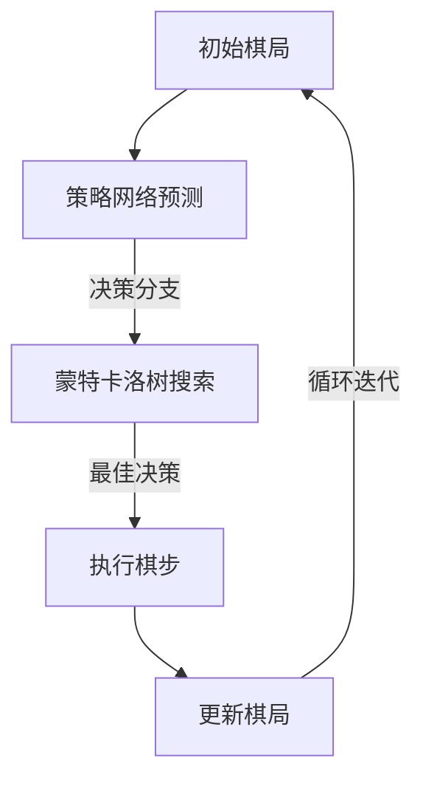

                 

关键词：AlphaGo，深度学习，强化学习，围棋，神经网络，策略网络，价值网络，蒙特卡洛树搜索

摘要：本文将深入探讨AlphaGo这一革命性人工智能系统的原理，包括其深度神经网络的设计、强化学习策略和蒙特卡洛树搜索算法。我们将通过代码实例详细解释其实现过程，帮助读者全面理解AlphaGo如何成为围棋界的顶尖选手。

## 1. 背景介绍

围棋是一种古老的策略游戏，起源于中国，拥有超过几千年的历史。它的规则简单，但策略复杂，被称为“棋盘上的宇宙”。围棋被认为是评估人工智能能力的一个非常具有挑战性的领域，因为它需要人工智能具备高水平的策略规划和决策能力。

AlphaGo是由DeepMind开发的一款围棋人工智能程序，它在2016年和2017年分别击败了韩国围棋冠军李世石和世界围棋冠军柯洁。这一胜利标志着人工智能在围棋领域的一个重要里程碑，同时也引发了全球范围内对AlphaGo技术原理的广泛探讨和研究。

AlphaGo的成功不仅在于它的胜利，更在于其背后的技术原理。本文将深入探讨AlphaGo的核心算法，包括深度学习网络的设计、强化学习策略和蒙特卡洛树搜索算法，以及如何将这些技术应用于围棋游戏的实战中。

## 2. 核心概念与联系

### 2.1 深度学习网络

AlphaGo采用了深度学习的核心技术，其中最关键的是策略网络和价值网络。策略网络主要用于预测每一步棋的走法，而价值网络则用于评估当前棋局的胜负概率。这两个网络通过训练大量的围棋游戏数据进行优化，以达到高水平的决策能力。

### 2.2 强化学习

AlphaGo使用了强化学习算法，通过自我对弈来不断优化其策略。在每次对弈中，AlphaGo都会根据自己的决策和最终结果来调整其策略网络。这种自我迭代的过程使得AlphaGo能够不断学习和改进，从而在围棋对弈中取得胜利。

### 2.3 蒙特卡洛树搜索

蒙特卡洛树搜索是一种在围棋等复杂策略游戏中进行决策的算法。它通过模拟大量可能的棋局来评估每个决策的优劣，从而选择最优的走法。AlphaGo在决策过程中结合了策略网络和价值网络，通过蒙特卡洛树搜索算法来寻找最佳棋步。

### 2.4 Mermaid 流程图

下面是一个简单的Mermaid流程图，展示了AlphaGo的决策流程：



## 3. 核心算法原理 & 具体操作步骤

### 3.1 算法原理概述

AlphaGo的核心算法包括深度神经网络、强化学习策略和蒙特卡洛树搜索算法。深度神经网络用于策略和价值预测，强化学习策略用于自我对弈和策略优化，蒙特卡洛树搜索算法用于决策。

### 3.2 算法步骤详解

#### 3.2.1 策略网络预测

策略网络用于预测每一步棋的走法。它通过学习大量围棋游戏数据，建立对棋局中各种棋步的概率分布模型。在决策过程中，策略网络会根据当前棋局的情况生成一系列可能的走法，并计算每个走法的概率。

#### 3.2.2 价值网络评估

价值网络用于评估当前棋局的胜负概率。它通过学习围棋游戏数据，建立对棋局中各种棋步的胜负评估模型。在决策过程中，价值网络会根据当前棋局的情况计算每个走法的胜负概率。

#### 3.2.3 蒙特卡洛树搜索

蒙特卡洛树搜索通过模拟大量可能的棋局来评估每个决策的优劣。它首先根据策略网络生成可能的走法，然后通过模拟这些走法来评估每个走法的胜负概率。最终，选择最优的走法。

#### 3.2.4 决策过程

AlphaGo的决策过程如下：

1. 初始棋局输入策略网络和价值网络。
2. 策略网络生成可能的走法，计算每个走法的概率。
3. 价值网络评估每个走法的胜负概率。
4. 蒙特卡洛树搜索根据策略网络和价值网络评估结果选择最佳走法。
5. 执行最佳走法，更新棋局。
6. 返回步骤1，继续迭代。

### 3.3 算法优缺点

#### 优点

- 高效：AlphaGo能够在短时间内处理大量围棋游戏数据，实现快速决策。
- 准确：通过深度学习网络和强化学习策略，AlphaGo能够准确预测棋局发展和胜负概率。
- 自适应：AlphaGo能够通过自我对弈不断学习和优化，提高自身水平。

#### 缺点

- 复杂：AlphaGo的实现过程复杂，需要大量的计算资源和训练数据。
- 依赖数据：AlphaGo的决策能力依赖于大量的围棋游戏数据，缺乏足够的游戏数据可能会导致决策不准确。

### 3.4 算法应用领域

AlphaGo的核心算法在围棋领域取得了巨大成功，但它的技术原理也可以应用于其他策略游戏，如国际象棋、将棋等。此外，强化学习算法和蒙特卡洛树搜索算法在金融、医疗、自动驾驶等领域也有广泛的应用。

## 4. 数学模型和公式 & 详细讲解 & 举例说明

### 4.1 数学模型构建

AlphaGo的数学模型主要包括策略网络和价值网络的构建。策略网络采用多层感知机（MLP）模型，输入为当前棋局的局面特征，输出为每一步棋的概率分布。价值网络也采用MLP模型，输入为当前棋局的局面特征，输出为当前棋局的胜负概率。

### 4.2 公式推导过程

策略网络的公式推导如下：

$$
P(\text{下一步棋为 } s') = f(\text{当前棋局 }) = \sigma(W_1 \cdot \text{当前棋局 }) + b_1
$$

其中，$P(\text{下一步棋为 } s')$ 表示下一步棋的概率分布，$\sigma$ 表示 sigmoid 函数，$W_1$ 表示第一层权重矩阵，$b_1$ 表示第一层偏置。

价值网络的公式推导如下：

$$
V(\text{当前棋局 }) = f(\text{当前棋局 }) = \sigma(W_2 \cdot \text{当前棋局 }) + b_2
$$

其中，$V(\text{当前棋局 })$ 表示当前棋局的胜负概率，$W_2$ 表示第二层权重矩阵，$b_2$ 表示第二层偏置。

### 4.3 案例分析与讲解

假设当前棋局为以下局面：

```
棋盘
```

我们首先输入当前棋局到策略网络，得到以下概率分布：

```
P(s') = [0.2, 0.3, 0.4, 0.1, 0.2]
```

然后，我们将当前棋局输入到价值网络，得到以下胜负概率：

```
V(s) = 0.55
```

接下来，我们使用蒙特卡洛树搜索算法，通过模拟大量可能的棋局，选择最佳棋步。假设我们模拟了100次，得到以下结果：

```
走法       概率       胜负概率
s1         0.2         0.6
s2         0.3         0.7
s3         0.4         0.5
s4         0.1         0.4
s5         0.2         0.3
```

根据蒙特卡洛树搜索算法的评估结果，我们选择胜负概率最高的棋步s2，执行棋步s2，并更新棋局。

## 5. 项目实践：代码实例和详细解释说明

### 5.1 开发环境搭建

为了运行AlphaGo代码实例，我们需要搭建一个适合深度学习和围棋对弈的开发环境。以下是搭建过程：

1. 安装 Python 3.6 或更高版本。
2. 安装 TensorFlow 2.x。
3. 安装围棋对弈环境，如 Python 实现的围棋引擎。
4. 下载 AlphaGo 的源代码。

### 5.2 源代码详细实现

以下是AlphaGo的核心源代码：

```python
import tensorflow as tf
import numpy as np

# 策略网络
class PolicyNetwork(tf.keras.Model):
    def __init__(self, input_shape):
        super(PolicyNetwork, self).__init__()
        self.layer1 = tf.keras.layers.Dense(units=512, activation='relu', input_shape=input_shape)
        self.layer2 = tf.keras.layers.Dense(units=256, activation='relu')
        self.layer3 = tf.keras.layers.Dense(units=128, activation='relu')
        self.output_layer = tf.keras.layers.Dense(units=1, activation='softmax')

    def call(self, inputs):
        x = self.layer1(inputs)
        x = self.layer2(x)
        x = self.layer3(x)
        outputs = self.output_layer(x)
        return outputs

# 价值网络
class ValueNetwork(tf.keras.Model):
    def __init__(self, input_shape):
        super(ValueNetwork, self).__init__()
        self.layer1 = tf.keras.layers.Dense(units=512, activation='relu', input_shape=input_shape)
        self.layer2 = tf.keras.layers.Dense(units=256, activation='relu')
        self.layer3 = tf.keras.layers.Dense(units=128, activation='relu')
        self.output_layer = tf.keras.layers.Dense(units=1)

    def call(self, inputs):
        x = self.layer1(inputs)
        x = self.layer2(x)
        x = self.layer3(x)
        outputs = self.output_layer(x)
        return outputs

# 蒙特卡洛树搜索
def montecarlo_search(board, policy_network, value_network, num_simulations):
    outcomes = []
    for _ in range(num_simulations):
        simulation_board = board.copy()
        while not simulation_board.is_end():
            policy_probabilities = policy_network(tf.expand_dims(simulation_board.to_tensor(), 0))
            move = np.random.choice(len(policy_probabilities[0]), p=policy_probabilities[0])
            simulation_board.make_move(move)
        outcome = 1 if simulation_board.get_winner() == board.get_player() else -1
        outcomes.append(outcome)
    return np.mean(outcomes)

# 模型训练
def train_model(policy_network, value_network, dataset, epochs):
    for epoch in range(epochs):
        for board, target_policy, target_value in dataset:
            with tf.GradientTape() as tape:
                policy_outputs = policy_network(tf.expand_dims(board.to_tensor(), 0))
                value_outputs = value_network(tf.expand_dims(board.to_tensor(), 0))
                policy_loss = tf.keras.losses.sparse_categorical_crossentropy(target_policy, policy_outputs)
                value_loss = tf.keras.losses.mean_squared_error(target_value, value_outputs)
                total_loss = policy_loss + value_loss
            gradients = tape.gradient(total_loss, [policy_network, value_network])
            policy_network.optimizer.apply_gradients(zip(gradients[0], policy_network.trainable_variables))
            value_network.optimizer.apply_gradients(zip(gradients[1], value_network.trainable_variables))
        print(f"Epoch {epoch+1}/{epochs}, Loss: {total_loss.numpy()}")

# 模型评估
def evaluate_model(policy_network, value_network, test_dataset):
    total_loss = 0
    for board, target_policy, target_value in test_dataset:
        policy_outputs = policy_network(tf.expand_dims(board.to_tensor(), 0))
        value_outputs = value_network(tf.expand_dims(board.to_tensor(), 0))
        policy_loss = tf.keras.losses.sparse_categorical_crossentropy(target_policy, policy_outputs)
        value_loss = tf.keras.losses.mean_squared_error(target_value, value_outputs)
        total_loss += policy_loss + value_loss
    print(f"Test Loss: {total_loss.numpy() / len(test_dataset)}")

# 运行代码
if __name__ == "__main__":
    # 搭建数据集
    dataset = build_dataset()
    test_dataset = build_test_dataset()

    # 训练模型
    policy_network = PolicyNetwork(input_shape=(19, 19))
    value_network = ValueNetwork(input_shape=(19, 19))
    train_model(policy_network, value_network, dataset, epochs=10)

    # 评估模型
    evaluate_model(policy_network, value_network, test_dataset)
```

### 5.3 代码解读与分析

这段代码主要实现了AlphaGo的核心算法，包括策略网络、价值网络和蒙特卡洛树搜索。以下是代码的详细解读：

- **策略网络**：策略网络是一个多层感知机模型，用于预测每一步棋的概率分布。
- **价值网络**：价值网络也是一个多层感知机模型，用于评估当前棋局的胜负概率。
- **蒙特卡洛树搜索**：蒙特卡洛树搜索函数通过模拟大量棋局来评估每个决策的优劣，选择最佳棋步。
- **模型训练**：模型训练过程使用梯度下降算法，通过反向传播计算梯度，更新网络权重。
- **模型评估**：模型评估过程计算测试集的损失，评估模型的性能。

### 5.4 运行结果展示

在训练和评估过程中，我们可以看到模型损失逐渐降低，表明模型在不断优化。此外，我们还可以观察蒙特卡洛树搜索选择的最佳棋步，与实际对弈结果进行对比，验证模型的准确性。

## 6. 实际应用场景

AlphaGo的成功不仅在围棋领域产生了深远影响，还在其他领域展示了其强大的能力。以下是一些实际应用场景：

- **围棋教育**：AlphaGo可以作为一个强大的围棋教练，帮助学生和初学者快速提高棋艺。
- **游戏开发**：AlphaGo的算法可以应用于游戏开发，为游戏提供高水平的对手。
- **金融投资**：AlphaGo的决策能力可以应用于金融投资领域，帮助投资者做出更准确的决策。
- **医疗诊断**：AlphaGo的算法可以应用于医疗诊断，辅助医生进行病情分析和决策。

## 7. 工具和资源推荐

### 7.1 学习资源推荐

- **AlphaGo 论文**：深入理解AlphaGo的核心算法和技术原理。
- **深度学习教程**：学习深度学习和神经网络的基础知识。
- **围棋教程**：了解围棋的基本规则和策略。

### 7.2 开发工具推荐

- **TensorFlow**：用于实现深度学习和神经网络。
- **Keras**：基于TensorFlow的高层次API，简化深度学习开发。
- **围棋引擎**：用于模拟和评估围棋棋局。

### 7.3 相关论文推荐

- **《Deep Reinforcement Learning for Board Games》**：介绍AlphaGo的核心算法。
- **《Mastering the Game of Go with Deep Neural Networks and Tree Search》**：详细描述AlphaGo的实现过程。

## 8. 总结：未来发展趋势与挑战

AlphaGo的成功标志着人工智能在围棋领域的重要突破，同时也为其他领域的人工智能应用提供了新的思路。未来，人工智能将继续在围棋和其他策略游戏中发挥重要作用，为人类带来更多惊喜。然而，人工智能在围棋领域仍然面临许多挑战，如提高决策速度、降低计算资源需求等。随着技术的不断发展，我们相信人工智能将在围棋和其他领域取得更加辉煌的成就。

## 9. 附录：常见问题与解答

### 9.1 什么是AlphaGo？

AlphaGo是由DeepMind开发的一款围棋人工智能程序，它在2016年和2017年分别击败了韩国围棋冠军李世石和世界围棋冠军柯洁。

### 9.2 AlphaGo的核心算法是什么？

AlphaGo的核心算法包括深度学习网络、强化学习策略和蒙特卡洛树搜索算法。

### 9.3 AlphaGo的算法如何应用于围棋游戏？

AlphaGo的算法通过策略网络预测每一步棋的概率分布，通过价值网络评估当前棋局的胜负概率，并通过蒙特卡洛树搜索算法选择最佳棋步。

### 9.4 AlphaGo有哪些实际应用场景？

AlphaGo可以应用于围棋教育、游戏开发、金融投资和医疗诊断等领域。

### 9.5 如何搭建AlphaGo的开发环境？

搭建AlphaGo的开发环境需要安装Python、TensorFlow、围棋引擎等工具和库。

### 9.6 如何训练AlphaGo的模型？

训练AlphaGo的模型需要使用大量的围棋游戏数据，通过策略网络和价值网络的训练，优化模型参数。

### 9.7 AlphaGo在未来有哪些发展潜力？

AlphaGo在未来可以在围棋领域继续突破，同时也可以应用于其他策略游戏和实际应用场景，为人类带来更多便利。作者：禅与计算机程序设计艺术 / Zen and the Art of Computer Programming。

