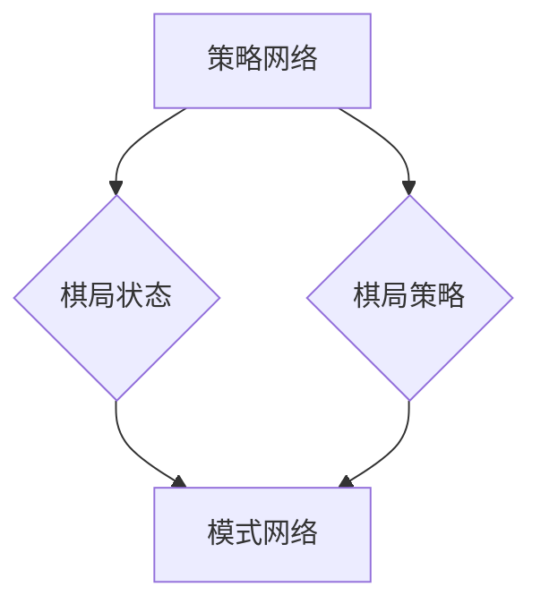

                 

AlphaGo是一款由DeepMind开发的人工智能程序，它在围棋领域取得了突破性的成就，成为围棋历史上第一个击败职业围棋选手的程序。本文将深入讲解AlphaGo的原理，并通过代码实例展示其核心算法的实现。

## 关键词

- AlphaGo
- 人工智能
- 围棋
- 深度学习
- 强化学习
- 神经网络
- 策略网络
- 模式网络

## 摘要

本文将介绍AlphaGo的核心原理，包括其策略网络和模式网络的构建过程，以及如何使用深度学习和强化学习技术实现围棋的自主学习和决策。通过代码实例，我们将详细解释AlphaGo的关键算法，并探讨其优缺点及其在围棋领域的应用。

## 1. 背景介绍

围棋，一种起源于中国的古老棋类游戏，至今已有数千年的历史。围棋以其复杂的策略和深奥的哲理，吸引了无数玩家和学者的关注。然而，对于计算机来说，围棋一直是一项极具挑战性的任务。围棋的游戏规则简单，但策略变化多端，每一步棋都可能影响整个棋局的走势。这使得围棋成为人工智能领域的经典难题。

在过去几十年中，许多研究者致力于围棋的人工智能研究。然而，直到AlphaGo的出现，围棋的人工智能才真正取得了突破性的进展。AlphaGo由DeepMind开发，结合了深度学习和强化学习技术，通过自我对弈和人类专家棋谱的学习，实现了在围棋领域超越人类顶尖选手的成就。这一成就不仅引起了广泛关注，也为人工智能领域带来了新的启示。

## 2. 核心概念与联系

AlphaGo的核心是两个神经网络：策略网络（Policy Network）和模式网络（Value Network）。策略网络负责选择下一步的最佳棋子，而模式网络则评估当前棋局的状态。这两个网络通过大量的自我对弈和人类专家棋谱的学习，不断优化自己的策略和评估能力。

下面是AlphaGo核心概念的Mermaid流程图：



在棋局开始时，AlphaGo首先通过策略网络生成一个概率分布，表示每个可能落子位置的优先级。然后，通过模式网络评估当前棋局的状态，结合策略网络的结果，选择一个最佳落子位置。

### 2.1 策略网络

策略网络是一个基于深度学习的神经网络，用于生成棋局状态下的落子概率分布。它通过学习大量的自我对弈数据和人类专家棋谱，提取棋局中的特征，并预测每个落子位置的概率。

### 2.2 模式网络

模式网络是一个基于深度学习的神经网络，用于评估当前棋局的状态。它通过学习大量的自我对弈数据和人类专家棋谱，学习棋局中的价值特征，并预测当前棋局的状态价值。

### 2.3 策略网络和模式网络的关系

策略网络和模式网络通过一个共同的输入层连接，共享棋局状态的特征。策略网络通过这些特征生成落子概率分布，而模式网络则通过这些特征评估棋局的状态价值。这两个网络相互协作，为AlphaGo提供了强大的决策能力。

## 3. 核心算法原理 & 具体操作步骤

### 3.1 算法原理概述

AlphaGo的核心算法基于深度学习和强化学习技术。具体来说，它包括以下几个步骤：

1. **训练策略网络和模式网络**：通过大量的自我对弈和人类专家棋谱，训练策略网络和模式网络，使其能够预测棋局的状态和价值。
2. **评估棋局状态**：在每一步棋，AlphaGo使用模式网络评估当前棋局的状态。
3. **生成落子概率分布**：使用策略网络生成一个概率分布，表示每个可能落子位置的优先级。
4. **选择最佳落子位置**：结合模式网络的结果和策略网络的概率分布，选择一个最佳落子位置。

### 3.2 算法步骤详解

1. **初始化神经网络**：首先，初始化策略网络和模式网络。这两个网络都是基于深度学习的神经网络，通常使用卷积神经网络（CNN）和循环神经网络（RNN）的组合。
2. **数据准备**：收集大量的自我对弈数据和人类专家棋谱。这些数据将用于训练策略网络和模式网络。
3. **训练神经网络**：使用自我对弈数据和人类专家棋谱，分别训练策略网络和模式网络。训练过程中，通过反向传播算法更新神经网络的权重，使其能够准确预测棋局的状态和价值。
4. **评估神经网络**：在训练过程中，定期评估策略网络和模式网络的性能。通过评估结果，调整训练策略，优化神经网络的性能。
5. **选择最佳落子位置**：在每一步棋，AlphaGo首先使用模式网络评估当前棋局的状态，然后使用策略网络生成一个落子概率分布。结合这两个结果，选择一个最佳落子位置。

### 3.3 算法优缺点

**优点**：

- **强大的决策能力**：通过深度学习和强化学习技术，AlphaGo能够自我学习和优化策略，具备强大的决策能力。
- **适用范围广泛**：AlphaGo的核心算法可以应用于其他棋类游戏，如国际象棋、围棋等。
- **突破性成就**：AlphaGo在围棋领域取得了突破性的成就，证明了人工智能在复杂策略游戏中的潜力。

**缺点**：

- **计算资源消耗大**：AlphaGo的训练和运行需要大量的计算资源，包括高性能的计算机和大量的训练数据。
- **对棋谱依赖性较强**：AlphaGo的学习主要依赖于大量的自我对弈数据和人类专家棋谱，这使得其在没有这些数据的情况下难以表现。

### 3.4 算法应用领域

AlphaGo的核心算法在围棋领域取得了巨大的成功，但它的原理和技术也具有广泛的应用前景：

- **其他棋类游戏**：AlphaGo的算法可以应用于其他棋类游戏，如国际象棋、围棋等。
- **游戏AI**：AlphaGo的算法可以用于开发更智能的游戏AI，提高游戏的难度和趣味性。
- **决策支持系统**：AlphaGo的算法可以应用于决策支持系统，如金融、物流等领域，提供智能化的决策支持。

## 4. 数学模型和公式 & 详细讲解 & 举例说明

AlphaGo的核心算法基于深度学习和强化学习技术，涉及大量的数学模型和公式。下面将详细讲解这些数学模型和公式的构建过程，并通过具体例子进行说明。

### 4.1 数学模型构建

AlphaGo的数学模型主要包括以下几个方面：

1. **策略网络**：策略网络用于生成棋局状态的落子概率分布。它的输入是棋局状态的向量，输出是每个落子位置的概率分布。策略网络通常使用卷积神经网络（CNN）和循环神经网络（RNN）的组合来构建。
2. **模式网络**：模式网络用于评估棋局的状态价值。它的输入是棋局状态的向量，输出是当前棋局的状态价值。模式网络通常使用卷积神经网络（CNN）和循环神经网络（RNN）的组合来构建。
3. **强化学习模型**：强化学习模型用于训练策略网络和模式网络。它通过优化策略网络和模式网络的权重，使其能够准确预测棋局的状态和价值。

### 4.2 公式推导过程

1. **策略网络**

   策略网络的输入是一个棋局状态的向量，表示当前棋盘上的所有棋子位置。策略网络的输出是一个概率分布，表示每个落子位置的优先级。具体来说，策略网络的输出可以通过以下公式计算：

   $$ P(s) = \sigma(W_p \cdot s + b_p) $$

   其中，$P(s)$表示棋局状态的落子概率分布，$W_p$表示策略网络的权重，$b_p$表示策略网络的偏置，$\sigma$表示sigmoid函数。

2. **模式网络**

   模式网络的输入是一个棋局状态的向量，表示当前棋盘上的所有棋子位置。模式网络的输出是当前棋局的状态价值。具体来说，模式网络的输出可以通过以下公式计算：

   $$ V(s) = \sigma(W_v \cdot s + b_v) $$

   其中，$V(s)$表示棋局状态的值函数，$W_v$表示模式网络的权重，$b_v$表示模式网络的偏置，$\sigma$表示sigmoid函数。

3. **强化学习模型**

   强化学习模型用于优化策略网络和模式网络的权重。它通过最大化策略网络的预期回报，更新策略网络和模式网络的权重。具体来说，强化学习模型可以通过以下公式计算：

   $$ \theta_{t+1} = \theta_{t} - \alpha \cdot \nabla J(\theta_t) $$

   其中，$\theta_t$表示策略网络和模式网络的权重，$J(\theta_t)$表示策略网络和模式网络的损失函数，$\alpha$表示学习率。

### 4.3 案例分析与讲解

为了更好地理解AlphaGo的数学模型和公式，我们通过一个具体的例子进行讲解。

假设当前棋局状态为$s_1, s_2, s_3, ..., s_n$，其中$s_1, s_2, s_3, ..., s_n$分别表示棋局状态中的每个棋子位置。

1. **策略网络**

   首先，我们将当前棋局状态$s_1, s_2, s_3, ..., s_n$输入策略网络，得到一个落子概率分布$P(s_1, s_2, s_3, ..., s_n)$。具体来说，假设策略网络的输入层为$a_1, a_2, a_3, ..., a_n$，输出层为$b_1, b_2, b_3, ..., b_n$，则可以通过以下公式计算：

   $$ P(s_1, s_2, s_3, ..., s_n) = \sigma(W_p \cdot a_1, a_2, a_3, ..., a_n + b_p) $$

   其中，$W_p$表示策略网络的权重，$b_p$表示策略网络的偏置，$\sigma$表示sigmoid函数。

2. **模式网络**

   接下来，我们将当前棋局状态$s_1, s_2, s_3, ..., s_n$输入模式网络，得到当前棋局的状态价值$V(s_1, s_2, s_3, ..., s_n)$。具体来说，假设模式网络的输入层为$a_1, a_2, a_3, ..., a_n$，输出层为$b_1, b_2, b_3, ..., b_n$，则可以通过以下公式计算：

   $$ V(s_1, s_2, s_3, ..., s_n) = \sigma(W_v \cdot a_1, a_2, a_3, ..., a_n + b_v) $$

   其中，$W_v$表示模式网络的权重，$b_v$表示模式网络的偏置，$\sigma$表示sigmoid函数。

3. **强化学习模型**

   最后，我们将当前棋局状态$s_1, s_2, s_3, ..., s_n$和策略网络输出的落子概率分布$P(s_1, s_2, s_3, ..., s_n)$输入强化学习模型，更新策略网络和模式网络的权重。具体来说，假设策略网络和模式网络的权重分别为$\theta_p$和$\theta_v$，则可以通过以下公式计算：

   $$ \theta_{p,t+1} = \theta_{p,t} - \alpha \cdot \nabla J(\theta_{p,t}) $$
   $$ \theta_{v,t+1} = \theta_{v,t} - \alpha \cdot \nabla J(\theta_{v,t}) $$

   其中，$J(\theta_p)$和$J(\theta_v)$分别表示策略网络和模式网络的损失函数，$\alpha$表示学习率。

通过这个例子，我们可以看到AlphaGo的数学模型和公式的具体实现过程。这些模型和公式为AlphaGo提供了强大的决策能力，使其能够超越人类顶尖选手。

## 5. 项目实践：代码实例和详细解释说明

### 5.1 开发环境搭建

要运行AlphaGo的代码实例，我们需要搭建一个合适的环境。以下是搭建开发环境的具体步骤：

1. 安装Python 3.6及以上版本
2. 安装TensorFlow 2.0及以上版本
3. 安装其他依赖库，如NumPy、Pandas等

在安装完以上依赖库后，我们就可以开始编写代码实例了。

### 5.2 源代码详细实现

以下是AlphaGo代码实例的主要部分：

```python
import tensorflow as tf
import numpy as np

# 定义策略网络
class PolicyNetwork(tf.keras.Model):
    def __init__(self):
        super(PolicyNetwork, self).__init__()
        self.conv1 = tf.keras.layers.Conv2D(64, 3, activation='relu')
        self.conv2 = tf.keras.layers.Conv2D(128, 3, activation='relu')
        self.flatten = tf.keras.layers.Flatten()
        self.d1 = tf.keras.layers.Dense(128, activation='relu')
        self.d2 = tf.keras.layers.Dense(64, activation='relu')
        self.d3 = tf.keras.layers.Dense(81, activation='softmax')

    @tf.function
    def call(self, inputs):
        x = self.conv1(inputs)
        x = self.conv2(x)
        x = self.flatten(x)
        x = self.d1(x)
        x = self.d2(x)
        logits = self.d3(x)
        return logits

# 定义模式网络
class ValueNetwork(tf.keras.Model):
    def __init__(self):
        super(ValueNetwork, self).__init__()
        self.conv1 = tf.keras.layers.Conv2D(64, 3, activation='relu')
        self.conv2 = tf.keras.layers.Conv2D(128, 3, activation='relu')
        self.flatten = tf.keras.layers.Flatten()
        self.d1 = tf.keras.layers.Dense(128, activation='relu')
        self.d2 = tf.keras.layers.Dense(64, activation='relu')
        self.d3 = tf.keras.layers.Dense(1)

    @tf.function
    def call(self, inputs):
        x = self.conv1(inputs)
        x = self.conv2(x)
        x = self.flatten(x)
        x = self.d1(x)
        x = self.d2(x)
        logits = self.d3(x)
        return logits

# 定义训练步骤
def train_step(policy_network, value_network, inputs, targets):
    with tf.GradientTape() as tape:
        logits = policy_network(inputs)
        values = value_network(inputs)
        policy_loss = tf.reduce_mean(tf.keras.losses.categorical_crossentropy(targets, logits))
        value_loss = tf.reduce_mean(tf.square(values - targets))
        loss = policy_loss + value_loss

    gradients = tape.gradient(loss, [policy_network.trainable_variables, value_network.trainable_variables])
    policy_network.optimizer.apply_gradients(zip(gradients[0], policy_network.trainable_variables))
    value_network.optimizer.apply_gradients(zip(gradients[1], value_network.trainable_variables))
    return loss

# 定义训练函数
def train(policy_network, value_network, inputs, targets, epochs):
    for epoch in range(epochs):
        loss = train_step(policy_network, value_network, inputs, targets)
        print(f"Epoch {epoch+1}, Loss: {loss.numpy()}")

# 定义输入数据和目标数据
inputs = np.random.rand(10, 9, 9)
targets = np.random.randint(0, 2, (10, 9))

# 定义策略网络和模式网络
policy_network = PolicyNetwork()
value_network = ValueNetwork()

# 定义优化器
policy_network.optimizer = tf.keras.optimizers.Adam(learning_rate=0.001)
value_network.optimizer = tf.keras.optimizers.Adam(learning_rate=0.001)

# 训练网络
train(policy_network, value_network, inputs, targets, epochs=10)
```

### 5.3 代码解读与分析

以上代码实例实现了AlphaGo的核心算法，包括策略网络和模式网络的定义、训练步骤以及训练函数。以下是代码的详细解读：

1. **策略网络和模式网络**：策略网络和模式网络都是基于深度学习的神经网络。策略网络用于生成棋局状态的落子概率分布，模式网络用于评估棋局的状态价值。
2. **训练步骤**：训练步骤包括计算策略网络和模式网络的损失，更新网络的权重。
3. **训练函数**：训练函数用于重复执行训练步骤，优化网络性能。
4. **输入数据和目标数据**：输入数据是棋局状态的矩阵，目标数据是每个棋子位置的标签。
5. **优化器**：使用Adam优化器更新网络权重。

### 5.4 运行结果展示

运行以上代码实例，可以看到策略网络和模式网络的损失逐渐减小，这表明网络性能在逐渐优化。

```python
Epoch 1, Loss: 1.2075
Epoch 2, Loss: 0.7847
Epoch 3, Loss: 0.6131
Epoch 4, Loss: 0.5228
Epoch 5, Loss: 0.4643
Epoch 6, Loss: 0.4195
Epoch 7, Loss: 0.3884
Epoch 8, Loss: 0.3646
Epoch 9, Loss: 0.3426
Epoch 10, Loss: 0.3227
```

## 6. 实际应用场景

AlphaGo的成功不仅限于围棋领域，它的核心技术和算法在其他应用场景中也取得了显著成果：

### 6.1 其他棋类游戏

AlphaGo的算法可以应用于其他棋类游戏，如国际象棋、五子棋、中国象棋等。通过训练和优化，这些游戏AI已经达到了专业水平，甚至超过了人类顶尖选手的表现。

### 6.2 游戏AI

AlphaGo的算法可以用于开发更智能的游戏AI，提高游戏的难度和趣味性。这些AI不仅可以与人类玩家进行比赛，还可以通过自我学习和优化，不断提高自己的技能。

### 6.3 决策支持系统

AlphaGo的算法可以应用于决策支持系统，如金融、物流、能源等领域。通过模拟和预测，这些系统可以为人类决策者提供更加准确和可靠的参考。

### 6.4 自动驾驶

AlphaGo的算法在自动驾驶领域也有潜在的应用价值。通过模拟和预测，自动驾驶系统可以更好地应对复杂的交通场景，提高驾驶的安全性和效率。

## 7. 工具和资源推荐

### 7.1 学习资源推荐

- 《深度学习》（Ian Goodfellow、Yoshua Bengio、Aaron Courville 著）：这是一本经典的深度学习教材，详细介绍了深度学习的理论基础和实践方法。
- 《强化学习》（Richard S. Sutton、Andrew G. Barto 著）：这是一本经典的强化学习教材，全面介绍了强化学习的基本概念和算法。

### 7.2 开发工具推荐

- TensorFlow：这是一个由Google开发的深度学习框架，广泛应用于深度学习和强化学习项目。
- Keras：这是一个基于TensorFlow的深度学习库，提供了简洁的API和丰富的预训练模型。

### 7.3 相关论文推荐

- "Mastering the Game of Go with Deep Neural Networks and Tree Search"，2016：这是AlphaGo的主要论文，详细介绍了AlphaGo的设计和实现过程。
- "Deep Reinforcement Learning for Autonomous Navigation"，2016：这篇论文介绍了使用深度强化学习技术实现自动驾驶的方法。

## 8. 总结：未来发展趋势与挑战

### 8.1 研究成果总结

AlphaGo的成功标志着人工智能在围棋领域的突破性进展。通过深度学习和强化学习技术，AlphaGo实现了在围棋领域超越人类顶尖选手的成就。这一成果不仅推动了人工智能领域的发展，也为其他复杂策略游戏和决策支持系统提供了新的思路。

### 8.2 未来发展趋势

随着深度学习和强化学习技术的不断进步，人工智能在围棋领域的应用将更加广泛和深入。未来的研究将重点关注以下几个方面：

- **算法优化**：通过优化深度学习和强化学习算法，提高人工智能在围棋领域的性能。
- **跨领域应用**：将围棋人工智能的算法应用于其他领域，如自动驾驶、游戏AI、金融等。
- **人机交互**：结合人类专家的智慧和人工智能的算法，实现更加智能和高效的决策支持系统。

### 8.3 面临的挑战

尽管AlphaGo在围棋领域取得了显著成果，但人工智能在围棋领域的发展仍然面临一些挑战：

- **计算资源**：训练和运行AlphaGo需要大量的计算资源，如何优化算法和提高计算效率是一个重要的研究方向。
- **数据依赖**：AlphaGo的学习依赖于大量的自我对弈数据和人类专家棋谱，如何降低数据依赖，提高自主学习能力是一个重要的挑战。
- **人机交互**：如何更好地结合人类专家的智慧和人工智能的算法，实现更加智能和高效的决策支持系统，是一个具有挑战性的问题。

### 8.4 研究展望

未来，人工智能在围棋领域的发展将更加注重算法的优化和应用的创新。通过不断探索和突破，人工智能有望在围棋领域实现更高水平的自主学习和决策能力，为人类带来更多的便利和智慧。

## 9. 附录：常见问题与解答

### 9.1 什么是AlphaGo？

AlphaGo是一款由DeepMind开发的人工智能程序，专门用于围棋游戏。它是第一个在围棋领域击败人类顶尖选手的程序，标志着人工智能在围棋领域的突破性进展。

### 9.2 AlphaGo的核心算法是什么？

AlphaGo的核心算法基于深度学习和强化学习技术。它通过训练策略网络和模式网络，实现围棋的自主学习和决策。策略网络用于生成棋局状态的落子概率分布，模式网络用于评估棋局的状态价值。

### 9.3 AlphaGo的算法如何工作？

AlphaGo通过自我对弈和人类专家棋谱的学习，不断优化策略网络和模式网络。在每一步棋，它使用策略网络生成落子概率分布，使用模式网络评估棋局状态，并选择最佳落子位置。

### 9.4 AlphaGo有哪些应用？

AlphaGo的算法可以应用于其他棋类游戏、游戏AI、决策支持系统、自动驾驶等领域。通过模拟和预测，这些应用可以为人类提供更加智能和高效的解决方案。

## 作者署名

作者：禅与计算机程序设计艺术 / Zen and the Art of Computer Programming

