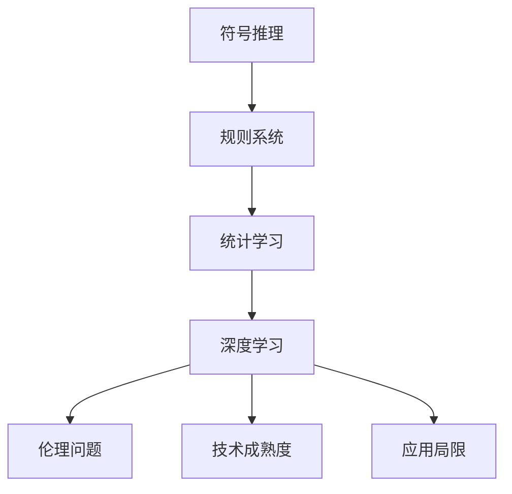
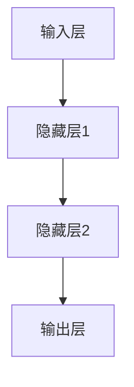

                 

人工智能（AI）已经从科幻小说中的遐想变为现实，深刻地改变了我们的生活。而Andrej Karpathy，作为一位在AI领域享有盛誉的研究者，他的观点和见解对整个技术社区都有着重要的影响。本文将探讨Andrej Karpathy所提到的人工智能在未来发展过程中所面临的挑战。

## 关键词

- Andrej Karpathy
- 人工智能发展
- 挑战
- 伦理问题
- 技术成熟度
- 应用局限

## 摘要

本文将深入分析Andrej Karpathy所提出的人工智能未来发展的挑战，包括技术层面的复杂性、伦理道德的考量、以及人工智能在社会中的应用限制。通过详细阐述这些问题，我们希望读者能够更全面地理解人工智能的现状以及未来的发展方向。

## 1. 背景介绍

人工智能的发展经历了几个重要的阶段，从早期的符号推理到现代的深度学习，AI技术已经取得了显著的进步。然而，随着AI能力的不断提升，其所带来的挑战也日益凸显。Andrej Karpathy在其研究中，深入探讨了这些挑战，为我们指明了未来发展的方向。

### 1.1 Andrej Karpathy的贡献

Andrej Karpathy是一位在AI领域具有广泛影响力的研究者，他在深度学习、自然语言处理等领域做出了许多开创性的工作。他的研究成果不仅推动了AI技术的发展，也为AI在现实世界中的应用提供了宝贵的指导。

### 1.2 人工智能的发展阶段

人工智能的发展可以分为几个阶段：早期的符号推理、基于规则的系统、基于统计的方法，再到如今的深度学习。每个阶段都有其特定的技术特点和局限性，而AI的未来发展需要在这些基础上进一步突破。

## 2. 核心概念与联系

为了更好地理解人工智能的发展挑战，我们需要先了解一些核心概念和技术架构。以下是一个Mermaid流程图，展示了AI技术的基本架构和核心概念之间的联系。



### 2.1 符号推理

符号推理是人工智能的早期形式，通过符号操作进行逻辑推理。这种方法在处理一些简单的逻辑问题时表现出色，但在处理复杂的问题时往往显得力不从心。

### 2.2 规则系统

基于规则的系统通过预先定义的规则来指导AI的行为。这种方法在特定领域内表现出色，但其局限性在于规则的编写需要大量的人力和专业知识。

### 2.3 统计学习

统计学习方法通过分析数据来发现模式，这种方法在处理一些复杂数据时表现出色，但其对数据的依赖性较高，且容易受到噪声数据的影响。

### 2.4 深度学习

深度学习方法通过模拟人脑的神经网络结构来处理数据，其在图像识别、自然语言处理等领域取得了显著的成果。然而，深度学习的黑箱特性也带来了一系列挑战，如可解释性差、数据偏见等问题。

### 2.5 伦理问题

随着人工智能技术的发展，伦理问题也日益突出。如何确保AI系统的公平性、透明性和可解释性，如何避免AI对人类的威胁，这些都是我们需要深入思考的问题。

### 2.6 技术成熟度

虽然人工智能在很多领域取得了显著的成果，但技术的成熟度仍然是一个挑战。如何将AI的理论成果转化为实际应用，如何解决技术瓶颈，都是我们需要面对的问题。

### 2.7 应用局限

人工智能的应用也存在一些局限，如领域限制、数据依赖性、资源需求高等。如何拓展AI的应用范围，提高其适应性，也是我们需要关注的问题。

## 3. 核心算法原理 & 具体操作步骤

在了解了核心概念和联系之后，我们需要深入探讨一些核心算法的原理和具体操作步骤。以下是一个简要的概述。

### 3.1 算法原理概述

人工智能的核心算法包括神经网络、深度学习、生成对抗网络等。这些算法通过模拟人脑的工作方式，对数据进行处理和分析。以下是一个简单的神经网络示意图。



### 3.2 算法步骤详解

1. **数据预处理**：对输入数据进行标准化处理，以提高算法的性能。
2. **构建神经网络**：根据问题的需求，设计合适的神经网络结构。
3. **训练神经网络**：通过反向传播算法，调整网络中的权重，使网络能够对数据进行准确分类或回归。
4. **评估和优化**：通过测试数据集对网络进行评估，并根据评估结果进行优化。

### 3.3 算法优缺点

- **优点**：深度学习算法在处理复杂数据时表现出色，能够自动学习数据的特征。
- **缺点**：深度学习算法对数据依赖性较高，且训练过程耗时较长。

### 3.4 算法应用领域

深度学习算法在图像识别、自然语言处理、语音识别等领域有着广泛的应用。例如，在图像识别领域，卷积神经网络（CNN）已经被广泛应用于人脸识别、物体检测等任务。

## 4. 数学模型和公式 & 详细讲解 & 举例说明

在人工智能领域，数学模型和公式是理解和应用算法的基础。以下是一个简单的数学模型示例，以及其推导和解释。

### 4.1 数学模型构建

假设我们有一个简单的一元线性回归模型，用于预测房价。其数学模型可以表示为：

$$
y = wx + b
$$

其中，$y$ 是房价，$x$ 是房屋的面积，$w$ 和 $b$ 分别是权重和偏置。

### 4.2 公式推导过程

我们通过最小二乘法来求解这个线性回归模型的权重和偏置。具体推导过程如下：

$$
w = \frac{\sum_{i=1}^{n}(x_i - \bar{x})(y_i - \bar{y})}{\sum_{i=1}^{n}(x_i - \bar{x})^2}
$$

$$
b = \bar{y} - w\bar{x}
$$

其中，$n$ 是样本数量，$\bar{x}$ 和 $\bar{y}$ 分别是样本均值。

### 4.3 案例分析与讲解

假设我们有一个房屋面积和房价的数据集，如下表所示：

| 房屋面积（平方米） | 房价（万元） |
| :--------------: | :---------: |
|      90          |     120    |
|      100         |     130    |
|      110         |     150    |
|      120         |     170    |

根据上述线性回归模型，我们可以计算出权重和偏置，进而预测一个新房屋的房价。

## 5. 项目实践：代码实例和详细解释说明

为了更好地理解人工智能的应用，我们将通过一个实际的项目来展示如何使用深度学习算法进行图像分类。

### 5.1 开发环境搭建

为了运行下面的代码，我们需要安装以下依赖：

- Python 3.8及以上版本
- TensorFlow 2.4及以上版本

安装命令如下：

```bash
pip install python==3.8
pip install tensorflow==2.4
```

### 5.2 源代码详细实现

下面是一个简单的使用TensorFlow和Keras进行图像分类的示例代码：

```python
import tensorflow as tf
from tensorflow.keras.models import Sequential
from tensorflow.keras.layers import Conv2D, MaxPooling2D, Flatten, Dense
from tensorflow.keras.preprocessing.image import ImageDataGenerator

# 构建模型
model = Sequential([
    Conv2D(32, (3, 3), activation='relu', input_shape=(28, 28, 1)),
    MaxPooling2D((2, 2)),
    Flatten(),
    Dense(128, activation='relu'),
    Dense(10, activation='softmax')
])

# 编译模型
model.compile(optimizer='adam', loss='categorical_crossentropy', metrics=['accuracy'])

# 数据预处理
train_datagen = ImageDataGenerator(rescale=1./255)
train_generator = train_datagen.flow_from_directory(
        'train_data', 
        target_size=(28, 28), 
        batch_size=32,
        class_mode='categorical')

# 训练模型
model.fit(train_generator, steps_per_epoch=100, epochs=10)

# 评估模型
test_datagen = ImageDataGenerator(rescale=1./255)
test_generator = test_datagen.flow_from_directory(
        'test_data', 
        target_size=(28, 28), 
        batch_size=32,
        class_mode='categorical')

model.evaluate(test_generator, steps=50)
```

### 5.3 代码解读与分析

- **模型构建**：我们使用一个简单的卷积神经网络（CNN）结构，包括卷积层、池化层、全连接层等。
- **数据预处理**：使用ImageDataGenerator对图像数据进行预处理，包括缩放、归一化等。
- **编译模型**：设置模型的优化器、损失函数和评估指标。
- **训练模型**：使用fit方法对模型进行训练。
- **评估模型**：使用evaluate方法对模型进行评估。

### 5.4 运行结果展示

通过训练和评估，我们可以得到模型的准确率。例如，如果模型的准确率为90%，那么表示模型在测试数据上的表现较好。

## 6. 实际应用场景

人工智能技术已经在许多领域得到了广泛应用，以下是一些典型的应用场景。

### 6.1 图像识别

图像识别是人工智能的一个重要应用领域，广泛应用于人脸识别、物体检测、图像分类等任务。例如，智能手机的相机应用可以使用AI技术实现人脸解锁、美颜等功能。

### 6.2 自然语言处理

自然语言处理（NLP）是人工智能的另一个重要领域，广泛应用于机器翻译、情感分析、文本分类等任务。例如，搜索引擎可以使用NLP技术实现关键词提取、文本匹配等功能。

### 6.3 语音识别

语音识别是人工智能在语音领域的重要应用，广泛应用于语音助手、语音搜索、语音合成等任务。例如，智能音箱可以使用语音识别技术实现语音控制、语音查询等功能。

## 7. 工具和资源推荐

为了更好地学习和应用人工智能技术，以下是一些建议的工具和资源。

### 7.1 学习资源推荐

- 《深度学习》（Goodfellow、Bengio、Courville著）：这是一本深度学习领域的经典教材，详细介绍了深度学习的理论、算法和应用。
- 《Python深度学习》（François Chollet著）：这是一本面向实际应用的深度学习教材，通过丰富的示例代码，帮助读者快速掌握深度学习的应用。

### 7.2 开发工具推荐

- TensorFlow：这是一个开源的深度学习框架，提供了丰富的API和工具，可以帮助开发者快速构建和训练深度学习模型。
- PyTorch：这是一个流行的深度学习框架，与TensorFlow类似，提供了灵活的API和强大的功能。

### 7.3 相关论文推荐

- "Deep Learning"（Yann LeCun）：这是一篇关于深度学习的经典论文，详细介绍了深度学习的理论、算法和应用。
- "Generative Adversarial Networks"（Ian J. Goodfellow等）：这是一篇关于生成对抗网络的论文，详细介绍了GAN的理论和实现方法。

## 8. 总结：未来发展趋势与挑战

### 8.1 研究成果总结

近年来，人工智能领域取得了许多重要的研究成果。深度学习、生成对抗网络等算法在图像识别、自然语言处理、语音识别等领域取得了显著的进展。这些研究成果为人工智能的实际应用提供了强大的支持。

### 8.2 未来发展趋势

未来，人工智能将继续向更高效、更智能的方向发展。具体来说，以下几个方面值得关注：

- **算法创新**：随着计算能力的提升，我们将看到更多高效的算法被提出和应用。
- **多模态学习**：结合多种数据模态（如图像、文本、语音等），实现更智能的AI系统。
- **强化学习**：强化学习在自动驾驶、游戏等领域具有广泛的应用前景，未来有望取得更多突破。

### 8.3 面临的挑战

尽管人工智能技术取得了显著的进展，但仍然面临一些挑战。以下是一些主要的挑战：

- **数据隐私和安全**：如何确保数据的安全和隐私是一个亟待解决的问题。
- **伦理道德**：如何确保AI系统的公平性、透明性和可解释性，避免AI对人类产生负面影响。
- **技术瓶颈**：如何解决算法的复杂度、计算资源需求等问题，实现AI技术的广泛应用。

### 8.4 研究展望

未来，人工智能研究将继续深入探索算法、理论、应用等多个方面。随着技术的不断进步，人工智能将在更多领域发挥重要作用，为人类社会带来更多的便利和创新。

## 9. 附录：常见问题与解答

### 9.1 什么是深度学习？

深度学习是一种基于神经网络的人工智能算法，通过模拟人脑的神经网络结构，对数据进行处理和分析。

### 9.2 深度学习和传统机器学习的区别是什么？

深度学习与传统机器学习的主要区别在于其能够自动学习数据的特征，而传统机器学习需要人工提取特征。

### 9.3 如何选择合适的深度学习模型？

选择合适的深度学习模型需要根据具体问题来决定。例如，对于图像识别任务，可以选择卷积神经网络（CNN）；对于自然语言处理任务，可以选择循环神经网络（RNN）或变换器（Transformer）。

### 9.4 深度学习模型如何训练？

深度学习模型的训练通常包括以下步骤：

1. **数据预处理**：对输入数据进行标准化处理。
2. **构建模型**：设计合适的神经网络结构。
3. **编译模型**：设置优化器、损失函数和评估指标。
4. **训练模型**：使用训练数据集对模型进行训练。
5. **评估和优化**：使用测试数据集对模型进行评估，并根据评估结果进行优化。

## 作者署名

作者：禅与计算机程序设计艺术 / Zen and the Art of Computer Programming

本文旨在探讨人工智能在未来发展过程中所面临的挑战，包括技术层面的复杂性、伦理道德的考量，以及人工智能在社会中的应用限制。通过详细阐述这些问题，我们希望读者能够更全面地理解人工智能的现状以及未来的发展方向。本文参考了Andrej Karpathy的相关研究成果，对其观点进行了深入分析和解读。希望本文能够为读者提供有益的启示和思考。|

