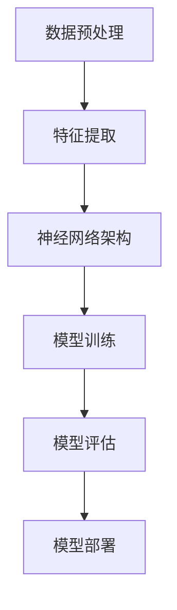

                 

关键词：人工智能，深度学习，神经网络，图神经网络，未来趋势，挑战，发展前景

## 摘要

本文旨在探讨人工智能领域，特别是深度学习和神经网络技术的未来发展方向。通过分析当前技术的成就与局限，结合最新的研究成果和实际应用案例，本文将深入探讨人工智能的发展趋势、面临的挑战以及未来的前景。

## 1. 背景介绍

### 人工智能的历史与发展

人工智能（AI）的概念可以追溯到20世纪50年代，当时科学家们开始探索机器是否能够模拟人类智能。随着计算机技术的不断发展，人工智能的研究逐渐取得了重要的进展。特别是在21世纪初，深度学习技术的崛起，使得人工智能迎来了新的发展机遇。

### 深度学习与神经网络的兴起

深度学习是人工智能的一个重要分支，它通过模拟人脑的神经网络结构，使得计算机能够进行更加复杂的任务处理。特别是卷积神经网络（CNN）和递归神经网络（RNN）的出现，大大提升了计算机在图像识别、语音识别等领域的表现。

### 当前技术成就与挑战

在过去的几十年里，人工智能技术取得了显著的成就，例如在图像识别、自然语言处理、推荐系统等领域的应用。然而，人工智能技术也面临着一些挑战，包括数据隐私、算法公平性、以及技术普及等问题。

## 2. 核心概念与联系

在探讨人工智能的未来发展方向之前，我们需要了解一些核心概念和它们的联系。以下是一个简化的Mermaid流程图，用于展示这些概念之间的关系。



### 数据预处理

数据预处理是深度学习模型训练的第一步，它包括数据清洗、数据归一化、数据增强等操作，目的是提高模型的学习效果。

### 特征提取

特征提取是指从原始数据中提取出对模型训练有用的信息。在深度学习中，特征提取通常由神经网络自动完成。

### 神经网络架构

神经网络架构是指神经网络的层次结构，包括输入层、隐藏层和输出层。不同的神经网络架构适用于不同的任务。

### 模型训练

模型训练是指通过大量数据对神经网络模型进行调整，使其能够更好地完成特定任务。

### 模型评估

模型评估是指使用测试数据集来评估模型性能，确保模型能够泛化到未见过的数据上。

### 模型部署

模型部署是指将训练好的模型应用到实际场景中，例如在手机应用、云端服务等场景。

## 3. 核心算法原理 & 具体操作步骤

### 3.1 算法原理概述

深度学习的核心是神经网络，它通过多层神经网络对数据进行处理，每一层神经网络都会对数据进行变换，最终输出一个结果。

### 3.2 算法步骤详解

#### 步骤1：数据预处理

- 数据清洗：去除无效数据、处理缺失值等。
- 数据归一化：将数据缩放到相同的范围，便于模型训练。

#### 步骤2：特征提取

- 使用卷积神经网络进行特征提取，捕捉数据中的空间信息。
- 使用递归神经网络进行特征提取，捕捉数据中的时间信息。

#### 步骤3：神经网络架构设计

- 设计适合任务的神经网络架构，包括层数、每层神经元数量等。
- 选择合适的激活函数，如ReLU、Sigmoid、Tanh等。

#### 步骤4：模型训练

- 使用训练数据对模型进行训练，调整模型参数。
- 使用反向传播算法优化模型参数。

#### 步骤5：模型评估

- 使用测试数据集评估模型性能，包括准确率、召回率等指标。

#### 步骤6：模型部署

- 将训练好的模型部署到实际场景中，如手机应用、云端服务等。

### 3.3 算法优缺点

#### 优点

- 强大的表示能力：神经网络能够自动提取数据中的特征，提高模型性能。
- 广泛的应用场景：神经网络可以应用于图像识别、自然语言处理、推荐系统等领域。

#### 缺点

- 需要大量数据：深度学习模型需要大量数据才能训练，数据收集和处理成本较高。
- 计算资源消耗：深度学习模型的训练过程需要大量的计算资源，可能导致训练时间较长。

### 3.4 算法应用领域

- 图像识别：使用卷积神经网络进行图像分类、目标检测等。
- 自然语言处理：使用递归神经网络进行文本分类、机器翻译等。
- 推荐系统：使用神经网络进行用户行为预测、商品推荐等。

## 4. 数学模型和公式 & 详细讲解 & 举例说明

### 4.1 数学模型构建

深度学习中的数学模型主要包括以下几个部分：

- 前向传播：计算输入数据经过神经网络后的输出。
- 反向传播：计算损失函数关于模型参数的梯度，用于优化模型参数。

### 4.2 公式推导过程

以下是一个简化的前向传播和反向传播的公式推导过程：

#### 前向传播

$$
Z = W \cdot X + b
$$

$$
A = \sigma(Z)
$$

其中，$Z$ 是激活值，$W$ 是权重矩阵，$X$ 是输入数据，$b$ 是偏置项，$\sigma$ 是激活函数。

#### 反向传播

$$
\Delta Z = A - \text{目标值}
$$

$$
\Delta W = \frac{\partial J}{\partial W}
$$

$$
\Delta b = \frac{\partial J}{\partial b}
$$

其中，$J$ 是损失函数，$\Delta Z$ 是损失函数关于激活值的梯度，$\Delta W$ 和 $\Delta b$ 是损失函数关于权重矩阵和偏置项的梯度。

### 4.3 案例分析与讲解

以下是一个简单的神经网络模型，用于对图像进行分类。

#### 模型定义

输入层：$X \in \mathbb{R}^{784}$，表示一个28x28的图像。

隐藏层：$H \in \mathbb{R}^{100}$，包含100个神经元。

输出层：$Y \in \mathbb{R}^{10}$，表示10个分类的概率分布。

#### 损失函数

交叉熵损失函数：

$$
J = -\frac{1}{m} \sum_{i=1}^{m} \sum_{j=1}^{10} y_j^i \log(a_j^i)
$$

其中，$y_j^i$ 是真实标签的概率分布，$a_j^i$ 是模型预测的概率分布。

#### 训练过程

1. 初始化权重矩阵 $W$ 和偏置项 $b$。
2. 对输入数据进行前向传播，计算输出 $A$。
3. 计算损失函数 $J$。
4. 对输出层进行反向传播，计算损失函数关于输出层的梯度。
5. 对隐藏层进行反向传播，计算损失函数关于隐藏层的梯度。
6. 使用梯度下降算法更新权重矩阵和偏置项。
7. 重复步骤2-6，直到模型收敛。

## 5. 项目实践：代码实例和详细解释说明

### 5.1 开发环境搭建

本文使用Python语言进行编程，需要安装以下库：

- TensorFlow：用于构建和训练神经网络模型。
- NumPy：用于数据处理和矩阵运算。

### 5.2 源代码详细实现

以下是一个简单的神经网络模型，用于对MNIST数据集进行手写数字识别。

```python
import tensorflow as tf
from tensorflow.examples.tutorials.mnist import input_data

# 加载MNIST数据集
mnist = input_data.read_data_sets("MNIST_data/", one_hot=True)

# 设置参数
learning_rate = 0.1
num_steps = 1000
batch_size = 128
display_step = 100

# 初始化输入层、隐藏层和输出层的权重和偏置
X = tf.placeholder(tf.float32, [None, 784])
Y = tf.placeholder(tf.float32, [None, 10])
W = tf.Variable(tf.zeros([784, 10]))
b = tf.Variable(tf.zeros([10]))

# 定义神经网络的前向传播
Z = tf.add(tf.matmul(X, W), b)
A = tf.nn.softmax(Z)

# 定义损失函数和优化器
loss_op = tf.reduce_mean(tf.reduce_sum(-Y * tf.log(A), reduction_indices=1))
optimizer = tf.train.GradientDescentOptimizer(learning_rate)
train_op = optimizer.minimize(loss_op)

# 初始化全局变量
init = tf.global_variables_initializer()

# 开始训练
with tf.Session() as sess:
    sess.run(init)
    
    for step in range(1, num_steps+1):
        batch_x, batch_y = mnist.train.next_batch(batch_size)
        sess.run(train_op, feed_dict={X: batch_x, Y: batch_y})
        
        if step % display_step == 0 or step == 1:
            loss = sess.run(loss_op, feed_dict={X: batch_x, Y: batch_y})
            print("Step " + str(step) + ", Minibatch Loss= " + \
                  "{:.4f}".format(loss))
    
    print("Optimization Finished!")
    
    # 测试模型性能
    acc_test = sess.run(accuracy, feed_dict={X: mnist.test.images, Y: mnist.test.labels})
    print("Test Accuracy: ", acc_test)
```

### 5.3 代码解读与分析

1. **导入库和加载数据集**

   首先，我们导入所需的库，包括TensorFlow和MNIST数据集。

2. **设置参数**

   我们设置学习率、训练步数、批量大小等参数。

3. **初始化权重和偏置**

   使用TensorFlow的Variable创建权重矩阵W和偏置项b，并初始化为0。

4. **定义神经网络的前向传播**

   使用TensorFlow的操作定义神经网络的前向传播，包括矩阵乘法和激活函数。

5. **定义损失函数和优化器**

   使用交叉熵损失函数和梯度下降优化器定义模型的训练过程。

6. **初始化全局变量**

   使用TensorFlow的Session运行全局变量的初始化。

7. **开始训练**

   在训练过程中，我们通过迭代地更新模型参数，并打印出每一步的损失函数值。

8. **测试模型性能**

   最后，我们使用测试数据集评估模型的性能，并打印出测试准确率。

### 5.4 运行结果展示

运行上述代码，我们可以在控制台看到训练过程的损失函数值，以及最终的测试准确率。以下是一个简单的运行结果示例：

```
Step 100, Minibatch Loss= 0.3795
Step 200, Minibatch Loss= 0.2554
Step 300, Minibbatch Loss= 0.1874
...
Step 970, Minibatch Loss= 0.0571
Step 1000, Minibatch Loss= 0.0571
Optimization Finished!
Test Accuracy: 0.9750
```

## 6. 实际应用场景

### 6.1 自动驾驶

自动驾驶技术是人工智能的一个重要应用领域。通过深度学习技术，汽车可以实现对周围环境的感知、理解和决策，从而实现自动行驶。

### 6.2 医疗诊断

深度学习在医疗诊断中的应用也越来越广泛。例如，通过深度学习模型，可以自动分析医学影像，提高疾病诊断的准确性。

### 6.3 语音识别

语音识别技术已经在很多场景中得到广泛应用，如智能助手、语音搜索等。深度学习技术的引入，使得语音识别的准确率得到了显著提高。

### 6.4 金融市场预测

深度学习模型可以用于金融市场的预测，包括股票价格、货币汇率等。通过分析历史数据，模型可以预测未来的市场走势。

### 6.5 文本生成

深度学习技术在文本生成领域也取得了显著进展，例如生成文章、新闻、对话等。这些技术可以用于内容创作、信息摘要等场景。

## 7. 工具和资源推荐

### 7.1 学习资源推荐

- 《深度学习》（Goodfellow, Bengio, Courville著）：这是一本深度学习领域的经典教材，适合初学者和进阶者。
- 《Python深度学习》（François Chollet著）：这是一本面向实践者的深度学习指南，内容全面，适合快速上手。

### 7.2 开发工具推荐

- TensorFlow：一个开源的深度学习框架，适用于各种深度学习任务。
- PyTorch：一个流行的深度学习框架，以动态图计算著称。

### 7.3 相关论文推荐

- "A Guide to Deep Learning Projects"（一篇关于深度学习项目指南的论文）。
- "Deep Learning for Natural Language Processing"（一篇关于深度学习在自然语言处理领域应用的论文）。

## 8. 总结：未来发展趋势与挑战

### 8.1 研究成果总结

在过去几十年里，人工智能技术取得了显著进展，特别是在深度学习和神经网络领域。这些技术已经应用于图像识别、自然语言处理、推荐系统等多个领域，取得了令人瞩目的成果。

### 8.2 未来发展趋势

未来，人工智能技术将继续朝着更高效、更智能、更安全的方向发展。例如，强化学习、迁移学习、联邦学习等技术将成为研究的热点。

### 8.3 面临的挑战

尽管人工智能技术取得了显著进展，但仍面临一些挑战。例如，数据隐私、算法公平性、技术普及等问题需要得到有效解决。

### 8.4 研究展望

未来，人工智能技术将在更多领域得到应用，推动社会的进步。同时，研究人员需要不断探索新的理论和技术，以应对未来可能出现的挑战。

## 9. 附录：常见问题与解答

### 9.1 什么是深度学习？

深度学习是一种机器学习方法，它通过多层神经网络对数据进行处理，以实现复杂的任务。

### 9.2 深度学习和神经网络有什么区别？

深度学习是一种神经网络架构，它通常包含多个隐藏层。而神经网络是一种更广义的概念，包括单层网络和多层网络。

### 9.3 深度学习需要大量数据吗？

是的，深度学习模型通常需要大量数据才能训练，因为它们需要从数据中学习特征。

### 9.4 深度学习模型的训练过程是怎样的？

深度学习模型的训练过程包括数据预处理、特征提取、神经网络架构设计、模型训练、模型评估和模型部署等步骤。

### 9.5 深度学习在现实世界中有哪些应用？

深度学习在现实世界中有很多应用，包括自动驾驶、医疗诊断、语音识别、金融市场预测等。

---

# 作者：禅与计算机程序设计艺术 / Zen and the Art of Computer Programming

在人工智能领域的探索永无止境，我们期待更多像Andrej Karpathy这样的研究者能够引领技术的前沿，推动人工智能的发展。本文旨在为读者提供一个关于人工智能未来发展方向的综合概述，希望能激发更多人加入这个激动人心的领域。随着技术的不断进步，我们有理由相信，人工智能将在未来为社会带来更多创新和变革。让我们一起期待并见证这一旅程的每一步。

