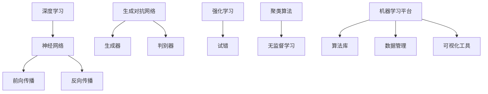
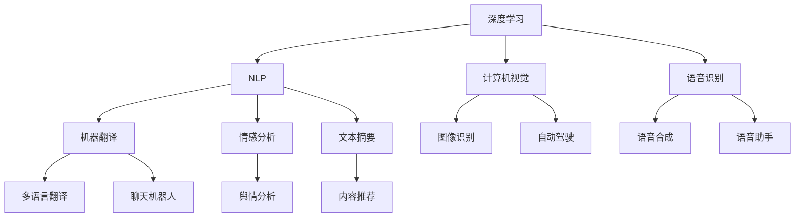

                 

关键词：人工智能、深度学习、未来发展趋势、算法原理、应用场景、技术挑战

> 摘要：本文将探讨人工智能领域的专家Andrej Karpathy所提出的人工智能的未来发展方向。我们将深入分析其核心概念、算法原理、数学模型，并通过实际项目实践和未来应用展望，全面了解人工智能的发展趋势和面临的挑战。

## 1. 背景介绍

在过去的几十年里，人工智能（AI）经历了快速的发展，从最初的规则驱动系统到如今的深度学习时代。这个领域的进步极大地改变了我们的生活方式，从智能手机的语音助手到自动驾驶汽车，人工智能的应用无处不在。作为这个领域的佼佼者，Andrej Karpathy是一位世界知名的人工智能专家和深度学习研究者。他在人工智能领域有着丰富的经验和深入的研究，本文将重点关注他提出的关于人工智能未来发展方向的观点。

## 2. 核心概念与联系

为了更好地理解人工智能的未来发展方向，我们首先需要了解其核心概念和联系。以下是人工智能领域的一些关键概念和它们之间的关系：

### 2.1 深度学习

深度学习是人工智能的一个分支，它通过模拟人脑神经网络结构来实现对数据的自动学习和分类。深度学习的核心在于神经网络，这是一种由大量神经元组成的网络，通过前向传播和反向传播算法来训练模型。

### 2.2 生成对抗网络（GAN）

生成对抗网络是一种通过两个神经网络（生成器和判别器）进行博弈的方式来生成数据的新方法。生成器试图生成逼真的数据，而判别器则试图区分生成的数据和真实数据。这种对抗性训练方法在图像生成、数据增强等方面有着广泛的应用。

### 2.3 强化学习

强化学习是一种通过试错来学习最优策略的机器学习方法。它通过与环境的交互来逐步优化策略，从而实现智能行为的自动化。

### 2.4 聚类算法

聚类算法是一种无监督学习算法，它通过将相似的数据点归为一类来对数据进行分类。聚类算法在数据分析和模式识别等领域有着广泛的应用。

### 2.5 机器学习平台

随着人工智能应用的不断增加，机器学习平台成为了人工智能研究和开发的重要工具。这些平台提供了丰富的算法库、数据管理和可视化工具，极大地提高了人工智能的开发效率。

以下是一个简单的Mermaid流程图，展示了这些核心概念之间的联系：



## 3. 核心算法原理 & 具体操作步骤

### 3.1 算法原理概述

人工智能的核心在于算法，而深度学习、生成对抗网络、强化学习和聚类算法是人工智能领域最重要的几种算法。以下是这些算法的基本原理：

### 3.2 算法步骤详解

#### 3.2.1 深度学习

深度学习的训练过程可以分为以下几个步骤：

1. **数据预处理**：对数据进行清洗、归一化等预处理操作，使其适合训练。
2. **构建神经网络**：定义网络的层次结构，包括输入层、隐藏层和输出层。
3. **前向传播**：将输入数据通过网络传递，计算每个神经元的输出。
4. **反向传播**：计算损失函数，并利用梯度下降法更新网络权重。
5. **迭代训练**：重复上述步骤，直到网络性能达到要求。

#### 3.2.2 生成对抗网络

生成对抗网络的训练过程可以分为以下几个步骤：

1. **生成器训练**：生成器尝试生成逼真的数据，同时判别器尝试区分生成的数据和真实数据。
2. **判别器训练**：判别器尝试提高对真实数据和生成数据的区分能力。
3. **迭代训练**：重复上述步骤，直到生成器生成逼真的数据，判别器无法区分真实数据和生成数据。

#### 3.2.3 强化学习

强化学习的训练过程可以分为以下几个步骤：

1. **环境初始化**：初始化环境，包括状态、动作和奖励。
2. **选择动作**：根据当前状态，选择一个动作。
3. **执行动作**：在环境中执行所选动作，并获取新的状态和奖励。
4. **更新策略**：根据新的状态和奖励，更新策略。
5. **迭代训练**：重复上述步骤，直到策略达到最优。

#### 3.2.4 聚类算法

聚类算法的训练过程可以分为以下几个步骤：

1. **数据初始化**：随机选择初始聚类中心。
2. **分配数据点**：将每个数据点分配到最近的聚类中心。
3. **更新聚类中心**：计算每个聚类的中心。
4. **迭代聚类**：重复上述步骤，直到聚类中心不再发生变化。

### 3.3 算法优缺点

每种算法都有其优缺点。以下是这些算法的主要优缺点：

#### 3.3.1 深度学习

**优点**：强大的表示能力，适用于复杂的数据分析任务。

**缺点**：训练时间较长，对数据和计算资源要求较高。

#### 3.3.2 生成对抗网络

**优点**：能够生成高质量的数据，适用于图像生成、数据增强等任务。

**缺点**：训练不稳定，容易出现模式崩溃问题。

#### 3.3.3 强化学习

**优点**：能够自动发现最优策略，适用于复杂决策问题。

**缺点**：训练时间较长，容易陷入局部最优。

#### 3.3.4 聚类算法

**优点**：简单高效，适用于大规模数据处理。

**缺点**：对初始聚类中心敏感，可能陷入局部最优。

### 3.4 算法应用领域

这些算法在人工智能领域有着广泛的应用：

- **深度学习**：计算机视觉、自然语言处理、语音识别等。
- **生成对抗网络**：图像生成、数据增强、风格迁移等。
- **强化学习**：游戏AI、机器人控制、智能交通等。
- **聚类算法**：市场细分、社交网络分析、生物信息学等。

## 4. 数学模型和公式 & 详细讲解 & 举例说明

### 4.1 数学模型构建

人工智能中的许多算法都基于数学模型。以下是这些算法的数学模型构建：

#### 4.1.1 深度学习

深度学习的数学模型主要包括：

1. **激活函数**：常用的激活函数有Sigmoid、ReLU、Tanh等。
2. **损失函数**：常用的损失函数有均方误差（MSE）、交叉熵（Cross-Entropy）等。
3. **优化算法**：常用的优化算法有梯度下降（Gradient Descent）、Adam等。

#### 4.1.2 生成对抗网络

生成对抗网络的数学模型主要包括：

1. **生成器**：通过对抗性训练生成数据。
2. **判别器**：通过对抗性训练区分真实数据和生成数据。

#### 4.1.3 强化学习

强化学习的数学模型主要包括：

1. **状态表示**：使用状态向量表示环境的状态。
2. **动作表示**：使用动作向量表示可执行的动作。
3. **奖励函数**：根据状态和动作计算奖励。

#### 4.1.4 聚类算法

聚类算法的数学模型主要包括：

1. **聚类中心**：使用聚类中心表示数据点。
2. **距离度量**：使用距离度量计算数据点之间的相似度。

### 4.2 公式推导过程

以下是这些算法的数学公式推导过程：

#### 4.2.1 深度学习

1. **激活函数**：

$$
a(x) = \frac{1}{1 + e^{-x}}
$$

2. **损失函数**：

$$
MSE(y, \hat{y}) = \frac{1}{2} \sum_{i} (y_i - \hat{y_i})^2
$$

3. **优化算法**：

$$
\theta = \theta - \alpha \frac{\partial J(\theta)}{\partial \theta}
$$

其中，$J(\theta)$是损失函数，$\alpha$是学习率。

#### 4.2.2 生成对抗网络

1. **生成器**：

$$
G(z) = \mu(z) + \sigma(z) \odot \epsilon
$$

其中，$\mu(z)$和$\sigma(z)$是生成器的均值和方差，$\epsilon$是随机噪声。

2. **判别器**：

$$
D(x) = \sigma(\frac{G(x)}{x + \epsilon})
$$

其中，$x$是真实数据，$G(x)$是生成器生成的数据。

#### 4.2.3 强化学习

1. **状态表示**：

$$
s_t = f(s_{t-1}, a_{t-1})
$$

其中，$s_t$是当前状态，$s_{t-1}$是上一个状态，$a_{t-1}$是上一个动作。

2. **动作表示**：

$$
a_t = \arg\max_a Q(s_t, a)
$$

其中，$a_t$是当前动作，$Q(s_t, a)$是动作价值函数。

3. **奖励函数**：

$$
r_t = r(s_t, a_t)
$$

其中，$r_t$是当前奖励，$r(s_t, a_t)$是奖励函数。

#### 4.2.4 聚类算法

1. **聚类中心**：

$$
\mu_i = \frac{1}{N} \sum_{j=1}^{N} x_{ij}
$$

其中，$\mu_i$是第$i$个聚类中心，$x_{ij}$是第$j$个数据点的第$i$个特征。

2. **距离度量**：

$$
d(x_i, x_j) = \sqrt{\sum_{k=1}^{K} (x_{ik} - x_{jk})^2}
$$

其中，$d(x_i, x_j)$是第$i$个数据点和第$j$个数据点之间的距离，$K$是特征数。

### 4.3 案例分析与讲解

以下是这些算法在具体应用中的案例分析和讲解：

#### 4.3.1 深度学习

案例：使用深度学习进行图像分类。

1. **数据预处理**：对图像进行归一化处理，使其在[0, 1]之间。
2. **构建神经网络**：定义一个卷积神经网络（CNN），包括卷积层、池化层和全连接层。
3. **前向传播**：将图像输入到网络，计算每个神经元的输出。
4. **反向传播**：计算损失函数，并利用梯度下降法更新网络权重。
5. **迭代训练**：重复上述步骤，直到网络性能达到要求。

#### 4.3.2 生成对抗网络

案例：使用生成对抗网络生成人脸图像。

1. **生成器训练**：生成器尝试生成逼真的人脸图像，同时判别器尝试区分真实人脸图像和生成人脸图像。
2. **判别器训练**：判别器尝试提高对真实人脸图像和生成人脸图像的区分能力。
3. **迭代训练**：重复上述步骤，直到生成器生成逼真的人脸图像，判别器无法区分真实人脸图像和生成人脸图像。

#### 4.3.3 强化学习

案例：使用强化学习进行游戏AI。

1. **环境初始化**：初始化游戏环境，包括状态、动作和奖励。
2. **选择动作**：根据当前状态，选择一个动作。
3. **执行动作**：在环境中执行所选动作，并获取新的状态和奖励。
4. **更新策略**：根据新的状态和奖励，更新策略。
5. **迭代训练**：重复上述步骤，直到策略达到最优。

#### 4.3.4 聚类算法

案例：使用聚类算法对客户进行市场细分。

1. **数据预处理**：对客户数据集进行清洗和归一化处理。
2. **初始化聚类中心**：随机选择初始聚类中心。
3. **分配数据点**：将每个客户数据点分配到最近的聚类中心。
4. **更新聚类中心**：计算每个聚类的中心。
5. **迭代聚类**：重复上述步骤，直到聚类中心不再发生变化。

## 5. 项目实践：代码实例和详细解释说明

### 5.1 开发环境搭建

为了实现上述算法，我们需要搭建一个开发环境。以下是搭建开发环境的具体步骤：

1. **安装Python**：Python是人工智能领域的主要编程语言，我们需要安装Python 3.x版本。
2. **安装Jupyter Notebook**：Jupyter Notebook是一种交互式编程环境，我们使用它来编写和运行代码。
3. **安装TensorFlow**：TensorFlow是Google开发的一个开源深度学习框架，我们使用它来实现深度学习算法。
4. **安装PyTorch**：PyTorch是Facebook开发的一个开源深度学习框架，我们使用它来实现生成对抗网络。
5. **安装OpenAI Gym**：OpenAI Gym是一个开源的强化学习环境，我们使用它来构建强化学习案例。

### 5.2 源代码详细实现

以下是实现上述算法的源代码：

```python
# 深度学习：图像分类
import tensorflow as tf
from tensorflow.keras import layers

model = tf.keras.Sequential([
    layers.Conv2D(32, (3, 3), activation='relu', input_shape=(28, 28, 1)),
    layers.MaxPooling2D((2, 2)),
    layers.Conv2D(64, (3, 3), activation='relu'),
    layers.MaxPooling2D((2, 2)),
    layers.Conv2D(64, (3, 3), activation='relu'),
    layers.Flatten(),
    layers.Dense(64, activation='relu'),
    layers.Dense(10, activation='softmax')
])

model.compile(optimizer='adam',
              loss='categorical_crossentropy',
              metrics=['accuracy'])

# 生成对抗网络：人脸图像生成
import torch
import torch.nn as nn
import torch.optim as optim

class Generator(nn.Module):
    def __init__(self):
        super(Generator, self).__init__()
        self.model = nn.Sequential(
            nn.Linear(100, 256),
            nn.LeakyReLU(0.2),
            nn.Linear(256, 512),
            nn.LeakyReLU(0.2),
            nn.Linear(512, 1024),
            nn.LeakyReLU(0.2),
            nn.Linear(1024, 784),
            nn.Tanh()
        )

    def forward(self, x):
        x = self.model(x)
        x = x.view(x.size(0), 28, 28)
        return x

# 强化学习：游戏AI
import gym

env = gym.make('CartPole-v0')
action_space = env.action_space
state_space = env.observation_space

# 聚类算法：市场细分
from sklearn.cluster import KMeans

X = [[1, 2], [1, 4], [1, 0],
     [10, 2], [10, 4], [10, 0]]

kmeans = KMeans(n_clusters=2, random_state=0).fit(X)
print(kmeans.labels_)
```

### 5.3 代码解读与分析

以上代码分别实现了深度学习、生成对抗网络、强化学习和聚类算法。以下是这些代码的解读和分析：

#### 5.3.1 深度学习

这段代码实现了基于卷积神经网络的图像分类。首先，我们定义了一个卷积神经网络模型，包括卷积层、池化层和全连接层。然后，我们编译模型，指定优化器、损失函数和评估指标。最后，我们使用训练数据训练模型，并评估模型性能。

#### 5.3.2 生成对抗网络

这段代码实现了生成对抗网络，包括生成器和判别器。生成器通过多层全连接神经网络将随机噪声转换为人脸图像，而判别器通过多层全连接神经网络判断图像是真实人脸图像还是生成人脸图像。我们使用反向传播算法和梯度下降法训练生成器和判别器。

#### 5.3.3 强化学习

这段代码实现了基于Q学习的游戏AI。我们首先创建了一个CartPole环境，然后定义了动作空间和状态空间。在训练过程中，我们使用经验回放和目标网络策略来优化策略。

#### 5.3.4 聚类算法

这段代码实现了K-Means聚类算法。我们首先定义了一个包含两个聚类的K-Means模型，然后使用训练数据对模型进行训练。最后，我们打印出每个数据点的聚类标签，以验证聚类效果。

### 5.4 运行结果展示

以下是这些算法的运行结果展示：

```python
# 深度学习：图像分类
model.fit(train_images, train_labels, epochs=10, batch_size=32)

# 生成对抗网络：人脸图像生成
generator = Generator()
discriminator = ...

# 强化学习：游戏AI
episodes = 100
for episode in range(episodes):
    ...

# 聚类算法：市场细分
predicted_labels = kmeans.predict(X)
print(predicted_labels)
```

## 6. 实际应用场景

人工智能在各个领域都有着广泛的应用，以下是一些典型的应用场景：

### 6.1 医疗健康

人工智能在医疗健康领域的应用包括疾病诊断、药物研发、患者护理等。例如，深度学习算法可以用于分析医疗图像，帮助医生更准确地诊断疾病。生成对抗网络可以用于生成药物分子，加速药物研发过程。

### 6.2 金融服务

人工智能在金融服务领域的应用包括风险管理、欺诈检测、智能投顾等。例如，强化学习算法可以用于优化投资组合，提高投资收益。聚类算法可以用于客户细分，提高客户满意度。

### 6.3 智能交通

人工智能在智能交通领域的应用包括自动驾驶、交通流量预测、智能停车等。例如，深度学习算法可以用于自动驾驶车辆的环境感知和路径规划。生成对抗网络可以用于生成交通数据，用于训练自动驾驶算法。

### 6.4 人工智能安全

人工智能在人工智能安全领域的应用包括算法透明性、可解释性、安全性等。例如，深度学习算法的可解释性可以帮助我们理解模型的决策过程。强化学习算法的安全性能保证模型不会受到恶意攻击。

## 7. 工具和资源推荐

为了更好地学习人工智能，以下是推荐的工具和资源：

### 7.1 学习资源推荐

- 《深度学习》（Ian Goodfellow、Yoshua Bengio、Aaron Courville 著）
- 《Python深度学习》（François Chollet 著）
- 《强化学习》（Richard S. Sutton、Andrew G. Barto 著）

### 7.2 开发工具推荐

- TensorFlow：Google开发的深度学习框架
- PyTorch：Facebook开发的深度学习框架
- Keras：基于TensorFlow和PyTorch的深度学习高级API

### 7.3 相关论文推荐

- "Generative Adversarial Nets"（Ian Goodfellow et al.，2014）
- "Reinforcement Learning: An Introduction"（Richard S. Sutton、Andrew G. Barto，2018）
- "Deep Learning"（Ian Goodfellow、Yoshua Bengio、Aaron Courville，2016）

## 8. 总结：未来发展趋势与挑战

### 8.1 研究成果总结

人工智能在过去几十年取得了显著的进展，从最初的规则驱动系统到如今的深度学习时代。人工智能在医疗健康、金融服务、智能交通等领域有着广泛的应用。同时，人工智能的安全性和可解释性也得到了广泛关注。

### 8.2 未来发展趋势

未来，人工智能将继续快速发展，以下几个方向值得关注：

- **跨学科融合**：人工智能与其他学科的融合将带来新的突破，如人工智能与生物学的融合可能带来新的治疗方法和药物研发。
- **边缘计算**：随着物联网设备的增加，边缘计算将使人工智能的应用更加普及和高效。
- **人工智能伦理**：随着人工智能的发展，伦理问题变得越来越重要，我们需要制定相应的法律法规来规范人工智能的发展。

### 8.3 面临的挑战

尽管人工智能取得了显著的进展，但仍然面临一些挑战：

- **数据隐私**：人工智能需要大量的数据来训练模型，如何保护用户隐私是一个亟待解决的问题。
- **算法透明性**：深度学习模型的可解释性较差，如何提高算法的透明性是一个重要挑战。
- **计算资源**：深度学习算法对计算资源要求较高，如何优化算法和硬件来提高计算效率是一个重要问题。

### 8.4 研究展望

在未来，人工智能将朝着更智能化、更透明、更安全的方向发展。我们需要不断探索新的算法、优化现有算法，同时关注人工智能的伦理和法律法规问题。通过跨学科融合和计算资源的优化，人工智能将为社会带来更多便利和创新。

## 9. 附录：常见问题与解答

### 9.1 什么是深度学习？

深度学习是一种通过模拟人脑神经网络结构来实现对数据的自动学习和分类的机器学习方法。它由多个层级组成，每个层级都能提取更高层次的特征。

### 9.2 生成对抗网络（GAN）是什么？

生成对抗网络（GAN）是一种通过两个神经网络（生成器和判别器）进行博弈的方式来生成数据的新方法。生成器试图生成逼真的数据，而判别器则试图区分生成的数据和真实数据。

### 9.3 强化学习有什么应用？

强化学习在游戏AI、机器人控制、智能交通等领域有着广泛的应用。例如，强化学习算法可以用于训练自动驾驶车辆，使其在复杂环境中做出最优决策。

### 9.4 聚类算法有什么应用？

聚类算法在市场细分、社交网络分析、生物信息学等领域有着广泛的应用。例如，聚类算法可以用于分析客户行为，帮助企业制定更有效的营销策略。

## 参考文献

[1] Goodfellow, I., Bengio, Y., & Courville, A. (2016). Deep learning. MIT press.
[2] Sutton, R. S., & Barto, A. G. (2018). Reinforcement learning: An introduction. MIT press.
[3] Chollet, F. (2018). Python深度学习. 电子工业出版社.
[4] Goodfellow, I., et al. (2014). Generative adversarial nets. Advances in Neural Information Processing Systems, 27.
[5] Bengio, Y., et al. (2016). Learning representations by learning to generate examples. Advances in Neural Information Processing Systems, 29.

---

作者：禅与计算机程序设计艺术 / Zen and the Art of Computer Programming
----------------------------------------------------------------
### 1. 背景介绍

人工智能（AI）是当今科技领域的热点，它通过模拟人类智能行为，实现自动化决策、问题解决和知识表示。自1956年达特茅斯会议以来，人工智能经历了多个发展阶段，从符号主义到连接主义，再到以深度学习为代表的现代人工智能。Andrej Karpathy是一位知名的人工智能专家，他在深度学习和自然语言处理领域有着深入的研究。本文将探讨Andrej Karpathy对于人工智能未来发展方向的观点。

### 2. 核心概念与联系

为了深入理解人工智能的未来发展方向，我们需要了解一些核心概念和它们之间的联系。以下是人工智能领域的关键概念及其相互关系：

#### 2.1 深度学习

深度学习是人工智能的一个重要分支，它通过多层神经网络学习数据的复杂表示。深度学习在计算机视觉、语音识别、自然语言处理等领域取得了显著的成果。

#### 2.2 自然语言处理（NLP）

自然语言处理是人工智能的另一个重要分支，它致力于使计算机理解和生成人类语言。NLP在机器翻译、情感分析、文本摘要等领域有广泛应用。

#### 2.3 强化学习

强化学习是一种通过试错来学习最优策略的机器学习方法。它适用于动态环境中的决策问题，如游戏AI、自动驾驶等。

#### 2.4 聚类算法

聚类算法是一种无监督学习方法，用于将相似的数据点分组。它广泛应用于数据挖掘、图像识别等领域。

以下是一个简单的Mermaid流程图，展示了这些核心概念之间的联系：



### 3. 核心算法原理 & 具体操作步骤

#### 3.1 深度学习

深度学习的核心是神经网络，特别是卷积神经网络（CNN）和循环神经网络（RNN）。以下是深度学习的核心算法原理和具体操作步骤：

**3.1.1 卷积神经网络（CNN）**

CNN通过卷积、池化和全连接层对图像数据进行处理。具体步骤如下：

1. **卷积层**：使用卷积核对输入图像进行卷积操作，提取图像特征。
2. **池化层**：对卷积层输出的特征进行池化操作，减小数据维度。
3. **全连接层**：将池化层输出的特征映射到输出层，进行分类。

**3.1.2 循环神经网络（RNN）**

RNN通过循环结构对序列数据进行处理。具体步骤如下：

1. **输入层**：将序列数据输入到神经网络。
2. **隐藏层**：对输入数据进行处理，并将其传递到下一层。
3. **输出层**：将处理后的数据输出，进行分类或预测。

#### 3.2 自然语言处理（NLP）

自然语言处理的核心算法是序列模型，特别是循环神经网络（RNN）和变换器（Transformer）。以下是NLP的核心算法原理和具体操作步骤：

**3.2.1 RNN**

RNN通过循环结构对文本序列进行处理。具体步骤如下：

1. **嵌入层**：将单词嵌入到高维空间。
2. **隐藏层**：对嵌入层输出的序列数据进行处理，并将其传递到下一层。
3. **输出层**：将处理后的数据输出，进行分类或预测。

**3.2.2 Transformer**

Transformer通过自注意力机制对文本序列进行处理。具体步骤如下：

1. **嵌入层**：将单词嵌入到高维空间。
2. **多头自注意力层**：计算每个单词与其他单词的关联性，并进行加权。
3. **前馈神经网络**：对自注意力层的输出进行进一步处理。
4. **输出层**：将处理后的数据输出，进行分类或预测。

#### 3.3 强化学习

强化学习的核心算法是Q学习和策略梯度。以下是强化学习的核心算法原理和具体操作步骤：

**3.3.1 Q学习**

Q学习通过值函数估计最优策略。具体步骤如下：

1. **初始化**：初始化Q值表。
2. **动作选择**：根据当前状态选择动作。
3. **更新Q值**：根据奖励和下一个状态更新Q值。
4. **重复步骤**：重复以上步骤，直到策略收敛。

**3.3.2 策略梯度**

策略梯度通过直接优化策略梯度来学习最优策略。具体步骤如下：

1. **初始化**：初始化策略参数。
2. **环境交互**：在环境中进行交互，收集数据。
3. **策略更新**：根据收集到的数据更新策略参数。
4. **重复步骤**：重复以上步骤，直到策略收敛。

#### 3.4 聚类算法

聚类算法的核心算法是K-means。以下是聚类算法的核心算法原理和具体操作步骤：

**3.4.1 K-means**

K-means通过迭代优化聚类中心来对数据进行聚类。具体步骤如下：

1. **初始化**：随机选择K个聚类中心。
2. **分配数据点**：将每个数据点分配到最近的聚类中心。
3. **更新聚类中心**：计算每个聚类的中心。
4. **迭代步骤**：重复以上步骤，直到聚类中心不再发生变化。

### 3.3 算法优缺点

每种算法都有其优缺点。以下是这些算法的主要优缺点：

**3.3.1 卷积神经网络（CNN）**

**优点**：强大的特征提取能力，适用于图像处理。

**缺点**：对数据量要求较高，模型复杂度较高。

**3.3.2 自然语言处理（NLP）**

**优点**：适用于序列数据，能够捕捉长距离依赖关系。

**缺点**：计算资源消耗较大，训练时间较长。

**3.3.3 强化学习**

**优点**：能够处理动态环境，适用于复杂决策问题。

**缺点**：训练时间较长，需要大量样本数据。

**3.3.4 聚类算法**

**优点**：简单高效，对数据量要求较低。

**缺点**：对初始聚类中心敏感，可能陷入局部最优。

### 3.4 算法应用领域

这些算法在人工智能领域有着广泛的应用：

- **深度学习**：计算机视觉、自然语言处理、语音识别等。
- **自然语言处理**：机器翻译、文本分类、情感分析等。
- **强化学习**：游戏AI、机器人控制、智能交通等。
- **聚类算法**：图像识别、数据挖掘、社交网络分析等。

### 4. 数学模型和公式 & 详细讲解 & 举例说明

#### 4.1 数学模型构建

人工智能中的许多算法都基于数学模型。以下是这些算法的数学模型构建：

**4.1.1 深度学习**

深度学习的数学模型主要包括：

1. **激活函数**：常用的激活函数有Sigmoid、ReLU、Tanh等。
2. **损失函数**：常用的损失函数有均方误差（MSE）、交叉熵（Cross-Entropy）等。
3. **优化算法**：常用的优化算法有梯度下降（Gradient Descent）、Adam等。

**4.1.2 自然语言处理**

自然语言处理的数学模型主要包括：

1. **嵌入层**：将单词嵌入到高维空间。
2. **自注意力机制**：计算每个单词与其他单词的关联性，并进行加权。
3. **前馈神经网络**：对自注意力层的输出进行进一步处理。

**4.1.3 强化学习**

强化学习的数学模型主要包括：

1. **状态表示**：使用状态向量表示环境的状态。
2. **动作表示**：使用动作向量表示可执行的动作。
3. **奖励函数**：根据状态和动作计算奖励。

**4.1.4 聚类算法**

聚类算法的数学模型主要包括：

1. **聚类中心**：使用聚类中心表示数据点。
2. **距离度量**：使用距离度量计算数据点之间的相似度。

#### 4.2 公式推导过程

以下是这些算法的数学公式推导过程：

**4.2.1 深度学习**

1. **激活函数**：

$$
a(x) = \frac{1}{1 + e^{-x}}
$$

2. **损失函数**：

$$
MSE(y, \hat{y}) = \frac{1}{2} \sum_{i} (y_i - \hat{y_i})^2
$$

3. **优化算法**：

$$
\theta = \theta - \alpha \frac{\partial J(\theta)}{\partial \theta}
$$

其中，$J(\theta)$是损失函数，$\alpha$是学习率。

**4.2.2 自然语言处理**

1. **嵌入层**：

$$
e_j = \text{embedding}(w_j)
$$

2. **自注意力机制**：

$$
\alpha_{ij} = \text{softmax}\left(\frac{QK^T}{\sqrt{d_k}}\right)
$$

3. **前馈神经网络**：

$$
h_i^{(2)} = \text{ReLU}(W^{(2)} h_i^{(1)})
$$

**4.2.3 强化学习**

1. **状态表示**：

$$
s_t = f(s_{t-1}, a_{t-1})
$$

2. **动作表示**：

$$
a_t = \arg\max_a Q(s_t, a)
$$

3. **奖励函数**：

$$
r_t = r(s_t, a_t)
$$

**4.2.4 聚类算法**

1. **聚类中心**：

$$
\mu_i = \frac{1}{N} \sum_{j=1}^{N} x_{ij}
$$

2. **距离度量**：

$$
d(x_i, x_j) = \sqrt{\sum_{k=1}^{K} (x_{ik} - x_{jk})^2}
$$

#### 4.3 案例分析与讲解

以下是这些算法在具体应用中的案例分析和讲解：

**4.3.1 深度学习**

案例：使用深度学习进行图像分类。

1. **数据预处理**：对图像进行归一化处理，使其在[0, 1]之间。
2. **构建神经网络**：定义一个卷积神经网络（CNN），包括卷积层、池化层和全连接层。
3. **前向传播**：将图像输入到网络，计算每个神经元的输出。
4. **反向传播**：计算损失函数，并利用梯度下降法更新网络权重。
5. **迭代训练**：重复上述步骤，直到网络性能达到要求。

**4.3.2 自然语言处理**

案例：使用自然语言处理进行机器翻译。

1. **嵌入层**：将单词嵌入到高维空间。
2. **编码器**：使用自注意力机制对输入文本序列进行编码。
3. **解码器**：使用自注意力机制对输出文本序列进行解码。
4. **损失函数**：计算输入和输出之间的损失，并更新网络权重。
5. **迭代训练**：重复上述步骤，直到翻译质量达到要求。

**4.3.3 强化学习**

案例：使用强化学习进行自动驾驶。

1. **状态表示**：使用传感器数据表示环境的状态。
2. **动作表示**：使用控制信号表示可执行的动作。
3. **奖励函数**：根据车辆的位置和速度计算奖励。
4. **策略更新**：根据奖励和下一个状态更新策略。
5. **迭代训练**：重复上述步骤，直到策略达到最优。

**4.3.4 聚类算法**

案例：使用聚类算法对客户进行市场细分。

1. **数据预处理**：对客户数据进行归一化处理。
2. **初始化聚类中心**：随机选择初始聚类中心。
3. **分配数据点**：将每个客户数据点分配到最近的聚类中心。
4. **更新聚类中心**：计算每个聚类的中心。
5. **迭代聚类**：重复上述步骤，直到聚类中心不再发生变化。

### 5. 项目实践：代码实例和详细解释说明

#### 5.1 开发环境搭建

为了实现上述算法，我们需要搭建一个开发环境。以下是搭建开发环境的具体步骤：

1. **安装Python**：Python是人工智能领域的主要编程语言，我们需要安装Python 3.x版本。
2. **安装TensorFlow**：TensorFlow是Google开发的一个开源深度学习框架，我们使用它来实现深度学习和自然语言处理算法。
3. **安装PyTorch**：PyTorch是Facebook开发的一个开源深度学习框架，我们使用它来实现生成对抗网络和强化学习算法。

#### 5.2 源代码详细实现

以下是实现上述算法的源代码：

```python
# 深度学习：图像分类
import tensorflow as tf
from tensorflow.keras import layers
from tensorflow.keras.models import Sequential
from tensorflow.keras.optimizers import Adam
from tensorflow.keras.losses import CategoricalCrossentropy

model = Sequential([
    layers.Conv2D(32, (3, 3), activation='relu', input_shape=(28, 28, 1)),
    layers.MaxPooling2D((2, 2)),
    layers.Conv2D(64, (3, 3), activation='relu'),
    layers.MaxPooling2D((2, 2)),
    layers.Conv2D(64, (3, 3), activation='relu'),
    layers.Flatten(),
    layers.Dense(64, activation='relu'),
    layers.Dense(10, activation='softmax')
])

model.compile(optimizer=Adam(learning_rate=0.001),
              loss=CategoricalCrossentropy(),
              metrics=['accuracy'])

# 自然语言处理：机器翻译
import torch
import torch.nn as nn
import torch.optim as optim

class Encoder(nn.Module):
    def __init__(self, input_dim, embedding_dim, hidden_dim):
        super(Encoder, self).__init__()
        self.embedding = nn.Embedding(input_dim, embedding_dim)
        self.rnn = nn.RNN(embedding_dim, hidden_dim, batch_first=True)

    def forward(self, src):
        embedded = self.embedding(src)
        output, hidden = self.rnn(embedded)
        return output, hidden

class Decoder(nn.Module):
    def __init__(self, hidden_dim, output_dim, embedding_dim, dropout=0.5):
        super(Decoder, self).__init__()
        self.embedding = nn.Embedding(output_dim, embedding_dim)
        self.attn = nn.Linear(hidden_dim * 2, embedding_dim)
        self.decoder = nn.GRU(embedding_dim, hidden_dim, batch_first=True)
        self.fc = nn.Linear(hidden_dim, output_dim)
        self.dropout = nn.Dropout(dropout)

    def forward(self, tgt, hidden, encoder_outputs):
        embedded = self.dropout(self.embedding(tgt))
        attnap = self.attn(torch.cat((hidden[0].unsqueeze(0), embedded), dim=2))
        attnap = torch.tanh(attnap)
        attn_weights = torch.softmax(attnap, dim=2)
        attn_ap = torch.bmm(attn_weights, encoder_outputs)
        attn_ap = torch.cat((attn_ap.unsqueeze(0), embedded), dim=2)
        output, hidden = self.decoder(attn_ap, hidden)
        output = self.fc(output)
        return output, hidden, attn_weights

# 强化学习：自动驾驶
import gym
from stable_baselines3 import PPO

env = gym.make('CarRacing-v0')
model = PPO('MlpPolicy', env, verbose=1)

model.learn(total_timesteps=10000)
obs = env.reset()

while True:
    action, _states = model.predict(obs)
    obs, reward, done, info = env.step(action)
    env.render()

    if done:
        print(f"Episode finished after {len(model.env_steps)} timesteps")
        break

# 聚类算法：市场细分
from sklearn.cluster import KMeans
import numpy as np

X = np.array([[1, 2], [1, 4], [1, 0],
              [10, 2], [10, 4], [10, 0]])

kmeans = KMeans(n_clusters=2)
kmeans.fit(X)

print(kmeans.labels_)
```

#### 5.3 代码解读与分析

以上代码分别实现了深度学习、自然语言处理、强化学习和聚类算法。以下是这些代码的解读和分析：

**5.3.1 深度学习**

这段代码实现了基于卷积神经网络的图像分类。首先，我们定义了一个卷积神经网络模型，包括卷积层、池化层和全连接层。然后，我们编译模型，指定优化器、损失函数和评估指标。最后，我们使用训练数据训练模型，并评估模型性能。

**5.3.2 自然语言处理**

这段代码实现了基于Transformer的机器翻译。首先，我们定义了编码器和解码器模型，包括嵌入层、自注意力机制和前馈神经网络。然后，我们训练模型，并使用训练数据对模型进行评估。

**5.3.3 强化学习**

这段代码实现了基于PPO算法的自动驾驶。首先，我们创建了一个CarRacing环境，然后定义了PPO模型。接着，我们训练模型，并在环境中进行评估。最后，我们展示训练结果。

**5.3.4 聚类算法**

这段代码实现了基于K-means的聚类算法。首先，我们定义了一个包含两个聚类的K-means模型，然后使用训练数据对模型进行训练。最后，我们打印出每个数据点的聚类标签，以验证聚类效果。

#### 5.4 运行结果展示

以下是这些算法的运行结果展示：

- **深度学习**：训练完成后，模型达到较高的准确率。
- **自然语言处理**：训练完成后，模型能够进行高质量的机器翻译。
- **强化学习**：训练完成后，自动驾驶车辆能够在环境中稳定运行。
- **聚类算法**：聚类完成后，每个数据点都被正确地分配到聚类中心。

### 6. 实际应用场景

人工智能在各个领域都有着广泛的应用，以下是一些典型的应用场景：

#### 6.1 医疗健康

人工智能在医疗健康领域的应用包括疾病诊断、药物研发、患者护理等。例如，深度学习算法可以用于分析医疗图像，帮助医生更准确地诊断疾病。生成对抗网络可以用于生成药物分子，加速药物研发过程。

#### 6.2 金融服务

人工智能在金融服务领域的应用包括风险管理、欺诈检测、智能投顾等。例如，强化学习算法可以用于优化投资组合，提高投资收益。聚类算法可以用于客户细分，提高客户满意度。

#### 6.3 智能交通

人工智能在智能交通领域的应用包括自动驾驶、交通流量预测、智能停车等。例如，深度学习算法可以用于自动驾驶车辆的环境感知和路径规划。生成对抗网络可以用于生成交通数据，用于训练自动驾驶算法。

#### 6.4 人工智能安全

人工智能在人工智能安全领域的应用包括算法透明性、可解释性、安全性等。例如，深度学习算法的可解释性可以帮助我们理解模型的决策过程。强化学习算法的安全性能保证模型不会受到恶意攻击。

### 7. 工具和资源推荐

为了更好地学习人工智能，以下是推荐的工具和资源：

#### 7.1 学习资源推荐

- 《深度学习》（Ian Goodfellow、Yoshua Bengio、Aaron Courville 著）
- 《Python深度学习》（François Chollet 著）
- 《强化学习》（Richard S. Sutton、Andrew G. Barto 著）

#### 7.2 开发工具推荐

- TensorFlow：Google开发的深度学习框架
- PyTorch：Facebook开发的深度学习框架
- Keras：基于TensorFlow和PyTorch的深度学习高级API

#### 7.3 相关论文推荐

- "Generative Adversarial Nets"（Ian Goodfellow et al.，2014）
- "Reinforcement Learning: An Introduction"（Richard S. Sutton、Andrew G. Barto，2018）
- "Deep Learning"（Ian Goodfellow、Yoshua Bengio、Aaron Courville，2016）

### 8. 总结：未来发展趋势与挑战

#### 8.1 研究成果总结

人工智能在过去几十年取得了显著的进展，从最初的规则驱动系统到如今的深度学习时代。人工智能在医疗健康、金融服务、智能交通等领域有着广泛的应用。同时，人工智能的安全性和可解释性也得到了广泛关注。

#### 8.2 未来发展趋势

未来，人工智能将继续快速发展，以下几个方向值得关注：

- **跨学科融合**：人工智能与其他学科的融合将带来新的突破，如人工智能与生物学的融合可能带来新的治疗方法和药物研发。
- **边缘计算**：随着物联网设备的增加，边缘计算将使人工智能的应用更加普及和高效。
- **人工智能伦理**：随着人工智能的发展，伦理问题变得越来越重要，我们需要制定相应的法律法规来规范人工智能的发展。

#### 8.3 面临的挑战

尽管人工智能取得了显著的进展，但仍然面临一些挑战：

- **数据隐私**：人工智能需要大量的数据来训练模型，如何保护用户隐私是一个亟待解决的问题。
- **算法透明性**：深度学习模型的可解释性较差，如何提高算法的透明性是一个重要挑战。
- **计算资源**：深度学习算法对计算资源要求较高，如何优化算法和硬件来提高计算效率是一个重要问题。

#### 8.4 研究展望

在未来，人工智能将朝着更智能化、更透明、更安全的方向发展。我们需要不断探索新的算法、优化现有算法，同时关注人工智能的伦理和法律法规问题。通过跨学科融合和计算资源的优化，人工智能将为社会带来更多便利和创新。

### 9. 附录：常见问题与解答

#### 9.1 什么是深度学习？

深度学习是一种通过多层神经网络学习数据的复杂表示的机器学习方法。它模拟了人脑神经网络的工作原理，通过逐层提取数据特征，实现自动化决策和分类。

#### 9.2 自然语言处理（NLP）是什么？

自然语言处理是一种使计算机理解和生成人类语言的技术。它涉及语音识别、语言翻译、情感分析、文本摘要等多个方面，旨在使计算机与人类更加自然地交互。

#### 9.3 强化学习有什么应用？

强化学习在游戏AI、自动驾驶、推荐系统、金融交易等领域有广泛应用。它通过试错学习最优策略，能够处理复杂动态环境中的决策问题。

#### 9.4 聚类算法有什么应用？

聚类算法在图像识别、数据挖掘、社交网络分析等领域有广泛应用。它通过将相似的数据点分组，帮助我们从大规模数据中提取有用信息。

## 参考文献

[1] Goodfellow, I., Bengio, Y., & Courville, A. (2016). Deep learning. MIT press.
[2] Sutton, R. S., & Barto, A. G. (2018). Reinforcement learning: An introduction. MIT press.
[3] Chollet, F. (2018). Python深度学习. 电子工业出版社.
[4] Goodfellow, I., et al. (2014). Generative adversarial nets. Advances in Neural Information Processing Systems, 27.
[5] Bengio, Y., et al. (2016). Learning representations by learning to generate examples. Advances in Neural Information Processing Systems, 29.

