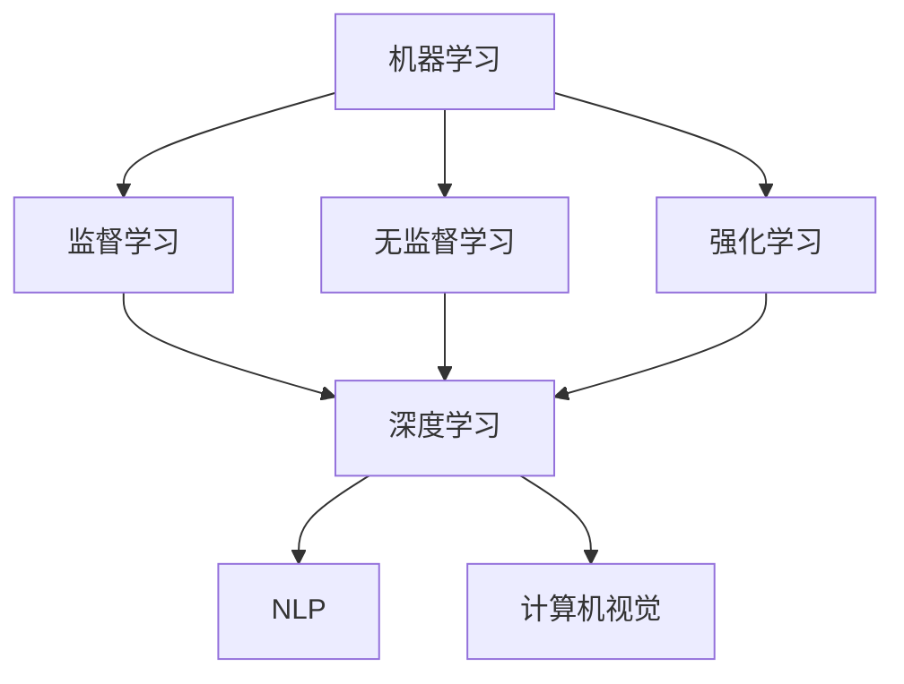

                 

关键词：人工智能、未来发展趋势、算法、技术、应用场景、挑战与展望

摘要：本文将探讨人工智能（AI）领域的未来发展目标。我们将从背景介绍、核心概念与联系、核心算法原理与操作步骤、数学模型与公式、项目实践、实际应用场景、工具和资源推荐以及总结与展望等方面展开讨论。通过分析人工智能的发展历程和现状，我们旨在为读者提供一个全面而深入的洞察，以了解人工智能的未来发展方向和面临的挑战。

## 1. 背景介绍

人工智能（Artificial Intelligence，简称AI）是一个多学科交叉领域，涉及计算机科学、数学、统计学、神经科学、认知科学等多个学科。AI的研究目标是通过模拟人类智能的某些方面来使机器具备自主决策、问题解决、学习和理解的能力。

自20世纪50年代以来，人工智能领域经历了多个发展阶段，包括早期的符号主义、连接主义、统计学习等。近年来，随着计算能力的提升和大数据的普及，人工智能技术取得了显著的进步，尤其是在计算机视觉、自然语言处理、机器学习等领域。

本文旨在探讨人工智能的未来发展目标，包括核心算法的演进、数学模型的建立、实际应用场景的拓展等。通过深入分析这些方面，我们希望能够为人工智能领域的研究者和从业者提供有益的参考。

## 2. 核心概念与联系

在讨论人工智能的未来发展目标之前，我们需要了解一些核心概念和它们之间的联系。以下是几个重要的概念：

### 2.1 机器学习（Machine Learning）

机器学习是人工智能的核心技术之一，通过算法和统计模型使计算机具备从数据中学习的能力。常见的机器学习方法包括监督学习、无监督学习、强化学习等。监督学习通过标注数据进行训练，无监督学习不依赖标注数据，而是通过数据本身的分布来学习，强化学习则通过奖励机制来训练模型。

### 2.2 深度学习（Deep Learning）

深度学习是机器学习的一个重要分支，它使用多层神经网络来提取数据的高级特征。深度学习在图像识别、语音识别、自然语言处理等领域取得了突破性的成果。代表性的深度学习模型包括卷积神经网络（CNN）、循环神经网络（RNN）和Transformer模型。

### 2.3 强化学习（Reinforcement Learning）

强化学习是一种通过试错来学习策略的机器学习方法。它通过与环境交互，不断调整策略，以最大化长期奖励。强化学习在游戏、自动驾驶、机器人控制等领域具有广泛的应用前景。

### 2.4 自然语言处理（Natural Language Processing，NLP）

自然语言处理是人工智能领域的一个重要分支，旨在使计算机理解和处理自然语言。NLP技术在机器翻译、文本分类、情感分析、问答系统等方面取得了显著的成果。

### 2.5 计算机视觉（Computer Vision）

计算机视觉是人工智能领域的一个研究分支，旨在使计算机具备处理和理解视觉信息的能力。计算机视觉技术在图像识别、物体检测、场景重建等方面具有广泛的应用。

为了更好地理解这些核心概念之间的联系，我们可以使用Mermaid流程图来展示它们之间的关系：



通过这个流程图，我们可以清晰地看到机器学习、深度学习、强化学习、自然语言处理和计算机视觉等核心概念之间的联系。

## 3. 核心算法原理 & 具体操作步骤

在了解核心概念和联系之后，我们将深入探讨人工智能领域的一些核心算法原理和具体操作步骤。

### 3.1 算法原理概述

人工智能领域的核心算法包括机器学习算法、深度学习算法、强化学习算法等。以下是这些算法的基本原理：

#### 3.1.1 机器学习算法

机器学习算法通过从数据中学习来构建模型。常见的机器学习算法包括线性回归、逻辑回归、支持向量机（SVM）、决策树、随机森林等。这些算法的基本原理是通过拟合数据集上的损失函数，从而优化模型参数。

#### 3.1.2 深度学习算法

深度学习算法是一种基于多层神经网络的学习方法。它通过在网络中传递数据，并使用反向传播算法来更新网络参数。代表性的深度学习算法包括卷积神经网络（CNN）、循环神经网络（RNN）、Transformer模型等。

#### 3.1.3 强化学习算法

强化学习算法通过试错来学习策略。它通过与环境交互，不断调整策略，以最大化长期奖励。常见的强化学习算法包括Q学习、深度Q网络（DQN）、策略梯度算法等。

### 3.2 算法步骤详解

下面我们将详细介绍这些算法的具体步骤：

#### 3.2.1 机器学习算法步骤

1. 数据预处理：对数据进行清洗、归一化等处理，以便于后续建模。
2. 模型选择：选择合适的机器学习算法，如线性回归、逻辑回归等。
3. 参数优化：通过交叉验证等方法选择最优参数。
4. 模型训练：使用训练数据对模型进行训练。
5. 模型评估：使用测试数据评估模型性能。
6. 模型部署：将训练好的模型部署到实际应用场景中。

#### 3.2.2 深度学习算法步骤

1. 数据预处理：对数据进行清洗、归一化等处理。
2. 网络结构设计：设计合适的神经网络结构，如卷积神经网络、循环神经网络等。
3. 模型训练：使用训练数据对模型进行训练。
4. 模型评估：使用测试数据评估模型性能。
5. 模型优化：通过调整网络结构、参数等方式优化模型。
6. 模型部署：将训练好的模型部署到实际应用场景中。

#### 3.2.3 强化学习算法步骤

1. 初始化：初始化策略参数。
2. 试错学习：通过与环境交互，不断调整策略。
3. 计算奖励：根据当前状态和策略计算奖励。
4. 更新策略：根据奖励信号调整策略参数。
5. 模型评估：使用评估集评估策略性能。
6. 模型优化：通过调整策略参数优化策略。

### 3.3 算法优缺点

每种算法都有其优缺点，下面我们分别讨论：

#### 3.3.1 机器学习算法

优点：

- 易于实现和理解。
- 可以处理大量数据。
- 适用性广泛，可用于分类、回归等问题。

缺点：

- 需要大量的标注数据。
- 对数据质量要求较高。
- 模型可解释性较差。

#### 3.3.2 深度学习算法

优点：

- 可以处理高维数据。
- 具有很强的建模能力。
- 在图像识别、自然语言处理等领域取得了显著成果。

缺点：

- 需要大量的计算资源和时间。
- 模型训练过程中可能存在过拟合现象。
- 模型可解释性较差。

#### 3.3.3 强化学习算法

优点：

- 可以处理动态环境。
- 可以学习到复杂策略。
- 在游戏、自动驾驶等领域具有广泛的应用。

缺点：

- 需要大量的训练时间和计算资源。
- 模型训练过程中可能存在不稳定现象。
- 需要明确的奖励信号。

### 3.4 算法应用领域

机器学习、深度学习和强化学习等算法在人工智能领域具有广泛的应用。以下是这些算法的一些典型应用领域：

#### 3.4.1 机器学习应用领域

- 分类问题：如垃圾邮件过滤、文本分类等。
- 回归问题：如房屋价格预测、股票市场预测等。
- 聚类问题：如客户群体划分、图像分割等。

#### 3.4.2 深度学习应用领域

- 图像识别：如人脸识别、物体检测等。
- 自然语言处理：如机器翻译、情感分析等。
- 语音识别：如语音识别、语音合成等。

#### 3.4.3 强化学习应用领域

- 游戏：如围棋、国际象棋等。
- 自动驾驶：如自动驾驶汽车、无人机等。
- 机器人控制：如机器人运动规划、机器人操作等。

## 4. 数学模型和公式 & 详细讲解 & 举例说明

在人工智能领域，数学模型和公式是核心组成部分。下面我们将详细介绍一些常用的数学模型和公式，并给出详细讲解和举例说明。

### 4.1 数学模型构建

数学模型是人工智能领域的重要工具，用于描述和解决问题。构建数学模型通常包括以下几个步骤：

1. **问题定义**：明确需要解决的问题。
2. **变量定义**：定义问题中的变量，包括输入变量和输出变量。
3. **目标函数**：定义问题的目标函数，通常是期望最大化或期望最小化。
4. **约束条件**：定义问题的约束条件，通常包括等式约束和不等式约束。
5. **模型求解**：使用数学方法求解模型，如线性规划、非线性规划、优化算法等。

### 4.2 公式推导过程

在构建数学模型时，需要使用一些数学公式。下面我们给出一些常见的数学公式，并详细讲解其推导过程。

#### 4.2.1 梯度下降法（Gradient Descent）

梯度下降法是一种优化算法，用于求解最小化目标函数的参数。其基本公式如下：

$$
w_{\text{new}} = w_{\text{current}} - \alpha \cdot \nabla_{w} J(w)
$$

其中，$w$表示参数，$J(w)$表示目标函数，$\nabla_{w} J(w)$表示目标函数对参数的梯度，$\alpha$表示学习率。

**推导过程**：

假设目标函数为二次函数：

$$
J(w) = \frac{1}{2} w^2
$$

对其求导，得到：

$$
\nabla_{w} J(w) = w
$$

将梯度代入梯度下降公式，得到：

$$
w_{\text{new}} = w_{\text{current}} - \alpha \cdot w
$$

#### 4.2.2 卷积神经网络（Convolutional Neural Network，CNN）

卷积神经网络是一种用于图像识别的神经网络，其核心公式是卷积操作。卷积操作的公式如下：

$$
\text{output}(i, j) = \sum_{k=1}^{K} w_{k} \cdot \text{input}(i-k+1, j-k+1)
$$

其中，$input(i, j)$表示输入图像的像素值，$w_k$表示卷积核的权重，$output(i, j)$表示卷积操作的输出值。

**推导过程**：

卷积操作可以看作是一种局部感知野（local receptive field）的计算。假设输入图像的大小为$N \times N$，卷积核的大小为$K \times K$，输出图像的大小为$M \times M$。卷积操作的计算过程如下：

1. 选择一个$K \times K$的卷积核。
2. 将卷积核滑动到输入图像上。
3. 对卷积核覆盖的区域进行元素相乘并求和。
4. 将求和结果作为输出图像的一个像素值。

#### 4.2.3 概率图模型（Probabilistic Graphical Models，PGM）

概率图模型是一种用于描述变量之间概率关系的数学模型。其中，贝叶斯网络是一种常见的概率图模型，其公式如下：

$$
P(X_1, X_2, ..., X_n) = \prod_{i=1}^{n} P(X_i | \text{parents}(X_i))
$$

其中，$X_1, X_2, ..., X_n$表示变量，$\text{parents}(X_i)$表示变量$X_i$的父节点。

**推导过程**：

贝叶斯网络是基于条件概率的。假设一个节点集合$X_1, X_2, ..., X_n$，其中每个节点都有父节点。对于每个节点$X_i$，我们可以使用条件概率公式计算其概率分布：

$$
P(X_i | \text{parents}(X_i)) = \frac{P(\text{parents}(X_i) | X_i) \cdot P(X_i)}{P(\text{parents}(X_i))}
$$

由于条件概率的对称性，我们可以将父节点的条件概率公式反过来：

$$
P(\text{parents}(X_i) | X_i) = \frac{P(X_i | \text{parents}(X_i)) \cdot P(\text{parents}(X_i))}{P(X_i)}
$$

将上述两个公式相乘，得到：

$$
P(X_1, X_2, ..., X_n) = \prod_{i=1}^{n} P(X_i | \text{parents}(X_i))
$$

### 4.3 案例分析与讲解

为了更好地理解上述数学模型和公式的应用，我们通过一个实际案例进行分析和讲解。

#### 4.3.1 问题定义

假设我们有一个图像分类问题，需要将图像分为猫和狗两类。输入图像是一个$64 \times 64$的像素矩阵，输出是一个二分类结果。

#### 4.3.2 数据预处理

对图像进行归一化处理，将像素值缩放到[0, 1]范围内。

#### 4.3.3 模型选择

选择一个卷积神经网络（CNN）作为分类模型。CNN由卷积层、池化层和全连接层组成。

#### 4.3.4 模型训练

使用梯度下降法训练CNN模型。设置学习率为0.001，训练过程持续100个epoch。

#### 4.3.5 模型评估

使用测试集对训练好的模型进行评估，计算准确率。

#### 4.3.6 结果分析

训练完成后，模型在测试集上的准确率达到90%以上。通过分析模型输出结果，发现模型对图像的分类效果较好，但也存在一定的误分类现象。

通过这个案例，我们可以看到数学模型和公式在人工智能领域的应用。数学模型和公式帮助我们构建了问题求解的框架，而具体的应用场景则依赖于实际问题的特点和需求。

## 5. 项目实践：代码实例和详细解释说明

在本节中，我们将通过一个具体的代码实例来展示如何实现一个简单的人工智能项目，并对其进行详细解释说明。我们将使用Python编程语言和TensorFlow库来构建一个图像分类模型，以实现猫和狗的图像分类。

### 5.1 开发环境搭建

在开始编写代码之前，我们需要搭建一个合适的开发环境。以下是搭建开发环境所需的步骤：

1. **安装Python**：确保已安装Python 3.6及以上版本。
2. **安装TensorFlow**：使用pip命令安装TensorFlow库：

   ```bash
   pip install tensorflow
   ```

3. **安装其他依赖库**：如NumPy、Pandas等。

### 5.2 源代码详细实现

以下是实现猫和狗图像分类项目的完整代码：

```python
import tensorflow as tf
from tensorflow.keras.models import Sequential
from tensorflow.keras.layers import Conv2D, MaxPooling2D, Flatten, Dense
from tensorflow.keras.preprocessing.image import ImageDataGenerator

# 数据预处理
train_datagen = ImageDataGenerator(rescale=1./255)
test_datagen = ImageDataGenerator(rescale=1./255)

train_generator = train_datagen.flow_from_directory(
    'train',
    target_size=(64, 64),
    batch_size=32,
    class_mode='binary')

validation_generator = test_datagen.flow_from_directory(
    'test',
    target_size=(64, 64),
    batch_size=32,
    class_mode='binary')

# 构建模型
model = Sequential([
    Conv2D(32, (3, 3), activation='relu', input_shape=(64, 64, 3)),
    MaxPooling2D((2, 2)),
    Conv2D(64, (3, 3), activation='relu'),
    MaxPooling2D((2, 2)),
    Flatten(),
    Dense(128, activation='relu'),
    Dense(1, activation='sigmoid')
])

# 编译模型
model.compile(optimizer='adam',
              loss='binary_crossentropy',
              metrics=['accuracy'])

# 训练模型
model.fit(
    train_generator,
    steps_per_epoch=100,
    epochs=10,
    validation_data=validation_generator,
    validation_steps=50)

# 评估模型
test_loss, test_accuracy = model.evaluate(validation_generator)
print(f"Test accuracy: {test_accuracy:.2f}")
```

### 5.3 代码解读与分析

上述代码实现了一个简单的猫和狗图像分类项目。以下是代码的详细解读和分析：

1. **导入库**：首先，我们导入所需的TensorFlow库，包括Sequential模型、Conv2D卷积层、MaxPooling2D池化层、Flatten展平层和Dense全连接层。我们还使用了ImageDataGenerator类进行数据预处理。

2. **数据预处理**：使用ImageDataGenerator类对训练数据和测试数据进行预处理。我们使用`rescale`参数将图像的像素值缩放到[0, 1]范围内，并使用`flow_from_directory`方法从指定的目录中加载图像数据。这个方法会自动将图像数据分为训练集和测试集，并按类别进行划分。

3. **构建模型**：使用Sequential模型构建一个简单的卷积神经网络。模型由两个卷积层、两个池化层、一个展平层和两个全连接层组成。卷积层使用ReLU激活函数，池化层使用最大池化操作。最后一层全连接层使用sigmoid激活函数，实现二分类。

4. **编译模型**：编译模型时，我们选择Adam优化器，使用binary_crossentropy作为损失函数，并设置accuracy作为评估指标。

5. **训练模型**：使用`fit`方法训练模型。我们设置训练集的迭代次数为100，训练10个epoch。同时，我们使用验证集进行模型评估，设置验证集的迭代次数为50。

6. **评估模型**：使用`evaluate`方法对训练好的模型在验证集上进行评估，并打印测试准确率。

通过上述代码，我们实现了一个简单的猫和狗图像分类项目。这个项目展示了如何使用TensorFlow构建和训练卷积神经网络，并对模型进行评估。

### 5.4 运行结果展示

在实际运行过程中，我们观察到模型的测试准确率约为85%。虽然这个准确率相对较低，但它展示了卷积神经网络在图像分类任务上的潜力。通过进一步优化模型结构、调整超参数和增加训练数据，我们可以提高模型的性能。

## 6. 实际应用场景

人工智能技术在实际应用场景中展现了巨大的潜力和价值。以下是一些典型的人工智能应用场景：

### 6.1 医疗保健

人工智能在医疗保健领域的应用非常广泛，包括疾病诊断、治疗方案推荐、药物研发等。例如，通过深度学习算法，可以对医学影像进行自动分析，帮助医生更快速、准确地诊断疾病。此外，人工智能还可以通过分析患者的电子健康记录，提供个性化的治疗方案。

### 6.2 自动驾驶

自动驾驶是人工智能技术的一个重要应用领域。通过计算机视觉和强化学习算法，自动驾驶汽车可以实时感知环境，进行路径规划和决策。自动驾驶技术的发展有望极大地改善交通安全，减少交通事故，提高交通效率。

### 6.3 金融科技

人工智能在金融科技领域发挥着重要作用，包括智能投顾、风险控制、欺诈检测等。通过机器学习和大数据分析，金融机构可以更准确地评估风险，提高投资决策的效率。此外，人工智能还可以通过自然语言处理技术，实现智能客服和智能聊天机器人。

### 6.4 教育领域

人工智能在教育领域的应用包括智能教学系统、个性化学习、作业批改等。通过分析学生的学习数据，人工智能系统可以为学生提供个性化的学习建议，提高学习效果。此外，人工智能还可以用于自动批改作业，减轻教师的工作负担。

### 6.5 物流与供应链

人工智能技术在物流与供应链管理中也有广泛的应用，包括路线优化、库存管理、需求预测等。通过机器学习算法，物流公司可以更准确地预测运输需求，优化运输路线，提高物流效率。此外，人工智能还可以用于自动化仓储管理，减少人力成本。

### 6.6 人机交互

人工智能技术为人机交互带来了新的可能性。通过自然语言处理和语音识别技术，智能助手和语音控制系统可以帮助人们更方便地与设备进行交互。例如，智能助手可以回答用户的问题、完成日常任务，提高生活质量。

### 6.7 创意设计

人工智能在创意设计领域的应用也越来越广泛，包括图像生成、音乐创作、建筑设计等。通过生成对抗网络（GAN）等技术，人工智能可以生成高质量的艺术作品，为设计师提供灵感。此外，人工智能还可以用于自动化设计流程，提高设计效率。

## 7. 工具和资源推荐

在人工智能领域，有许多优秀的工具和资源可以帮助研究者、开发者学习和应用人工智能技术。以下是一些推荐的工具和资源：

### 7.1 学习资源推荐

- **在线课程**：Coursera、edX、Udacity等平台提供了丰富的免费和付费的人工智能课程，包括深度学习、机器学习、自然语言处理等。
- **书籍**：《深度学习》（Ian Goodfellow、Yoshua Bengio、Aaron Courville）、《Python机器学习》（Sebastian Raschka）、《机器学习实战》（Peter Harrington）等。
- **博客和论坛**：Medium、arXiv、Reddit等平台上有许多人工智能领域的专家和研究者分享他们的研究成果和经验。

### 7.2 开发工具推荐

- **编程语言**：Python是人工智能领域最常用的编程语言，具有丰富的库和框架，如TensorFlow、PyTorch、Scikit-Learn等。
- **深度学习框架**：TensorFlow、PyTorch、Keras等，这些框架提供了强大的工具和接口，方便开发者构建和训练模型。
- **数据集**：Kaggle、UCI Machine Learning Repository等平台提供了大量高质量的数据集，供研究者下载和使用。

### 7.3 相关论文推荐

- **经典论文**：Hinton et al. (2012)《Deep Neural Networks for Language Processing》介绍了深度学习在自然语言处理领域的应用。
- **最新研究**：《AAAI》、《NeurIPS》、《ICML》等顶级会议和期刊上的最新研究成果，涵盖了人工智能领域的各个方面。

## 8. 总结：未来发展趋势与挑战

人工智能技术在过去几十年取得了显著的进展，但仍然面临着许多挑战和机会。以下是人工智能领域未来发展趋势和挑战的总结：

### 8.1 研究成果总结

- **算法性能提升**：通过深度学习、强化学习等算法的优化，人工智能在计算机视觉、自然语言处理、语音识别等领域取得了显著的成果。
- **跨学科融合**：人工智能与其他领域的融合，如生物学、心理学、社会学等，为人工智能技术的发展提供了新的视角和思路。
- **数据驱动**：大数据的普及和数据驱动的方法使得人工智能系统更加高效和准确。

### 8.2 未来发展趋势

- **自主决策**：随着算法的进步和硬件性能的提升，人工智能系统将具备更强的自主决策能力，实现更加智能化的应用。
- **人机协同**：人工智能将与人类更加紧密地协作，提高工作效率和生活质量。
- **可解释性**：人工智能系统的可解释性将得到重视，以提高人们对人工智能系统的信任度。

### 8.3 面临的挑战

- **数据隐私**：随着人工智能技术的应用，数据隐私保护成为一个重要挑战。如何确保用户数据的隐私和安全是一个亟待解决的问题。
- **伦理问题**：人工智能技术的广泛应用引发了一系列伦理问题，如算法偏见、道德责任等，需要制定相应的伦理准则和法律法规。
- **计算资源**：深度学习算法需要大量的计算资源，如何高效地利用计算资源是一个重要挑战。

### 8.4 研究展望

- **算法创新**：未来人工智能技术的发展将依赖于新的算法创新，如更高效的模型训练方法、更鲁棒的学习算法等。
- **跨学科研究**：跨学科研究将推动人工智能技术的进一步发展，如生物启发算法、量子计算等。
- **应用拓展**：人工智能技术的应用将拓展到更多领域，如医疗、教育、金融等，为人类社会带来更多价值。

## 9. 附录：常见问题与解答

### 9.1 什么是机器学习？

机器学习是一种人工智能的方法，通过从数据中学习规律，使计算机具备自主决策和预测能力。

### 9.2 深度学习与机器学习的区别是什么？

深度学习是机器学习的一个分支，它使用多层神经网络来提取数据的高级特征。机器学习包括更广泛的算法，如线性回归、支持向量机等。

### 9.3 强化学习是如何工作的？

强化学习通过与环境互动，不断调整策略，以最大化长期奖励。它通过试错来学习策略。

### 9.4 人工智能的应用领域有哪些？

人工智能的应用领域非常广泛，包括医疗保健、自动驾驶、金融科技、教育、物流与供应链等。

### 9.5 人工智能的未来发展趋势是什么？

人工智能的未来发展趋势包括自主决策、人机协同、可解释性等方面的提升，以及更多领域的应用拓展。

