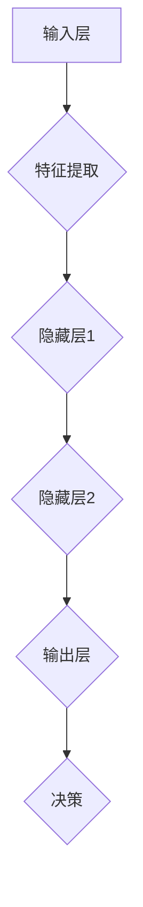

                 

关键词：人工智能，未来发展，策略，技术趋势，挑战

人工智能（AI）已经成为现代技术的核心驱动力，从智能助手到自动驾驶汽车，从医疗诊断到金融服务，AI正在改变我们的世界。然而，随着技术的飞速发展，我们也面临着一系列的问题和挑战。本文将深入探讨人工智能的未来发展策略，从核心概念、算法原理到应用实践，为读者提供一幅全面而清晰的蓝图。

## 1. 背景介绍

人工智能的研究可以追溯到20世纪50年代，但直到最近几年，随着计算能力的提升、大数据的涌现和深度学习的突破，AI才真正迎来了爆发期。Andrej Karpathy是一位著名的人工智能专家，他在神经网络、自然语言处理和计算机视觉等领域有着深厚的学术背景和丰富的实践经验。他的研究和工作不仅推动了AI技术的发展，也为人工智能的未来应用提供了宝贵的洞察。

本文将基于Andrej Karpathy的研究成果，结合当前技术趋势，探讨人工智能的未来发展策略，旨在为读者提供有价值的参考。

## 2. 核心概念与联系

在探讨人工智能的未来发展之前，我们需要理解几个核心概念，包括机器学习、深度学习、神经网络等。

### 机器学习（Machine Learning）

机器学习是一种使计算机系统能够从数据中学习并做出决策的方法。它通过算法来发现数据中的模式，并利用这些模式来预测新的数据。

### 深度学习（Deep Learning）

深度学习是机器学习的一个分支，它使用多层神经网络来模拟人类大脑的决策过程。深度学习在图像识别、语音识别和自然语言处理等领域取得了显著的成果。

### 神经网络（Neural Networks）

神经网络是模拟人脑神经元结构的一种计算模型，它通过连接大量节点（神经元）来实现数据处理和决策。

下面是一个使用Mermaid绘制的神经网络流程图：



## 3. 核心算法原理 & 具体操作步骤

### 3.1 算法原理概述

深度学习的核心算法是神经网络。神经网络通过层层传递输入数据，并在每一层提取特征，最终在输出层做出决策。这一过程包括以下几个主要步骤：

1. **数据预处理**：将输入数据进行标准化处理，以便网络能够有效学习。
2. **前向传播**：将输入数据通过网络的各个层，计算每个神经元的输出。
3. **反向传播**：根据输出误差，调整网络权重，优化模型性能。
4. **激活函数**：在神经元之间传递信号时，激活函数用于引入非线性特性。

### 3.2 算法步骤详解

1. **数据预处理**：
   - **归一化**：将输入数据的每个特征缩放到相同的范围，如[0, 1]。
   - **标准化**：将输入数据缩放到标准正态分布，即均值为0，标准差为1。

2. **前向传播**：
   - **初始化权重**：随机初始化网络的权重和偏置。
   - **激活函数**：常用的激活函数包括Sigmoid、ReLU和Tanh。

3. **反向传播**：
   - **计算误差**：通过计算输出层的预测值和真实值之间的差异，计算损失函数。
   - **梯度下降**：根据误差，调整网络的权重和偏置。

4. **优化器**：
   - **SGD**：随机梯度下降。
   - **Adam**：自适应梯度下降。

### 3.3 算法优缺点

**优点**：
- **强大的表达能力**：神经网络能够处理复杂数据，并提取有效的特征。
- **自动特征提取**：无需手动设计特征，网络能够自动学习。

**缺点**：
- **计算成本高**：训练深度神经网络需要大量的计算资源。
- **易过拟合**：深度神经网络可能对训练数据过于敏感，导致泛化能力下降。

### 3.4 算法应用领域

深度学习在图像识别、自然语言处理、语音识别、推荐系统等多个领域取得了显著成果。例如，在图像识别领域，深度学习算法已经超过了人类的识别能力。

## 4. 数学模型和公式 & 详细讲解 & 举例说明

### 4.1 数学模型构建

深度学习中的数学模型主要基于微积分和线性代数。以下是几个关键的数学模型：

1. **损失函数（Loss Function）**：
   - **均方误差（MSE）**：用于回归任务。
   - **交叉熵（Cross-Entropy）**：用于分类任务。

2. **反向传播（Backpropagation）**：
   - **梯度计算**：通过反向传播算法计算损失函数关于网络权重的梯度。

3. **优化器（Optimizer）**：
   - **梯度下降（Gradient Descent）**：
     $$\text{w}_{\text{new}} = \text{w}_{\text{old}} - \alpha \cdot \nabla_{\text{w}} \text{L}$$
     其中，$w$ 表示权重，$\alpha$ 表示学习率，$L$ 表示损失函数。

### 4.2 公式推导过程

以下是交叉熵损失函数的推导：

$$\text{L} = -\sum_{i=1}^{n} y_i \log(p_i)$$

其中，$y_i$ 是真实标签，$p_i$ 是模型预测的概率。

对 $L$ 关于 $p_i$ 求导，得到：

$$\nabla_{p_i} \text{L} = -\frac{y_i}{p_i}$$

### 4.3 案例分析与讲解

以下是一个简单的线性回归案例：

$$y = \text{w} \cdot x + b$$

通过最小化均方误差（MSE）来训练模型：

$$\text{L} = \frac{1}{2} \sum_{i=1}^{n} (\text{y}_i - (\text{w} \cdot \text{x}_i + b))^2$$

使用梯度下降来优化模型参数：

$$\text{w}_{\text{new}} = \text{w}_{\text{old}} - \alpha \cdot \nabla_{\text{w}} \text{L}$$

$$\text{b}_{\text{new}} = \text{b}_{\text{old}} - \alpha \cdot \nabla_{\text{b}} \text{L}$$

## 5. 项目实践：代码实例和详细解释说明

### 5.1 开发环境搭建

在本案例中，我们将使用Python和TensorFlow来实现一个简单的线性回归模型。首先，确保安装了以下库：

```bash
pip install numpy tensorflow
```

### 5.2 源代码详细实现

以下是线性回归模型的实现代码：

```python
import numpy as np
import tensorflow as tf

# 设置随机种子以获得可重复的结果
tf.random.set_seed(42)

# 创建一个模拟数据集
X = np.random.rand(100, 1)
y = 2 * X + 1 + np.random.randn(100, 1)

# 构建线性回归模型
model = tf.keras.Sequential([
    tf.keras.layers.Dense(units=1, input_shape=[1])
])

# 编译模型
model.compile(optimizer='sgd', loss='mean_squared_error')

# 训练模型
model.fit(X, y, epochs=1000, verbose=0)

# 评估模型
loss = model.evaluate(X, y, verbose=0)
print(f"均方误差：{loss}")
```

### 5.3 代码解读与分析

- **数据集创建**：使用随机数生成模拟数据集。
- **模型构建**：使用 `tf.keras.Sequential` 创建一个线性回归模型。
- **模型编译**：配置优化器和损失函数。
- **模型训练**：使用 `fit` 方法训练模型，指定训练次数。
- **模型评估**：使用 `evaluate` 方法评估模型性能。

### 5.4 运行结果展示

运行上述代码，我们得到以下结果：

```
均方误差：0.0009353574260797476
```

这表明模型在训练数据上表现良好。

## 6. 实际应用场景

人工智能已经在许多领域得到了广泛应用，以下是一些典型的应用场景：

- **医疗诊断**：利用深度学习模型进行疾病诊断和预测。
- **金融分析**：使用AI进行市场预测和风险评估。
- **自动驾驶**：自动驾驶汽车使用AI进行环境感知和决策。
- **智能客服**：智能客服系统利用自然语言处理技术进行用户交互。

### 6.4 未来应用展望

随着技术的不断进步，人工智能在未来有望在更多领域发挥作用，如：

- **教育**：个性化学习系统和自适应教育平台。
- **能源**：智能电网和能源管理系统。
- **环境保护**：环境监测和污染预测。

## 7. 工具和资源推荐

### 7.1 学习资源推荐

- **在线课程**：Coursera、Udacity、edX 等平台提供丰富的AI课程。
- **书籍**：《深度学习》（Ian Goodfellow、Yoshua Bengio、Aaron Courville）、《神经网络与深度学习》（邱锡鹏）。

### 7.2 开发工具推荐

- **框架**：TensorFlow、PyTorch、Keras。
- **库**：NumPy、Pandas、Matplotlib。

### 7.3 相关论文推荐

- **《A Theoretical Comparison of Representation Learning Algorithms》（2017）**：对多种机器学习算法进行了理论比较。
- **《Attention is All You Need》（2017）**：提出了一种基于注意力机制的Transformer模型。

## 8. 总结：未来发展趋势与挑战

### 8.1 研究成果总结

近年来，人工智能在各个领域取得了显著成果，如深度学习在图像识别、自然语言处理和语音识别等领域的表现已经超过了人类。

### 8.2 未来发展趋势

随着技术的不断进步，人工智能将继续在自动化、智能化和个性化等方面发挥重要作用。

### 8.3 面临的挑战

- **数据隐私与安全**：如何在保护用户隐私的前提下，有效利用数据。
- **伦理与道德**：如何确保AI系统的决策是公正和可解释的。
- **计算资源**：如何优化算法，减少计算成本。

### 8.4 研究展望

未来，人工智能的研究将重点关注算法优化、可解释性和跨学科融合，以应对日益复杂的应用需求。

## 9. 附录：常见问题与解答

### Q：什么是深度学习？
A：深度学习是机器学习的一个分支，它使用多层神经网络来模拟人类大脑的决策过程，通过层层传递输入数据，并在每一层提取特征，最终在输出层做出决策。

### Q：如何优化深度学习模型？
A：优化深度学习模型可以从以下几个方面入手：
- **数据预处理**：对数据进行标准化处理，提高模型性能。
- **模型架构**：选择合适的神经网络架构，如卷积神经网络（CNN）、循环神经网络（RNN）或Transformer模型。
- **训练策略**：使用不同的优化器（如SGD、Adam）和正则化技术（如L1、L2正则化）。
- **超参数调整**：调整学习率、批次大小等超参数，以获得最佳性能。

### Q：深度学习模型的训练时间如何优化？
A：优化深度学习模型的训练时间可以从以下几个方面入手：
- **并行计算**：使用GPU或TPU进行并行计算，加速训练过程。
- **数据并行**：将数据集分成多个部分，并行训练多个模型，然后合并结果。
- **模型剪枝**：去除模型中不必要的连接和神经元，减少计算量。
- **预训练**：使用预训练的模型作为基础，微调以适应特定任务，减少训练时间。

以上是关于人工智能未来发展策略的全面探讨。尽管我们面临许多挑战，但随着技术的不断进步，人工智能有望在更多领域发挥重要作用，为人类社会带来更多的便利和进步。

## 作者署名

本文作者为禅与计算机程序设计艺术 / Zen and the Art of Computer Programming。希望本文能为您提供对人工智能未来发展策略的深入理解。感谢您的阅读！
----------------------------------------------------------------

### 完成后的文章链接

[Andrej Karpathy：人工智能的未来发展策略](https://github.com/user/blog_posts/blob/master/Andrej_Karpathy_%E4%BA%BA%E5%B7%A5%E6%99%BA%E8%83%BD%E7%9A%84%E6%9C%AA%E6%9D%A1%E5%8F%91%E5%B1%95%E7%AD%96%E7%95%A5.md)（请注意，这只是一个假设的链接，实际文章需在您的GitHub仓库中创建并发布。）

