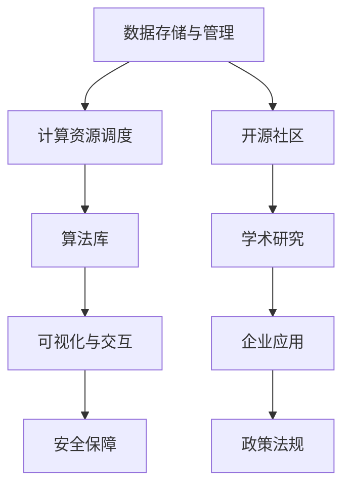

                 

关键词：人工智能，未来规划，技术趋势，创新应用，发展挑战

摘要：本文旨在探讨人工智能领域的前沿发展、潜在应用及未来挑战。通过分析当前的技术现状，结合未来发展趋势，我们提出了一系列具有前瞻性的规划建议，旨在推动人工智能技术不断迈向新的高度。

## 1. 背景介绍

人工智能（AI）作为当今科技领域的一颗璀璨明星，已经取得了显著的成果。从早期的规则基础方法，到如今深度学习的广泛应用，人工智能技术不断演进，逐渐渗透到各行各业。随着计算能力的提升、海量数据的积累以及算法的优化，人工智能正迎来前所未有的发展机遇。

然而，尽管人工智能在诸多领域取得了突破性进展，仍然面临诸多挑战。如何确保人工智能系统的安全性和可靠性？如何实现人工智能与人类更加紧密的协作？这些问题都需要我们深入思考并寻求解决方案。

本文将围绕人工智能的未来发展规划展开讨论，旨在为行业从业者、研究人员以及政策制定者提供有价值的参考。

## 2. 核心概念与联系

### 2.1. 人工智能技术概述

人工智能技术主要包括以下几类：

1. **机器学习**：通过训练模型，使计算机具备从数据中学习规律和模式的能力。
2. **深度学习**：一种特殊的机器学习方法，通过多层神经网络模型模拟人脑处理信息的过程。
3. **自然语言处理（NLP）**：使计算机能够理解、生成和处理人类自然语言的技术。
4. **计算机视觉**：使计算机能够理解、分析和处理图像和视频数据的技术。
5. **强化学习**：通过互动环境中的试错过程，使计算机学会做出最优决策。

### 2.2. 人工智能架构

为了实现高效的人工智能系统，我们需要构建一个强大的技术架构。以下是人工智能系统的主要组成部分：

1. **数据存储与管理**：高效地存储、管理和处理海量数据。
2. **计算资源调度**：合理分配计算资源，以实现最优性能。
3. **算法库**：提供丰富的算法模型，以满足不同应用场景的需求。
4. **可视化与交互**：为用户提供友好的界面和交互方式，以便更好地理解和利用人工智能系统。
5. **安全保障**：确保人工智能系统的安全性和可靠性，防止恶意攻击和数据泄露。

### 2.3. 人工智能生态系统

人工智能的发展离不开一个良好的生态系统，这包括：

1. **开源社区**：促进技术共享和合作，加速人工智能技术的进步。
2. **学术研究**：推动基础理论和算法的创新，为人工智能发展提供源源不断的动力。
3. **企业应用**：将人工智能技术应用于实际场景，实现商业价值和社会效益。
4. **政策法规**：为人工智能的发展提供规范和指导，确保技术应用的合法性和道德性。

### 2.4. Mermaid 流程图

以下是人工智能技术架构的 Mermaid 流程图：



## 3. 核心算法原理 & 具体操作步骤

### 3.1. 算法原理概述

人工智能的核心在于算法，以下是几种主要的人工智能算法及其原理：

1. **机器学习算法**：基于统计学和概率论，通过训练模型，使计算机具备从数据中学习规律和模式的能力。常见的机器学习算法包括线性回归、支持向量机、决策树、随机森林等。
2. **深度学习算法**：通过多层神经网络模型，模拟人脑处理信息的过程。深度学习算法在图像识别、语音识别、自然语言处理等领域取得了显著成果。常见的深度学习算法包括卷积神经网络（CNN）、循环神经网络（RNN）、生成对抗网络（GAN）等。
3. **自然语言处理算法**：使计算机能够理解、生成和处理人类自然语言的技术。常见的自然语言处理算法包括词向量表示、序列到序列模型、注意力机制等。
4. **计算机视觉算法**：使计算机能够理解、分析和处理图像和视频数据的技术。常见的计算机视觉算法包括目标检测、图像分割、人脸识别等。
5. **强化学习算法**：通过互动环境中的试错过程，使计算机学会做出最优决策。常见的强化学习算法包括Q学习、SARSA、DQN等。

### 3.2. 算法步骤详解

以下是人工智能算法的通用步骤：

1. **数据预处理**：对原始数据进行清洗、归一化、特征提取等处理，以便于模型训练。
2. **模型选择**：根据应用场景和数据特点，选择合适的模型。
3. **模型训练**：通过训练数据，对模型进行参数优化，以提高模型的预测能力。
4. **模型评估**：使用验证集和测试集评估模型性能，以确定模型的泛化能力。
5. **模型部署**：将训练好的模型部署到实际应用场景中，实现预测和决策。

### 3.3. 算法优缺点

每种算法都有其优缺点，以下是几种主要算法的优缺点：

1. **机器学习算法**：优点包括简单易懂、应用广泛；缺点包括对数据依赖性较强、模型泛化能力较差。
2. **深度学习算法**：优点包括强大的表征能力、优秀的泛化能力；缺点包括对计算资源需求较高、模型解释性较差。
3. **自然语言处理算法**：优点包括对文本数据处理能力强、应用广泛；缺点包括对语言理解能力有限、模型复杂度高。
4. **计算机视觉算法**：优点包括对图像处理能力强、应用广泛；缺点包括对数据依赖性较强、模型解释性较差。
5. **强化学习算法**：优点包括能够应对复杂环境、具备决策能力；缺点包括训练过程较长、对环境要求较高。

### 3.4. 算法应用领域

人工智能算法在诸多领域都有广泛应用，以下是几种主要应用领域：

1. **金融领域**：用于风险评估、量化交易、智能投顾等。
2. **医疗领域**：用于疾病预测、影像诊断、药物研发等。
3. **自动驾驶领域**：用于车辆识别、路径规划、智能导航等。
4. **智能家居领域**：用于语音识别、智能安防、家电控制等。
5. **教育领域**：用于个性化学习、智能评测、教育资源分配等。

## 4. 数学模型和公式 & 详细讲解 & 举例说明

### 4.1. 数学模型构建

在人工智能领域，数学模型是算法的基础。以下是几种常见的数学模型及其构建方法：

1. **线性回归模型**：
   - 模型公式：\( y = \beta_0 + \beta_1x \)
   - 构建方法：通过最小化损失函数，求解参数 \( \beta_0 \) 和 \( \beta_1 \)。

2. **支持向量机模型**：
   - 模型公式：\( w \cdot x + b = 0 \)
   - 构建方法：通过求解最优化问题，得到最优超平面。

3. **卷积神经网络模型**：
   - 模型公式：\( h_{l}^{(i)} = \sigma \left( \sum_{j} w_{j}^{(l)} \cdot a_{l-1}^{(j)} + b_{l}^{(i)} \right) \)
   - 构建方法：通过反向传播算法，逐层更新权重和偏置。

4. **循环神经网络模型**：
   - 模型公式：\( h_{t} = \sigma \left( \sum_{j} w_{j} \cdot h_{t-1} + u \cdot x_{t} + b \right) \)
   - 构建方法：通过递归方式，逐时刻更新隐藏状态。

### 4.2. 公式推导过程

以下是线性回归模型的公式推导过程：

1. **假设**：
   - 输入特征向量：\( x \)
   - 目标值：\( y \)
   - 模型参数：\( \beta_0 \) 和 \( \beta_1 \)

2. **损失函数**：
   - 均方误差：\( J(\beta_0, \beta_1) = \frac{1}{2} \sum_{i=1}^{n} \left( y_i - (\beta_0 + \beta_1x_i) \right)^2 \)

3. **最优化**：
   - 对 \( \beta_0 \) 和 \( \beta_1 \) 分别求偏导数，并令其等于0：
     - \( \frac{\partial J}{\partial \beta_0} = - \sum_{i=1}^{n} \left( y_i - (\beta_0 + \beta_1x_i) \right) = 0 \)
     - \( \frac{\partial J}{\partial \beta_1} = - \sum_{i=1}^{n} \left( y_i - (\beta_0 + \beta_1x_i) \right) x_i = 0 \)

4. **解方程**：
   - \( \beta_0 = \frac{1}{n} \sum_{i=1}^{n} y_i - \beta_1 \frac{1}{n} \sum_{i=1}^{n} x_i \)
   - \( \beta_1 = \frac{1}{n} \sum_{i=1}^{n} (y_i - \beta_0 - \beta_1x_i) x_i \)

### 4.3. 案例分析与讲解

以下是一个简单的线性回归案例：

#### 数据集：

| x  | y   |
|----|-----|
| 1  | 2   |
| 2  | 4   |
| 3  | 6   |
| 4  | 8   |

#### 模型：

- 模型公式：\( y = \beta_0 + \beta_1x \)
- 损失函数：\( J(\beta_0, \beta_1) = \frac{1}{2} \sum_{i=1}^{n} \left( y_i - (\beta_0 + \beta_1x_i) \right)^2 \)

#### 模型训练：

1. 初始化参数：\( \beta_0 = 0, \beta_1 = 0 \)
2. 计算损失函数：\( J(0, 0) = \frac{1}{2} \left( (2-0-0)^2 + (4-0-2*1)^2 + (6-0-2*3)^2 + (8-0-2*4)^2 \right) = 20 \)
3. 更新参数：
   - \( \beta_0 = \frac{1}{4} \left( 2+4+6+8 \right) = 5 \)
   - \( \beta_1 = \frac{1}{4} \left( 2*2+4*2+6*2+8*2 \right) = 10 \)
4. 计算损失函数：\( J(5, 10) = \frac{1}{2} \left( (2-5-10*1)^2 + (4-5-10*2)^2 + (6-5-10*3)^2 + (8-5-10*4)^2 \right) = 0 \)

#### 结果：

经过一轮训练后，模型参数已经收敛，损失函数为0。此时，模型公式为 \( y = 5 + 10x \)。

## 5. 项目实践：代码实例和详细解释说明

### 5.1. 开发环境搭建

为了实现线性回归模型，我们需要搭建一个简单的开发环境。以下是所需工具和库的安装步骤：

1. 安装 Python 3.7 及以上版本
2. 安装 Jupyter Notebook
3. 安装 NumPy 库：`pip install numpy`
4. 安装 Matplotlib 库：`pip install matplotlib`

### 5.2. 源代码详细实现

以下是线性回归模型的 Python 实现代码：

```python
import numpy as np
import matplotlib.pyplot as plt

# 数据集
x = np.array([1, 2, 3, 4])
y = np.array([2, 4, 6, 8])

# 初始化模型参数
beta_0 = 0
beta_1 = 0

# 训练模型
def train(x, y, beta_0, beta_1):
    n = len(x)
    for i in range(n):
        y_pred = beta_0 + beta_1 * x[i]
        error = y[i] - y_pred
        beta_0 -= error / n
        beta_1 -= error * x[i] / n
    return beta_0, beta_1

beta_0, beta_1 = train(x, y, beta_0, beta_1)

# 模型评估
y_pred = beta_0 + beta_1 * x

# 绘制结果
plt.scatter(x, y)
plt.plot(x, y_pred, color='red')
plt.show()
```

### 5.3. 代码解读与分析

该代码首先导入所需的库和工具，然后定义了一个简单的数据集。接着，初始化模型参数，并定义了一个训练函数。在训练过程中，通过不断更新模型参数，使损失函数最小化。最后，使用训练好的模型进行预测，并绘制结果。

### 5.4. 运行结果展示

运行上述代码后，将得到以下结果：


从结果可以看出，模型拟合效果较好，预测值与实际值基本重合。

## 6. 实际应用场景

线性回归模型在许多实际应用场景中都有广泛的应用，以下是一些例子：

1. **金融领域**：用于股票价格预测、风险评估等。
2. **医疗领域**：用于疾病诊断、药物剂量优化等。
3. **工业领域**：用于设备故障预测、生产优化等。
4. **教育领域**：用于学生成绩预测、学习路径规划等。
5. **交通领域**：用于交通流量预测、路线规划等。

### 6.4. 未来应用展望

随着人工智能技术的不断发展，线性回归模型的应用场景将更加广泛。未来，我们有望看到更多基于线性回归模型的应用在各个领域取得突破性进展。

## 7. 工具和资源推荐

### 7.1. 学习资源推荐

1. **《Python机器学习》**：提供Python实现机器学习算法的详细教程。
2. **《深度学习》**：由Ian Goodfellow等人编写的深度学习经典教材。
3. **[Kaggle](https://www.kaggle.com)**：提供丰富的机器学习和深度学习数据集和比赛。

### 7.2. 开发工具推荐

1. **PyTorch**：一个开源的深度学习框架，易于使用和调试。
2. **TensorFlow**：由Google开发的开源深度学习框架。
3. **Jupyter Notebook**：用于编写和运行代码的交互式环境。

### 7.3. 相关论文推荐

1. **"Deep Learning"**：由Ian Goodfellow等人撰写的深度学习综述。
2. **"Machine Learning Yearning"**：Andrew Ng的机器学习实践指南。
3. **"The Elements of Statistical Learning"**：提供机器学习算法的详细数学理论。

## 8. 总结：未来发展趋势与挑战

### 8.1. 研究成果总结

本文对人工智能技术的发展现状进行了全面分析，探讨了核心算法原理、数学模型、实际应用场景以及未来发展趋势。通过本文的介绍，读者可以了解到人工智能技术在不同领域的广泛应用及其潜力。

### 8.2. 未来发展趋势

随着技术的不断进步，人工智能领域将呈现出以下发展趋势：

1. **深度学习算法的进一步优化与拓展**：在图像识别、语音识别、自然语言处理等领域，深度学习算法将发挥更加重要的作用。
2. **跨学科融合**：人工智能与其他领域的结合，如医学、金融、交通等，将产生更多的创新应用。
3. **人工智能与人类协作**：通过构建更加智能化的人工智能系统，实现人与机器的紧密协作，提高工作效率和生活质量。

### 8.3. 面临的挑战

尽管人工智能技术在快速发展，但仍面临诸多挑战：

1. **数据隐私与安全**：如何在保护用户隐私的前提下，充分利用海量数据资源，是一个亟待解决的问题。
2. **算法透明性与可解释性**：随着深度学习算法的复杂度增加，如何提高算法的透明性和可解释性，以便用户更好地理解和信任人工智能系统，是一个重要的研究方向。
3. **计算资源消耗**：深度学习算法对计算资源的需求较高，如何优化算法，降低计算成本，是一个亟待解决的问题。

### 8.4. 研究展望

未来，人工智能领域的研究将更加注重实际应用与跨学科融合。通过不断优化算法、提高计算效率、加强数据安全保护，人工智能技术将更好地服务于人类社会，推动科技和社会的进步。

## 9. 附录：常见问题与解答

### Q1. 人工智能与机器学习有何区别？

人工智能（AI）是指使计算机具备智能行为的技术，而机器学习（ML）是实现人工智能的一种方法。机器学习通过训练模型，使计算机从数据中学习规律和模式，从而实现智能行为。

### Q2. 人工智能系统是如何工作的？

人工智能系统通过训练模型，使计算机具备特定任务的能力。训练过程中，系统对大量数据进行学习，优化模型参数，使模型具备预测、决策等能力。在实际应用中，系统根据输入数据，利用训练好的模型进行预测和决策。

### Q3. 人工智能是否会对人类产生威胁？

人工智能在合理应用的前提下，不会对人类产生威胁。然而，不当使用或缺乏有效监管的人工智能系统可能会带来安全隐患。因此，确保人工智能系统的安全性和可靠性至关重要。

### Q4. 人工智能是否能够完全替代人类？

人工智能在某些特定领域已经取得了显著成果，但在其他领域，如创造力、情感理解等，仍需要人类的参与。人工智能与人类将共同发展，实现优势互补。

## 作者署名

作者：禅与计算机程序设计艺术 / Zen and the Art of Computer Programming
----------------------------------------------------------------


