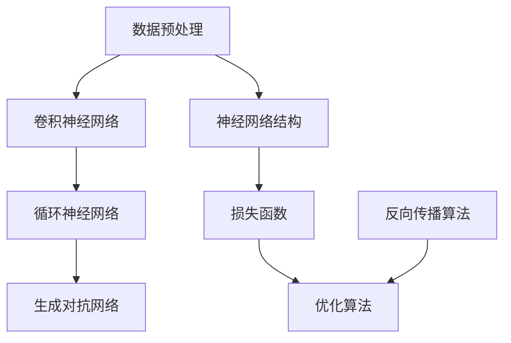

                 

关键词：人工智能，深度学习，科学意义，技术发展，神经网络，数据处理，未来展望。

> 摘要：本文将探讨人工智能（AI）领域中的科学意义，从深度学习的发展历程、核心算法原理、数学模型以及实际应用场景等多个角度，全面解析AI技术的科学内涵和未来发展趋势。

## 1. 背景介绍

人工智能（AI）作为计算机科学的一个重要分支，旨在使计算机能够模拟、延伸和扩展人类的智能。从早期的人工智能探索到现代深度学习的兴起，AI技术经历了多次重要的技术变革。本文将重点关注深度学习在人工智能领域中的科学意义，探讨其在数据处理、模式识别、自然语言处理等方面的应用。

### 1.1 人工智能的发展历程

人工智能的发展历程可以分为以下几个阶段：

- **早期探索（1950s-1960s）**：人工智能概念首次被提出，主要集中在符号主义和逻辑推理上。

- **黄金时期（1970s-1980s）**：专家系统成为主流，以知识表示和推理为主要手段。

- **低谷期（1990s）**：由于数据集有限和计算能力不足，人工智能发展陷入低谷。

- **复兴期（2006-2012）**：深度学习算法的出现，特别是神经网络的复兴，为人工智能带来了新的希望。

- **爆发期（2012至今）**：随着计算能力和数据规模的提升，深度学习在图像识别、语音识别、自然语言处理等领域取得了显著突破。

### 1.2 深度学习的兴起

深度学习作为人工智能的一个重要分支，通过模仿人脑神经网络的结构和功能，实现了对大量数据的自动学习和处理。深度学习的兴起，源于以下几个因素：

- **大数据时代的到来**：随着互联网的普及，大量结构化和非结构化数据不断产生，为深度学习提供了丰富的数据资源。

- **计算能力的提升**：GPU的广泛应用和分布式计算技术的进步，使得深度学习模型能够高效训练和部署。

- **算法的改进**：卷积神经网络（CNN）、循环神经网络（RNN）等深度学习算法的提出，为解决复杂问题提供了新的思路。

## 2. 核心概念与联系

在深度学习领域中，核心概念和联系至关重要。下面我们将通过一个Mermaid流程图，展示深度学习中的核心概念和它们之间的联系。



### 2.1 数据预处理

数据预处理是深度学习模型训练的第一步，主要包括数据的清洗、归一化和特征提取。数据预处理的质量直接影响到模型的性能。

### 2.2 卷积神经网络（CNN）

卷积神经网络是深度学习领域的一种重要模型，主要应用于图像识别、图像分类和图像生成。CNN通过卷积层、池化层和全连接层的组合，实现对图像数据的层次化特征提取。

### 2.3 循环神经网络（RNN）

循环神经网络适用于处理序列数据，如时间序列分析、自然语言处理等。RNN通过隐藏状态的记忆功能，实现对序列数据的建模和预测。

### 2.4 生成对抗网络（GAN）

生成对抗网络是一种由生成器和判别器组成的对抗性模型，主要用于图像生成、图像修复和图像增强。GAN通过生成器和判别器的博弈，实现高质量图像的生成。

### 2.5 神经网络结构

神经网络结构是指神经网络中各层的组织和连接方式。常见的神经网络结构包括卷积神经网络、循环神经网络、生成对抗网络等。不同结构的神经网络适用于不同的任务和数据类型。

### 2.6 损失函数

损失函数用于衡量模型预测结果与真实值之间的差距，是优化模型参数的重要依据。常见的损失函数包括均方误差、交叉熵损失、对抗损失等。

### 2.7 优化算法

优化算法用于调整模型参数，以降低损失函数的值。常见的优化算法包括随机梯度下降、Adam优化器、RMSprop等。

### 2.8 反向传播算法

反向传播算法是神经网络训练的核心算法，通过计算梯度，调整模型参数，实现对模型的优化。

## 3. 核心算法原理 & 具体操作步骤

### 3.1 算法原理概述

深度学习算法的核心原理是基于神经网络模型对数据进行自动学习和处理。神经网络由多个神经元（节点）组成，每个神经元通过加权连接与其他神经元相连。在训练过程中，神经网络通过不断调整权重和偏置，实现对数据的拟合和预测。

### 3.2 算法步骤详解

深度学习算法的基本步骤包括：

1. **数据预处理**：对输入数据进行清洗、归一化和特征提取，为模型训练提供高质量的输入。

2. **模型构建**：设计神经网络结构，包括层数、神经元个数、激活函数等。

3. **损失函数选择**：根据任务类型选择合适的损失函数，如分类任务使用交叉熵损失，回归任务使用均方误差损失。

4. **优化算法选择**：选择合适的优化算法，如随机梯度下降、Adam优化器等。

5. **模型训练**：通过反向传播算法，不断调整模型参数，降低损失函数的值。

6. **模型评估**：使用验证集或测试集评估模型性能，调整模型参数或结构，以提高模型性能。

7. **模型部署**：将训练好的模型部署到实际应用场景，实现预测或推理功能。

### 3.3 算法优缺点

深度学习算法的优点包括：

1. **自动特征提取**：神经网络能够自动从数据中提取特征，减少人工设计的复杂性。

2. **泛化能力强**：通过大量数据的训练，神经网络能够较好地应对不同任务和数据类型。

3. **多任务处理**：神经网络能够同时处理多个任务，提高计算效率。

深度学习算法的缺点包括：

1. **计算成本高**：神经网络训练需要大量计算资源，特别是在大规模数据集上。

2. **数据依赖性强**：深度学习模型的性能很大程度上依赖于数据质量和数量。

3. **可解释性差**：神经网络模型内部结构复杂，难以解释和理解。

### 3.4 算法应用领域

深度学习算法在人工智能领域有着广泛的应用，包括：

1. **计算机视觉**：图像识别、目标检测、图像分割等。

2. **自然语言处理**：文本分类、机器翻译、情感分析等。

3. **语音识别**：语音识别、语音合成、说话人识别等。

4. **强化学习**：游戏AI、机器人控制等。

## 4. 数学模型和公式 & 详细讲解 & 举例说明

### 4.1 数学模型构建

深度学习算法中的数学模型主要包括神经网络模型和优化算法。下面我们分别介绍这两种模型的数学表示。

#### 神经网络模型

神经网络的数学表示主要包括以下部分：

1. **神经元激活函数**：

$$
f(x) = \sigma(z) = \frac{1}{1 + e^{-z}}
$$

其中，$z$ 为神经元的输入，$\sigma$ 为 sigmoid 激活函数。

2. **神经网络输出**：

$$
y = \sigma(W_1 \cdot x_1 + b_1) \cdot \sigma(W_2 \cdot x_2 + b_2) \cdot ... \cdot \sigma(W_n \cdot x_n + b_n)
$$

其中，$W$ 为权重矩阵，$b$ 为偏置，$x$ 为输入数据。

3. **损失函数**：

分类任务常用的损失函数为交叉熵损失，表示为：

$$
L(y, \hat{y}) = -\sum_{i=1}^{n} y_i \cdot \log(\hat{y}_i)
$$

其中，$y$ 为真实标签，$\hat{y}$ 为预测标签。

#### 优化算法

优化算法主要用于调整神经网络模型的参数，以降低损失函数的值。常用的优化算法包括随机梯度下降（SGD）和 Adam 优化器。

1. **随机梯度下降（SGD）**：

$$
\theta = \theta - \alpha \cdot \nabla_{\theta} J(\theta)
$$

其中，$\theta$ 为模型参数，$\alpha$ 为学习率，$J(\theta)$ 为损失函数。

2. **Adam 优化器**：

$$
m_t = \beta_1 m_{t-1} + (1 - \beta_1) \cdot \nabla_{\theta} J(\theta)
$$

$$
v_t = \beta_2 v_{t-1} + (1 - \beta_2) \cdot (\nabla_{\theta} J(\theta))^2
$$

$$
\theta = \theta - \alpha \cdot \frac{m_t}{\sqrt{v_t} + \epsilon}
$$

其中，$\beta_1$ 和 $\beta_2$ 分别为动量项，$\epsilon$ 为一个很小的正数。

### 4.2 公式推导过程

在深度学习算法中，公式推导过程主要包括以下部分：

1. **前向传播**：

前向传播是神经网络计算输出值的过程，其推导过程如下：

$$
z_i^{(l)} = \sum_{j} w_{ij}^{(l)} x_j^{(l-1)} + b_i^{(l)}
$$

$$
a_i^{(l)} = \sigma(z_i^{(l)})
$$

其中，$z_i^{(l)}$ 为第 $l$ 层第 $i$ 个神经元的输入，$a_i^{(l)}$ 为第 $l$ 层第 $i$ 个神经元的输出，$w_{ij}^{(l)}$ 为第 $l$ 层第 $i$ 个神经元与第 $l-1$ 层第 $j$ 个神经元的权重，$b_i^{(l)}$ 为第 $l$ 层第 $i$ 个神经元的偏置，$\sigma$ 为激活函数。

2. **反向传播**：

反向传播是神经网络计算梯度并更新参数的过程，其推导过程如下：

$$
\delta_i^{(l)} = \frac{\partial J}{\partial z_i^{(l)}}
$$

$$
\delta_j^{(l)} = \delta_i^{(l)} \cdot \frac{\partial z_i^{(l)}}{\partial z_j^{(l+1)}}
$$

$$
\frac{\partial z_i^{(l)}}{\partial z_j^{(l+1)}} = \sigma'(z_j^{(l+1)})
$$

$$
\frac{\partial z_j^{(l)}}{\partial z_i^{(l)}} = \sum_{k} w_{ik}^{(l)} \sigma'(z_k^{(l)})
$$

其中，$\delta_i^{(l)}$ 为第 $l$ 层第 $i$ 个神经元的误差，$J$ 为损失函数，$\sigma'$ 为激活函数的导数。

### 4.3 案例分析与讲解

为了更好地理解深度学习算法的数学模型，我们通过一个简单的例子进行讲解。

假设我们有一个二分类问题，数据集包含 $100$ 个样本，每个样本包含 $2$ 个特征。我们使用一个单层神经网络进行模型训练，神经网络包含 $2$ 个输入神经元、$1$ 个隐藏神经元和 $1$ 个输出神经元。

1. **前向传播**：

输入样本 $x_1 = [1, 2]$，$x_2 = [3, 4]$，隐藏层输入：

$$
z_h = w_{11} x_1 + w_{12} x_2 + b_h = 2 \cdot 1 + 3 \cdot 3 + 1 = 10
$$

隐藏层输出：

$$
a_h = \sigma(z_h) = \frac{1}{1 + e^{-10}} = 0.9999
$$

输出层输入：

$$
z_o = w_{h1} a_h + b_o = 4 \cdot 0.9999 + 1 = 4.9996
$$

输出层输出：

$$
a_o = \sigma(z_o) = \frac{1}{1 + e^{-4.9996}} = 0.9999
$$

2. **反向传播**：

假设真实标签 $y = 1$，预测标签 $\hat{y} = 0.9999$，交叉熵损失：

$$
L(y, \hat{y}) = -y \cdot \log(\hat{y}) = -1 \cdot \log(0.9999) = -0.0013
$$

输出层误差：

$$
\delta_o = a_o (1 - a_o) (\hat{y} - y) = 0.9999 \cdot (1 - 0.9999) (0.9999 - 1) = -0.0001
$$

隐藏层误差：

$$
\delta_h = \delta_o \cdot w_{h1} \cdot \sigma'(z_h) = -0.0001 \cdot 4 \cdot 0.9999 = -0.000016
$$

3. **参数更新**：

学习率 $\alpha = 0.01$，权重更新：

$$
w_{h1} = w_{h1} - \alpha \cdot \delta_o \cdot a_h = 4 - 0.01 \cdot (-0.0001) \cdot 0.9999 = 4.000006
$$

偏置更新：

$$
b_h = b_h - \alpha \cdot \delta_h = 1 - 0.01 \cdot (-0.000016) = 1.0000016
$$

通过以上计算，我们可以得到更新后的参数。接下来，我们继续进行下一轮前向传播和反向传播，直到模型收敛。

## 5. 项目实践：代码实例和详细解释说明

### 5.1 开发环境搭建

在进行深度学习项目实践之前，我们需要搭建一个合适的开发环境。本文使用 Python 编程语言，结合 TensorFlow 和 Keras 库实现深度学习模型。

1. 安装 Python：

```bash
pip install python
```

2. 安装 TensorFlow：

```bash
pip install tensorflow
```

3. 安装 Keras：

```bash
pip install keras
```

### 5.2 源代码详细实现

以下是一个简单的深度学习项目，使用 TensorFlow 和 Keras 库实现一个二分类问题。

```python
import numpy as np
import tensorflow as tf
from tensorflow.keras import layers

# 数据集准备
x = np.array([[1, 2], [3, 4], [5, 6], [7, 8]])
y = np.array([1, 0, 1, 0])

# 构建神经网络模型
model = tf.keras.Sequential([
    layers.Dense(units=1, input_shape=(2,), activation='sigmoid')
])

# 编译模型
model.compile(optimizer='adam', loss='binary_crossentropy', metrics=['accuracy'])

# 模型训练
model.fit(x, y, epochs=100)

# 模型评估
loss, accuracy = model.evaluate(x, y)
print(f"损失：{loss}, 准确率：{accuracy}")

# 模型预测
predictions = model.predict(x)
print(predictions)
```

### 5.3 代码解读与分析

1. 数据集准备：

我们使用一个简单的二分类问题，数据集包含 $4$ 个样本，每个样本包含 $2$ 个特征。真实标签 $y$ 包含 $2$ 个类别，分别为 $1$ 和 $0$。

2. 构建神经网络模型：

我们使用 Keras 库中的 `Sequential` 模型，添加一个全连接层（`Dense` 层），输入形状为 $(2,)$，激活函数为 sigmoid。

3. 编译模型：

我们使用 `compile` 函数编译模型，指定优化器为 Adam，损失函数为 binary_crossentropy（二分类交叉熵），评估指标为 accuracy（准确率）。

4. 模型训练：

使用 `fit` 函数训练模型，指定训练轮数（epochs）为 $100$。

5. 模型评估：

使用 `evaluate` 函数评估模型在训练集上的表现，输出损失和准确率。

6. 模型预测：

使用 `predict` 函数对训练集进行预测，输出预测结果。

## 6. 实际应用场景

深度学习技术在人工智能领域有着广泛的应用，以下列举几个实际应用场景：

1. **计算机视觉**：深度学习算法在图像识别、目标检测、图像分割等领域取得了显著突破，如自动驾驶、人脸识别、医学图像分析等。

2. **自然语言处理**：深度学习技术在文本分类、机器翻译、情感分析等领域表现出色，如搜索引擎、智能客服、智能语音助手等。

3. **语音识别**：深度学习算法在语音识别、语音合成、说话人识别等领域取得了重要成果，如智能音箱、智能语音助手、实时翻译等。

4. **强化学习**：深度学习与强化学习相结合，应用于游戏 AI、机器人控制、资源调度等领域。

5. **推荐系统**：深度学习算法在推荐系统领域发挥着重要作用，如电商推荐、音乐推荐、电影推荐等。

## 7. 工具和资源推荐

为了更好地学习和实践深度学习技术，以下推荐一些常用的工具和资源：

1. **学习资源推荐**：

   - 《深度学习》（Goodfellow et al.）：经典教材，全面介绍深度学习的基础知识。

   - 《动手学深度学习》（Zhang et al.）：实战教程，通过实际案例介绍深度学习技术。

2. **开发工具推荐**：

   - TensorFlow：谷歌推出的开源深度学习框架，支持多种深度学习模型。

   - PyTorch：Facebook AI Research 开发的人工智能平台，易于使用和调试。

   - Keras：基于 TensorFlow 的深度学习框架，提供简洁易用的接口。

3. **相关论文推荐**：

   - "A Theoretical Framework for Backpropagation"（1986）：反向传播算法的理论基础。

   - "Deep Learning"（2015）：全面介绍深度学习技术及其应用。

   - "Generative Adversarial Networks"（2014）：生成对抗网络的开创性论文。

## 8. 总结：未来发展趋势与挑战

### 8.1 研究成果总结

深度学习技术在人工智能领域取得了显著的成果，为图像识别、自然语言处理、语音识别等任务提供了有效的解决方案。随着计算能力和数据规模的提升，深度学习算法在更多领域展现出强大的应用潜力。

### 8.2 未来发展趋势

1. **算法优化**：针对深度学习模型的计算成本高、训练时间长等问题，算法优化将成为未来研究的重要方向。

2. **泛化能力提升**：提高模型的泛化能力，使其在不同任务和数据集上都能取得良好的性能。

3. **可解释性研究**：深度学习模型的黑箱特性限制了其应用，未来研究将重点关注模型的可解释性。

4. **跨学科融合**：深度学习与其他领域的结合，如生物学、心理学、社会学等，将推动人工智能技术的进一步发展。

### 8.3 面临的挑战

1. **数据隐私**：随着数据规模的增大，数据隐私保护成为深度学习研究面临的一个重要挑战。

2. **计算资源消耗**：深度学习模型训练需要大量计算资源，如何高效利用计算资源成为亟待解决的问题。

3. **伦理与安全**：深度学习技术在应用过程中可能引发伦理和安全问题，如算法歧视、隐私泄露等。

4. **数据集质量**：高质量的数据集对于深度学习模型的训练至关重要，如何获取和构建高质量数据集是当前研究的一个难题。

### 8.4 研究展望

深度学习作为人工智能的一个重要分支，具有广泛的应用前景。未来研究将在算法优化、泛化能力提升、可解释性研究等方面取得重要突破，同时关注数据隐私、计算资源消耗、伦理与安全等问题。跨学科融合将推动人工智能技术的进一步发展，为社会带来更多创新和变革。

## 9. 附录：常见问题与解答

### 9.1 深度学习的基本概念是什么？

深度学习是一种机器学习技术，通过模拟人脑神经网络的结构和功能，实现对大量数据的自动学习和处理。深度学习的主要目标是使计算机能够像人类一样识别图像、理解语言、决策和解决问题。

### 9.2 深度学习有哪些主要算法？

深度学习的主要算法包括卷积神经网络（CNN）、循环神经网络（RNN）、生成对抗网络（GAN）等。这些算法在图像识别、自然语言处理、语音识别等领域表现出色。

### 9.3 如何优化深度学习模型的训练？

优化深度学习模型的训练主要包括以下方面：

1. 调整学习率：适当调整学习率，使模型在训练过程中更快收敛。

2. 使用批量归一化：批量归一化可以加速模型训练并提高模型性能。

3. 使用正则化技术：如 L1 正则化、L2 正则化，可以防止模型过拟合。

4. 使用预训练模型：利用预训练模型可以减少训练时间，提高模型性能。

5. 使用并行计算：利用 GPU 或分布式计算技术可以加快模型训练速度。

### 9.4 深度学习在哪些领域有广泛应用？

深度学习在计算机视觉、自然语言处理、语音识别、强化学习等领域有着广泛的应用。如自动驾驶、人脸识别、医学图像分析、智能客服、智能语音助手等。

### 9.5 深度学习模型如何进行评估？

评估深度学习模型通常使用以下指标：

1. 准确率（Accuracy）：模型预测正确的样本数占总样本数的比例。

2. 精确率（Precision）：模型预测正确的正样本数占总预测正样本数的比例。

3. 召回率（Recall）：模型预测正确的正样本数占总真实正样本数的比例。

4. F1 值（F1 Score）：精确率和召回率的加权平均值。

5. ROC 曲线和 AUC 值：用于评估模型的分类性能。

作者：禅与计算机程序设计艺术 / Zen and the Art of Computer Programming
----------------------------------------------------------------

