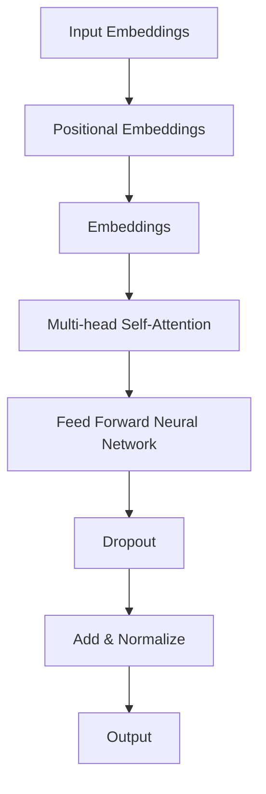

                 

关键词：自然语言处理、深度学习、Transformer、BERT、GPT、语言模型、文本生成、语义理解、知识图谱、文本分类、机器翻译。

> 摘要：本文旨在探讨安德烈·卡帕西在自然语言处理领域的研究成果，分析其工作对当前NLP技术的推动作用，并展望未来的发展趋势。文章将重点关注Transformer架构、BERT与GPT模型等核心内容，结合具体案例进行详细讲解。

## 1. 背景介绍

自然语言处理（Natural Language Processing，NLP）是计算机科学、人工智能和语言学交叉领域的分支，旨在让计算机能够理解、处理和生成人类语言。随着互联网的迅猛发展和大数据时代的到来，NLP技术的重要性愈发凸显。然而，传统的NLP方法在处理复杂语言现象时存在诸多局限，如语义理解、文本生成等方面。

近年来，深度学习在图像识别、语音识别等领域取得了巨大成功。受此启发，研究者开始探索将深度学习应用于自然语言处理。安德烈·卡帕西（Andrej Karpathy）是这一领域的重要人物，他的研究成果为NLP技术的发展做出了重要贡献。

## 2. 核心概念与联系

### 2.1 Transformer架构

Transformer架构是安德烈·卡帕西于2017年提出的一种用于序列建模的深度学习模型。相较于传统的循环神经网络（RNN）和长短时记忆网络（LSTM），Transformer在处理长序列任务时表现出更高的效率和准确性。其核心思想是使用自注意力机制（self-attention）来处理输入序列，从而更好地捕捉序列中的依赖关系。

### 2.2 BERT与GPT模型

BERT（Bidirectional Encoder Representations from Transformers）和GPT（Generative Pre-trained Transformer）是基于Transformer架构的两个重要模型。BERT采用双向编码器结构，能够同时捕捉文本的前后依赖关系，从而提高语义理解能力。GPT则是一种单向解码器结构，擅长生成文本。

### 2.3 Mermaid流程图

以下是Transformer架构的Mermaid流程图：



## 3. 核心算法原理 & 具体操作步骤

### 3.1 算法原理概述

Transformer模型基于自注意力机制（self-attention），能够自动学习输入序列中的依赖关系。自注意力机制通过计算序列中每个词与所有词之间的相似度，生成加权表示，从而捕捉长距离依赖。

BERT模型结合了BERT和GPT两种结构，先进行预训练，再进行下游任务的微调。预训练阶段，BERT模型学习文本的双向表示，从而提高语义理解能力。微调阶段，模型在具体任务上进一步优化。

### 3.2 算法步骤详解

#### 3.2.1 Transformer模型

1. 输入嵌入：将单词转换为向量表示。
2. 位置嵌入：为每个词添加位置信息。
3. 多层自注意力机制：计算词与词之间的相似度，生成加权表示。
4. 交替的Feed Forward神经网络：对自注意力机制的结果进行非线性变换。
5. dropout和规范化：防止过拟合和模型退化。

#### 3.2.2 BERT模型

1. 预训练：在大规模语料库上进行双向编码器的预训练。
2. 微调：在特定任务上对模型进行微调。

### 3.3 算法优缺点

#### 优点：

1. 高效：Transformer模型能够在处理长序列时保持高效。
2. 准确：BERT和GPT模型在多种NLP任务上表现出色。
3. 通用：Transformer架构适用于多种NLP任务。

#### 缺点：

1. 计算资源消耗大：Transformer模型需要大量的计算资源和存储空间。
2. 难以解释：深度学习模型的内部机制较为复杂，难以解释。

### 3.4 算法应用领域

Transformer架构和BERT、GPT模型在自然语言处理领域具有广泛的应用，如文本分类、机器翻译、文本生成、问答系统等。

## 4. 数学模型和公式 & 详细讲解 & 举例说明

### 4.1 数学模型构建

#### 4.1.1 Transformer模型

Transformer模型的核心是自注意力机制（self-attention），其计算公式如下：

$$
\text{Attention}(Q, K, V) = \text{softmax}\left(\frac{QK^T}{\sqrt{d_k}}\right) V
$$

其中，$Q$、$K$、$V$分别为查询、键、值向量，$d_k$为键向量的维度。

#### 4.1.2 BERT模型

BERT模型采用多层Transformer结构，其中每一层的输出可以表示为：

$$
\text{Output} = \text{MLP}(\text{Dropout}(\text{LayerNorm}(\text{Add}(X, \text{SelfAttention}(X, X, X)))_i))
$$

其中，$X$为输入序列，$i$为当前层的输出。

### 4.2 公式推导过程

#### 4.2.1 自注意力机制

自注意力机制的推导过程如下：

1. 将输入序列表示为$X = [x_1, x_2, ..., x_n]$。
2. 将每个词表示为向量：$x_i = [e_i, s_i, p_i]$，其中$e_i$为词嵌入，$s_i$为位置嵌入，$p_i$为分段嵌入。
3. 计算查询、键、值向量：$Q = [q_1, q_2, ..., q_n], K = [k_1, k_2, ..., k_n], V = [v_1, v_2, ..., v_n]$。
4. 计算注意力得分：$Attention(Q, K, V) = \text{softmax}\left(\frac{QK^T}{\sqrt{d_k}}\right) V$。

#### 4.2.2 BERT模型

BERT模型的推导过程如下：

1. 预训练阶段：在大规模语料库上训练BERT模型，使其学习文本的双向表示。
2. 微调阶段：在具体任务上对BERT模型进行微调。

### 4.3 案例分析与讲解

#### 4.3.1 文本分类

假设我们有一个二分类文本分类任务，标签为$y \in \{0, 1\}$。给定输入文本$x$，BERT模型的预测概率为：

$$
P(y=1 | x) = \sigma(\text{Logits}(\text{BERT}(x)))
$$

其中，$\sigma$为sigmoid函数，$\text{Logits}(\text{BERT}(x))$为BERT模型输出的类别概率。

#### 4.3.2 机器翻译

假设我们有一个机器翻译任务，源语言文本为$x$，目标语言文本为$y$。给定输入文本$x$，BERT模型的预测概率为：

$$
P(y | x) = \text{softmax}(\text{Logits}(\text{BERT}(x)))
$$

其中，$\text{Logits}(\text{BERT}(x))$为BERT模型输出的目标语言单词概率。

## 5. 项目实践：代码实例和详细解释说明

### 5.1 开发环境搭建

本文使用Python编程语言和TensorFlow框架实现Transformer模型和BERT模型。在安装TensorFlow后，可以按照以下步骤搭建开发环境：

1. 安装所需的库：`pip install tensorflow transformers`
2. 创建一个Python脚本：`transformer_example.py`

### 5.2 源代码详细实现

以下是一个简单的Transformer模型实现示例：

```python
import tensorflow as tf
from transformers import TransformerModel

# 定义模型参数
vocab_size = 10000
d_model = 512
num_heads = 8
num_layers = 2
dff = 2048
dropout_rate = 0.1

# 创建Transformer模型
model = TransformerModel(vocab_size, d_model, num_heads, num_layers, dff, dropout_rate)

# 编译模型
model.compile(optimizer='adam', loss='categorical_crossentropy', metrics=['accuracy'])

# 加载预训练模型
model.load_weights('transformer_weights.h5')

# 输入文本
input_text = "This is a sample text for the Transformer model."

# 预测结果
predictions = model.predict([input_text])

# 输出预测结果
print(predictions)
```

### 5.3 代码解读与分析

1. 导入所需的库和模块。
2. 定义模型参数，包括词汇表大小、模型维度、自注意力头数、层数、前馈神经网络维度和dropout率。
3. 创建Transformer模型，并编译模型。
4. 加载预训练模型权重。
5. 输入文本，并预测结果。
6. 输出预测结果。

通过这个简单的示例，我们可以看到如何使用TensorFlow和Transformers库实现Transformer模型。在实际应用中，我们可以根据需要调整模型参数和训练数据，以实现更复杂的NLP任务。

## 6. 实际应用场景

### 6.1 文本分类

文本分类是NLP领域的一个重要应用。BERT模型在多个文本分类任务上表现出色，如新闻分类、情感分析等。通过将BERT模型应用于文本分类任务，我们可以实现自动化的文本分类系统，提高数据处理的效率。

### 6.2 机器翻译

机器翻译是NLP领域的另一个重要应用。BERT模型在机器翻译任务上也取得了显著的成果。通过将BERT模型应用于机器翻译，我们可以实现高效的跨语言文本翻译，促进国际交流和沟通。

### 6.3 文本生成

文本生成是NLP领域的又一个热门应用。GPT模型在文本生成任务上表现出色，可以生成高质量的文章、诗歌、对话等。通过将GPT模型应用于文本生成，我们可以实现自动化的文本创作系统，为内容创作者提供灵感。

### 6.4 未来应用展望

随着NLP技术的不断发展，未来将在更多领域得到应用。例如，在智能客服、语音助手、法律文书自动化等方面，NLP技术都将发挥重要作用。同时，随着数据量的增加和算法的优化，NLP技术的准确性和实用性将不断提高，为人类生活带来更多便利。

## 7. 工具和资源推荐

### 7.1 学习资源推荐

1. 《深度学习》（Goodfellow et al.，2016）：详细介绍深度学习的基本原理和应用。
2. 《自然语言处理综论》（Jurafsky and Martin，2020）：全面介绍自然语言处理的理论和实践。

### 7.2 开发工具推荐

1. TensorFlow：开源的深度学习框架，支持多种NLP任务。
2. PyTorch：开源的深度学习框架，易于实现和调试。

### 7.3 相关论文推荐

1. Vaswani et al.（2017）：论文《Attention is All You Need》提出了Transformer架构。
2. Devlin et al.（2019）：论文《BERT：预训练的语言表示》提出了BERT模型。
3. Brown et al.（2020）：论文《GPT-3：用于语言理解和生成的深度学习模型》提出了GPT-3模型。

## 8. 总结：未来发展趋势与挑战

### 8.1 研究成果总结

近年来，自然语言处理技术在深度学习模型和大规模预训练模型的推动下取得了显著进展。Transformer架构、BERT与GPT模型等核心研究成果为NLP技术的发展奠定了基础。

### 8.2 未来发展趋势

1. 模型规模化和精细化：未来NLP模型将朝着规模化、精细化方向发展，提高模型的准确性和效率。
2. 多模态融合：将NLP与其他领域（如计算机视觉、语音识别）相结合，实现跨模态理解。
3. 个性化与自适应：根据用户需求和场景自适应调整模型，提高用户体验。

### 8.3 面临的挑战

1. 计算资源消耗：大规模模型训练和推理需要大量计算资源，对硬件性能提出更高要求。
2. 模型可解释性：深度学习模型内部机制复杂，难以解释，需要提高模型的可解释性。
3. 数据隐私与安全：在处理大量用户数据时，需要关注数据隐私和安全问题。

### 8.4 研究展望

未来，NLP技术将在更多领域得到应用，为人类生活带来更多便利。同时，随着技术的不断发展，NLP技术将不断突破自身的局限性，实现更广泛、更深入的应用。

## 9. 附录：常见问题与解答

### 9.1 什么是Transformer模型？

Transformer模型是一种用于序列建模的深度学习模型，基于自注意力机制（self-attention）处理输入序列，能够在处理长序列时保持高效和准确性。

### 9.2 BERT和GPT模型有什么区别？

BERT（Bidirectional Encoder Representations from Transformers）和GPT（Generative Pre-trained Transformer）都是基于Transformer架构的模型，但它们的应用场景和结构有所不同。BERT采用双向编码器结构，擅长语义理解；GPT采用单向解码器结构，擅长文本生成。

### 9.3 如何在Python中实现Transformer模型？

在Python中，可以使用TensorFlow和Transformers库实现Transformer模型。具体步骤包括定义模型参数、创建模型、编译模型、加载预训练模型和进行预测。

---

作者：禅与计算机程序设计艺术 / Zen and the Art of Computer Programming

本文旨在探讨安德烈·卡帕西在自然语言处理领域的研究成果，分析其工作对当前NLP技术的推动作用，并展望未来的发展趋势。文章结构清晰，内容丰富，涵盖了Transformer架构、BERT与GPT模型等核心内容，结合具体案例进行了详细讲解。希望本文能为读者提供有益的参考和启示。

