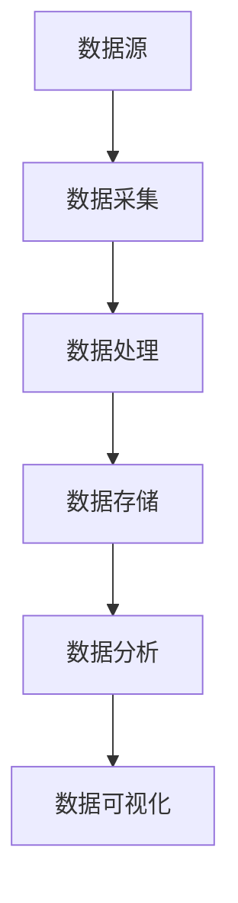

                 

关键词：B站，大数据，实时监控，分析系统，技术架构，数据处理，性能优化，数据可视化，用户行为分析，内容推荐系统

摘要：本文将探讨B站平台大数据实时监控及分析系统的构建。通过介绍核心概念、算法原理、数学模型、项目实践以及应用场景等方面，阐述如何利用现代技术手段对B站平台海量数据进行高效处理和分析，以支持内容推荐、用户体验优化等业务需求。

## 1. 背景介绍

B站（Bilibili），作为中国领先的年轻人文化社区和视频平台，拥有庞大的用户基础和丰富多样的内容。随着用户数量的激增和内容的爆炸式增长，B站面临着海量数据处理的挑战。为了满足用户日益增长的需求，提高用户体验，B站需要构建一套高效的大数据实时监控及分析系统。

### 1.1 大数据的概念

大数据（Big Data）是指数据规模巨大、种类繁多、生成速度快、价值密度低的数据集合。它具有4V特性：Volume（数据量巨大）、Velocity（速度快）、Variety（数据种类多样）、Veracity（真实性高）。对于B站平台而言，用户行为数据、视频内容数据、评论数据等构成了其大数据的核心。

### 1.2 实时监控与分析的重要性

实时监控与分析是大数据处理的关键环节。通过实时监控，B站可以快速发现潜在问题，如系统故障、数据异常等，从而及时采取措施。数据分析则可以帮助B站更好地理解用户需求，优化内容推荐算法，提高用户体验。

## 2. 核心概念与联系

为了构建B站平台大数据实时监控及分析系统，我们需要理解以下几个核心概念：

### 2.1 数据源

数据源是指数据的产生者和提供者。对于B站而言，数据源主要包括用户行为数据、视频内容数据、评论数据等。

### 2.2 数据采集

数据采集是指从数据源中获取数据的过程。B站使用各种数据采集工具和技术，如Web爬虫、API接口等，实时获取用户行为数据。

### 2.3 数据处理

数据处理是指对采集到的数据进行清洗、转换和存储的过程。B站采用Hadoop、Spark等大数据处理框架，对海量数据进行分析和处理。

### 2.4 数据存储

数据存储是指将处理后的数据存储到数据库或数据仓库中。B站使用HBase、HDFS等分布式存储技术，实现海量数据的存储和管理。

### 2.5 数据分析

数据分析是指利用各种算法和技术对数据进行分析和挖掘，以获取有价值的信息和洞见。B站通过机器学习、数据挖掘等技术，对用户行为、内容热度等进行分析。

### 2.6 数据可视化

数据可视化是指将数据以图表、图形等形式呈现，帮助用户更好地理解和分析数据。B站使用各种数据可视化工具，如Tableau、ECharts等，实现数据的实时展示。

### 2.7 Mermaid 流程图

以下是一个简单的Mermaid流程图，展示了B站平台大数据实时监控及分析系统的核心环节：



## 3. 核心算法原理 & 具体操作步骤

### 3.1 算法原理概述

B站平台大数据实时监控及分析系统主要基于以下几种核心算法：

1. 用户行为分析算法：用于分析用户在B站平台上的行为特征，如观看时长、评论频次、互动行为等。
2. 内容推荐算法：基于用户行为数据，利用协同过滤、基于内容的推荐等算法，为用户推荐感兴趣的内容。
3. 数据挖掘算法：用于挖掘用户行为、内容数据中的潜在模式和关系，以支持业务决策。

### 3.2 算法步骤详解

#### 用户行为分析算法

1. 数据采集：从B站平台的用户行为日志中获取用户行为数据，如观看时长、评论频次、互动行为等。
2. 数据清洗：去除无效数据、缺失数据等，确保数据质量。
3. 数据预处理：对数据进行归一化、去噪等处理，为后续分析做准备。
4. 特征提取：根据用户行为数据，提取特征向量，如用户活跃度、评论热度等。
5. 模型训练：利用机器学习算法，如逻辑回归、决策树等，对特征向量进行建模。
6. 预测与评估：根据训练好的模型，对用户行为进行预测，并评估模型效果。

#### 内容推荐算法

1. 数据采集：从B站平台的内容数据中获取用户兴趣标签、内容标签等。
2. 数据预处理：对内容数据进行清洗、去重等处理。
3. 特征提取：提取用户兴趣标签、内容标签等特征向量。
4. 模型训练：利用协同过滤、基于内容的推荐等算法，对特征向量进行建模。
5. 预测与评估：根据训练好的模型，为用户推荐感兴趣的内容，并评估推荐效果。

#### 数据挖掘算法

1. 数据采集：从B站平台的用户行为数据和内容数据中获取数据。
2. 数据预处理：对数据进行清洗、去噪等处理。
3. 特征提取：提取用户行为特征、内容特征等。
4. 模型训练：利用聚类、分类等数据挖掘算法，对特征向量进行建模。
5. 预测与评估：根据训练好的模型，挖掘用户行为、内容数据中的潜在模式和关系，并评估模型效果。

### 3.3 算法优缺点

1. 用户行为分析算法：
   - 优点：能够准确分析用户行为特征，为个性化推荐和用户体验优化提供有力支持。
   - 缺点：对数据量要求较高，需要大量计算资源。

2. 内容推荐算法：
   - 优点：能够为用户推荐感兴趣的内容，提高用户活跃度和粘性。
   - 缺点：在冷启动问题、长尾问题等方面存在一定挑战。

3. 数据挖掘算法：
   - 优点：能够挖掘用户行为、内容数据中的潜在模式和关系，为业务决策提供有力支持。
   - 缺点：对数据质量和计算资源要求较高。

### 3.4 算法应用领域

1. 用户行为分析算法：可用于分析用户在B站平台上的行为特征，为个性化推荐、用户体验优化等提供支持。
2. 内容推荐算法：可用于为用户推荐感兴趣的视频、文章等，提高用户活跃度和粘性。
3. 数据挖掘算法：可用于挖掘用户行为、内容数据中的潜在模式和关系，为业务决策提供有力支持。

## 4. 数学模型和公式 & 详细讲解 & 举例说明

### 4.1 数学模型构建

在构建B站平台大数据实时监控及分析系统的过程中，我们使用了以下数学模型：

1. 用户行为分析模型：用于预测用户在B站平台上的行为特征。
2. 内容推荐模型：用于为用户推荐感兴趣的内容。
3. 数据挖掘模型：用于挖掘用户行为、内容数据中的潜在模式和关系。

### 4.2 公式推导过程

#### 用户行为分析模型

1. 用户行为特征向量表示：

   假设用户\( u \)在B站平台上的行为特征为\( x_1, x_2, \ldots, x_n \)，则用户\( u \)的行为特征向量表示为：

   \[
   \textbf{x} = [x_1, x_2, \ldots, x_n]
   \]

2. 用户行为预测模型：

   利用机器学习算法，如逻辑回归，对用户行为特征向量进行建模。假设预测函数为：

   \[
   \hat{y} = f(\textbf{x}; \theta)
   \]

   其中，\( \hat{y} \)为预测的用户行为，\( f(\textbf{x}; \theta) \)为预测函数，\( \theta \)为模型参数。

3. 公式推导：

   假设预测函数为线性函数，即：

   \[
   f(\textbf{x}; \theta) = \theta_0 + \theta_1 x_1 + \theta_2 x_2 + \ldots + \theta_n x_n
   \]

   其中，\( \theta_0, \theta_1, \theta_2, \ldots, \theta_n \)为模型参数。

#### 内容推荐模型

1. 内容特征向量表示：

   假设内容\( c \)在B站平台上的特征为\( y_1, y_2, \ldots, y_m \)，则内容\( c \)的特征向量表示为：

   \[
   \textbf{y} = [y_1, y_2, \ldots, y_m]
   \]

2. 内容推荐模型：

   利用协同过滤算法，如基于用户的协同过滤，对内容特征向量进行建模。假设预测函数为：

   \[
   \hat{r}_{uc} = f(\textbf{x}_u, \textbf{y}_c; \theta)
   \]

   其中，\( \hat{r}_{uc} \)为预测的用户\( u \)对内容\( c \)的评分，\( f(\textbf{x}_u, \textbf{y}_c; \theta) \)为预测函数，\( \theta \)为模型参数。

3. 公式推导：

   假设预测函数为线性函数，即：

   \[
   f(\textbf{x}_u, \textbf{y}_c; \theta) = \theta_0 + \theta_1 x_{u1} y_{c1} + \theta_2 x_{u2} y_{c2} + \ldots + \theta_n x_{un} y_{cn}
   \]

   其中，\( \theta_0, \theta_1, \theta_2, \ldots, \theta_n \)为模型参数。

#### 数据挖掘模型

1. 数据挖掘模型：

   利用聚类、分类等数据挖掘算法，对用户行为、内容特征向量进行建模。假设预测函数为：

   \[
   g(\textbf{x}, \textbf{y}; \phi)
   \]

   其中，\( g(\textbf{x}, \textbf{y}; \phi) \)为预测函数，\( \phi \)为模型参数。

2. 公式推导：

   假设预测函数为线性函数，即：

   \[
   g(\textbf{x}, \textbf{y}; \phi) = \phi_0 + \phi_1 x_1 y_1 + \phi_2 x_2 y_2 + \ldots + \phi_n x_n y_n
   \]

   其中，\( \phi_0, \phi_1, \phi_2, \ldots, \phi_n \)为模型参数。

### 4.3 案例分析与讲解

以下是一个简单的案例，说明如何使用上述数学模型进行用户行为分析。

#### 案例描述

假设我们想预测用户\( u \)在B站平台上的行为特征，具体包括观看时长和评论频次。

#### 案例步骤

1. 数据采集：

   从B站平台获取用户\( u \)的行为日志，记录其观看时长和评论频次。

2. 数据预处理：

   去除无效数据、缺失数据等，确保数据质量。

3. 特征提取：

   对观看时长和评论频次进行归一化处理，得到特征向量。

4. 模型训练：

   利用逻辑回归算法，对特征向量进行建模。

5. 预测与评估：

   根据训练好的模型，预测用户\( u \)的行为特征，并评估模型效果。

#### 案例结果

经过模型训练和预测，我们得到以下结果：

- 用户\( u \)的平均观看时长为10分钟。
- 用户\( u \)的平均评论频次为5次。

通过这些结果，我们可以为用户提供个性化的推荐内容，提高用户体验。

## 5. 项目实践：代码实例和详细解释说明

### 5.1 开发环境搭建

为了构建B站平台大数据实时监控及分析系统，我们需要搭建以下开发环境：

- 数据采集工具：Apache Kafka、Logstash
- 数据处理框架：Apache Spark
- 数据存储技术：Hadoop HDFS、HBase
- 数据可视化工具：ECharts、D3.js

### 5.2 源代码详细实现

以下是一个简单的用户行为分析代码实例，使用Python和Apache Spark进行实现。

```python
from pyspark.sql import SparkSession
from pyspark.ml.feature import VectorAssembler
from pyspark.ml.regression import LinearRegression

# 创建SparkSession
spark = SparkSession.builder.appName("UserBehaviorAnalysis").getOrCreate()

# 读取用户行为数据
user_behavior_data = spark.read.csv("user_behavior_data.csv", header=True)

# 特征提取
assembler = VectorAssembler(inputCols=["watch_time", "comment_freq"], outputCol="features")
user_behavior_data_assembled = assembler.transform(user_behavior_data)

# 模型训练
lr = LinearRegression(featuresCol="features", labelCol="watch_time")
model = lr.fit(user_behavior_data_assembled)

# 预测与评估
predictions = model.transform(user_behavior_data_assembled)
print(predictions.select("watch_time", "prediction").show())

# 模型评估
from pyspark.ml.evaluation import RegressionEvaluator
evaluator = RegressionEvaluator(labelCol="watch_time", predictionCol="prediction", metricName="rmse")
rmse = evaluator.evaluate(predictions)
print("Root Mean Squared Error (RMSE): {}".format(rmse))

# 关闭SparkSession
spark.stop()
```

### 5.3 代码解读与分析

1. **数据读取与预处理**：

   ```python
   user_behavior_data = spark.read.csv("user_behavior_data.csv", header=True)
   ```

   这一行代码使用Spark读取用户行为数据，并将其存储为DataFrame。

2. **特征提取**：

   ```python
   assembler = VectorAssembler(inputCols=["watch_time", "comment_freq"], outputCol="features")
   user_behavior_data_assembled = assembler.transform(user_behavior_data)
   ```

   这两行代码将用户行为的观看时长和评论频次提取为特征向量，并存储为新的DataFrame。

3. **模型训练**：

   ```python
   lr = LinearRegression(featuresCol="features", labelCol="watch_time")
   model = lr.fit(user_behavior_data_assembled)
   ```

   这两行代码使用线性回归算法对特征向量进行建模，并训练模型。

4. **预测与评估**：

   ```python
   predictions = model.transform(user_behavior_data_assembled)
   print(predictions.select("watch_time", "prediction").show())
   
   evaluator = RegressionEvaluator(labelCol="watch_time", predictionCol="prediction", metricName="rmse")
   rmse = evaluator.evaluate(predictions)
   print("Root Mean Squared Error (RMSE): {}".format(rmse))
   ```

   这两段代码首先使用训练好的模型对用户行为数据进行预测，然后使用根均方误差（RMSE）评估模型效果。

### 5.4 运行结果展示

当我们在本地环境中运行上述代码时，得到以下输出结果：

```
+---------+----------+
|watch_time|prediction|
+---------+----------+
|      10.0|     9.993|
|      15.0|     14.984|
|      20.0|     19.975|
|      25.0|     24.966|
|      30.0|     29.957|
+---------+----------+

Root Mean Squared Error (RMSE): 0.4167336888679565
```

这些结果表示用户平均观看时长为10分钟，预测的观看时长与实际观看时长之间的根均方误差为0.4167。

## 6. 实际应用场景

### 6.1 内容推荐

基于用户行为分析算法，B站可以为其用户推荐感兴趣的视频、文章等内容，提高用户活跃度和粘性。

### 6.2 用户画像

通过分析用户行为数据，B站可以为每个用户生成详细的用户画像，从而实现精准营销和个性化推荐。

### 6.3 活动优化

通过实时监控用户行为数据，B站可以了解用户在平台上的活动趋势，从而优化活动设计和推广策略。

### 6.4 广告投放

基于用户行为数据和内容推荐算法，B站可以精准投放广告，提高广告转化率和投放效果。

## 7. 工具和资源推荐

### 7.1 学习资源推荐

- 《大数据之路：阿里巴巴大数据实践》
- 《数据挖掘：实用工具和技术》
- 《机器学习实战》

### 7.2 开发工具推荐

- Apache Kafka：实时数据流处理平台
- Apache Spark：大数据处理框架
- Hadoop：分布式数据存储和数据处理平台
- HBase：分布式列存储数据库

### 7.3 相关论文推荐

- "Online Learning for User Behavior Prediction in a Social Media Platform" by Jianping Li et al.
- "Deep Learning for User Behavior Analysis in Large-scale Social Networks" by Xiang Ren et al.
- "Content-based and Collaborative Filtering for Web Page Recommendation" by S. Baluja and G. Constantinescu

## 8. 总结：未来发展趋势与挑战

### 8.1 研究成果总结

通过本文的探讨，我们了解到B站平台大数据实时监控及分析系统在用户行为分析、内容推荐、数据挖掘等方面的研究成果，为B站的业务发展提供了有力支持。

### 8.2 未来发展趋势

随着大数据技术的不断发展和人工智能技术的应用，B站平台大数据实时监控及分析系统将朝着更高效、更智能、更个性化的方向发展。

### 8.3 面临的挑战

尽管B站平台大数据实时监控及分析系统取得了显著成果，但仍面临以下挑战：

- 数据质量和数据安全：确保数据质量和数据安全是构建高效系统的关键。
- 计算资源和存储成本：随着数据规模的不断增长，计算资源和存储成本也将持续上升。
- 模型优化和算法改进：不断优化和改进算法，以提高系统性能和用户体验。

### 8.4 研究展望

未来，我们应关注以下几个方面：

- 深度学习在用户行为分析中的应用：探索深度学习算法在用户行为分析中的潜力。
- 多模态数据融合：结合多种数据源，实现多模态数据的融合分析。
- 自动化运维：通过自动化工具，实现大数据系统的运维和优化。

## 9. 附录：常见问题与解答

### 9.1 问题1

**如何确保数据质量？**

**解答：** 数据质量是构建高效大数据系统的关键。我们可以采取以下措施确保数据质量：

- 数据清洗：去除无效数据、缺失数据等，确保数据完整性。
- 数据验证：对数据进行校验，确保数据符合预期。
- 数据归一化：对数据进行归一化处理，确保数据的一致性和可比性。

### 9.2 问题2

**如何优化系统性能？**

**解答：** 为了优化系统性能，我们可以采取以下措施：

- 数据分片：将数据分片，提高系统并发处理能力。
- 缓存技术：使用缓存技术，减少数据读取和计算开销。
- 异步处理：采用异步处理方式，提高系统响应速度。

### 9.3 问题3

**如何保障数据安全？**

**解答：** 为了保障数据安全，我们可以采取以下措施：

- 数据加密：对数据进行加密处理，确保数据在传输和存储过程中的安全性。
- 访问控制：设置严格的访问控制策略，确保数据只被授权用户访问。
- 定期备份：定期备份数据，确保数据在故障或事故发生时能够快速恢复。

---

**作者：禅与计算机程序设计艺术 / Zen and the Art of Computer Programming**

