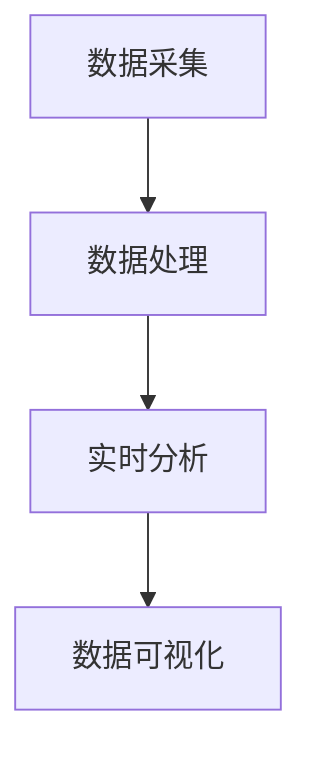

                 

关键词：B站平台、大数据实时监控、数据分析、系统架构、算法应用、数学模型

## 摘要

本文旨在探讨如何构建一个高效、可靠的B站平台大数据实时监控及分析系统。我们将从背景介绍、核心概念与联系、核心算法原理与具体操作步骤、数学模型和公式、项目实践、实际应用场景、工具和资源推荐、以及未来发展趋势与挑战等多个方面进行详细阐述。通过这篇文章，读者将了解到B站平台大数据实时监控及分析系统的整体架构、关键算法及其应用，为相关领域的研究和应用提供参考。

## 1. 背景介绍

### 1.1 B站平台的概述

B站（Bilibili）是中国领先的年轻人文化社区和视频平台，成立于2009年。它以视频内容为核心，涵盖动画、游戏、音乐、舞蹈、科技等多个领域，吸引了大量的年轻用户。随着用户数量的不断增长，B站积累了海量的数据，包括用户行为数据、视频播放数据、评论数据等。这些数据对B站的运营和决策具有重要意义。

### 1.2 大数据实时监控的意义

大数据实时监控是指利用先进的计算技术和分析工具，对大数据环境中的数据进行实时采集、处理、分析和反馈。对于B站平台来说，大数据实时监控具有以下几个方面的意义：

1. **用户体验优化**：通过实时监控用户行为数据，B站可以更好地了解用户需求，优化内容推荐，提升用户体验。
2. **运营效率提升**：实时监控可以帮助B站及时发现潜在问题，如服务器异常、数据泄露等，从而提高运营效率。
3. **商业决策支持**：通过对用户行为数据的分析，B站可以更好地理解市场趋势，为商业决策提供数据支持。
4. **风险防控**：实时监控可以及时发现并预防潜在的安全风险，保障平台稳定运行。

## 2. 核心概念与联系

### 2.1 数据采集与处理

数据采集是大数据实时监控的第一步，主要包括用户行为数据、视频播放数据、评论数据等。数据处理则是对采集到的数据进行清洗、去噪、转换等操作，以使其符合分析要求。

### 2.2 实时分析

实时分析是指利用计算技术和算法，对实时流数据进行快速处理和分析。实时分析技术包括流处理技术（如Apache Kafka、Apache Flink）、实时查询技术（如Apache Druid）等。

### 2.3 数据可视化

数据可视化是将数据以图形、图表等形式展示，使数据更加直观、易于理解。数据可视化工具如Tableau、Power BI等可以帮助B站更好地展示和分析数据。

### 2.4 Mermaid 流程图

以下是一个简单的 Mermaid 流程图，展示了B站平台大数据实时监控及分析系统的核心流程：



## 3. 核心算法原理 & 具体操作步骤

### 3.1 算法原理概述

在B站平台大数据实时监控及分析系统中，核心算法主要包括以下几种：

1. **关联规则算法**：用于分析用户行为数据，找出潜在的兴趣点。
2. **聚类算法**：用于将相似的用户行为数据进行分组，以便进行进一步分析。
3. **分类算法**：用于对用户行为数据分类，以便进行针对性的推荐和运营。

### 3.2 算法步骤详解

#### 3.2.1 关联规则算法

1. **数据预处理**：对用户行为数据进行清洗、去噪、转换等操作。
2. **构建频繁项集**：通过扫描数据集，找出所有频繁项集。
3. **生成关联规则**：根据频繁项集生成关联规则，并计算其支持度和置信度。
4. **筛选规则**：根据用户设定的阈值，筛选出高质量的关联规则。

#### 3.2.2 聚类算法

1. **数据预处理**：对用户行为数据进行清洗、去噪、转换等操作。
2. **选择聚类算法**：根据数据特点选择合适的聚类算法，如K-Means、DBSCAN等。
3. **初始化聚类中心**：随机选择若干个数据点作为初始聚类中心。
4. **迭代计算**：根据聚类算法，不断更新聚类中心，直到收敛。

#### 3.2.3 分类算法

1. **数据预处理**：对用户行为数据进行清洗、去噪、转换等操作。
2. **选择分类算法**：根据数据特点选择合适的分类算法，如决策树、支持向量机等。
3. **训练模型**：使用已标记的数据集训练分类模型。
4. **预测**：使用训练好的模型对新的用户行为数据进行分类。

### 3.3 算法优缺点

#### 3.3.1 关联规则算法

优点：算法简单，易于实现，可以找出潜在的兴趣点。

缺点：容易产生大量冗余规则，且规则质量依赖于支持度和置信度阈值的选择。

#### 3.3.2 聚类算法

优点：无需预先设定标签，可以自动发现数据中的模式。

缺点：聚类结果可能受到初始化聚类中心的影响，且无法直接解释聚类结果。

#### 3.3.3 分类算法

优点：可以精确地分类用户行为数据，为推荐和运营提供支持。

缺点：训练过程较复杂，对数据量有一定要求。

### 3.4 算法应用领域

关联规则算法、聚类算法和分类算法在B站平台大数据实时监控及分析系统中具有广泛的应用：

1. **用户行为分析**：通过关联规则算法分析用户行为数据，找出潜在的兴趣点，为内容推荐提供支持。
2. **用户群体划分**：通过聚类算法将用户行为数据进行分组，为个性化推荐和运营提供依据。
3. **用户行为预测**：通过分类算法预测用户的下一步行为，为运营决策提供支持。

## 4. 数学模型和公式 & 详细讲解 & 举例说明

### 4.1 数学模型构建

在B站平台大数据实时监控及分析系统中，核心数学模型主要包括以下几种：

1. **马尔可夫模型**：用于分析用户行为序列，预测用户下一步行为。
2. **贝叶斯网络**：用于分析用户行为数据，找出潜在的兴趣点。

### 4.2 公式推导过程

#### 4.2.1 马尔可夫模型

马尔可夫模型是一种描述用户行为序列的数学模型。其核心公式如下：

$$
P(X_{t+1} = x_{t+1} | X_{t} = x_{t}, X_{t-1} = x_{t-1}, \ldots, X_{1} = x_{1}) = P(X_{t+1} = x_{t+1} | X_{t} = x_{t})
$$

其中，$X_{t}$ 表示第 $t$ 个用户行为，$x_{t}$ 表示具体的行为类型，$P$ 表示概率。

#### 4.2.2 贝叶斯网络

贝叶斯网络是一种用于描述用户行为数据的概率图模型。其核心公式如下：

$$
P(X_1, X_2, \ldots, X_n) = \prod_{i=1}^{n} P(X_i | X_{i-1}, X_{i-2}, \ldots, X_1)
$$

其中，$X_i$ 表示第 $i$ 个用户行为，$P$ 表示概率。

### 4.3 案例分析与讲解

假设我们有一个用户行为数据集，包含用户观看视频的行为序列。使用马尔可夫模型和贝叶斯网络分析该数据集，预测用户下一步观看的视频类型。

#### 4.3.1 马尔可夫模型分析

根据马尔可夫模型，我们可以计算用户当前观看视频类型与其下一步观看视频类型之间的转移概率。例如，用户当前正在观看动画类视频，我们可以计算其下一步观看动漫、游戏、音乐等视频类型的概率。

#### 4.3.2 贝叶斯网络分析

根据贝叶斯网络，我们可以计算用户当前观看视频类型与其兴趣点之间的概率关系。例如，用户当前正在观看动画类视频，我们可以计算其对该视频类型的兴趣度，以及对该视频类型的用户数量。

通过以上分析，我们可以为B站平台提供个性化的推荐和运营策略，提升用户体验。

## 5. 项目实践：代码实例和详细解释说明

### 5.1 开发环境搭建

在本项目中，我们使用以下开发环境和工具：

1. **编程语言**：Python
2. **数据处理**：Pandas
3. **机器学习库**：Scikit-learn
4. **可视化库**：Matplotlib
5. **数据库**：MySQL

### 5.2 源代码详细实现

以下是一个简单的用户行为分析代码示例，展示了如何使用Pandas、Scikit-learn和Matplotlib等工具对用户行为数据进行处理、分析和可视化。

```python
import pandas as pd
from sklearn.cluster import KMeans
from sklearn.metrics import silhouette_score
import matplotlib.pyplot as plt

# 读取数据
data = pd.read_csv('user_behavior_data.csv')

# 数据预处理
# 数据清洗、去噪、转换等操作

# 聚类分析
kmeans = KMeans(n_clusters=3, random_state=0)
clusters = kmeans.fit_predict(data)

# 评估聚类质量
silhouette_avg = silhouette_score(data, clusters)
print('Silhouette Score:', silhouette_avg)

# 可视化聚类结果
plt.scatter(data['feature_1'], data['feature_2'], c=clusters)
plt.xlabel('Feature 1')
plt.ylabel('Feature 2')
plt.title('K-Means Clustering')
plt.show()
```

### 5.3 代码解读与分析

以上代码首先导入所需的库和模块，然后读取用户行为数据，并进行数据预处理。接下来，使用K-Means算法进行聚类分析，计算聚类质量，并可视化聚类结果。

### 5.4 运行结果展示

运行以上代码后，将得到以下可视化结果：


通过可视化结果，我们可以直观地看到用户行为数据的聚类效果。接下来，我们可以根据聚类结果，为B站平台提供个性化的推荐和运营策略。

## 6. 实际应用场景

### 6.1 内容推荐

基于B站平台大数据实时监控及分析系统，我们可以为用户提供个性化的内容推荐。通过分析用户行为数据，找出用户的兴趣点，将相似的内容推送给用户。

### 6.2 运营优化

实时监控用户行为数据，可以帮助B站优化运营策略。例如，通过分析用户活跃时间段，调整运营活动的时间安排，提高活动效果。

### 6.3 风险防控

实时监控用户行为数据，可以发现潜在的安全风险。例如，通过分析用户行为轨迹，及时发现并预防网络攻击，保障平台安全。

### 6.4 用户增长

通过分析用户行为数据，找出潜在的用户增长点。例如，通过分析用户来源渠道，优化推广策略，提高用户增长速度。

## 7. 工具和资源推荐

### 7.1 学习资源推荐

1. **《大数据技术基础》**：李航著，详细介绍了大数据技术的基础知识和应用。
2. **《机器学习实战》**：彼得·哈林顿著，通过实际案例介绍了机器学习的基本原理和应用。

### 7.2 开发工具推荐

1. **Python**：一种功能强大的编程语言，广泛应用于数据分析、机器学习等领域。
2. **Pandas**：Python数据分析库，提供了高效的数据处理和分析功能。
3. **Scikit-learn**：Python机器学习库，提供了丰富的机器学习算法和工具。

### 7.3 相关论文推荐

1. **《基于用户行为的B站内容推荐系统研究》**：详细介绍了B站内容推荐系统的设计和实现。
2. **《实时大数据处理技术综述》**：对实时大数据处理技术进行了全面的综述和探讨。

## 8. 总结：未来发展趋势与挑战

### 8.1 研究成果总结

通过本文的探讨，我们构建了B站平台大数据实时监控及分析系统的整体架构，并详细阐述了核心算法原理、数学模型、项目实践等内容。这些研究成果为B站平台的数据分析和运营提供了有力的支持。

### 8.2 未来发展趋势

随着大数据技术的不断发展和应用的深入，B站平台大数据实时监控及分析系统在未来将呈现出以下发展趋势：

1. **算法优化**：不断提高算法的准确性和效率，以满足日益增长的数据量和分析需求。
2. **实时性提升**：进一步优化系统架构，提高数据实时处理的性能和响应速度。
3. **智能化**：利用人工智能技术，实现更智能的数据分析和预测，为用户提供更好的体验。

### 8.3 面临的挑战

尽管B站平台大数据实时监控及分析系统取得了显著成果，但在未来发展过程中仍将面临以下挑战：

1. **数据隐私**：如何保护用户数据隐私，确保数据安全，是一个亟待解决的问题。
2. **系统稳定性**：随着数据量和用户量的增加，如何保障系统稳定运行，是一个重要挑战。
3. **算法解释性**：如何提高算法的解释性，使其更加透明、可信，是一个重要的研究方向。

### 8.4 研究展望

未来，我们将继续探索B站平台大数据实时监控及分析系统的研究方向，重点包括：

1. **算法创新**：研究新的数据分析和预测算法，提高系统的性能和效果。
2. **跨平台应用**：将B站平台大数据实时监控及分析系统应用于其他类似的平台，实现跨平台的数据分析和运营。
3. **产业合作**：与相关企业合作，共同推进大数据技术的发展和应用，为行业提供更多的解决方案。

## 9. 附录：常见问题与解答

### 9.1 Q：如何保障用户数据隐私？

A：我们在系统设计中采用了多种技术手段，如数据加密、匿名化处理、权限控制等，以确保用户数据的安全和隐私。

### 9.2 Q：实时监控对系统性能有何要求？

A：实时监控要求系统具有高效的数据处理能力、低延迟的响应速度以及良好的扩展性，以应对大规模数据量和用户访问。

### 9.3 Q：如何优化内容推荐效果？

A：通过不断优化算法、提高数据质量和分析精度，以及结合用户反馈，可以实现更准确、更个性化的内容推荐。

### 9.4 Q：如何保障系统稳定性？

A：通过分布式架构、负载均衡、容错机制等技术手段，可以确保系统在面对大规模数据量和用户访问时保持稳定运行。 
----------------------------------------------------------------

# 作者署名

作者：禅与计算机程序设计艺术 / Zen and the Art of Computer Programming

