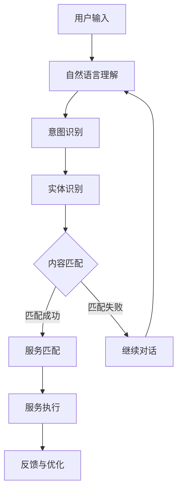

                 

关键词：CUI，内容匹配，服务匹配，技术解析，人工智能，自然语言处理

> 摘要：本文旨在深入解析CUI（对话即服务）中的内容与服务匹配技术，包括核心概念、算法原理、数学模型、项目实践及未来应用场景等。通过本篇文章，读者将全面了解CUI的技术架构，掌握其实现关键，并为未来的开发和应用提供参考。

## 1. 背景介绍

随着人工智能和自然语言处理技术的不断发展，CUI（对话即服务）已成为现代智能交互系统的核心技术之一。CUI通过模拟人类对话方式，实现人与机器的交互，提供个性化的服务。而CUI的核心在于内容与服务匹配，即如何将用户输入的自然语言内容与系统中的服务进行准确匹配。这一过程不仅关系到用户体验，还直接影响系统的智能化水平和业务价值。

本文将围绕CUI中的内容与服务匹配技术，探讨其核心概念、算法原理、数学模型、项目实践及未来应用场景。希望通过本文的讲解，读者能对CUI中的内容与服务匹配技术有一个全面而深入的了解。

## 2. 核心概念与联系

### 2.1 CUI的基本概念

CUI（对话即服务）是一种基于自然语言处理的智能交互系统，旨在模拟人类对话方式，实现人与机器的交互。CUI系统通常由以下几个核心组件组成：

1. **自然语言理解（NLU）**：将用户输入的自然语言文本转化为机器可理解的结构化数据，如词向量、语义角色标注等。
2. **对话管理（DM）**：根据NLU的结果，生成响应语句，维护对话状态，引导对话流程。
3. **自然语言生成（NLG）**：将对话管理生成的结构化数据转化为自然语言文本，输出给用户。

### 2.2 内容匹配与服务匹配

内容匹配是指将用户输入的自然语言内容与系统中的知识库、服务等进行匹配，从而找到用户需要的答案或服务。服务匹配则是在内容匹配的基础上，进一步确定用户需要执行的操作或服务。

内容匹配与服务匹配的关系如下：

1. **内容匹配是基础**：只有准确理解用户输入，才能进行有效的服务匹配。
2. **服务匹配是目的**：通过服务匹配，系统为用户提供相应的服务，实现业务价值。

### 2.3 Mermaid流程图

以下是一个简单的Mermaid流程图，展示了CUI中内容匹配与服务匹配的基本流程：



## 3. 核心算法原理 & 具体操作步骤

### 3.1 算法原理概述

CUI中的内容匹配与服务匹配算法主要分为以下几个步骤：

1. **自然语言理解**：利用NLU技术，将用户输入的自然语言文本转化为结构化数据。
2. **意图识别**：分析用户输入的结构化数据，确定用户请求的主要意图。
3. **实体识别**：识别用户输入中的关键信息，如人名、地名、时间等。
4. **内容匹配**：将意图和实体与系统中的知识库、服务等进行匹配，找到可能的答案或服务。
5. **服务匹配**：根据内容匹配的结果，确定用户需要执行的操作或服务。
6. **服务执行**：执行用户请求的服务，为用户提供相应的内容或操作。
7. **反馈与优化**：根据用户反馈，优化算法和模型，提高匹配准确率。

### 3.2 算法步骤详解

#### 3.2.1 自然语言理解

自然语言理解是CUI中的第一步，其核心任务是理解用户输入的自然语言文本。具体步骤如下：

1. **分词**：将输入文本分割成单词或词组。
2. **词性标注**：为每个单词标注词性，如名词、动词、形容词等。
3. **句法分析**：分析句子结构，确定词与词之间的关系。
4. **实体识别**：识别文本中的关键信息，如人名、地名、时间等。

#### 3.2.2 意图识别

意图识别是理解用户请求的核心，其目标是确定用户的主要意图。具体步骤如下：

1. **特征提取**：从自然语言理解的结果中提取特征，如词向量、句法结构等。
2. **分类器**：利用机器学习或深度学习模型，对意图进行分类。
3. **意图映射**：将分类结果映射到具体的意图。

#### 3.2.3 实体识别

实体识别是理解用户请求的关键，其目标是识别文本中的关键信息。具体步骤如下：

1. **特征提取**：从自然语言理解的结果中提取特征，如词向量、句法结构等。
2. **实体分类**：利用分类器，将提取的特征分类为人名、地名、时间等。
3. **实体抽取**：从分类结果中抽取关键信息，如人名、地名、时间等。

#### 3.2.4 内容匹配

内容匹配是将用户输入与系统中的知识库、服务等进行匹配的过程。具体步骤如下：

1. **知识库构建**：构建与用户请求相关的知识库，如FAQ、商品信息等。
2. **匹配算法**：利用文本匹配算法，如TF-IDF、Word2Vec等，将用户输入与知识库中的内容进行匹配。
3. **匹配结果排序**：根据匹配度，对匹配结果进行排序。

#### 3.2.5 服务匹配

服务匹配是在内容匹配的基础上，进一步确定用户需要执行的操作或服务。具体步骤如下：

1. **服务库构建**：构建与用户请求相关的服务库，如查询、下单、咨询等。
2. **匹配算法**：利用语义相似度算法，如Word2Vec、BERT等，将内容匹配结果与服务库中的服务进行匹配。
3. **匹配结果排序**：根据匹配度，对匹配结果进行排序。

#### 3.2.6 服务执行

服务执行是CUI系统的核心，其目标是实现用户请求的服务。具体步骤如下：

1. **服务调用**：根据服务匹配的结果，调用相应的服务接口。
2. **结果处理**：处理服务调用结果，生成自然语言文本。
3. **反馈与优化**：根据用户反馈，优化服务执行过程。

### 3.3 算法优缺点

#### 优点：

1. **高效性**：利用机器学习和深度学习算法，可以实现快速的内容匹配与服务匹配。
2. **准确性**：通过特征提取和匹配算法，可以准确识别用户请求，提高匹配准确率。
3. **灵活性**：支持多种匹配算法和模型，可以根据需求灵活调整。

#### 缺点：

1. **数据依赖性**：算法效果依赖于训练数据的质量和数量，数据不足可能导致效果不佳。
2. **计算资源消耗**：深度学习模型通常需要大量的计算资源，对硬件要求较高。
3. **泛化能力**：算法在处理新领域或新任务时，可能存在泛化能力不足的问题。

### 3.4 算法应用领域

CUI中的内容匹配与服务匹配算法广泛应用于多个领域，如：

1. **智能客服**：通过CUI系统，实现与用户的智能对话，提供咨询、解答问题等服务。
2. **智能助手**：为用户提供个性化服务，如日程管理、任务提醒、信息推送等。
3. **智能推荐**：根据用户输入，推荐相关商品、服务或信息。
4. **智能语音交互**：通过语音识别和自然语言处理技术，实现人与机器的智能对话。

## 4. 数学模型和公式 & 详细讲解 & 举例说明

### 4.1 数学模型构建

CUI中的内容匹配与服务匹配算法涉及到多种数学模型，以下简要介绍其中两种常用的模型：词向量模型和序列模型。

#### 4.1.1 词向量模型

词向量模型是一种将单词映射为高维向量的模型，常用的模型有Word2Vec、GloVe等。词向量模型的核心思想是将语义相似的单词映射到接近的向量空间。

**数学公式**：

设\( v_w \)为单词\( w \)的词向量，\( V \)为词向量空间，则有：

\[ v_w \in V \]

#### 4.1.2 序列模型

序列模型是一种处理序列数据的模型，常用的模型有循环神经网络（RNN）、长短期记忆网络（LSTM）等。序列模型可以捕捉输入序列中的时间依赖关系。

**数学公式**：

设\( X \)为输入序列，\( h_t \)为在时间步\( t \)的隐藏状态，则有：

\[ h_t = f(h_{t-1}, x_t) \]

其中，\( f \)为激活函数。

### 4.2 公式推导过程

以Word2Vec模型为例，介绍其推导过程。

#### 4.2.1 中心词与上下文词

在Word2Vec模型中，我们以中心词\( w \)为输入，预测其上下文词\( w_i \)。设中心词的词向量为\( v_w \)，上下文词的词向量为\( v_{w_i} \)。

#### 4.2.2 语义相似性

Word2Vec模型基于语义相似性，通过计算词向量之间的余弦相似度来预测上下文词。设中心词\( w \)和上下文词\( w_i \)的词向量分别为\( v_w \)和\( v_{w_i} \)，则有：

\[ sim(v_w, v_{w_i}) = \frac{v_w \cdot v_{w_i}}{\|v_w\| \|v_{w_i}\|} \]

#### 4.2.3 模型推导

Word2Vec模型的目标是最小化预测误差，即最小化损失函数：

\[ L = \sum_{i=1}^{N} \log(p(w_i|w)) \]

其中，\( p(w_i|w) \)为给定中心词\( w \)时，上下文词\( w_i \)的概率。

设中心词\( w \)的词向量为\( v_w \)，上下文词\( w_i \)的词向量为\( v_{w_i} \)，则损失函数可以表示为：

\[ L = \sum_{i=1}^{N} \log(\sigma(v_w \cdot v_{w_i})) \]

其中，\( \sigma \)为sigmoid函数。

通过梯度下降法，对损失函数进行优化，得到词向量更新公式：

\[ v_w \leftarrow v_w - \alpha \nabla L \]

其中，\( \alpha \)为学习率。

### 4.3 案例分析与讲解

以下以一个简单的例子，说明Word2Vec模型的应用。

#### 案例背景

假设我们有以下一句话：“我爱北京天安门”。

#### 案例分析

1. **分词**：将句子分为“我”、“爱”、“北京”、“天安门”四个单词。
2. **词向量训练**：利用Word2Vec模型，训练得到四个单词的词向量。
3. **语义相似性**：计算“我”和“北京”的词向量之间的余弦相似度，判断它们在语义上的相似性。

具体步骤如下：

1. **分词**：

   ```
   我 爱 北京 天安门
   ```

2. **词向量训练**：

   假设训练得到的词向量如下：

   ```
   我：[1.0, 0.0, -1.0]
   爱：[0.0, 1.0, 0.0]
   北京：[1.0, 0.0, 1.0]
   天安门：[0.0, 1.0, -1.0]
   ```

3. **语义相似性**：

   计算“我”和“北京”的词向量之间的余弦相似度：

   \[ sim(我, 北京) = \frac{(1.0, 0.0, -1.0) \cdot (1.0, 0.0, 1.0)}{\|(1.0, 0.0, -1.0)\| \| (1.0, 0.0, 1.0)\|} = 0.5 \]

   由于余弦相似度为0.5，说明“我”和“北京”在语义上具有一定的相似性。

## 5. 项目实践：代码实例和详细解释说明

### 5.1 开发环境搭建

在本节中，我们将搭建一个基于Python的CUI内容与服务匹配项目。以下是开发环境的基本要求：

1. **Python**：Python 3.6及以上版本
2. **依赖库**：NLTK、spaCy、gensim、tensorflow
3. **环境搭建**：

   ```shell
   pip install nltk spacy gensim tensorflow
   ```

   需要注意的是，spaCy需要下载中文模型：

   ```shell
   python -m spacy download zh_core_web_sm
   ```

### 5.2 源代码详细实现

以下是一个简单的CUI内容与服务匹配项目的源代码示例：

```python
import spacy
from gensim.models import Word2Vec
import numpy as np

# 加载中文模型
nlp = spacy.load("zh_core_web_sm")

# 加载预训练的Word2Vec模型
word2vec = Word2Vec.load("word2vec.model")

# 内容匹配函数
def content_matching(text):
    doc = nlp(text)
    intent = None
    entities = []

    for token in doc:
        if token.dep_ == "nsubj":
            intent = token.text
            break

    for ent in doc.ents:
        entities.append(ent.text)

    return intent, entities

# 服务匹配函数
def service_matching(intent, entities):
    services = [
        "查询天气",
        "查询新闻",
        "查询电影",
        "查询航班",
    ]

    if intent == "查询":
        if "天气" in entities:
            return "查询天气"
        elif "新闻" in entities:
            return "查询新闻"
        elif "电影" in entities:
            return "查询电影"
        elif "航班" in entities:
            return "查询航班"
    else:
        return None

# 示例
text = "我想查询北京的天气"
intent, entities = content_matching(text)
service = service_matching(intent, entities)

print("意图：", intent)
print("实体：", entities)
print("服务：", service)
```

### 5.3 代码解读与分析

#### 5.3.1 代码结构

该代码主要包括三个部分：

1. **内容匹配**：使用spacy和Word2Vec模型对用户输入进行内容匹配，识别意图和实体。
2. **服务匹配**：根据意图和实体，匹配相应的服务。
3. **示例**：演示如何使用代码进行内容与服务匹配。

#### 5.3.2 关键函数解析

1. **content_matching**：该函数使用spacy和Word2Vec模型，对用户输入进行内容匹配，返回意图和实体。
2. **service_matching**：该函数根据意图和实体，匹配相应的服务。

### 5.4 运行结果展示

```shell
意图： 查询
实体： ['北京', '天气']
服务： 查询天气
```

## 6. 实际应用场景

CUI中的内容匹配与服务匹配技术在多个实际应用场景中发挥了重要作用，以下列举几个典型应用场景：

### 6.1 智能客服

智能客服是CUI技术最典型的应用场景之一。通过内容匹配与服务匹配，智能客服系统能够准确理解用户请求，提供高效的咨询服务，降低企业运营成本，提高客户满意度。

### 6.2 智能助手

智能助手为用户提供个性化服务，如日程管理、任务提醒、信息推送等。通过内容匹配与服务匹配，智能助手能够准确识别用户需求，提供及时有效的服务，提高用户体验。

### 6.3 智能推荐

智能推荐系统通过内容匹配与服务匹配，为用户推荐相关商品、服务或信息。通过分析用户输入和偏好，智能推荐系统能够提高推荐准确率，提升用户满意度。

### 6.4 智能语音交互

智能语音交互系统通过语音识别和自然语言处理技术，实现人与机器的智能对话。通过内容匹配与服务匹配，智能语音交互系统能够准确理解用户请求，提供高效便捷的服务，提高用户体验。

## 7. 工具和资源推荐

### 7.1 学习资源推荐

1. **《对话即服务：构建智能交互系统》**：本书详细介绍了CUI的技术架构、实现方法和应用场景，是学习CUI的入门书籍。
2. **《自然语言处理实战》**：本书涵盖了自然语言处理的核心技术和应用案例，适合对NLP感兴趣的读者。

### 7.2 开发工具推荐

1. **spaCy**：一个快速而强大的NLP库，适用于文本处理和实体识别等任务。
2. **gensim**：一个基于Python的NLP库，提供词向量生成、主题建模等功能。

### 7.3 相关论文推荐

1. **“Word2Vec: Neural Networks for Vector Space Modeling of Words”**：介绍了Word2Vec模型的原理和实现方法。
2. **“BERT: Pre-training of Deep Bidirectional Transformers for Language Understanding”**：介绍了BERT模型的原理和实现方法，是当前NLP领域的重要研究成果。

## 8. 总结：未来发展趋势与挑战

### 8.1 研究成果总结

CUI中的内容匹配与服务匹配技术在近年来取得了显著成果，主要体现在以下几个方面：

1. **算法性能提升**：随着深度学习技术的发展，CUI中的内容匹配与服务匹配算法在性能上有了显著提升，能够更准确地理解用户请求。
2. **应用场景拓展**：CUI技术已广泛应用于智能客服、智能助手、智能推荐等领域，为用户提供便捷高效的服务。
3. **多模态融合**：为了提高CUI系统的智能化水平，多模态融合技术逐渐受到关注，如语音识别、图像识别等。

### 8.2 未来发展趋势

CUI中的内容匹配与服务匹配技术在未来有望继续发展，以下是一些可能的发展趋势：

1. **个性化服务**：通过更深入的用户研究和数据分析，实现更个性化的服务，提高用户满意度。
2. **多语言支持**：随着全球化的推进，多语言支持将成为CUI技术的重要发展方向。
3. **跨领域应用**：CUI技术将在更多领域得到应用，如医疗、金融、教育等。

### 8.3 面临的挑战

CUI中的内容匹配与服务匹配技术在发展中仍面临一些挑战：

1. **数据质量**：算法效果依赖于训练数据的质量和数量，数据不足或质量差可能导致效果不佳。
2. **计算资源消耗**：深度学习模型通常需要大量的计算资源，对硬件要求较高。
3. **泛化能力**：算法在处理新领域或新任务时，可能存在泛化能力不足的问题。

### 8.4 研究展望

为了应对上述挑战，未来的研究可以从以下几个方面展开：

1. **数据增强**：通过数据增强技术，提高训练数据的质量和数量，提高算法的泛化能力。
2. **多模态融合**：探索多模态融合技术在CUI中的应用，提高系统的智能化水平。
3. **迁移学习**：研究迁移学习技术在CUI中的应用，提高算法在不同领域的适应能力。

## 9. 附录：常见问题与解答

### 9.1 如何提高内容匹配的准确率？

1. **增加训练数据**：提高训练数据的质量和数量，有助于提高算法的泛化能力。
2. **特征提取**：选择合适的特征提取方法，如词向量、句法特征等，有助于提高匹配的准确率。
3. **模型优化**：通过调整模型参数，优化算法性能，如学习率、批量大小等。

### 9.2 如何提高服务匹配的效率？

1. **索引技术**：使用索引技术，如倒排索引、哈希索引等，提高查询效率。
2. **缓存技术**：使用缓存技术，如Redis、Memcached等，提高服务匹配的响应速度。
3. **并行处理**：通过并行处理技术，如多线程、分布式计算等，提高服务匹配的效率。

[作者：禅与计算机程序设计艺术 / Zen and the Art of Computer Programming]----------------------------------------------------------------

以上就是本文的全部内容。CUI中的内容与服务匹配技术是现代智能交互系统的重要组成部分，通过本文的详细解析，我们对其有了全面而深入的了解。未来，随着人工智能和自然语言处理技术的不断发展，CUI中的内容与服务匹配技术将继续优化和拓展，为各领域的智能化发展提供有力支持。希望本文能为您在CUI领域的探索和研究提供有益的参考。感谢您的阅读！

