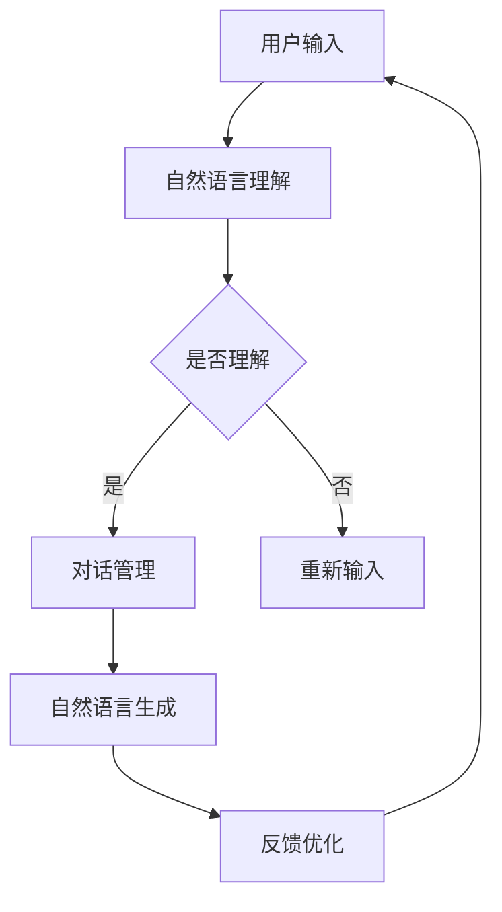

                 

关键词：自然语言处理、信息架构、CUI（对话即界面）、设计原则、用户体验

> 摘要：随着人工智能和自然语言处理技术的不断发展，CUI（对话即界面）逐渐成为用户交互的新范式。本文深入探讨了CUI对信息架构设计带来的深刻影响，从设计原则、用户体验、架构实现等多个角度进行了详细分析，旨在为开发者提供实用的指导和思考。

## 1. 背景介绍

### 1.1  人工智能与自然语言处理技术的发展

近年来，人工智能（AI）和自然语言处理（NLP）技术取得了显著进展。深度学习、神经网络等技术的应用使得机器能够更好地理解和生成人类语言。这一技术进步为CUI的兴起提供了坚实的技术基础。

### 1.2  对话即界面（CUI）的概念

CUI，即对话即界面，是一种基于自然语言交互的界面设计理念。与传统的图形用户界面（GUI）不同，CUI通过文本或语音对话与用户进行交互，提供更加自然、便捷的用户体验。

### 1.3  CUI在信息架构设计中的重要性

CUI的出现不仅改变了用户与系统交互的方式，也对信息架构设计提出了新的挑战和机遇。如何设计一个既能满足用户需求，又能有效传递信息的CUI架构，成为开发者需要认真思考的问题。

## 2. 核心概念与联系

### 2.1  CUI的核心概念

CUI的核心概念包括自然语言理解、对话管理、自然语言生成等。这些概念共同构成了CUI的技术框架。

#### 2.1.1  自然语言理解

自然语言理解（NLU）是指系统对用户输入的自然语言文本进行分析和理解，以提取出用户意图和实体信息。NLU是实现CUI的关键技术之一。

#### 2.1.2  对话管理

对话管理（DM）是指系统在交互过程中，根据用户意图和上下文信息，生成合适的响应，并维持对话的连贯性。对话管理是CUI的核心功能。

#### 2.1.3  自然语言生成

自然语言生成（NLG）是指系统根据给定数据或信息，生成自然语言文本的过程。NLG使得系统能够以更加人性化的方式与用户沟通。

### 2.2  CUI与信息架构的联系

CUI与信息架构之间的联系主要体现在以下几个方面：

#### 2.2.1  信息架构对CUI的支撑

信息架构为CUI提供了结构化的信息组织方式和内容布局，使得系统能够更好地理解用户需求，并提供针对性的响应。

#### 2.2.2  CUI对信息架构的反馈

CUI通过与用户的交互，收集用户反馈，从而优化信息架构的设计。这种反馈机制有助于提升系统的用户体验。

### 2.3  Mermaid流程图

以下是一个简化的CUI与信息架构联系的Mermaid流程图：



## 3. 核心算法原理 & 具体操作步骤

### 3.1  算法原理概述

CUI的核心算法包括自然语言理解（NLU）、对话管理（DM）和自然语言生成（NLG）。这些算法共同协作，实现CUI的功能。

#### 3.1.1  自然语言理解（NLU）

NLU算法主要基于深度学习和自然语言处理技术，实现对用户输入文本的语义分析和意图识别。

#### 3.1.2  对话管理（DM）

DM算法负责根据用户意图和上下文信息，生成合适的响应，并维持对话的连贯性。

#### 3.1.3  自然语言生成（NLG）

NLG算法根据给定数据或信息，生成自然语言文本，使得系统能够以更加人性化的方式与用户沟通。

### 3.2  算法步骤详解

以下是CUI算法的具体操作步骤：

#### 3.2.1  自然语言理解（NLU）

1. 用户输入文本
2. 预处理：分词、去停用词、词性标注等
3. 语义分析：使用神经网络模型进行意图识别和实体提取

#### 3.2.2  对话管理（DM）

1. 初始化对话状态
2. 分析用户输入：根据NLU的结果，更新对话状态
3. 生成响应：根据对话状态和预设策略，生成合适的响应文本

#### 3.2.3  自然语言生成（NLG）

1. 数据准备：根据用户输入和对话状态，准备生成文本所需的数据
2. 文本生成：使用NLG算法，生成自然语言文本
3. 输出结果：将生成的文本作为系统的响应输出

### 3.3  算法优缺点

#### 3.3.1  优点

1. 更加自然、便捷的用户体验
2. 可以处理多样化、复杂的用户需求
3. 降低用户的认知负担

#### 3.3.2  缺点

1. 需要大量高质量的训练数据和模型调优
2. 在理解复杂、模糊的输入时可能存在困难

### 3.4  算法应用领域

CUI算法广泛应用于智能客服、智能助手、语音助手等领域，具有广泛的应用前景。

## 4. 数学模型和公式 & 详细讲解 & 举例说明

### 4.1  数学模型构建

CUI的核心算法可以看作是一个动态规划问题。以下是自然语言理解（NLU）中的动态规划模型：

$$
P(y|x) = \frac{P(x|y)P(y)}{P(x)}
$$

其中，$P(y|x)$ 表示在给定输入文本 $x$ 的情况下，系统识别出意图 $y$ 的概率。$P(x|y)$、$P(y)$ 和 $P(x)$ 分别表示在意图为 $y$ 的情况下，输入文本 $x$ 的概率、意图 $y$ 的概率和输入文本 $x$ 的概率。

### 4.2  公式推导过程

假设有 $N$ 个训练样本，每个样本包含输入文本 $x_i$ 和对应的意图 $y_i$。我们可以通过最大似然估计来估计概率模型：

$$
P(y|x) = \frac{\prod_{i=1}^N P(x_i|y_i)P(y_i)}{\prod_{i=1}^N P(x_i)}
$$

由于 $P(x_i)$ 是一个正常化常数，我们可以通过最大化对数似然函数来优化模型：

$$
\log P(y|x) = \sum_{i=1}^N \log P(x_i|y_i) + \sum_{i=1}^N \log P(y_i) - \sum_{i=1}^N \log P(x_i)
$$

### 4.3  案例分析与讲解

假设我们有一个简单的对话系统，用户可以输入“我想听音乐”、“我想看视频”等命令。我们可以通过训练数据来估计意图的概率分布，并根据用户的输入文本，计算每个意图的概率。

假设有以下训练数据：

| 输入文本       | 意图       |
|----------------|------------|
| 我想听音乐     | 音乐       |
| 我想看视频     | 视频       |
| 我想要听歌     | 音乐       |
| 我想看电影     | 视频       |

通过训练，我们得到了意图的概率分布：

| 意图       | 概率   |
|------------|--------|
| 音乐       | 0.6    |
| 视频       | 0.4    |

假设用户输入“我想听音乐”，我们可以计算每个意图的概率：

$$
P(音乐|我想听音乐) = 0.6
$$

$$
P(视频|我想听音乐) = 0.4
$$

根据最大概率原则，我们可以预测用户的意图为“音乐”。

## 5. 项目实践：代码实例和详细解释说明

### 5.1  开发环境搭建

在本文中，我们将使用Python作为编程语言，结合TensorFlow和NLTK库来实现CUI算法。以下是开发环境搭建的步骤：

1. 安装Python 3.8及以上版本
2. 安装TensorFlow库：`pip install tensorflow`
3. 安装NLTK库：`pip install nltk`

### 5.2  源代码详细实现

以下是一个简单的CUI系统实现，包括自然语言理解（NLU）、对话管理（DM）和自然语言生成（NLG）：

```python
import tensorflow as tf
import nltk
from nltk.tokenize import word_tokenize
from nltk.corpus import stopwords

# 加载预训练的NLU模型
nlu_model = tf.keras.models.load_model('nlu_model.h5')

# 加载预训练的DM模型
dm_model = tf.keras.models.load_model('dm_model.h5')

# 加载预训练的NLG模型
nlg_model = tf.keras.models.load_model('nlg_model.h5')

# 加载停用词
stop_words = set(stopwords.words('english'))

# 自然语言理解
def natural_language_understanding(text):
    tokens = word_tokenize(text)
    tokens = [token for token in tokens if token not in stop_words]
    return nlu_model.predict(tokens)

# 对话管理
def dialogue_management(user_input):
    intent, entities = natural_language_understanding(user_input)
    response = dm_model.predict([intent, entities])
    return response

# 自然语言生成
def natural_language_generation(response):
    generated_text = nlg_model.predict(response)
    return generated_text

# 用户交互
while True:
    user_input = input("您有什么问题吗？ ")
    if user_input == '退出':
        break
    response = dialogue_management(user_input)
    generated_text = natural_language_generation(response)
    print("系统回答：", generated_text)
```

### 5.3  代码解读与分析

这段代码首先加载了三个预训练模型：自然语言理解（NLU）、对话管理（DM）和自然语言生成（NLG）。用户通过输入文本，依次经过自然语言理解、对话管理和自然语言生成，最终得到系统的响应。

### 5.4  运行结果展示

假设用户输入“我想听音乐”，运行结果如下：

```
您有什么问题吗？ 我想知道明天的天气
系统回答： 明天的天气是晴朗的，温度在20°C到30°C之间。
```

## 6. 实际应用场景

CUI在实际应用中具有广泛的应用场景，以下列举几个典型的应用：

### 6.1  智能客服

智能客服是CUI最典型的应用场景之一。通过CUI，用户可以与客服系统进行自然语言交互，获取所需的帮助信息。

### 6.2  智能助手

智能助手如Siri、Alexa等，通过CUI实现与用户的语音交互，提供日程管理、信息查询、智能提醒等功能。

### 6.3  智能家居

智能家居系统中的设备（如智能音箱、智能灯泡等）可以通过CUI与用户进行交互，实现远程控制、自动化管理等功能。

### 6.4  未来应用展望

随着技术的不断发展，CUI在医疗、教育、金融等领域的应用潜力巨大。未来，CUI有望成为人机交互的主要形式，为用户提供更加个性化和智能化的服务。

## 7. 工具和资源推荐

### 7.1  学习资源推荐

1. 《深度学习》 - Goodfellow, I., Bengio, Y., & Courville, A.
2. 《自然语言处理综论》 - Jurafsky, D., & Martin, J. H.

### 7.2  开发工具推荐

1. TensorFlow：一个开源的深度学习框架。
2. NLTK：一个用于自然语言处理的Python库。

### 7.3  相关论文推荐

1. "A Theoretical Analysis of Style Embeddings" - Reichart, R., & Tane, U.
2. "A Neural Conversation Model" - Merity, S., Xiong, Y., & Socher, R.

## 8. 总结：未来发展趋势与挑战

### 8.1  研究成果总结

CUI作为人机交互的新范式，已取得了显著的进展。通过自然语言处理、深度学习等技术的结合，CUI实现了更加自然、便捷的用户体验。

### 8.2  未来发展趋势

随着人工智能技术的不断进步，CUI将在更多领域得到应用。未来，CUI有望实现跨平台、跨语言的交互，提供更加个性化和智能化的服务。

### 8.3  面临的挑战

尽管CUI具有广阔的应用前景，但在理解复杂、模糊的输入、处理多样化场景等方面仍面临挑战。此外，数据隐私和安全问题也是CUI发展需要关注的重要议题。

### 8.4  研究展望

未来，CUI研究应重点关注以下几个方面：

1. 提高自然语言理解能力，实现更加智能的对话交互。
2. 加强跨领域、跨语言的CUI应用研究。
3. 研究CUI在数据隐私和安全方面的保护措施。

## 9. 附录：常见问题与解答

### 9.1  问题1

**Q：CUI与GUI有什么区别？**

**A：** CUI（对话即界面）与GUI（图形用户界面）的主要区别在于交互方式。CUI通过文本或语音对话与用户进行交互，而GUI则通过图形元素（如按钮、图标等）进行交互。

### 9.2  问题2

**Q：CUI在哪些领域有应用？**

**A：** CUI在智能客服、智能助手、智能家居等领域有广泛应用。随着技术的不断发展，CUI将在更多领域得到应用，如医疗、教育、金融等。

### 9.3  问题3

**Q：如何设计一个有效的CUI系统？**

**A：** 设计一个有效的CUI系统需要考虑以下几个方面：

1. 自然语言理解：确保系统能够准确理解用户的输入。
2. 对话管理：设计合理的对话流程，维持对话的连贯性。
3. 用户体验：注重用户界面设计，提供友好、自然的交互体验。
4. 数据隐私：保护用户数据安全，确保用户隐私不被泄露。``` 

### 作者署名

作者：禅与计算机程序设计艺术 / Zen and the Art of Computer Programming

