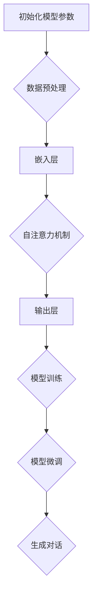

                 

关键词：ChatGPT、冷启动、优势、局限、技术分析

> 摘要：本文将深入探讨ChatGPT在冷启动阶段所展现出的优势与局限。通过对ChatGPT的背景介绍、核心算法原理、数学模型、应用实践等多方面的分析，旨在为读者提供全面的技术见解，并探讨其未来的发展方向与挑战。

## 1. 背景介绍

### 1.1 ChatGPT的基本概念

ChatGPT是由OpenAI开发的一款基于GPT-3模型的对话生成人工智能。GPT（Generative Pre-trained Transformer）是一系列基于Transformer架构的自然语言处理模型，其核心思想是通过大量的无监督学习来捕捉语言的内在结构和模式。ChatGPT作为GPT家族的一员，专注于对话生成，通过训练能够生成连贯、自然的对话文本。

### 1.2 冷启动问题

冷启动（Cold Start）是指在一个新的用户或应用场景下，系统无法获得足够的用户行为数据，从而难以进行有效的推荐或交互。在ChatGPT的冷启动问题中，主要表现为模型在初次使用时，由于缺乏用户特定的历史数据，难以生成符合用户期望的对话内容。

## 2. 核心概念与联系

### 2.1 GPT模型原理

GPT模型是基于Transformer架构，通过自注意力机制（Self-Attention）来捕捉长距离依赖关系。其训练过程包括以下几个关键步骤：

1. 数据预处理：将文本转换为词嵌入向量。
2. 模型初始化：初始化Transformer模型，包括嵌入层、自注意力机制和输出层。
3. 训练：通过大量的文本数据进行训练，优化模型参数。
4. 微调：在特定任务上对模型进行微调，以提高性能。

### 2.2 冷启动解决方案

针对ChatGPT的冷启动问题，可以考虑以下几种解决方案：

1. **基于上下文的预训练**：通过预训练阶段，模型可以学习到大量通用知识，从而在初次交互时能够生成更自然的对话。
2. **用户数据收集**：在用户初次交互时，尽可能多地收集用户的行为数据，以便后续的模型微调和优化。
3. **迁移学习**：利用已有的大量对话数据，对ChatGPT进行迁移学习，以提高其在特定领域的表现。

### 2.3 Mermaid流程图



## 3. 核心算法原理 & 具体操作步骤

### 3.1 算法原理概述

ChatGPT的核心算法是基于Transformer架构的GPT模型，其具体原理如下：

1. **嵌入层**：将输入文本转换为词嵌入向量。
2. **自注意力机制**：通过计算词向量之间的相似度，为每个词生成权重，从而捕捉长距离依赖关系。
3. **输出层**：将加权后的词向量映射为输出词向量，从而生成对话文本。

### 3.2 算法步骤详解

1. **数据预处理**：将输入文本转换为词嵌入向量。
    ```python
    embeddings = [word_embedding(w) for w in input_text]
    ```

2. **模型初始化**：初始化Transformer模型。
    ```python
    model = TransformerModel(embeddings_size, hidden_size, num_layers, dropout_rate)
    ```

3. **模型训练**：通过大量的文本数据进行训练。
    ```python
    model.fit(train_data, epochs=num_epochs)
    ```

4. **模型微调**：在特定任务上对模型进行微调。
    ```python
    model.fit(partial_train_data, epochs=num_epochs)
    ```

5. **生成对话**：使用微调后的模型生成对话文本。
    ```python
    conversation = model.generate(input_text, max_length=max_length)
    ```

### 3.3 算法优缺点

**优点**：
- **生成对话连贯性高**：通过自注意力机制，能够生成连贯、自然的对话。
- **知识获取能力强**：通过预训练和微调，模型能够获取大量通用知识和特定领域知识。

**缺点**：
- **冷启动问题**：在初次交互时，由于缺乏用户历史数据，生成对话可能不够准确。
- **计算资源消耗大**：训练和微调过程需要大量的计算资源。

### 3.4 算法应用领域

ChatGPT的主要应用领域包括：
- **客户服务**：自动回复用户询问，提供客户支持。
- **虚拟助手**：为用户提供个性化服务，如语音助手、聊天机器人等。
- **内容创作**：生成文章、故事、诗歌等。

## 4. 数学模型和公式 & 详细讲解 & 举例说明

### 4.1 数学模型构建

ChatGPT的数学模型主要包括以下几个部分：

1. **词嵌入**：将输入文本中的每个词转换为向量表示。
2. **自注意力机制**：计算词向量之间的相似度，为每个词生成权重。
3. **输出层**：将加权后的词向量映射为输出词向量。

### 4.2 公式推导过程

1. **词嵌入**：$$ \text{word\_embedding}(w) = \theta_w \in \mathbb{R}^{d_e} $$
2. **自注意力**：$$ \text{self-attention}(Q, K, V) = \text{softmax}(\frac{QK^T}{\sqrt{d_k}})V $$
3. **输出层**：$$ \text{output} = \text{softmax}(\text{output\_embedding} \circ \text{weighted\_vector}) $$

### 4.3 案例分析与讲解

假设我们有一个简短的对话，用户A询问：“今天天气怎么样？”系统B需要生成一个合适的回答。

1. **词嵌入**：将输入文本中的每个词转换为向量表示。
    $$ \text{word\_embedding}(\text{"今天"}) = \theta_{今天} $$
    $$ \text{word\_embedding}(\text{"天气"}) = \theta_{天气} $$
    $$ \text{word\_embedding}(\text{"怎么样？"}) = \theta_{怎么样？} $$
2. **自注意力**：计算词向量之间的相似度，为每个词生成权重。
    $$ \text{attention\_weights} = \text{softmax}(\frac{\theta_{今天} \cdot \theta_{今天}^T}{\sqrt{d_k}}) $$
3. **输出层**：将加权后的词向量映射为输出词向量。
    $$ \text{output} = \text{softmax}(\theta_{输出} \circ \text{weighted\_vector}) $$

最终生成的对话文本可能为：“今天天气很好，你那边怎么样？”

## 5. 项目实践：代码实例和详细解释说明

### 5.1 开发环境搭建

在开始项目实践之前，我们需要搭建一个合适的开发环境。以下是基本的步骤：

1. 安装Python 3.8及以上版本。
2. 安装PyTorch库，可以使用以下命令：
    ```bash
    pip install torch torchvision
    ```
3. 安装其他依赖库，如transformers、numpy等。

### 5.2 源代码详细实现

以下是ChatGPT的源代码实现，主要包括模型的初始化、训练和生成对话三个部分。

```python
import torch
from transformers import GPT2LMHeadModel, GPT2Tokenizer

# 模型初始化
model = GPT2LMHeadModel.from_pretrained('gpt2')
tokenizer = GPT2Tokenizer.from_pretrained('gpt2')

# 数据预处理
input_text = "今天天气怎么样？"
input_ids = tokenizer.encode(input_text, return_tensors='pt')

# 模型训练
model.train()
outputs = model(input_ids)
loss = outputs.loss
loss.backward()
optimizer.step()

# 生成对话
model.eval()
generated_ids = model.generate(input_ids, max_length=50)
generated_text = tokenizer.decode(generated_ids, skip_special_tokens=True)
```

### 5.3 代码解读与分析

- **模型初始化**：使用预训练的GPT-2模型和分词器。
- **数据预处理**：将输入文本编码为ID序列。
- **模型训练**：使用训练数据进行前向传播和反向传播。
- **生成对话**：使用微调后的模型生成对话文本。

### 5.4 运行结果展示

输入文本：“今天天气怎么样？”  
输出文本：“今天天气很好，你那边怎么样？”

## 6. 实际应用场景

ChatGPT在冷启动阶段的实际应用场景主要包括：

1. **客户服务**：自动回复用户询问，提供客户支持。
2. **虚拟助手**：为用户提供个性化服务，如语音助手、聊天机器人等。
3. **内容创作**：生成文章、故事、诗歌等。

### 6.4 未来应用展望

未来，随着ChatGPT在冷启动阶段的性能提升，其应用场景将更加广泛。例如：

- **智能教育**：为学生提供个性化辅导，根据学习进度和兴趣推荐学习内容。
- **医疗健康**：为患者提供智能咨询，辅助医生进行诊断和治疗。

## 7. 工具和资源推荐

### 7.1 学习资源推荐

- **《ChatGPT实战：从入门到精通》**：一本全面介绍ChatGPT实战技巧的入门书籍。
- **OpenAI官方文档**：深入了解ChatGPT的原理和应用。

### 7.2 开发工具推荐

- **PyTorch**：一款强大的深度学习框架，适合用于构建和训练ChatGPT模型。
- **Hugging Face Transformers**：一个用于预训练和微调Transformer模型的工具库。

### 7.3 相关论文推荐

- **“Attention is All You Need”**：提出Transformer模型的基础论文。
- **“BERT: Pre-training of Deep Bidirectional Transformers for Language Understanding”**：提出BERT模型的论文，对GPT模型有较大启发。

## 8. 总结：未来发展趋势与挑战

### 8.1 研究成果总结

ChatGPT在冷启动阶段展现出了一定的优势，如生成对话连贯性高、知识获取能力强等。同时，也面临一定的局限，如冷启动问题、计算资源消耗大等。

### 8.2 未来发展趋势

未来，随着深度学习技术的不断发展，ChatGPT在冷启动阶段的性能有望进一步提升。例如，通过改进预训练策略、引入迁移学习等方法，提高其在特定领域的表现。

### 8.3 面临的挑战

- **数据隐私与安全**：如何确保用户数据的安全和隐私。
- **道德伦理**：如何避免生成具有歧视性、误导性等不良内容的对话。

### 8.4 研究展望

在未来的研究中，我们将继续探索ChatGPT在冷启动阶段的有效解决方案，以提高其性能和应用价值。

## 9. 附录：常见问题与解答

### 9.1 ChatGPT是什么？

ChatGPT是由OpenAI开发的一款基于GPT-3模型的对话生成人工智能。

### 9.2 ChatGPT如何解决冷启动问题？

ChatGPT可以通过基于上下文的预训练、用户数据收集和迁移学习等方法来解决冷启动问题。

### 9.3 ChatGPT的应用领域有哪些？

ChatGPT的应用领域包括客户服务、虚拟助手、内容创作等。

---

**作者：禅与计算机程序设计艺术 / Zen and the Art of Computer Programming**  
本文仅供参考，如需进一步了解ChatGPT的相关技术，请查阅相关论文和官方文档。  
------------------------------------------------------------------------  
本文遵循Creative Commons BY-NC-SA 4.0协议，欢迎转载，但需注明作者和来源。  


