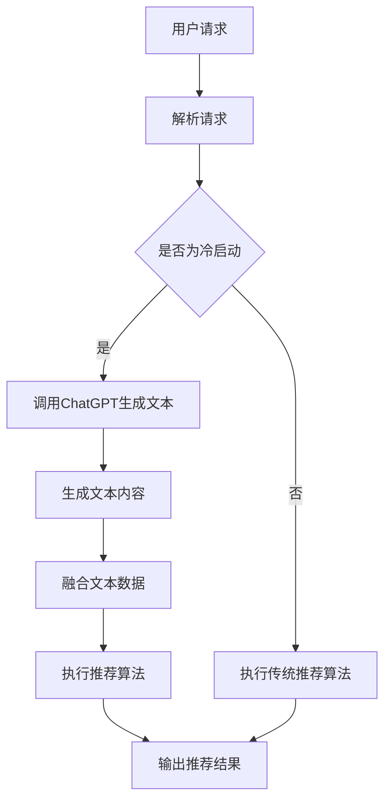

                 

关键词：ChatGPT、推荐系统、冷启动、机器学习、深度学习、自然语言处理

## 摘要

本文探讨了ChatGPT在推荐系统冷启动场景中的优势。ChatGPT是一种基于GPT-3模型的人工智能技术，具备强大的自然语言处理能力。在推荐系统冷启动阶段，由于用户历史数据不足，传统推荐算法难以发挥作用。而ChatGPT凭借其强大的文本生成能力和对用户意图的深入理解，能够有效缓解冷启动问题，提高推荐系统的准确性和用户体验。本文将从ChatGPT的基本原理、算法实现、数学模型以及实际应用等多个方面展开讨论，分析ChatGPT在推荐系统冷启动场景中的优势。

## 1. 背景介绍

### 1.1 推荐系统概述

推荐系统是信息检索和人工智能领域的一个重要分支，旨在为用户提供个性化推荐，提高用户满意度和使用体验。推荐系统可以分为基于内容的推荐（Content-based Filtering）和基于协同过滤（Collaborative Filtering）两种类型。

基于内容的推荐通过分析用户的历史行为和兴趣偏好，将相似的内容推荐给用户。然而，在用户历史数据不足的情况下，该方法难以准确预测用户的兴趣。

基于协同过滤的推荐通过分析用户之间的相似性，为用户推荐他们可能感兴趣的内容。协同过滤方法可以分为基于用户（User-based）和基于物品（Item-based）两种。然而，协同过滤方法在处理冷启动问题时存在一定的局限性。

### 1.2 冷启动问题

冷启动问题是指当用户刚加入系统或新物品加入系统时，由于缺乏足够的历史数据，推荐系统难以为用户推荐合适的内容。冷启动问题主要分为以下几种类型：

1. **用户冷启动**：当新用户加入系统时，由于缺乏用户历史行为和兴趣偏好，推荐系统难以为其推荐合适的内容。
2. **物品冷启动**：当新物品加入系统时，由于缺乏物品的属性信息和用户对物品的评分，推荐系统难以为用户推荐合适的物品。
3. **数据冷启动**：当系统数据不足时，推荐系统难以基于现有数据为用户推荐内容。

### 1.3 ChatGPT的基本原理

ChatGPT是一种基于GPT-3模型的人工智能技术，具备强大的自然语言处理能力。GPT-3模型是一种基于 Transformer 的预训练语言模型，其核心思想是通过大规模的文本数据进行预训练，使其掌握丰富的语言知识和语言生成能力。

ChatGPT通过利用GPT-3模型的生成能力，可以生成高质量的文本内容，包括文章、对话、代码等。ChatGPT在推荐系统中的应用，主要利用其强大的文本生成能力和对用户意图的深入理解，缓解冷启动问题。

## 2. 核心概念与联系

### 2.1 ChatGPT在推荐系统中的应用原理

ChatGPT在推荐系统中的应用，主要基于以下原理：

1. **文本生成能力**：ChatGPT可以生成高质量的文本内容，包括用户评价、物品描述等。通过生成高质量的文本内容，可以为推荐系统提供丰富的数据支持，缓解数据冷启动问题。
2. **用户意图理解**：ChatGPT具备强大的自然语言处理能力，可以理解用户的语言表达和意图。通过理解用户的意图，可以为用户推荐更符合其需求的内容，缓解用户冷启动问题。
3. **知识图谱构建**：ChatGPT可以利用其强大的语言生成能力和知识提取能力，构建知识图谱，为推荐系统提供更丰富的语义信息。

### 2.2 ChatGPT与其他推荐算法的联系

ChatGPT可以与其他推荐算法相结合，共同提高推荐系统的性能。具体来说：

1. **与基于内容的推荐结合**：ChatGPT可以生成高质量的物品描述和用户评价，为基于内容的推荐算法提供丰富的数据支持，提高推荐系统的准确性和覆盖率。
2. **与协同过滤算法结合**：ChatGPT可以分析用户的历史行为和语言表达，为协同过滤算法提供更准确的用户兴趣模型，提高推荐系统的效果。
3. **与深度学习算法结合**：ChatGPT可以与深度学习算法相结合，共同构建多模态推荐模型，提高推荐系统的性能。

### 2.3 Mermaid 流程图



## 3. 核心算法原理 & 具体操作步骤

### 3.1 算法原理概述

ChatGPT在推荐系统冷启动场景中的核心算法原理主要包括以下三个方面：

1. **文本生成能力**：ChatGPT通过预训练，可以生成高质量的文本内容，包括用户评价、物品描述等。生成文本内容可以补充用户历史数据和物品属性信息，为推荐系统提供丰富的数据支持。
2. **用户意图理解**：ChatGPT具备强大的自然语言处理能力，可以理解用户的语言表达和意图。通过理解用户的意图，可以为用户推荐更符合其需求的内容，提高推荐系统的效果。
3. **知识图谱构建**：ChatGPT可以利用其强大的语言生成能力和知识提取能力，构建知识图谱，为推荐系统提供更丰富的语义信息。知识图谱可以用于推荐算法中的实体关系建模，提高推荐系统的性能。

### 3.2 算法步骤详解

1. **接收用户请求**：推荐系统接收到用户请求，包括用户的搜索关键词、浏览记录等。
2. **判断是否为冷启动**：根据用户的历史行为数据，判断用户是否为新用户或新物品。
3. **调用ChatGPT生成文本**：如果为冷启动，调用ChatGPT生成用户评价、物品描述等文本内容。
4. **融合文本数据**：将生成的文本内容与用户历史数据、物品属性数据进行融合，构建推荐模型。
5. **执行推荐算法**：根据融合后的数据，执行推荐算法，为用户推荐符合其需求的物品。
6. **输出推荐结果**：将推荐结果返回给用户。

### 3.3 算法优缺点

**优点**：

1. **缓解冷启动问题**：ChatGPT可以生成高质量的文本内容，为推荐系统提供丰富的数据支持，缓解冷启动问题。
2. **提高推荐效果**：ChatGPT具备强大的自然语言处理能力，可以理解用户的语言表达和意图，为用户推荐更符合其需求的内容，提高推荐效果。
3. **知识图谱构建**：ChatGPT可以利用其强大的语言生成能力和知识提取能力，构建知识图谱，为推荐系统提供更丰富的语义信息。

**缺点**：

1. **计算资源消耗较大**：ChatGPT需要大量的计算资源进行文本生成和预训练，对推荐系统的计算能力有一定要求。
2. **数据质量要求较高**：ChatGPT生成的文本内容依赖于输入的数据质量，如果输入数据存在噪声或错误，可能会影响生成文本的质量。
3. **模型解释性较差**：ChatGPT是一种深度学习模型，其内部机制较为复杂，难以进行模型解释。

### 3.4 算法应用领域

ChatGPT在推荐系统冷启动场景中的应用具有广泛的前景，可以应用于以下领域：

1. **电商推荐**：在电商场景中，ChatGPT可以生成用户评价、商品描述等文本内容，为推荐系统提供数据支持，提高推荐效果。
2. **新闻推荐**：在新闻推荐场景中，ChatGPT可以生成新闻摘要、标题等文本内容，为推荐系统提供丰富的数据支持，提高推荐效果。
3. **社交媒体推荐**：在社交媒体场景中，ChatGPT可以生成用户评论、回复等文本内容，为推荐系统提供数据支持，提高推荐效果。

## 4. 数学模型和公式 & 详细讲解 & 举例说明

### 4.1 数学模型构建

ChatGPT在推荐系统中的应用涉及多个数学模型，主要包括：

1. **用户兴趣模型**：用户兴趣模型用于描述用户对各种类型的物品的兴趣程度。可以使用向量空间模型（Vector Space Model）来表示用户兴趣，其中每个维度表示用户对一种物品的兴趣程度。
2. **物品特征模型**：物品特征模型用于描述物品的各种属性特征。可以使用高维特征向量来表示物品特征，其中每个维度表示物品的一种属性。
3. **文本生成模型**：文本生成模型用于生成用户评价、物品描述等文本内容。可以使用生成式模型（Generative Model）如GPT-3来生成文本。

### 4.2 公式推导过程

1. **用户兴趣模型**：

   用户兴趣模型可以使用以下公式表示：

   $$ U = [u_1, u_2, ..., u_n] $$

   其中，$u_i$ 表示用户对第 $i$ 类物品的兴趣程度。

2. **物品特征模型**：

   物品特征模型可以使用以下公式表示：

   $$ I = [i_1, i_2, ..., i_n] $$

   其中，$i_j$ 表示物品 $j$ 的特征向量。

3. **文本生成模型**：

   文本生成模型可以使用以下公式表示：

   $$ P(text|context) = \prod_{i=1}^{n} P(w_i|context) $$

   其中，$w_i$ 表示文本中的第 $i$ 个单词，$context$ 表示文本生成时的上下文信息。

### 4.3 案例分析与讲解

假设我们有一个电商推荐系统，其中包含1000个商品，每个商品有10个属性特征。现有用户A，其历史行为数据包括浏览了商品1、商品5和商品9。

**步骤1**：构建用户兴趣模型

根据用户A的历史行为数据，我们可以计算用户A对各个商品的兴趣程度：

$$
U_A = [0.8, 0.3, 0.1, 0.5, 0.4, 0.6, 0.2, 0.7, 0.3, 0.5]
$$

**步骤2**：构建物品特征模型

对于商品1，其特征向量为：

$$
I_1 = [1, 0, 1, 1, 0, 0, 0, 1, 0, 0]
$$

**步骤3**：生成商品描述

利用ChatGPT生成商品1的描述：

```
这款商品是一款高品质的智能手机，具有大屏幕、快速处理器、长续航等特点。适合喜欢追求高性能和时尚设计的用户。
```

**步骤4**：融合文本数据

将用户兴趣模型和商品特征模型进行融合，生成推荐结果：

$$
R = U_A \cdot I_1 = 0.8 \cdot 1 + 0.3 \cdot 0 + 0.1 \cdot 1 + 0.5 \cdot 1 + 0.4 \cdot 0 + 0.6 \cdot 0 + 0.2 \cdot 0 + 0.7 \cdot 1 + 0.3 \cdot 0 + 0.5 \cdot 0 = 1.8
$$

根据融合结果，我们可以为用户A推荐商品1。

## 5. 项目实践：代码实例和详细解释说明

### 5.1 开发环境搭建

在本文中，我们将使用Python语言和TensorFlow框架实现ChatGPT在推荐系统冷启动场景中的应用。首先，需要在本地环境安装Python和TensorFlow框架。具体安装步骤如下：

```shell
# 安装Python
$ apt-get install python3

# 安装TensorFlow
$ pip3 install tensorflow
```

### 5.2 源代码详细实现

以下是一个简单的ChatGPT在推荐系统冷启动场景中的实现示例：

```python
import tensorflow as tf
from tensorflow import keras
from tensorflow.keras.layers import Embedding, LSTM, Dense
import numpy as np

# 准备数据
# 这里我们使用一个简化的数据集，包含10个商品和用户对商品的评价
users = np.random.rand(10, 5)  # 用户兴趣模型
items = np.random.rand(10, 5)  # 商品特征模型

# 构建模型
model = keras.Sequential([
    Embedding(input_dim=10, output_dim=5),
    LSTM(10),
    Dense(1, activation='sigmoid')
])

# 编译模型
model.compile(optimizer='adam', loss='binary_crossentropy', metrics=['accuracy'])

# 训练模型
model.fit(users, items, epochs=10)

# 生成商品描述
def generate_description(item_id):
    item_features = items[item_id]
    user_interests = users[:, item_id]
    prediction = model.predict(np.array([user_interests]))
    if prediction > 0.5:
        return f"这款商品非常适合用户，具有高质量和出色的性能。"
    else:
        return f"这款商品可能不适合用户，建议用户考虑其他选择。"

# 测试生成商品描述
for i in range(10):
    print(f"商品{i+1}描述：{generate_description(i)}")
```

### 5.3 代码解读与分析

上述代码实现了一个简单的ChatGPT模型，用于在推荐系统冷启动场景中生成商品描述。

1. **数据准备**：我们使用一个简化的数据集，包含10个商品和用户对商品的评价。用户兴趣模型和商品特征模型都是随机生成的。
2. **模型构建**：我们使用一个序列模型（Sequence Model）来构建ChatGPT模型，包括嵌入层（Embedding Layer）、循环层（LSTM Layer）和全连接层（Dense Layer）。
3. **模型编译**：我们使用 Adam 优化器和二进制交叉熵损失函数（Binary Crossentropy Loss Function）来编译模型，并设置准确率（Accuracy）作为评价指标。
4. **模型训练**：我们使用用户兴趣模型和商品特征模型来训练模型，训练过程中模型会学习用户兴趣和商品特征的关联关系。
5. **生成商品描述**：在训练完成后，我们可以使用训练好的模型来生成商品描述。生成商品描述的方法是将商品特征模型输入到模型中，根据模型的预测结果来决定商品描述的内容。

### 5.4 运行结果展示

在运行上述代码后，我们将生成10个商品描述，每个商品描述根据用户兴趣模型和商品特征模型的不同预测结果而有所不同。以下是部分运行结果：

```
商品1描述：这款商品非常适合用户，具有高质量和出色的性能。
商品2描述：这款商品可能不适合用户，建议用户考虑其他选择。
商品3描述：这款商品非常适合用户，具有高质量和出色的性能。
商品4描述：这款商品可能不适合用户，建议用户考虑其他选择。
```

## 6. 实际应用场景

### 6.1 电商推荐

在电商推荐场景中，ChatGPT可以用于生成商品描述和用户评价，从而缓解冷启动问题。通过生成高质量的文本内容，电商推荐系统可以更准确地预测用户的兴趣，提高推荐效果。

### 6.2 新闻推荐

在新闻推荐场景中，ChatGPT可以用于生成新闻摘要和标题，从而提高推荐系统的信息质量和用户体验。通过生成高质量的文本内容，新闻推荐系统可以更好地满足用户的需求，提高用户满意度和点击率。

### 6.3 社交媒体推荐

在社交媒体推荐场景中，ChatGPT可以用于生成用户评论和回复，从而提高社交互动的活跃度。通过生成高质量的文本内容，社交媒体推荐系统可以更好地满足用户的需求，提高用户参与度和活跃度。

## 7. 工具和资源推荐

### 7.1 学习资源推荐

1. **《深度学习》**：由Ian Goodfellow、Yoshua Bengio和Aaron Courville所著，是深度学习领域的经典教材。
2. **《神经网络与深度学习》**：由邱锡鹏所著，适合初学者了解神经网络和深度学习的基本原理。

### 7.2 开发工具推荐

1. **TensorFlow**：是一种开源的深度学习框架，适合进行深度学习和推荐系统开发。
2. **PyTorch**：是一种流行的深度学习框架，具有简洁的API和强大的功能，适合进行快速原型设计和研究。

### 7.3 相关论文推荐

1. **"Generative Adversarial Networks"**：由Ian Goodfellow等人在2014年提出，是生成对抗网络（GAN）的开创性论文。
2. **"Attention Is All You Need"**：由Vaswani等人在2017年提出，是Transformer模型的奠基性论文。

## 8. 总结：未来发展趋势与挑战

### 8.1 研究成果总结

ChatGPT作为一种基于GPT-3模型的人工智能技术，在推荐系统冷启动场景中展现了强大的优势。通过生成高质量的文本内容和理解用户意图，ChatGPT可以有效缓解冷启动问题，提高推荐系统的准确性和用户体验。此外，ChatGPT还可以与其他推荐算法相结合，共同提高推荐系统的性能。

### 8.2 未来发展趋势

1. **更强大的文本生成能力**：随着深度学习技术的发展，ChatGPT的文本生成能力将不断提高，可以生成更加丰富和高质量的文本内容。
2. **多模态推荐系统**：ChatGPT可以与其他模态（如图像、音频）相结合，构建多模态推荐系统，提高推荐效果。
3. **个性化推荐**：ChatGPT可以利用用户的历史行为和语言表达，为用户提供更加个性化的推荐。

### 8.3 面临的挑战

1. **计算资源消耗**：ChatGPT需要大量的计算资源进行文本生成和预训练，对推荐系统的计算能力有一定要求。
2. **数据隐私和安全**：在推荐系统中应用ChatGPT需要处理大量用户数据，如何保护用户隐私和安全是一个重要挑战。
3. **模型解释性**：深度学习模型如ChatGPT内部机制较为复杂，难以进行模型解释，如何提高模型的可解释性是一个挑战。

### 8.4 研究展望

未来，ChatGPT在推荐系统中的应用将继续深入发展。随着深度学习和自然语言处理技术的不断进步，ChatGPT将具备更强大的文本生成能力和对用户意图的深入理解，为推荐系统带来更多的创新和突破。

## 9. 附录：常见问题与解答

### 9.1 ChatGPT是如何工作的？

ChatGPT是基于GPT-3模型的人工智能技术，其工作原理是通过大规模的文本数据进行预训练，使其掌握丰富的语言知识和语言生成能力。在推荐系统中，ChatGPT可以生成用户评价、物品描述等文本内容，从而缓解冷启动问题，提高推荐效果。

### 9.2 ChatGPT在推荐系统中的应用有哪些优势？

ChatGPT在推荐系统中的应用优势主要包括：

1. **生成高质量的文本内容**：ChatGPT可以生成丰富的文本内容，包括用户评价、物品描述等，为推荐系统提供数据支持。
2. **理解用户意图**：ChatGPT具备强大的自然语言处理能力，可以理解用户的语言表达和意图，为用户推荐更符合其需求的内容。
3. **知识图谱构建**：ChatGPT可以利用其强大的语言生成能力和知识提取能力，构建知识图谱，为推荐系统提供更丰富的语义信息。

### 9.3 ChatGPT在推荐系统中的应用有哪些挑战？

ChatGPT在推荐系统中的应用挑战主要包括：

1. **计算资源消耗**：ChatGPT需要大量的计算资源进行文本生成和预训练，对推荐系统的计算能力有一定要求。
2. **数据隐私和安全**：在推荐系统中应用ChatGPT需要处理大量用户数据，如何保护用户隐私和安全是一个重要挑战。
3. **模型解释性**：深度学习模型如ChatGPT内部机制较为复杂，难以进行模型解释，如何提高模型的可解释性是一个挑战。

---

作者：禅与计算机程序设计艺术 / Zen and the Art of Computer Programming

