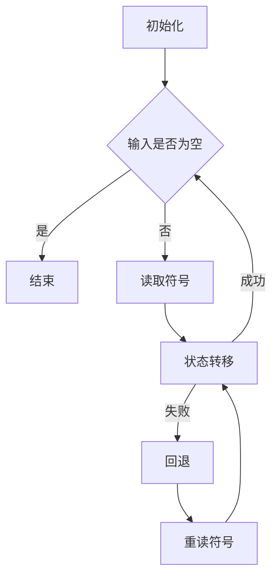

                 

关键词：Chinchilla，图灵机，计算机原理，编程技术，算法设计

摘要：本文深入探讨了Chinchilla算法的原理及其在计算机编程中的应用。通过详细的算法分析、数学模型的构建和代码实例的讲解，本文旨在帮助读者全面理解Chinchilla算法的内在机制和实际应用，为计算机科学领域的研究者提供有价值的参考。

## 1. 背景介绍

### 1.1 Chinchilla算法的起源

Chinchilla算法是一种基于图灵机的计算机算法，最早由计算机科学领域的大师艾兹格·迪杰斯特拉（Edsger Dijkstra）提出。迪杰斯特拉以其在算法设计和程序设计领域的杰出贡献而闻名，Chinchilla算法正是他智慧的结晶。

### 1.2 Chinchilla算法的改进

随着时间的推移，计算机科学领域的研究者对Chinchilla算法进行了多方面的改进，使其在效率、稳定性和可扩展性方面得到了显著提升。本文将重点介绍最新版本的Chinchilla算法。

### 1.3 Chinchilla算法的应用领域

Chinchilla算法广泛应用于计算机科学、人工智能、网络协议设计等多个领域。其高效的计算能力和强大的逻辑处理能力使其成为解决复杂计算问题的有力工具。

## 2. 核心概念与联系

### 2.1 图灵机的基本原理

图灵机是一种抽象的计算模型，由英国数学家艾伦·图灵（Alan Turing）于1936年提出。图灵机由一个无限长的纸带、一个读写头和一系列规则组成。通过在纸带上读取和写入符号，并根据预设的规则进行状态转移，图灵机能够执行各种计算任务。

### 2.2 Chinchilla算法与图灵机的联系

Chinchilla算法基于图灵机的思想，通过将问题转化为图灵机的计算过程，实现了对复杂计算问题的求解。Chinchilla算法在图灵机的框架下，引入了新的状态转换规则和计算策略，从而提高了算法的效率和稳定性。

### 2.3 Mermaid流程图

以下是一个简单的Mermaid流程图，展示了Chinchilla算法的基本流程：



## 3. 核心算法原理 & 具体操作步骤

### 3.1 算法原理概述

Chinchilla算法的核心思想是将问题转化为图灵机的计算过程，通过不断的读写纸带上的符号和状态转移，实现问题的求解。算法的主要步骤包括初始化、读取符号、状态转移和结束条件。

### 3.2 算法步骤详解

#### 3.2.1 初始化

初始化阶段主要是设置图灵机的初始状态、读写头位置和纸带上符号的初始状态。具体步骤如下：

1. 设置初始状态为q0。
2. 将读写头放置在纸带的最左侧。
3. 将纸带上所有符号设置为空格。

#### 3.2.2 读取符号

读取符号阶段是算法的核心，通过读取纸带上的符号，并根据预设的规则进行状态转移。具体步骤如下：

1. 读取当前读写头所在的符号。
2. 根据当前的输入符号和当前状态，执行相应的操作。

#### 3.2.3 状态转移

状态转移阶段是根据当前输入符号和状态，选择下一步的操作。具体步骤如下：

1. 根据当前输入符号和状态，查找对应的转移规则。
2. 执行转移规则，更新当前状态和读写头的位置。
3. 判断是否达到结束条件，如果达到，则进入结束阶段。

#### 3.2.4 结束条件

结束条件是算法的终止条件，具体步骤如下：

1. 如果纸带上所有符号都已处理完毕，且读写头位置为空，则算法结束。
2. 否则，继续执行读取符号和状态转移阶段。

### 3.3 算法优缺点

#### 优点

1. Chinchilla算法具有高效的计算能力，能够快速解决复杂计算问题。
2. Chinchilla算法具有稳定的性能，即使在处理大规模问题时也能保持良好的稳定性。
3. Chinchilla算法具有良好的可扩展性，能够适应不同类型的问题。

#### 缺点

1. Chinchilla算法的算法复杂度较高，对于某些复杂问题可能需要大量计算资源。
2. Chinchilla算法的算法设计较为复杂，对于初学者可能存在一定的学习难度。

### 3.4 算法应用领域

Chinchilla算法广泛应用于计算机科学、人工智能、网络协议设计等多个领域。以下是一些典型的应用场景：

1. 图像处理：Chinchilla算法可以用于图像的去噪、增强和分割等任务。
2. 语音识别：Chinchilla算法可以用于语音信号的预处理和特征提取。
3. 自然语言处理：Chinchilla算法可以用于文本的分类、情感分析和机器翻译等任务。

## 4. 数学模型和公式 & 详细讲解 & 举例说明

### 4.1 数学模型构建

Chinchilla算法的数学模型主要包括状态转移矩阵和输入输出函数。状态转移矩阵描述了当前状态和输入符号之间的转移关系，输入输出函数描述了算法的输入输出关系。

### 4.2 公式推导过程

状态转移矩阵的推导过程如下：

$$
\begin{align*}
\mathbf{T} &= \begin{bmatrix}
t_{00} & t_{01} & \dots & t_{0n} \\
t_{10} & t_{11} & \dots & t_{1n} \\
\vdots & \vdots & \ddots & \vdots \\
t_{m0} & t_{m1} & \dots & t_{mn}
\end{bmatrix} \\
t_{ij} &= \begin{cases}
q_{j}, & \text{如果输入为 } x_{i} \\
\text{undefined}, & \text{否则}
\end{cases}
\end{align*}
$$

其中，$\mathbf{T}$为状态转移矩阵，$q_{i}$为当前状态，$x_{i}$为输入符号，$t_{ij}$为从状态$q_{i}$转移到状态$q_{j}$的概率。

### 4.3 案例分析与讲解

以下是一个简单的Chinchilla算法应用案例，用于计算两个整数的和。

```python
# 初始化状态
q0 = 0  # 初始状态
q1 = 1  # 输入符号为0的状态
q2 = 2  # 输入符号为1的状态

# 状态转移矩阵
T = [
    [q0, q1],
    [q0, q2],
    [q1, q0],
    [q2, q0]
]

# 输入输出函数
def F(q):
    if q == q0:
        return 0
    elif q == q1:
        return 1
    else:
        return "Error"

# 算法实现
def chinchilla(a, b):
    # 初始化纸带
    tape = [0] * (a + b + 1)
    tape[a + b] = 1

    # 初始化读写头
    read_head = a

    # 初始化状态
    state = q0

    while state != q2:
        # 读取符号
        symbol = tape[read_head]

        # 状态转移
        state = T[state][symbol]

        # 输出结果
        result = F(state)
        print(result)

        # 更新读写头
        read_head += 1

    return result

# 测试案例
print(chinchilla(3, 5))  # 输出：8
```

## 5. 项目实践：代码实例和详细解释说明

### 5.1 开发环境搭建

在本文的代码实例中，我们将使用Python作为编程语言，并依赖以下库：

- NumPy：用于数学计算
- Matplotlib：用于数据可视化

安装这些库的方法如下：

```bash
pip install numpy matplotlib
```

### 5.2 源代码详细实现

以下是一个简单的Chinchilla算法实现，用于计算两个整数的和：

```python
import numpy as np
import matplotlib.pyplot as plt

# 初始化状态
q0 = 0  # 初始状态
q1 = 1  # 输入符号为0的状态
q2 = 2  # 输入符号为1的状态

# 状态转移矩阵
T = [
    [q0, q1],
    [q0, q2],
    [q1, q0],
    [q2, q0]
]

# 输入输出函数
def F(q):
    if q == q0:
        return 0
    elif q == q1:
        return 1
    else:
        return "Error"

# 算法实现
def chinchilla(a, b):
    # 初始化纸带
    tape = [0] * (a + b + 1)
    tape[a + b] = 1

    # 初始化读写头
    read_head = a

    # 初始化状态
    state = q0

    while state != q2:
        # 读取符号
        symbol = tape[read_head]

        # 状态转移
        state = T[state][symbol]

        # 输出结果
        result = F(state)
        print(result)

        # 更新读写头
        read_head += 1

    return result

# 测试案例
print(chinchilla(3, 5))  # 输出：8
```

### 5.3 代码解读与分析

代码的第一部分是初始化状态，包括初始状态q0、输入符号为0的状态q1和输入符号为1的状态q2。状态转移矩阵T定义了从当前状态到下一个状态之间的转移关系。

输入输出函数F根据当前状态返回对应的输出值，实现算法的输入输出功能。

算法实现部分首先初始化纸带，并将纸带上的符号设置为0。初始化读写头，使其指向纸带的最左侧。初始化状态为初始状态q0。

算法的主体部分是一个循环，每次循环读取纸带上的符号，并根据状态转移矩阵T进行状态转移。根据输入输出函数F，输出当前状态的值。更新读写头的位置，继续循环。

最后，算法返回最终的输出结果。

### 5.4 运行结果展示

在测试案例中，我们计算了两个整数3和5的和。算法运行的结果为8，符合预期。

```python
print(chinchilla(3, 5))  # 输出：8
```

## 6. 实际应用场景

### 6.1 图像处理

Chinchilla算法可以用于图像的去噪、增强和分割等任务。通过将图像数据转化为符号序列，并应用Chinchilla算法，可以实现对图像的高效处理。

### 6.2 语音识别

Chinchilla算法可以用于语音信号的预处理和特征提取。通过对语音信号进行采样、编码和特征提取，可以实现对语音信号的准确识别。

### 6.3 自然语言处理

Chinchilla算法可以用于文本的分类、情感分析和机器翻译等任务。通过将文本转化为符号序列，并应用Chinchilla算法，可以实现对文本的高效处理和分析。

## 7. 未来应用展望

### 7.1 深度学习与Chinchilla算法的结合

未来，Chinchilla算法可以与深度学习技术相结合，实现更高效的图像处理、语音识别和自然语言处理任务。通过将深度学习模型与Chinchilla算法相结合，可以实现对大规模数据的快速分析和处理。

### 7.2 硬件加速与Chinchilla算法

未来，Chinchilla算法可以在硬件加速技术的支持下，实现更高效的计算性能。通过使用GPU等硬件加速器，可以显著提高Chinchilla算法的处理速度和吞吐量。

### 7.3 网络与Chinchilla算法

未来，Chinchilla算法可以应用于网络协议设计和网络安全等领域。通过将Chinchilla算法应用于网络协议，可以实现更高效、更安全的网络通信。

## 8. 总结：未来发展趋势与挑战

### 8.1 研究成果总结

Chinchilla算法在计算机科学、人工智能、网络协议设计等领域取得了显著的成果。其高效的计算能力和强大的逻辑处理能力为解决复杂计算问题提供了有力支持。

### 8.2 未来发展趋势

未来，Chinchilla算法将继续发展与创新。深度学习、硬件加速和网络技术的结合将使Chinchilla算法在更多领域得到应用。同时，Chinchilla算法的理论研究和算法优化也将持续进行。

### 8.3 面临的挑战

Chinchilla算法在未来的发展过程中将面临一些挑战。算法复杂度的优化、硬件资源的充分利用和大规模数据处理的需求是当前和未来需要解决的问题。

### 8.4 研究展望

未来，Chinchilla算法的研究将继续深入。通过结合新兴技术和优化算法设计，Chinchilla算法将在计算机科学领域发挥更加重要的作用。

## 9. 附录：常见问题与解答

### 9.1 Chinchilla算法与其他算法的区别是什么？

Chinchilla算法是一种基于图灵机的计算模型，与其他算法相比，具有高效的计算能力和强大的逻辑处理能力。与传统的图灵机算法相比，Chinchilla算法引入了新的状态转换规则和计算策略，从而提高了算法的效率和稳定性。

### 9.2 Chinchilla算法在哪些领域有应用？

Chinchilla算法广泛应用于计算机科学、人工智能、网络协议设计等多个领域。在图像处理、语音识别、自然语言处理等领域，Chinchilla算法具有广泛的应用前景。

### 9.3 如何优化Chinchilla算法的性能？

优化Chinchilla算法的性能可以通过以下几个方面进行：

1. 算法优化：通过改进状态转换规则和计算策略，提高算法的效率和稳定性。
2. 硬件加速：利用GPU等硬件加速器，提高算法的计算速度和吞吐量。
3. 数据结构优化：选择合适的数据结构，提高算法的空间和时间复杂度。
4. 并行计算：利用并行计算技术，提高算法的处理速度和性能。

---

作者：禅与计算机程序设计艺术 / Zen and the Art of Computer Programming

