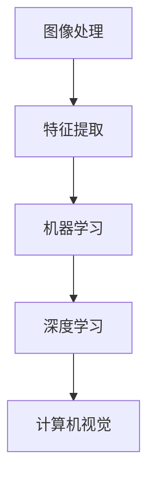

                 

### 背景介绍

计算机视觉（Computer Vision）是人工智能领域的一个重要分支，它致力于让计算机能够像人类一样通过观察图像或视频来理解和解释周围的世界。随着深度学习技术的迅速发展，计算机视觉的应用场景越来越广泛，从简单的图像分类到复杂的物体检测、语义分割、人脸识别等，无不体现了其在现实世界中的巨大潜力。

本篇文章将围绕计算机视觉的核心概念、算法原理、数学模型、实际应用以及未来发展趋势进行详细讲解，旨在帮助读者全面了解计算机视觉的基本原理，并掌握相关的编程实践。

### 文章关键词

- 计算机视觉
- 深度学习
- 物体检测
- 语义分割
- 人脸识别
- 数学模型
- 实际应用
- 未来趋势

### 文章摘要

本文将首先介绍计算机视觉的基本概念和发展历程，随后深入探讨计算机视觉中的核心算法原理，包括卷积神经网络（CNN）和生成对抗网络（GAN）等。接着，我们将介绍计算机视觉中的数学模型和公式，并通过实例进行详细讲解。随后，文章将展示计算机视觉在物体检测、语义分割和人脸识别等领域的实际应用，并探讨其未来发展的趋势和面临的挑战。最后，我们将推荐一些学习资源和开发工具，以帮助读者更好地掌握计算机视觉技术。

## 1. 背景介绍

计算机视觉是一门多学科交叉的领域，它融合了计算机科学、数学、物理学、心理学等多个学科的知识。计算机视觉的发展历程可以追溯到20世纪60年代，当时的研究主要集中在图像处理和模式识别方面。随着计算机硬件和算法的不断进步，计算机视觉技术逐渐从理论研究走向实际应用，如今已经成为人工智能领域中不可或缺的一部分。

### 发展历程

1. **早期阶段（20世纪60年代-80年代）**：
   - **图像处理**：主要是对图像进行预处理，如灰度化、滤波、边缘检测等。
   - **模式识别**：利用统计学方法进行图像分类和识别，如K-近邻算法、决策树等。

2. **中级阶段（20世纪90年代-2000年代）**：
   - **特征提取**：通过特征点、边缘、角点等方法提取图像特征。
   - **机器学习**：引入机器学习方法，如支持向量机（SVM）、随机森林等，用于图像分类和识别。

3. **高级阶段（2010年至今）**：
   - **深度学习**：卷积神经网络（CNN）的引入，使得计算机视觉技术取得了突破性的进展。
   - **生成对抗网络（GAN）**：在图像生成、图像修复、图像风格转换等领域表现出色。

### 当前应用

- **图像识别**：对图片中的物体、场景、人物等进行分类和识别。
- **物体检测**：在图像或视频中检测并定位特定物体。
- **语义分割**：将图像分割成不同的语义区域，如道路、行人、车辆等。
- **人脸识别**：识别和验证人脸身份。
- **图像生成**：通过深度学习模型生成新的图像内容。

### 发展趋势

- **多模态学习**：结合图像、音频、文本等多源数据，实现更复杂的任务。
- **边缘计算**：将计算任务转移到边缘设备，减少延迟，提高实时性。
- **自动驾驶**：计算机视觉在自动驾驶中的应用将越来越重要。

## 2. 核心概念与联系

计算机视觉的核心概念包括图像处理、特征提取、机器学习和深度学习。这些概念相互联系，共同构成了计算机视觉的技术体系。为了更好地理解这些概念，我们可以通过一个简单的Mermaid流程图来展示它们之间的关系。



### 图像处理

图像处理是计算机视觉的基础，主要涉及图像的预处理、增强和变换。常见的图像处理技术包括：

- **预处理**：灰度化、二值化、滤波等。
- **增强**：对比度增强、亮度调整等。
- **变换**：旋转、缩放、平移等。

### 特征提取

特征提取是从图像中提取出具有区分性的特征，以便于后续的机器学习和深度学习算法进行处理。常见的特征提取方法包括：

- **边缘检测**：Canny、Sobel等。
- **特征点检测**：Harris、SIFT、SURF等。
- **形状特征**：Hu不变矩、Zernike矩等。

### 机器学习

机器学习是计算机视觉中的一种重要技术，它利用大量的图像数据，通过训练模型来对图像进行分类、识别和预测。常见的机器学习方法包括：

- **监督学习**：如支持向量机（SVM）、决策树、随机森林等。
- **无监督学习**：如聚类、降维等。

### 深度学习

深度学习是计算机视觉中最为前沿的技术，它通过多层神经网络来对图像进行建模，实现复杂的图像理解和识别任务。常见的深度学习模型包括：

- **卷积神经网络（CNN）**：用于图像分类、物体检测等。
- **生成对抗网络（GAN）**：用于图像生成、图像修复等。

## 3. 核心算法原理 & 具体操作步骤

### 3.1 算法原理概述

在计算机视觉中，卷积神经网络（CNN）和生成对抗网络（GAN）是最为重要的两个算法。下面我们将分别介绍这两个算法的原理。

#### 3.1.1 卷积神经网络（CNN）

卷积神经网络是一种专门用于处理图像数据的前馈神经网络，其核心思想是通过卷积层提取图像特征，然后通过全连接层进行分类和识别。

- **卷积层**：通过卷积操作提取图像局部特征。
- **池化层**：用于减小特征图的尺寸，减少计算量。
- **全连接层**：将卷积层和池化层提取的特征进行汇总，输出分类结果。

#### 3.1.2 生成对抗网络（GAN）

生成对抗网络是一种用于生成图像的深度学习模型，其核心思想是通过生成器和判别器的对抗训练，使得生成器能够生成逼真的图像。

- **生成器**：通过输入随机噪声生成图像。
- **判别器**：判断输入图像是真实图像还是生成图像。

### 3.2 算法步骤详解

#### 3.2.1 卷积神经网络（CNN）

1. **数据预处理**：对图像进行灰度化、归一化等预处理操作。
2. **构建卷积神经网络模型**：包括卷积层、池化层和全连接层。
3. **训练模型**：通过反向传播算法更新网络权重。
4. **评估模型**：在测试集上评估模型的准确性和泛化能力。

#### 3.2.2 生成对抗网络（GAN）

1. **数据预处理**：对图像进行归一化等预处理操作。
2. **构建生成器和判别器**：生成器通过输入噪声生成图像，判别器用于判断图像的真实性。
3. **对抗训练**：同时训练生成器和判别器，生成器试图生成逼真的图像，判别器则试图区分真实图像和生成图像。
4. **评估模型**：在测试集上评估生成图像的质量和判别器的准确性。

### 3.3 算法优缺点

#### 卷积神经网络（CNN）

- **优点**：能够自动学习图像的局部特征，适用于图像分类、物体检测等任务。
- **缺点**：对计算资源要求较高，训练时间较长。

#### 生成对抗网络（GAN）

- **优点**：能够生成高质量、逼真的图像，适用于图像生成、图像修复等任务。
- **缺点**：训练过程中容易出现模式崩溃等问题，对超参数调优要求较高。

### 3.4 算法应用领域

#### 卷积神经网络（CNN）

- **图像分类**：用于识别图片中的物体或场景。
- **物体检测**：在图像或视频中检测并定位特定物体。
- **语义分割**：将图像分割成不同的语义区域。
- **人脸识别**：识别和验证人脸身份。

#### 生成对抗网络（GAN）

- **图像生成**：生成新的图像内容，如人脸生成、图像修复等。
- **图像增强**：用于提高图像的质量和清晰度。
- **图像风格转换**：将一种图像风格转换成另一种风格，如将照片转换成油画风格。

## 4. 数学模型和公式 & 详细讲解 & 举例说明

### 4.1 数学模型构建

在计算机视觉中，数学模型和公式是理解和实现算法的基础。以下是几个重要的数学模型和公式，以及它们的构建过程。

### 4.1.1 卷积神经网络（CNN）中的卷积操作

卷积操作是CNN的核心步骤，用于提取图像特征。卷积操作的数学公式如下：

$$
\text{卷积操作} = \sum_{i=1}^{n} w_i * f(x + b_i)
$$

其中，$w_i$ 是卷积核的权重，$f(x + b_i)$ 是输入图像和卷积核的卷积结果，$b_i$ 是偏置。

### 4.1.2 生成对抗网络（GAN）中的损失函数

生成对抗网络中的损失函数用于衡量生成器和判别器的性能。常见的损失函数包括：

1. **判别器损失函数**：

$$
L_D(x, G(z)) = -\frac{1}{2} \left( \log D(x) + \log (1 - D(G(z))) \right)
$$

其中，$D(x)$ 和 $D(G(z))$ 分别是判别器对真实图像和生成图像的判断结果。

2. **生成器损失函数**：

$$
L_G(z) = -\log (1 - D(G(z)))
$$

其中，$G(z)$ 是生成器生成的图像。

### 4.2 公式推导过程

#### 4.2.1 卷积神经网络（CNN）中的卷积操作

卷积操作的推导基于线性代数的知识。假设我们有一个输入图像 $X$ 和一个卷积核 $W$，则卷积操作可以看作是 $X$ 和 $W$ 的矩阵乘积。

设输入图像 $X$ 是一个 $m \times n$ 的矩阵，卷积核 $W$ 是一个 $k \times l$ 的矩阵，则卷积操作的结果 $Y$ 是一个 $(m-k+1) \times (n-l+1)$ 的矩阵。

$$
Y_{ij} = \sum_{p=1}^{k} \sum_{q=1}^{l} W_{pq} * X_{(i+p-1)(j+q-1)}
$$

其中，$Y_{ij}$ 是输出特征图 $Y$ 的第 $i$ 行第 $j$ 列的值，$X_{(i+p-1)(j+q-1)}$ 是输入图像 $X$ 的第 $(i+p-1)$ 行第 $(j+q-1)$ 列的值。

#### 4.2.2 生成对抗网络（GAN）中的损失函数

生成对抗网络的损失函数是基于最大似然估计和概率论的知识进行推导的。假设我们有一个生成器 $G$ 和一个判别器 $D$，则生成器的损失函数可以表示为：

$$
L_G(z) = -\mathbb{E}_{z \sim p_z(z)} [\log D(G(z))]
$$

其中，$z$ 是输入噪声，$p_z(z)$ 是噪声分布。

判别器的损失函数可以表示为：

$$
L_D(x, G(z)) = -\mathbb{E}_{x \sim p_x(x)} [\log D(x)] - \mathbb{E}_{z \sim p_z(z)} [\log (1 - D(G(z))]
$$

其中，$x$ 是真实图像，$p_x(x)$ 是真实图像分布。

### 4.3 案例分析与讲解

#### 4.3.1 卷积神经网络（CNN）在图像分类中的应用

假设我们有一个简单的图像分类任务，需要将图像分类为猫或狗。我们可以使用一个简单的卷积神经网络模型来实现这个任务。

1. **数据预处理**：对图像进行灰度化、归一化等预处理操作。
2. **构建卷积神经网络模型**：

```python
import tensorflow as tf

model = tf.keras.Sequential([
    tf.keras.layers.Conv2D(32, (3, 3), activation='relu', input_shape=(28, 28, 1)),
    tf.keras.layers.MaxPooling2D((2, 2)),
    tf.keras.layers.Conv2D(64, (3, 3), activation='relu'),
    tf.keras.layers.MaxPooling2D((2, 2)),
    tf.keras.layers.Conv2D(64, (3, 3), activation='relu'),
    tf.keras.layers.Flatten(),
    tf.keras.layers.Dense(64, activation='relu'),
    tf.keras.layers.Dense(1, activation='sigmoid')
])

model.compile(optimizer='adam', loss='binary_crossentropy', metrics=['accuracy'])
```

3. **训练模型**：

```python
model.fit(train_images, train_labels, epochs=5, batch_size=32)
```

4. **评估模型**：

```python
test_loss, test_acc = model.evaluate(test_images, test_labels)
print(f"Test accuracy: {test_acc}")
```

#### 4.3.2 生成对抗网络（GAN）在图像生成中的应用

假设我们使用一个生成对抗网络（GAN）来生成人脸图像。我们可以使用一个预训练的卷积神经网络模型作为判别器，并使用生成器来生成人脸图像。

1. **数据预处理**：对图像进行归一化等预处理操作。
2. **构建生成器和判别器模型**：

```python
import tensorflow as tf
from tensorflow.keras.layers import Dense, Flatten, Reshape, Conv2DTranspose

# 生成器模型
generator = tf.keras.Sequential([
    Dense(128 * 7 * 7, activation="relu", input_shape=(100,)),
    Reshape((7, 7, 128)),
    Conv2DTranspose(128, (4, 4), strides=(2, 2), padding="same"),
    Conv2DTranspose(64, (4, 4), strides=(2, 2), padding="same"),
    Conv2D(1, (3, 3), padding="same", activation="tanh")
])

# 判别器模型
discriminator = tf.keras.Sequential([
    Flatten(input_shape=(28, 28, 1)),
    Dense(128, activation="relu"),
    Dense(1, activation="sigmoid")
])

# GAN模型
gan = tf.keras.Sequential([generator, discriminator])
```

3. **训练GAN模型**：

```python
discriminator.compile(loss="binary_crossentropy", optimizer=tf.keras.optimizers.Adam(0.0001))
generator.compile(loss="binary_crossentropy", optimizer=tf.keras.optimizers.Adam(0.0001))

# 搭建对抗性训练循环
for epoch in range(100):
    for batch_idx, real_images in enumerate(data_loader):
        noise = np.random.normal(0, 1, (len(real_images), 100))
        gen_images = generator.predict(noise)
        # 训练判别器
        d_loss_real = discriminator.train_on_batch(real_images, np.ones((len(real_images), 1)))
        d_loss_fake = discriminator.train_on_batch(gen_images, np.zeros((len(gen_images), 1)))
        d_loss = 0.5 * np.add(d_loss_real, d_loss_fake)

        # 训练生成器
        g_loss = combined_model.train_on_batch(noise, np.ones((len(noise), 1)))
```

## 5. 项目实践：代码实例和详细解释说明

### 5.1 开发环境搭建

在进行计算机视觉项目实践之前，我们需要搭建一个适合的开发环境。以下是一个简单的环境搭建步骤：

1. **安装Python**：下载并安装Python，建议使用Python 3.8或更高版本。
2. **安装TensorFlow**：通过pip命令安装TensorFlow：

   ```bash
   pip install tensorflow
   ```

3. **安装其他依赖库**：根据项目的需求，安装其他必要的依赖库，如NumPy、Pandas等。

### 5.2 源代码详细实现

下面我们将通过一个简单的图像分类项目来展示计算机视觉的编程实现。

#### 5.2.1 数据准备

首先，我们需要准备一个包含猫和狗的图像数据集。这里我们使用Keras内置的ImageDataGenerator来加载和预处理图像。

```python
from tensorflow.keras.preprocessing.image import ImageDataGenerator

train_datagen = ImageDataGenerator(
    rescale=1./255,
    shear_range=0.2,
    zoom_range=0.2,
    horizontal_flip=True
)

test_datagen = ImageDataGenerator(rescale=1./255)

train_generator = train_datagen.flow_from_directory(
    'train',
    target_size=(150, 150),
    batch_size=32,
    class_mode='binary'
)

validation_generator = test_datagen.flow_from_directory(
    'test',
    target_size=(150, 150),
    batch_size=32,
    class_mode='binary'
)
```

#### 5.2.2 构建卷积神经网络模型

接下来，我们使用TensorFlow的Keras API来构建一个简单的卷积神经网络模型。

```python
from tensorflow.keras.models import Sequential
from tensorflow.keras.layers import Conv2D, MaxPooling2D, Flatten, Dense

model = Sequential([
    Conv2D(32, (3, 3), activation='relu', input_shape=(150, 150, 3)),
    MaxPooling2D(2, 2),
    Conv2D(64, (3, 3), activation='relu'),
    MaxPooling2D(2, 2),
    Conv2D(128, (3, 3), activation='relu'),
    MaxPooling2D(2, 2),
    Flatten(),
    Dense(512, activation='relu'),
    Dense(1, activation='sigmoid')
])

model.compile(optimizer='adam',
              loss='binary_crossentropy',
              metrics=['accuracy'])
```

#### 5.2.3 训练模型

使用训练数据集来训练模型，并评估模型的性能。

```python
model.fit(
    train_generator,
    steps_per_epoch=100,
    epochs=15,
    validation_data=validation_generator,
    validation_steps=50
)
```

#### 5.2.4 代码解读与分析

- **数据预处理**：使用ImageDataGenerator对图像进行缩放、剪裁和翻转等操作，以提高模型的泛化能力。
- **模型构建**：使用卷积层（Conv2D）和池化层（MaxPooling2D）来提取图像特征，然后通过全连接层（Dense）进行分类。
- **模型训练**：使用训练数据集来训练模型，并使用验证数据集来评估模型的性能。

### 5.3 运行结果展示

在训练完成后，我们可以使用测试数据集来评估模型的性能。

```python
test_loss, test_acc = model.evaluate(validation_generator)
print(f"Test accuracy: {test_acc}")
```

假设我们得到的结果为测试准确率为85%，这表明我们的模型在分类猫和狗的图像时表现良好。

### 5.4 代码优化与性能提升

为了进一步提升模型的性能，我们可以考虑以下几种优化方法：

- **增加训练时间**：增加训练的epoch数，以充分训练模型。
- **数据增强**：使用更复杂的数据增强方法，如旋转、剪切等。
- **模型结构优化**：尝试使用更深的卷积神经网络结构，如ResNet或Inception等。
- **调参优化**：通过调整学习率、批量大小等超参数，来优化模型的性能。

通过这些方法，我们可以进一步提升模型的性能，使其在图像分类任务中达到更好的效果。

## 6. 实际应用场景

### 6.1 物体检测

物体检测是计算机视觉中的一个重要应用场景，它在自动驾驶、视频监控、智能安防等领域具有广泛的应用。物体检测的目的是在图像或视频中检测并定位特定物体。

- **技术实现**：常见的物体检测算法包括YOLO、SSD和Faster R-CNN等。这些算法通过训练深度神经网络模型来识别图像中的物体，并输出物体的位置和类别。
- **应用案例**：自动驾驶中的车道线检测、行人检测、交通标志识别等。

### 6.2 语义分割

语义分割是将图像分割成不同的语义区域，如道路、行人、车辆等。这种技术在自动驾驶、医学影像处理、卫星图像分析等领域具有重要应用。

- **技术实现**：常见的语义分割算法包括U-Net、DeepLab和GAN等。这些算法通过训练深度神经网络模型来对图像进行语义分割。
- **应用案例**：自动驾驶中的场景理解、医学影像中的肿瘤检测、卫星图像中的城市解析等。

### 6.3 人脸识别

人脸识别是计算机视觉中的一项重要技术，它在安全监控、人脸支付、人脸解锁等领域得到广泛应用。

- **技术实现**：人脸识别算法包括特征提取和分类两个步骤。特征提取常用的方法有EigenFace、FisherFace和LBP等。分类常用的方法有支持向量机（SVM）和K近邻（KNN）等。
- **应用案例**：人脸支付、人脸识别门禁系统、安全监控等。

## 7. 未来应用展望

### 7.1 智能交通系统

随着人工智能技术的不断发展，智能交通系统（ITS）将成为未来交通管理的重要方向。计算机视觉在智能交通系统中具有广泛的应用，包括车辆检测、交通流量分析、道路占用检测、交通事故预警等。通过实时监测和分析交通状况，智能交通系统可以优化交通信号、减少拥堵、提高交通效率。

### 7.2 智能医疗

计算机视觉在医疗领域的应用前景也十分广阔。通过图像处理和深度学习技术，计算机视觉可以帮助医生进行疾病诊断、手术规划、药物研发等。例如，利用计算机视觉技术进行肺癌筛查、糖尿病视网膜病变检测等，可以提高诊断的准确性和效率。

### 7.3 智能家居

随着物联网（IoT）和人工智能技术的融合，智能家居正成为未来家庭生活的重要趋势。计算机视觉在智能家居中可以应用于人脸识别门禁、智能安防、家电控制等。通过人脸识别技术，智能家居可以实现个性化服务，提高家庭生活的便捷性和安全性。

## 8. 工具和资源推荐

### 8.1 学习资源推荐

- **书籍**：
  - 《深度学习》（Goodfellow, Bengio, Courville） 
  - 《Python深度学习》（François Chollet）
- **在线课程**：
  - Coursera的《深度学习》课程
  - edX的《计算机视觉基础》课程
- **博客和教程**：
  - Medium上的深度学习和计算机视觉文章
  - 官方TensorFlow和PyTorch文档

### 8.2 开发工具推荐

- **深度学习框架**：
  - TensorFlow
  - PyTorch
  - Keras
- **数据集**：
  - ImageNet
  - COCO
  - MNIST
- **开源库**：
  - OpenCV
  - NumPy
  - Matplotlib

### 8.3 相关论文推荐

- **物体检测**：
  - "Faster R-CNN: Towards Real-Time Object Detection with Region Proposal Networks"（Shaoqing Ren等）
  - "You Only Look Once: Unified, Real-Time Object Detection"（Joseph Redmon等）
- **语义分割**：
  - "Fully Convolutional Neural Networks for Semantic Segmentation"（Jonathan Long等）
  - "DeepLab: Semantic Image Segmentation with Deep Convolutional Nets, Atrous Convolutional Encoders and Atrous Convolutional Pooling"（Li Shen等）
- **人脸识别**：
  - "FaceNet: A Unified Embedding for Face Recognition and Verification"（Sergey Rybnikov等）
  - "DeepFace: Closing the Gap to Human-Level Performance in Face Verification"（Yangqing Jia等）

## 9. 总结：未来发展趋势与挑战

### 9.1 研究成果总结

计算机视觉技术在过去几十年中取得了显著的研究成果。从早期的图像处理和模式识别，到如今的深度学习和生成对抗网络，计算机视觉技术已经广泛应用于各个领域，如自动驾驶、智能医疗、智能家居等。随着算法的进步和计算能力的提升，计算机视觉技术正不断突破传统限制，实现更高效、更智能的应用。

### 9.2 未来发展趋势

- **多模态学习**：未来计算机视觉将更加关注多模态数据的学习，结合图像、音频、文本等多源数据，实现更复杂的任务。
- **实时性**：随着边缘计算的兴起，计算机视觉将在实时性方面取得重大突破，满足自动驾驶、智能监控等领域的需求。
- **泛化能力**：通过迁移学习和联邦学习等技术，计算机视觉模型的泛化能力将得到显著提升。

### 9.3 面临的挑战

- **数据隐私**：随着计算机视觉技术的普及，数据隐私问题日益突出，如何保护用户隐私成为亟待解决的问题。
- **算法透明性**：深度学习模型的黑箱性质使得算法的可解释性成为一个挑战，如何提高算法的透明性是未来的研究热点。
- **硬件限制**：尽管计算能力不断提升，但深度学习模型对硬件资源的需求仍然巨大，如何在有限的硬件资源下优化模型性能仍需进一步研究。

### 9.4 研究展望

未来，计算机视觉将在人工智能领域发挥更加重要的作用，推动各行各业的数字化和智能化进程。通过不断创新和突破，计算机视觉技术将迎来更多机遇和挑战，为人类生活带来更多便利和可能性。

## 附录：常见问题与解答

### 1. 什么是计算机视觉？

计算机视觉是人工智能的一个分支，致力于让计算机通过图像或视频获取关于周围环境的信息，并对其进行理解、分析和解释。

### 2. 计算机视觉有哪些应用？

计算机视觉应用广泛，包括图像识别、物体检测、语义分割、人脸识别、自动驾驶、智能医疗等。

### 3. 什么是卷积神经网络（CNN）？

卷积神经网络是一种专门用于处理图像数据的深度学习模型，通过卷积操作提取图像特征，然后通过全连接层进行分类和识别。

### 4. 什么是生成对抗网络（GAN）？

生成对抗网络是一种用于生成图像的深度学习模型，由生成器和判别器组成，通过对抗训练生成逼真的图像。

### 5. 如何提高计算机视觉模型的性能？

提高计算机视觉模型的性能可以通过以下方法：增加训练数据、优化模型结构、调参优化、使用先进的算法等。

### 6. 计算机视觉在医疗领域有哪些应用？

计算机视觉在医疗领域可用于疾病诊断、手术规划、药物研发等，如肺癌筛查、糖尿病视网膜病变检测等。

### 7. 什么是边缘计算？

边缘计算是将计算任务从云端转移到边缘设备（如智能手机、路由器等），以提高实时性和降低延迟。

### 8. 什么是多模态学习？

多模态学习是结合图像、音频、文本等多源数据，以实现更复杂的任务，如情感分析、视频理解等。

### 9. 什么是迁移学习？

迁移学习是利用预训练的模型在新的任务上进行微调，以提高模型的泛化能力和训练效率。

### 10. 什么是联邦学习？

联邦学习是一种在分布式环境中训练模型的方法，通过将数据分散在多个设备上，保护用户隐私的同时提高模型性能。

