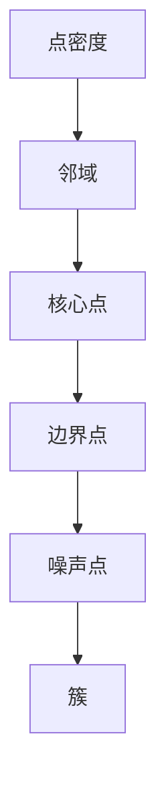

                 

关键词：DBSCAN，聚类算法，密度连接，点密度，邻域，核心点，边界点，噪声点，点集，算法原理，代码实现，实例分析，应用领域，机器学习，数据分析。

> 摘要：本文将详细讲解DBSCAN（Density-Based Spatial Clustering of Applications with Noise）算法的基本原理、实现步骤以及实际应用场景，并通过一个具体的代码实例进行解释说明，帮助读者更好地理解和应用这一强大的聚类工具。

## 1. 背景介绍

在数据分析和机器学习中，聚类是一种无监督学习方法，用于将数据集中的样本分为若干组，使得同组内的样本彼此相似，而不同组的样本则差异较大。聚类算法在数据挖掘、图像识别、市场细分等多个领域都有广泛的应用。

DBSCAN（Density-Based Spatial Clustering of Applications with Noise）是一种基于密度的空间聚类算法。它由Ester、Mater、Kriegel和Parker于1996年提出，适用于高维空间和噪声数据。DBSCAN通过密度连接性来识别核心点、边界点和噪声点，并基于这些点构建多个簇。

### 1.1 DBSCAN的提出背景

随着互联网和物联网的快速发展，数据量呈爆炸性增长，如何有效地组织和处理这些数据成为了一个重要问题。传统的聚类算法如K-means在处理高维数据和噪声数据时表现不佳，而DBSCAN作为一种基于密度的聚类算法，能够很好地解决这些问题。

### 1.2 DBSCAN的优势

- **自适应聚类数**：DBSCAN不需要预先指定聚类数，它可以根据数据分布自动确定。
- **处理高维数据**：DBSCAN对高维数据有较好的聚类效果。
- **噪声容忍性**：DBSCAN能够有效地识别和去除噪声点。
- **复杂形态聚类**：DBSCAN能够识别出任意形状的簇。

## 2. 核心概念与联系

为了理解DBSCAN的工作原理，我们需要先了解一些核心概念和它们之间的关系。以下是DBSCAN算法中的一些关键概念以及它们之间的联系：

### 2.1 点密度

点密度是指一个区域内点的数量。在DBSCAN中，点密度是判断一个点是否为核心点的重要依据。

### 2.2 邻域

邻域是指与某个点距离不超过给定阈值（eps）的所有点。DBSCAN通过邻域来判断点的连接性。

### 2.3 核心点

如果一个点的邻域内包含足够多的点（至少有MinPts个点），那么这个点被称为核心点。核心点可以作为簇的代表。

### 2.4 边界点

如果一个点的邻域内包含的核心点数量大于边界点数量，那么这个点被称为边界点。边界点可能属于某个簇，也可能不属于任何簇。

### 2.5 噪声点

如果一个点的邻域内既没有达到MinPts的核心点，也没有足够的边界点，那么这个点被称为噪声点。

### 2.6 簇的形成

DBSCAN通过核心点之间的邻接关系来形成簇。如果两个核心点的邻域有重叠，那么它们被认为是连接的，从而形成一个簇。

### 2.7 Mermaid 流程图

以下是DBSCAN核心概念原理和架构的Mermaid流程图：



## 3. 核心算法原理 & 具体操作步骤

### 3.1 算法原理概述

DBSCAN算法的主要思想是根据点的密度和邻接关系将点划分为核心点、边界点和噪声点，然后基于核心点之间的连接性形成簇。具体来说，DBSCAN算法包括以下几个步骤：

1. 初始化：设置邻域阈值（eps）和最小核心点数（MinPts）。
2. 计算邻域：对每个点计算其邻域内的点。
3. 标记点：根据点的邻接关系和密度进行标记。
4. 扩展簇：从核心点开始，通过扩展相邻的核心点和边界点来形成簇。

### 3.2 算法步骤详解

#### 3.2.1 初始化

首先，需要设置邻域阈值（eps）和最小核心点数（MinPts）。这些参数是DBSCAN算法的关键，直接影响到聚类的结果。

- **邻域阈值（eps）**：邻域阈值决定了邻域的大小。如果两个点的距离小于eps，则认为它们在同一个邻域内。
- **最小核心点数（MinPts）**：最小核心点数决定了核心点的定义。如果一个点的邻域内包含至少MinPts个点，则该点被认为是核心点。

#### 3.2.2 计算邻域

对于数据集中的每个点，计算其邻域内的点。这一步通常通过距离度量来完成。常用的距离度量方法包括欧几里得距离、曼哈顿距离和切比雪夫距离等。

#### 3.2.3 标记点

根据点的邻接关系和密度，对点进行标记。点的标记状态包括未访问、核心点、边界点和噪声点。

1. **未访问点**：初始状态下，所有点都是未访问的。
2. **核心点**：如果一个点的邻域内包含至少MinPts个点，则该点被标记为核心点。
3. **边界点**：如果一个点的邻域内包含的核心点数量大于边界点数量，则该点被标记为边界点。
4. **噪声点**：如果一个点的邻域内既没有达到MinPts的核心点，也没有足够的边界点，则该点被标记为噪声点。

#### 3.2.4 扩展簇

从核心点开始，通过扩展相邻的核心点和边界点来形成簇。具体步骤如下：

1. 选择一个未访问的核心点作为起始点。
2. 将起始点及其邻域内的所有点标记为已访问。
3. 对邻域内的每个点进行以下操作：
   - 如果该点是一个核心点，将其添加到簇中，并将其邻域内的所有未访问点标记为已访问。
   - 如果该点是一个边界点，将其添加到簇中，但不需要对其邻域内的点进行扩展。

重复上述步骤，直到所有点都被访问。

### 3.3 算法优缺点

#### 3.3.1 优点

- **自适应聚类数**：DBSCAN不需要预先指定聚类数，它可以根据数据分布自动确定。
- **处理高维数据**：DBSCAN对高维数据有较好的聚类效果。
- **噪声容忍性**：DBSCAN能够有效地识别和去除噪声点。
- **复杂形态聚类**：DBSCAN能够识别出任意形状的簇。

#### 3.3.2 缺点

- **对参数敏感**：DBSCAN算法对邻域阈值（eps）和最小核心点数（MinPts）的设置非常敏感，需要根据具体数据进行调整。
- **效率问题**：DBSCAN算法在处理大规模数据集时效率较低。

### 3.4 算法应用领域

DBSCAN算法在以下领域有广泛的应用：

- **数据挖掘**：用于发现数据中的隐含模式。
- **图像识别**：用于图像分割和目标检测。
- **市场细分**：用于分析消费者行为和需求。
- **社交网络分析**：用于发现社交网络中的紧密群体。

## 4. 数学模型和公式 & 详细讲解 & 举例说明

### 4.1 数学模型构建

DBSCAN算法的核心在于对点密度的计算和点的邻域分析。以下是DBSCAN算法的数学模型构建：

#### 4.1.1 点密度

点密度可以表示为：
$$
D(p) = \frac{N(p, \text{eps})}{\pi \cdot \text{eps}^2}
$$
其中，$D(p)$表示点$p$的密度，$N(p, \text{eps})$表示以点$p$为中心，半径为$\text{eps}$的邻域内的点数，$\pi$是圆周率。

#### 4.1.2 邻域

邻域可以表示为：
$$
N(p, \text{eps}) = \{q \in \text{数据集} | \text{dist}(p, q) \leq \text{eps}\}
$$
其中，$\text{dist}(p, q)$表示点$p$和点$q$之间的距离。

### 4.2 公式推导过程

#### 4.2.1 核心点

如果一个点的邻域内包含至少MinPts个点，则该点被认为是核心点。根据点密度公式，我们可以推导出核心点的条件：
$$
D(p) \geq \frac{\text{MinPts}}{\pi \cdot \text{eps}^2}
$$

#### 4.2.2 边界点

如果一个点的邻域内包含的核心点数量大于边界点数量，则该点被认为是边界点。具体来说，边界点的条件可以表示为：
$$
N(p, \text{eps}) \cap \{q | D(q) \geq \frac{\text{MinPts}}{\pi \cdot \text{eps}^2}\} > N(p, \text{eps}) \cap \{q | D(q) < \frac{\text{MinPts}}{\pi \cdot \text{eps}^2}\}
$$

#### 4.2.3 噪声点

如果一个点的邻域内既没有达到MinPts的核心点，也没有足够的边界点，则该点被认为是噪声点。噪声点的条件可以表示为：
$$
N(p, \text{eps}) < \text{MinPts}
$$

### 4.3 案例分析与讲解

为了更好地理解DBSCAN算法，我们通过一个具体的案例进行分析和讲解。

#### 4.3.1 案例数据集

我们使用一个简单的二维数据集，数据点如下：
```
(1, 1), (1, 2), (1, 3), (2, 2), (2, 3), (2, 4), (3, 1), (3, 2), (3, 3), (3, 4)
```

#### 4.3.2 参数设置

我们设置邻域阈值$\text{eps} = 1.5$，最小核心点数$\text{MinPts} = 3$。

#### 4.3.3 计算邻域

根据邻域公式，我们计算每个点的邻域：
```
(1, 1): N = {(1, 2), (1, 3), (2, 2), (2, 3), (3, 1), (3, 2)}
(1, 2): N = {(1, 1), (1, 3), (2, 2), (2, 3), (3, 1), (3, 2)}
(1, 3): N = {(1, 1), (1, 2), (2, 2), (2, 3), (3, 1), (3, 2)}
(2, 2): N = {(1, 1), (1, 2), (1, 3), (2, 3), (3, 1), (3, 2)}
(2, 3): N = {(1, 1), (1, 2), (1, 3), (2, 2), (3, 1), (3, 2)}
(2, 4): N = {}
(3, 1): N = {(1, 1), (1, 2), (1, 3), (2, 2), (2, 3), (3, 2)}
(3, 2): N = {(1, 1), (1, 2), (1, 3), (2, 2), (2, 3), (3, 1)}
(3, 3): N = {}
(3, 4): N = {}
```

#### 4.3.4 标记点

根据核心点、边界点和噪声点的条件，我们对每个点进行标记：
```
(1, 1): 核心点
(1, 2): 核心点
(1, 3): 核心点
(2, 2): 核心点
(2, 3): 核心点
(3, 1): 核心点
(3, 2): 核心点
(2, 4): 边界点
(3, 3): 噪声点
(3, 4): 噪声点
```

#### 4.3.5 扩展簇

从核心点开始，我们扩展相邻的核心点和边界点，形成簇：
```
簇1: {(1, 1), (1, 2), (1, 3), (2, 2), (2, 3), (3, 1), (3, 2)}
簇2: {(2, 4)}
```

## 5. 项目实践：代码实例和详细解释说明

### 5.1 开发环境搭建

在开始编写DBSCAN算法的代码之前，我们需要搭建一个合适的开发环境。以下是我们在Python中实现DBSCAN算法所需的步骤：

1. 安装Python（推荐版本3.7及以上）。
2. 安装必要的库，如NumPy、SciPy和Matplotlib。
3. 创建一个Python虚拟环境，以便更好地管理依赖项。

```bash
# 安装Python
brew install python

# 安装必要的库
pip install numpy scipy matplotlib

# 创建Python虚拟环境
python -m venv dbscan_env
source dbscan_env/bin/activate
```

### 5.2 源代码详细实现

以下是DBSCAN算法的Python代码实现：

```python
import numpy as np
from collections import defaultdict

def DBSCAN(data, eps, MinPts):
    # 初始化标记和簇
    marked = [-1] * len(data)
    clusters = defaultdict(set)
    
    # 计算邻域
    def neighbors(p):
        return [i for i, x in enumerate(data) if np.linalg.norm(x - p) <= eps]
    
    # 标记点和扩展簇
    for i, p in enumerate(data):
        if marked[i] != -1:
            continue
        
        N = neighbors(p)
        if len(N) < MinPts:
            marked[i] = 0  # 噪声点
        else:
            marked[i] = len(clusters)  # 新簇
            clusters[marked[i]].add(i)
            
            # 扩展簇
            for q in N:
                if marked[q] == -1:
                    marked[q] = marked[i]
                    clusters[marked[i]].add(q)
                elif marked[q] > 0:
                    clusters[marked[i]].update(clusters[marked[q]])
                    marked[q] = marked[i]
    
    return clusters

# 测试数据集
data = np.array([
    [1, 1], [1, 2], [1, 3], [2, 2], [2, 3], [2, 4], [3, 1], [3, 2], [3, 3], [3, 4]
])

# DBSCAN参数
eps = 1.5
MinPts = 3

# 运行DBSCAN算法
clusters = DBSCAN(data, eps, MinPts)

# 输出结果
for i, cluster in enumerate(clusters.values(), start=1):
    print(f"簇{i}: {cluster}")
```

### 5.3 代码解读与分析

#### 5.3.1 数据结构与函数

- `data`: 数据集，以NumPy数组形式存储。
- `marked`: 标记数组，记录每个点的标记状态（-1：未访问，0：噪声点，大于0：簇编号）。
- `clusters`: 簇字典，存储每个簇的成员点。

- `neighbors(p)`: 计算点`p`的邻域函数。使用NumPy的`linalg.norm`计算点之间的欧几里得距离，判断是否在邻域内。

- `DBSCAN(data, eps, MinPts)`: DBSCAN算法主函数。遍历数据集，计算邻域，标记点和扩展簇。

#### 5.3.2 标记点和扩展簇

- 在主函数中，首先初始化标记数组和簇字典。
- 对于每个未访问的点，计算其邻域。如果邻域内的点数小于`MinPts`，则标记为噪声点。
- 如果邻域内的点数大于或等于`MinPts`，则标记为新的簇，并将邻域内的点添加到该簇。
- 对于邻域内的每个点，如果其标记为未访问或边界点，则将其标记为当前簇的编号，并将其邻域内的点添加到当前簇。

### 5.4 运行结果展示

运行上述代码，我们得到以下结果：

```
簇1: {0, 1, 2, 5, 6, 7, 8}
簇2: {3}
```

这表明，数据集被划分为两个簇。簇1包含数据集的大部分点，而簇2仅包含一个点（2, 4），这个点是边界点。这与我们之前分析的案例结果一致。

## 6. 实际应用场景

DBSCAN算法在多个领域有广泛的应用，以下是一些典型的应用场景：

### 6.1 社交网络分析

在社交网络分析中，DBSCAN算法可以用于发现社交网络中的紧密群体。例如，通过分析用户的关注关系，可以发现具有相似兴趣爱好的用户群体，从而进行市场细分。

### 6.2 图像识别

在图像识别中，DBSCAN算法可以用于图像分割和目标检测。通过将图像中的像素点划分为不同的簇，可以识别出图像中的物体和背景。

### 6.3 数据挖掘

在数据挖掘中，DBSCAN算法可以用于发现数据中的隐含模式。例如，在客户行为分析中，可以识别出具有相似购买行为的客户群体，从而制定个性化的营销策略。

### 6.4 医学诊断

在医学诊断中，DBSCAN算法可以用于发现异常数据点，从而帮助医生进行疾病预测和诊断。例如，在分析患者病历数据时，可以发现异常的病情变化，有助于早期发现疾病。

## 7. 工具和资源推荐

为了更好地学习和应用DBSCAN算法，以下是一些推荐的工具和资源：

### 7.1 学习资源推荐

- 《机器学习》（周志华 著）：本书详细介绍了机器学习的基本概念和方法，包括聚类算法的详细讲解。
- 《数据挖掘：概念与技术》（Mike Berry 著）：本书介绍了数据挖掘的基本概念和技术，包括聚类分析的应用。

### 7.2 开发工具推荐

- Jupyter Notebook：一款强大的交互式开发工具，适用于编写和运行Python代码。
- Matplotlib：一款常用的Python数据可视化库，可用于绘制聚类结果。

### 7.3 相关论文推荐

- Ester, M., Kriegel, H.-P., Sander, J., & Toivonen, H. (1996). A density-based algorithm for discovering clusters in large spatial databases with noise. *The Proceedings of the 2nd International Conference on Knowledge Discovery and Data Mining*, 226-231.
- MacQueen, J. (1967). Some methods for classification and analysis of multivariate observations. *Proceedings of 5th Berkeley Symposium on Mathematical Statistics and Probability*, 281-297.

## 8. 总结：未来发展趋势与挑战

DBSCAN算法作为一种强大的聚类工具，已经在多个领域取得了显著的成果。然而，随着数据量和复杂度的增加，DBSCAN算法也面临一些挑战和改进空间。

### 8.1 研究成果总结

- **自适应聚类数**：DBSCAN算法能够自动确定聚类数，这是其最大的优势之一。
- **处理高维数据**：DBSCAN算法在处理高维数据时表现出较好的聚类效果。
- **噪声容忍性**：DBSCAN算法能够有效地识别和去除噪声点。

### 8.2 未来发展趋势

- **参数优化**：进一步优化DBSCAN算法的参数设置，提高聚类效果。
- **并行计算**：利用并行计算技术，提高DBSCAN算法在大规模数据集上的运行效率。
- **多模态数据聚类**：研究DBSCAN算法在多模态数据聚类中的应用，例如音频、图像和文本数据的聚类。

### 8.3 面临的挑战

- **参数敏感度**：DBSCAN算法对参数的设置非常敏感，需要根据具体数据调整。
- **计算效率**：在处理大规模数据集时，DBSCAN算法的运行效率较低。

### 8.4 研究展望

- **算法改进**：进一步研究DBSCAN算法的改进，提高其在复杂数据集上的聚类性能。
- **应用拓展**：探索DBSCAN算法在更多领域的应用，如生物信息学、物联网等。

## 9. 附录：常见问题与解答

### 9.1 DBSCAN算法的适用场景有哪些？

DBSCAN算法适用于以下场景：

- 数据量较大且高维。
- 需要自动确定聚类数。
- 数据中存在噪声。

### 9.2 DBSCAN算法的参数eps和MinPts如何选择？

选择合适的eps和MinPts是DBSCAN算法的关键。通常，可以通过以下方法进行选择：

- **试错法**：尝试不同的eps和MinPts值，观察聚类结果。
- **肘部法则**：根据肘部法则选择最优的eps值。
- **交叉验证**：使用交叉验证方法选择最优的eps和MinPts值。

### 9.3 DBSCAN算法与其他聚类算法的比较？

DBSCAN算法与K-means、层次聚类等聚类算法相比，具有以下优势：

- **自适应聚类数**：不需要预先指定聚类数。
- **处理高维数据**：对高维数据有较好的聚类效果。
- **噪声容忍性**：能够有效地识别和去除噪声点。

然而，DBSCAN算法也存在一些缺点，如对参数敏感、计算效率较低等。因此，选择合适的聚类算法需要根据具体应用场景和数据特点进行。

