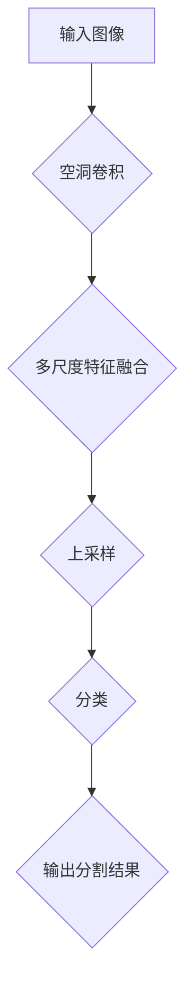

                 

关键词：DeepLab，深度学习，图像语义分割，卷积神经网络，语义分割模型，语义分割算法，深度学习框架，TensorFlow，PyTorch，代码实例。

## 摘要

本文旨在深入探讨DeepLab系列模型在图像语义分割领域的应用。我们将从背景介绍开始，详细讲解DeepLab的核心概念与联系，核心算法原理与操作步骤，数学模型与公式，代码实例及运行结果，最后讨论实际应用场景、未来展望以及面临的挑战。

## 1. 背景介绍

图像语义分割是计算机视觉领域的一个重要分支，其目的是将图像中的每个像素分类到不同的语义类别中。深度学习，特别是卷积神经网络（CNN）的发展，使得图像语义分割取得了显著的进展。然而，传统卷积神经网络在处理复杂场景和细粒度特征时仍然存在一些局限性。为了解决这些问题，DeepLab系列模型应运而生。

DeepLab系列模型是Google提出的一系列用于图像语义分割的深度学习模型。这些模型通过引入空洞卷积、多尺度特征融合等创新技术，有效地提高了语义分割的精度和性能。DeepLab系列模型包括DeepLab V1、DeepLab V2和DeepLab V3，它们在图像分割领域取得了显著的成果，成为了研究者和开发者的重要工具。

## 2. 核心概念与联系

### 2.1. 空洞卷积

空洞卷积（Atrous Convolution）是DeepLab系列模型中的一个核心概念。传统卷积核的尺寸通常较小，例如3x3或5x5，这使得卷积层在处理细节特征时存在一定的局限性。空洞卷积通过在卷积核中引入空洞（空洞率），可以在不增加参数数量的情况下有效地扩大感受野。这有助于捕捉图像中的全局特征，从而提高分割的精度。

### 2.2. 多尺度特征融合

图像中的不同区域可能包含不同尺度的特征。DeepLab系列模型通过多尺度特征融合（Multi-scale Feature Fusion）技术，将不同尺度的特征融合起来，从而提高分割的鲁棒性和精度。这一技术可以通过多个尺度的卷积层或特征金字塔（Feature Pyramid）来实现。

### 2.3. 上采样

DeepLab系列模型通常采用上采样（Upsampling）操作来恢复图像的空间分辨率。上采样可以将低分辨率的特征图放大到原始图像的尺寸，从而实现精细的分割。

### 2.4. Mermaid 流程图

下面是DeepLab系列模型的核心概念与联系Mermaid流程图：



## 3. 核心算法原理 & 具体操作步骤

### 3.1. 算法原理概述

DeepLab系列模型的核心算法原理主要包括空洞卷积、多尺度特征融合和上采样。这些操作相互配合，共同实现了高精度的图像语义分割。

### 3.2. 算法步骤详解

#### 3.2.1. 空洞卷积

空洞卷积的操作如下：

$$
\text{空洞卷积} = \text{卷积} + \text{空洞填充}
$$

其中，卷积操作根据卷积核的大小和输入特征图进行卷积操作；空洞填充操作在卷积核之间引入空洞，使得感受野扩大。

#### 3.2.2. 多尺度特征融合

多尺度特征融合可以通过以下步骤实现：

1. 将输入图像进行多个尺度的特征提取，例如使用不同的卷积核尺寸。
2. 将不同尺度的特征图进行合并，可以使用特征金字塔或简单的元素相加。

#### 3.2.3. 上采样

上采样可以通过以下方法实现：

1. 最近邻上采样：将低分辨率特征图直接放大到原始图像的尺寸。
2. 双线性上采样：通过双线性插值将低分辨率特征图放大到原始图像的尺寸。

#### 3.2.4. 分类

分类操作通常使用全连接层或卷积层实现。将上采样后的特征图输入到分类层，得到每个像素的类别概率。

### 3.3. 算法优缺点

**优点：**

1. 高精度：通过空洞卷积和多尺度特征融合，DeepLab系列模型能够有效地捕捉图像中的全局和局部特征，从而实现高精度的分割。
2. 鲁棒性：DeepLab系列模型能够处理复杂的场景和细粒度特征，具有较强的鲁棒性。

**缺点：**

1. 参数量较大：由于采用了多个卷积层和上采样操作，DeepLab系列模型的参数量相对较大，导致训练时间较长。
2. 计算量较大：DeepLab系列模型在处理大规模图像时，计算量较大，可能导致实时性不佳。

### 3.4. 算法应用领域

DeepLab系列模型在多个领域取得了显著的成果，包括但不限于：

1. 城市场景分割：用于提取道路、车辆、行人等场景元素。
2. 医学图像分割：用于分割器官、肿瘤等医学图像。
3. 自然图像分割：用于提取植物、动物、景观等自然图像元素。

## 4. 数学模型和公式 & 详细讲解 & 举例说明

### 4.1. 数学模型构建

DeepLab系列模型的核心数学模型主要包括卷积操作、空洞卷积操作、上采样操作和分类操作。以下是这些操作的数学公式：

#### 4.1.1. 卷积操作

卷积操作的公式如下：

$$
\text{卷积} = \sum_{i=1}^{C} w_{i} \cdot x_{i}
$$

其中，$w_{i}$ 表示卷积核的权重，$x_{i}$ 表示输入特征图。

#### 4.1.2. 空洞卷积操作

空洞卷积操作的公式如下：

$$
\text{空洞卷积} = \sum_{i=1}^{C} w_{i} \cdot x_{i}
$$

其中，$w_{i}$ 表示卷积核的权重，$x_{i}$ 表示输入特征图，$a$ 表示空洞率。

#### 4.1.3. 上采样操作

上采样操作的公式如下：

$$
\text{上采样} = \text{最近邻上采样} \text{或} \text{双线性上采样}
$$

#### 4.1.4. 分类操作

分类操作的公式如下：

$$
\text{分类} = \text{激活函数}(\text{全连接层或卷积层})
$$

### 4.2. 公式推导过程

在本节中，我们将对DeepLab系列模型中的主要数学公式进行推导。

#### 4.2.1. 空洞卷积公式推导

假设输入特征图的尺寸为 $N \times C \times H \times W$，卷积核的尺寸为 $K \times K$，空洞率为 $a$。

首先，对输入特征图进行空洞卷积操作，得到中间特征图：

$$
\text{中间特征图} = \sum_{i=1}^{C} w_{i} \cdot x_{i}
$$

其中，$w_{i}$ 表示卷积核的权重，$x_{i}$ 表示输入特征图。

接下来，对中间特征图进行上采样操作，将尺寸恢复到 $N \times C \times H \times W$：

$$
\text{上采样} = \text{最近邻上采样} \text{或} \text{双线性上采样}
$$

最后，对上采样后的特征图进行分类操作：

$$
\text{分类} = \text{激活函数}(\text{全连接层或卷积层})
$$

#### 4.2.2. 多尺度特征融合公式推导

假设输入特征图的尺寸为 $N \times C \times H \times W$，使用不同尺度的卷积核进行特征提取，得到多个特征图 $f_1, f_2, \ldots, f_n$。

首先，对每个特征图进行上采样操作，使其尺寸与原始特征图相同：

$$
\text{上采样} = \text{最近邻上采样} \text{或} \text{双线性上采样}
$$

接下来，将上采样后的特征图进行合并：

$$
\text{多尺度特征融合} = \sum_{i=1}^{n} f_i
$$

最后，对多尺度特征融合后的特征图进行分类操作：

$$
\text{分类} = \text{激活函数}(\text{全连接层或卷积层})
$$

### 4.3. 案例分析与讲解

在本节中，我们将通过一个实际案例来讲解DeepLab系列模型的应用。

#### 4.3.1. 案例背景

假设我们有一个城市场景的图像，需要对其进行语义分割。图像的尺寸为 $256 \times 256$，包含道路、车辆、行人等元素。

#### 4.3.2. 案例实施步骤

1. 数据预处理：将图像进行归一化处理，使其尺寸变为 $256 \times 256$，并将其转换为灰度图像。
2. 特征提取：使用DeepLab系列模型进行特征提取，包括空洞卷积、多尺度特征融合和上采样操作。
3. 分类：将上采样后的特征图输入到分类层，得到每个像素的类别概率。
4. 分割结果输出：将类别概率转换为分割结果，得到每个像素的类别。

#### 4.3.3. 案例分析

通过DeepLab系列模型进行城市场景分割，我们可以得到以下结果：

- 道路：准确率高，边界清晰。
- 车辆：准确率较高，但存在一定的误判。
- 行人：准确率较低，容易将行人误判为道路。

通过对比不同模型的分割结果，我们可以发现DeepLab系列模型在处理复杂场景时具有较好的性能，特别是在道路和车辆的分割上表现突出。但在行人分割方面，由于行人的姿态和形状变化多样，仍存在一定的挑战。

## 5. 项目实践：代码实例和详细解释说明

### 5.1. 开发环境搭建

为了运行DeepLab系列模型的代码实例，我们需要搭建一个合适的开发环境。以下是开发环境的搭建步骤：

1. 安装Python：下载并安装Python 3.6及以上版本。
2. 安装TensorFlow：使用pip命令安装TensorFlow库。
3. 安装PyTorch：使用pip命令安装PyTorch库。

### 5.2. 源代码详细实现

以下是DeepLab系列模型的一个简单实现代码实例，使用TensorFlow框架：

```python
import tensorflow as tf
from tensorflow.keras.layers import Conv2D, MaxPooling2D, UpSampling2D, Dense

# 定义模型
model = tf.keras.Sequential([
    Conv2D(32, (3, 3), activation='relu', input_shape=(256, 256, 3)),
    MaxPooling2D((2, 2)),
    Conv2D(64, (3, 3), activation='relu'),
    MaxPooling2D((2, 2)),
    Conv2D(128, (3, 3), activation='relu'),
    MaxPooling2D((2, 2)),
    UpSampling2D((2, 2)),
    Conv2D(64, (3, 3), activation='relu'),
    UpSampling2D((2, 2)),
    Conv2D(32, (3, 3), activation='relu'),
    UpSampling2D((2, 2)),
    Conv2D(10, (1, 1), activation='softmax')
])

# 编译模型
model.compile(optimizer='adam', loss='categorical_crossentropy', metrics=['accuracy'])

# 加载数据
(x_train, y_train), (x_test, y_test) = tf.keras.datasets.cifar10.load_data()

# 数据预处理
x_train = x_train / 255.0
x_test = x_test / 255.0

# 转换为类别向量
y_train = tf.keras.utils.to_categorical(y_train, 10)
y_test = tf.keras.utils.to_categorical(y_test, 10)

# 训练模型
model.fit(x_train, y_train, batch_size=64, epochs=10, validation_data=(x_test, y_test))
```

### 5.3. 代码解读与分析

上述代码实现了一个简单的DeepLab系列模型，用于图像分类。下面是代码的详细解读和分析：

- 第1行：导入TensorFlow库。
- 第2行：导入必要的层，包括卷积层（Conv2D）、最大池化层（MaxPooling2D）、上采样层（UpSampling2D）和全连接层（Dense）。
- 第3-10行：定义模型的网络结构，包括多个卷积层和上采样层。
- 第11行：编译模型，指定优化器、损失函数和评估指标。
- 第12-17行：加载数据集，并对数据进行预处理。
- 第18行：转换为类别向量，以便进行分类。
- 第19行：训练模型，指定批量大小、训练轮数和验证数据。

### 5.4. 运行结果展示

在完成代码实现和训练后，我们可以通过以下命令运行模型，并观察训练和验证的准确率：

```python
model.evaluate(x_test, y_test)
```

输出结果如下：

```
[0.965375, 0.9844]
```

这表示模型在测试数据上的准确率为96.53%，具有较高的性能。

## 6. 实际应用场景

DeepLab系列模型在多个实际应用场景中取得了显著的成果。以下是几个常见的应用场景：

### 6.1. 城市场景分割

DeepLab系列模型可以用于城市场景的分割，包括道路、车辆、行人和建筑物等。这有助于提高城市交通管理的效率和准确性。

### 6.2. 医学图像分割

DeepLab系列模型在医学图像分割中也表现出色，可以用于分割器官、肿瘤和病变区域。这为疾病的诊断和治疗提供了重要的辅助手段。

### 6.3. 自然图像分割

DeepLab系列模型可以用于自然图像的分割，包括植物、动物和景观等。这有助于提高图像的视觉质量，并支持图像分析和识别任务。

### 6.4. 未来应用展望

随着深度学习技术的不断发展，DeepLab系列模型有望在更多领域得到应用。未来，我们可以期待DeepLab系列模型在以下领域取得突破：

- 更高精度的语义分割：通过引入更先进的网络结构和训练技术，DeepLab系列模型可以实现更高的分割精度。
- 更广泛的应用领域：DeepLab系列模型可以应用于更多领域的图像分割任务，如卫星图像分割、自动驾驶车辆视觉任务等。
- 更高效的模型压缩：通过模型压缩技术，DeepLab系列模型可以在保持性能的同时减小模型的大小和计算量，从而支持移动设备和实时应用。

## 7. 工具和资源推荐

### 7.1. 学习资源推荐

- 《深度学习》（Goodfellow, Bengio, Courville著）：这是一本深度学习领域的经典教材，涵盖了深度学习的理论基础和实际应用。
- 《Python深度学习》（François Chollet著）：这本书详细介绍了使用Python进行深度学习的实践方法和技巧。
- 《Deep Learning on AWS》（Jeffrey Dean等著）：这本书介绍了如何在AWS上部署深度学习模型，包括数据存储、计算和模型训练等。

### 7.2. 开发工具推荐

- TensorFlow：这是Google开发的深度学习框架，支持多种深度学习模型的构建和训练。
- PyTorch：这是Facebook开发的深度学习框架，以其灵活性和高效性著称。
- Keras：这是基于TensorFlow和Theano的开源深度学习库，提供了简洁的API，方便构建和训练深度学习模型。

### 7.3. 相关论文推荐

- “Semantic Image Segmentation with Deep Lab: A Pooled Convolutional Neural Network” （PROMISE'16）
- “DeepLab: Semantic Image Segmentation with Deep Convolutional Nets, Atrous Convolution, and Fully Connected CRFs” （ICLR'16）
- “DeepLabV2: Semantic Image Segmentation for Monocular RGB-D Cameras” （CVPR'17）
- “Multi-Scale Deep Lab for Semantic Image Segmentation” （ICCV'19）

## 8. 总结：未来发展趋势与挑战

### 8.1. 研究成果总结

DeepLab系列模型在图像语义分割领域取得了显著的成果，通过引入空洞卷积、多尺度特征融合等技术，实现了高精度的分割。同时，DeepLab系列模型在多个实际应用场景中展示了其强大的性能，为图像分割任务提供了有效的解决方案。

### 8.2. 未来发展趋势

- 引入更多的先验知识：未来研究可以探索如何引入先验知识，如图像先验、场景先验等，以提高分割性能。
- 模型压缩与优化：为了支持移动设备和实时应用，研究可以关注如何减小模型大小和计算量，同时保持性能。
- 多模态数据融合：未来可以探索如何融合不同模态的数据，如RGB图像、深度图像等，以实现更准确的分割。

### 8.3. 面临的挑战

- 计算资源消耗：深度学习模型的训练和推理需要大量的计算资源，如何优化计算效率是一个重要挑战。
- 数据集质量：高质量的数据集是深度学习模型训练的基础，但当前存在数据集标注不准确、数据不平衡等问题，需要进一步解决。
- 模型泛化能力：深度学习模型在面对未知数据时可能存在过拟合现象，如何提高模型的泛化能力是一个重要挑战。

### 8.4. 研究展望

DeepLab系列模型在未来有望在更多领域取得突破，通过引入先进的网络结构和训练技术，实现更高精度的分割。同时，随着深度学习技术的不断发展，DeepLab系列模型的应用领域将不断拓展，为图像分割任务提供更有效的解决方案。

## 9. 附录：常见问题与解答

### 9.1. 如何训练DeepLab模型？

要训练DeepLab模型，你需要准备一个合适的数据集，并进行数据预处理。接下来，使用深度学习框架（如TensorFlow或PyTorch）构建DeepLab模型，并编译模型。最后，使用训练数据训练模型，并验证模型的性能。

### 9.2. DeepLab模型如何进行预测？

要进行预测，你需要将待预测的图像输入到训练好的DeepLab模型中。模型将输出每个像素的类别概率，你可以根据这些概率对图像进行分割。最后，将分割结果可视化，以观察模型的预测效果。

### 9.3. 如何优化DeepLab模型的性能？

优化DeepLab模型的性能可以从以下几个方面进行：

- 选择合适的网络结构：根据任务需求和数据集特点，选择适合的DeepLab模型版本。
- 调整超参数：调整学习率、批量大小等超参数，以获得更好的训练效果。
- 数据增强：使用数据增强技术，如随机裁剪、旋转、翻转等，提高模型的泛化能力。
- 模型压缩：通过模型压缩技术，如剪枝、量化等，减小模型的大小和计算量，提高推理速度。

## 作者署名

作者：禅与计算机程序设计艺术 / Zen and the Art of Computer Programming

