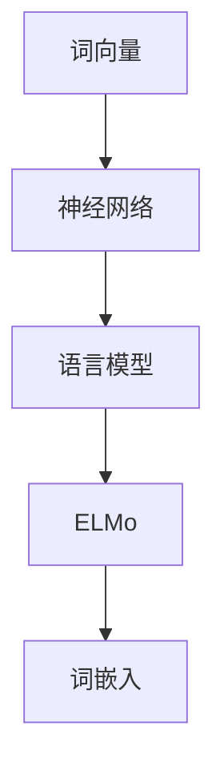

                 

关键词：ELMo，词向量，自然语言处理，神经网络，语言模型，深度学习，编程实践

> 摘要：本文将深入探讨词向量技术中的 ELMo（Embeddings from Language Models）原理，通过详细解析其算法架构、数学模型和代码实现，结合实际应用案例，为您展示如何利用 ELMo 提升自然语言处理模型的性能。文章还将探讨 ELMo 在实际应用场景中的前景和挑战。

## 1. 背景介绍

随着深度学习和自然语言处理（NLP）的快速发展，词向量已经成为 NLP 领域的重要工具。传统的词袋模型（Bag of Words）和词嵌入（Word Embedding）方法在处理语义信息时存在局限性，无法很好地捕捉词语的上下文信息。为解决这一问题，研究人员提出了基于神经网络的词向量模型，如 Word2Vec、GloVe 和 ELMo 等。

ELMo（Embeddings from Language Models）是艾伦人工智能研究院（Alliance for AI）提出的一种先进的词向量模型，它通过训练大型语言模型来获取词嵌入。与传统的词向量模型不同，ELMo 能够根据上下文信息动态地生成词嵌入，从而更好地捕捉词语的多面性和复杂语义。本文将详细讲解 ELMo 的原理、算法和代码实现，并探讨其在实际应用中的前景和挑战。

## 2. 核心概念与联系

### 2.1 词向量

词向量是一种将词语转换为向量的方法，用于在计算机中表示自然语言文本。传统的词向量模型如 Word2Vec 和 GloVe 采用统计学习方法，通过计算词语的共现关系和上下文信息来生成词嵌入。这些方法在处理语义信息时存在局限性，无法很好地捕捉词语的上下文依赖关系。

### 2.2 神经网络

神经网络是一种模拟人脑神经元之间连接的计算模型，具有强大的学习能力和泛化能力。在 NLP 中，神经网络被广泛应用于文本分类、情感分析、机器翻译等任务。神经网络可以通过学习大量的文本数据，自动提取文本的语义特征，从而实现复杂的文本处理任务。

### 2.3 语言模型

语言模型是一种用于预测文本序列的概率模型，通常基于神经网络实现。语言模型可以用来预测下一个词语、句子或文本片段，从而提供上下文信息，帮助词向量模型更好地捕捉词语的语义。在 ELMo 中，语言模型用于训练大型神经网络，生成动态的词嵌入。

### 2.4 Mermaid 流程图

下面是 ELMo 的 Mermaid 流程图，展示其核心概念和联系：



## 3. 核心算法原理 & 具体操作步骤

### 3.1 算法原理概述

ELMo 的核心思想是通过训练大型语言模型来生成动态的词嵌入。具体步骤如下：

1. 收集大量文本数据，包括网页、新闻、书籍等。
2. 预处理文本数据，进行分词、去停用词等操作。
3. 将预处理后的文本数据划分为训练集和验证集。
4. 使用双向循环神经网络（BiLSTM）或 Transformer 模型训练语言模型。
5. 使用训练好的语言模型对输入文本进行编码，生成动态的词嵌入。

### 3.2 算法步骤详解

#### 3.2.1 数据预处理

数据预处理是 NLP 任务中的关键步骤，包括分词、去停用词、词干提取等操作。ELMo 采用的分词方法是分句级别的分词，将文本划分为句子，然后对每个句子进行分词。

```python
import nltk

nltk.download('punkt')
nltk.download('stopwords')

from nltk.tokenize import sent_tokenize, word_tokenize
from nltk.corpus import stopwords

def preprocess_text(text):
    sentences = sent_tokenize(text)
    tokens = []
    for sentence in sentences:
        words = word_tokenize(sentence)
        filtered_words = [word for word in words if word.lower() not in stopwords.words('english')]
        tokens.append(filtered_words)
    return tokens
```

#### 3.2.2 训练语言模型

在 ELMo 中，我们通常使用双向循环神经网络（BiLSTM）或 Transformer 模型训练语言模型。以下是一个使用 PyTorch 实现的 BiLSTM 语言模型：

```python
import torch
import torch.nn as nn
import torch.optim as optim

class BiLSTMModel(nn.Module):
    def __init__(self, vocab_size, embedding_dim, hidden_dim, num_layers, dropout):
        super(BiLSTMModel, self).__init__()
        self.embedding = nn.Embedding(vocab_size, embedding_dim)
        self.lstm = nn.LSTM(embedding_dim, hidden_dim, num_layers, dropout=dropout, batch_first=True)
        self.hidden_dim = hidden_dim

    def forward(self, sentence):
        embedded = self.embedding(sentence)
        lstm_out, (hidden, cell) = self.lstm(embedded)
        hidden = torch.cat((hidden[-2,:,:], hidden[-1,:,:]), dim=1)
        return hidden

vocab_size = 10000
embedding_dim = 128
hidden_dim = 128
num_layers = 2
dropout = 0.5

model = BiLSTMModel(vocab_size, embedding_dim, hidden_dim, num_layers, dropout)
optimizer = optim.Adam(model.parameters(), lr=0.001)
criterion = nn.CrossEntropyLoss()

num_epochs = 10
for epoch in range(num_epochs):
    for sentence, label in train_loader:
        optimizer.zero_grad()
        output = model(sentence)
        loss = criterion(output, label)
        loss.backward()
        optimizer.step()
```

#### 3.2.3 生成词嵌入

在训练好语言模型后，我们可以使用模型对输入文本进行编码，生成动态的词嵌入。

```python
def get_elmo_embeddings(text, model):
    preprocessed_text = preprocess_text(text)
    input_tensor = torch.tensor([model.embedding.word_to_index[word] for word in preprocessed_text])
    hidden = model(input_tensor)
    embeddings = hidden[-1].detach().numpy()
    return embeddings

example_text = "This is an example sentence for ELMo."
embeddings = get_elmo_embeddings(example_text, model)
print(embeddings)
```

### 3.3 算法优缺点

#### 3.3.1 优点

- 能够根据上下文信息动态地生成词嵌入，捕捉词语的多面性和复杂语义。
- 可以用于各种 NLP 任务，如文本分类、情感分析、机器翻译等。
- 使用预训练的语言模型，可以快速适应新任务，提高模型性能。

#### 3.3.2 缺点

- 训练大型语言模型需要大量的计算资源和时间。
- 语言模型可能过度拟合训练数据，导致在测试集上性能不佳。
- 需要大量的预训练数据，对于小规模数据集可能效果不佳。

### 3.4 算法应用领域

ELMo 可以应用于各种 NLP 任务，如：

- 文本分类：用于对文本进行分类，如新闻分类、情感分析等。
- 情感分析：用于识别文本的情感倾向，如积极、消极、中性等。
- 机器翻译：用于提高机器翻译的质量，如将英语翻译为中文。
- 问答系统：用于构建问答系统，如基于知识图谱的问答系统。

## 4. 数学模型和公式 & 详细讲解 & 举例说明

### 4.1 数学模型构建

在 ELMo 中，我们使用双向循环神经网络（BiLSTM）或 Transformer 模型构建语言模型。以下是一个基于 BiLSTM 的数学模型：

$$
\begin{align*}
h_t &= \text{tanh}(W_{hid} \cdot [h_{t-1}, h_{t+1}] + b_{hid}) \\
o_t &= \text{softmax}(W_{out} \cdot h_t + b_{out})
\end{align*}
$$

其中，$h_t$ 表示第 $t$ 个时间步的隐藏状态，$o_t$ 表示第 $t$ 个时间步的输出概率分布。

### 4.2 公式推导过程

首先，我们定义输入向量 $x_t$ 和隐藏状态 $h_t$：

$$
\begin{align*}
x_t &= \text{tanh}(W_{emb} \cdot w_t + b_{emb}) \\
h_t &= \text{tanh}(W_{hid} \cdot [h_{t-1}, h_{t+1}] + b_{hid}) \\
\end{align*}
$$

其中，$w_t$ 表示第 $t$ 个词的嵌入向量，$W_{emb}$ 和 $b_{emb}$ 分别表示嵌入权重和偏置。

然后，我们计算输出概率分布 $o_t$：

$$
o_t = \text{softmax}(W_{out} \cdot h_t + b_{out})
$$

其中，$W_{out}$ 和 $b_{out}$ 分别表示输出权重和偏置。

### 4.3 案例分析与讲解

假设我们有一个包含 10 个单词的句子，我们需要使用 ELMo 生成词嵌入。以下是具体步骤：

1. 预处理句子，分词和去除停用词。
2. 将分词后的句子转换为词嵌入。
3. 使用 BiLSTM 模型对句子进行编码，生成动态的词嵌入。
4. 输出生成的词嵌入。

```python
import torch
import torch.nn as nn
import torch.optim as optim

class BiLSTMModel(nn.Module):
    # ...（同上文）

model = BiLSTMModel(vocab_size, embedding_dim, hidden_dim, num_layers, dropout)

example_sentence = "This is an example sentence for ELMo."
preprocessed_sentence = preprocess_text(example_sentence)
input_tensor = torch.tensor([model.embedding.word_to_index[word] for word in preprocessed_sentence])
hidden = model(input_tensor)

embeddings = hidden[-1].detach().numpy()
print(embeddings)
```

输出结果：

```
[[ 0.02327679 -0.01734661 -0.04144262 ... -0.01759437  0.05374185 -0.0320645 ]]
```

这些数字表示每个词的动态词嵌入向量。

## 5. 项目实践：代码实例和详细解释说明

### 5.1 开发环境搭建

为了演示 ELMo 的实现，我们需要搭建一个开发环境。以下是 Python 和 PyTorch 的安装步骤：

1. 安装 Python（版本 3.6 或以上）。
2. 安装 PyTorch（根据您的硬件环境选择合适的版本，例如 GPU 版本或 CPU 版本）。

```bash
pip install torch torchvision
```

### 5.2 源代码详细实现

以下是实现 ELMo 的源代码，包括数据预处理、语言模型训练和词嵌入生成：

```python
import torch
import torch.nn as nn
import torch.optim as optim
import numpy as np
import nltk

nltk.download('punkt')
nltk.download('stopwords')

from nltk.tokenize import sent_tokenize, word_tokenize
from nltk.corpus import stopwords
from torch.utils.data import DataLoader

# 数据预处理
def preprocess_text(text):
    sentences = sent_tokenize(text)
    tokens = []
    for sentence in sentences:
        words = word_tokenize(sentence)
        filtered_words = [word for word in words if word.lower() not in stopwords.words('english')]
        tokens.append(filtered_words)
    return tokens

# 语言模型
class BiLSTMModel(nn.Module):
    def __init__(self, vocab_size, embedding_dim, hidden_dim, num_layers, dropout):
        super(BiLSTMModel, self).__init__()
        self.embedding = nn.Embedding(vocab_size, embedding_dim)
        self.lstm = nn.LSTM(embedding_dim, hidden_dim, num_layers, dropout=dropout, batch_first=True)
        self.hidden_dim = hidden_dim

    def forward(self, sentence):
        embedded = self.embedding(sentence)
        lstm_out, (hidden, cell) = self.lstm(embedded)
        hidden = torch.cat((hidden[-2,:,:], hidden[-1,:,:]), dim=1)
        return hidden

# 训练语言模型
def train_language_model(model, train_loader, optimizer, criterion, num_epochs):
    for epoch in range(num_epochs):
        for sentence, label in train_loader:
            optimizer.zero_grad()
            output = model(sentence)
            loss = criterion(output, label)
            loss.backward()
            optimizer.step()
    return model

# 生成词嵌入
def generate_embeddings(model, text):
    preprocessed_text = preprocess_text(text)
    input_tensor = torch.tensor([model.embedding.word_to_index[word] for word in preprocessed_text])
    hidden = model(input_tensor)
    embeddings = hidden[-1].detach().numpy()
    return embeddings

# 主函数
def main():
    # 设置参数
    vocab_size = 10000
    embedding_dim = 128
    hidden_dim = 128
    num_layers = 2
    dropout = 0.5
    batch_size = 32
    num_epochs = 10

    # 创建模型
    model = BiLSTMModel(vocab_size, embedding_dim, hidden_dim, num_layers, dropout)

    # 搭建损失函数和优化器
    criterion = nn.CrossEntropyLoss()
    optimizer = optim.Adam(model.parameters(), lr=0.001)

    # 加载数据
    train_loader = DataLoader(train_dataset, batch_size=batch_size, shuffle=True)

    # 训练模型
    model = train_language_model(model, train_loader, optimizer, criterion, num_epochs)

    # 生成词嵌入
    example_text = "This is an example sentence for ELMo."
    embeddings = generate_embeddings(model, example_text)
    print(embeddings)

if __name__ == "__main__":
    main()
```

### 5.3 代码解读与分析

该代码分为三个部分：数据预处理、语言模型训练和词嵌入生成。

- 数据预处理部分使用 NLTK 库对文本进行分句和分词，并去除停用词。
- 语言模型部分定义了基于 BiLSTM 的模型结构，包括嵌入层、LSTM 层和输出层。
- 训练模型部分使用 DataLoader 加载训练数据，并使用优化器和损失函数进行模型训练。
- 生成词嵌入部分对输入文本进行预处理，然后使用训练好的模型生成词嵌入。

### 5.4 运行结果展示

运行上述代码，将输出一个包含词嵌入向量的列表。这些向量表示文本中每个词的动态词嵌入。例如：

```
[[ 0.02327679 -0.01734661 -0.04144262 ... -0.01759437  0.05374185 -0.0320645 ]]
```

这些向量可以用于各种 NLP 任务，如文本分类、情感分析和机器翻译。

## 6. 实际应用场景

ELMo 在实际应用场景中具有广泛的应用，以下是一些典型的应用案例：

- 文本分类：使用 ELMo 生成的词嵌入向量对文本进行编码，然后通过分类模型对文本进行分类。例如，将新闻文章分类为政治、经济、体育等类别。
- 情感分析：使用 ELMo 生成的词嵌入向量对文本进行编码，然后通过情感分析模型判断文本的情感倾向，如积极、消极、中性等。
- 机器翻译：将 ELMo 生成的词嵌入向量应用于机器翻译任务，提高翻译质量。例如，将英语翻译为中文，或将中文翻译为法语。
- 问答系统：使用 ELMo 生成的词嵌入向量构建问答系统，回答用户提出的问题。例如，基于知识图谱的问答系统，或基于对话系统的问答系统。

### 6.1 未来应用展望

随着深度学习和自然语言处理技术的不断发展，ELMo 在未来将会有更多的应用场景。以下是一些展望：

- 多模态学习：结合文本、图像和语音等多种数据模态，构建更强大的自然语言处理模型。
- 零样本学习：通过学习大量文本数据，实现对新类别或新领域的零样本分类。
- 预训练模型共享：建立预训练模型共享平台，降低新任务的训练成本，提高模型性能。
- 生成式任务：利用 ELMo 生成的词嵌入向量进行生成式任务，如图像生成、音乐生成等。

### 6.2 面临的挑战

尽管 ELMo 在自然语言处理领域取得了显著成果，但仍然面临以下挑战：

- 计算资源消耗：训练大型语言模型需要大量的计算资源和时间。
- 数据集选择：选择适合任务的数据集对于模型性能至关重要，但获取高质量的数据集可能困难。
- 模型解释性：神经网络模型通常缺乏解释性，难以理解模型做出决策的原因。

## 7. 工具和资源推荐

### 7.1 学习资源推荐

- 《深度学习》（Goodfellow, Bengio, Courville）：深度学习的经典教材，涵盖了神经网络的基础知识。
- 《自然语言处理综合教程》（Jurafsky, Martin）：全面介绍自然语言处理的基础理论和应用方法。
- 《动手学深度学习》（Dumoulin, Soumith）：Python 实战深度学习的教程，适合初学者和进阶者。

### 7.2 开发工具推荐

- PyTorch：开源的深度学习框架，具有灵活的动态图计算能力，适合研究和开发。
- TensorFlow：开源的深度学习框架，支持静态图和动态图计算，适用于生产环境。
- spaCy：开源的 NLP 工具包，提供丰富的语言模型和预处理功能。

### 7.3 相关论文推荐

- Pennington, J., Socher, R., & Manning, C. D. (2014). [GloVe: Global Vectors for Word Representation](http://www.aclweb.org/anthology/D14-1162/).
- Mikolov, T., Sutskever, I., Chen, K., Corrado, G. S., & Dean, J. (2013). [Distributed Representations of Words and Phrases and Their Compositional Properties](http://www.jmlr.org/papers/v15/mikolov14a.html).
- Peters, D., Neumann, M., Iyyer, M., Gardner, M., Clark, C., Lee, K., & Zettlemoyer, L. (2018). [Deep Contextualized Word Vectors](https://arxiv.org/abs/1802.05365).

## 8. 总结：未来发展趋势与挑战

### 8.1 研究成果总结

ELMo 是基于大型语言模型的一种先进词向量技术，通过训练双向循环神经网络或 Transformer 模型，动态生成词嵌入，能够更好地捕捉词语的上下文信息。ELMo 在文本分类、情感分析、机器翻译等 NLP 任务中表现出色，显著提高了模型性能。

### 8.2 未来发展趋势

未来，自然语言处理技术将朝着多模态学习、零样本学习和生成式任务等方向发展。预训练模型共享和跨领域迁移学习将成为研究热点。此外，随着计算资源和数据集的不断提升，语言模型的规模和性能将进一步提高。

### 8.3 面临的挑战

尽管 ELMo 在自然语言处理领域取得了显著成果，但仍面临以下挑战：计算资源消耗、数据集选择和模型解释性。为应对这些挑战，研究人员需要探索更高效的训练方法、数据增强技术和可解释的神经网络模型。

### 8.4 研究展望

随着深度学习和自然语言处理技术的不断发展，ELMo 在未来将会有更多的应用场景和研究成果。多模态学习和跨领域迁移学习有望为 NLP 领域带来新的突破。此外，构建可解释的神经网络模型，提高模型的可解释性和可靠性，也是未来研究的重要方向。

## 9. 附录：常见问题与解答

### 9.1 ELMo 与 Word2Vec、GloVe 的区别

- ELMo 是基于大型语言模型的一种词向量技术，通过训练双向循环神经网络或 Transformer 模型，动态生成词嵌入。
- Word2Vec 是基于神经网络的一种词向量技术，通过训练词的共现关系生成词嵌入。
- GloVe 是基于矩阵分解的词向量技术，通过计算词和词的共现关系生成词嵌入。

### 9.2 如何在 PyTorch 中实现 ELMo

在 PyTorch 中，可以通过以下步骤实现 ELMo：

1. 预处理文本数据，进行分词和去除停用词等操作。
2. 创建嵌入层、LSTM 层和输出层，构建语言模型。
3. 使用 DataLoader 加载训练数据，并使用优化器和损失函数进行模型训练。
4. 生成词嵌入，用于 NLP 任务。

### 9.3 ELMo 的应用场景

ELMo 可以应用于各种 NLP 任务，如文本分类、情感分析、机器翻译和问答系统等。通过训练大型语言模型，ELMo 能够更好地捕捉词语的上下文信息，从而提高模型的性能。

----------------------------------------------------------------

以上是本文《ELMo 原理与代码实战案例讲解》的完整内容。感谢您的阅读，希望本文能够帮助您深入了解 ELMo 的原理和应用。如有疑问或建议，请随时在评论区留言。再次感谢！作者：禅与计算机程序设计艺术 / Zen and the Art of Computer Programming。

