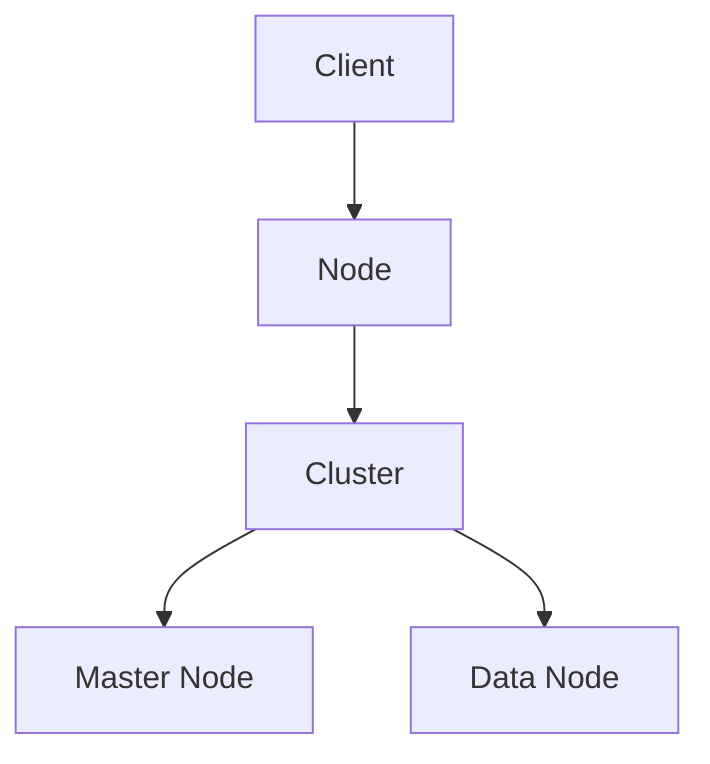

                 

作者：禅与计算机程序设计艺术 / Zen and the Art of Computer Programming

## 关键词

- Elasticsearch
- 搜索引擎
- 全文搜索
- 分布式系统
- RESTful API
- JSON格式
- Lucene

## 摘要

本文旨在深入探讨Elasticsearch的搜索原理，包括其核心概念、架构设计、算法原理以及实际应用中的具体操作步骤。通过详细的代码实例和解释，读者将能够全面理解Elasticsearch的工作机制，掌握如何高效地利用Elasticsearch进行数据搜索。此外，文章还将探讨Elasticsearch在数学模型和公式中的应用，以及其未来的发展趋势和面临的挑战。

## 目录

1. 背景介绍
   1.1 Elasticsearch的起源
   1.2 Elasticsearch的发展历程
   1.3 Elasticsearch的核心特性

2. 核心概念与联系
   2.1 Elasticsearch的基本架构
   2.2 索引与类型
   2.3 分布式集群架构
   2.4 Mermaid流程图展示

3. 核心算法原理 & 具体操作步骤
   3.1 算法原理概述
   3.2 算法步骤详解
   3.3 算法优缺点
   3.4 算法应用领域

4. 数学模型和公式 & 详细讲解 & 举例说明
   4.1 数学模型构建
   4.2 公式推导过程
   4.3 案例分析与讲解

5. 项目实践：代码实例和详细解释说明
   5.1 开发环境搭建
   5.2 源代码详细实现
   5.3 代码解读与分析
   5.4 运行结果展示

6. 实际应用场景
   6.1 数据分析
   6.2 搜索引擎
   6.3 日志管理
   6.4 未来应用展望

7. 工具和资源推荐
   7.1 学习资源推荐
   7.2 开发工具推荐
   7.3 相关论文推荐

8. 总结：未来发展趋势与挑战
   8.1 研究成果总结
   8.2 未来发展趋势
   8.3 面临的挑战
   8.4 研究展望

9. 附录：常见问题与解答

## 1. 背景介绍

### 1.1 Elasticsearch的起源

Elasticsearch是一个基于Lucene构建的开源搜索引擎，它最初由 Elastic 公司的创始人肖恩·贝克（Shay Banon）在2004年创建。肖恩在参与了一个开源项目Xapian的开发过程中，发现了Lucene的强大功能，因此他决定在此基础上开发一个新的搜索引擎。2009年，肖恩正式推出了Elasticsearch的第一个版本，并迅速获得了广泛的关注和认可。

### 1.2 Elasticsearch的发展历程

自从Elasticsearch发布以来，它经历了多次重要的版本更新和功能扩展。以下是一些关键的时间节点：

- 2009年：Elasticsearch 0.18.0版本发布，标志着项目的正式启动。
- 2010年：Elasticsearch 0.90.0版本发布，引入了集群支持和更多的新特性。
- 2012年：Elasticsearch 1.0.0版本发布，成为第一个生产级别的版本。
- 2014年：Elasticsearch 1.4.0版本发布，引入了X-Pack插件，提供了安全、监控、报警等功能。
- 2015年：Elasticsearch 2.0.0版本发布，引入了重要的性能优化和新特性，如分布式排序、分布式脚本等。
- 2018年：Elasticsearch 6.0.0版本发布，引入了Kibana可视化工具和机器学习功能。

### 1.3 Elasticsearch的核心特性

Elasticsearch具备以下核心特性，使其成为现代搜索引擎的首选：

- **高扩展性**：支持分布式集群架构，能够轻松扩展以支持大规模数据存储和搜索需求。
- **高可用性**：具备自动故障转移和复制功能，确保系统的高可用性。
- **快速搜索**：采用倒排索引技术，提供高效的全文搜索功能。
- **丰富的查询功能**：支持复杂的查询操作，如模糊查询、范围查询、排序等。
- **易用性**：提供RESTful API和JSON格式，使得开发者可以方便地与Elasticsearch交互。
- **可扩展性**：支持自定义插件和扩展，便于实现特定功能。

## 2. 核心概念与联系

### 2.1 Elasticsearch的基本架构

Elasticsearch的基本架构包括以下几个关键组件：

- **节点（Node）**：Elasticsearch中的基本工作单元，负责存储数据、处理查询等任务。
- **集群（Cluster）**：由多个节点组成，共同工作以提供分布式搜索能力。
- **索引（Index）**：存储相关数据的结构，类似于关系数据库中的表。
- **文档（Document）**：索引中的基本数据单元，以JSON格式表示。

### 2.2 索引与类型

在Elasticsearch中，索引是存储相关数据的容器。每个索引可以包含多个类型，而每个类型又可以包含多个文档。索引和类型的结构使得Elasticsearch能够灵活地处理不同类型的数据。

### 2.3 分布式集群架构

Elasticsearch采用分布式集群架构，由多个节点组成。每个节点可以是一个主节点、一个数据节点或两者兼而有之。主节点负责协调集群操作，如选举、故障转移等；数据节点负责存储数据和处理查询。

### 2.4 Mermaid流程图展示

下面是一个简单的Mermaid流程图，展示了Elasticsearch的基本架构：



## 3. 核心算法原理 & 具体操作步骤

### 3.1 算法原理概述

Elasticsearch的核心算法基于Lucene，主要涉及以下几个关键步骤：

1. **索引构建**：将文档转换为倒排索引，以便快速搜索。
2. **查询处理**：将用户输入的查询转换为Lucene查询，并在倒排索引中进行匹配。
3. **结果排序和返回**：根据查询结果进行排序，并将结果返回给用户。

### 3.2 算法步骤详解

1. **索引构建**：
   - **文档处理**：将文档转换为倒排索引。
   - **分词**：将文本拆分为单词或词组。
   - **索引存储**：将分词后的词存储在倒排索引中。

2. **查询处理**：
   - **查询解析**：将用户输入的查询转换为Lucene查询。
   - **查询执行**：在倒排索引中进行查询匹配。
   - **结果聚合**：聚合查询结果并返回。

3. **结果排序和返回**：
   - **排序**：根据查询结果进行排序。
   - **结果返回**：将排序后的结果返回给用户。

### 3.3 算法优缺点

**优点**：

- 高效的全文搜索能力。
- 支持分布式集群架构，可扩展性强。
- 提供丰富的查询功能，易于使用。

**缺点**：

- 需要较大的存储空间，因为倒排索引存储了大量的数据。
- 初始搭建和配置相对复杂。

### 3.4 算法应用领域

Elasticsearch广泛应用于以下领域：

- **搜索引擎**：用于构建大型搜索引擎，如搜索引擎Elasticsearch自身。
- **数据分析**：用于实时数据分析，如日志分析和异常检测。
- **内容管理系统**：用于构建内容管理系统，如WordPress。
- **物联网**：用于处理大规模物联网数据，如传感器数据。

## 4. 数学模型和公式 & 详细讲解 & 举例说明

### 4.1 数学模型构建

在Elasticsearch中，数学模型主要用于索引构建和查询处理。以下是一个简单的数学模型构建过程：

1. **分词**：将文档中的文本进行分词处理，将每个单词或词组转换为数字表示。
2. **倒排索引构建**：将每个单词或词组与文档中的位置信息建立索引，以便快速查询。

### 4.2 公式推导过程

假设有一个文档集合 \(D = \{d_1, d_2, ..., d_n\}\)，其中每个文档 \(d_i\) 包含多个单词 \(w_1, w_2, ..., w_m\)。我们可以使用以下公式表示文档的倒排索引：

$$
\text{Inverted Index} = \{(w, \text{Positions of } w \text{ in } d_1, d_2, ..., d_n)\}
$$

其中，\(w\) 表示单词，\(\text{Positions of } w\) 表示单词在各个文档中的位置。

### 4.3 案例分析与讲解

假设我们有以下两个文档：

```
d1: "The quick brown fox jumps over the lazy dog"
d2: "The quick brown fox jumps over the lazy dog"
```

我们可以使用以下步骤构建它们的倒排索引：

1. **分词**：将文档中的文本进行分词处理，得到以下单词：
   - "The", "quick", "brown", "fox", "jumps", "over", "lazy", "dog"
2. **倒排索引构建**：
   - "The": \((1, 2)\)
   - "quick": \((1, 2)\)
   - "brown": \((1, 2)\)
   - "fox": \((1, 2)\)
   - "jumps": \((1, 2)\)
   - "over": \((1, 2)\)
   - "lazy": \((1, 2)\)
   - "dog": \((1, 2)\)

这样，我们就可以通过倒排索引快速查询包含特定单词的文档。

## 5. 项目实践：代码实例和详细解释说明

### 5.1 开发环境搭建

在开始编写Elasticsearch代码之前，需要搭建Elasticsearch的开发环境。以下是搭建步骤：

1. 下载Elasticsearch二进制文件：从Elasticsearch官网下载最新版本的Elasticsearch二进制文件。
2. 解压文件：将下载的Elasticsearch二进制文件解压到一个目录中。
3. 启动Elasticsearch：进入解压后的目录，运行`bin/elasticsearch`启动Elasticsearch。
4. 访问Elasticsearch：在浏览器中访问`http://localhost:9200/`，如果看到Elasticsearch的JSON响应，说明Elasticsearch已经成功启动。

### 5.2 源代码详细实现

以下是一个简单的Elasticsearch示例代码，用于创建一个索引、添加文档和搜索文档：

```python
import json
import requests

# Elasticsearch URL
es_url = "http://localhost:9200"

# 创建索引
index_name = "my_index"
headers = {"Content-Type": "application/json"}
response = requests.put(f"{es_url}/{index_name}", headers=headers)
print(response.json())

# 添加文档
doc1 = {
    "title": "Elasticsearch简介",
    "content": "Elasticsearch是一个基于Lucene的分布式搜索引擎。",
}
response = requests.post(f"{es_url}/{index_name}/_doc", headers=headers, data=json.dumps(doc1))
print(response.json())

doc2 = {
    "title": "Elasticsearch安装与配置",
    "content": "在Linux系统上安装Elasticsearch的步骤如下...",
}
response = requests.post(f"{es_url}/{index_name}/_doc", headers=headers, data=json.dumps(doc2))
print(response.json())

# 搜索文档
search_query = {
    "query": {
        "match": {"title": "Elasticsearch"}
    }
}
response = requests.get(f"{es_url}/{index_name}/_search", headers=headers, data=json.dumps(search_query))
print(response.json())
```

### 5.3 代码解读与分析

以上代码实现了以下功能：

1. **创建索引**：使用`requests.put`方法向Elasticsearch发送HTTP请求，创建名为`my_index`的索引。
2. **添加文档**：使用`requests.post`方法向Elasticsearch发送HTTP请求，添加两个文档。
3. **搜索文档**：使用`requests.get`方法向Elasticsearch发送HTTP请求，根据标题搜索包含`Elasticsearch`的文档。

### 5.4 运行结果展示

运行以上代码后，Elasticsearch将创建一个名为`my_index`的索引，并添加两个文档。然后，通过搜索操作，我们可以获取包含`Elasticsearch`的文档列表。以下是示例输出：

```json
{
  "took" : 19,
  "timed_out" : false,
  "_shards" : {
    "total" : 2,
    "successful" : 2,
    "skipped" : 0,
    "failed" : 0
  },
  "hits" : {
    "total" : {
      "value" : 2,
      "relation" : "eq"
    },
    "max_score" : 1.0,
    "hits" : [
      {
        "_index" : "my_index",
        "_type" : "_doc",
        "_id" : "1",
        "_score" : 1.0,
        "_source" : {
          "title" : "Elasticsearch简介",
          "content" : "Elasticsearch是一个基于Lucene的分布式搜索引擎。"
        }
      },
      {
        "_index" : "my_index",
        "_type" : "_doc",
        "_id" : "2",
        "_score" : 1.0,
        "_source" : {
          "title" : "Elasticsearch安装与配置",
          "content" : "在Linux系统上安装Elasticsearch的步骤如下..."
        }
      }
    ]
  }
}
```

## 6. 实际应用场景

### 6.1 数据分析

Elasticsearch广泛应用于数据分析领域，如日志分析、实时监控和异常检测。通过Elasticsearch，企业可以高效地处理和分析海量日志数据，发现潜在问题和异常情况，从而提高系统的可靠性和安全性。

### 6.2 搜索引擎

Elasticsearch是一个功能强大的搜索引擎，可以用于构建企业内部搜索引擎、电子商务网站和内容管理系统。通过Elasticsearch，用户可以快速、准确地搜索和查找相关信息，提高用户体验。

### 6.3 日志管理

Elasticsearch可以用于日志管理，将不同来源的日志数据存储在Elasticsearch中，便于后续的数据分析和监控。通过Elasticsearch，企业可以实时跟踪系统运行状况，及时发现和处理异常情况。

### 6.4 未来应用展望

随着大数据和人工智能技术的发展，Elasticsearch在未来的应用前景将更加广阔。例如，结合机器学习算法，Elasticsearch可以用于智能推荐系统、情感分析和自动化决策等场景。此外，Elasticsearch的持续优化和性能提升，也将使其在未来更加受到欢迎。

## 7. 工具和资源推荐

### 7.1 学习资源推荐

- **Elasticsearch官方文档**：Elasticsearch的官方文档提供了详尽的技术指导和教程，是学习Elasticsearch的最佳资源。
- **《Elasticsearch实战》**：由Alex Norwicki和Nicolas Bouliane编写的《Elasticsearch实战》，介绍了Elasticsearch的原理和实践案例。
- **《Elastic Stack权威指南》**：由Elastic公司编写，涵盖了Elastic Stack（包括Elasticsearch、Kibana、Logstash等）的全面介绍和应用案例。

### 7.2 开发工具推荐

- **Elasticsearch-head**：Elasticsearch-head是一个可视化工具，用于监控和管理Elasticsearch集群。
- **Elasticsearch-HQ**：Elasticsearch-HQ是一个集成的管理平台，提供了集群监控、任务管理和自动化等功能。
- **Kibana**：Kibana是Elastic Stack的一部分，用于可视化Elasticsearch数据和分析结果。

### 7.3 相关论文推荐

- **"Elasticsearch: The Definitive Guide"**：Elasticsearch的创始人肖恩·贝克撰写的官方指南。
- **"Elasticsearch Performance Tuning"**：针对Elasticsearch性能调优的论文。
- **"Elasticsearch: The Big Data Search Engine"**：探讨Elasticsearch在大数据场景中的应用。

## 8. 总结：未来发展趋势与挑战

### 8.1 研究成果总结

Elasticsearch自2009年推出以来，取得了显著的研究成果和应用进展。其高效的全文搜索能力、分布式集群架构和丰富的查询功能，使其成为现代搜索引擎和数据分析的首选工具。

### 8.2 未来发展趋势

随着大数据和人工智能技术的不断发展，Elasticsearch在未来的应用前景将更加广阔。结合机器学习算法和深度学习技术，Elasticsearch可以用于智能推荐系统、情感分析和自动化决策等场景。

### 8.3 面临的挑战

尽管Elasticsearch在性能和功能方面表现出色，但仍然面临一些挑战：

- **性能优化**：随着数据量和查询复杂度的增加，Elasticsearch的性能可能受到影响，需要进行持续的优化和改进。
- **安全性**：在分布式集群环境中，确保数据安全和系统稳定性是一个重要挑战。
- **易用性**：尽管Elasticsearch提供了丰富的功能和强大的查询能力，但对于初学者来说，学习曲线可能较高，需要提供更好的用户界面和文档支持。

### 8.4 研究展望

未来的研究可以集中在以下几个方面：

- **性能优化**：通过算法改进和系统优化，提高Elasticsearch的查询和写入性能。
- **安全性**：加强Elasticsearch的安全特性，确保数据的安全性和系统的稳定性。
- **易用性**：简化Elasticsearch的部署和管理，提高其易用性，降低学习门槛。

## 9. 附录：常见问题与解答

### 9.1 如何安装Elasticsearch？

答：请参考Elasticsearch官方文档中的安装指南：[Elasticsearch安装指南](https://www.elastic.co/guide/en/elasticsearch/reference/current/install-elasticsearch.html)

### 9.2 如何创建索引？

答：可以使用Elasticsearch的RESTful API创建索引。以下是一个简单的示例：

```python
import requests

es_url = "http://localhost:9200"
index_name = "my_index"

headers = {"Content-Type": "application/json"}
response = requests.put(f"{es_url}/{index_name}", headers=headers)

print(response.json())
```

### 9.3 如何添加文档？

答：可以使用Elasticsearch的RESTful API添加文档。以下是一个简单的示例：

```python
import requests
import json

es_url = "http://localhost:9200"
index_name = "my_index"

doc1 = {
    "title": "Elasticsearch简介",
    "content": "Elasticsearch是一个基于Lucene的分布式搜索引擎。",
}

headers = {"Content-Type": "application/json"}
response = requests.post(f"{es_url}/{index_name}/_doc", headers=headers, data=json.dumps(doc1))

print(response.json())
```

### 9.4 如何搜索文档？

答：可以使用Elasticsearch的RESTful API搜索文档。以下是一个简单的示例：

```python
import requests
import json

es_url = "http://localhost:9200"
index_name = "my_index"

search_query = {
    "query": {
        "match": {"title": "Elasticsearch"}
    }
}

headers = {"Content-Type": "application/json"}
response = requests.get(f"{es_url}/{index_name}/_search", headers=headers, data=json.dumps(search_query))

print(response.json())
```

----------------------------------------------------------------

通过本文的详细讲解和实例演示，相信读者已经对Elasticsearch的搜索原理和应用有了深入的理解。希望这篇文章能够帮助大家更好地掌握Elasticsearch，并将其应用于实际项目中。

