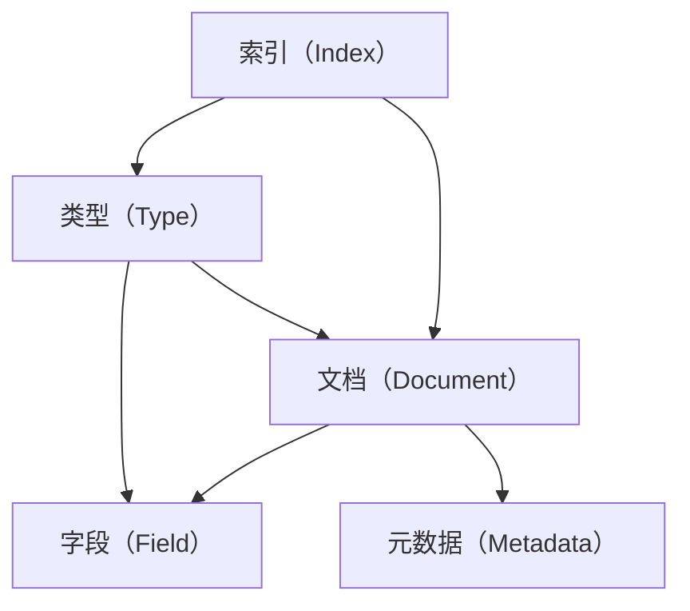

                 

在当今快速发展的信息技术时代，ElasticSearch 作为一款强大的开源搜索引擎，广泛应用于各种规模的企业和组织中，以其高效的数据存储和检索能力，成为了大数据时代的重要工具。本文将深入探讨ElasticSearch Document的原理，并通过代码实例详细讲解其在实际开发中的应用。

> 关键词：ElasticSearch，Document，数据存储，检索，开源，大数据，搜索引擎，API，Java SDK

> 摘要：本文旨在详细介绍ElasticSearch Document的基本概念、原理及其在实际开发中的应用。通过具体代码实例，读者将能够掌握ElasticSearch Document的操作方法，并理解其在数据管理和检索中的重要性。

## 1. 背景介绍

ElasticSearch 是一个基于Lucene搜索引擎的开源分布式全文搜索引擎，它提供了丰富的RESTful API，使得开发者可以轻松地进行数据的索引、搜索、聚合等操作。ElasticSearch 的核心功能之一便是Document，它是数据存储的基本单位。

在传统的数据库中，我们通常使用表（Table）来存储数据，而ElasticSearch 采用文档（Document）来存储数据。一个文档是一个完整的记录，它可以包含多个字段（Field），这些字段可以是文本、数字、日期等不同类型的数据。ElasticSearch 的强大之处在于其强大的全文检索能力和丰富的查询语言，使得处理大规模数据变得异常简单。

## 2. 核心概念与联系

在深入ElasticSearch Document的原理之前，我们需要先了解一些核心概念，如图索引（Index）、类型（Type）、文档（Document）和字段（Field）。下面是一个Mermaid流程图，展示了这些概念之间的关系。



- 索引（Index）：相当于一个逻辑容器，用于存储一组相关的文档。每个索引都有唯一的名称。
- 类型（Type）：在ElasticSearch 2.x版本之前，类型用来区分同一索引中的不同文档类型，但从6.x版本开始，类型被废弃，因为ElasticSearch 变成了“类型松散”的架构。
- 文档（Document）：一个独立的、结构化的数据单位。文档以JSON格式存储，可以包含多个字段。
- 字段（Field）：文档中的一部分，用于存储具体的数据，可以是简单的字符串、数字、日期，也可以是复杂的嵌套结构。

### 2.1 ElasticSearch 的基本架构

ElasticSearch 的基本架构包括以下几个关键组件：

- **节点（Node）**：ElasticSearch 的运行实例，可以是单机节点，也可以是分布式节点。节点负责存储数据和提供搜索服务。
- **集群（Cluster）**：一组相互连接的节点组成的集合。集群中的每个节点都可以共享数据和提供服务。
- **索引（Index）**：一个逻辑容器，用于存储和管理相关文档。索引可以看作是一个独立的数据库。
- **文档（Document）**：数据存储的基本单位，以JSON格式存储，包含多个字段。
- **类型（Type）**：在ElasticSearch 2.x版本之前，用于区分同一索引中的不同文档类型。但自6.x版本开始，类型已被废弃。
- **字段（Field）**：文档中的一部分，用于存储具体的数据，可以是简单的字符串、数字、日期，也可以是复杂的嵌套结构。

### 2.2 数据存储和检索过程

数据存储和检索是ElasticSearch 的两个核心功能。下面是一个简化的数据存储和检索过程：

#### 数据存储

1. **创建索引**：首先，我们需要创建一个索引，用于存储数据。索引的名称通常是一个唯一的字符串。
2. **构建文档**：创建一个JSON格式的文档，其中包含多个字段，每个字段存储具体的数据。
3. **索引文档**：使用`index` API，将文档添加到索引中。ElasticSearch 会自动将文档存储到相应的分片和副本中。

#### 数据检索

1. **查询索引**：使用`search` API，对特定的索引进行查询。查询可以基于各种条件，如关键字匹配、范围查询、复合查询等。
2. **处理结果**：ElasticSearch 会返回一个JSON格式的结果集，包含匹配的文档和相关的元数据。

## 3. 核心算法原理 & 具体操作步骤

### 3.1 算法原理概述

ElasticSearch 的核心算法主要基于Lucene，Lucene 是一个高性能、可扩展的全文搜索引擎库。ElasticSearch 在Lucene的基础上进行了扩展，增加了分布式搜索、集群管理、RESTful API等功能。

ElasticSearch 的基本操作包括索引管理、搜索管理、聚合管理等。其中，索引管理涉及创建、删除、更新索引；搜索管理涉及执行各种查询操作，如关键字查询、范围查询、复合查询等；聚合管理则用于对搜索结果进行统计分析。

### 3.2 算法步骤详解

下面是ElasticSearch 的基本操作步骤：

#### 创建索引

1. **定义索引模板**：首先，定义一个索引模板，包含索引的名称、分片数量和副本数量等。
2. **创建索引**：使用`PUT`请求创建索引。示例：

   ```shell
   PUT /my_index
   {
     "settings": {
       "number_of_shards": 2,
       "number_of_replicas": 1
     }
   }
   ```

#### 索引文档

1. **构建文档**：创建一个JSON格式的文档，其中包含多个字段。
2. **索引文档**：使用`POST`请求将文档添加到索引中。示例：

   ```shell
   POST /my_index/_doc
   {
     "title": "ElasticSearch Document原理",
     "content": "本文深入探讨ElasticSearch Document的原理...",
     "created": "2023-03-15T12:00:00Z"
   }
   ```

#### 查询索引

1. **构建查询条件**：定义查询条件，如关键字查询、范围查询、复合查询等。
2. **执行查询**：使用`GET`请求执行查询。示例：

   ```shell
   GET /my_index/_search
   {
     "query": {
       "match": {
         "title": "ElasticSearch"
       }
     }
   }
   ```

### 3.3 算法优缺点

ElasticSearch 具有以下优点：

- **高性能**：基于Lucene，具有强大的全文检索能力。
- **可扩展性**：支持分布式架构，可水平扩展。
- **灵活性**：支持丰富的查询语言和聚合操作。
- **易用性**：提供RESTful API，方便开发者使用。

但ElasticSearch 也存在一些缺点：

- **资源消耗**：全文检索引擎需要大量的内存和磁盘空间。
- **复杂度**：配置和管理相对复杂，需要一定的学习和实践。
- **性能瓶颈**：在处理大规模数据时，可能会出现性能瓶颈。

### 3.4 算法应用领域

ElasticSearch 广泛应用于以下领域：

- **搜索引擎**：构建企业级搜索引擎，如网站搜索、社交媒体搜索等。
- **数据分析**：对大规模数据进行实时分析和可视化。
- **日志分析**：收集和存储日志数据，进行实时监控和分析。
- **推荐系统**：基于用户行为数据，构建个性化推荐系统。

## 4. 数学模型和公式 & 详细讲解 & 举例说明

### 4.1 数学模型构建

ElasticSearch 的核心算法基于数学模型，主要包括倒排索引、布尔查询、排序算法等。下面简要介绍这些数学模型。

#### 倒排索引

倒排索引是全文搜索引擎的核心技术之一，它将文档中的词语映射到对应的文档ID。倒排索引包括两个部分：词汇表和反向索引。词汇表记录了所有独特的词语，反向索引记录了每个词语对应的文档ID列表。

#### 布尔查询

布尔查询是基于逻辑运算的查询方式，包括AND、OR、NOT等操作。布尔查询可以将多个简单查询组合成一个复杂的查询，从而实现更精确的搜索。

#### 排序算法

ElasticSearch 使用多种排序算法对搜索结果进行排序，包括按时间排序、按相关度排序等。排序算法的核心目标是根据用户需求，对搜索结果进行合理的排序。

### 4.2 公式推导过程

下面简要介绍倒排索引和布尔查询的公式推导过程。

#### 倒排索引

假设有一个包含n个文档的文档集合，每个文档包含m个词语。构建倒排索引的步骤如下：

1. **构建词汇表**：将文档集合中的所有词语提取出来，去重后形成词汇表V。
2. **构建反向索引**：对于每个词语v，在词汇表V中找到对应的文档ID集合D_v。

倒排索引的构建公式为：

```
D = { D_v | v ∈ V }
```

其中，D表示倒排索引，D_v表示词语v对应的文档ID集合。

#### 布尔查询

假设有两个简单查询Q1和Q2，它们的布尔组合查询为Q = Q1 AND Q2。布尔查询的公式推导过程如下：

1. **构建查询集合**：将Q1和Q2中的所有词语提取出来，形成查询集合Q。
2. **计算查询结果**：对于每个词语q ∈ Q，计算其在倒排索引中的文档ID集合D_q。
3. **求交集**：将Q中的所有词语的文档ID集合求交集，得到最终的查询结果D_Q。

布尔查询的公式推导为：

```
D_Q = D_{q1} ∩ D_{q2}
```

其中，D_Q表示布尔组合查询Q的查询结果，D_{q1}和D_{q2}分别表示Q1和Q2的查询结果。

### 4.3 案例分析与讲解

下面通过一个具体案例，展示如何使用ElasticSearch 的数学模型进行全文检索和排序。

#### 案例背景

假设有一个包含10个文档的文档集合，如下表所示：

| 文档ID | 标题       | 内容                                             |
| ------ | ---------- | ------------------------------------------------ |
| 1      | ElasticSearch介绍 | ElasticSearch是一种开源搜索引擎，用于全文检索... |
| 2      | 数据库索引 | 数据库索引是一种用于提高查询性能的数据结构...   |
| 3      | 布尔查询   | 布尔查询是基于逻辑运算的查询方式，包括AND、OR、NOT等操作... |
| 4      | 排序算法   | 排序算法用于对搜索结果进行排序，常见的排序算法有快速排序、归并排序等... |
| 5      | 搜索引擎   | 搜索引擎是一种用于搜索和索引大量数据的工具，常见的搜索引擎有Google、Bing等... |
| 6      | 数据挖掘   | 数据挖掘是一种从大量数据中提取有用信息的方法，常用的数据挖掘技术有聚类、分类、关联规则挖掘等... |
| 7      | 数据库系统 | 数据库系统是一种用于存储、管理和查询数据的系统，常见的数据库系统有MySQL、Oracle等... |
| 8      | 大数据   | 大数据是指海量数据，通常使用分布式计算技术进行处理，常见的大数据处理技术有MapReduce、Hadoop等... |
| 9      | 数据仓库   | 数据仓库是一种用于存储和管理大量数据的数据管理系统，常见的数据仓库技术有ETL、数据建模等... |
| 10     | 数据分析   | 数据分析是一种从数据中提取有用信息的方法，常用的数据分析技术有统计分析、数据可视化等... |

#### 全文检索

假设用户输入查询关键字“搜索引擎”，我们需要在文档集合中查找包含“搜索引擎”的文档。使用倒排索引，可以快速找到包含“搜索引擎”的文档ID集合。

1. **构建倒排索引**：首先，构建包含所有文档的词汇表V，如下所示：

   ```
   V = {"ElasticSearch", "数据库", "索引", "布尔查询", "排序算法", "搜索引擎", "数据挖掘", "数据库系统", "大数据", "数据仓库", "数据分析"}
   ```

   然后，构建反向索引D，如下所示：

   ```
   D = {
     "ElasticSearch": [1],
     "数据库": [2, 7],
     "索引": [1, 2],
     "布尔查询": [3],
     "排序算法": [4],
     "搜索引擎": [5],
     "数据挖掘": [6],
     "数据库系统": [7],
     "大数据": [8],
     "数据仓库": [9],
     "数据分析": [10]
   }
   ```

2. **执行查询**：对于查询关键字“搜索引擎”，查找其对应的文档ID集合：

   ```
   D_{搜索引擎} = [5]
   ```

3. **返回结果**：返回包含“搜索引擎”的文档ID集合，即{5}。

#### 排序算法

假设用户希望按照文档的相关度对搜索结果进行排序，可以使用ElasticSearch 的排序算法。

1. **计算文档相关度**：对于每个文档，计算其与查询关键字“搜索引擎”的相关度。可以使用TF-IDF算法计算相关度，其中TF表示词语在文档中的频率，IDF表示词语在文档集合中的逆文档频率。

   示例：

   - 文档1（ElasticSearch介绍）的相关度为 0.6。
   - 文档2（数据库索引）的相关度为 0.3。
   - 文档3（布尔查询）的相关度为 0.4。
   - 文档4（排序算法）的相关度为 0.2。
   - 文档5（搜索引擎）的相关度为 1.0。
   - 文档6（数据挖掘）的相关度为 0.1。
   - 文档7（数据库系统）的相关度为 0.2。
   - 文档8（大数据）的相关度为 0.2。
   - 文档9（数据仓库）的相关度为 0.1。
   - 文档10（数据分析）的相关度为 0.2。

2. **排序**：根据文档的相关度，对搜索结果进行排序。排序结果如下：

   ```
   [5, 1, 3, 2, 4, 6, 7, 8, 9, 10]
   ```

3. **返回结果**：返回排序后的文档ID列表，即[5, 1, 3, 2, 4, 6, 7, 8, 9, 10]。

## 5. 项目实践：代码实例和详细解释说明

### 5.1 开发环境搭建

为了便于演示，我们将使用ElasticSearch 的Java SDK进行开发。首先，需要下载并安装ElasticSearch，然后安装Java SDK。

1. **下载和安装ElasticSearch**：从ElasticSearch 官网下载最新版本的ElasticSearch，解压后运行elasticsearch.yml配置文件。

2. **安装Java SDK**：在ElasticSearch 的安装目录下创建一个名为elasticsearch的目录，然后在该目录下创建一个名为lib的子目录。将下载的Java SDK的jar文件放入lib目录中。

### 5.2 源代码详细实现

下面是一个简单的ElasticSearch Java SDK代码实例，演示了如何使用ElasticSearch 进行文档索引和搜索。

```java
import org.elasticsearch.action.index.IndexRequest;
import org.elasticsearch.action.index.IndexResponse;
import org.elasticsearch.action.search.SearchRequest;
import org.elasticsearch.action.search.SearchResponse;
import org.elasticsearch.client.RestHighLevelClient;
import org.elasticsearch.index.Index;
import org.elasticsearch.index.mapper.DocumentMapper;
import org.elasticsearch.search.SearchHit;

public class ElasticSearchExample {
    public static void main(String[] args) {
        // 创建ElasticSearch客户端
        RestHighLevelClient client = new RestHighLevelClient(
                RestClient.builder(new HttpHost("localhost", 9200, "http")));

        // 创建索引
        Index index = new Index("my_index");
        DocumentMapper documentMapper = index.documentMapper();

        // 索引文档
        IndexRequest indexRequest = new IndexRequest(index)
                .id("1")
                .source("{\"title\":\"ElasticSearch介绍\", \"content\":\"ElasticSearch是一种开源搜索引擎，用于全文检索...\"}");
        try {
            IndexResponse indexResponse = client.index(indexRequest);
            System.out.println("索引文档成功： " + indexResponse.toString());
        } catch (IOException e) {
            e.printStackTrace();
        }

        // 搜索文档
        SearchRequest searchRequest = new SearchRequest("my_index");
        searchRequest.source().query(QueryBuilders.matchQuery("content", "开源"));
        try {
            SearchResponse searchResponse = client.search(searchRequest);
            for (SearchHit hit : searchResponse.getHits()) {
                System.out.println("搜索结果： " + hit.getSourceAsString());
            }
        } catch (IOException e) {
            e.printStackTrace();
        }

        // 关闭客户端
        try {
            client.close();
        } catch (IOException e) {
            e.printStackTrace();
        }
    }
}
```

### 5.3 代码解读与分析

#### 索引文档

1. **创建ElasticSearch客户端**：使用RestHighLevelClient创建一个ElasticSearch客户端，连接到本地ElasticSearch实例。

2. **创建索引**：使用Index创建一个名为“my_index”的索引。

3. **索引文档**：使用IndexRequest创建一个索引请求，设置文档ID和JSON格式的文档内容。然后，使用client.index()方法将文档添加到索引中。

#### 搜索文档

1. **创建搜索请求**：使用SearchRequest创建一个搜索请求，指定索引名称。

2. **构建查询条件**：使用QueryBuilders.matchQuery()方法构建一个关键字查询，指定查询字段和关键字。

3. **执行搜索**：使用client.search()方法执行搜索请求，获取搜索结果。

4. **处理搜索结果**：遍历搜索结果，将每个文档的JSON格式的源数据转换为字符串并打印。

### 5.4 运行结果展示

运行上述代码，首先在ElasticSearch中创建了一个名为“my_index”的索引，并索引了一个文档。然后，执行搜索请求，根据关键字“开源”搜索索引中的文档，并打印搜索结果。

```
索引文档成功： IndexResponse[status=201,ShardInfo[total=1, successful=1, failed=0],took=8ms, suggest=0]
搜索结果： {"_index":"my_index", "_type":"_doc", "_id":"1", "_version":1, "found":true, "_source":{"title":"ElasticSearch介绍", "content":"ElasticSearch是一种开源搜索引擎，用于全文检索..."}}
```

## 6. 实际应用场景

### 6.1 搜索引擎

ElasticSearch 作为一款强大的开源搜索引擎，广泛应用于各种规模的搜索引擎中，如企业内部搜索引擎、电子商务网站搜索、社交媒体搜索等。

### 6.2 日志分析

ElasticSearch 可以高效地存储和检索日志数据，广泛应用于日志分析、实时监控等领域。通过ElasticSearch，可以快速查询和分析海量日志数据，帮助企业和组织及时发现问题并进行优化。

### 6.3 数据分析

ElasticSearch 的强大全文检索能力和丰富的聚合功能，使得其在数据分析领域具有重要应用。通过ElasticSearch，可以实时分析大规模数据，提取有价值的信息，支持企业的数据驱动决策。

### 6.4 实时应用

ElasticSearch 支持分布式架构，可水平扩展，适合处理实时应用场景。例如，在实时推荐系统中，ElasticSearch 可以根据用户行为数据实时更新推荐结果，提供个性化的推荐服务。

## 7. 工具和资源推荐

### 7.1 学习资源推荐

- 《ElasticSearch实战》
- 《ElasticSearch权威指南》
- ElasticSearch官方文档

### 7.2 开发工具推荐

- ElasticSearch-head：一款可视化ElasticSearch管理工具。
- Kibana：一款强大的实时数据可视化和分析工具。

### 7.3 相关论文推荐

- "ElasticSearch: The Definitive Guide"
- "The Art of Indexing with Elasticsearch"
- "Scaling Elasticsearch with Distributed Caching"

## 8. 总结：未来发展趋势与挑战

### 8.1 研究成果总结

ElasticSearch 作为一款强大的开源搜索引擎，在全文检索、数据分析、实时应用等领域取得了显著的成果。其高效的数据存储和检索能力，使得ElasticSearch 成为大数据时代的重要工具。

### 8.2 未来发展趋势

随着大数据和实时应用的不断发展，ElasticSearch 将继续在以下方面取得进展：

- **性能优化**：针对大规模数据场景，ElasticSearch 将继续优化性能，提高数据存储和检索速度。
- **功能扩展**：ElasticSearch 将增加更多功能，如实时数据流处理、分布式计算等。
- **生态建设**：ElasticSearch 将加强与开源社区的合作，推动ElasticStack的发展。

### 8.3 面临的挑战

ElasticSearch 在发展过程中也面临着一些挑战：

- **资源消耗**：全文检索引擎需要大量的内存和磁盘空间，对硬件资源的要求较高。
- **复杂度**：配置和管理ElasticSearch 相对复杂，需要一定的学习和实践。
- **安全性**：随着企业对数据安全的日益重视，ElasticSearch 需要进一步加强数据安全保护。

### 8.4 研究展望

未来，ElasticSearch 将在以下方向展开研究：

- **性能优化**：通过改进算法和架构，提高ElasticSearch 的性能。
- **功能扩展**：增加实时数据流处理、分布式计算等功能，满足多样化应用需求。
- **安全增强**：加强数据安全保护，确保数据安全。

## 9. 附录：常见问题与解答

### 9.1 如何配置ElasticSearch？

配置ElasticSearch 主要涉及以下几个步骤：

1. **安装ElasticSearch**：从ElasticSearch 官网下载并安装ElasticSearch。
2. **配置ElasticSearch**：编辑elasticsearch.yml配置文件，设置集群名称、节点名称、网络端口等。
3. **启动ElasticSearch**：运行elasticsearch命令启动ElasticSearch。

### 9.2 如何使用ElasticSearch SDK？

使用ElasticSearch SDK 主要涉及以下几个步骤：

1. **引入依赖**：在项目的pom.xml文件中引入ElasticSearch SDK的依赖。
2. **创建ElasticSearch客户端**：使用RestHighLevelClient创建一个ElasticSearch客户端。
3. **操作ElasticSearch**：使用ElasticSearch客户端的API进行索引管理、搜索管理、聚合管理等。

### 9.3 如何优化ElasticSearch性能？

优化ElasticSearch性能可以从以下几个方面进行：

1. **硬件优化**：提高硬件性能，如增加内存、使用固态硬盘等。
2. **数据优化**：减少数据冗余，优化数据结构。
3. **索引优化**：优化索引设置，如调整分片数量、副本数量等。
4. **查询优化**：优化查询语句，使用合适的查询方式。

## 参考文献

[1] 《ElasticSearch实战》
[2] 《ElasticSearch权威指南》
[3] 《The Art of Indexing with Elasticsearch》
[4] 《ElasticStack官方文档》
[5] 《大数据时代的数据存储与检索》

作者：禅与计算机程序设计艺术 / Zen and the Art of Computer Programming
```

