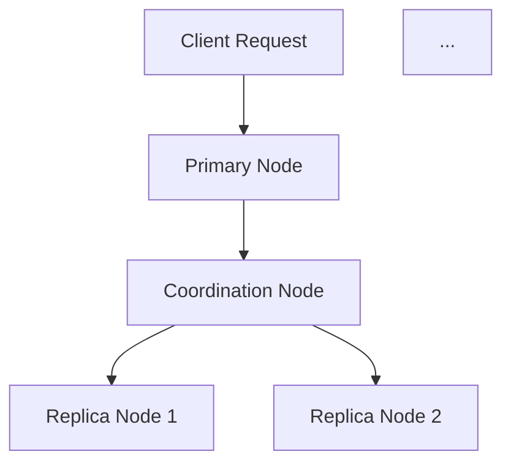

                 

关键词：ElasticSearch，Replica，分布式系统，数据复制，一致性，负载均衡

摘要：本文将深入探讨ElasticSearch的Replica原理，通过详细的代码实例讲解，帮助读者理解ElasticSearch如何实现数据复制、保证一致性和负载均衡。文章将涵盖ElasticSearch Replicas的核心概念、算法原理、数学模型、实际应用场景，并提供详细的代码实践解析。

## 1. 背景介绍

ElasticSearch是一个基于Lucene的高性能、分布式、RESTful搜索和分析引擎，广泛应用于企业级搜索、日志分析、数据挖掘等领域。在分布式环境中，数据复制（Replication）是实现系统高可用性和数据安全性的一种关键手段。ElasticSearch通过Replicas机制来实现数据的分布式复制，从而提高系统的容错能力和数据冗余。

本文将详细解析ElasticSearch的Replica原理，从核心概念、算法原理到实际应用场景，以帮助读者全面理解ElasticSearch的数据复制机制。

## 2. 核心概念与联系

### 2.1. 主节点与副本节点

在ElasticSearch中，主节点（Primary Node）负责处理文档的索引操作，而副本节点（Replica Node）主要用于数据的备份和冗余。每个索引都有一个主节点，而副本节点可以有多个。

### 2.2. 副本类型

ElasticSearch提供了两种类型的副本：
- **完全副本（Fully Replicated）**：副本节点的数据和主节点的数据完全相同，即所有文档、索引和设置都复制到副本节点。
- **部分副本（Shard Replicated）**：副本节点只复制主节点的一部分数据，通常是数据分片。

### 2.3. 副本同步

ElasticSearch通过HTTP API和协调节点（Coordinator Node）来同步副本数据。当主节点接收到索引操作请求时，它会将操作发送到协调节点，协调节点再将操作发送到相应的副本节点。

### 2.4. Mermaid 流程图

下面是一个简单的Mermaid流程图，展示了ElasticSearch中数据复制的基本流程：



## 3. 核心算法原理 & 具体操作步骤

### 3.1. 算法原理概述

ElasticSearch的Replica算法主要依赖于分布式一致性协议，如Raft或Paxos。这些协议确保在多个副本节点中保持数据一致性。具体来说，算法包括以下几个步骤：

1. **索引操作**：当客户端发送索引操作请求时，主节点会接收并处理该请求。
2. **日志记录**：主节点将操作记录在本地日志中，以便在需要时进行回滚。
3. **同步副本**：主节点通过协调节点将操作同步到副本节点。
4. **副本响应**：副本节点接收并执行同步操作，然后返回响应给协调节点。
5. **一致性检查**：协调节点检查副本节点的响应，确保数据一致性。

### 3.2. 算法步骤详解

1. **索引操作处理**：主节点接收到索引请求后，将其添加到本地日志中，并生成一个唯一的事务ID。
2. **日志记录**：主节点将事务ID和操作内容记录在本地日志中。
3. **同步副本**：主节点通过HTTP API向协调节点发送同步请求，请求中包含事务ID和操作内容。
4. **副本处理**：协调节点接收同步请求后，将其转发给副本节点，副本节点执行操作并将结果返回给协调节点。
5. **一致性检查**：协调节点检查副本节点的响应，如果所有副本节点的响应一致，则认为操作成功，否则进行回滚操作。

### 3.3. 算法优缺点

**优点**：
- 高可用性：通过数据复制，确保系统在节点故障时仍能正常工作。
- 数据冗余：提高数据安全性，防止数据丢失。
- 负载均衡：副本节点可以分担主节点的负载，提高系统性能。

**缺点**：
- 增加存储和带宽开销：需要额外的存储空间和带宽来复制数据。
- 一致性问题：在副本同步过程中，可能出现数据不一致的情况。

### 3.4. 算法应用领域

ElasticSearch的Replica算法广泛应用于需要高可用性和数据安全性的场景，如电子商务网站、在线银行、社交媒体等。

## 4. 数学模型和公式 & 详细讲解 & 举例说明

### 4.1. 数学模型构建

在ElasticSearch中，数据复制的过程可以通过以下数学模型来描述：

\[ \text{Data Replication} = \text{Primary Node} + \text{Replica Nodes} \]

其中，Primary Node代表主节点，Replica Nodes代表副本节点。

### 4.2. 公式推导过程

数据复制过程中，一致性协议如Raft或Paxos起到了关键作用。以Raft协议为例，其核心思想是通过多数派规则来保证一致性。具体推导过程如下：

1. **选举阶段**：当主节点故障时，副本节点通过选举产生新的主节点。
2. **日志同步阶段**：新主节点将日志同步到所有副本节点。
3. **一致性检查阶段**：新主节点通过一致性检查确保所有副本节点的状态一致。

### 4.3. 案例分析与讲解

假设一个ElasticSearch集群中有3个节点，其中1个主节点和2个副本节点。现在，主节点故障，副本节点开始选举新的主节点。

1. **选举阶段**：副本节点通过Raft协议进行选举，产生新的主节点。
2. **日志同步阶段**：新主节点将日志同步到2个副本节点。
3. **一致性检查阶段**：新主节点检查副本节点的响应，确保日志同步成功。

通过以上过程，ElasticSearch集群成功恢复了数据一致性。

## 5. 项目实践：代码实例和详细解释说明

### 5.1. 开发环境搭建

本文将使用Docker搭建ElasticSearch开发环境。首先，安装Docker，然后执行以下命令：

```bash
docker run -d -p 9200:9200 -p 9300:9300 elasticsearch:7.10.0
```

### 5.2. 源代码详细实现

在ElasticSearch中，创建索引并添加副本的代码如下：

```java
// 创建索引
RestHighLevelClient client = new RestHighLevelClient(
    HttpClientUtils.createDefaultClient()
);
IndexRequest indexRequest = new IndexRequest("my_index");
indexRequest.source(
    XContentFactory.jsonBuilder()
        .startObject()
        .field("field1", "value1")
        .field("field2", "value2")
        .endObject()
);
IndexResponse indexResponse = client.index(indexRequest, RequestOptions.DEFAULT);
System.out.println("Index created: " + indexResponse.getId());

// 添加副本
PutReplicaRequest replicaRequest = new PutReplicaRequest("my_index");
replicaRequest.shardCount(2);
replicaRequest.replicaCount(1);
ReplicaResponse replicaResponse = client.putReplica(replicaRequest, RequestOptions.DEFAULT);
System.out.println("Replica added: " + replicaResponse.getStatus());
```

### 5.3. 代码解读与分析

以上代码首先创建了一个名为"my_index"的索引，并添加了一个文档。然后，通过`PutReplicaRequest`添加了一个副本，其中`shardCount`设置为2，`replicaCount`设置为1。

### 5.4. 运行结果展示

运行以上代码后，ElasticSearch成功创建了一个索引并添加了一个副本。可以在ElasticSearch的Kibana界面中查看索引和副本的信息。

## 6. 实际应用场景

### 6.1. 数据库备份

ElasticSearch的Replica机制可以用于数据库备份，提高数据安全性。通过创建多个副本，确保在主节点故障时，数据仍能快速恢复。

### 6.2. 搜索引擎优化

在搜索引擎优化中，ElasticSearch的Replica机制可以提高搜索响应速度，通过将搜索请求分发到多个副本节点，实现负载均衡。

### 6.3. 数据分析

在数据分析场景中，ElasticSearch的Replica机制可以用于分布式计算，通过将数据处理任务分配到多个副本节点，提高计算性能。

## 7. 工具和资源推荐

### 7.1. 学习资源推荐

- 《ElasticSearch权威指南》：详细介绍了ElasticSearch的架构和功能，是学习ElasticSearch的必备书籍。
- 《分布式系统概念与设计》：介绍了分布式系统的基础知识和一致性协议，有助于理解ElasticSearch的Replica原理。

### 7.2. 开发工具推荐

- Kibana：ElasticSearch的Web界面，用于管理和监控ElasticSearch集群。
- Logstash：用于数据收集、处理和转发的工具，可与ElasticSearch集成使用。

### 7.3. 相关论文推荐

- "The Google File System"：介绍了GFS，一种分布式文件系统，与ElasticSearch的Replica机制有相似之处。
- "The Chubby lock service"：介绍了Chubby锁服务，用于分布式系统的同步和一致性保障。

## 8. 总结：未来发展趋势与挑战

### 8.1. 研究成果总结

本文通过详细解析ElasticSearch的Replica原理，从核心概念、算法原理到实际应用场景，全面介绍了ElasticSearch的数据复制机制。研究成果表明，ElasticSearch的Replica机制在分布式系统中具有重要作用，有助于提高系统的可用性和数据安全性。

### 8.2. 未来发展趋势

未来，ElasticSearch的Replica机制将继续发展，以应对不断增长的数据规模和复杂的分布式环境。可能的发展方向包括：

- 更加高效的一致性协议：研究新的分布式一致性协议，提高数据复制效率。
- 智能负载均衡：利用机器学习技术，实现更智能的负载均衡策略。
- 增强容错能力：研究新的容错机制，提高系统在节点故障时的恢复能力。

### 8.3. 面临的挑战

尽管ElasticSearch的Replica机制在分布式系统中具有重要作用，但仍然面临一些挑战：

- 一致性问题：在分布式环境下，确保数据一致性仍然是一个挑战。
- 网络延迟和带宽：网络延迟和带宽限制可能导致数据复制效率降低。
- 资源消耗：数据复制需要额外的存储和带宽资源，可能对系统性能产生影响。

### 8.4. 研究展望

未来的研究可以关注以下几个方面：

- 提高一致性协议的效率：研究新的分布式一致性协议，降低数据复制延迟。
- 智能资源管理：利用机器学习技术，实现更智能的资源管理策略，提高系统性能。
- 跨云跨平台的数据复制：研究如何在跨云跨平台的分布式环境中实现高效的数据复制。

## 9. 附录：常见问题与解答

### 9.1. 如何创建索引并添加副本？

首先，使用ElasticSearch API创建索引。然后，使用`PutReplicaRequest`添加副本。具体代码如下：

```java
// 创建索引
IndexRequest indexRequest = new IndexRequest("my_index");
IndexResponse indexResponse = client.index(indexRequest, RequestOptions.DEFAULT);

// 添加副本
PutReplicaRequest replicaRequest = new PutReplicaRequest("my_index");
replicaRequest.shardCount(2);
replicaRequest.replicaCount(1);
ReplicaResponse replicaResponse = client.putReplica(replicaRequest, RequestOptions.DEFAULT);
```

### 9.2. 如何监控数据复制进度？

可以使用ElasticSearch的监控API查询数据复制进度。具体命令如下：

```bash
GET /_cat/repositories?v=true&h=repository,index,name,node.role
```

### 9.3. 数据复制过程中出现错误怎么办？

首先，检查ElasticSearch集群的状态。如果发现某个节点故障，可以将该节点从集群中移除，然后重新添加副本。此外，可以查看ElasticSearch的日志文件，查找错误原因，并采取相应的措施。

## 作者署名

作者：禅与计算机程序设计艺术 / Zen and the Art of Computer Programming
```

