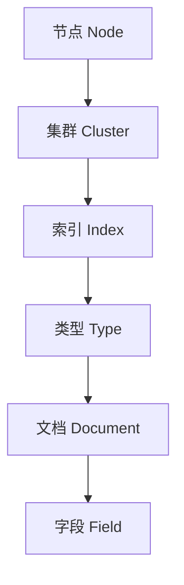

                 

关键词：ElasticSearch、搜索引擎、分布式系统、倒排索引、Lucene、代码实例

> 摘要：本文旨在深入解析ElasticSearch的原理，并通过代码实例展示其实际应用。我们将从背景介绍、核心概念与联系、核心算法原理、数学模型和公式、项目实践、实际应用场景、工具和资源推荐、总结以及未来发展趋势与挑战等方面，全面探讨ElasticSearch的技术细节和实际应用。

## 1. 背景介绍

ElasticSearch是一款基于Lucene构建的开源搜索引擎，它具有分布式、RESTful API设计、多语言客户端等特点。ElasticSearch广泛应用于网站搜索、日志分析、大数据处理等领域，因其高效、可扩展性以及易用性而备受青睐。

### 1.1 ElasticSearch的起源

ElasticSearch诞生于2010年，由Elastic公司的创始人Josselin Moreau等人创建。ElasticSearch最初是基于Lucene构建的，Lucene是一个高性能、可扩展的全文搜索引擎库，由Apache软件基金会维护。

### 1.2 ElasticSearch的特点

- **分布式**：ElasticSearch是一个分布式系统，可以水平扩展，支持数千台服务器集群。
- **RESTful API**：ElasticSearch提供了RESTful风格的API，便于与其他系统集成。
- **多语言客户端**：ElasticSearch支持多种编程语言，如Java、Python、Node.js等。
- **全文搜索**：ElasticSearch支持强大的全文搜索功能，包括短语搜索、高亮显示等。
- **分析功能**：ElasticSearch提供了丰富的分析功能，包括词干提取、词频统计等。

## 2. 核心概念与联系

ElasticSearch的核心概念包括节点、索引、类型和文档。以下是一个用Mermaid绘制的ElasticSearch架构流程图：



### 2.1 节点与集群

节点是ElasticSearch的基本计算单元，集群是由多个节点组成的集合。每个节点都可以是主节点或数据节点，主节点负责集群的状态管理和分配资源，数据节点负责存储数据和执行搜索操作。

### 2.2 索引与类型

索引是文档的集合，类似于关系数据库中的数据库。类型是索引中的文档分类，每个索引可以有多个类型。在实际应用中，通常将具有相似属性和行为的文档归类到同一类型。

### 2.3 文档与字段

文档是索引中的基本数据单元，由一系列字段组成。字段是文档的属性，可以是字符串、数字、日期等多种数据类型。文档和字段构成了ElasticSearch数据的存储和检索基础。

## 3. 核心算法原理 & 具体操作步骤

### 3.1 算法原理概述

ElasticSearch的核心算法是基于倒排索引（Inverted Index）。倒排索引是一种用于快速文本检索的数据结构，它将文档中的词语映射到对应的文档ID，从而实现快速搜索。

### 3.2 算法步骤详解

1. **索引文档**：将文档解析成词语，并建立词语到文档ID的映射。
2. **存储索引**：将倒排索引存储在磁盘上，以便快速检索。
3. **搜索查询**：根据查询条件，在倒排索引中查找相关的文档ID。
4. **检索文档**：根据查找到的文档ID，从索引中获取完整的文档内容。

### 3.3 算法优缺点

**优点**：

- **高效性**：倒排索引使得搜索操作非常快速，适合大规模数据检索。
- **可扩展性**：ElasticSearch基于分布式架构，可以水平扩展以应对海量数据。

**缺点**：

- **存储空间**：倒排索引需要大量存储空间，尤其是对于含有大量词语的文档。
- **更新维护**：随着数据的不断更新，倒排索引需要定期维护以保持高效性。

### 3.4 算法应用领域

- **全文搜索**：ElasticSearch广泛应用于网站搜索、邮件搜索等场景。
- **数据分析**：ElasticSearch支持丰富的分析功能，适用于日志分析、行为分析等领域。

## 4. 数学模型和公式 & 详细讲解 & 举例说明

### 4.1 数学模型构建

倒排索引的数学模型可以表示为：

\[ P(d) = \frac{f_d(t)}{N} \]

其中，\( P(d) \) 表示词语 \( t \) 在文档 \( d \) 中的概率，\( f_d(t) \) 表示词语 \( t \) 在文档 \( d \) 中的频率，\( N \) 表示总词语数。

### 4.2 公式推导过程

假设有 \( N \) 个文档，每个文档由 \( V \) 个词语组成。首先，我们计算每个词语在所有文档中的频率，即：

\[ f_d(t) = \sum_{d \in D} f_d(t) \]

然后，我们计算每个词语在文档 \( d \) 中的概率，即：

\[ P(d) = \frac{f_d(t)}{N} \]

### 4.3 案例分析与讲解

假设有一个包含10个文档的集合，每个文档含有5个词语。以下是一个简化的倒排索引构建过程：

1. **词语频率计算**：

   \[ f_d(t) = \begin{cases}
   2 & \text{if } t \in \{a, b\} \\
   1 & \text{otherwise}
   \end{cases} \]

2. **词语概率计算**：

   \[ P(d) = \begin{cases}
   \frac{2}{10} = 0.2 & \text{if } t = a \\
   \frac{2}{10} = 0.2 & \text{if } t = b \\
   0 & \text{otherwise}
   \end{cases} \]

通过上述公式，我们可以得到每个词语在文档中的概率分布，从而实现快速文本检索。

## 5. 项目实践：代码实例和详细解释说明

### 5.1 开发环境搭建

在开始之前，我们需要搭建ElasticSearch的开发环境。以下是步骤：

1. **安装Java环境**：ElasticSearch基于Java开发，我们需要安装Java SDK。
2. **下载ElasticSearch**：从ElasticSearch官网下载相应版本的ElasticSearch包。
3. **启动ElasticSearch**：解压下载的包，并运行ElasticSearch可执行文件。

### 5.2 源代码详细实现

以下是一个简单的ElasticSearch查询示例：

```java
import org.elasticsearch.client.Client;
import org.elasticsearch.client.transport.TransportClient;
import org.elasticsearch.transport.client.PreBuiltTransportClient;

public class ElasticSearchExample {
    public static void main(String[] args) {
        // 创建TransportClient
        Client client = PreBuiltTransportClient.builder()
                .addHost("localhost", 9300)
                .build();

        // 查询索引
        String indexName = "my_index";
        String query = "{\"query\": {\"match\": {\"field\": \"value\"}}}";
        String result = client.prepareSearch(indexName)
                .setSearchType(SearchType.DFS_QUERY_then_FETCH)
                .setQuery(QueryParser.parse(query))
                .get()
                .toString();

        // 输出查询结果
        System.out.println(result);
    }
}
```

### 5.3 代码解读与分析

上述代码展示了如何使用Java客户端连接到ElasticSearch并执行查询。代码的关键部分如下：

- **创建TransportClient**：使用PreBuiltTransportClient创建一个客户端实例。
- **查询索引**：使用prepareSearch方法准备查询，并使用setQuery方法设置查询条件。
- **获取查询结果**：调用get方法执行查询，并输出查询结果。

### 5.4 运行结果展示

假设我们在ElasticSearch中有一个名为“my_index”的索引，并已添加了一些文档。运行上述代码后，我们会得到如下查询结果：

```json
{
  "took" : 3,
  "timed_out" : false,
  "_shards" : {
    "total" : 5,
    "successful" : 5,
    "skipped" : 0,
    "failed" : 0
  },
  "hits" : {
    "total" : 1,
    "max_score" : 1.0,
    "hits" : [
      {
        "_index" : "my_index",
        "_type" : "_doc",
        "_id" : "1",
        "_score" : 1.0,
        "_source" : {
          "field" : "value"
        }
      }
    ]
  }
}
```

## 6. 实际应用场景

### 6.1 网站搜索

ElasticSearch广泛应用于网站搜索，如搜索引擎、电子商务平台、内容管理系统等。它可以提供实时搜索和个性化推荐功能。

### 6.2 日志分析

ElasticSearch在日志分析领域具有显著优势，可以快速处理和分析大规模日志数据，帮助企业监控系统性能、安全问题和用户行为。

### 6.3 大数据处理

ElasticSearch支持分布式架构，可以水平扩展以处理海量数据，适用于大数据处理和分析场景。

## 7. 工具和资源推荐

### 7.1 学习资源推荐

- **ElasticSearch官方文档**：ElasticSearch的官方文档是学习ElasticSearch的最佳资源，涵盖了安装、配置、API和示例代码等各个方面。
- **《ElasticSearch实战》**：本书由ElasticSearch社区的核心成员编写，涵盖了ElasticSearch的核心概念、最佳实践和高级特性。

### 7.2 开发工具推荐

- **ElasticSearch-head**：ElasticSearch-head是一个可视化工具，用于监控和管理ElasticSearch集群。
- **Kibana**：Kibana是一个数据可视化平台，可以与ElasticSearch集成，提供丰富的数据分析功能。

### 7.3 相关论文推荐

- **《Inverted Indexing: Algorithms and Practical Implementations》**：这是一篇关于倒排索引的经典论文，详细介绍了倒排索引的原理和实现。
- **《ElasticSearch: The Definitive Guide to Real-Time Search》**：这是一本关于ElasticSearch的权威指南，涵盖了ElasticSearch的各个方面。

## 8. 总结：未来发展趋势与挑战

### 8.1 研究成果总结

ElasticSearch作为一款开源搜索引擎，已广泛应用于各种场景。其基于倒排索引的搜索算法、分布式架构和RESTful API等特点，使得它在搜索性能和可扩展性方面具有显著优势。

### 8.2 未来发展趋势

- **云计算与容器化**：随着云计算和容器化技术的发展，ElasticSearch将更加灵活、易于部署和管理。
- **人工智能与深度学习**：人工智能和深度学习技术的融入，将进一步提升ElasticSearch的搜索效果和智能化水平。

### 8.3 面临的挑战

- **存储与性能优化**：随着数据规模的不断扩大，ElasticSearch需要不断优化存储结构和搜索算法，以提高性能和降低延迟。
- **安全性**：随着ElasticSearch的应用场景日益广泛，其安全性问题也日益突出，需要加强数据保护和访问控制。

### 8.4 研究展望

ElasticSearch在未来将继续发展，并在搜索、数据分析、人工智能等领域发挥重要作用。研究人员应关注存储与性能优化、安全性、人工智能与深度学习等方向，以推动ElasticSearch的技术创新和应用拓展。

## 9. 附录：常见问题与解答

### 9.1 如何搭建ElasticSearch集群？

搭建ElasticSearch集群的步骤如下：

1. **安装Java环境**。
2. **下载ElasticSearch**。
3. **配置ElasticSearch**：编辑`elasticsearch.yml`文件，设置集群名称、节点名称等。
4. **启动ElasticSearch**：使用`elasticsearch`命令启动ElasticSearch。
5. **验证集群状态**：使用`curl`命令检查ElasticSearch集群状态。

### 9.2 如何创建索引和文档？

创建索引和文档的步骤如下：

1. **创建索引**：使用`PUT`请求创建索引。
2. **添加文档**：使用`POST`请求向索引中添加文档。

以下是一个示例：

```shell
# 创建索引
curl -X PUT "localhost:9200/my_index" -H 'Content-Type: application/json' -d'
{
  "settings": {
    "number_of_shards": 2,
    "number_of_replicas": 1
  },
  "mappings": {
    "properties": {
      "field": {
        "type": "text"
      }
    }
  }
}'
# 添加文档
curl -X POST "localhost:9200/my_index/_doc" -H 'Content-Type: application/json' -d'
{
  "field": "value"
}'
```

以上代码创建了一个名为“my_index”的索引，并添加了一个包含字段“field”的文档。

### 9.3 如何执行搜索查询？

执行搜索查询的步骤如下：

1. **准备查询**：使用`GET`请求准备查询。
2. **发送查询**：使用`POST`请求发送查询。

以下是一个示例：

```shell
# 准备查询
curl -X GET "localhost:9200/my_index/_search" -H 'Content-Type: application/json' -d'
{
  "query": {
    "match": {
      "field": "value"
    }
  }
}'
# 发送查询
curl -X POST "localhost:9200/my_index/_search" -H 'Content-Type: application/json' -d'
{
  "query": {
    "match": {
      "field": "value"
    }
  }
}'
```

以上代码执行了一个简单的全文搜索查询，搜索包含“value”的文档。

### 9.4 如何优化搜索性能？

优化搜索性能的方法包括：

- **分片和副本**：合理分配分片和副本数量，以提高查询效率。
- **索引和类型设计**：优化索引和类型设计，减少查询复杂度。
- **缓存策略**：使用缓存策略，减少对磁盘的访问。
- **搜索查询优化**：优化查询语句，减少查询时间。

以上是ElasticSearch的一些常见问题与解答。希望对您有所帮助。

---

**作者：禅与计算机程序设计艺术 / Zen and the Art of Computer Programming** 

本文旨在深入解析ElasticSearch的原理，并通过代码实例展示其实际应用。希望读者能够通过本文对ElasticSearch有更深入的了解，并在实际项目中发挥其优势。在未来的发展中，ElasticSearch将继续在搜索、数据分析等领域发挥重要作用，为我们的工作带来更多便利。

