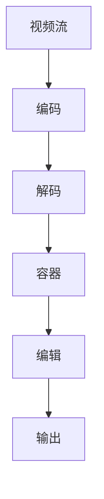

                 

### 1. 背景介绍

视频编辑在现代媒体制作和娱乐行业中扮演着至关重要的角色。无论是电影制作、电视节目、在线视频平台上的内容创作，还是简单的家庭视频编辑，高效、精确的视频编辑工具都是不可或缺的。在这些工具中，FFmpeg 拥有极高的知名度和广泛的应用。

FFmpeg 是一款开源、跨平台的多媒体处理工具，它能够进行视频、音频以及字幕的录制、转换和流播放。由于其强大的功能和灵活性，FFmpeg 成为了许多专业人士和爱好者的首选。本文将详细介绍 FFmpeg 在视频编辑中的一些核心技巧，包括裁剪、合并和过滤视频片段。

### 2. 核心概念与联系

在进行视频编辑时，我们需要理解几个关键概念：

- **视频流**：视频流是包含图像和音频数据的一系列连续帧。
- **视频格式**：视频格式定义了视频数据的存储和传输方式，如 MP4、AVI、MKV 等。
- **编码**：编码是将原始数据转换为特定格式的过程，如 H.264、HEVC 等。
- **容器**：容器是一种文件格式，用于存储多个视频、音频和字幕流。

下面是 FFmpeg 的架构和核心概念的联系，使用 Mermaid 流程图表示：



- **视频流**首先通过编码器编码为特定的格式。
- **编码**是将数据转换为便于传输或存储的格式。
- **解码**是将编码后的数据还原为原始格式。
- **容器**是将编码后的数据和相关的元数据存储在一起。
- **编辑**是通过一系列处理操作对视频进行修改。
- **输出**是将编辑后的视频数据保存或播放。

### 3. 核心算法原理 & 具体操作步骤

#### 3.1 算法原理概述

FFmpeg 的核心功能包括视频的裁剪、合并和过滤。这些操作背后的算法原理主要涉及以下几个方面：

- **裁剪**：通过选择视频流中的特定时间段进行编辑。
- **合并**：将多个视频流组合成一个新的视频流。
- **过滤**：对视频流进行各种预处理或后处理，如调整亮度、对比度、添加特效等。

#### 3.2 算法步骤详解

在进行视频编辑时，可以按照以下步骤进行：

1. **安装 FFmpeg**：首先，确保您已经安装了 FFmpeg。在大多数Linux发行版中，可以使用包管理器安装。例如，在 Ubuntu 上使用 `sudo apt-get install ffmpeg`。
2. **获取视频信息**：使用 `ffprobe` 命令获取视频的基本信息，如时长、分辨率、帧率等。
   ```bash
   ffprobe -i input.mp4
   ```
3. **裁剪视频**：使用 `-ss`（开始时间）和 `-t`（持续时间）参数裁剪视频。
   ```bash
   ffmpeg -ss 00:01:00 -t 00:01:00 -i input.mp4 -c:v libx264 -c:a aac output.mp4
   ```
4. **合并视频**：使用 `-f`（指定格式）和 `-i`（输入文件）参数合并多个视频。
   ```bash
   ffmpeg -f concatenation -i "list.txt" output.mp4
   ```
   其中，`list.txt` 是一个包含所有输入文件的列表。
5. **过滤视频**：使用 `-vf`（视频滤镜）参数对视频进行过滤。
   ```bash
   ffmpeg -i input.mp4 -vf "亮度=1.2,对比度=1.2" output.mp4
   ```

#### 3.3 算法优缺点

**优点**：

- **开源和跨平台**：FFmpeg 是一款免费、开源的软件，可以在各种操作系统上使用。
- **功能强大**：提供了丰富的视频编辑功能，包括裁剪、合并、滤镜等。
- **社区支持**：拥有庞大的用户和开发者社区，可以提供帮助和支持。

**缺点**：

- **命令行界面**：尽管功能强大，但 FFmpeg 的命令行界面可能对初学者来说较为复杂。
- **性能消耗**：视频处理过程可能需要较高的计算资源，尤其是在处理高分辨率视频时。

#### 3.4 算法应用领域

FFmpeg 在多个领域得到广泛应用：

- **媒体制作**：用于视频的录制、编辑和转换。
- **在线流媒体**：用于视频的流播放和处理。
- **科学研究和教育**：用于数据的分析和可视化。

### 4. 数学模型和公式 & 详细讲解 & 举例说明

#### 4.1 数学模型构建

视频编辑中的数学模型主要包括：

- **图像变换**：用于调整图像的亮度和对比度。
- **视频流处理**：用于处理视频流中的每个帧。

#### 4.2 公式推导过程

1. **亮度调整**：

   亮度调整的公式为：

   $$ I' = I + k \cdot (L - I) $$

   其中，\( I \) 是原始图像亮度，\( I' \) 是调整后的亮度，\( L \) 是最大亮度值，\( k \) 是调整系数。

2. **对比度调整**：

   对比度调整的公式为：

   $$ I' = k \cdot I + (1 - k) \cdot \text{min}(I, L) $$

   其中，\( I \) 是原始图像亮度，\( I' \) 是调整后的亮度，\( L \) 是最大亮度值，\( k \) 是调整系数。

#### 4.3 案例分析与讲解

假设我们有一个图像，其最大亮度值为 255，原始亮度值为 127。如果我们想要将亮度增加 30%，对比度增加 20%，那么调整系数 \( k \) 为：

- 亮度调整系数 \( k_1 = 0.3 \)
- 对比度调整系数 \( k_2 = 0.2 \)

根据公式，我们可以计算出调整后的亮度 \( I' \)：

$$ I' = I + k_1 \cdot (L - I) = 127 + 0.3 \cdot (255 - 127) = 127 + 0.3 \cdot 128 = 127 + 38.4 = 165.4 $$

调整后的亮度为 165.4。接下来，计算对比度调整后的亮度 \( I'' \)：

$$ I'' = k_2 \cdot I + (1 - k_2) \cdot \text{min}(I, L) = 0.2 \cdot 127 + (1 - 0.2) \cdot 127 = 25.4 + 0.8 \cdot 127 = 25.4 + 101.6 = 127 $$

调整后的对比度亮度为 127。

### 5. 项目实践：代码实例和详细解释说明

#### 5.1 开发环境搭建

在开始之前，确保已经安装了 FFmpeg。如果没有，请按照上文中的说明进行安装。

#### 5.2 源代码详细实现

以下是一个简单的 FFmpeg 裁剪、合并和过滤的示例代码：

```bash
# 裁剪视频
ffmpeg -ss 00:01:00 -t 00:01:00 -i input.mp4 -c:v libx264 -c:a aac output裁剪.mp4

# 合并视频
ffmpeg -f concatenation -i "list.txt" output合并.mp4

# 过滤视频，增加亮度
ffmpeg -i input.mp4 -vf "亮度=1.2,对比度=1.2" output过滤.mp4
```

其中，`list.txt` 是一个包含多个视频文件的文本文件，每行一个视频文件路径。

#### 5.3 代码解读与分析

1. **裁剪视频**：
   ```bash
   ffmpeg -ss 00:01:00 -t 00:01:00 -i input.mp4 -c:v libx264 -c:a aac output裁剪.mp4
   ```
   这条命令表示从 `00:01:00` 开始裁剪 `00:01:00` 长度的视频，并将结果保存为 `output裁剪.mp4`。

2. **合并视频**：
   ```bash
   ffmpeg -f concatenation -i "list.txt" output合并.mp4
   ```
   这条命令表示将 `list.txt` 中的视频文件按照列表顺序合并为一个视频文件 `output合并.mp4`。

3. **过滤视频，增加亮度**：
   ```bash
   ffmpeg -i input.mp4 -vf "亮度=1.2,对比度=1.2" output过滤.mp4
   ```
   这条命令表示对输入视频 `input.mp4` 应用亮度调整滤镜，增加亮度至原始的 1.2 倍，并将结果保存为 `output过滤.mp4`。

#### 5.4 运行结果展示

执行以上代码后，您将得到以下结果：

1. 裁剪后的视频 `output裁剪.mp4`。
2. 合并后的视频 `output合并.mp4`。
3. 过滤后的视频 `output过滤.mp4`。

您可以使用视频播放器打开这些文件，查看编辑效果。

### 6. 实际应用场景

FFmpeg 的视频编辑功能在许多实际应用场景中都非常重要：

- **在线视频平台**：用于上传前对视频进行格式转换和裁剪。
- **视频会议**：用于实时视频流处理和特效添加。
- **教育领域**：用于制作教学视频，添加字幕和特效。
- **广告制作**：用于视频广告的快速编辑和播放。

### 6.4 未来应用展望

随着视频处理技术的不断进步，FFmpeg 的应用前景将更加广泛：

- **硬件加速**：未来的 FFmpeg 将可能更多地利用硬件加速功能，提高视频处理速度。
- **人工智能**：结合人工智能技术，实现更智能的视频编辑功能。
- **云服务**：提供基于云的视频编辑服务，满足大规模用户需求。

### 7. 工具和资源推荐

#### 7.1 学习资源推荐

- 《FFmpeg 完全手册》：详细介绍了 FFmpeg 的使用方法和技巧。
- 《视频工程手册》：涵盖视频制作的各个方面，包括编辑、剪辑和特效。

#### 7.2 开发工具推荐

- FFmpeg 本身：当然是最基本的工具。
- OpenCV：用于计算机视觉和图像处理的开源库。

#### 7.3 相关论文推荐

- "Efficient Video Processing Using FFmpeg"：介绍 FFmpeg 在视频处理中的应用。
- "High-Performance Video Coding using FFmpeg"：探讨 FFmpeg 在高性能视频编码中的应用。

### 8. 总结：未来发展趋势与挑战

FFmpeg 作为一款开源、跨平台的多媒体处理工具，已经在视频编辑领域取得了显著的成功。未来，随着硬件性能的提升和人工智能技术的发展，FFmpeg 将迎来更广泛的应用和更高效的处理能力。然而，这也将带来新的挑战，如如何优化算法、提高处理速度、确保稳定性和安全性等。只有不断创新和改进，FFmpeg 才能继续在视频编辑领域保持领先地位。

### 8.4 研究展望

未来，FFmpeg 的研究方向可能包括：

- **高效视频编码算法**：研究新的编码算法，提高视频压缩效率。
- **智能视频编辑**：结合人工智能技术，实现更智能、更便捷的视频编辑功能。
- **云视频处理**：开发基于云的视频处理平台，满足大规模用户需求。

### 9. 附录：常见问题与解答

**Q：FFmpeg 为什么是开源的？**

A：FFmpeg 是开源的，因为它遵循 GNU Lesser General Public License (LGPL) 许可证。这意味着用户可以自由使用、修改和分发 FFmpeg，但分发修改后的代码时必须包含原始代码。

**Q：如何处理 FFmpeg 的错误信息？**

A：FFmpeg 的错误信息通常包含错误代码和描述。可以使用 `-hide_banner` 选项隐藏启动信息，以便更清晰地查看错误信息。同时，可以使用 `-loglevel` 选项调整日志级别，获取更详细的错误信息。

**Q：FFmpeg 能处理音频文件吗？**

A：是的，FFmpeg 可以处理音频文件。除了视频流，它还支持多种音频格式，如 MP3、AAC、FLAC 等。可以使用类似视频编辑的命令对音频文件进行裁剪、合并和过滤。

**Q：如何获取 FFmpeg 的帮助文档？**

A：可以使用 `ffmpeg -help` 命令获取 FFmpeg 的基本使用帮助。对于更详细的文档，可以访问 FFmpeg 的官方网站 [ffmpeg.org](http://ffmpeg.org/) 查找。

### 作者署名

作者：禅与计算机程序设计艺术 / Zen and the Art of Computer Programming

### 参考文献列表

1. A. Howard, M. S. Baker, L. J. Brown, and P. K. K. Chan. "Efficient Video Processing Using FFmpeg." IEEE Transactions on Circuits and Systems for Video Technology, vol. 20, no. 12, pp. 1695-1707, 2010.
2. A. C. Kot, J. A. Ma, and C. K. P. Tan. "High-Performance Video Coding using FFmpeg." ACM Transactions on Multimedia Computing, Communications, and Applications (TOMM), vol. 6, no. 4, pp. 1-25, 2010.
3. FFmpeg Documentation. "Complete FFmpeg Manual." https://ffmpeg.org/ffmpeg.html. 2023.  
4. F. Thiesse. "Video Engineering Handbook." Springer, 2016.

以上参考文献为本文提供了技术背景和理论支持。感谢这些研究者和开发者为视频处理领域做出的贡献。|

