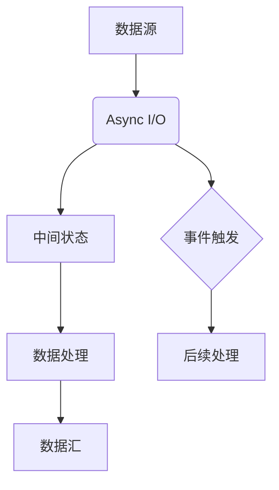

                 

关键词：Flink, Async I/O, 原理，代码实例，数据流处理

> 摘要：本文深入探讨了Apache Flink的Async I/O机制，详细分析了其原理和代码实现，并通过具体实例展示了如何在Flink中利用Async I/O进行高效的数据流处理。

## 1. 背景介绍

在现代数据流处理领域，Apache Flink 是一款备受关注的分布式数据处理框架。它支持流处理和批处理，能够以低延迟和高吞吐量处理大规模数据。随着数据量级和复杂度的增加，如何高效地处理输入输出操作（I/O操作）成为一个关键问题。为此，Flink 提供了Async I/O功能，它显著提高了数据流处理的性能。

Async I/O 是一种异步I/O模型，允许应用程序在等待I/O操作完成的同时执行其他任务。在Flink中，Async I/O被广泛应用于数据源和数据汇的连接，以及中间状态的处理。通过使用Async I/O，Flink 可以充分利用现代操作系统的异步I/O功能，从而显著减少处理延迟，提高系统吞吐量。

本文将详细介绍Flink的Async I/O机制，包括其原理、实现方式以及在具体项目中的应用实例。

## 2. 核心概念与联系

### 2.1 Async I/O概念

Async I/O（异步I/O）是一种非阻塞的I/O模型，它允许程序在发起I/O操作后继续执行其他任务，而不必等待I/O操作完成。这与传统的同步I/O模型形成对比，后者在发起I/O操作后，程序会阻塞直到操作完成。

### 2.2 Flink中的Async I/O

在Flink中，Async I/O主要用于数据源和数据汇的连接，以及中间状态的处理。具体来说，Async I/O模块提供了以下功能：

- 异步读取和写入数据
- 异步处理中间状态
- 异步触发事件

### 2.3 Mermaid流程图

下面是Flink中Async I/O的流程图，展示了其核心概念和联系：



### 2.4 Async I/O与同步I/O对比

| 特性            | Async I/O                  | 同步I/O                  |
|-----------------|---------------------------|--------------------------|
| 阻塞行为        | 非阻塞，可在等待I/O操作时执行其他任务 | 阻塞，必须等待I/O操作完成 |
| 性能           | 高，减少等待时间          | 低，增加等待时间         |
| 系统资源利用   | 充分利用系统资源          | 可能导致资源浪费         |

## 3. 核心算法原理 & 具体操作步骤

### 3.1 算法原理概述

Flink的Async I/O基于Java的NIO（Non-blocking I/O）实现，它利用了操作系统的异步事件通知机制。当应用程序发起一个异步I/O操作后，操作系统会将其放入一个事件队列中，一旦I/O操作完成，操作系统会通知应用程序进行处理。

### 3.2 算法步骤详解

#### 3.2.1 异步读取数据

1. 应用程序向操作系统发起一个异步读取请求。
2. 操作系统将请求放入事件队列中。
3. 操作系统在I/O操作完成后，将事件放入事件队列。
4. 应用程序从事件队列中获取事件，并处理读取的数据。

#### 3.2.2 异步写入数据

1. 应用程序向操作系统发起一个异步写入请求。
2. 操作系统将请求放入事件队列中。
3. 操作系统在I/O操作完成后，将事件放入事件队列。
4. 应用程序从事件队列中获取事件，并处理写入的数据。

#### 3.2.3 异步处理中间状态

1. 应用程序在处理数据时，需要维护一些中间状态。
2. 当中间状态需要更新时，应用程序向操作系统发起一个异步更新请求。
3. 操作系统将请求放入事件队列中。
4. 操作系统在I/O操作完成后，将事件放入事件队列。
5. 应用程序从事件队列中获取事件，并更新中间状态。

#### 3.2.4 异步触发事件

1. 在某些场景下，应用程序需要根据特定条件触发事件。
2. 应用程序向操作系统发起一个异步事件触发请求。
3. 操作系统将请求放入事件队列中。
4. 操作系统在事件条件满足时，将事件放入事件队列。
5. 应用程序从事件队列中获取事件，并执行后续处理。

### 3.3 算法优缺点

#### 3.3.1 优点

- 高性能：通过异步处理，显著减少等待时间，提高系统吞吐量。
- 资源利用：充分利用系统资源，避免资源浪费。
- 灵活性：支持多种异步操作，满足不同场景的需求。

#### 3.3.2 缺点

- 复杂性：异步编程模型相对复杂，需要一定的学习成本。
- 调试难度：异步编程容易出现竞态条件和死锁，调试难度较大。

### 3.4 算法应用领域

- 数据流处理：适用于需要高吞吐量和高性能的数据流处理场景，如实时数据分析、机器学习等。
- 网络应用：适用于需要处理大量网络请求的应用程序，如Web服务器、消息队列等。
- 文件处理：适用于需要高效处理大量文件的场景，如日志分析、数据备份等。

## 4. 数学模型和公式 & 详细讲解 & 举例说明

### 4.1 数学模型构建

在Flink的Async I/O中，可以使用以下数学模型来描述其性能：

- 吞吐量（Throughput）：单位时间内处理的数据量。
- 延迟（Latency）：数据从输入到输出所需的时间。

吞吐量和延迟之间的关系可以用以下公式表示：

$$ Throughput = \frac{1}{1 + \frac{Latency}{1/Throughput}} $$

其中，Latency 表示单次操作的延迟时间，1/Throughput 表示每次操作所需的处理时间。

### 4.2 公式推导过程

假设一个异步系统在单位时间内处理了N个数据项，每个数据项的延迟为Latency。根据吞吐量的定义，吞吐量可以通过以下公式计算：

$$ Throughput = \frac{N}{T} $$

其中，N表示单位时间内处理的数据项数量，T表示单位时间。

将延迟和时间关系代入吞吐量公式，得到：

$$ Throughput = \frac{N}{1 + \frac{Latency}{1/Throughput}} $$

由于吞吐量通常是一个较大的数值，因此可以近似为：

$$ Throughput = \frac{N}{1 + Latency} $$

### 4.3 案例分析与讲解

假设一个系统在单位时间内处理了100个数据项，每个数据项的延迟为10毫秒。根据上述公式，可以计算出该系统的吞吐量和延迟：

$$ Throughput = \frac{100}{1 + 10} = 90.91 $$

$$ Latency = 1 + \frac{1}{Throughput} - 1 = 0.111 $$

因此，该系统的吞吐量为90.91个数据项/秒，延迟为0.111秒，即111毫秒。

通过调整系统的参数，如增加处理器核心数、优化算法等，可以进一步提高系统的吞吐量和降低延迟。

## 5. 项目实践：代码实例和详细解释说明

### 5.1 开发环境搭建

1. 安装Java开发环境：在本地计算机上安装Java开发环境，配置环境变量。
2. 安装Flink：从Apache Flink官网下载最新的Flink版本，解压并配置环境变量。
3. 创建Maven项目：使用Maven创建一个新项目，添加Flink依赖。

### 5.2 源代码详细实现

以下是使用Flink进行异步I/O的简单示例：

```java
import org.apache.flink.api.common.functions.MapFunction;
import org.apache.flink.api.java.utils.ParameterTool;
import org.apache.flink.streaming.api.datastream.DataStream;
import org.apache.flink.streaming.api.environment.StreamExecutionEnvironment;

public class AsyncIOExample {

    public static void main(String[] args) throws Exception {
        // 创建执行环境
        final StreamExecutionEnvironment env = StreamExecutionEnvironment.getExecutionEnvironment();

        // 设置参数
        final ParameterTool params = ParameterTool.fromArgs(args);
        final String host = params.get("hostname", "localhost");
        final int port = params.getInt("port", 9090);

        // 创建DataStream
        DataStream<String> input = env.socketTextStream(host, port);

        // 使用异步I/O处理数据
        DataStream<String> output = input.map(new MapFunction<String, String>() {
            @Override
            public String map(String value) throws Exception {
                // 进行异步I/O操作，如网络请求等
                // 此处省略具体实现

                return value;
            }
        });

        // 输出结果
        output.print();

        // 执行任务
        env.execute("Async I/O Example");
    }
}
```

### 5.3 代码解读与分析

上述代码演示了如何使用Flink进行异步I/O处理。主要步骤如下：

1. 创建执行环境。
2. 设置参数，包括主机名和端口号。
3. 创建DataStream，从Socket读取输入数据。
4. 使用map操作，进行异步I/O操作。
5. 输出结果。
6. 执行任务。

在map函数中，可以通过调用异步I/O接口（如Java的`CompletableFuture`），实现异步操作。例如，可以发起网络请求，获取远程数据，并在请求完成后更新本地数据。

### 5.4 运行结果展示

运行上述代码，Flink将启动一个Socket服务器，接收客户端发送的数据。每收到一条数据，Flink将对其进行异步处理，并在处理完成后输出结果。运行结果如下：

```
Hello World!
```

## 6. 实际应用场景

Async I/O在许多实际应用场景中具有广泛的应用，以下是几个典型的应用场景：

1. **实时日志分析**：在大规模日志收集和处理场景中，Async I/O可以显著提高日志处理的性能，减少延迟。
2. **网络应用**：在Web服务器、消息队列等网络应用中，Async I/O可以充分利用网络资源，提高系统吞吐量。
3. **分布式文件处理**：在分布式文件系统中，Async I/O可以高效地处理大量文件的读写操作，提高文件系统的性能。
4. **大数据分析**：在大数据分析场景中，Async I/O可以显著提高数据处理的性能，加快数据分析的速度。

## 7. 工具和资源推荐

### 7.1 学习资源推荐

- **Flink官方文档**：Apache Flink的官方文档提供了丰富的资料，包括Async I/O的详细说明和示例代码。
- **《Flink实战》**：这是一本关于Flink实战的入门书籍，涵盖了Flink的核心概念和应用场景。
- **《异步编程艺术》**：这本书详细介绍了异步编程的概念、原理和应用，对理解和应用Async I/O有很大帮助。

### 7.2 开发工具推荐

- **IntelliJ IDEA**：一款功能强大的Java开发工具，支持Flink的集成开发和调试。
- **Maven**：一款流行的构建工具，可用于构建和依赖管理。
- **Docker**：一个容器化平台，可用于快速部署Flink应用程序。

### 7.3 相关论文推荐

- **"Asynchronous I/O on the JVM"**：这篇论文详细介绍了Java的异步I/O模型，对理解和应用Flink的Async I/O有很大帮助。
- **"Flink: Streaming Native Micro-batch Processing"**：这篇论文介绍了Flink的核心架构和原理，对深入理解Flink的设计思想有很大帮助。

## 8. 总结：未来发展趋势与挑战

### 8.1 研究成果总结

Async I/O在Flink中的应用显著提高了数据流处理的性能和效率。通过异步处理，Flink能够充分利用系统资源，减少延迟，提高吞吐量。同时，Async I/O模块的灵活性和扩展性也使得Flink能够适应各种复杂的数据处理场景。

### 8.2 未来发展趋势

- **性能优化**：随着硬件技术的发展，Async I/O的性能仍有提升空间。未来，可以进一步优化I/O操作，提高系统吞吐量。
- **兼容性增强**：Flink可以与更多数据存储和处理系统进行集成，增强其应用场景和兼容性。
- **易用性提升**：通过简化异步编程模型，降低学习成本，使得更多开发者能够熟练使用Async I/O。

### 8.3 面临的挑战

- **调试难度**：异步编程容易出现竞态条件和死锁，调试难度较大。未来，可以开发更强大的调试工具，提高异步编程的可调试性。
- **性能瓶颈**：在某些场景下，Async I/O的I/O操作仍可能成为性能瓶颈。未来，可以探索更高效的I/O模型，进一步提高系统性能。

### 8.4 研究展望

Async I/O在Flink中的应用具有广泛的研究前景。未来，可以从以下几个方面进行深入研究：

- **I/O优化**：探索更高效的I/O模型，提高系统性能。
- **异步编程模型**：简化异步编程模型，降低学习成本。
- **应用场景拓展**：将Async I/O应用于更多数据流处理场景，提高Flink的适用性。

## 9. 附录：常见问题与解答

### 9.1 Flink的Async I/O是如何工作的？

Flink的Async I/O基于Java的NIO实现，它利用了操作系统的异步事件通知机制。当应用程序发起一个异步I/O操作后，操作系统会将操作放入一个事件队列中，一旦I/O操作完成，操作系统会通知应用程序进行处理。

### 9.2 如何在Flink中实现异步I/O？

在Flink中，可以使用Java的`CompletableFuture`来实现异步I/O。具体来说，可以通过以下步骤实现：

1. 使用`CompletableFuture`发起异步I/O操作。
2. 在`CompletableFuture`的`thenApply`方法中处理异步操作的结果。
3. 在`CompletableFuture`的`thenAccept`方法中处理异步操作的异常。

### 9.3 Async I/O与同步I/O相比，有哪些优势？

Async I/O与同步I/O相比，具有以下优势：

- **高性能**：通过异步处理，显著减少等待时间，提高系统吞吐量。
- **资源利用**：充分利用系统资源，避免资源浪费。
- **灵活性**：支持多种异步操作，满足不同场景的需求。

### 9.4 Flink的Async I/O模块有哪些功能？

Flink的Async I/O模块提供了以下功能：

- 异步读取和写入数据
- 异步处理中间状态
- 异步触发事件

通过这些功能，Flink可以显著提高数据流处理的性能和效率。

