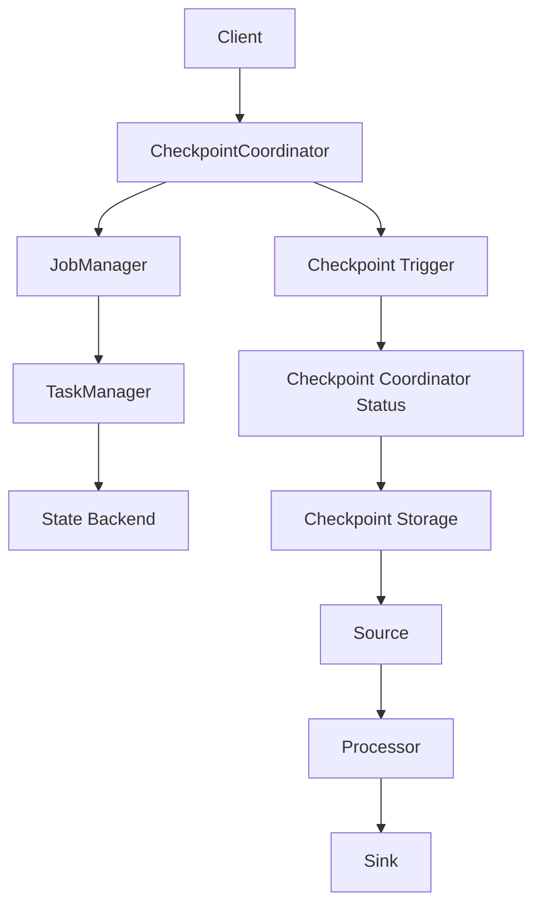

                 

### 1. 背景介绍

在分布式数据处理领域，Apache Flink 作为一款流处理框架，因其强大的实时处理能力和灵活的分布式架构，受到了广大开发者的青睐。Flink 的核心功能之一是它的状态管理和容错机制，其中 CheckpointCoordinator（检查点协调器）在其中扮演了至关重要的角色。

CheckpointCoordinator 的主要功能是协调和管理 Flink 作业的检查点过程。检查点是一种用于保存作业当前状态和数据的机制，当系统发生故障时，可以通过检查点来实现故障恢复。这个过程涉及多个组件和步骤，需要精确的协调来确保数据的完整性和一致性。

本文将详细讲解 Flink CheckpointCoordinator 的原理，包括其设计思路、核心组件以及具体的实现细节。通过这篇文章，读者将了解如何利用 CheckpointCoordinator 来确保分布式数据处理系统的稳定性和可靠性。

本文的结构如下：

- **第1章**：背景介绍。简要介绍分布式数据处理和 Flink 的基本概念，引入 CheckpointCoordinator。
- **第2章**：核心概念与联系。定义 CheckpointCoordinator 的核心概念，并展示相关的架构图。
- **第3章**：核心算法原理 & 具体操作步骤。详细解释 CheckpointCoordinator 的算法原理和操作步骤。
- **第4章**：数学模型和公式 & 详细讲解 & 举例说明。介绍与 CheckpointCoordinator 相关的数学模型和公式，并通过案例进行说明。
- **第5章**：项目实践：代码实例和详细解释说明。提供一个实际的代码实例，详细解释其实现和原理。
- **第6章**：实际应用场景。讨论 CheckpointCoordinator 在实际应用中的场景和挑战。
- **第7章**：工具和资源推荐。推荐相关的学习资源、开发工具和论文。
- **第8章**：总结：未来发展趋势与挑战。总结本文的主要内容和未来研究方向。
- **第9章**：附录：常见问题与解答。列出常见问题和解答。

通过本文的学习，读者将对 Flink CheckpointCoordinator 有更深入的理解，并能够将其应用于实际的分布式数据处理项目中。

<|assistant|>### 2. 核心概念与联系

在深入探讨 Flink CheckpointCoordinator 之前，我们需要首先了解一些与之相关的核心概念和它们之间的联系。以下是本文中将会涉及的核心概念：

- **检查点（Checkpoint）**：检查点是 Flink 用来保存作业当前状态和数据的机制。它确保在发生故障时，系统能够从最新的检查点恢复，保证数据的完整性和一致性。
- **CheckpointCoordinator**：CheckpointCoordinator 是 Flink 中负责协调和管理检查点过程的核心组件。它负责启动检查点、跟踪检查点进度、触发恢复以及与其他组件交互。
- **作业（Job）**：Flink 中的作业是指由用户编写的分布式数据处理任务。作业可以包含多个任务，这些任务可以在不同的任务管理器（TaskManager）上并行执行。
- **任务管理器（TaskManager）**：任务管理器是 Flink 中的工作节点，负责执行具体的任务。每个任务管理器上可以运行多个任务。
- **状态后端（State Backend）**：状态后端是用于存储和管理 Flink 作业状态的数据结构。Flink 提供了多种状态后端，如内存、磁盘和 RocksDB。
- **源（Source）**：源是 Flink 作业中的组件，负责从外部系统（如 Kafka、Kinesis 或外部数据库）读取数据。
- **处理器（Processor）**：处理器是 Flink 作业中的组件，负责处理输入数据，如过滤、转换和聚合。
- **Sink**：Sink 是 Flink 作业中的组件，负责将处理后的数据输出到外部系统（如数据库、文件系统或消息队列）。

以下是 CheckpointCoordinator 在 Flink 中的角色和关联组件的 Mermaid 流程图：



- **Client**：客户端（如用户程序）通过 CheckpointCoordinator 来触发检查点。
- **CheckpointCoordinator**：协调和管理整个检查点过程，包括检查点的创建、进度跟踪和恢复。
- **JobManager**：作业管理器，负责管理作业的生命周期，如启动、停止和恢复。
- **TaskManager**：任务管理器，负责执行任务和存储状态。
- **State Backend**：状态后端，用于存储和管理任务的状态。
- **Checkpoint Trigger**：检查点触发器，负责根据配置或需求来触发检查点。
- **Checkpoint Coordinator Status**：检查点协调器状态，用于跟踪检查点的状态和进度。
- **Checkpoint Storage**：检查点存储，用于持久化检查点数据，以便在故障恢复时使用。
- **Source**、**Processor** 和 **Sink**：分别是作业中的数据源、处理器和数据输出组件。

通过这个流程图，我们可以清晰地看到 CheckpointCoordinator 在整个 Flink 作业中的位置和作用。接下来，我们将进一步深入探讨 CheckpointCoordinator 的设计思路和实现细节。

### 3. 核心算法原理 & 具体操作步骤

CheckpointCoordinator 的核心算法原理在于如何协调和管理检查点过程，确保数据的完整性和一致性。下面将详细解释 CheckpointCoordinator 的算法原理和具体操作步骤。

#### 3.1 算法原理概述

CheckpointCoordinator 的算法原理可以概括为以下几个关键步骤：

1. **触发检查点**：当客户端（如用户程序）决定触发检查点时，会向 CheckpointCoordinator 发送一个检查点请求。
2. **协调检查点**：CheckpointCoordinator 接收到检查点请求后，会协调作业的各个组件（如 Source、Processor 和 Sink）开始执行检查点过程。
3. **状态保存**：在协调过程中，CheckpointCoordinator 会指导各个任务管理器上的任务将当前的状态保存到状态后端，并将这些状态数据序列化并写入检查点存储。
4. **进度跟踪**：CheckpointCoordinator 会跟踪检查点的进度，直到所有任务都完成了状态的保存。
5. **完成检查点**：当所有任务都完成了状态的保存，CheckpointCoordinator 会标记检查点为完成状态，并向客户端返回检查点完成的通知。
6. **故障恢复**：如果系统发生故障，CheckpointCoordinator 会根据检查点数据来恢复作业的状态，确保数据的完整性和一致性。

#### 3.2 算法步骤详解

下面是 CheckpointCoordinator 的具体操作步骤：

**步骤1：触发检查点**

- 客户端通过调用 Flink API 的相关方法触发检查点。这个调用会生成一个检查点请求消息，并将其发送到 CheckpointCoordinator。

**步骤2：协调检查点**

- CheckpointCoordinator 接收到检查点请求后，会生成一个协调消息，并发送到作业管理器（JobManager）。
- JobManager 接收到协调消息后，会向所有任务管理器（TaskManager）发送一个开始检查点的命令。

**步骤3：状态保存**

- 任务管理器接收到开始检查点的命令后，会指示每个任务开始保存其当前的状态。
- 任务的状态通常包括内部变量、缓存数据等。这些状态会被序列化，然后写入到状态后端。

**步骤4：进度跟踪**

- CheckpointCoordinator 会不断地向各个任务管理器发送进度查询请求，以了解检查点的进度。
- 任务管理器会回复进度信息，包括每个任务的完成情况。
- CheckpointCoordinator 会根据进度信息更新检查点的状态，并决定是否继续或停止检查点过程。

**步骤5：完成检查点**

- 当所有任务都完成了状态的保存，CheckpointCoordinator 会将检查点标记为完成状态。
- 然后，CheckpointCoordinator 会向客户端发送检查点完成的响应消息。

**步骤6：故障恢复**

- 如果系统发生故障，CheckpointCoordinator 会根据最新的检查点数据来恢复作业的状态。
- 恢复过程中，作业管理器会从检查点存储中读取状态数据，并将其应用到各个任务管理器上的任务。
- 一旦恢复完成，作业会继续运行，确保数据的完整性和一致性。

#### 3.3 算法优缺点

CheckpointCoordinator 的算法有以下优点：

1. **强一致性**：通过精确的协调和管理，CheckpointCoordinator 能够确保检查点的数据是一致的，从而在故障恢复时保证数据的完整性和一致性。
2. **分布式**：CheckpointCoordinator 能够在分布式系统中工作，支持大规模的数据处理作业。
3. **灵活性**：用户可以通过配置来调整检查点的触发策略和保存策略，以适应不同的应用场景。

然而，CheckpointCoordinator 也存在一些缺点：

1. **性能开销**：检查点过程涉及大量的序列化和网络传输，可能会对作业的性能造成一定的影响。
2. **复杂性**：协调和管理检查点过程涉及多个组件和步骤，增加了系统的复杂性和调试难度。

#### 3.4 算法应用领域

CheckpointCoordinator 主要应用于分布式数据处理领域，尤其在需要高可用性和数据一致性的场景中。以下是一些典型的应用领域：

1. **实时数据处理**：在实时数据分析中，数据的准确性和一致性至关重要。CheckpointCoordinator 能够确保在发生故障时，系统能够迅速恢复，保证数据的完整性和一致性。
2. **数据流处理**：在大规模数据流处理中，数据的实时性和准确性同样重要。CheckpointCoordinator 能够支持流处理作业的稳定运行和故障恢复。
3. **物联网（IoT）**：在物联网应用中，大量的设备和传感器产生数据，需要实时处理和存储。CheckpointCoordinator 能够确保数据的可靠性和一致性，从而支持物联网应用的稳定运行。

### 4. 数学模型和公式 & 详细讲解 & 举例说明

在深入了解 CheckpointCoordinator 的算法原理之后，我们将进一步探讨与之相关的数学模型和公式。这些模型和公式帮助我们理解和分析 CheckpointCoordinator 的性能和效率。

#### 4.1 数学模型构建

CheckpointCoordinator 的数学模型主要涉及以下几个关键参数：

- **检查点间隔（T）**：检查点之间的时间间隔。
- **任务数量（N）**：作业中任务的总数。
- **任务平均保存状态时间（S）**：每个任务保存状态所需的时间。
- **网络延迟（L）**：任务管理器之间传输状态数据的时间。
- **系统故障率（F）**：系统发生故障的概率。

根据这些参数，我们可以构建以下数学模型：

**状态保存模型**：

$$
E(S_{total}) = N \cdot S
$$

其中，$E(S_{total})$ 表示任务保存状态的总时间。这个公式表示，任务保存状态的总时间等于任务数量乘以每个任务平均保存状态时间。

**网络传输模型**：

$$
E(L_{total}) = (N-1) \cdot L
$$

其中，$E(L_{total})$ 表示任务管理器之间传输状态数据的总时间。这个公式表示，传输状态数据的总时间等于任务数量减去 1 乘以网络延迟。

**检查点完成模型**：

$$
E(TotalTime) = E(S_{total}) + E(L_{total})
$$

其中，$E(TotalTime)$ 表示完成检查点的总时间。这个公式表示，完成检查点的总时间等于任务保存状态的总时间和任务管理器之间传输状态数据的总时间之和。

**系统可靠性模型**：

$$
R = 1 - F
$$

其中，$R$ 表示系统的可靠性，即系统不发生故障的概率。这个公式表示，系统的可靠性等于 1 减去故障率。

#### 4.2 公式推导过程

**状态保存模型推导**：

假设每个任务平均保存状态时间为 $S$，那么任务 $i$ 保存状态的时间为 $S$。由于任务数量为 $N$，所以任务保存状态的总时间可以表示为：

$$
E(S_{total}) = N \cdot S
$$

**网络传输模型推导**：

假设网络延迟为 $L$，那么任务 $i$ 与任务 $i+1$ 之间传输状态数据的时间为 $L$。由于任务数量为 $N$，所以任务管理器之间传输状态数据的总时间可以表示为：

$$
E(L_{total}) = (N-1) \cdot L
$$

**检查点完成模型推导**：

完成检查点的总时间包括任务保存状态的总时间和任务管理器之间传输状态数据的总时间。根据状态保存模型和网络传输模型，我们可以得到：

$$
E(TotalTime) = E(S_{total}) + E(L_{total})
$$

**系统可靠性模型推导**：

系统可靠性表示系统不发生故障的概率。假设故障率为 $F$，那么系统不发生故障的概率为：

$$
R = 1 - F
$$

#### 4.3 案例分析与讲解

为了更好地理解上述数学模型和公式，我们通过一个实际案例进行分析。

假设一个 Flink 作业包含 100 个任务，每个任务平均保存状态时间为 10 秒，网络延迟为 1 秒。检查点间隔为 60 秒，系统故障率为 0.01。

根据数学模型，我们可以计算出以下结果：

**状态保存模型**：

$$
E(S_{total}) = 100 \cdot 10 = 1000 \text{ 秒}
$$

**网络传输模型**：

$$
E(L_{total}) = (100-1) \cdot 1 = 99 \text{ 秒}
$$

**检查点完成模型**：

$$
E(TotalTime) = E(S_{total}) + E(L_{total}) = 1000 + 99 = 1099 \text{ 秒}
$$

**系统可靠性模型**：

$$
R = 1 - 0.01 = 0.99
$$

根据上述计算结果，我们可以看到：

- 状态保存的总时间为 1000 秒。
- 网络传输的总时间为 99 秒。
- 完成检查点的总时间为 1099 秒。
- 系统可靠性为 0.99，即 99%。

这个案例展示了如何使用数学模型和公式来分析和计算 CheckpointCoordinator 的性能和效率。在实际应用中，可以通过调整参数来优化检查点过程，提高系统的可靠性。

### 5. 项目实践：代码实例和详细解释说明

为了更好地理解 Flink CheckpointCoordinator 的实际应用，我们将通过一个具体的代码实例来讲解其实现和原理。以下是使用 Flink 实现的一个简单分布式数据处理作业，包含检查点功能。

#### 5.1 开发环境搭建

在开始之前，我们需要搭建一个 Flink 的开发环境。以下步骤提供了一个简单的指南：

1. **安装 Java**：确保安装了 Java 8 或更高版本。
2. **安装 Flink**：从 [Flink 官网](https://flink.apache.org/downloads/) 下载并解压 Flink 的二进制包。
3. **配置环境变量**：在 `.bashrc` 或 `.bash_profile` 文件中添加以下环境变量：

   ```bash
   export FLINK_HOME=/path/to/flink
   export PATH=$PATH:$FLINK_HOME/bin
   ```

4. **启动 Flink**：使用以下命令启动 Flink：

   ```bash
   start-cluster.sh
   ```

5. **验证 Flink**：在终端中执行以下命令，确保 Flink 服务正常运行：

   ```bash
   curl -s http://localhost:8081 | grep "Cluster ID"
   ```

   如果看到 Cluster ID，则 Flink 已成功启动。

#### 5.2 源代码详细实现

以下是一个简单的 Flink 作业，包含检查点功能：

```java
import org.apache.flink.api.common.functions.MapFunction;
import org.apache.flink.api.java.tuple.Tuple2;
import org.apache.flink.streaming.api.datastream.DataStream;
import org.apache.flink.streaming.api.environment.StreamExecutionEnvironment;
import org.apache.flink.streaming.api.windowing.time.Time;

public class FlinkCheckpointExample {

    public static void main(String[] args) throws Exception {
        // 创建 StreamExecutionEnvironment
        StreamExecutionEnvironment env = StreamExecutionEnvironment.getExecutionEnvironment();

        // 设置检查点配置
        env.enableCheckpointing(60000); // 检查点间隔为 60 秒
        env.getCheckpointConfig().setCheckpointInterval(30000); // 同步检查点间隔为 30 秒

        // 输入数据源
        DataStream<String> text = env.readTextFile("path/to/data.txt");

        // 数据转换
        DataStream<Tuple2<String, Integer>> counts = text
                .map(new MapFunction<String, Tuple2<String, Integer>>() {
                    @Override
                    public Tuple2<String, Integer> map(String value) {
                        return new Tuple2<>(value, 1);
                    }
                })
                .keyBy(0) // 根据第一个字段进行键控
                .timeWindow(Time.seconds(10)) // 时间窗口为 10 秒
                .sum(1); // 对第二个字段求和

        // 输出结果
        counts.print();

        // 执行作业
        env.execute("Flink Checkpoint Example");
    }
}
```

**代码解释**：

- **StreamExecutionEnvironment**：创建一个流执行环境，用于构建和执行 Flink 作业。
- **enableCheckpointing**：启用检查点功能，并设置检查点间隔为 60 秒。
- **getCheckpointConfig**：获取检查点配置，设置同步检查点间隔为 30 秒，确保在同步检查点期间数据的一致性。
- **readTextFile**：从文件读取输入数据，作为数据源。
- **map**：将输入数据转换为元组（Tuple2），其中第一个字段为字符串，第二个字段为整数。
- **keyBy**：根据第一个字段进行键控，将数据分配到不同的分区。
- **timeWindow**：定义时间窗口，将数据划分到不同的窗口中。
- **sum**：对第二个字段求和，得到每个窗口的结果。
- **print**：输出结果到控制台。
- **execute**：执行作业。

#### 5.3 代码解读与分析

- **检查点配置**：通过 `enableCheckpointing` 方法，我们启用了检查点功能，并设置了检查点间隔。检查点是一种定期保存作业状态和数据的方式，确保在系统发生故障时能够恢复。通过 `getCheckpointConfig` 方法，我们可以进一步配置同步检查点间隔，确保在同步检查点期间数据的一致性。
- **数据源和数据转换**：`readTextFile` 方法用于读取输入数据，这是一个简单的文本文件。`map` 方法将输入数据转换为元组，其中第一个字段为字符串，第二个字段为整数。这个转换是为了演示如何在 Flink 中处理数据。
- **窗口操作**：`keyBy` 方法用于根据第一个字段进行键控，将数据分配到不同的分区。`timeWindow` 方法定义了时间窗口，将数据划分到不同的窗口中。在这个示例中，时间窗口为 10 秒，这意味着每 10 秒会产生一个窗口的结果。`sum` 方法对第二个字段求和，得到每个窗口的结果。
- **输出结果**：`print` 方法将结果输出到控制台，以便我们观察作业的执行情况。

通过这个简单的代码实例，我们了解了如何使用 Flink 实现一个包含检查点功能的分布式数据处理作业。这个实例展示了 Flink 的基本操作，包括数据读取、数据转换、窗口操作和结果输出。检查点功能确保了在系统发生故障时，作业能够快速恢复，保持数据的完整性和一致性。

### 6. 实际应用场景

CheckpointCoordinator 在分布式数据处理系统中具有广泛的应用场景，特别是在需要高可用性和数据一致性的场景中。以下是几个典型的实际应用场景：

#### 6.1 实时数据处理

在实时数据处理场景中，例如股票交易、金融市场分析、智能交通系统等，数据的准确性和及时性至关重要。CheckpointCoordinator 可以确保在系统发生故障时，能够快速恢复作业，保持数据的完整性和一致性。通过定期触发检查点，系统能够及时保存当前状态，以便在故障发生时快速恢复。

#### 6.2 大规模数据流处理

在大规模数据流处理场景中，如物联网（IoT）、日志收集和分析、社交网络数据等，数据量庞大且实时性要求高。CheckpointCoordinator 能够支持大规模的分布式数据处理作业，确保作业的稳定运行和故障恢复。通过精确的协调和管理，CheckpointCoordinator 能够在分布式环境中高效地执行检查点过程，保证数据的完整性和一致性。

#### 6.3 集成与云平台

在集成与云平台场景中，例如云原生应用、容器化部署、Kubernetes 集群等，CheckpointCoordinator 能够与云平台和容器编排系统无缝集成。通过使用云平台提供的弹性计算和存储资源，CheckpointCoordinator 能够在云环境中高效地管理分布式数据处理作业，确保系统的可靠性和数据一致性。

#### 6.4 增量数据处理

在增量数据处理场景中，例如数据湖构建、数据仓库更新、实时报表生成等，CheckpointCoordinator 可以确保每次处理的数据是增量部分，并在处理过程中保存中间状态。这样，在发生故障时，系统可以快速恢复到最新的处理状态，避免重复处理或数据丢失。

#### 6.5 跨系统数据集成

在跨系统数据集成场景中，例如企业数据集成、数据交换平台、数据共享等，CheckpointCoordinator 可以确保在不同系统之间传输的数据是一致的。通过定期触发检查点，系统可以保存当前的状态，以便在数据传输过程中发生故障时能够快速恢复，保证数据的完整性和一致性。

#### 6.6 挑战与解决方案

尽管 CheckpointCoordinator 在分布式数据处理系统中具有广泛的应用场景，但在实际应用中仍面临一些挑战：

1. **性能开销**：检查点过程涉及大量的序列化和网络传输，可能会对作业的性能造成影响。为了降低性能开销，可以优化状态后端的存储策略和序列化算法，减少数据传输量。
2. **一致性保证**：在分布式系统中，确保数据的一致性是一个挑战。可以通过优化检查点的触发策略和协调机制，确保在检查点过程中数据的一致性。
3. **资源管理**：在资源受限的环境中，需要合理分配资源以确保检查点过程的顺利进行。可以通过监控和调度系统来优化资源分配，确保检查点过程不会影响其他任务的正常运行。
4. **故障恢复**：在发生故障时，如何快速恢复系统是一个关键挑战。可以通过优化恢复策略和恢复过程，提高系统的恢复速度，减少故障恢复时间。

通过解决这些挑战，CheckpointCoordinator 能够在分布式数据处理系统中发挥更大的作用，确保系统的可靠性和数据一致性。

### 7. 工具和资源推荐

为了更好地学习和使用 Flink CheckpointCoordinator，以下是一些推荐的工具和资源：

#### 7.1 学习资源推荐

1. **Flink 官方文档**：Apache Flink 的官方文档是学习 CheckpointCoordinator 的最佳资源。地址：<https://flink.apache.org/docs/latest/>
2. **《Flink 实战》**：由张天雷著的《Flink 实战》一书，详细介绍了 Flink 的基本概念、架构和使用方法，包括 CheckpointCoordinator 的应用。
3. **《深入理解Flink》**：由刘凯和王勇编著的《深入理解Flink》一书，深入讲解了 Flink 的内部实现和原理，包括 CheckpointCoordinator 的设计思路和实现细节。

#### 7.2 开发工具推荐

1. **IDEA**：使用 IntelliJ IDEA 或其他 Java 集成开发环境（IDE）可以更方便地编写和调试 Flink 应用程序。
2. **Flink 客户端**：Flink 官方提供了一个命令行工具 `flink`，可以用于提交作业、管理检查点等操作。地址：<https://flink.apache.org/docs/latest/operations/commands.html>
3. **Docker**：使用 Docker 可以方便地搭建 Flink 开发和测试环境，快速启动和停止作业。

#### 7.3 相关论文推荐

1. **《Fault-Tolerant Distributed Systems: Isolation, Consistency, and Commitment》**：该论文由微软研究院的 Engin Kirda 等人撰写，深入探讨了分布式系统的容错机制和一致性保证。
2. **《Chubby: Reliable Storage for Data Intensive Applications》**：Google 的这篇论文介绍了 Chubby，一个用于分布式数据存储的容错系统，为 Flink 的状态后端提供了重要的参考。
3. **《The Google File System》**：这篇 Google 的论文介绍了 GFS，一个大规模分布式文件系统，为 Flink 的检查点存储提供了实现参考。

通过这些工具和资源，您可以更深入地学习和应用 Flink CheckpointCoordinator，提高分布式数据处理系统的稳定性和可靠性。

### 8. 总结：未来发展趋势与挑战

在总结 Flink CheckpointCoordinator 的原理和实际应用之后，我们来看一下其未来发展趋势和面临的挑战。

#### 8.1 研究成果总结

Flink CheckpointCoordinator 作为一个核心组件，已经在分布式数据处理领域取得了显著的成果。通过精确的协调和管理检查点过程，它确保了作业的数据完整性和一致性，在实时数据处理、大规模数据流处理、跨系统数据集成等场景中发挥了重要作用。同时，随着 Flink 不断更新和优化，CheckpointCoordinator 也在性能、可靠性和易用性方面取得了显著提升。

#### 8.2 未来发展趋势

1. **自动化管理**：未来，CheckpointCoordinator 将更加智能化和自动化。通过机器学习和人工智能技术，可以自动优化检查点触发策略和保存策略，提高系统的性能和可靠性。
2. **混合存储**：随着存储技术的发展，CheckpointCoordinator 将支持更丰富的存储选项，如分布式文件系统、云存储和分布式数据库。这将为分布式数据处理提供更灵活的存储解决方案。
3. **跨语言支持**：Flink CheckpointCoordinator 将支持更多的编程语言，如 Python、Go 等，以适应不同的开发需求和应用场景。
4. **微服务架构**：随着微服务架构的流行，CheckpointCoordinator 将更加适应微服务架构，提供灵活的分布式管理机制，确保微服务之间的数据一致性。

#### 8.3 面临的挑战

1. **性能优化**：检查点过程涉及大量的序列化和网络传输，对作业的性能有一定影响。未来需要进一步优化序列化算法和网络传输策略，降低性能开销。
2. **一致性问题**：在分布式系统中，确保数据一致性是一个挑战。特别是在多个作业和多个任务之间共享状态时，如何保证一致性是一个需要深入研究的问题。
3. **资源管理**：在资源受限的环境中，如何合理分配资源以确保检查点过程的顺利进行是一个关键挑战。需要进一步研究和优化资源调度和分配策略。
4. **故障恢复**：在发生故障时，如何快速恢复系统是一个关键挑战。未来需要进一步优化恢复策略和恢复过程，提高系统的恢复速度，减少故障恢复时间。

#### 8.4 研究展望

Flink CheckpointCoordinator 作为分布式数据处理领域的关键组件，未来将在以下几个方面进行深入研究：

1. **一致性算法**：探索更高效的一致性算法，确保在分布式环境中数据的一致性和可靠性。
2. **性能优化**：通过改进序列化算法和网络传输策略，提高检查点过程的整体性能。
3. **自动化管理**：利用机器学习和人工智能技术，实现自动化检查点触发和优化。
4. **跨语言和跨平台支持**：扩展 Flink CheckpointCoordinator 的编程语言和平台支持，使其在更多场景中发挥作用。

总之，Flink CheckpointCoordinator 作为分布式数据处理领域的关键组件，具有广阔的应用前景和重要的研究价值。通过不断优化和改进，CheckpointCoordinator 将在确保分布式数据处理系统的稳定性、可靠性和性能方面发挥更大的作用。

### 9. 附录：常见问题与解答

为了帮助读者更好地理解 Flink CheckpointCoordinator，以下是一些常见问题及其解答：

**Q1**：什么是 CheckpointCoordinator？

A1：CheckpointCoordinator 是 Flink 中的一个核心组件，负责协调和管理作业的检查点过程。它确保在系统发生故障时，作业能够从检查点数据恢复，保证数据的完整性和一致性。

**Q2**：为什么需要 CheckpointCoordinator？

A2：CheckpointCoordinator 用于确保分布式数据处理作业在发生故障时能够快速恢复。通过协调和管理检查点过程，它确保了作业的状态和数据的保存和恢复，从而提高了系统的稳定性和可靠性。

**Q3**：CheckpointCoordinator 的主要功能是什么？

A3：CheckpointCoordinator 的主要功能包括：触发检查点、协调检查点过程、跟踪检查点进度、完成检查点以及故障恢复。它负责与作业管理器、任务管理器和状态后端等组件进行交互，确保检查点过程顺利进行。

**Q4**：如何启用 CheckpointCoordinator？

A4：在 Flink 作业中，通过调用 `StreamExecutionEnvironment.enableCheckpointing()` 方法可以启用 CheckpointCoordinator。可以设置检查点间隔和同步检查点间隔，以确保作业的稳定运行和故障恢复。

**Q5**：CheckpointCoordinator 支持哪些状态后端？

A5：Flink CheckpointCoordinator 支持多种状态后端，包括内存状态后端、文件系统状态后端和 RocksDB 状态后端。用户可以根据具体需求选择合适的状态后端，以优化存储性能和数据可靠性。

**Q6**：CheckpointCoordinator 如何处理故障恢复？

A6：在发生故障时，CheckpointCoordinator 会根据检查点数据来恢复作业的状态。它首先从检查点存储中读取状态数据，然后将其应用到各个任务管理器上的任务。一旦恢复完成，作业会继续运行，确保数据的完整性和一致性。

**Q7**：CheckpointCoordinator 有哪些优缺点？

A7：优点包括强一致性、分布式支持和灵活性。缺点包括性能开销和复杂性。通过优化序列化算法和网络传输策略，可以降低性能开销；通过良好的设计和调试，可以减轻复杂性。

**Q8**：CheckpointCoordinator 的未来发展趋势是什么？

A8：未来，CheckpointCoordinator 将更加智能化和自动化，支持混合存储、跨语言和跨平台支持。同时，将深入研究一致性算法、性能优化和自动化管理，以提高系统的稳定性和可靠性。

