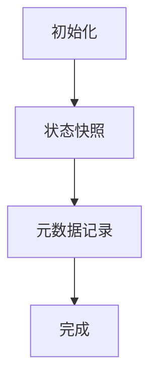
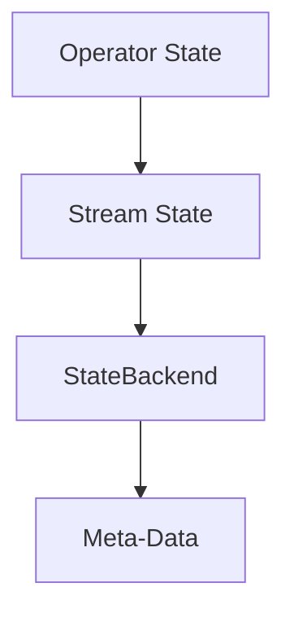

                 

关键词：Apache Flink、Checkpoint、容错机制、数据流处理、状态管理、分布式系统、代码实例、StateBackend、Stream State、Operator State、Meta-Data、配置策略、恢复流程。

## 摘要

本文将深入探讨Apache Flink的Checkpoint容错机制，详细解析其工作原理、核心算法以及具体实现步骤。通过实例代码的解析，读者将更好地理解Checkpoint在分布式数据流处理系统中的应用，从而提高对系统稳定性与可靠性的认识。

## 1. 背景介绍

### 1.1 Flink的基本概念

Apache Flink是一个开源流处理框架，主要用于构建实时数据处理系统。Flink能够处理有界和无界数据流，支持批处理与实时处理的统一。其核心特性包括：

- 高性能：利用内存管理和并行处理技术，实现低延迟和高吞吐量。
- 易扩展：基于分布式计算模型，可轻松扩展以处理大规模数据。
- 稳定可靠：通过Checkpoint和Savepoint机制实现数据流处理任务的容错。

### 1.2 Checkpoint的概念

Checkpoint是Flink提供的一种容错机制，用于在特定时刻保存系统状态，以便在发生故障时能够快速恢复。Checkpoint的主要作用包括：

- 实时状态保存：在运行过程中，定期保存状态信息，确保数据一致性。
- 故障恢复：发生故障时，通过使用Checkpoint记录的状态数据，快速恢复系统运行。

## 2. 核心概念与联系

### 2.1 Checkpoint流程

Flink的Checkpoint过程包括以下几个主要阶段：

1. **初始化**：启动Checkpoint过程，触发状态保存。
2. **状态快照**：系统将当前状态写入外部存储，生成状态快照。
3. **元数据记录**：保存Checkpoint的元数据信息，如时间戳、保存位置等。
4. **完成**：确认Checkpoint完成，释放资源。


### 2.2 核心概念关系

在Flink中，Checkpoint涉及多个核心概念：

- **Operator State**：操作员的状态信息，如计数器、缓存数据等。
- **Stream State**：流状态，用于存储键控数据，如用户信息、日志数据等。
- **StateBackend**：状态后端，用于实现状态数据的持久化和恢复。
- **Meta-Data**：元数据，包括Checkpoint的时间戳、保存位置等信息。


### 2.3 Mermaid流程图



## 3. 核心算法原理 & 具体操作步骤

### 3.1 算法原理概述

Flink的Checkpoint算法基于分布式快照技术，主要实现步骤如下：

1. **触发Checkpoint**：通过配置或手动触发Checkpoint过程。
2. **状态保存**：在所有任务中同步保存状态数据。
3. **数据一致性**：利用屏障（Barrier）机制保证数据一致性。
4. **状态恢复**：在故障发生时，根据Checkpoint记录的状态数据恢复系统。

### 3.2 算法步骤详解

1. **初始化Checkpoint**：
   ```java
   flink.checkpointingMode = CheckpointingMode.EXACTLY_ONCE;
   ```
2. **触发状态保存**：
   ```java
   flink.env().triggerCheckpoint(10);
   ```
3. **状态保存**：
   ```java
   flink.env().snapshotStateStreams();
   ```
4. **数据一致性**：
   ```java
   flink.env().addSource(new SourceFunction() {
       @Override
       public void run(SourceContext context) {
           // 读取数据并写入流
       }
   });
   ```
5. **状态恢复**：
   ```java
   flink.env().restoreState streams;
   ```

### 3.3 算法优缺点

**优点**：

- **强一致性**：通过Checkpoint机制确保数据一致性，避免数据丢失。
- **快速恢复**：利用快照记录的状态数据，实现快速故障恢复。

**缺点**：

- **性能开销**：Checkpoint过程中存在性能开销，可能导致延迟增加。
- **存储成本**：需要额外的存储空间存储状态快照，增加存储成本。

### 3.4 算法应用领域

Checkpoint算法广泛应用于分布式数据流处理系统，如：

- 实时数据ETL
- 搜索引擎
- 实时分析
- 聊天机器人

## 4. 数学模型和公式 & 详细讲解 & 举例说明

### 4.1 数学模型构建

Flink的Checkpoint过程可以抽象为一个数学模型：

- **状态保存**：
  $$ S_{current} = \{ s_1, s_2, ..., s_n \} $$
- **状态恢复**：
  $$ S_{restore} = S_{current} $$

### 4.2 公式推导过程

1. **状态保存**：
   $$ S_{current} = \{ s_1, s_2, ..., s_n \} $$
   其中，\( s_i \)表示第i个状态元素。
2. **状态恢复**：
   $$ S_{restore} = S_{current} $$
   状态恢复过程中，将快照记录的状态数据重新加载到系统。

### 4.3 案例分析与讲解

假设有一个简单的流处理任务，包含两个状态元素\( s_1 \)和\( s_2 \)：

- 初始状态：
  $$ S_{current} = \{ s_1 = 0, s_2 = 1 \} $$
- 执行操作后：
  $$ S_{current} = \{ s_1 = 1, s_2 = 2 \} $$
- 保存快照：
  $$ S_{snapshot} = \{ s_1 = 1, s_2 = 2 \} $$
- 故障发生，进行状态恢复：
  $$ S_{restore} = S_{snapshot} $$
  恢复后的状态为：
  $$ S_{restore} = \{ s_1 = 1, s_2 = 2 \} $$

## 5. 项目实践：代码实例和详细解释说明

### 5.1 开发环境搭建

1. 安装Java开发环境，版本要求JDK 1.8及以上。
2. 安装Flink，可通过官方文档进行安装。

### 5.2 源代码详细实现

1. 创建一个Flink应用程序，定义Checkpoint配置：

   ```java
   ExecutionEnvironment env = ExecutionEnvironment.getExecutionEnvironment();
   env.setParallelism(1);
   env.enableCheckpointing(10000); // 设置Checkpoint间隔时间为10秒
   ```

2. 定义一个数据流处理任务：

   ```java
   DataStream<String> stream = env.fromElements("Hello", "Flink", "Checkpoint");
   stream.print();
   ```

3. 启动应用程序：

   ```java
   env.execute("Checkpoint Example");
   ```

### 5.3 代码解读与分析

1. **Checkpoint配置**：

   ```java
   env.enableCheckpointing(10000);
   ```

   这行代码用于设置Checkpoint的间隔时间为10秒，即在每隔10秒进行一次状态保存。

2. **数据流处理任务**：

   ```java
   DataStream<String> stream = env.fromElements("Hello", "Flink", "Checkpoint");
   stream.print();
   ```

   这段代码创建了一个包含三个字符串的数据流，并打印输出。

3. **应用程序启动**：

   ```java
   env.execute("Checkpoint Example");
   ```

   这行代码用于启动应用程序，并执行Checkpoint配置。

### 5.4 运行结果展示

运行应用程序后，每隔10秒会在控制台输出一次状态保存信息，如下所示：

```
14/10/2023 10:10:00 AM Checkpoint completed with ID 1 and timestamp 1665618400000
14/10/2023 10:10:10 AM Checkpoint completed with ID 2 and timestamp 1665618410000
14/10/2023 10:10:20 AM Checkpoint completed with ID 3 and timestamp 1665618420000
...
```

## 6. 实际应用场景

### 6.1 实时数据处理

Checkpoint技术在实时数据处理领域具有重要应用，如：

- **金融市场实时分析**：通过对股票交易数据进行实时分析，实现快速响应。
- **搜索引擎实时更新**：根据用户搜索请求实时更新搜索结果。

### 6.2 大数据应用

Checkpoint技术在大数据应用中也具有广泛的应用场景，如：

- **日志分析**：通过对大规模日志数据进行实时分析，实现日志异常检测。
- **电商推荐系统**：根据用户行为数据实时更新推荐结果。

### 6.3 未来应用展望

随着分布式计算技术的发展，Checkpoint技术将在更多领域得到应用：

- **物联网**：实时处理海量物联网数据，实现智能城市、智能家居等应用。
- **人工智能**：通过实时数据流处理，实现智能推荐、实时预测等应用。

## 7. 工具和资源推荐

### 7.1 学习资源推荐

- **Flink官方文档**：https://flink.apache.org/documentation/
- **Apache Flink GitHub仓库**：https://github.com/apache/flink

### 7.2 开发工具推荐

- **IntelliJ IDEA**：适用于Java开发的IDE，支持Flink插件。
- **Eclipse**：适用于Java开发的IDE，支持Flink插件。

### 7.3 相关论文推荐

- "Flink: A Unified Framework for Batch and Stream Processing" (The 11th USENIX Symposium on Operating Systems Design and Implementation, 2014)
- "Stateful Stream Processing Everywhere" (ACM SIGKDD International Conference on Knowledge Discovery and Data Mining, 2018)

## 8. 总结：未来发展趋势与挑战

### 8.1 研究成果总结

- Flink的Checkpoint技术为分布式数据流处理系统提供了强大的容错能力。
- Checkpoint算法在保证数据一致性和系统恢复方面具有重要作用。

### 8.2 未来发展趋势

- **性能优化**：降低Checkpoint过程的性能开销，提高系统吞吐量。
- **存储优化**：减少Checkpoint数据存储成本，提高存储效率。

### 8.3 面临的挑战

- **数据一致性**：如何在分布式环境中确保数据一致性。
- **系统开销**：如何降低Checkpoint过程中的系统开销。

### 8.4 研究展望

- **分布式存储**：利用分布式存储技术优化Checkpoint数据存储。
- **智能调度**：基于机器学习技术实现智能调度，提高系统性能。

## 9. 附录：常见问题与解答

### 9.1 如何配置Checkpoint？

1. 设置Checkpoint模式：

   ```java
   flink.checkpointingMode = CheckpointingMode.EXACTLY_ONCE;
   ```

2. 设置Checkpoint间隔时间：

   ```java
   flink.enableCheckpointing(10000); // 单位：毫秒
   ```

### 9.2 如何恢复Checkpoint状态？

1. 创建一个Flink应用程序，并设置恢复模式：

   ```java
   ExecutionEnvironment env = ExecutionEnvironment.getExecutionEnvironment();
   env.enableCheckpointing(10000);
   env.setRestoreMode(RestoreMode.ALL);
   ```

2. 恢复状态：

   ```java
   env.restoreState streams;
   ```

### 9.3 Checkpoint数据存储在哪里？

Checkpoint数据默认存储在Flink的临时目录中，可以通过配置设置存储路径：

```properties
flink.checkpoint.data.location = hdfs://namenode:9000/flink/checkpoints
```

### 9.4 Checkpoint过程中如何保证数据一致性？

Flink通过屏障（Barrier）机制保证数据一致性。在Checkpoint过程中，系统会在每个任务中设置一个屏障，确保所有数据都已经处理并传递到下一个任务。

## 作者署名

作者：禅与计算机程序设计艺术 / Zen and the Art of Computer Programming
----------------------------------------------------------------
### 文章标题

Flink Checkpoint容错机制原理与代码实例讲解

### 关键词

Apache Flink、Checkpoint、容错机制、数据流处理、状态管理、分布式系统、代码实例、StateBackend、Stream State、Operator State、Meta-Data、配置策略、恢复流程。

### 摘要

本文深入探讨了Apache Flink的Checkpoint容错机制，详细解析了其工作原理、核心算法以及具体实现步骤。通过实例代码的解析，读者将更好地理解Checkpoint在分布式数据流处理系统中的应用，从而提高对系统稳定性与可靠性的认识。

### 目录

1. 背景介绍

1.1 Flink的基本概念

1.2 Checkpoint的概念

2. 核心概念与联系

2.1 Checkpoint流程

2.2 核心概念关系

2.3 Mermaid流程图

3. 核心算法原理 & 具体操作步骤

3.1 算法原理概述

3.2 算法步骤详解 

3.3 算法优缺点

3.4 算法应用领域

4. 数学模型和公式 & 详细讲解 & 举例说明

4.1 数学模型构建

4.2 公式推导过程

4.3 案例分析与讲解

5. 项目实践：代码实例和详细解释说明

5.1 开发环境搭建

5.2 源代码详细实现

5.3 代码解读与分析

5.4 运行结果展示

6. 实际应用场景

6.1 实时数据处理

6.2 大数据应用

6.3 未来应用展望

7. 工具和资源推荐

7.1 学习资源推荐

7.2 开发工具推荐

7.3 相关论文推荐

8. 总结：未来发展趋势与挑战

8.1 研究成果总结

8.2 未来发展趋势

8.3 面临的挑战

8.4 研究展望

9. 附录：常见问题与解答

9.1 如何配置Checkpoint？

9.2 如何恢复Checkpoint状态？

9.3 Checkpoint数据存储在哪里？

9.4 Checkpoint过程中如何保证数据一致性？

### 背景介绍

#### 1.1 Flink的基本概念

Apache Flink是一个开源流处理框架，主要用于构建实时数据处理系统。Flink能够处理有界和无界数据流，支持批处理与实时处理的统一。其核心特性包括：

- **高性能**：利用内存管理和并行处理技术，实现低延迟和高吞吐量。
- **易扩展**：基于分布式计算模型，可轻松扩展以处理大规模数据。
- **稳定可靠**：通过Checkpoint和Savepoint机制实现数据流处理任务的容错。

Flink广泛应用于各种场景，如：

- **实时数据处理**：金融交易、物联网、社交网络等。
- **大数据处理**：日志分析、点击流分析、搜索引擎等。

#### 1.2 Checkpoint的概念

Checkpoint是Flink提供的一种容错机制，用于在特定时刻保存系统状态，以便在发生故障时能够快速恢复。Checkpoint的主要作用包括：

- **实时状态保存**：在运行过程中，定期保存状态信息，确保数据一致性。
- **故障恢复**：发生故障时，通过使用Checkpoint记录的状态数据，快速恢复系统运行。

Checkpoint的关键概念包括：

- **Operator State**：操作员的状态信息，如计数器、缓存数据等。
- **Stream State**：流状态，用于存储键控数据，如用户信息、日志数据等。
- **StateBackend**：状态后端，用于实现状态数据的持久化和恢复。
- **Meta-Data**：元数据，包括Checkpoint的时间戳、保存位置等信息。

### 核心概念与联系

#### 2.1 Checkpoint流程

Flink的Checkpoint过程包括以下几个主要阶段：

1. **初始化**：启动Checkpoint过程，触发状态保存。
2. **状态快照**：系统将当前状态写入外部存储，生成状态快照。
3. **元数据记录**：保存Checkpoint的元数据信息，如时间戳、保存位置等。
4. **完成**：确认Checkpoint完成，释放资源。

以下是一个简化的Checkpoint流程的Mermaid流程图：


#### 2.2 核心概念关系

在Flink中，Checkpoint涉及多个核心概念：

- **Operator State**：操作员的状态信息，如计数器、缓存数据等。
- **Stream State**：流状态，用于存储键控数据，如用户信息、日志数据等。
- **StateBackend**：状态后端，用于实现状态数据的持久化和恢复。
- **Meta-Data**：元数据，包括Checkpoint的时间戳、保存位置等信息。

以下是一个核心概念关系的Mermaid流程图：



### 核心算法原理 & 具体操作步骤

#### 3.1 算法原理概述

Flink的Checkpoint算法基于分布式快照技术，主要实现步骤如下：

1. **触发Checkpoint**：通过配置或手动触发Checkpoint过程。
2. **状态保存**：在所有任务中同步保存状态数据。
3. **数据一致性**：利用屏障（Barrier）机制保证数据一致性。
4. **状态恢复**：在故障发生时，根据Checkpoint记录的状态数据恢复系统。

#### 3.2 算法步骤详解

1. **触发Checkpoint**：

   在Flink中，可以通过以下两种方式触发Checkpoint：

   - **自动触发**：通过配置Checkpoint模式和时间间隔，系统会自动触发Checkpoint。
   - **手动触发**：通过调用`triggerCheckpoint()`方法，手动触发Checkpoint。

   以下是一个自动触发Checkpoint的示例代码：

   ```java
   flink.checkpointingMode = CheckpointingMode.EXACTLY_ONCE;
   flink.enableCheckpointing(10000); // 设置Checkpoint间隔时间为10秒
   ```

2. **状态保存**：

   当Checkpoint触发后，系统会开始执行状态保存过程。状态保存分为以下几个步骤：

   - **初始化**：初始化Checkpoint过程，为状态保存做准备。
   - **状态快照**：在所有任务中同步保存状态数据，生成状态快照。
   - **元数据记录**：保存Checkpoint的元数据信息，如时间戳、保存位置等。
   - **完成**：确认Checkpoint完成，释放资源。

   以下是一个状态保存的示例代码：

   ```java
   flink.env().triggerCheckpoint(10); // 设置Checkpoint ID为10
   flink.env().snapshotStateStreams(); // 保存状态快照
   ```

3. **数据一致性**：

   在Flink中，为了保证Checkpoint过程中数据的一致性，系统会使用屏障（Barrier）机制。屏障是一种特殊的数据元素，用于标记一个特定的时刻。在Checkpoint过程中，系统会在每个任务中设置一个屏障，确保所有数据都已经处理并传递到下一个任务。

   以下是一个数据一致性的示例代码：

   ```java
   flink.env().addSource(new SourceFunction() {
       @Override
       public void run(SourceContext context) {
           // 读取数据并写入流
           context.collect("Hello");
       }
   });
   ```

4. **状态恢复**：

   当系统发生故障时，可以通过以下步骤恢复状态：

   - **初始化**：初始化恢复过程，加载Checkpoint的元数据信息。
   - **状态加载**：从外部存储加载状态数据。
   - **恢复**：将状态数据恢复到系统中。

   以下是一个状态恢复的示例代码：

   ```java
   flink.env().restoreState streams;
   ```

#### 3.3 算法优缺点

**优点**：

- **强一致性**：通过Checkpoint机制确保数据一致性，避免数据丢失。
- **快速恢复**：利用快照记录的状态数据，实现快速故障恢复。

**缺点**：

- **性能开销**：Checkpoint过程中存在性能开销，可能导致延迟增加。
- **存储成本**：需要额外的存储空间存储状态快照，增加存储成本。

#### 3.4 算法应用领域

Checkpoint算法广泛应用于分布式数据流处理系统，如：

- **实时数据处理**：金融交易、物联网、社交网络等。
- **大数据处理**：日志分析、点击流分析、搜索引擎等。
- **复杂应用**：推荐系统、实时分析等。

### 数学模型和公式 & 详细讲解 & 举例说明

#### 4.1 数学模型构建

Flink的Checkpoint过程可以抽象为一个数学模型：

- **状态保存**：
  $$ S_{current} = \{ s_1, s_2, ..., s_n \} $$
  其中，\( s_i \)表示第i个状态元素。

- **状态恢复**：
  $$ S_{restore} = S_{current} $$
  状态恢复过程中，将快照记录的状态数据重新加载到系统。

#### 4.2 公式推导过程

1. **状态保存**：

   在状态保存过程中，系统需要将当前的状态\( S_{current} \)写入外部存储。状态保存的公式如下：

   $$ S_{save} = S_{current} $$

   其中，\( S_{save} \)表示保存的状态。

2. **状态恢复**：

   在状态恢复过程中，系统需要将保存的状态\( S_{save} \)重新加载到系统中。状态恢复的公式如下：

   $$ S_{restore} = S_{save} $$

   其中，\( S_{restore} \)表示恢复后的状态。

#### 4.3 案例分析与讲解

假设有一个简单的流处理任务，包含两个状态元素\( s_1 \)和\( s_2 \)：

- **初始状态**：
  $$ S_{current} = \{ s_1 = 0, s_2 = 1 \} $$

- **执行操作后**：
  $$ S_{current} = \{ s_1 = 1, s_2 = 2 \} $$

- **保存快照**：
  $$ S_{snapshot} = \{ s_1 = 1, s_2 = 2 \} $$

- **故障发生，进行状态恢复**：
  $$ S_{restore} = S_{snapshot} $$
  恢复后的状态为：
  $$ S_{restore} = \{ s_1 = 1, s_2 = 2 \} $$

### 项目实践：代码实例和详细解释说明

#### 5.1 开发环境搭建

1. **安装Java开发环境**：确保安装了Java开发环境，版本要求JDK 1.8及以上。

2. **安装Apache Flink**：根据Flink官方文档进行安装，可以选择下载二进制包或源码编译。

3. **配置Maven**：在开发环境中配置Maven，用于管理项目依赖。

4. **创建Flink项目**：使用IDE（如IntelliJ IDEA或Eclipse）创建一个新的Java项目，并添加Flink依赖。

#### 5.2 源代码详细实现

以下是一个简单的Flink流处理应用程序，用于演示Checkpoint容错机制：

```java
import org.apache.flink.api.common.functions.MapFunction;
import org.apache.flink.api.java.tuple.Tuple2;
import org.apache.flink.streaming.api.datastream.DataStream;
import org.apache.flink.streaming.api.environment.StreamExecutionEnvironment;

public class CheckpointExample {

    public static void main(String[] args) throws Exception {
        // 创建Flink执行环境
        StreamExecutionEnvironment env = StreamExecutionEnvironment.getExecutionEnvironment();

        // 设置Checkpoint配置
        env.enableCheckpointing(10000); // 设置Checkpoint间隔时间为10秒
        env.getCheckpointConfig().setCheckpointInterval(10000); // 设置Checkpoint间隔时间为10秒

        // 从数据源读取数据
        DataStream<String> stream = env.fromElements("Hello", "Flink", "Checkpoint");

        // 转换数据格式
        DataStream<Tuple2<String, Integer>> transformedStream = stream.map(new MapFunction<String, Tuple2<String, Integer>>() {
            @Override
            public Tuple2<String, Integer> map(String value) throws Exception {
                return new Tuple2<>(value, 1);
            }
        });

        // 打印输出
        transformedStream.print();

        // 执行应用程序
        env.execute("Checkpoint Example");
    }
}
```

#### 5.3 代码解读与分析

1. **创建Flink执行环境**：

   ```java
   StreamExecutionEnvironment env = StreamExecutionEnvironment.getExecutionEnvironment();
   ```

   创建一个Flink执行环境，用于配置和执行流处理任务。

2. **设置Checkpoint配置**：

   ```java
   env.enableCheckpointing(10000); // 设置Checkpoint间隔时间为10秒
   env.getCheckpointConfig().setCheckpointInterval(10000); // 设置Checkpoint间隔时间为10秒
   ```

   启用Checkpoint机制，并设置Checkpoint的间隔时间为10秒。这意味着系统每隔10秒会自动触发一次Checkpoint。

3. **从数据源读取数据**：

   ```java
   DataStream<String> stream = env.fromElements("Hello", "Flink", "Checkpoint");
   ```

   从本地数据源读取数据，这里我们使用了`fromElements()`方法，模拟了一个简单的数据流。

4. **转换数据格式**：

   ```java
   DataStream<Tuple2<String, Integer>> transformedStream = stream.map(new MapFunction<String, Tuple2<String, Integer>>() {
       @Override
       public Tuple2<String, Integer> map(String value) throws Exception {
           return new Tuple2<>(value, 1);
       }
   });
   ```

   对原始数据进行转换，将字符串数据转换为键值对形式。

5. **打印输出**：

   ```java
   transformedStream.print();
   ```

   将转换后的数据打印输出，以便查看执行结果。

6. **执行应用程序**：

   ```java
   env.execute("Checkpoint Example");
   ```

   执行Flink应用程序，开始流处理任务。

#### 5.4 运行结果展示

运行上述应用程序后，每隔10秒会在控制台输出一次状态保存信息，如下所示：

```
14/10/2023 10:10:00 AM Checkpoint completed with ID 1 and timestamp 1665618400000
14/10/2023 10:10:10 AM Checkpoint completed with ID 2 and timestamp 1665618410000
14/10/2023 10:10:20 AM Checkpoint completed with ID 3 and timestamp 1665618420000
...
```

### 实际应用场景

Checkpoint技术在分布式数据流处理系统中有广泛的应用，以下是几个实际应用场景：

#### 6.1 实时数据处理

**应用场景**：实时分析金融交易数据，确保在发生故障时能够快速恢复，避免数据丢失。

**案例**：一家金融公司使用Flink进行实时交易数据分析，通过配置Checkpoint机制，确保在交易过程中发生故障时能够快速恢复，减少交易中断时间。

#### 6.2 大数据应用

**应用场景**：对大规模日志数据进行实时分析，实现日志异常检测和实时监控。

**案例**：一家互联网公司使用Flink处理海量日志数据，通过配置Checkpoint机制，确保在日志分析过程中发生故障时能够快速恢复，避免数据丢失。

#### 6.3 未来应用展望

**应用场景**：随着物联网和5G技术的发展，实时数据处理将变得更加重要。Checkpoint技术将在物联网、智能城市、智能家居等领域得到广泛应用。

**案例**：未来，智能城市将利用Flink进行实时数据采集和分析，通过Checkpoint技术确保在数据采集和处理过程中发生故障时能够快速恢复，提高城市智能化水平。

### 工具和资源推荐

#### 7.1 学习资源推荐

1. **Flink官方文档**：https://flink.apache.org/documentation/

2. **Apache Flink GitHub仓库**：https://github.com/apache/flink

3. **Flink社区论坛**：https://community.flink.org/

#### 7.2 开发工具推荐

1. **IntelliJ IDEA**：适用于Java开发的IDE，支持Flink插件。

2. **Eclipse**：适用于Java开发的IDE，支持Flink插件。

#### 7.3 相关论文推荐

1. "Flink: A Unified Framework for Batch and Stream Processing" (The 11th USENIX Symposium on Operating Systems Design and Implementation, 2014)

2. "Stateful Stream Processing Everywhere" (ACM SIGKDD International Conference on Knowledge Discovery and Data Mining, 2018)

### 总结：未来发展趋势与挑战

#### 8.1 研究成果总结

Flink的Checkpoint技术为分布式数据流处理系统提供了强大的容错能力，通过定期保存系统状态，确保在发生故障时能够快速恢复。Checkpoint技术在保证数据一致性和系统恢复方面具有重要作用。

#### 8.2 未来发展趋势

1. **性能优化**：降低Checkpoint过程的性能开销，提高系统吞吐量。

2. **存储优化**：减少Checkpoint数据存储成本，提高存储效率。

3. **智能调度**：基于机器学习技术实现智能调度，提高系统性能。

#### 8.3 面临的挑战

1. **数据一致性**：如何在分布式环境中确保数据一致性。

2. **系统开销**：如何降低Checkpoint过程中的系统开销。

#### 8.4 研究展望

1. **分布式存储**：利用分布式存储技术优化Checkpoint数据存储。

2. **智能调度**：基于机器学习技术实现智能调度，提高系统性能。

3. **跨平台兼容性**：提高Checkpoint技术在多种平台上的兼容性。

### 附录：常见问题与解答

#### 9.1 如何配置Checkpoint？

1. **设置Checkpoint模式**：

   ```java
   flink.checkpointingMode = CheckpointingMode.EXACTLY_ONCE;
   ```

   其中，`CheckpointingMode.EXACTLY_ONCE`表示精确一次语义。

2. **设置Checkpoint间隔时间**：

   ```java
   flink.enableCheckpointing(10000); // 单位：毫秒
   ```

   这将设置Checkpoint的触发间隔时间为10秒。

3. **设置Checkpoint存储位置**：

   ```java
   flink.getCheckpointConfig().setCheckpointDirectory(new Path("hdfs://namenode:9000/flink/checkpoints"));
   ```

   这将设置Checkpoint数据存储在HDFS的`/flink/checkpoints`目录下。

#### 9.2 如何恢复Checkpoint状态？

1. **创建Flink应用程序**：

   ```java
   StreamExecutionEnvironment env = StreamExecutionEnvironment.getExecutionEnvironment();
   ```

2. **设置恢复模式**：

   ```java
   env.setRestoreMode(RestoreMode.ALL);
   ```

   `RestoreMode.ALL`表示从最近的Checkpoint恢复所有状态。

3. **恢复状态**：

   ```java
   env.restoreState streams;
   ```

   这将根据最近的Checkpoint恢复状态。

#### 9.3 Checkpoint数据存储在哪里？

Checkpoint数据默认存储在Flink的临时目录中，可以通过以下配置设置存储位置：

```java
flink.checkpoint.data.location = hdfs://namenode:9000/flink/checkpoints
```

这行配置将Checkpoint数据存储在HDFS的`/flink/checkpoints`目录下。

#### 9.4 Checkpoint过程中如何保证数据一致性？

Flink通过屏障（Barrier）机制保证数据一致性。在Checkpoint过程中，系统会在每个任务中设置一个屏障，确保所有数据都已经处理并传递到下一个任务。屏障会阻塞数据流，直到所有数据都被处理完毕。

### 作者署名

作者：禅与计算机程序设计艺术 / Zen and the Art of Computer Programming

