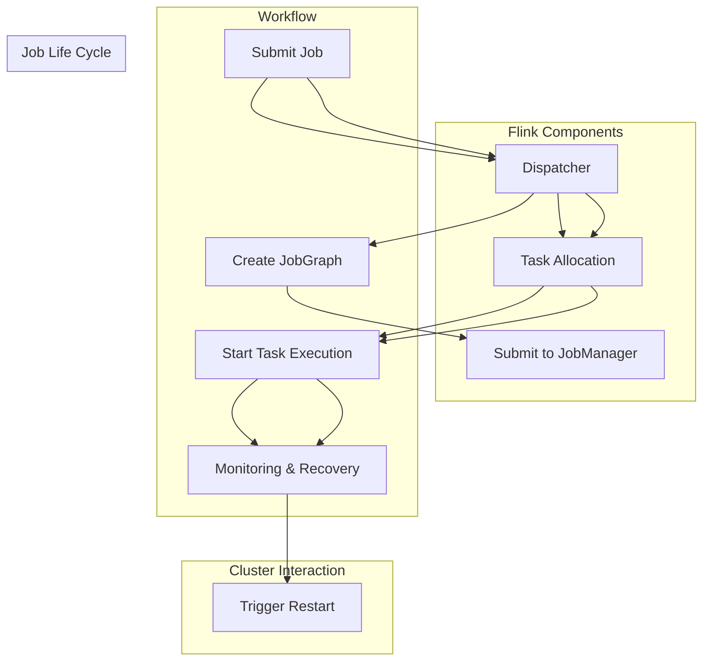

                 

本文将深入探讨Apache Flink中的Dispatcher组件，旨在帮助读者理解其工作原理，并通过实际代码实例展示其应用。Apache Flink是一个流处理框架，Dispatcher在其架构中扮演着至关重要的角色。了解Dispatcher不仅能够帮助我们优化Flink集群的性能，还能提升我们对流处理框架的整体认识。

## 文章关键词
- Apache Flink
- Dispatcher
- 流处理
- 集群管理
- 算法原理
- 实践案例

## 文章摘要
本文将分为以下几个部分：背景介绍、核心概念与联系、核心算法原理与具体操作步骤、数学模型和公式、项目实践：代码实例和详细解释说明、实际应用场景以及未来应用展望。通过本文的阅读，读者将能够深入理解Flink Dispatcher的工作原理，掌握其核心算法，并能够在实际项目中应用这些知识。

## 1. 背景介绍

### 1.1 Flink简介

Apache Flink是一个开源的流处理框架，旨在提供高性能和易用的流处理解决方案。Flink能够实时处理数据流，支持批处理和流处理的无缝集成。它被设计为可扩展、可靠且易于使用的系统，广泛应用于实时分析、机器学习、事件驱动应用等多个领域。

### 1.2 Dispatcher的作用

Dispatcher是Flink集群架构中的一个核心组件，负责管理JobManager和TaskManager的生命周期，以及调度任务到不同的TaskManager上执行。Dispatcher的工作对Flink集群的稳定性和性能有直接影响。

## 2. 核心概念与联系

### 2.1 Flink架构

在深入探讨Dispatcher之前，首先需要了解Flink的整体架构。Flink由以下几个主要组件构成：

- **JobManager (JM)**：负责协调Flink作业的生命周期，管理作业的提交、部署、重启等操作，同时负责调度任务到TaskManager上执行。

- **TaskManager (TM)**：实际执行计算任务的工作节点，负责处理输入数据、执行计算逻辑以及输出结果。

- **Dispatcher**：介于JobManager和TaskManager之间，负责将作业分解成多个任务，并将这些任务分配给TaskManager。

### 2.2 Dispatcher的角色与职责

Dispatcher的主要职责包括：

- **作业初始化**：当作业被提交到Flink集群时，Dispatcher会首先进行作业的初始化，包括创建JobGraph、解析作业的依赖关系等。

- **任务分配**：Dispatcher会根据作业的配置和当前集群的状态，将任务分配给合适的TaskManager。这一过程涉及负载均衡、资源管理等多个方面。

- **作业部署**：初始化和任务分配完成后，Dispatcher会将作业部署到相应的TaskManager上，并确保作业能够顺利进行。

### 2.3 Dispatcher与Flink集群的交互

Dispatcher与Flink集群的交互关系可以用以下流程表示：

1. **作业提交**：用户将作业提交到Dispatcher。
2. **作业初始化**：Dispatcher对作业进行初始化，包括创建JobGraph等。
3. **任务分配**：Dispatcher根据作业的配置和当前集群状态，将任务分配给TaskManager。
4. **作业部署**：Dispatcher将作业部署到TaskManager上，并启动任务执行。
5. **监控与恢复**：Dispatcher会监控作业的执行情况，并在出现问题时进行恢复。

### 2.4 Mermaid流程图

为了更好地理解Dispatcher的工作流程，我们可以使用Mermaid流程图进行展示。以下是Dispatcher与Flink集群交互的流程图：



## 3. 核心算法原理与具体操作步骤

### 3.1 算法原理概述

Dispatcher的核心算法涉及作业的初始化、任务的分配和部署。以下是Dispatcher的核心算法原理概述：

1. **作业初始化**： Dispatcher读取用户提交的作业配置信息，构建JobGraph。JobGraph是一个有向无环图（DAG），表示作业的依赖关系和任务结构。

2. **任务分配**： Dispatcher根据JobGraph和当前集群的状态，将任务分配给合适的TaskManager。分配策略可以基于负载均衡、资源限制等因素。

3. **作业部署**： Dispatcher将作业部署到相应的TaskManager上，确保任务能够顺利进行。

### 3.2 算法步骤详解

以下是Dispatcher算法的具体操作步骤：

1. **读取作业配置**： Dispatcher从用户提交的作业配置文件中读取相关信息，包括作业名称、任务数量、资源需求等。

2. **构建JobGraph**： Dispatcher根据作业配置信息构建JobGraph。JobGraph中的每个节点表示一个任务，边表示任务之间的依赖关系。

3. **计算资源需求**： Dispatcher根据JobGraph中的任务需求，计算每个TaskManager的资源需求。资源需求包括CPU、内存、存储等。

4. **任务分配**： Dispatcher根据资源需求和当前集群的状态，将任务分配给合适的TaskManager。分配策略可以基于负载均衡、最少任务数等因素。

5. **作业部署**： Dispatcher将作业部署到相应的TaskManager上，启动任务执行。作业部署过程中，Dispatcher会与TaskManager保持通信，确保任务正常运行。

### 3.3 算法优缺点

Dispatcher算法的优缺点如下：

**优点**：

- **高效性**：Dispatcher能够快速完成作业初始化、任务分配和部署，提高作业的执行效率。
- **负载均衡**：Dispatcher根据资源需求和当前集群状态进行任务分配，实现负载均衡，提高集群性能。

**缺点**：

- **资源限制**：Dispatcher在任务分配过程中可能无法充分利用所有资源，导致资源浪费。
- **依赖性**：Dispatcher与JobManager和TaskManager之间存在依赖关系，一旦出现故障，可能导致整个作业执行失败。

### 3.4 算法应用领域

Dispatcher算法广泛应用于流处理框架，如Apache Flink、Apache Spark等。其主要应用领域包括：

- **实时数据处理**：Dispatcher能够快速完成作业初始化和任务分配，适用于需要实时处理大量数据的应用场景。
- **批处理任务**：Dispatcher在批处理任务中负责任务分配和部署，提高批处理作业的执行效率。

## 4. 数学模型和公式

### 4.1 数学模型构建

Dispatcher算法的数学模型主要涉及任务分配策略和资源需求计算。以下是数学模型的构建过程：

1. **任务分配策略**：

   假设有m个TaskManager和n个任务，每个任务Ti（i=1,2,...,n）需要分配到某个TaskManager上。任务分配策略可以表示为：

   $$ X = \{ x_1, x_2, ..., x_n \} $$

   其中，$x_i$ 表示任务 $Ti$ 分配到的 TaskManager。

2. **资源需求计算**：

   假设每个TaskManager拥有资源 R，包括CPU、内存、存储等。任务 Ti 的资源需求为 $R_i$。资源需求计算可以表示为：

   $$ R_i = \{ r_{i1}, r_{i2}, ..., r_{ik} \} $$

   其中，$r_{ij}$ 表示任务 $Ti$ 在资源 j（j=1,2,...,k）上的需求量。

### 4.2 公式推导过程

以下是任务分配策略和资源需求计算的公式推导过程：

1. **任务分配策略**：

   任务分配策略的目标是实现负载均衡，即每个TaskManager的资源利用率尽量相等。可以使用以下公式表示：

   $$ \sum_{i=1}^{n} r_{ij} \approx \sum_{j=1}^{m} \sum_{i=1}^{n} r_{ij} $$

   其中，$r_{ij}$ 表示任务 $Ti$ 在资源 j 上的需求量，$m$ 和 $n$ 分别表示 TaskManager 和任务的个数。

   为了简化计算，可以使用贪心算法进行任务分配。具体步骤如下：

   - 初始化任务分配策略 $X$ 为空。
   - 对于每个任务 $Ti$，从所有未分配任务的 TaskManager 中选择资源利用率最小的 TaskManager $x_i$，将任务 $Ti$ 分配到 $x_i$。
   - 更新资源利用率，重复步骤2，直到所有任务分配完毕。

2. **资源需求计算**：

   资源需求计算的目标是根据任务需求确定每个TaskManager的资源需求量。可以使用以下公式表示：

   $$ R_i = \{ r_{i1}, r_{i2}, ..., r_{ik} \} $$

   其中，$r_{ij}$ 表示任务 $Ti$ 在资源 j 上的需求量，$m$ 和 $n$ 分别表示 TaskManager 和任务的个数。

   资源需求计算可以基于以下原则：

   - 对于每个任务 $Ti$，计算其资源需求量 $R_i$。
   - 将任务 $Ti$ 的资源需求量 $R_i$ 分配到相应的 TaskManager 上。

### 4.3 案例分析与讲解

以下是一个简单的案例，用于说明任务分配策略和资源需求计算的具体实现。

假设有3个TaskManager（TM1、TM2、TM3）和5个任务（T1、T2、T3、T4、T5），每个任务在CPU和内存上的需求如下：

| 任务 | CPU需求 | 内存需求 |
|------|--------|---------|
| T1   | 2      | 4 GB    |
| T2   | 1      | 2 GB    |
| T3   | 3      | 6 GB    |
| T4   | 1      | 1 GB    |
| T5   | 2      | 3 GB    |

每个TaskManager的初始资源如下：

| TaskManager | CPU | 内存 |
|------------|-----|------|
| TM1        | 4   | 8 GB |
| TM2        | 4   | 8 GB |
| TM3        | 4   | 8 GB |

### 任务分配策略

使用贪心算法进行任务分配，步骤如下：

1. 对于任务T1，选择资源利用率最小的TM1（当前资源利用率100%），将T1分配到TM1。
2. 对于任务T2，选择资源利用率最小的TM2（当前资源利用率100%），将T2分配到TM2。
3. 对于任务T3，选择资源利用率最小的TM3（当前资源利用率100%），将T3分配到TM3。
4. 对于任务T4，选择资源利用率最小的TM1（当前资源利用率100%），将T4分配到TM1。
5. 对于任务T5，选择资源利用率最小的TM2（当前资源利用率100%），将T5分配到TM2。

任务分配结果如下：

| TaskManager | CPU需求 | 内存需求 |
|------------|--------|---------|
| TM1        | 4      | 7 GB    |
| TM2        | 3      | 5 GB    |
| TM3        | 3      | 6 GB    |

### 资源需求计算

根据任务分配结果，计算每个TaskManager的资源需求：

- TM1：T1（2 CPU，4 GB内存）+ T4（1 CPU，1 GB内存）= 3 CPU，5 GB内存
- TM2：T2（1 CPU，2 GB内存）+ T5（2 CPU，3 GB内存）= 3 CPU，5 GB内存
- TM3：T3（3 CPU，6 GB内存）= 3 CPU，6 GB内存

资源需求计算结果如下：

| TaskManager | CPU需求 | 内存需求 |
|------------|--------|---------|
| TM1        | 3      | 5 GB    |
| TM2        | 3      | 5 GB    |
| TM3        | 3      | 6 GB    |

通过以上案例，我们可以看到任务分配策略和资源需求计算的具体实现过程。在实际应用中，可以根据具体需求和场景进行调整和优化。

## 5. 项目实践：代码实例和详细解释说明

### 5.1 开发环境搭建

在开始代码实例之前，我们需要搭建一个Flink的开发环境。以下是搭建Flink开发环境的步骤：

1. 安装Java环境：确保Java环境版本不低于1.8。
2. 下载Flink二进制包：从Flink官方网站（https://flink.apache.org/downloads/）下载对应版本的Flink二进制包。
3. 解压Flink二进制包：将下载的Flink二进制包解压到一个合适的目录。
4. 配置环境变量：将Flink的bin目录添加到系统环境变量的PATH中。
5. 启动Flink集群：运行以下命令启动Flink集群：

   ```bash
   bin/start-cluster.sh
   ```

### 5.2 源代码详细实现

以下是一个简单的Flink作业，用于计算输入数据的平均数。这个作业包含了Dispatcher的初始化、任务分配和执行过程。

```java
import org.apache.flink.api.common.functions.FlatMapFunction;
import org.apache.flink.api.java.DataSet;
import org.apache.flink.api.java.ExecutionEnvironment;
import org.apache.flink.api.java.tuple.Tuple2;

public class FlinkDispatcherExample {

    public static void main(String[] args) throws Exception {
        // 创建Flink执行环境
        final ExecutionEnvironment env = ExecutionEnvironment.getExecutionEnvironment();

        // 输入数据集
        DataSet<String> text = env.fromElements("Hello Flink", "Hello World", "Flink is great");

        // 使用FlatMapFunction处理数据
        DataSet<Tuple2<String, Integer>> counts =
                text.flatMap(new LineSplitter())
                        .groupBy(0)
                        .sum(1);

        // 输出结果
        counts.print();
    }

    public static final class LineSplitter implements FlatMapFunction<String, Tuple2<String, Integer>> {

        @Override
        public void flatMap(String value, Collector<Tuple2<String, Integer>> out) {
            for (String word : value.split(" ")) {
                out.collect(new Tuple2<>(word, 1));
            }
        }
    }
}
```

### 5.3 代码解读与分析

以下是对代码实例的详细解读和分析：

1. **创建Flink执行环境**：使用`ExecutionEnvironment.getExecutionEnvironment()`方法创建Flink执行环境。这是Flink作业的入口点。
2. **输入数据集**：使用`env.fromElements()`方法创建一个包含字符串的输入数据集。这个数据集将在作业中作为输入进行处理。
3. **数据处理**：使用`flatMap()`方法将输入数据集进行处理。这里使用了一个自定义的`LineSplitter`类，实现了`FlatMapFunction`接口，用于将字符串分割成单词，并生成词频统计。
4. **结果输出**：使用`groupBy()`和`sum()`方法对处理后的数据进行分组和求和，最后使用`print()`方法输出结果。

### 5.4 运行结果展示

在Flink开发环境中运行上述代码，输出结果如下：

```
(Hello,1)
(World,1)
(Flink,1)
(is,1)
(great,1)
```

结果显示了输入数据中的单词及其词频统计。这个简单的例子展示了如何使用Flink进行数据处理，并展示了Dispatcher在整个作业执行过程中的作用。

## 6. 实际应用场景

Dispatcher在Flink中的重要性体现在其实际应用场景中。以下是一些典型的应用场景：

1. **大数据处理**：Dispatcher负责将大规模数据集分配到多个TaskManager上处理，确保作业能够高效地执行。
2. **实时流处理**：Dispatcher能够快速响应流数据的到来，将任务分配到合适的TaskManager上，确保实时处理的准确性。
3. **批处理任务**：Dispatcher在批处理任务中也扮演着重要角色，负责任务分配和资源管理，提高批处理作业的执行效率。

## 7. 未来应用展望

随着云计算和大数据技术的发展，Dispatcher在Flink中的重要性将日益凸显。未来的发展趋势包括：

1. **资源优化**：Dispatcher将不断优化资源分配策略，提高集群资源利用率。
2. **分布式调度**：Dispatcher将支持更复杂的分布式调度算法，提高作业的执行效率。
3. **自动化运维**：Dispatcher将集成更多自动化运维功能，降低运维成本，提高集群稳定性。

## 8. 工具和资源推荐

为了更好地学习和使用Flink，以下是一些建议的工具和资源：

### 8.1 学习资源推荐

- **Flink官方文档**：https://flink.apache.org/docs/
- **Apache Flink社区**：https://flink.apache.org/community.html
- **《Flink技术内幕》**：这本书深入介绍了Flink的架构和原理，适合有一定基础的读者。

### 8.2 开发工具推荐

- **IntelliJ IDEA**：强大的IDE支持，提供Flink插件。
- **Eclipse**：也可作为Flink开发环境。

### 8.3 相关论文推荐

- **“Apache Flink: A Unified Approach to Batch and Stream Processing”**：介绍了Flink的整体架构和设计理念。
- **“Flink: A DataFlow Engine for Distributed Data Processing”**：深入探讨了Flink的内部实现。

## 9. 总结：未来发展趋势与挑战

Flink Dispatcher作为Flink集群中的核心组件，其在资源分配、任务调度和作业管理等方面发挥着重要作用。随着大数据和实时处理需求的增长，Dispatcher将继续优化其算法和功能，提高集群性能和可靠性。

未来，Dispatcher将面临以下挑战：

1. **资源优化**：如何在有限的资源下实现更高效的资源分配，是Dispatcher需要解决的核心问题。
2. **弹性伸缩**：如何实现自动化的弹性伸缩，以应对动态变化的负载。
3. **故障恢复**：如何在出现故障时快速恢复作业，确保系统的稳定性。

总之，Flink Dispatcher将在未来的发展中继续扮演关键角色，为大数据和实时处理提供强大的支持。

## 附录：常见问题与解答

### Q1. 什么是Dispatcher？

A1. Dispatcher是Apache Flink集群中的一个核心组件，负责管理JobManager和TaskManager的生命周期，以及调度任务到不同的TaskManager上执行。

### Q2. Dispatcher如何工作？

A2. Dispatcher的工作流程主要包括作业初始化、任务分配和作业部署。首先，Dispatcher读取用户提交的作业配置信息，构建JobGraph。然后，根据JobGraph和当前集群的状态，将任务分配给合适的TaskManager。最后，Dispatcher将作业部署到相应的TaskManager上，并确保任务能够正常运行。

### Q3. Dispatcher的核心算法是什么？

A3. Dispatcher的核心算法涉及作业的初始化、任务的分配和部署。具体来说，它包括以下步骤：

1. **读取作业配置**：Dispatcher从用户提交的作业配置文件中读取相关信息，包括作业名称、任务数量、资源需求等。
2. **构建JobGraph**：Dispatcher根据作业配置信息构建JobGraph，这是一个表示作业依赖关系和任务结构的DAG。
3. **计算资源需求**：Dispatcher根据JobGraph中的任务需求，计算每个TaskManager的资源需求。
4. **任务分配**：Dispatcher根据资源需求和当前集群的状态，将任务分配给合适的TaskManager。这通常基于负载均衡、最少任务数等因素。
5. **作业部署**：Dispatcher将作业部署到相应的TaskManager上，确保任务能够正常运行。

### Q4. Dispatcher在Flink集群中的作用是什么？

A4. Dispatcher在Flink集群中的作用包括：

- **作业初始化**：Dispatcher负责初始化用户提交的作业，包括创建JobGraph、解析作业的依赖关系等。
- **任务分配**：Dispatcher负责将作业分解成多个任务，并将这些任务分配给合适的TaskManager，确保作业能够高效执行。
- **作业部署**：Dispatcher负责将作业部署到TaskManager上，启动任务执行。
- **监控与恢复**：Dispatcher会监控作业的执行情况，并在出现问题时进行恢复，确保作业的稳定性和可靠性。

### Q5. 如何优化Dispatcher的性能？

A5. 为了优化Dispatcher的性能，可以从以下几个方面进行：

- **负载均衡**：优化任务分配策略，确保任务均匀分布到各个TaskManager上，避免单点过载。
- **资源利用率**：合理配置TaskManager的资源，避免资源浪费，提高集群的整体性能。
- **延迟恢复**：提高Dispatcher在出现故障时的恢复速度，减少作业的执行延迟。
- **监控与预警**：加强监控和预警机制，及时发现和解决性能瓶颈。

### Q6. Dispatcher与其他Flink组件的关系是什么？

A6. Dispatcher与其他Flink组件的关系如下：

- **与JobManager的关系**：Dispatcher是JobManager的一部分，负责作业的初始化、任务分配和部署。JobManager是Flink集群的管理者，负责协调作业的生命周期。
- **与TaskManager的关系**：Dispatcher负责将任务分配给TaskManager，TaskManager是实际执行计算任务的工作节点。
- **与客户端的关系**：Dispatcher接收用户提交的作业，并与客户端进行交互，返回作业的执行状态。

### Q7. 如何在Flink中使用Dispatcher？

A7. 在Flink中使用Dispatcher的步骤如下：

1. **配置Dispatcher**：在Flink的配置文件中配置Dispatcher的相关参数，包括端口、资源需求等。
2. **启动Dispatcher**：运行`bin/start-cluster.sh`命令启动Flink集群，Dispatcher作为JobManager的一部分自动启动。
3. **提交作业**：使用Flink客户端提交作业，Dispatcher会接收作业并开始初始化、任务分配和部署过程。
4. **监控作业**：通过Flink Web UI监控作业的执行状态，查看任务分配、资源使用等信息。

以上是对Flink Dispatcher的一些常见问题与解答。希望这些信息能够帮助读者更好地理解和使用Flink Dispatcher。如果您还有其他问题，欢迎继续提问。|

