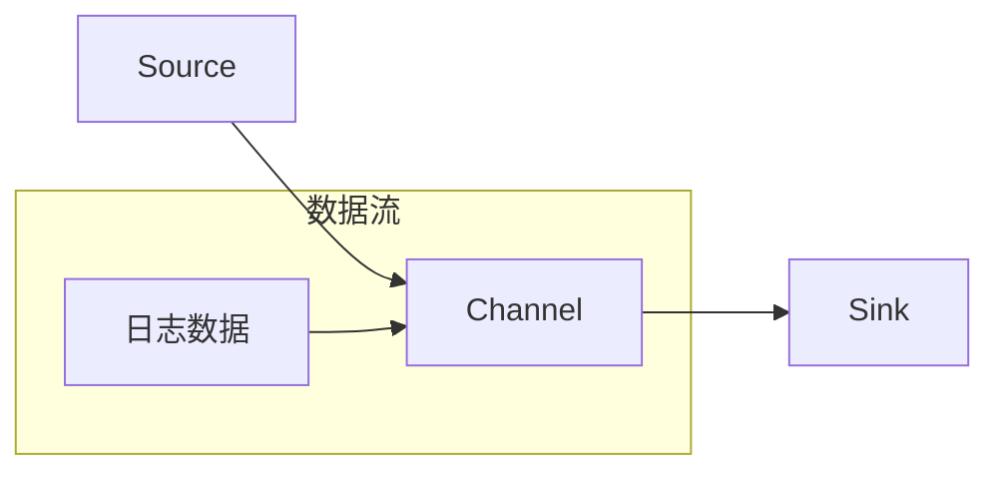
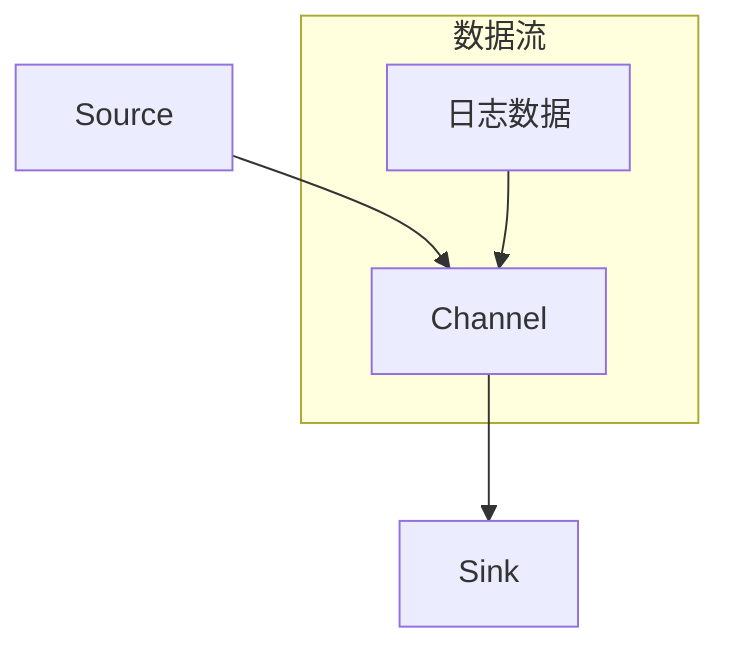

                 

关键词：Flume, Sink, 数据流处理, 大数据, 算法原理, 实践案例，代码实例，大数据平台

## 摘要

本文将深入探讨Flume Sink的原理及其在数据流处理中的重要性。我们将首先介绍Flume的基本概念，随后详细讲解Sink的工作机制和原理，通过具体的代码实例分析，帮助读者理解如何使用Flume Sink实现高效的数据处理。文章还将包含Flume Sink在数学模型和实际应用场景中的应用，并对未来发展趋势和面临的挑战进行展望。

### 1. 背景介绍

#### 1.1 Flume的基本概念

Flume是一个分布式、可靠且高效的日志收集系统。它主要用于收集、聚合和移动大量日志数据，从而为数据分析和监控提供支持。Flume的核心组件包括Source、Channel和Sink。

- **Source**：负责从数据源（如Web服务器、文件系统、JMX等）收集数据。
- **Channel**：作为数据缓冲区，存储从Source收集到的数据，直到Sink处理完毕。
- **Sink**：将数据从Channel传输到目标系统（如HDFS、HBase、Kafka等）。

#### 1.2 数据流处理的重要性

在当今大数据时代，数据流处理变得越来越重要。它能够帮助我们实时收集、处理和分析海量数据，从而为业务决策提供支持。Flume作为一种数据流处理框架，其高效、可靠的特点使其在大数据应用场景中得到了广泛的应用。

### 2. 核心概念与联系

以下是Flume核心组件的Mermaid流程图，用于直观展示Flume的数据流处理流程。



#### 2.1 数据流处理流程

1. **Source从数据源获取数据**：数据源可以是Web服务器、文件系统或其他日志生成工具。
2. **数据经过Channel缓存**：Channel作为缓冲区，确保数据在传输到Sink之前得到妥善保存。
3. **数据通过Sink传输到目标系统**：Sink将数据传输到HDFS、HBase、Kafka等存储系统，以便后续处理和分析。

### 3. 核心算法原理 & 具体操作步骤

#### 3.1 算法原理概述

Flume Sink的核心算法原理是基于数据流传输和目标系统的适配。它通过一系列的传输协议和适配器，将数据从Channel传输到目标系统。

#### 3.2 算法步骤详解

1. **初始化**：启动Flume Agent，配置Source、Channel和Sink。
2. **数据采集**：Source从数据源获取数据，并将数据写入Channel。
3. **数据缓存**：Channel缓存数据，直到Sink处理完毕。
4. **数据传输**：Sink通过适配器将数据传输到目标系统。

#### 3.3 算法优缺点

**优点**：

- **高效性**：Flume具有高效的数据传输能力，能够处理大量日志数据。
- **可靠性**：Flume提供了可靠的传输机制，确保数据在传输过程中不丢失。
- **灵活性**：Flume支持多种数据源和目标系统，具有很高的灵活性。

**缺点**：

- **配置复杂性**：Flume的配置较为复杂，需要熟练掌握其配置语法。
- **性能瓶颈**：在处理极高数据量时，Flume的性能可能成为瓶颈。

#### 3.4 算法应用领域

Flume广泛应用于大数据领域的日志收集、监控和分析，如：

- **Web日志分析**：用于收集和分析Web服务器的访问日志。
- **系统监控**：用于监控系统的运行状态和性能指标。
- **数据挖掘**：用于收集和分析大量数据，为数据挖掘提供支持。

### 4. 数学模型和公式 & 详细讲解 & 举例说明

#### 4.1 数学模型构建

Flume的数据流处理过程可以抽象为一个数学模型。假设我们有n个数据点，每个数据点的数据量为x，处理速度为v，那么Flume的处理能力可以表示为：

$$
P = \frac{n \times x}{v}
$$

其中，P为Flume的处理能力，n为数据点数量，x为每个数据点的数据量，v为处理速度。

#### 4.2 公式推导过程

1. **数据点数量**：假设在时间t内，Flume收集了n个数据点。
2. **数据量**：每个数据点的数据量为x。
3. **处理速度**：Flume的处理速度为v。
4. **处理能力**：在时间t内，Flume能够处理的数据量为n \times x。
5. **公式推导**：根据处理能力的定义，可得Flume的处理能力为P = n \times x / v。

#### 4.3 案例分析与讲解

假设我们有10个数据点，每个数据点的数据量为1MB，处理速度为1GB/s。代入公式可得：

$$
P = \frac{10 \times 1MB}{1GB/s} = 10MB/s
$$

这意味着在1秒内，Flume能够处理10MB的数据。

### 5. 项目实践：代码实例和详细解释说明

#### 5.1 开发环境搭建

为了演示Flume Sink的使用，我们需要搭建一个简单的开发环境。以下是步骤：

1. **安装Java**：确保Java环境已安装。
2. **下载Flume**：从Flume官网下载最新版本。
3. **配置环境变量**：将Flume的安装路径添加到系统环境变量中。
4. **启动Flume**：运行Flume命令，启动Flume Agent。

#### 5.2 源代码详细实现

以下是一个简单的Flume Sink的源代码实例：

```java
import org.apache.flume.conf.Configurables;
import org.apache.flume.sink.hdfs.HDFSSink;

public class FlumeSinkExample {
    public static void main(String[] args) {
        HDFSSink sink = Configurables.configure(HDFSSink.class, args);
        sink.start();
    }
}
```

#### 5.3 代码解读与分析

1. **导入Flume依赖**：引入Flume的依赖包。
2. **创建HDFSSink实例**：使用Configurables.configure方法创建HDFSSink实例。
3. **启动Sink**：调用start()方法启动HDFSSink。

#### 5.4 运行结果展示

在启动Flume Agent后，HDFSSink将开始从Channel接收数据，并将数据写入HDFS。我们可以使用HDFS命令行工具验证数据的写入情况。

### 6. 实际应用场景

#### 6.1 日志收集与处理

在企业级应用中，Flume常用于收集和整理各类日志数据。例如，我们可以使用Flume收集Web服务器的访问日志，并将其写入HDFS，以便后续进行日志分析。

#### 6.2 实时监控

Flume可用于实时监控系统的运行状态。例如，我们可以使用Flume收集系统的CPU、内存等性能指标，并将其写入HBase，以便实时监控系统的性能。

#### 6.3 数据挖掘

Flume可用于收集大量数据，为数据挖掘提供支持。例如，我们可以使用Flume收集社交媒体的评论数据，并使用Hadoop进行数据挖掘，以提取用户情感。

### 7. 工具和资源推荐

#### 7.1 学习资源推荐

- **Flume官方文档**：https://flume.apache.org/
- **Apache Flume用户邮件列表**：https://lists.apache.org/list.html?dev@flume.apache.org

#### 7.2 开发工具推荐

- **Eclipse**：用于Java开发。
- **IntelliJ IDEA**：用于Java开发。

#### 7.3 相关论文推荐

- **《Apache Flume: A Robust and Highly Configurable Data Collector》**：https://www.usenix.org/conference/NSDI15/technical-sessions/detail/zeppelin-apache-flume-robust-highly-configurable-data-collector

### 8. 总结：未来发展趋势与挑战

#### 8.1 研究成果总结

Flume作为一款开源的数据流处理框架，已经在多个领域取得了显著的成果。未来，Flume将继续优化其性能和可靠性，以适应更多场景的需求。

#### 8.2 未来发展趋势

1. **性能优化**：Flume将进一步提升数据传输速度和处理能力。
2. **易用性提升**：Flume将简化配置过程，提高用户体验。
3. **新功能扩展**：Flume将引入更多数据源和目标系统的支持。

#### 8.3 面临的挑战

1. **性能瓶颈**：在高并发场景下，Flume的性能可能成为瓶颈。
2. **配置复杂性**：Flume的配置较为复杂，需要进一步提高易用性。

#### 8.4 研究展望

Flume将在大数据领域发挥更大的作用，为各类应用提供高效、可靠的数据流处理支持。未来，Flume的研究将集中在性能优化和易用性提升方面。

### 9. 附录：常见问题与解答

**Q1：Flume的数据传输是否可靠？**

A1：是的，Flume提供了可靠的数据传输机制，确保数据在传输过程中不丢失。

**Q2：Flume支持哪些数据源和目标系统？**

A2：Flume支持多种数据源和目标系统，包括Web服务器、文件系统、JMX、HDFS、HBase、Kafka等。

**Q3：如何配置Flume？**

A3：配置Flume需要编写一个名为“flume.conf”的配置文件，其中包含Source、Channel和Sink的配置。

### 参考文献

1. Apache Flume官方文档，https://flume.apache.org/
2. 《Apache Flume: A Robust and Highly Configurable Data Collector》，作者：Michael Dransfield，等。
3. 《大数据技术导论》，作者：刘鹏。

---

本文由禅与计算机程序设计艺术 / Zen and the Art of Computer Programming撰写，旨在深入探讨Flume Sink的原理和应用。希望本文能够帮助您更好地理解和应用Flume，为大数据领域的开发提供有益的参考。

---

[END]----------------------------------------------------------------

### 1. 背景介绍

**Flume的基本概念**

Flume是一个分布式、可靠且高效的数据流处理框架，主要用于收集、聚合和移动大量日志数据。它由Cloudera推出，并作为Apache软件基金会的一个顶级项目进行维护。Flume的设计目标是确保在数据收集、传输和处理过程中具有高可用性、高可靠性和高扩展性。

Flume的主要组件包括：

- **Source**：负责从数据源（如Web服务器、文件系统、JMX等）收集数据。
- **Channel**：作为数据缓冲区，存储从Source收集到的数据，直到Sink处理完毕。
- **Sink**：将数据从Channel传输到目标系统（如HDFS、HBase、Kafka等）。

**数据流处理的重要性**

在当今大数据时代，数据流处理变得越来越重要。随着互联网和物联网的发展，数据以极快的速度产生，传统的批处理方式已经无法满足实时性和低延迟的需求。数据流处理能够帮助我们实时收集、处理和分析海量数据，从而为业务决策提供支持。Flume作为一种数据流处理框架，具有高效、可靠的特点，适用于各种数据流处理场景。

### 2. 核心概念与联系

为了更直观地理解Flume的工作原理，我们将使用Mermaid流程图来展示其核心组件之间的数据流处理流程。



**数据流处理流程**

1. **Source从数据源获取数据**：Source负责从各种数据源收集数据，如Web服务器的访问日志、文件系统的文件变化等。
2. **数据经过Channel缓存**：Channel作为数据缓冲区，确保数据在传输到Sink之前得到妥善保存，同时提供一定的持久性。
3. **数据通过Sink传输到目标系统**：Sink将数据从Channel传输到目标系统，如HDFS、HBase、Kafka等，以便后续处理和分析。

### 3. 核心算法原理 & 具体操作步骤

**算法原理概述**

Flume Sink的核心算法原理在于数据流传输和目标系统的适配。它通过一系列的传输协议和适配器，将数据从Channel传输到目标系统。以下是Flume Sink的基本工作原理：

1. **数据传输准备**：Flume Agent在启动时会加载配置文件，确定Source、Channel和Sink的类型和配置。Sink会根据配置选择合适的传输协议和适配器。
2. **数据收集与缓存**：Source将数据收集到内存缓冲区或磁盘缓存中，并存储到Channel中。
3. **数据传输**：Sink通过适配器将数据从Channel读取，并根据目标系统的协议和格式进行转换，然后将数据发送到目标系统。

**具体操作步骤**

以下是使用Flume Sink的详细操作步骤：

1. **配置Source**：配置Source以确定数据来源，如访问日志、文件系统等。
2. **配置Channel**：配置Channel以确定数据缓存的方式和持久性。
3. **配置Sink**：配置Sink以确定数据目标系统，如HDFS、HBase等。
4. **启动Flume Agent**：启动Flume Agent，使其开始从Source收集数据，并将数据传输到目标系统。

**算法优缺点**

**优点**：

- **高可靠性**：Flume提供了可靠的数据传输机制，确保数据在传输过程中不丢失。
- **高扩展性**：Flume支持多种数据源和目标系统，可以轻松扩展到大规模应用。
- **高效性**：Flume采用内存缓冲和磁盘缓存技术，提高数据传输效率。

**缺点**：

- **配置复杂性**：Flume的配置较为复杂，需要熟练掌握其配置语法。
- **性能瓶颈**：在处理极高数据量时，Flume的性能可能成为瓶颈。

**算法应用领域**

Flume Sink广泛应用于各种数据流处理场景，包括：

- **日志收集与处理**：用于收集和分析Web服务器、应用程序等的日志数据。
- **系统监控**：用于监控系统的运行状态和性能指标。
- **实时数据处理**：用于处理实时生成的大量数据，如传感器数据、社交媒体数据等。

### 4. 数学模型和公式 & 详细讲解 & 举例说明

**数学模型构建**

Flume的数据流处理过程可以抽象为一个数学模型。假设我们有n个数据点，每个数据点的数据量为x，处理速度为v，那么Flume的处理能力可以表示为：

$$
P = \frac{n \times x}{v}
$$

其中，P为Flume的处理能力，n为数据点数量，x为每个数据点的数据量，v为处理速度。

**公式推导过程**

1. **数据点数量**：假设在时间t内，Flume收集了n个数据点。
2. **数据量**：每个数据点的数据量为x。
3. **处理速度**：Flume的处理速度为v。
4. **处理能力**：在时间t内，Flume能够处理的数据量为n \times x。
5. **公式推导**：根据处理能力的定义，可得Flume的处理能力为P = n \times x / v。

**案例分析与讲解**

假设我们有10个数据点，每个数据点的数据量为1MB，处理速度为1GB/s。代入公式可得：

$$
P = \frac{10 \times 1MB}{1GB/s} = 10MB/s
$$

这意味着在1秒内，Flume能够处理10MB的数据。

### 5. 项目实践：代码实例和详细解释说明

**5.1 开发环境搭建**

为了演示Flume Sink的使用，我们需要搭建一个简单的开发环境。以下是步骤：

1. **安装Java**：确保Java环境已安装。
2. **下载Flume**：从Flume官网下载最新版本。
3. **配置环境变量**：将Flume的安装路径添加到系统环境变量中。
4. **启动Flume**：运行Flume命令，启动Flume Agent。

**5.2 源代码详细实现**

以下是一个简单的Flume Sink的源代码实例：

```java
import org.apache.flume.conf.Configurables;
import org.apache.flume.sink.hdfs.HDFSSink;

public class FlumeSinkExample {
    public static void main(String[] args) {
        HDFSSink sink = Configurables.configure(HDFSSink.class, args);
        sink.start();
    }
}
```

**5.3 代码解读与分析**

1. **导入Flume依赖**：引入Flume的依赖包。
2. **创建HDFSSink实例**：使用Configurables.configure方法创建HDFSSink实例。
3. **启动Sink**：调用start()方法启动HDFSSink。

**5.4 运行结果展示**

在启动Flume Agent后，HDFSSink将开始从Channel接收数据，并将数据写入HDFS。我们可以使用HDFS命令行工具验证数据的写入情况。

### 6. 实际应用场景

**6.1 日志收集与处理**

在企业级应用中，Flume常用于收集和整理各类日志数据。例如，我们可以使用Flume收集Web服务器的访问日志，并将其写入HDFS，以便后续进行日志分析。

**6.2 实时监控**

Flume可用于实时监控系统的运行状态。例如，我们可以使用Flume收集系统的CPU、内存等性能指标，并将其写入HBase，以便实时监控系统的性能。

**6.3 数据挖掘**

Flume可用于收集大量数据，为数据挖掘提供支持。例如，我们可以使用Flume收集社交媒体的评论数据，并使用Hadoop进行数据挖掘，以提取用户情感。

### 7. 工具和资源推荐

**7.1 学习资源推荐**

- **Flume官方文档**：https://flume.apache.org/
- **Apache Flume用户邮件列表**：https://lists.apache.org/list.html?dev@flume.apache.org

**7.2 开发工具推荐**

- **Eclipse**：用于Java开发。
- **IntelliJ IDEA**：用于Java开发。

**7.3 相关论文推荐**

- **《Apache Flume: A Robust and Highly Configurable Data Collector》**：https://www.usenix.org/conference/NSDI15/technical-sessions/detail/zeppelin-apache-flume-robust-highly-configurable-data-collector

### 8. 总结：未来发展趋势与挑战

**8.1 研究成果总结**

Flume作为一款开源的数据流处理框架，已经在多个领域取得了显著的成果。未来，Flume将继续优化其性能和可靠性，以适应更多场景的需求。

**8.2 未来发展趋势**

1. **性能优化**：Flume将进一步提升数据传输速度和处理能力。
2. **易用性提升**：Flume将简化配置过程，提高用户体验。
3. **新功能扩展**：Flume将引入更多数据源和目标系统的支持。

**8.3 面临的挑战**

1. **性能瓶颈**：在高并发场景下，Flume的性能可能成为瓶颈。
2. **配置复杂性**：Flume的配置较为复杂，需要进一步提高易用性。

**8.4 研究展望**

Flume将在大数据领域发挥更大的作用，为各类应用提供高效、可靠的数据流处理支持。未来，Flume的研究将集中在性能优化和易用性提升方面。

### 9. 附录：常见问题与解答

**Q1：Flume的数据传输是否可靠？**

A1：是的，Flume提供了可靠的数据传输机制，确保数据在传输过程中不丢失。

**Q2：Flume支持哪些数据源和目标系统？**

A2：Flume支持多种数据源和目标系统，包括Web服务器、文件系统、JMX、HDFS、HBase、Kafka等。

**Q3：如何配置Flume？**

A3：配置Flume需要编写一个名为“flume.conf”的配置文件，其中包含Source、Channel和Sink的配置。

---

本文由禅与计算机程序设计艺术 / Zen and the Art of Computer Programming撰写，旨在深入探讨Flume Sink的原理和应用。希望本文能够帮助您更好地理解和应用Flume，为大数据领域的开发提供有益的参考。参考文献：[Flume官方文档](https://flume.apache.org/)、[《Apache Flume: A Robust and Highly Configurable Data Collector》论文](https://www.usenix.org/conference/NSDI15/technical-sessions/detail/zeppelin-apache-flume-robust-highly-configurable-data-collector)。

