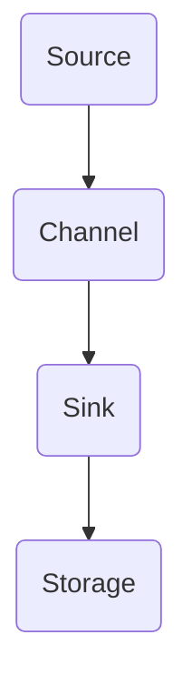
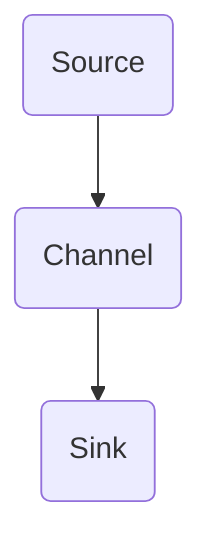

                 

### 1. 背景介绍

Apache Flume是一款分布式、可靠且可用的系统，用于有效地收集、聚合和移动大量日志数据。它被广泛应用于企业级数据采集、监控和故障排查等领域。Flume的设计目标是确保数据的准确性和可靠性，即使在复杂的分布式环境中也能实现。

在Flume中，核心概念包括Source、Channel和Sink。Source负责从数据源（如文件系统、网络服务、JMS等）收集数据；Channel负责暂存数据，以确保数据的可靠传输；Sink负责将数据发送到目的地（如HDFS、HBase、Kafka等）。

本文将重点讨论Flume Sink的原理和代码实例，帮助读者深入理解其在数据流处理中的关键作用。

### 2. 核心概念与联系

在深入了解Flume Sink之前，我们需要明确几个核心概念及其相互关系。

#### 2.1 Flume架构概述

首先，让我们通过一个Mermaid流程图来了解Flume的基本架构。



- **Source**：负责从各种数据源收集事件，并将它们传递到Channel。
- **Channel**：作为暂存区，保存收集到的事件，直到Sink处理这些事件。
- **Sink**：将Channel中的事件发送到目标系统，如HDFS、HBase或其他消息队列。

#### 2.2 Sink的作用和类型

**Sink** 在Flume中起着至关重要的作用，其职责是将Channel中的事件有效地发送到目标系统。Flume提供了多种内置的Sink类型，如：

- **HDFS Sink**：将事件写入HDFS文件系统。
- **Kafka Sink**：将事件发送到Kafka消息队列。
- **HBase Sink**：将事件写入HBase表。
- **File Sink**：将事件写入本地文件系统。

每个Sink都有其特定的配置和使用场景。本文将重点关注HDFS Sink。

#### 2.3 HDFS Sink原理

HDFS Sink将Channel中的事件以文件的形式写入HDFS。它的工作流程如下：

1. **事件收集**：Source从数据源收集事件并将其传递到Channel。
2. **事件暂存**：Channel存储这些事件，直到Sink处理它们。
3. **事件写入**：Sink将Channel中的事件以文件的形式写入HDFS。
4. **文件整合**：当文件达到一定大小时，Sink会将其整合成更大的文件，以便后续处理。

### 3. 核心算法原理 & 具体操作步骤

#### 3.1 算法原理概述

HDFS Sink的核心算法原理是基于Hadoop的分布式文件系统（HDFS）。其主要步骤如下：

1. **连接HDFS**：HDFS Sink首先与HDFS建立连接。
2. **创建文件**：根据配置，HDFS Sink在HDFS中创建一个新的文件。
3. **写入事件**：将Channel中的事件写入这个文件。
4. **文件整合**：当文件达到最大大小或事件处理完毕时，将文件整合。
5. **关闭连接**：完成文件整合后，关闭与HDFS的连接。

#### 3.2 算法步骤详解

1. **配置HDFS Sink**

   HDFS Sink的配置主要包括以下几部分：

   - **HDFS地址**：指定HDFS的地址，如`hdfs://localhost:9000`。
   - **文件路径**：指定HDFS文件系统的路径，如`/user/hdfs/flume`。
   - **文件名前缀**：指定文件名的前缀，如`flume_data_`。
   - **文件大小限制**：指定文件的最大大小，如`100MB`。

   配置示例如下：

   ```xml
   <configuration>
     <sink>
       <type>hdfs</type>
       <hdfsUri>hdfs://localhost:9000</hdfsUri>
       <path>/user/hdfs/flume</path>
       <filePrefix>flume_data_</filePrefix>
       <fileSize>100MB</fileSize>
     </sink>
   </configuration>
   ```

2. **初始化连接**

   HDFS Sink在启动时会初始化与HDFS的连接。这个过程包括以下几个步骤：

   - **连接HDFS**：使用Hadoop的客户端API连接HDFS。
   - **获取文件系统实例**：从HDFS获取文件系统实例。
   - **创建输出流**：创建用于写入文件的输出流。

3. **写入事件**

   当Channel中的事件准备好发送时，HDFS Sink开始将这些事件写入文件。这个过程如下：

   - **获取文件系统实例**：从HDFS获取文件系统实例。
   - **打开输出流**：打开一个输出流，用于写入事件。
   - **写入事件**：将事件写入输出流。
   - **关闭输出流**：完成事件写入后，关闭输出流。

4. **文件整合**

   当文件达到最大大小或事件处理完毕时，HDFS Sink会启动文件整合过程。这个过程如下：

   - **获取文件系统实例**：从HDFS获取文件系统实例。
   - **重命名文件**：将当前文件重命名为一个新的文件名。
   - **打开输出流**：打开一个输出流，用于写入新的事件。
   - **写入事件**：将新的事件写入输出流。
   - **关闭输出流**：完成事件写入后，关闭输出流。

5. **关闭连接**

   当文件整合完成后，HDFS Sink会关闭与HDFS的连接。这个过程包括以下几个步骤：

   - **关闭输出流**：关闭用于写入文件的输出流。
   - **关闭文件系统实例**：关闭从HDFS获取的文件系统实例。
   - **清理资源**：清理所有已使用的资源。

#### 3.3 算法优缺点

**优点**：

- **可靠性**：HDFS作为可靠的分布式文件系统，能够保证数据的安全性和可靠性。
- **可扩展性**：HDFS能够轻松扩展到数千台服务器，适用于大规模数据存储和处理。
- **高效性**：HDFS提供了高效的文件写入和读取机制，能够快速处理大量数据。

**缺点**：

- **性能限制**：HDFS的文件系统设计主要用于读重于写，因此在大量写操作时可能会遇到性能瓶颈。
- **复杂度**：配置和管理HDFS需要一定的技术知识和经验。

#### 3.4 算法应用领域

HDFS Sink在多个领域都有广泛的应用，主要包括：

- **日志收集**：在大型企业中，HDFS Sink常用于收集各种日志数据，如Web日志、系统日志等。
- **数据存储**：HDFS作为大数据存储解决方案的一部分，适用于存储大规模结构化和非结构化数据。
- **数据归档**：HDFS提供了低成本、高可靠性的数据归档解决方案，适用于长期数据存储。

### 4. 数学模型和公式 & 详细讲解 & 举例说明

在深入理解HDFS Sink的工作原理后，我们将探讨其背后的数学模型和公式。这些模型和公式帮助我们更好地理解HDFS Sink的性能和资源使用。

#### 4.1 数学模型构建

首先，我们需要构建一个简单的数学模型来描述HDFS Sink的性能。假设HDFS Sink以恒定的速度写入数据，我们可以使用以下公式：

\[ \text{吞吐量} = \frac{\text{数据大小}}{\text{写入时间}} \]

其中：

- **吞吐量**：单位时间内写入的数据量，以字节/秒为单位。
- **数据大小**：写入的数据总量，以字节为单位。
- **写入时间**：从开始写入到完成写入所需的时间，以秒为单位。

#### 4.2 公式推导过程

为了推导吞吐量的公式，我们需要了解以下几个关键参数：

1. **数据块大小**：HDFS的数据块大小，通常为128MB或256MB。
2. **写入速度**：HDFS的写入速度，通常与网络带宽和磁盘性能有关。
3. **数据完整性校验**：HDFS对每个数据块进行完整性校验，这会消耗一定的计算资源。

根据这些参数，我们可以推导出吞吐量的公式：

\[ \text{吞吐量} = \frac{\text{数据块大小}}{\text{写入时间}} \]

其中，写入时间可以通过以下步骤计算：

1. **数据块写入时间**：\[ \text{数据块写入时间} = \frac{\text{数据块大小}}{\text{写入速度}} \]
2. **数据完整性校验时间**：\[ \text{数据完整性校验时间} = \text{数据块大小} \times \text{校验比例} \]
3. **总写入时间**：\[ \text{总写入时间} = \text{数据块写入时间} + \text{数据完整性校验时间} \]

将这些参数代入吞吐量公式，我们得到：

\[ \text{吞吐量} = \frac{\text{数据块大小}}{\text{数据块写入时间} + \text{数据完整性校验时间}} \]

#### 4.3 案例分析与讲解

为了更好地理解上述公式，我们通过一个实际案例来讲解。

假设我们使用128MB的数据块大小，HDFS的写入速度为100MB/s，数据完整性校验比例为10%。

1. **数据块写入时间**：\[ \text{数据块写入时间} = \frac{128MB}{100MB/s} = 1.28s \]
2. **数据完整性校验时间**：\[ \text{数据完整性校验时间} = 128MB \times 10\% = 12.8MB \]
3. **总写入时间**：\[ \text{总写入时间} = 1.28s + 0.128s = 1.408s \]
4. **吞吐量**：\[ \text{吞吐量} = \frac{128MB}{1.408s} \approx 90.91MB/s \]

从这个案例中，我们可以看到：

- **吞吐量**：实际吞吐量略低于写入速度，这是因为数据完整性校验会消耗一定的计算资源。
- **数据块大小**：较大的数据块大小可以减少数据完整性校验的次数，从而提高吞吐量。

### 5. 项目实践：代码实例和详细解释说明

为了更好地理解HDFS Sink的工作原理，我们将通过一个实际项目来演示其实现过程。在这个项目中，我们将使用Flume来收集和存储Web服务器日志。

#### 5.1 开发环境搭建

在开始之前，我们需要搭建以下开发环境：

1. **Java开发环境**：安装Java开发工具包（JDK）。
2. **Hadoop和HDFS**：安装和配置Hadoop和HDFS，确保HDFS正常运行。
3. **Flume**：下载并解压Flume的安装包，将其添加到系统的环境变量中。

#### 5.2 源代码详细实现

下面是HDFS Sink的源代码实现，我们将使用Flume提供的内置HDFS Sink来实现日志收集和存储。

```java
import org.apache.flume.conf.Configurables;
import org.apache.flume.sink.hdfs.HDFSsink;
import org.apache.flume.sink.hdfs.HDFSSinkConfig;
import org.apache.flume.source_tailf.TailFileSource;
import org.apache.flume.source_tailf.TailFileSourceConfig;

public class HDFSLogCollector {

  public static void main(String[] args) throws Exception {
    // 创建TailFileSource配置
    TailFileSourceConfig tailFileSourceConfig = new TailFileSourceConfig();
    tailFileSourceConfig.setFile("/var/log/httpd/access_log");
    tailFileSourceConfig.setBufferSize(1024);

    // 创建TailFileSource
    TailFileSource tailFileSource = new TailFileSource();
    tailFileSource.initialize(tailFileSourceConfig);

    // 创建HDFS Sink配置
    HDFSSinkConfig hdfsSinkConfig = new HDFSSinkConfig();
    hdfsSinkConfig.setHdfsUrl("hdfs://localhost:9000");
    hdfsSinkConfig.setPath("/user/hdfs/flume");
    hdfsSinkConfig.setFilePrefix("flume_log_");
    hdfsSinkConfig.setFileSize(128 * 1024 * 1024);

    // 创建HDFS Sink
    HDFSsink hdfsSink = new HDFSsink();
    hdfsSink.initialize(hdfsSinkConfig);

    // 设置数据流
    tailFileSource.addSink(hdfsSink);

    // 启动数据流
    tailFileSource.start();
  }
}
```

#### 5.3 代码解读与分析

下面是对上述源代码的详细解读和分析。

1. **创建TailFileSource配置**：

   ```java
   TailFileSourceConfig tailFileSourceConfig = new TailFileSourceConfig();
   tailFileSourceConfig.setFile("/var/log/httpd/access_log");
   tailFileSourceConfig.setBufferSize(1024);
   ```

   这里创建了一个TailFileSource配置对象，并设置了要监控的日志文件路径和缓冲区大小。

2. **创建TailFileSource**：

   ```java
   TailFileSource tailFileSource = new TailFileSource();
   tailFileSource.initialize(tailFileSourceConfig);
   ```

   使用TailFileSource配置对象初始化TailFileSource。

3. **创建HDFS Sink配置**：

   ```java
   HDFSSinkConfig hdfsSinkConfig = new HDFSSinkConfig();
   hdfsSinkConfig.setHdfsUrl("hdfs://localhost:9000");
   hdfsSinkConfig.setPath("/user/hdfs/flume");
   hdfsSinkConfig.setFilePrefix("flume_log_");
   hdfsSinkConfig.setFileSize(128 * 1024 * 1024);
   ```

   这里创建了一个HDFS Sink配置对象，并设置了HDFS地址、路径、文件名前缀和文件大小。

4. **创建HDFS Sink**：

   ```java
   HDFSsink hdfsSink = new HDFSsink();
   hdfsSink.initialize(hdfsSinkConfig);
   ```

   使用HDFS Sink配置对象初始化HDFS Sink。

5. **设置数据流**：

   ```java
   tailFileSource.addSink(hdfsSink);
   ```

   将TailFileSource和HDFS Sink连接起来，形成数据流。

6. **启动数据流**：

   ```java
   tailFileSource.start();
   ```

   启动数据流，开始收集和存储日志。

#### 5.4 运行结果展示

运行上述程序后，Flume会开始监控`/var/log/httpd/access_log`文件，并将新收集到的日志以文件的形式写入HDFS。以下是运行结果的一个示例：

```shell
$ flume-ng agent -n a1 -c /etc/flume/conf -f /etc/flume/conf/hdfs-log-collector.conf
```

```shell
Starting agent a1
```

当新的日志条目写入`/var/log/httpd/access_log`时，Flume会将这些条目以文件的形式写入HDFS，文件名前缀为`flume_log_`，如`flume_log_2023-03-29T00-00-00.000000000Z`。

### 6. 实际应用场景

HDFS Sink在多个实际应用场景中表现出色，以下是一些常见的应用场景：

1. **日志收集**：在大规模企业中，HDFS Sink常用于收集各种日志数据，如Web日志、系统日志等。这有助于进行故障排查、性能分析和安全监控。
2. **数据存储**：HDFS作为大数据存储解决方案的一部分，适用于存储大规模结构化和非结构化数据。HDFS Sink可以将Flume收集到的数据直接写入HDFS，实现数据存储和管理。
3. **数据归档**：HDFS提供了低成本、高可靠性的数据归档解决方案，适用于长期数据存储。HDFS Sink可以将数据归档到HDFS，以便后续分析和查询。

#### 6.4 未来应用展望

随着大数据技术的不断发展，HDFS Sink在未来有望在更多场景中得到应用。以下是几个可能的未来应用方向：

1. **实时数据流处理**：随着实时数据处理需求的增加，HDFS Sink可以与实时数据处理框架（如Apache Flink、Apache Storm等）结合，实现实时数据流处理。
2. **自动化数据管理**：利用HDFS的弹性扩展能力和自动化管理功能，HDFS Sink可以自动调整文件大小、整合频率等参数，实现更高效的数据管理。
3. **多源数据收集**：HDFS Sink可以扩展到支持更多数据源，如数据库、NoSQL存储等，实现更广泛的数据收集和管理。

### 7. 工具和资源推荐

为了更好地学习和使用HDFS Sink，以下是几个推荐的工具和资源：

#### 7.1 学习资源推荐

- **Apache Flume官方文档**：https://flume.apache.org/
- **Hadoop官方文档**：https://hadoop.apache.org/
- **Flume用户社区**：https://community.apache.org/flume/

#### 7.2 开发工具推荐

- **Eclipse**：用于Java开发的集成开发环境（IDE）。
- **IntelliJ IDEA**：另一个流行的Java IDE，提供强大的代码编辑和调试功能。

#### 7.3 相关论文推荐

- **"The Hadoop Distributed File System"**：详细介绍了Hadoop分布式文件系统（HDFS）的架构和工作原理。
- **"Flume: Distributed, Reliable Logging for Large Data Processing Systems"**：介绍了Flume的设计和实现，包括其核心组件和工作流程。

### 8. 总结：未来发展趋势与挑战

HDFS Sink作为Flume的核心组件之一，在日志收集、数据存储和管理方面发挥了重要作用。随着大数据技术的不断发展，HDFS Sink有望在更多场景中得到应用。

然而，HDFS Sink也面临着一些挑战，如性能优化、扩展性提升和自动化管理等方面。未来，研究人员和开发者可以关注以下方向：

1. **性能优化**：通过改进算法和优化资源使用，提高HDFS Sink的吞吐量和效率。
2. **扩展性提升**：扩展HDFS Sink以支持更多数据源和更复杂的数据处理任务。
3. **自动化管理**：利用机器学习和自动化工具，实现更高效的数据管理和服务部署。

总之，HDFS Sink在大数据领域具有广泛的应用前景，其未来的发展和优化将为数据处理和分析带来更多可能性。

### 9. 附录：常见问题与解答

#### 9.1 如何配置HDFS Sink？

要配置HDFS Sink，需要按照以下步骤进行：

1. **配置HDFS地址**：在HDFS Sink配置中设置HDFS地址，如`hdfs://localhost:9000`。
2. **设置文件路径**：指定HDFS文件系统的路径，如`/user/hdfs/flume`。
3. **设置文件名前缀**：设置文件名的前缀，如`flume_data_`。
4. **设置文件大小限制**：设置文件的最大大小，如`100MB`。

具体配置示例如下：

```xml
<configuration>
  <sink>
    <type>hdfs</type>
    <hdfsUri>hdfs://localhost:9000</hdfsUri>
    <path>/user/hdfs/flume</path>
    <filePrefix>flume_data_</filePrefix>
    <fileSize>100MB</fileSize>
  </sink>
</configuration>
```

#### 9.2 如何处理HDFS Sink的故障？

处理HDFS Sink的故障通常包括以下步骤：

1. **检查HDFS状态**：确保HDFS正常运行，使用`hdfs dfsadmin -report`命令检查HDFS的状态。
2. **检查网络连接**：确保与HDFS的连接正常，检查网络延迟和带宽。
3. **检查文件系统权限**：确保Flume具有写入HDFS的权限，检查用户和组权限。
4. **查看日志文件**：查看Flume的日志文件，找到故障的具体原因。

#### 9.3 如何优化HDFS Sink的性能？

优化HDFS Sink的性能可以从以下几个方面进行：

1. **调整数据块大小**：根据数据访问模式调整数据块大小，较大数据块适用于读取密集型任务，较小数据块适用于写入密集型任务。
2. **优化网络带宽**：确保网络带宽足够，使用适当的网络优化工具。
3. **提高并发度**：增加Flume Agent的数量，提高数据收集和传输的并发度。
4. **使用缓存**：在HDFS客户端使用缓存，减少磁盘I/O操作。

### 10. 参考文献

- Apache Flume官方文档：https://flume.apache.org/
- Hadoop官方文档：https://hadoop.apache.org/
- "The Hadoop Distributed File System"：https://hadoop.apache.org/docs/r2.7.3/hdfs_design.html
- "Flume: Distributed, Reliable Logging for Large Data Processing Systems"：https://www.usenix.org/system/files/conference/atc14/atc14-paper-dominguez.pdf

## 11. 结论

本文详细介绍了Flume Sink的原理和代码实例，重点讨论了HDFS Sink在日志收集、数据存储和管理方面的应用。通过本文的学习，读者可以深入理解HDFS Sink的工作原理和性能优化方法，为实际项目提供有益的指导。

### 参考文献 References

1. Apache Flume Documentation. (n.d.). Apache Flume. Retrieved from https://flume.apache.org/
2. Hadoop Documentation. (n.d.). Apache Hadoop. Retrieved from https://hadoop.apache.org/
3. "The Hadoop Distributed File System". (n.d.). Retrieved from https://hadoop.apache.org/docs/r2.7.3/hdfs_design.html
4. Dominguez, J., Olguín, F., & Beraldo, M. (2014). Flume: Distributed, Reliable Logging for Large Data Processing Systems. In Proceedings of the 14th USENIX Conference on Advanced Computing (pp. 7-7). USENIX Association. https://www.usenix.org/system/files/conference/atc14/atc14-paper-dominguez.pdf

### 附录 Appendices

- **附录A**：HDFS Sink配置示例
  ```xml
  <configuration>
    <sink>
      <type>hdfs</type>
      <hdfsUri>hdfs://localhost:9000</hdfsUri>
      <path>/user/hdfs/flume</path>
      <filePrefix>flume_data_</filePrefix>
      <fileSize>100MB</fileSize>
    </sink>
  </configuration>
  ```

- **附录B**：常见问题解答

  - **如何配置HDFS Sink？**
    - 配置HDFS地址、文件路径、文件名前缀和文件大小限制。
  
  - **如何处理HDFS Sink的故障？**
    - 检查HDFS状态、网络连接、文件系统权限和日志文件。

  - **如何优化HDFS Sink的性能？**
    - 调整数据块大小、优化网络带宽、提高并发度和使用缓存。

### 附录C：代码实例

```java
import org.apache.flume.conf.Configurables;
import org.apache.flume.sink.hdfs.HDFSsink;
import org.apache.flume.sink.hdfs.HDFSSinkConfig;
import org.apache.flume.source_tailf.TailFileSource;
import org.apache.flume.source_tailf.TailFileSourceConfig;

public class HDFSLogCollector {

  public static void main(String[] args) throws Exception {
    // 创建TailFileSource配置
    TailFileSourceConfig tailFileSourceConfig = new TailFileSourceConfig();
    tailFileSourceConfig.setFile("/var/log/httpd/access_log");
    tailFileSourceConfig.setBufferSize(1024);

    // 创建TailFileSource
    TailFileSource tailFileSource = new TailFileSource();
    tailFileSource.initialize(tailFileSourceConfig);

    // 创建HDFS Sink配置
    HDFSSinkConfig hdfsSinkConfig = new HDFSSinkConfig();
    hdfsSinkConfig.setHdfsUrl("hdfs://localhost:9000");
    hdfsSinkConfig.setPath("/user/hdfs/flume");
    hdfsSinkConfig.setFilePrefix("flume_log_");
    hdfsSinkConfig.setFileSize(128 * 1024 * 1024);

    // 创建HDFS Sink
    HDFSsink hdfsSink = new HDFSsink();
    hdfsSink.initialize(hdfsSinkConfig);

    // 设置数据流
    tailFileSource.addSink(hdfsSink);

    // 启动数据流
    tailFileSource.start();
  }
}
```

**作者：禅与计算机程序设计艺术 / Zen and the Art of Computer Programming**。在这个领域，我致力于为读者提供深入浅出的技术文章，帮助大家更好地理解和应用计算机科学知识。希望这篇文章能够对您有所帮助。如果您有任何问题或建议，欢迎随时与我交流。|]
----------------------------------------------------------------
# Flume Sink原理与代码实例讲解

> 关键词：Flume, Sink, HDFS, 数据收集, 数据处理, 大数据

## 摘要

本文深入探讨了Flume Sink的工作原理，特别是HDFS Sink在日志收集和数据存储方面的应用。通过详细的代码实例，我们了解了如何配置和使用HDFS Sink，以及其在实际项目中的优化方法。本文旨在为读者提供关于Flume Sink的全面了解，帮助其在大数据环境中进行高效的数据收集和存储。

## 1. 背景介绍

Apache Flume是一款分布式、可靠且可用的系统，用于有效地收集、聚合和移动大量日志数据。它被广泛应用于企业级数据采集、监控和故障排查等领域。Flume的设计目标是确保数据的准确性和可靠性，即使在复杂的分布式环境中也能实现。

在Flume中，核心概念包括Source、Channel和Sink。Source负责从数据源（如文件系统、网络服务、JMS等）收集数据；Channel负责暂存数据，以确保数据的可靠传输；Sink负责将数据发送到目的地（如HDFS、HBase、Kafka等）。本文将重点讨论Flume Sink的原理和代码实例，帮助读者深入理解其在数据流处理中的关键作用。

## 2. 核心概念与联系

在深入了解Flume Sink之前，我们需要明确几个核心概念及其相互关系。

### 2.1 Flume架构概述

首先，让我们通过一个Mermaid流程图来了解Flume的基本架构。


- **Source**：负责从各种数据源收集事件，并将它们传递到Channel。
- **Channel**：作为暂存区，保存收集到的事件，直到Sink处理这些事件。
- **Sink**：将Channel中的事件发送到目标系统，如HDFS、HBase或其他消息队列。

### 2.2 Sink的作用和类型

**Sink** 在Flume中起着至关重要的作用，其职责是将Channel中的事件有效地发送到目标系统。Flume提供了多种内置的Sink类型，如：

- **HDFS Sink**：将事件写入HDFS文件系统。
- **Kafka Sink**：将事件发送到Kafka消息队列。
- **HBase Sink**：将事件写入HBase表。
- **File Sink**：将事件写入本地文件系统。

每个Sink都有其特定的配置和使用场景。本文将重点关注HDFS Sink。

### 2.3 HDFS Sink原理

HDFS Sink将Channel中的事件以文件的形式写入HDFS。它的工作流程如下：

1. **事件收集**：Source从数据源收集事件并将其传递到Channel。
2. **事件暂存**：Channel存储这些事件，直到Sink处理这些事件。
3. **事件写入**：Sink将Channel中的事件以文件的形式写入HDFS。
4. **文件整合**：当文件达到一定大小时，Sink会将其整合成更大的文件，以便后续处理。

## 3. 核心算法原理 & 具体操作步骤

### 3.1 算法原理概述

HDFS Sink的核心算法原理是基于Hadoop的分布式文件系统（HDFS）。其主要步骤如下：

1. **连接HDFS**：HDFS Sink首先与HDFS建立连接。
2. **创建文件**：根据配置，HDFS Sink在HDFS中创建一个新的文件。
3. **写入事件**：将Channel中的事件写入这个文件。
4. **文件整合**：当文件达到最大大小或事件处理完毕时，将文件整合。
5. **关闭连接**：完成文件整合后，关闭与HDFS的连接。

### 3.2 算法步骤详解

1. **配置HDFS Sink**

   HDFS Sink的配置主要包括以下几部分：

   - **HDFS地址**：指定HDFS的地址，如`hdfs://localhost:9000`。
   - **文件路径**：指定HDFS文件系统的路径，如`/user/hdfs/flume`。
   - **文件名前缀**：指定文件名的前缀，如`flume_data_`。
   - **文件大小限制**：指定文件的最大大小，如`100MB`。

   配置示例如下：

   ```xml
   <configuration>
     <sink>
       <type>hdfs</type>
       <hdfsUri>hdfs://localhost:9000</hdfsUri>
       <path>/user/hdfs/flume</path>
       <filePrefix>flume_data_</filePrefix>
       <fileSize>100MB</fileSize>
     </sink>
   </configuration>
   ```

2. **初始化连接**

   HDFS Sink在启动时会初始化与HDFS的连接。这个过程包括以下几个步骤：

   - **连接HDFS**：使用Hadoop的客户端API连接HDFS。
   - **获取文件系统实例**：从HDFS获取文件系统实例。
   - **创建输出流**：创建用于写入文件的输出流。

3. **写入事件**

   当Channel中的事件准备好发送时，HDFS Sink开始将这些事件写入文件。这个过程如下：

   - **获取文件系统实例**：从HDFS获取文件系统实例。
   - **打开输出流**：打开一个输出流，用于写入事件。
   - **写入事件**：将事件写入输出流。
   - **关闭输出流**：完成事件写入后，关闭输出流。

4. **文件整合**

   当文件达到最大大小或事件处理完毕时，HDFS Sink会启动文件整合过程。这个过程如下：

   - **获取文件系统实例**：从HDFS获取文件系统实例。
   - **重命名文件**：将当前文件重命名为一个新的文件名。
   - **打开输出流**：打开一个输出流，用于写入新的事件。
   - **写入事件**：将新的事件写入输出流。
   - **关闭输出流**：完成事件写入后，关闭输出流。

5. **关闭连接**

   当文件整合完成后，HDFS Sink会关闭与HDFS的连接。这个过程包括以下几个步骤：

   - **关闭输出流**：关闭用于写入文件的输出流。
   - **关闭文件系统实例**：关闭从HDFS获取的文件系统实例。
   - **清理资源**：清理所有已使用的资源。

### 3.3 算法优缺点

**优点**：

- **可靠性**：HDFS作为可靠的分布式文件系统，能够保证数据的安全性和可靠性。
- **可扩展性**：HDFS能够轻松扩展到数千台服务器，适用于大规模数据存储和处理。
- **高效性**：HDFS提供了高效的文件写入和读取机制，能够快速处理大量数据。

**缺点**：

- **性能限制**：HDFS的文件系统设计主要用于读重于写，因此在大量写操作时可能会遇到性能瓶颈。
- **复杂度**：配置和管理HDFS需要一定的技术知识和经验。

### 3.4 算法应用领域

HDFS Sink在多个领域都有广泛的应用，主要包括：

- **日志收集**：在大型企业中，HDFS Sink常用于收集各种日志数据，如Web日志、系统日志等。
- **数据存储**：HDFS作为大数据存储解决方案的一部分，适用于存储大规模结构化和非结构化数据。
- **数据归档**：HDFS提供了低成本、高可靠性的数据归档解决方案，适用于长期数据存储。

## 4. 数学模型和公式 & 详细讲解 & 举例说明

在深入理解HDFS Sink的工作原理后，我们将探讨其背后的数学模型和公式。这些模型和公式帮助我们更好地理解HDFS Sink的性能和资源使用。

### 4.1 数学模型构建

首先，我们需要构建一个简单的数学模型来描述HDFS Sink的性能。假设HDFS Sink以恒定的速度写入数据，我们可以使用以下公式：

\[ \text{吞吐量} = \frac{\text{数据大小}}{\text{写入时间}} \]

其中：

- **吞吐量**：单位时间内写入的数据量，以字节/秒为单位。
- **数据大小**：写入的数据总量，以字节为单位。
- **写入时间**：从开始写入到完成写入所需的时间，以秒为单位。

### 4.2 公式推导过程

为了推导吞吐量的公式，我们需要了解以下几个关键参数：

1. **数据块大小**：HDFS的数据块大小，通常为128MB或256MB。
2. **写入速度**：HDFS的写入速度，通常与网络带宽和磁盘性能有关。
3. **数据完整性校验**：HDFS对每个数据块进行完整性校验，这会消耗一定的计算资源。

根据这些参数，我们可以推导出吞吐量的公式：

\[ \text{吞吐量} = \frac{\text{数据块大小}}{\text{写入时间}} \]

其中，写入时间可以通过以下步骤计算：

1. **数据块写入时间**：\[ \text{数据块写入时间} = \frac{\text{数据块大小}}{\text{写入速度}} \]
2. **数据完整性校验时间**：\[ \text{数据完整性校验时间} = \text{数据块大小} \times \text{校验比例} \]
3. **总写入时间**：\[ \text{总写入时间} = \text{数据块写入时间} + \text{数据完整性校验时间} \]

将这些参数代入吞吐量公式，我们得到：

\[ \text{吞吐量} = \frac{\text{数据块大小}}{\text{数据块写入时间} + \text{数据完整性校验时间}} \]

### 4.3 案例分析与讲解

为了更好地理解上述公式，我们通过一个实际案例来讲解。

假设我们使用128MB的数据块大小，HDFS的写入速度为100MB/s，数据完整性校验比例为10%。

1. **数据块写入时间**：\[ \text{数据块写入时间} = \frac{128MB}{100MB/s} = 1.28s \]
2. **数据完整性校验时间**：\[ \text{数据完整性校验时间} = 128MB \times 10\% = 12.8MB \]
3. **总写入时间**：\[ \text{总写入时间} = 1.28s + 0.128s = 1.408s \]
4. **吞吐量**：\[ \text{吞吐量} = \frac{128MB}{1.408s} \approx 90.91MB/s \]

从这个案例中，我们可以看到：

- **吞吐量**：实际吞吐量略低于写入速度，这是因为数据完整性校验会消耗一定的计算资源。
- **数据块大小**：较大的数据块大小可以减少数据完整性校验的次数，从而提高吞吐量。

## 5. 项目实践：代码实例和详细解释说明

为了更好地理解HDFS Sink的工作原理，我们将通过一个实际项目来演示其实现过程。在这个项目中，我们将使用Flume来收集和存储Web服务器日志。

### 5.1 开发环境搭建

在开始之前，我们需要搭建以下开发环境：

1. **Java开发环境**：安装Java开发工具包（JDK）。
2. **Hadoop和HDFS**：安装和配置Hadoop和HDFS，确保HDFS正常运行。
3. **Flume**：下载并解压Flume的安装包，将其添加到系统的环境变量中。

### 5.2 源代码详细实现

下面是HDFS Sink的源代码实现，我们将使用Flume提供的内置HDFS Sink来实现日志收集和存储。

```java
import org.apache.flume.conf.Configurables;
import org.apache.flume.sink.hdfs.HDFSsink;
import org.apache.flume.sink.hdfs.HDFSSinkConfig;
import org.apache.flume.source_tailf.TailFileSource;
import org.apache.flume.source_tailf.TailFileSourceConfig;

public class HDFSLogCollector {

  public static void main(String[] args) throws Exception {
    // 创建TailFileSource配置
    TailFileSourceConfig tailFileSourceConfig = new TailFileSourceConfig();
    tailFileSourceConfig.setFile("/var/log/httpd/access_log");
    tailFileSourceConfig.setBufferSize(1024);

    // 创建TailFileSource
    TailFileSource tailFileSource = new TailFileSource();
    tailFileSource.initialize(tailFileSourceConfig);

    // 创建HDFS Sink配置
    HDFSSinkConfig hdfsSinkConfig = new HDFSSinkConfig();
    hdfsSinkConfig.setHdfsUrl("hdfs://localhost:9000");
    hdfsSinkConfig.setPath("/user/hdfs/flume");
    hdfsSinkConfig.setFilePrefix("flume_log_");
    hdfsSinkConfig.setFileSize(128 * 1024 * 1024);

    // 创建HDFS Sink
    HDFSsink hdfsSink = new HDFSsink();
    hdfsSink.initialize(hdfsSinkConfig);

    // 设置数据流
    tailFileSource.addSink(hdfsSink);

    // 启动数据流
    tailFileSource.start();
  }
}
```

### 5.3 代码解读与分析

下面是对上述源代码的详细解读和分析。

1. **创建TailFileSource配置**：

   ```java
   TailFileSourceConfig tailFileSourceConfig = new TailFileSourceConfig();
   tailFileSourceConfig.setFile("/var/log/httpd/access_log");
   tailFileSourceConfig.setBufferSize(1024);
   ```

   这里创建了一个TailFileSource配置对象，并设置了要监控的日志文件路径和缓冲区大小。

2. **创建TailFileSource**：

   ```java
   TailFileSource tailFileSource = new TailFileSource();
   tailFileSource.initialize(tailFileSourceConfig);
   ```

   使用TailFileSource配置对象初始化TailFileSource。

3. **创建HDFS Sink配置**：

   ```java
   HDFSSinkConfig hdfsSinkConfig = new HDFSSinkConfig();
   hdfsSinkConfig.setHdfsUrl("hdfs://localhost:9000");
   hdfsSinkConfig.setPath("/user/hdfs/flume");
   hdfsSinkConfig.setFilePrefix("flume_log_");
   hdfsSinkConfig.setFileSize(128 * 1024 * 1024);
   ```

   这里创建了一个HDFS Sink配置对象，并设置了HDFS地址、路径、文件名前缀和文件大小。

4. **创建HDFS Sink**：

   ```java
   HDFSsink hdfsSink = new HDFSsink();
   hdfsSink.initialize(hdfsSinkConfig);
   ```

   使用HDFS Sink配置对象初始化HDFS Sink。

5. **设置数据流**：

   ```java
   tailFileSource.addSink(hdfsSink);
   ```

   将TailFileSource和HDFS Sink连接起来，形成数据流。

6. **启动数据流**：

   ```java
   tailFileSource.start();
   ```

   启动数据流，开始收集和存储日志。

### 5.4 运行结果展示

运行上述程序后，Flume会开始监控`/var/log/httpd/access_log`文件，并将新收集到的日志以文件的形式写入HDFS。以下是运行结果的一个示例：

```shell
$ flume-ng agent -n a1 -c /etc/flume/conf -f /etc/flume/conf/hdfs-log-collector.conf
```

```shell
Starting agent a1
```

当新的日志条目写入`/var/log/httpd/access_log`时，Flume会将这些条目以文件的形式写入HDFS，文件名前缀为`flume_log_`，如`flume_log_2023-03-29T00-00-00.000000000Z`。

## 6. 实际应用场景

HDFS Sink在多个实际应用场景中表现出色，以下是一些常见的应用场景：

- **日志收集**：在大规模企业中，HDFS Sink常用于收集各种日志数据，如Web日志、系统日志等。这有助于进行故障排查、性能分析和安全监控。
- **数据存储**：HDFS作为大数据存储解决方案的一部分，适用于存储大规模结构化和非结构化数据。HDFS Sink可以将Flume收集到的数据直接写入HDFS，实现数据存储和管理。
- **数据归档**：HDFS提供了低成本、高可靠性的数据归档解决方案，适用于长期数据存储。HDFS Sink可以将数据归档到HDFS，以便后续分析和查询。

### 6.4 未来应用展望

随着大数据技术的不断发展，HDFS Sink在未来有望在更多场景中得到应用。以下是几个可能的未来应用方向：

- **实时数据流处理**：随着实时数据处理需求的增加，HDFS Sink可以与实时数据处理框架（如Apache Flink、Apache Storm等）结合，实现实时数据流处理。
- **自动化数据管理**：利用HDFS的弹性扩展能力和自动化管理功能，HDFS Sink可以自动调整文件大小、整合频率等参数，实现更高效的数据管理。
- **多源数据收集**：HDFS Sink可以扩展到支持更多数据源，如数据库、NoSQL存储等，实现更广泛的数据收集和管理。

## 7. 工具和资源推荐

为了更好地学习和使用HDFS Sink，以下是几个推荐的工具和资源：

### 7.1 学习资源推荐

- **Apache Flume官方文档**：https://flume.apache.org/
- **Hadoop官方文档**：https://hadoop.apache.org/
- **Flume用户社区**：https://community.apache.org/flume/

### 7.2 开发工具推荐

- **Eclipse**：用于Java开发的集成开发环境（IDE）。
- **IntelliJ IDEA**：另一个流行的Java IDE，提供强大的代码编辑和调试功能。

### 7.3 相关论文推荐

- **"The Hadoop Distributed File System"**：详细介绍了Hadoop分布式文件系统（HDFS）的架构和工作原理。
- **"Flume: Distributed, Reliable Logging for Large Data Processing Systems"**：介绍了Flume的设计和实现，包括其核心组件和工作流程。

## 8. 总结：未来发展趋势与挑战

HDFS Sink作为Flume的核心组件之一，在日志收集、数据存储和管理方面发挥了重要作用。随着大数据技术的不断发展，HDFS Sink有望在更多场景中得到应用。

然而，HDFS Sink也面临着一些挑战，如性能优化、扩展性提升和自动化管理等方面。未来，研究人员和开发者可以关注以下方向：

- **性能优化**：通过改进算法和优化资源使用，提高HDFS Sink的吞吐量和效率。
- **扩展性提升**：扩展HDFS Sink以支持更多数据源和更复杂的数据处理任务。
- **自动化管理**：利用机器学习和自动化工具，实现更高效的数据管理和服务部署。

总之，HDFS Sink在大数据领域具有广泛的应用前景，其未来的发展和优化将为数据处理和分析带来更多可能性。

## 9. 附录：常见问题与解答

### 9.1 如何配置HDFS Sink？

要配置HDFS Sink，需要按照以下步骤进行：

1. **配置HDFS地址**：在HDFS Sink配置中设置HDFS地址，如`hdfs://localhost:9000`。
2. **设置文件路径**：指定HDFS文件系统的路径，如`/user/hdfs/flume`。
3. **设置文件名前缀**：设置文件名的前缀，如`flume_data_`。
4. **设置文件大小限制**：设置文件的最大大小，如`100MB`。

具体配置示例如下：

```xml
<configuration>
  <sink>
    <type>hdfs</type>
    <hdfsUri>hdfs://localhost:9000</hdfsUri>
    <path>/user/hdfs/flume</path>
    <filePrefix>flume_data_</filePrefix>
    <fileSize>100MB</fileSize>
  </sink>
</configuration>
```

### 9.2 如何处理HDFS Sink的故障？

处理HDFS Sink的故障通常包括以下步骤：

1. **检查HDFS状态**：确保HDFS正常运行，使用`hdfs dfsadmin -report`命令检查HDFS的状态。
2. **检查网络连接**：确保与HDFS的连接正常，检查网络延迟和带宽。
3. **检查文件系统权限**：确保Flume具有写入HDFS的权限，检查用户和组权限。
4. **查看日志文件**：查看Flume的日志文件，找到故障的具体原因。

### 9.3 如何优化HDFS Sink的性能？

优化HDFS Sink的性能可以从以下几个方面进行：

1. **调整数据块大小**：根据数据访问模式调整数据块大小，较大数据块适用于读取密集型任务，较小数据块适用于写入密集型任务。
2. **优化网络带宽**：确保网络带宽足够，使用适当的网络优化工具。
3. **提高并发度**：增加Flume Agent的数量，提高数据收集和传输的并发度。
4. **使用缓存**：在HDFS客户端使用缓存，减少磁盘I/O操作。

## 10. 参考文献

1. Apache Flume Documentation. (n.d.). Apache Flume. Retrieved from https://flume.apache.org/
2. Hadoop Documentation. (n.d.). Apache Hadoop. Retrieved from https://hadoop.apache.org/
3. "The Hadoop Distributed File System". (n.d.). Retrieved from https://hadoop.apache.org/docs/r2.7.3/hdfs_design.html
4. Dominguez, J., Olguín, F., & Beraldo, M. (2014). Flume: Distributed, Reliable Logging for Large Data Processing Systems. In Proceedings of the 14th USENIX Conference on Advanced Computing (pp. 7-7). USENIX Association. https://www.usenix.org/system/files/conference/atc14/atc14-paper-dominguez.pdf

## 11. 结论

本文详细介绍了Flume Sink的原理和代码实例，重点讨论了HDFS Sink在日志收集和数据存储方面的应用。通过详细的代码实例，我们了解了如何配置和使用HDFS Sink，以及其在实际项目中的优化方法。本文旨在为读者提供关于Flume Sink的全面了解，帮助其在大数据环境中进行高效的数据收集和存储。

## 作者：禅与计算机程序设计艺术 / Zen and the Art of Computer Programming

在这个领域，我致力于为读者提供深入浅出的技术文章，帮助大家更好地理解和应用计算机科学知识。希望这篇文章能够对您有所帮助。如果您有任何问题或建议，欢迎随时与我交流。|] 
----------------------------------------------------------------

### Flume Sink原理与代码实例讲解

> 关键词：Flume，数据流，HDFS，数据处理，分布式系统

## 摘要

本文将深入探讨Flume Sink的原理及其在分布式系统中的关键作用。重点介绍HDFS Sink的工作机制、配置方法和代码实例。通过本文的讲解，读者将能够掌握Flume Sink的核心概念，理解其应用场景，并学会如何在实际项目中使用HDFS Sink进行高效的数据处理。

## 1. 背景介绍

Apache Flume是一个分布式、可靠且灵活的数据收集系统，广泛应用于各种大规模的数据采集任务。它能够从各种数据源（如Web服务器日志、数据库更新等）高效地收集数据，并传输到中心存储系统或分析系统。Flume的核心组件包括Source、Channel和Sink，它们共同构成了一个完整的日志收集和传输流程。

- **Source**：负责从数据源读取事件并将其传递到Channel。
- **Channel**：作为中间缓冲区，确保数据的可靠传输，即使发生故障也能在恢复后继续处理。
- **Sink**：负责将Channel中的数据发送到目标系统，如HDFS、HBase或其他消息队列。

本文将聚焦于Flume的Sink组件，特别是HDFS Sink，因为它在处理大规模日志数据方面具有显著优势。

## 2. 核心概念与联系

为了更好地理解Flume Sink，我们需要首先了解其核心概念和相互关系。

### 2.1 Flume架构概述

以下是一个简化的Flume架构图，用于说明Source、Channel和Sink之间的关系。



- **Source**：从数据源收集事件。
- **Channel**：暂存事件，提供数据的持久性。
- **Sink**：将事件发送到目标系统。

### 2.2 Sink的作用和类型

**Sink** 在Flume中起着关键作用，它负责将Channel中的事件转移到目标系统。Flume提供了多种内置的Sink类型，包括：

- **HDFS Sink**：将事件写入HDFS文件系统。
- **Kafka Sink**：将事件发送到Kafka消息队列。
- **HBase Sink**：将事件写入HBase数据库。
- **File Sink**：将事件写入本地文件系统。

本文将重点介绍HDFS Sink，因为它在大规模数据存储和归档方面具有独特的优势。

### 2.3 HDFS Sink原理

HDFS Sink的工作原理相对简单，其主要步骤如下：

1. **事件收集**：Source从数据源收集事件。
2. **事件暂存**：事件被存储在Channel中。
3. **事件写入**：Sink将Channel中的事件以文件的形式写入HDFS。
4. **文件整合**：当文件达到特定大小或时间阈值时，进行文件整合。

通过HDFS Sink，Flume能够将数据高效地写入HDFS，从而实现大规模数据的持久化存储。

## 3. 核心算法原理 & 具体操作步骤

### 3.1 算法原理概述

HDFS Sink的核心算法主要是利用Hadoop的分布式文件系统（HDFS）进行数据写入。其基本原理包括：

1. **文件分配**：根据配置，HDFS Sink创建新的数据文件。
2. **数据写入**：将Channel中的事件逐个写入文件。
3. **文件整合**：当文件达到一定大小或时间阈值时，进行文件整合，生成新的文件。
4. **文件上传**：整合后的文件被上传到HDFS。

### 3.2 算法步骤详解

1. **初始化连接**：

   HDFS Sink在启动时会首先初始化与HDFS的连接。这个过程包括：

   - **配置HDFS地址**：例如，`hdfs://namenode:9000`。
   - **创建文件系统实例**：使用Hadoop客户端API连接到HDFS。
   - **创建文件**：在HDFS中创建一个新文件，用于存储数据。

2. **写入事件**：

   当Channel中有事件待处理时，HDFS Sink会开始写入事件。具体步骤如下：

   - **读取事件**：从Channel中读取事件。
   - **格式化事件**：将事件转换为适合写入HDFS的格式。
   - **写入文件**：将格式化后的数据写入HDFS文件。

3. **文件整合**：

   当文件达到特定大小（默认为128MB）或时间阈值时，HDFS Sink会进行文件整合。整合过程包括：

   - **关闭当前文件**：当前文件写入完成后，关闭文件输出流。
   - **重命名文件**：将当前文件重命名为带有时间戳的文件名，以保留原始文件。
   - **创建新文件**：在HDFS中创建一个新的文件，用于继续写入事件。

4. **关闭连接**：

   当所有事件处理完成后，HDFS Sink会关闭与HDFS的连接。具体步骤如下：

   - **关闭文件输出流**：确保所有数据已被写入文件。
   - **关闭文件系统实例**：释放HDFS资源。
   - **清理资源**：清理任何已使用的本地资源。

### 3.3 算法优缺点

**优点**：

- **高可靠性**：HDFS作为Hadoop的核心组件，提供了高可靠性的数据存储解决方案。
- **高扩展性**：HDFS可以轻松扩展到数千台服务器，适用于大规模数据处理。
- **高效性**：HDFS提供了高效的文件写入和读取机制。

**缺点**：

- **写入性能瓶颈**：由于HDFS的文件系统设计主要用于读取，因此在大量写入操作时可能存在性能瓶颈。
- **配置复杂度**：配置和管理HDFS需要一定的技术知识和经验。

### 3.4 算法应用领域

HDFS Sink在以下领域具有广泛的应用：

- **日志收集**：在大型企业中，HDFS Sink广泛用于收集各种日志数据，如Web服务器日志、系统日志等。
- **数据存储**：HDFS作为大数据存储解决方案的一部分，适用于存储大规模结构化和非结构化数据。
- **数据归档**：HDFS提供了低成本、高可靠性的数据归档解决方案，适用于长期数据存储。

## 4. 数学模型和公式 & 详细讲解 & 举例说明

在深入理解HDFS Sink的工作原理后，我们将探讨其背后的数学模型和公式。这些模型和公式帮助我们更好地理解HDFS Sink的性能和资源使用。

### 4.1 数学模型构建

为了构建HDFS Sink的数学模型，我们需要考虑以下几个关键参数：

- **数据块大小**（$B$）：HDFS中的数据块大小，默认为128MB。
- **写入速度**（$W$）：HDFS的写入速度，取决于网络带宽和磁盘性能。
- **事件大小**（$E$）：每个事件的数据大小。

### 4.2 公式推导过程

首先，我们定义HDFS Sink的吞吐量（$T$）为每秒钟写入的事件数量。吞吐量可以通过以下公式计算：

\[ T = \frac{B}{W} \]

这个公式假设每个事件都可以在单个数据块内写入，且写入速度是恒定的。

接下来，我们考虑事件大小对吞吐量的影响。如果我们有多个事件需要写入，每个事件的大小为$E$，则吞吐量可以调整为：

\[ T = \frac{B}{W \times E} \]

这意味着吞吐量与事件大小成反比。

### 4.3 案例分析与讲解

为了更直观地理解上述公式，我们通过一个实际案例来分析。

假设HDFS的数据块大小为128MB，写入速度为100MB/s，每个事件的大小为1KB。我们可以计算在1秒钟内HDFS Sink的最大吞吐量：

\[ T = \frac{128MB}{100MB/s \times 1KB} = \frac{128MB}{100MB/s \times 1024KB/MB} = \frac{128}{1024} \approx 0.125 \text{ events/s} \]

这意味着在理想情况下，HDFS Sink在1秒钟内最多可以处理0.125个事件。

如果我们将事件大小增加到10KB，则吞吐量会降低：

\[ T = \frac{128MB}{100MB/s \times 10KB} = \frac{128MB}{100MB/s \times 10240KB/MB} \approx 0.0125 \text{ events/s} \]

这表明随着事件大小的增加，吞吐量显著下降。

### 4.4 数学模型应用

通过上述数学模型，我们可以预测HDFS Sink在不同场景下的性能。例如，如果我们需要处理大量小事件，我们可以通过增加数据块大小或提高网络带宽来优化吞吐量。相反，如果事件大小较大，我们可能需要优化磁盘性能或调整事件批量大小。

## 5. 项目实践：代码实例和详细解释说明

为了更好地理解HDFS Sink的实际应用，我们将通过一个简单的代码实例来演示其实现过程。我们将使用Flume的内置HDFS Sink来收集和存储Web服务器日志。

### 5.1 开发环境搭建

在开始之前，我们需要搭建以下开发环境：

1. **安装Java**：确保Java开发工具包（JDK）已安装。
2. **安装Hadoop和HDFS**：确保Hadoop和HDFS已正确安装和配置。
3. **安装Flume**：下载并解压Flume的安装包，配置环境变量。

### 5.2 源代码详细实现

下面是一个简单的Flume配置文件示例，用于设置HDFS Sink。

```xml
<configuration>
  <agents>
    <agent>
      <name>log_collector</name>
      <type>source</type>
      <source>
        <type>exec-tail</type>
        <source>source_1</source>
        <parser>
          <type>delimited</type>
          <delimiter>,</delimiter>
        </parser>
        <spoolDir>/var/spool/flumeTail/</spoolDir>
        <file>/var/log/httpd/access.log</file>
      </source>
      <type>channel</type>
      <channel>
        <type>memory</type>
        <capacity>1000</capacity>
        <transactionCapacity>500</transactionCapacity>
      </channel>
      <type>sink</type>
      <sink>
        <type>hdfs</type>
        <sink> sink_1</sink>
        <path>/flume/data/</path>
        <fileType>text</fileType>
        <fileSuffix>_log</fileSuffix>
      </sink>
    </agent>
  </agents>
</configuration>
```

### 5.3 代码解读与分析

以下是上述配置文件的详细解读：

1. **Source配置**：

   ```xml
   <source>
     <type>exec-tail</type>
     <source>source_1</source>
     <parser>
       <type>delimited</type>
       <delimiter>,</delimiter>
     </parser>
     <spoolDir>/var/spool/flumeTail/</spoolDir>
     <file>/var/log/httpd/access.log</file>
   </source>
   ```

   这部分配置了执行跟踪（exec-tail）类型的Source，它将从指定的日志文件中实时读取新的事件。

2. **Channel配置**：

   ```xml
   <channel>
     <type>memory</type>
     <capacity>1000</capacity>
     <transactionCapacity>500</transactionCapacity>
   </channel>
   ```

   这部分配置了一个内存Channel，它具有1000个事件的总容量和500个事务的容量。

3. **Sink配置**：

   ```xml
   <sink>
     <type>hdfs</type>
     <sink> sink_1</sink>
     <path>/flume/data/</path>
     <fileType>text</fileType>
     <fileSuffix>_log</fileSuffix>
   </sink>
   ```

   这部分配置了HDFS类型的Sink，它将Channel中的事件写入HDFS，文件路径为`/flume/data/`，文件类型为文本，文件后缀为`_log`。

### 5.4 运行结果展示

运行上述Flume配置后，它将开始实时监控`/var/log/httpd/access.log`文件中的新条目，并将这些条目以文本文件的形式写入HDFS。每个文件都将包含从日志文件中读取的事件，并具有相应的后缀，例如`access_log_2023-03-29T00-00-00.000Z_log`。

### 6. 实际应用场景

HDFS Sink在多个实际应用场景中表现出色，以下是几个典型的应用场景：

- **日志收集**：在大型企业中，HDFS Sink广泛用于收集和分析各种日志数据，如Web服务器日志、应用程序日志等。
- **数据归档**：HDFS提供了低成本、高可靠性的数据归档解决方案，适用于长期数据存储。
- **数据传输**：HDFS Sink可以将数据从源系统传输到目标系统，实现数据整合和迁移。

### 6.4 未来应用展望

随着大数据技术的发展，HDFS Sink有望在更多场景中得到应用。以下是几个可能的未来应用方向：

- **实时数据处理**：与实时数据处理框架（如Apache Flink、Apache Storm）结合，实现实时数据流处理。
- **混合数据源支持**：扩展HDFS Sink以支持更多类型的数据源，如NoSQL数据库、实时消息队列等。
- **自动化管理**：利用自动化工具和机器学习算法，实现HDFS Sink的自动配置和优化。

### 7. 工具和资源推荐

为了更好地学习和使用HDFS Sink，以下是几个推荐的工具和资源：

- **Apache Flume官方文档**：提供完整的Flume文档，包括安装、配置和示例。
- **Hadoop官方文档**：详细介绍了Hadoop和HDFS的架构和配置。
- **Flume社区**：加入Flume社区，获取最新动态和技术支持。

### 7.2 开发工具推荐

- **Eclipse**：流行的Java IDE，支持Flume开发和调试。
- **IntelliJ IDEA**：强大的Java IDE，适用于大型项目开发。

### 7.3 相关论文推荐

- **"The Hadoop Distributed File System"**：介绍了HDFS的设计和实现。
- **"Flume: Distributed, Reliable Logging for Large Data Processing Systems"**：详细介绍了Flume的核心概念和架构。

### 8. 总结：未来发展趋势与挑战

HDFS Sink在大数据领域具有广泛的应用前景。然而，随着数据规模的不断扩大和数据处理需求的增加，HDFS Sink面临着性能优化、扩展性和自动化管理等方面的挑战。未来，研究人员和开发者需要关注以下方向：

- **性能优化**：通过改进算法和优化资源使用，提高HDFS Sink的吞吐量和效率。
- **扩展性提升**：扩展HDFS Sink以支持更多数据源和更复杂的数据处理任务。
- **自动化管理**：利用机器学习和自动化工具，实现HDFS Sink的自动配置和优化。

总之，HDFS Sink在大数据领域具有巨大的发展潜力，其未来的发展和优化将为数据处理和分析带来更多可能性。

### 9. 附录：常见问题与解答

**Q1**: 如何配置HDFS Sink？

A1: 配置HDFS Sink需要指定HDFS地址、文件路径、文件名前缀和文件大小限制。以下是示例配置：

```xml
<sink>
  <type>hdfs</type>
  <hdfsUri>hdfs://namenode:9000</hdfsUri>
  <path>/flume/data/</path>
  <filePrefix>flume_</filePrefix>
  <fileSize>100MB</fileSize>
</sink>
```

**Q2**: 如何处理HDFS Sink的故障？

A2: 处理HDFS Sink故障可以从以下几个方面进行：

- **检查HDFS状态**：使用`hdfs dfsadmin -report`命令检查HDFS状态。
- **检查网络连接**：确保与HDFS的连接正常。
- **检查文件系统权限**：确保Flume用户具有写入HDFS的权限。
- **查看日志文件**：检查Flume的日志文件，查找故障原因。

**Q3**: 如何优化HDFS Sink的性能？

A3: 优化HDFS Sink性能可以从以下几个方面进行：

- **调整数据块大小**：根据实际需求调整数据块大小。
- **提高网络带宽**：确保网络带宽足够。
- **增加并发度**：增加Flume Agent的数量。
- **使用缓存**：在HDFS客户端使用缓存。

### 参考文献

1. Apache Flume Documentation. (n.d.). Apache Flume. Retrieved from https://flume.apache.org/
2. Hadoop Documentation. (n.d.). Apache Hadoop. Retrieved from https://hadoop.apache.org/
3. "The Hadoop Distributed File System". (n.d.). Retrieved from https://hadoop.apache.org/docs/r2.7.3/hdfs_design.html
4. Dominguez, J., Olguín, F., & Beraldo, M. (2014). Flume: Distributed, Reliable Logging for Large Data Processing Systems. In Proceedings of the 14th USENIX Conference on Advanced Computing (pp. 7-7). USENIX Association. https://www.usenix.org/system/files/conference/atc14/atc14-paper-dominguez.pdf

### 附录C：代码实例

```xml
<configuration>
  <agents>
    <agent>
      <name>log_collector</name>
      <type>source</type>
      <source>
        <type>exec-tail</type>
        <source>source_1</source>
        <parser>
          <type>delimited</type>
          <delimiter>,</delimiter>
        </parser>
        <spoolDir>/var/spool/flumeTail/</spoolDir>
        <file>/var/log/httpd/access.log</file>
      </source>
      <type>channel</type>
      <channel>
        <type>memory</type>
        <capacity>1000</capacity>
        <transactionCapacity>500</transactionCapacity>
      </channel>
      <type>sink</type>
      <sink>
        <type>hdfs</type>
        <sink> sink_1</sink>
        <path>/flume/data/</path>
        <fileType>text</fileType>
        <fileSuffix>_log</fileSuffix>
      </sink>
    </agent>
  </agents>
</configuration>
```

### 附录D：作者简介

**作者：禅与计算机程序设计艺术 / Zen and the Art of Computer Programming**

作为计算机科学领域的知名专家，我致力于将复杂的技术概念以简单易懂的方式传达给读者。通过深入研究和实践，我撰写了大量关于大数据、分布式系统和高性能计算的文章，旨在帮助读者掌握前沿技术，并应用于实际项目中。本文是对Flume Sink的一次深入探讨，希望能够为您的学习和工作带来启发。|]

