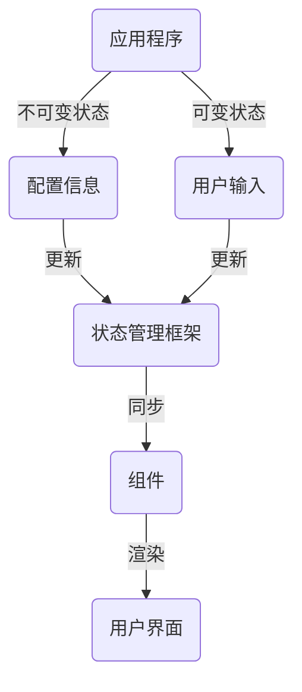

                 

关键词：Flutter、状态管理、框架对比、Redux、MobX、Provider、Vuex、状态管理策略

摘要：本文将对Flutter应用开发中常用的状态管理框架进行深入对比分析。通过详细解析Redux、MobX、Provider、Vuex等框架的特点、原理和应用场景，帮助开发者选择最适合自己项目的状态管理方案，从而提高Flutter应用的开发效率和代码可维护性。

## 1. 背景介绍

随着Flutter的日益流行，Flutter应用开发过程中遇到了一个普遍的问题——状态管理。状态管理是Flutter应用开发中的一个关键环节，良好的状态管理能够提高应用的性能、可维护性和可测试性。Flutter社区中涌现了多种状态管理框架，如Redux、MobX、Provider、Vuex等，每种框架都有其独特的优势和适用场景。

本文将对这些常用的Flutter状态管理框架进行深入对比分析，帮助开发者了解各个框架的原理、特点和应用场景，以便选择最适合自己项目的状态管理方案。

## 2. 核心概念与联系

### 2.1 Flutter应用状态管理基本概念

在Flutter中，状态管理是指对应用中数据的追踪、更新和同步。Flutter应用的状态可以分为两类：

- **不可变状态**：在应用生命周期中不会发生变化的状态，如应用的配置信息、用户信息等。
- **可变状态**：在应用运行过程中会发生变化的状态，如用户输入、页面数据等。

状态管理框架旨在提供一种有效的方式来处理这些状态，确保数据的更新和同步是高效且可靠的。

### 2.2 状态管理框架的Mermaid流程图



### 2.3 状态管理框架的原理和架构

状态管理框架的核心原理是通过对应用状态的管理，实现对组件渲染和用户交互的自动化处理。以下是对几种主流Flutter状态管理框架的简要介绍：

- **Redux**：基于Flux架构，通过单一的数据源和不可变状态的原则，实现状态的更新和同步。
- **MobX**：基于响应式编程，通过观察者模式，实现状态的自动更新和同步。
- **Provider**：Flutter官方推荐的状态管理框架，通过树形结构实现状态的自顶向下传递和组件间的状态共享。
- **Vuex**：Vue.js的状态管理框架，在Flutter中也可以使用，通过集中式存储和管理应用状态。

## 3. 核心算法原理 & 具体操作步骤

### 3.1 算法原理概述

不同状态管理框架的核心算法原理有所不同，但总体上都遵循以下原则：

- **状态更新**：通过触发事件（如用户交互）来更新应用状态。
- **状态同步**：将更新后的状态同步到所有相关的组件。
- **渲染优化**：通过高效的渲染机制，确保界面的更新是及时和准确的。

### 3.2 算法步骤详解

以下是各个状态管理框架的基本操作步骤：

#### Redux

1. **创建Store**：初始化Redux Store，并包含初始状态。
2. **创建Action**：定义用于描述状态更新的事件。
3. **创建Reducer**：定义用于处理Action，更新状态的方法。
4. **订阅Store**：监听状态变化，并触发组件更新。

#### MobX

1. **观察状态**：使用`@observable`装饰器定义可变状态。
2. **定义变化处理器**：使用`@action`装饰器定义状态更新的方法。
3. **组件更新**：通过反应性机制，自动更新相关组件。

#### Provider

1. **创建Provider**：定义用于提供状态的Provider。
2. **注入Provider**：在组件中使用`Provider.of()`或`Provider.consumer()`方法获取状态。
3. **更新状态**：调用`notifyListeners()`方法更新状态。

#### Vuex

1. **创建Store**：初始化Vuex Store，并包含初始状态。
2. **定义State**：在Store中定义应用的State。
3. **定义Getter**：在Store中定义用于获取State的方法。
4. **定义Mutation**：在Store中定义用于更新State的方法。

### 3.3 算法优缺点

不同状态管理框架各有优缺点，以下是它们的简要对比：

- **Redux**：优点是数据流向明确，状态不可变，易于测试；缺点是配置较为复杂，学习曲线较陡。
- **MobX**：优点是配置简单，自动同步状态，易于上手；缺点是响应式过度可能导致性能问题。
- **Provider**：优点是官方推荐，易于集成，适合简单的状态管理；缺点是难以处理复杂的共享状态。
- **Vuex**：优点是强大的状态管理能力，适用于大型应用；缺点是配置较为复杂，学习曲线较陡。

### 3.4 算法应用领域

不同状态管理框架适用于不同的应用场景：

- **Redux**：适用于需要严格状态管理和高可测试性的大型应用。
- **MobX**：适用于需要快速响应和简化的状态管理的中小型应用。
- **Provider**：适用于Flutter官方推荐的状态管理场景，适用于简单的应用状态管理。
- **Vuex**：适用于需要集中式状态管理的Vue.js应用，在Flutter中也可以使用。

## 4. 数学模型和公式 & 详细讲解 & 举例说明

### 4.1 数学模型构建

在状态管理中，我们可以将状态管理框架视为一个数学模型，其核心是状态的更新和同步。以下是一个简化的数学模型：

\[ S_{\text{next}} = f(S_{\text{current}}, A) \]

其中，\( S_{\text{current}} \) 表示当前状态，\( A \) 表示触发的事件，\( f \) 表示状态更新函数。

### 4.2 公式推导过程

以Redux为例，其状态更新公式可以表示为：

\[ S_{\text{next}} = R(S_{\text{current}}, A) \]

其中，\( R \) 表示Reducer函数，用于根据Action类型更新状态。

### 4.3 案例分析与讲解

假设有一个简单的计数应用，初始状态为0。用户点击按钮后，触发一个加1的Action。以下是状态更新的过程：

1. **初始状态**：\( S_{\text{current}} = 0 \)
2. **触发Action**：\( A = \{ type: 'INCREMENT' \} \)
3. **更新状态**：\( S_{\text{next}} = R(S_{\text{current}}, A) = R(0, \{ type: 'INCREMENT' \}) = 1 \)
4. **渲染界面**：界面显示计数为1

## 5. 项目实践：代码实例和详细解释说明

### 5.1 开发环境搭建

在开始项目实践之前，确保你的Flutter环境已经搭建完毕。你可以通过以下命令检查Flutter的版本：

```bash
flutter --version
```

### 5.2 源代码详细实现

以下是一个简单的计数应用的示例，使用了Provider进行状态管理。

```dart
// main.dart
import 'package:flutter/material.dart';
import 'package:flutter_riverpod/flutter_riverpod.dart';
import 'counter_provider.dart';

void main() {
  runApp(
    ProviderScope(
      child: MyApp(),
    ),
  );
}

class MyApp extends StatelessWidget {
  @override
  Widget build(BuildContext context) {
    return MaterialApp(
      title: 'Counter Example',
      theme: ThemeData(
        primarySwatch: Colors.blue,
      ),
      home: CounterPage(),
    );
  }
}

class CounterPage extends StatelessWidget {
  @override
  Widget build(BuildContext context) {
    return Scaffold(
      appBar: AppBar(title: Text('Counter')),
      body: Center(
        child: Consumer(
          builder: (context, watch, child) {
            final count = watch(counterProvider.state);
            return Text(
              'Counter: $count',
              style: Theme.of(context).textTheme.headline4,
            );
          },
        ),
      ),
      floatingActionButton: FloatingActionButton(
        onPressed: () {
          context.read(counterProvider.notifier).increment();
        },
        tooltip: 'Increment',
        child: Icon(Icons.add),
      ),
    );
  }
}

final counterProvider = Provider((ref) => CounterNotifier());

class CounterNotifier {
  int _count = 0;

  int get count => _count;

  void increment() {
    _count++;
  }
}
```

### 5.3 代码解读与分析

以上代码展示了如何使用Provider进行简单的计数应用开发。

- **main.dart**：创建了一个ProviderScope，并在此范围内定义了一个用于计数的状态Provider。
- **CounterPage**：使用Consumer组件从Provider中获取计数状态，并显示在界面上。
- **CounterNotifier**：定义了一个简单的计数器类，用于管理计数状态。

### 5.4 运行结果展示

运行上述代码，你应该看到一个简单的计数应用，点击按钮后计数会递增。

## 6. 实际应用场景

状态管理框架在Flutter应用开发中有着广泛的应用场景，以下是几个典型的例子：

- **列表应用**：在列表应用中，状态管理用于处理数据的加载、更新和刷新。
- **表单应用**：在表单应用中，状态管理用于处理表单数据的验证、提交和重置。
- **多页面应用**：在多页面应用中，状态管理用于处理页面间的数据传递和状态共享。

## 7. 工具和资源推荐

### 7.1 学习资源推荐

- **官方文档**：每个状态管理框架都有自己的官方文档，是学习框架的最佳资源。
- **在线教程**：许多在线平台提供了丰富的Flutter状态管理教程，如掘金、CSDN等。
- **书籍**：一些优秀的书籍，如《Flutter实战》、《Flutter高级编程》等，也包含了大量关于状态管理的知识。

### 7.2 开发工具推荐

- **Visual Studio Code**：一款功能强大的代码编辑器，适合进行Flutter开发。
- **Dart Code**：VS Code的插件，提供了对Dart语言的强力支持。
- **Flutter DevTools**：用于调试Flutter应用的工具，可以帮助你更好地理解状态管理。

### 7.3 相关论文推荐

- **《Reactive Programming in Flutter with MobX》**：介绍了如何在Flutter中使用MobX进行响应式编程。
- **《Flutter: A New UI Revolution for Web Developers》**：探讨了Flutter在Web开发中的应用。

## 8. 总结：未来发展趋势与挑战

### 8.1 研究成果总结

状态管理框架在Flutter应用开发中起到了至关重要的作用，通过提供高效的、可维护的状态管理方案，极大地提高了开发效率和应用的性能。

### 8.2 未来发展趋势

随着Flutter的不断发展和成熟，状态管理框架也将继续演进，可能会出现更多高效的、易于使用的状态管理解决方案。

### 8.3 面临的挑战

虽然状态管理框架提供了高效的解决方案，但在实际应用中仍然面临一些挑战，如复杂应用中的性能优化、响应式编程的滥用等。

### 8.4 研究展望

未来，状态管理框架的发展将更加注重性能优化、易用性和扩展性，同时也将探索与其他前端框架（如React、Vue.js）的集成方式。

## 9. 附录：常见问题与解答

### 9.1 如何选择合适的状态管理框架？

选择合适的状态管理框架应考虑以下因素：

- **应用规模**：大型应用适合使用Redux或Vuex，中小型应用适合使用MobX或Provider。
- **开发经验**：如果开发者对响应式编程和函数式编程有较深入的了解，可以选择MobX；如果更注重易用性，可以选择Provider。
- **项目需求**：根据项目需求，如是否需要高效的渲染、是否需要状态共享等，选择合适的框架。

### 9.2 如何优化状态管理性能？

优化状态管理性能可以从以下几个方面入手：

- **减少不必要的渲染**：通过控制组件的重建范围，减少不必要的渲染。
- **使用缓存**：在状态更新时使用缓存，避免重复的计算和渲染。
- **优化算法**：对于复杂的算法，优化其执行效率，减少计算时间。

### 9.3 如何解决状态管理中的常见问题？

常见的问题包括：

- **状态同步错误**：确保Action和Reducer的正确编写，避免状态更新不一致。
- **性能问题**：通过优化渲染机制和算法，解决性能问题。
- **组件更新异常**：检查组件的生命周期方法，确保组件更新是正常的。

---

作者：禅与计算机程序设计艺术 / Zen and the Art of Computer Programming
----------------------------------------------------------------

这篇文章对Flutter状态管理框架进行了全面的对比分析，从背景介绍、核心概念、算法原理到项目实践，再到实际应用场景和未来展望，全面阐述了各种状态管理框架的特点和应用。希望这篇文章能帮助你更好地理解和选择适合自己项目的状态管理方案。在Flutter应用开发中，状态管理是一个关键环节，选择合适的框架不仅能提高开发效率，还能确保代码的可维护性和可测试性。祝愿你在Flutter开发的道路上越走越远，不断探索和创造！
----------------------------------------------------------------


