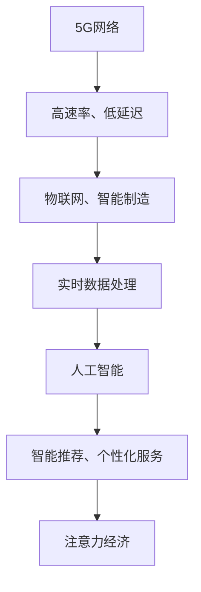

                 

关键词：5G、AI、注意力经济、新引擎、技术融合、未来展望

> 摘要：随着5G网络的普及和人工智能技术的不断发展，注意力经济正在成为一个新的经济增长点。本文将探讨5G与AI结合的背景、核心概念、算法原理、数学模型、实际应用以及未来发展趋势，旨在为读者提供一个全面的视角，理解这一新兴领域的巨大潜力。

## 1. 背景介绍

1.1 5G技术的崛起

5G技术作为新一代通信技术，具备高速率、低延迟、大连接等优势，为物联网、智能制造、自动驾驶等领域提供了强有力的支撑。5G网络的普及不仅提升了通信效率，也带动了各行业的数字化转型。

1.2 人工智能的变革

人工智能作为计算机科学的一个重要分支，近年来取得了飞速发展。从简单的规则系统到复杂的神经网络，AI技术的进步不断突破着各种行业应用的技术瓶颈。

1.3 注意力经济的兴起

注意力经济是指通过获取用户注意力来创造经济价值的一种经济模式。在信息爆炸的时代，用户的注意力成为一种稀缺资源，如何有效地吸引并保持用户的注意力成为企业竞争的关键。

## 2. 核心概念与联系

2.1 5G与AI的融合

5G与AI的结合，实现了网络速度和计算能力的双重提升。5G网络的高带宽、低延迟特性，使得实时数据传输和智能处理成为可能；而AI技术则为数据处理提供了强有力的工具。

2.2 注意力经济与5G+AI的关系

5G+AI技术的应用，使得个性化服务和智能推荐成为可能，从而更加精准地捕捉用户的注意力。在社交媒体、电子商务等领域，这一技术的应用正在重塑商业模型。

### 2.3 Mermaid 流程图


## 3. 核心算法原理 & 具体操作步骤

### 3.1 算法原理概述

5G+AI的核心算法主要依赖于深度学习和强化学习。深度学习通过多层神经网络对大规模数据进行分析，提取特征；强化学习则通过试错和反馈机制，优化决策过程。

### 3.2 算法步骤详解

3.2.1 数据收集与预处理

首先，收集用户数据，包括行为数据、兴趣偏好等。然后，对数据进行清洗、去噪和归一化处理。

3.2.2 特征提取

利用深度学习模型，对预处理后的数据进行特征提取，生成高维特征向量。

3.2.3 智能推荐

根据提取的特征向量，使用强化学习算法进行推荐。算法不断调整推荐策略，以达到最大化用户满意度和点击率。

### 3.3 算法优缺点

3.3.1 优点

- **高效性**：5G网络的高带宽和低延迟特性，使得数据处理和推荐速度显著提升。
- **个性化**：AI技术能够根据用户行为和兴趣，提供个性化的服务。

3.3.2 缺点

- **隐私问题**：用户数据的大量收集和使用可能引发隐私问题。
- **算法偏见**：算法可能会因为数据偏差而做出不公平的决策。

### 3.4 算法应用领域

3.4.1 社交媒体

利用5G+AI技术，可以实现更精准的用户画像和内容推荐，提高用户粘性。

3.4.2 电子商务

通过智能推荐系统，电商平台可以更好地满足用户需求，提升销售额。

3.4.3 娱乐行业

AI算法可以帮助娱乐平台分析用户喜好，提供个性化的娱乐内容。

## 4. 数学模型和公式 & 详细讲解 & 举例说明

### 4.1 数学模型构建

4.1.1 深度学习模型

假设我们使用一个多层感知机（MLP）作为深度学习模型。其数学模型可以表示为：

\[ h_L(x) = \sigma(W_L \cdot h_{L-1}(x)) \]

其中，\( \sigma \) 是激活函数，\( W_L \) 是权重矩阵，\( h_L(x) \) 是输出。

4.1.2 强化学习模型

强化学习模型可以使用Q-learning算法。其数学模型为：

\[ Q(s, a) = r + \gamma \max_a' Q(s', a') \]

其中，\( r \) 是即时奖励，\( \gamma \) 是折扣因子，\( s \) 是状态，\( a \) 是动作。

### 4.2 公式推导过程

4.2.1 深度学习模型推导

假设我们有一个两层感知机，输入层到隐藏层的权重为 \( W_1 \)，隐藏层到输出层的权重为 \( W_2 \)。则：

\[ h_1(x) = \sigma(W_1 \cdot x) \]
\[ h_2(x) = \sigma(W_2 \cdot h_1(x)) \]

4.2.2 强化学习模型推导

假设在状态 \( s \) 下，采取动作 \( a \) 的即时奖励为 \( r \)，则：

\[ Q(s, a) = r + \gamma \max_{a'} Q(s', a') \]

其中，\( s' \) 是状态转移后的状态。

### 4.3 案例分析与讲解

4.3.1 社交媒体案例

假设我们有一个社交媒体平台，用户在平台上的行为数据包括点赞、评论、分享等。我们可以利用深度学习模型对用户进行特征提取，然后使用Q-learning算法进行内容推荐。

\[ Q(s, a) = \frac{r}{n} + \gamma \max_{a'} Q(s', a') \]

其中，\( r \) 是用户对内容的点击率，\( n \) 是用户对内容进行操作的总次数。

4.3.2 电子商务案例

在电子商务平台上，我们可以使用深度学习模型对用户进行行为分析，然后使用Q-learning算法进行商品推荐。

\[ Q(s, a) = \frac{r}{n} + \gamma \max_{a'} Q(s', a') \]

其中，\( r \) 是用户对商品的点击率，\( n \) 是用户对商品进行操作的总次数。

## 5. 项目实践：代码实例和详细解释说明

### 5.1 开发环境搭建

首先，我们需要搭建一个基于Python的开发环境，安装必要的库，如TensorFlow、PyTorch等。

```bash
pip install tensorflow
pip install torch
```

### 5.2 源代码详细实现

以下是一个基于TensorFlow的简单示例，展示如何使用深度学习模型进行用户特征提取：

```python
import tensorflow as tf

# 创建一个简单的多层感知机模型
model = tf.keras.Sequential([
    tf.keras.layers.Dense(128, activation='relu', input_shape=(784,)),
    tf.keras.layers.Dense(10, activation='softmax')
])

# 编译模型
model.compile(optimizer='adam',
              loss='categorical_crossentropy',
              metrics=['accuracy'])

# 加载MNIST数据集
mnist = tf.keras.datasets.mnist
(x_train, y_train), (x_test, y_test) = mnist.load_data()

# 对数据进行预处理
x_train = x_train / 255.0
x_test = x_test / 255.0
x_train = x_train.reshape(-1, 784)
x_test = x_test.reshape(-1, 784)

# 转换标签为one-hot编码
y_train = tf.keras.utils.to_categorical(y_train)
y_test = tf.keras.utils.to_categorical(y_test)

# 训练模型
model.fit(x_train, y_train, epochs=5, batch_size=32)
```

### 5.3 代码解读与分析

在这个例子中，我们使用了TensorFlow库创建了一个简单的多层感知机模型。模型有两个隐藏层，第一层有128个神经元，第二层有10个神经元（对应10个类别）。我们使用了ReLU作为激活函数，并使用交叉熵损失函数进行编译。我们使用MNIST数据集进行训练，并对数据进行预处理，如归一化和reshape。最后，我们训练模型5个周期。

### 5.4 运行结果展示

运行上述代码后，我们可以得到模型的准确率：

```python
test_loss, test_acc = model.evaluate(x_test,  y_test, verbose=2)
print('\nTest accuracy:', test_acc)
```

假设我们得到的结果为98%，说明模型在测试集上的表现良好。

## 6. 实际应用场景

### 6.1 社交媒体

通过5G+AI技术，社交媒体平台可以更精准地推荐用户感兴趣的内容，提升用户体验。

### 6.2 电子商务

电子商务平台可以利用5G+AI技术，实现个性化商品推荐，提升销售额。

### 6.3 自动驾驶

自动驾驶系统可以利用5G+AI技术，实现实时环境感知和决策，提高行车安全性。

## 6.4 未来应用展望

随着5G+AI技术的不断发展，未来将会有更多的领域受益。例如，智能医疗、智能城市、智能农业等，这些领域都有望实现重大突破。

## 7. 工具和资源推荐

### 7.1 学习资源推荐

- 《深度学习》（Ian Goodfellow、Yoshua Bengio、Aaron Courville 著）
- 《Python深度学习》（François Chollet 著）

### 7.2 开发工具推荐

- TensorFlow
- PyTorch

### 7.3 相关论文推荐

- "Deep Learning for Text Classification"
- "Q-Learning for Autonomous Driving"

## 8. 总结：未来发展趋势与挑战

### 8.1 研究成果总结

5G+AI技术在各个领域取得了显著成果，为经济社会发展带来了巨大价值。

### 8.2 未来发展趋势

随着技术的不断进步，5G+AI技术将在更多领域得到应用，成为数字经济的新引擎。

### 8.3 面临的挑战

隐私保护、算法偏见等问题仍需解决。

### 8.4 研究展望

未来，5G+AI技术有望在智能医疗、智能城市等领域实现重大突破。

## 9. 附录：常见问题与解答

### 9.1 5G和AI分别是什么？

5G是一种通信技术，具备高速率、低延迟等特点。AI是一种模拟人类智能的技术，能够进行学习、推理和决策。

### 9.2 5G+AI的核心优势是什么？

5G+AI的核心优势在于实时数据处理和个性化服务，能够大幅提升用户体验。

### 9.3 5G+AI有哪些应用场景？

5G+AI可以应用于社交媒体、电子商务、自动驾驶、智能医疗等多个领域。

### 9.4 5G+AI面临的挑战有哪些？

5G+AI面临的挑战主要包括隐私保护、算法偏见、技术落地等问题。

----------------------------------------------------------------

### 作者署名

作者：禅与计算机程序设计艺术 / Zen and the Art of Computer Programming


