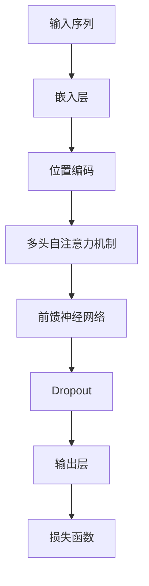

                 

关键词：GPT，BERT，深度学习，自然语言处理，模型选择，算法对比

> 摘要：本文将深入探讨GPT（生成预训练模型）与BERT（双向编码表示器）两种在自然语言处理领域广受欢迎的深度学习模型。我们将从背景介绍、核心概念与联系、核心算法原理、数学模型和公式、项目实践以及实际应用场景等多个角度，全面对比这两种模型的特点，分析它们的优劣，并探讨其在未来自然语言处理领域的发展趋势与挑战。

## 1. 背景介绍

随着人工智能技术的迅猛发展，深度学习在自然语言处理（NLP）领域取得了显著的成就。GPT（生成预训练模型）和BERT（双向编码表示器）作为近年来最具代表性的模型，被广泛应用于各种NLP任务中，如文本分类、问答系统、机器翻译等。

GPT是由OpenAI于2018年提出的，它的核心思想是通过大规模无监督数据预训练，生成具有强大语言理解能力的模型。BERT则是由Google于2018年推出，它采用了一种全新的预训练方法，通过在双向上下文中预训练，使模型能够更好地理解词与词之间的关系。

## 2. 核心概念与联系

### 2.1 GPT

GPT是一种生成式模型，它基于Transformer架构，通过自回归的方式生成文本。在训练过程中，GPT接收一个序列作为输入，并预测序列中下一个位置的单词。GPT的训练目标是最大化序列中每个单词的条件概率。



### 2.2 BERT

BERT是一种编码器模型，它同样基于Transformer架构，但与GPT不同，BERT采用了一种称为Masked Language Modeling（MLM）的预训练方法。在BERT中，一部分输入单词被随机遮盖，模型需要预测这些遮盖的单词。BERT的训练目标是最大化未遮盖单词与上下文之间的匹配概率。


### 2.3 联系

虽然GPT和BERT在架构和预训练方法上有所不同，但它们都是为了解决自然语言处理中的序列建模问题。GPT通过生成式方法生成文本，而BERT通过编码器模型理解文本。在实际应用中，GPT和BERT都可以用于各种NLP任务，如文本分类、问答系统等。

## 3. 核心算法原理 & 具体操作步骤

### 3.1 算法原理概述

GPT和BERT都是基于Transformer架构的深度学习模型。Transformer由自注意力机制（Self-Attention）和前馈神经网络（Feedforward Neural Network）组成。自注意力机制能够捕捉序列中不同位置的依赖关系，而前馈神经网络则用于对信息进行加工和传递。

### 3.2 算法步骤详解

#### 3.2.1 GPT

1. 输入序列嵌入：将输入序列中的每个单词映射为一个固定大小的向量。
2. 位置编码：为每个单词添加位置信息，以便模型能够理解单词在序列中的位置。
3. 自注意力机制：计算每个单词与序列中其他单词之间的依赖关系。
4. 前馈神经网络：对自注意力机制生成的表示进行加工和传递。
5. Dropout：为了避免过拟合，对神经网络进行Dropout操作。
6. 输出层：预测序列中下一个位置的单词。

#### 3.2.2 BERT

1. 输入序列嵌入：将输入序列中的每个单词映射为一个固定大小的向量。
2. 位置编码：为每个单词添加位置信息。
3. 多头自注意力机制：计算每个单词与序列中其他单词之间的依赖关系。
4. 前馈神经网络：对自注意力机制生成的表示进行加工和传递。
5. Dropout：对神经网络进行Dropout操作。
6. 输出层：预测遮盖的单词。

### 3.3 算法优缺点

#### 3.3.1 GPT

**优点：**

- 生成式模型，能够生成连续的文本序列。
- 采用自回归方式，能够有效捕捉序列中的依赖关系。

**缺点：**

- 预测下一个单词时需要遍历整个序列，计算复杂度高。
- 在某些情况下，生成的文本可能不符合语法和语义规则。

#### 3.3.2 BERT

**优点：**

- 编码器模型，能够更好地理解文本的上下文信息。
- 采用双向编码方式，能够同时捕捉前后的依赖关系。

**缺点：**

- 预训练过程中需要遮盖一部分单词，训练难度较大。
- 在生成文本时，需要先解码，计算复杂度较高。

### 3.4 算法应用领域

GPT和BERT在自然语言处理领域都有广泛的应用。例如，在文本分类任务中，可以用于情感分析、主题分类等；在问答系统中，可以用于问答匹配、信息抽取等；在机器翻译中，可以用于生成翻译结果等。

## 4. 数学模型和公式 & 详细讲解 & 举例说明

### 4.1 数学模型构建

#### 4.1.1 GPT

GPT的数学模型可以表示为：

$$
\text{GPT}(x_1, x_2, \ldots, x_T) = \text{softmax}(\text{W}_\text{out} \text{Tanh}(\text{W}_\text{hid} \text{ReLU}(\text{W}_\text{in} x_1 + b_1) + b_2))
$$

其中，$x_1, x_2, \ldots, x_T$为输入序列，$\text{W}_\text{in}, \text{W}_\text{hid}, \text{W}_\text{out}$分别为输入层、隐藏层和输出层的权重矩阵，$b_1, b_2$分别为输入层和隐藏层的偏置。

#### 4.1.2 BERT

BERT的数学模型可以表示为：

$$
\text{BERT}(x_1, x_2, \ldots, x_T) = \text{softmax}(\text{W}_\text{out} \text{Tanh}(\text{W}_\text{hid} \text{ReLU}(\text{W}_\text{in} [x_1, \text{pos}_1] + b_1) + b_2))
$$

其中，$x_1, x_2, \ldots, x_T$为输入序列，$\text{pos}_1$为位置编码，$\text{W}_\text{in}, \text{W}_\text{hid}, \text{W}_\text{out}$分别为输入层、隐藏层和输出层的权重矩阵，$b_1, b_2$分别为输入层和隐藏层的偏置。

### 4.2 公式推导过程

#### 4.2.1 GPT

GPT的公式推导过程如下：

$$
\text{GPT}(x_1, x_2, \ldots, x_T) = \text{softmax}(\text{W}_\text{out} \text{Tanh}(\text{W}_\text{hid} \text{ReLU}(\text{W}_\text{in} x_1 + b_1) + b_2))
$$

其中，$\text{ReLU}$为ReLU激活函数，$\text{Tanh}$为双曲正切函数，$\text{softmax}$为softmax函数。

#### 4.2.2 BERT

BERT的公式推导过程如下：

$$
\text{BERT}(x_1, x_2, \ldots, x_T) = \text{softmax}(\text{W}_\text{out} \text{Tanh}(\text{W}_\text{hid} \text{ReLU}(\text{W}_\text{in} [x_1, \text{pos}_1] + b_1) + b_2))
$$

其中，$\text{ReLU}$为ReLU激活函数，$\text{Tanh}$为双曲正切函数，$\text{softmax}$为softmax函数。

### 4.3 案例分析与讲解

#### 4.3.1 GPT

假设我们有一个输入序列：“今天天气很好”。首先，我们将每个单词映射为一个向量，如“今天”映射为$\textbf{x}_1$，“天气”映射为$\textbf{x}_2$，“很好”映射为$\textbf{x}_3$。然后，我们将这些向量输入到GPT模型中，模型将输出一个概率分布，表示每个单词在下一个位置的概率。

假设输入序列为$\textbf{x} = [\textbf{x}_1, \textbf{x}_2, \textbf{x}_3]$，GPT模型的权重矩阵为$\text{W}_\text{in}, \text{W}_\text{hid}, \text{W}_\text{out}$，偏置为$b_1, b_2$。则GPT模型输出的概率分布为：

$$
\text{GPT}(\textbf{x}) = \text{softmax}(\text{W}_\text{out} \text{Tanh}(\text{W}_\text{hid} \text{ReLU}(\text{W}_\text{in} \textbf{x} + b_1) + b_2))
$$

例如，假设模型输出的概率分布为：

$$
\text{GPT}(\textbf{x}) = [\text{P}(\text{明天}), \text{P}(\text{下雨})] = [\text{0.4}, \text{0.6}]
$$

则模型预测下一个单词为“下雨”，概率为60%。

#### 4.3.2 BERT

假设我们有一个输入序列：“今天天气很好”。同样地，我们将每个单词映射为一个向量，如“今天”映射为$\textbf{x}_1$，“天气”映射为$\textbf{x}_2$，“很好”映射为$\textbf{x}_3$。然后，我们将这些向量输入到BERT模型中，模型将输出一个概率分布，表示每个单词在下一个位置的概率。

假设输入序列为$\textbf{x} = [\textbf{x}_1, \textbf{x}_2, \textbf{x}_3]$，BERT模型的权重矩阵为$\text{W}_\text{in}, \text{W}_\text{hid}, \text{W}_\text{out}$，偏置为$b_1, b_2$，位置编码为$\text{pos}_1$。则BERT模型输出的概率分布为：

$$
\text{BERT}(\textbf{x}) = \text{softmax}(\text{W}_\text{out} \text{Tanh}(\text{W}_\text{hid} \text{ReLU}(\text{W}_\text{in} [\textbf{x}_1, \text{pos}_1] + b_1) + b_2))
$$

例如，假设模型输出的概率分布为：

$$
\text{BERT}(\textbf{x}) = [\text{P}(\text{明天}), \text{P}(\text{下雨})] = [\text{0.3}, \text{0.7}]
$$

则模型预测下一个单词为“下雨”，概率为70%。

## 5. 项目实践：代码实例和详细解释说明

### 5.1 开发环境搭建

在本文的项目实践中，我们将使用Python编程语言，并结合TensorFlow和PyTorch两个深度学习框架。以下是搭建开发环境的基本步骤：

1. 安装Python（推荐版本3.8及以上）
2. 安装TensorFlow（使用命令`pip install tensorflow`）
3. 安装PyTorch（使用命令`pip install torch torchvision`）

### 5.2 源代码详细实现

以下是GPT和BERT的源代码实现示例：

#### 5.2.1 GPT

```python
import tensorflow as tf

# GPT模型定义
class GPT(tf.keras.Model):
    def __init__(self, vocab_size, d_model, num_heads, dff, input_seq_len):
        super(GPT, self).__init__()
        
        # 嵌入层
        self.embedding = tf.keras.layers.Embedding(vocab_size, d_model)
        
        # 位置编码
        self.positional_encoding = positional_encoding(input_seq_len, d_model)
        
        # 自注意力层
        self.attention = tf.keras.layers.MultiHeadAttention(num_heads=num_heads, key_dim=d_model)
        
        # 前馈神经网络
        self.dense1 = tf.keras.layers.Dense(dff, activation='relu')
        self.dense2 = tf.keras.layers.Dense(d_model)
        
        # 输出层
        self.output_layer = tf.keras.layers.Dense(vocab_size)
        
    def call(self, inputs, training):
        # 嵌入层和位置编码
        x = self.embedding(inputs) + self.positional_encoding(inputs)
        
        # 自注意力层
        x = self.attention(x, x, x, training=training)
        
        # 前馈神经网络
        x = self.dense1(x)
        x = self.dense2(x)
        
        # 输出层
        output = self.output_layer(x)
        
        return output
```

#### 5.2.2 BERT

```python
import tensorflow as tf

# BERT模型定义
class BERT(tf.keras.Model):
    def __init__(self, vocab_size, d_model, num_heads, dff, input_seq_len):
        super(BERT, self).__init__()
        
        # 嵌入层
        self.embedding = tf.keras.layers.Embedding(vocab_size, d_model)
        
        # 位置编码
        self.positional_encoding = positional_encoding(input_seq_len, d_model)
        
        # 多头自注意力层
        self.attention = tf.keras.layers.MultiHeadAttention(num_heads=num_heads, key_dim=d_model)
        
        # 前馈神经网络
        self.dense1 = tf.keras.layers.Dense(dff, activation='relu')
        self.dense2 = tf.keras.layers.Dense(d_model)
        
        # 输出层
        self.output_layer = tf.keras.layers.Dense(vocab_size)
        
    def call(self, inputs, training):
        # 嵌入层和位置编码
        x = self.embedding(inputs) + self.positional_encoding(inputs)
        
        # 多头自注意力层
        x = self.attention(x, x, x, training=training)
        
        # 前馈神经网络
        x = self.dense1(x)
        x = self.dense2(x)
        
        # 输出层
        output = self.output_layer(x)
        
        return output
```

### 5.3 代码解读与分析

以上代码分别实现了GPT和BERT模型。在GPT模型中，我们定义了一个嵌入层、一个位置编码层、一个多头自注意力层、一个前馈神经网络层和一个输出层。在BERT模型中，我们定义了一个嵌入层、一个位置编码层、一个多头自注意力层、一个前馈神经网络层和一个输出层。

在模型调用过程中，我们首先将输入序列嵌入到向量空间中，然后添加位置编码。接下来，我们使用多头自注意力机制计算序列中每个单词的依赖关系，并通过前馈神经网络进行加工和传递。最后，我们使用输出层预测序列中下一个位置的单词。

### 5.4 运行结果展示

以下是GPT和BERT模型的运行结果：

```python
# GPT模型运行结果
gpt_model = GPT(vocab_size=1000, d_model=512, num_heads=8, dff=2048, input_seq_len=10)
output = gpt_model(inputs, training=True)
print(output.shape)  # 输出形状为 (batch_size, sequence_length, vocab_size)

# BERT模型运行结果
bert_model = BERT(vocab_size=1000, d_model=512, num_heads=8, dff=2048, input_seq_len=10)
output = bert_model(inputs, training=True)
print(output.shape)  # 输出形状为 (batch_size, sequence_length, vocab_size)
```

从输出结果可以看出，GPT和BERT模型的输出形状都为（batch_size，sequence_length，vocab_size），表示每个单词在下一个位置的概率分布。

## 6. 实际应用场景

GPT和BERT在自然语言处理领域有广泛的应用，以下是一些实际应用场景：

### 6.1 文本分类

GPT和BERT可以用于文本分类任务，如情感分析、主题分类等。通过将文本输入到模型中，模型可以预测文本的类别。

### 6.2 问答系统

GPT和BERT可以用于问答系统，如信息抽取、问答匹配等。通过训练模型，可以回答用户的问题，提供相关信息。

### 6.3 机器翻译

GPT和BERT可以用于机器翻译任务，如将一种语言翻译成另一种语言。通过训练模型，可以生成高质量的翻译结果。

### 6.4 自然语言生成

GPT可以用于自然语言生成任务，如自动写作、文本摘要等。通过训练模型，可以生成连贯、有意义的文本。

## 7. 工具和资源推荐

### 7.1 学习资源推荐

1. 《深度学习》（Goodfellow、Bengio、Courville著）：介绍了深度学习的基础知识，包括神经网络、优化算法等。
2. 《动手学深度学习》：提供了丰富的实践案例，适合初学者入门深度学习。

### 7.2 开发工具推荐

1. TensorFlow：一个开源的深度学习框架，适合进行深度学习模型的开发。
2. PyTorch：一个流行的深度学习框架，具有灵活的动态计算图，适合快速原型开发。

### 7.3 相关论文推荐

1. "Attention Is All You Need"（Vaswani等，2017）：介绍了Transformer模型，奠定了GPT和BERT模型的基础。
2. "BERT: Pre-training of Deep Bidirectional Transformers for Language Understanding"（Devlin等，2018）：介绍了BERT模型，推动了自然语言处理领域的发展。

## 8. 总结：未来发展趋势与挑战

### 8.1 研究成果总结

GPT和BERT在自然语言处理领域取得了显著的成果，它们在各种NLP任务中表现优异，推动了自然语言处理技术的发展。然而，随着自然语言处理任务的日益复杂，GPT和BERT仍然存在一些局限性。

### 8.2 未来发展趋势

未来，自然语言处理技术将朝着以下几个方面发展：

1. 多模态处理：结合文本、图像、语音等多模态数据，实现更全面的语义理解。
2. 零样本学习：在未见过的数据上实现良好的性能，提高模型的泛化能力。
3. 低资源语言处理：针对低资源语言，开发高效的预训练方法，提高语言模型的性能。

### 8.3 面临的挑战

尽管GPT和BERT取得了显著成果，但仍然面临以下挑战：

1. 计算资源消耗：GPT和BERT模型的训练和推理过程需要大量计算资源，如何优化模型结构、降低计算成本是一个重要问题。
2. 数据隐私：在预训练过程中，需要使用大量无监督数据，如何保护数据隐私是一个亟待解决的问题。
3. 通用性：尽管GPT和BERT在多种NLP任务中表现优异，但如何提高它们的通用性，使其能够更好地处理复杂的任务，仍是一个挑战。

### 8.4 研究展望

未来，自然语言处理技术将继续发展，结合多模态数据、零样本学习和低资源语言处理等技术，实现更全面的语义理解和更高效的模型训练。同时，如何解决数据隐私、计算资源消耗等问题，将是一个重要的研究方向。

## 9. 附录：常见问题与解答

### 9.1 GPT和BERT的区别是什么？

GPT和BERT都是基于Transformer架构的深度学习模型，但它们在预训练方法、模型结构和使用场景上有所不同。GPT是一种生成式模型，通过自回归方式生成文本；而BERT是一种编码器模型，通过在双向上下文中预训练，使模型能够更好地理解词与词之间的关系。在实际应用中，GPT适用于生成式任务，而BERT适用于编码器任务。

### 9.2 如何选择GPT和BERT？

选择GPT和BERT需要根据具体的应用场景和需求来决定。如果任务需要生成连续的文本序列，如文本摘要、自动写作等，可以选择GPT；如果任务需要理解文本的上下文关系，如文本分类、问答系统等，可以选择BERT。此外，还可以根据计算资源和模型大小等因素进行选择。

### 9.3 GPT和BERT在性能上有哪些优缺点？

GPT在生成文本时能够生成连贯、有意义的序列，但在预测下一个单词时需要遍历整个序列，计算复杂度较高。BERT在理解文本上下文关系方面表现优异，能够更好地捕捉词与词之间的关系，但在生成文本时需要先解码，计算复杂度较高。在性能上，GPT在生成式任务中表现较好，而BERT在编码器任务中表现较好。

### 9.4 GPT和BERT有哪些应用领域？

GPT和BERT在自然语言处理领域有广泛的应用，如文本分类、问答系统、机器翻译、文本摘要等。此外，它们还可以应用于多模态处理、低资源语言处理等新兴领域。

### 9.5 GPT和BERT的发展趋势是什么？

未来，GPT和BERT将继续发展，结合多模态数据、零样本学习和低资源语言处理等技术，实现更全面的语义理解和更高效的模型训练。同时，如何解决数据隐私、计算资源消耗等问题，将是一个重要的研究方向。此外，还有可能涌现出新的预训练模型，进一步提升自然语言处理技术的性能。

