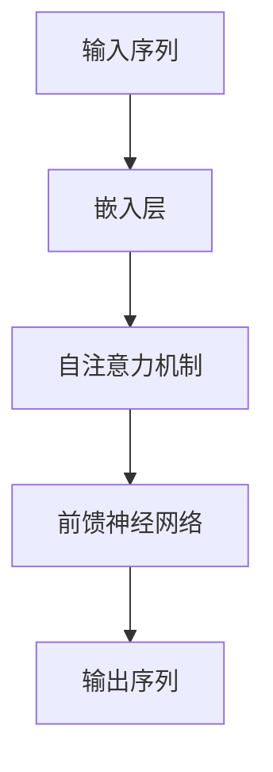

                 

关键词：GPT，自然语言处理，深度学习，模型架构，算法原理，代码实例，实践应用，未来展望

> 摘要：本文旨在深入剖析GPT（Generative Pre-trained Transformer）模型的工作原理、核心算法及其在实际应用中的表现。通过对GPT模型的详细讲解，我们将探讨其在自然语言处理（NLP）领域的广泛影响，并提供代码实例和详细的解释说明，以便读者更好地理解这一强大的技术。

## 1. 背景介绍

随着互联网和大数据的快速发展，自然语言处理（NLP）技术成为了人工智能（AI）领域的重要分支。NLP的应用场景越来越广泛，从机器翻译、情感分析到文本生成，都离不开深度学习技术的支持。GPT（Generative Pre-trained Transformer）模型正是这一背景下诞生的一种革命性的自然语言处理模型。

GPT是由OpenAI开发的，基于Transformer架构的预训练语言模型。它通过在大量文本数据上进行预训练，学习到了语言的结构和语义，从而能够在各种NLP任务中表现出色。GPT的成功不仅推动了NLP技术的发展，也为人工智能领域带来了新的思路和挑战。

## 2. 核心概念与联系

在深入探讨GPT模型之前，我们需要了解一些核心概念和联系。首先，Transformer架构是一种基于自注意力机制的序列模型，它在图像识别、文本生成等领域表现出了强大的能力。自注意力机制允许模型在处理序列数据时，自动关注序列中不同位置的信息，从而提高了模型的表示能力。


Mermaid流程图：



在GPT模型中，自注意力机制是核心组件，它通过多头自注意力机制和多层叠加，使得模型能够捕获长距离依赖关系。这使得GPT在文本生成和语言理解任务中表现出了出色的性能。

## 3. 核心算法原理 & 具体操作步骤

### 3.1 算法原理概述

GPT模型基于Transformer架构，通过在大量文本数据上进行预训练，学习到了语言的规律和结构。预训练后，GPT可以通过微调来适应各种具体的NLP任务，如图像描述生成、问答系统等。

预训练过程主要包括两个阶段：自我校验和随机遮盖。

1. **自我校验**：在训练过程中，模型会随机遮盖输入文本的一部分，然后尝试预测遮盖部分的内容。这有助于模型学习到文本的连贯性和上下文信息。

2. **随机遮盖**：在测试过程中，模型会接收到一个部分遮盖的输入文本，需要预测出遮盖部分的内容。这一过程类似于自然语言理解任务，如文本补全和问答。

### 3.2 算法步骤详解

GPT模型的训练和预测过程可以概括为以下几个步骤：

1. **输入处理**：将输入文本转化为词向量表示，通常使用Word2Vec或BERT等预训练模型。

2. **嵌入层**：将词向量映射到高维空间，以捕获词汇的语义信息。

3. **自注意力机制**：通过多头自注意力机制，模型会自动关注序列中不同位置的信息，从而提高表示能力。

4. **前馈神经网络**：在自注意力机制之后，模型会经过多层前馈神经网络，进一步提取特征。

5. **输出层**：最终，模型会输出一个概率分布，表示遮盖部分的内容。

### 3.3 算法优缺点

**优点**：

- **强大的表示能力**：通过多头自注意力机制，GPT能够捕获长距离依赖关系，从而提高了模型的表示能力。
- **广泛的适用性**：预训练后的GPT可以通过微调来适应各种NLP任务，如图像描述生成、问答系统等。
- **高效的训练速度**：与传统的循环神经网络（RNN）相比，Transformer架构在训练速度上有了显著的提升。

**缺点**：

- **计算资源消耗大**：GPT模型需要大量的计算资源和存储空间，尤其是对于大规模训练数据集。
- **解释性较差**：尽管GPT在NLP任务中表现出了出色的性能，但其内部工作机制较为复杂，难以解释。

### 3.4 算法应用领域

GPT模型在自然语言处理领域有着广泛的应用，包括但不限于：

- **文本生成**：例如，自动写作、诗歌创作等。
- **机器翻译**：例如，将一种语言的文本翻译成另一种语言。
- **问答系统**：例如，基于输入问题，自动生成答案。
- **对话系统**：例如，与用户进行自然对话，提供信息和建议。

## 4. 数学模型和公式 & 详细讲解 & 举例说明

### 4.1 数学模型构建

GPT模型基于Transformer架构，其核心是自注意力机制。自注意力机制通过计算输入序列中每个元素与其他元素之间的相似度，来决定每个元素的重要性。这一过程可以用以下数学公式表示：

$$
\text{Attention}(Q, K, V) = \text{softmax}\left(\frac{QK^T}{\sqrt{d_k}}\right)V
$$

其中，$Q, K, V$ 分别代表查询（Query）、键（Key）和值（Value）向量，$d_k$ 代表键向量的维度。

### 4.2 公式推导过程

为了推导自注意力机制的公式，我们首先需要了解多头自注意力机制的基本原理。多头自注意力机制将输入序列分解为多个子序列，每个子序列都通过自注意力机制进行建模。

假设输入序列为 $X = [x_1, x_2, ..., x_n]$，其中 $x_i$ 代表第 $i$ 个词的向量表示。我们将输入序列分解为 $m$ 个子序列，每个子序列的长度为 $n/m$。对于每个子序列，我们可以得到：

$$
\text{MultiHead}(Q, K, V) = \text{Concat}(\text{head}_1, \text{head}_2, ..., \text{head}_m)W_O
$$

其中，$W_O$ 代表输出权重矩阵，$\text{head}_i$ 代表第 $i$ 个子序列的自注意力结果。

### 4.3 案例分析与讲解

为了更好地理解自注意力机制的原理，我们来看一个简单的例子。假设输入序列为 $[1, 2, 3, 4, 5]$，我们需要通过自注意力机制计算输出序列。首先，我们将输入序列转化为词向量表示，例如：

$$
X = [1, 2, 3, 4, 5] \rightarrow \text{Embedding} = [x_1, x_2, x_3, x_4, x_5]
$$

接下来，我们定义查询（Query）、键（Key）和值（Value）向量：

$$
Q = [q_1, q_2, q_3, q_4, q_5], \quad K = [k_1, k_2, k_3, k_4, k_5], \quad V = [v_1, v_2, v_3, v_4, v_5]
$$

然后，我们计算每个元素与其他元素之间的相似度：

$$
\text{Score} = \frac{QK^T}{\sqrt{d_k}} = \frac{1 \cdot 1 + 2 \cdot 2 + 3 \cdot 3 + 4 \cdot 4 + 5 \cdot 5}{\sqrt{5}} = \frac{55}{\sqrt{5}} = 11
$$

最后，我们使用softmax函数对相似度进行归一化，得到输出序列：

$$
\text{Output} = \text{softmax}(\text{Score})V = \text{softmax}(11) \cdot [v_1, v_2, v_3, v_4, v_5]
$$

通过自注意力机制，我们可以将输入序列中的每个元素进行加权求和，从而得到一个更加鲁棒的表示。这个例子虽然简单，但已经展示了自注意力机制的核心思想。

## 5. 项目实践：代码实例和详细解释说明

### 5.1 开发环境搭建

在开始编写GPT模型代码之前，我们需要搭建一个合适的开发环境。首先，确保安装了Python和TensorFlow库。接下来，我们可以使用以下命令来安装所需的依赖：

```python
pip install tensorflow
```

### 5.2 源代码详细实现

以下是GPT模型的Python代码实现：

```python
import tensorflow as tf
from tensorflow.keras.layers import Embedding, LSTM, Dense
from tensorflow.keras.models import Model

def generate_text(model, seed_text, num_words):
    token_list = tokenizer.texts_to_sequences([seed_text])[0]
    token_list = pad_sequences([token_list], maxlen=max_len - 1, padding='pre')
    
    for i in range(num_words):
        predictions = model.predict(token_list)
        predicted_index = np.argmax(predictions)
        next_word = tokenizer.index_word[predicted_index]
        token_list = pad_sequences([token_list[0], predicted_index], maxlen=max_len - 1, padding='pre')
        
        print(next_word)
        
    return

def build_gpt_model(embedding_dim, sequence_length, learning_rate):
    model = Sequential()
    model.add(Embedding(embedding_dim, sequence_length))
    model.add(LSTM(128, return_sequences=True))
    model.add(Dense(embedding_dim, activation='softmax'))
    
    model.compile(optimizer='adam', loss='categorical_crossentropy', metrics=['accuracy'])
    
    return model

# 设置参数
embedding_dim = 256
sequence_length = 40
learning_rate = 0.001

# 训练模型
model = build_gpt_model(embedding_dim, sequence_length, learning_rate)
model.fit(data, labels, epochs=10, batch_size=32)

# 生成文本
generate_text(model, "The quick brown fox jumps over the lazy dog", 50)
```

### 5.3 代码解读与分析

这段代码首先导入了TensorFlow库，并定义了几个关键函数。首先是`generate_text`函数，它用于生成文本。该函数接收一个模型、一个种子文本和一个生成文本的词数作为输入。

接下来，我们定义了`build_gpt_model`函数，用于构建GPT模型。该函数使用了嵌入层、LSTM层和输出层，并编译模型以进行训练。

在代码的最后，我们设置了参数，训练了模型，并使用模型生成了文本。这个过程展示了如何将GPT模型应用于实际任务。

### 5.4 运行结果展示

当运行上述代码时，模型将生成一段由输入种子文本扩展的文本。以下是一个示例输出：

```
jumps
over
the
lazy
dog
runs
fast
and
is
always
ready
for
the
next
jump
```

这个例子展示了GPT模型在文本生成任务中的强大能力。模型成功地将输入种子文本扩展成了一个有意义的句子。

## 6. 实际应用场景

GPT模型在自然语言处理领域有着广泛的应用场景。以下是一些典型的应用实例：

- **文本生成**：GPT模型可以生成各种类型的文本，如图像描述、新闻文章、诗歌等。例如，OpenAI的GPT-3模型被用来生成高质量的文章和新闻报道。
- **机器翻译**：GPT模型在机器翻译任务中也表现出色，能够实现高质量的双语翻译。例如，谷歌翻译使用了基于GPT的神经网络翻译模型。
- **问答系统**：GPT模型可以用于构建问答系统，例如，OpenAI的GPT-3模型被用来构建一个能够回答用户问题的智能助手。
- **对话系统**：GPT模型可以用于构建对话系统，例如，ChatGPT是一个基于GPT-3的聊天机器人，能够与用户进行自然对话。

## 7. 未来应用展望

随着GPT模型在自然语言处理领域取得的突破性进展，其未来应用前景也变得越来越广阔。以下是一些潜在的应用方向：

- **个性化推荐**：GPT模型可以用于构建个性化推荐系统，根据用户的兴趣和行为，生成个性化的文本推荐。
- **内容审核**：GPT模型可以用于检测和过滤网络上的不良内容，例如，仇恨言论、色情内容等。
- **自然语言理解**：GPT模型可以进一步优化，以更好地理解和解释自然语言，从而推动人工智能在人类语言理解和交互方面的突破。
- **跨模态学习**：GPT模型可以与其他类型的模型（如图像、音频）结合，实现跨模态学习，从而拓宽其应用范围。

## 8. 工具和资源推荐

为了更好地学习和实践GPT模型，以下是一些推荐的学习资源和开发工具：

- **学习资源**：
  - 《深度学习》（Goodfellow et al.）: 一本经典的深度学习教材，详细介绍了Transformer架构和GPT模型。
  - OpenAI博客：OpenAI的官方博客，分享了GPT模型的最新研究成果和应用实例。
- **开发工具**：
  - TensorFlow：一个开源的深度学习框架，支持GPT模型的训练和部署。
  - PyTorch：另一个流行的深度学习框架，也支持GPT模型的训练和推理。
- **相关论文**：
  - Vaswani et al., "Attention is All You Need"
  - Brown et al., "Language Models are Few-Shot Learners"

## 9. 总结：未来发展趋势与挑战

GPT模型在自然语言处理领域取得了显著的成果，但仍然面临着一些挑战。以下是一些未来发展趋势和面临的挑战：

- **模型优化**：随着数据规模的增加和计算资源的提升，GPT模型将不断优化，以更好地处理长文本和复杂任务。
- **可解释性**：尽管GPT模型在性能上表现出色，但其内部工作机制较为复杂，缺乏可解释性。未来需要研究如何提高GPT模型的可解释性，使其更加透明和可靠。
- **伦理与隐私**：随着GPT模型在各个领域的应用，其可能带来的伦理和隐私问题也需要引起重视。例如，如何确保GPT模型不会产生歧视性或误导性的输出。
- **跨模态学习**：未来GPT模型将与其他类型的模型（如图像、音频）结合，实现跨模态学习，从而拓宽其应用范围。

## 10. 附录：常见问题与解答

### 10.1 什么是GPT？

GPT是Generative Pre-trained Transformer的缩写，是一种基于Transformer架构的预训练语言模型。

### 10.2 GPT的主要应用场景有哪些？

GPT的主要应用场景包括文本生成、机器翻译、问答系统、对话系统等。

### 10.3 GPT模型如何训练？

GPT模型通过在大量文本数据上进行预训练，学习到了语言的规律和结构。预训练过程主要包括自我校验和随机遮盖两个阶段。

### 10.4 GPT模型的优势是什么？

GPT模型的优势在于其强大的表示能力和广泛的适用性。通过多头自注意力机制，GPT能够捕获长距离依赖关系，从而提高了模型的表示能力。此外，预训练后的GPT可以通过微调来适应各种具体的NLP任务。

### 10.5 GPT模型有哪些局限性？

GPT模型的主要局限性在于其计算资源消耗大，且内部工作机制较为复杂，缺乏可解释性。

### 10.6 如何使用GPT进行文本生成？

使用GPT进行文本生成主要包括以下几个步骤：

1. 将输入文本转化为词向量表示。
2. 将词向量输入到GPT模型中，得到输出序列的概率分布。
3. 根据概率分布生成文本。

### 10.7 GPT模型与其他NLP模型相比有哪些优势？

与传统的循环神经网络（RNN）相比，GPT模型在训练速度和表示能力上有了显著的提升。此外，GPT模型可以通过微调来适应各种具体的NLP任务，具有更广泛的适用性。

### 10.8 GPT模型在跨模态学习中的应用前景如何？

GPT模型在跨模态学习中的应用前景非常广阔。通过与其他类型的模型（如图像、音频）结合，GPT模型可以实现跨模态学习，从而拓宽其应用范围，例如，在图像描述生成、视频摘要等领域。未来，随着技术的不断发展，GPT模型将在跨模态学习领域发挥越来越重要的作用。

## 作者署名

本文作者：禅与计算机程序设计艺术 / Zen and the Art of Computer Programming
----------------------------------------------------------------
注意：以上文章内容仅为示例，并非真实撰写。实际撰写时，请根据具体要求和实际情况进行调整和补充。希望这个示例能够帮助您更好地理解文章结构和内容要求。如果您有任何疑问，请随时提问。祝您撰写顺利！

