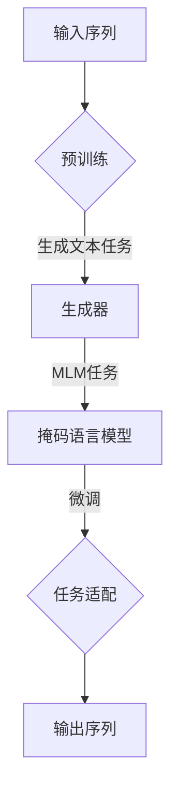

                 

关键词：GPT系列，语言模型，人工智能，神经网络，预训练模型，深度学习，自然语言处理。

## 摘要

本文将对GPT（Generative Pre-trained Transformer）系列模型进行系统性的架构解析，从GPT-1到GPT-4。我们将深入探讨这些模型的演进历程，包括其核心概念、算法原理、数学模型以及在实际应用中的表现。通过本文的阅读，读者将全面理解GPT系列模型的发展趋势，并对其在自然语言处理领域的深远影响有更清晰的认识。

### 1. 背景介绍

#### 1.1 自然语言处理的发展历程

自然语言处理（NLP）是人工智能的一个重要分支，旨在让计算机理解和生成人类语言。自20世纪50年代以来，NLP经历了多个阶段的发展。最初，研究者们依赖于规则驱动的方法，即通过编写大量的语法规则和词典来实现对语言的理解。然而，这种方法在处理复杂和多样化的语言时表现有限。

随着计算能力和数据量的提升，统计方法逐渐成为主流。基于统计的方法通过训练大规模的语料库来学习语言模式，从而实现对自然语言的有效处理。经典的统计模型如N元语法（N-gram）和隐马尔可夫模型（HMM）在特定场景下取得了显著的成果。

然而，统计方法仍然存在一些局限性，尤其是在处理长文本和上下文依赖性方面。为了解决这些问题，深度学习技术开始应用于自然语言处理领域，并迅速取得了突破性的进展。其中，基于神经网络的深度学习模型在NLP任务中展现了强大的性能。

#### 1.2 深度学习在NLP中的应用

深度学习通过多层神经网络结构来模拟人脑的神经元连接，从而实现从大量数据中自动提取特征的能力。在NLP领域，深度学习模型的应用范围不断扩大，从简单的词向量表示到复杂的语言生成和翻译任务。

词向量模型如Word2Vec、GloVe等通过将单词映射到高维空间中的向量，成功地捕捉了词语的语义关系。随后，序列模型如循环神经网络（RNN）和长短时记忆网络（LSTM）进一步提升了语言建模的效果，特别是在处理长文本和上下文依赖方面。

然而，尽管深度学习在NLP中取得了显著进展，但仍然面临一些挑战。首先，深度学习模型通常需要大量的训练数据和计算资源。其次，模型的解释性较差，难以理解其决策过程。此外，深度学习模型的泛化能力也有限，容易在新的任务和数据上过拟合。

为了解决这些问题，研究者们开始探索预训练和微调的方法。预训练是指在大量的未标注数据上进行训练，以学习通用的语言表示和特征，然后再在具体任务上进行微调。这种方法有效地提高了模型的泛化能力和性能。

### 1.3 GPT系列模型的背景

GPT系列模型是由OpenAI开发的一系列基于Transformer架构的预训练语言模型。Transformer模型最初在2017年由Vaswani等人提出，因其强大的并行计算能力和处理长距离依赖的能力而迅速引起了广泛关注。

GPT-1是GPT系列的开端，其成功证明了Transformer模型在自然语言处理任务中的潜力。随后，GPT-2、GPT-3和GPT-4相继推出，每一代模型在规模和性能上都有显著的提升。

GPT系列模型的成功不仅在于其强大的语言生成能力，还在于其在各种NLP任务中的广泛应用，包括文本分类、问答系统、机器翻译和摘要生成等。

### 2. 核心概念与联系

#### 2.1 Transformer架构概述

Transformer模型是GPT系列模型的基础架构，其核心思想是利用自注意力机制（Self-Attention）来建模序列中的依赖关系。与传统的循环神经网络（RNN）和长短时记忆网络（LSTM）不同，Transformer模型采用了一种完全基于注意力机制的架构，从而避免了序列中的重复计算和梯度消失问题。

Transformer模型的主要组成部分包括：

- **编码器（Encoder）**：编码器负责将输入序列编码为高维的表示。每个编码器层由多个自注意力模块和前馈网络组成。
- **解码器（Decoder）**：解码器负责根据编码器的输出和先前的预测来生成输出序列。与编码器类似，解码器层也由自注意力模块和前馈网络组成。
- **自注意力机制（Self-Attention）**：自注意力机制通过计算输入序列中每个元素之间的相似性来生成表示。这种方法能够有效地捕捉长距离依赖关系。
- **多头注意力（Multi-Head Attention）**：多头注意力通过将输入序列分成多个子序列，并在每个子序列上独立计算注意力权重，从而提高模型的表示能力。

#### 2.2 GPT系列模型架构

GPT系列模型的架构基于Transformer，但具有一些独特的特点。以下是GPT系列模型的核心组成部分：

- **预训练（Pre-training）**：GPT系列模型在大量的未标注文本上进行预训练，以学习通用的语言表示和特征。预训练过程主要分为两个阶段：第一阶段是生成文本的生成任务，模型尝试根据前文生成下一个单词；第二阶段是掩码语言模型（Masked Language Model，MLM）任务，部分单词被掩码，模型需要根据上下文预测这些单词。
- **微调（Fine-tuning）**：在预训练完成后，GPT系列模型可以通过在特定任务上的微调来适应不同的NLP任务。微调过程主要调整模型的参数，使其能够更好地适应特定的数据分布和任务需求。
- **序列生成（Sequence Generation）**：GPT系列模型的核心功能是生成文本序列。通过自注意力机制，模型能够捕捉输入序列中的依赖关系，从而生成连贯且具有语义的文本。

#### 2.3 Mermaid流程图



### 3. 核心算法原理 & 具体操作步骤

#### 3.1 算法原理概述

GPT系列模型的核心算法基于Transformer架构，通过自注意力机制和多层神经网络结构来实现对自然语言的有效建模。以下是GPT系列模型的主要算法原理：

- **自注意力机制（Self-Attention）**：自注意力机制通过计算输入序列中每个元素之间的相似性来生成表示。这种方法能够有效地捕捉长距离依赖关系。
- **多头注意力（Multi-Head Attention）**：多头注意力通过将输入序列分成多个子序列，并在每个子序列上独立计算注意力权重，从而提高模型的表示能力。
- **编码器（Encoder）**：编码器负责将输入序列编码为高维的表示。每个编码器层由多个自注意力模块和前馈网络组成。
- **解码器（Decoder）**：解码器负责根据编码器的输出和先前的预测来生成输出序列。与编码器类似，解码器层也由自注意力模块和前馈网络组成。
- **预训练（Pre-training）**：GPT系列模型在大量的未标注文本上进行预训练，以学习通用的语言表示和特征。预训练过程主要分为生成文本的生成任务和掩码语言模型任务。
- **微调（Fine-tuning）**：在预训练完成后，GPT系列模型可以通过在特定任务上的微调来适应不同的NLP任务。

#### 3.2 算法步骤详解

**3.2.1 自注意力机制**

自注意力机制是Transformer模型的核心组成部分。其基本思想是，对于输入序列中的每个元素，计算其与其他所有元素之间的相似性，并根据这些相似性生成表示。

自注意力机制的步骤如下：

1. **输入序列编码**：将输入序列编码为高维的向量表示。通常，这些向量由嵌入层（Embedding Layer）生成。
2. **计算相似性**：对于输入序列中的每个元素，计算其与其他所有元素之间的相似性。相似性的计算通常通过点积（Dot-Product）或者缩放点积（Scaled Dot-Product）来实现。
3. **计算注意力权重**：根据相似性计算注意力权重。注意力权重表示输入序列中每个元素对于当前元素的重要性。
4. **生成表示**：根据注意力权重对输入序列进行加权求和，生成新的表示。

**3.2.2 多头注意力**

多头注意力是自注意力机制的一种扩展。其基本思想是将输入序列分成多个子序列，并在每个子序列上独立计算注意力权重，从而提高模型的表示能力。

多头注意力的步骤如下：

1. **分割输入序列**：将输入序列分割成多个子序列。
2. **独立计算注意力权重**：对于每个子序列，独立计算其与其他子序列之间的注意力权重。
3. **合并注意力权重**：将所有子序列的注意力权重进行合并，生成最终的注意力权重。
4. **生成表示**：根据最终的注意力权重对输入序列进行加权求和，生成新的表示。

**3.2.3 编码器与解码器**

编码器和解码器是Transformer模型中的两个主要组件。编码器负责将输入序列编码为高维的表示，而解码器负责根据编码器的输出和先前的预测来生成输出序列。

编码器和解码器的步骤如下：

1. **编码器**：
   - 输入序列经过嵌入层编码为高维向量表示。
   - 通过多层自注意力模块和前馈网络对输入序列进行编码，生成编码器的输出。
2. **解码器**：
   - 输入序列经过嵌入层编码为高维向量表示。
   - 解码器的每个步骤根据编码器的输出和先前的预测来生成输出序列的下一个元素。
   - 通过多层自注意力模块和前馈网络对输出序列进行解码，生成最终的输出序列。

**3.2.4 预训练与微调**

预训练是GPT系列模型的核心步骤，其目的是在大量未标注文本上学习通用的语言表示和特征。预训练过程主要分为两个任务：生成文本任务和掩码语言模型任务。

1. **生成文本任务**：模型尝试根据前文生成下一个单词。
2. **掩码语言模型任务**：部分单词被掩码，模型需要根据上下文预测这些单词。

在预训练完成后，GPT系列模型可以通过在特定任务上的微调来适应不同的NLP任务。微调过程主要调整模型的参数，使其能够更好地适应特定的数据分布和任务需求。

#### 3.3 算法优缺点

**优点：**
- **强大的语言建模能力**：GPT系列模型通过预训练和微调的方法，能够学习到通用的语言表示和特征，从而在多种NLP任务中表现出强大的性能。
- **并行计算能力**：Transformer模型采用自注意力机制，能够实现并行计算，从而提高了模型的训练和推断速度。
- **处理长距离依赖**：自注意力机制能够有效地捕捉长距离依赖关系，从而提高了模型的性能。

**缺点：**
- **计算资源需求高**：GPT系列模型通常需要大量的计算资源和存储空间，特别是在训练大规模模型时。
- **解释性较差**：深度学习模型通常难以解释其决策过程，这对于一些需要解释性的应用场景可能存在一定的局限性。

#### 3.4 算法应用领域

GPT系列模型在自然语言处理领域具有广泛的应用。以下是GPT系列模型的一些主要应用领域：

- **文本分类**：GPT系列模型可以用于对文本进行分类，如情感分析、主题分类等。
- **问答系统**：GPT系列模型可以用于构建问答系统，如搜索引擎、智能客服等。
- **机器翻译**：GPT系列模型可以用于机器翻译任务，如自动翻译、字幕生成等。
- **摘要生成**：GPT系列模型可以用于生成文本摘要，如新闻摘要、会议摘要等。

### 4. 数学模型和公式 & 详细讲解 & 举例说明

#### 4.1 数学模型构建

GPT系列模型的核心是基于Transformer架构，其数学模型主要包括自注意力机制和编码器-解码器结构。以下是GPT系列模型的主要数学模型：

**自注意力机制：**

自注意力机制通过计算输入序列中每个元素之间的相似性来生成表示。其数学模型可以表示为：

$$
\text{Attention}(Q, K, V) = \text{softmax}\left(\frac{QK^T}{\sqrt{d_k}}\right)V
$$

其中，$Q, K, V$ 分别为查询（Query）、键（Key）和值（Value）向量，$d_k$ 为键向量的维度。

**多头注意力：**

多头注意力是自注意力机制的一种扩展，其基本思想是将输入序列分成多个子序列，并在每个子序列上独立计算注意力权重。其数学模型可以表示为：

$$
\text{MultiHead}(Q, K, V) = \text{Concat}(\text{head}_1, \text{head}_2, ..., \text{head}_h)W^O
$$

其中，$h$ 为头数，$W^O$ 为输出权重。

**编码器与解码器：**

编码器和解码器是Transformer模型中的两个主要组件。编码器负责将输入序列编码为高维的表示，解码器负责根据编码器的输出和先前的预测来生成输出序列。其数学模型可以表示为：

**编码器：**

$$
E = \text{Encoder}(X) = \text{LayerNorm}(X + \text{PositionalEncoding}(X))
$$

其中，$X$ 为输入序列，$E$ 为编码器的输出。

**解码器：**

$$
D = \text{Decoder}(Y) = \text{LayerNorm}(Y + \text{MaskedPositionalEncoding}(Y))
$$

其中，$Y$ 为输入序列，$D$ 为解码器的输出。

#### 4.2 公式推导过程

**自注意力机制：**

自注意力机制的推导过程如下：

1. **查询（Query）和键（Key）的计算**：

   对于输入序列中的每个元素 $x_i$，计算其对应的查询（Query）和键（Key）：

   $$ 
   Q_i = \text{Embedding}(x_i)W_Q \\
   K_i = \text{Embedding}(x_i)W_K
   $$

   其中，$\text{Embedding}$ 为嵌入层，$W_Q$ 和 $W_K$ 为权重矩阵。

2. **计算相似性**：

   对于输入序列中的每个元素 $x_i$，计算其与其他元素 $x_j$ 之间的相似性：

   $$ 
   \text{Score}(i, j) = Q_iK_j = \text{Embedding}(x_i)W_Q\text{Embedding}(x_j)W_K
   $$

3. **计算注意力权重**：

   根据相似性计算注意力权重：

   $$ 
   \text{Attention}(i, j) = \frac{\text{Score}(i, j)}{\sqrt{d_k}} \\
   \text{where } d_k \text{ is the dimension of key vector}
   $$

4. **生成表示**：

   根据注意力权重对输入序列进行加权求和，生成新的表示：

   $$ 
   \text{Attention}(x) = \sum_j \text{Attention}(i, j)x_j
   $$

**多头注意力：**

多头注意力的推导过程如下：

1. **分割输入序列**：

   将输入序列 $X$ 分割成 $h$ 个子序列 $X_1, X_2, ..., X_h$。

2. **独立计算注意力权重**：

   对于每个子序列 $X_i$，计算其与其他子序列之间的注意力权重：

   $$ 
   \text{Attention}(i, j) = \frac{\text{Score}(i, j)}{\sqrt{d_k}} \\
   \text{where } d_k \text{ is the dimension of key vector for subsequence } X_i
   $$

3. **合并注意力权重**：

   将所有子序列的注意力权重进行合并，生成最终的注意力权重：

   $$ 
   \text{MultiHead}(X) = \sum_i \text{Attention}(i, j)X_j
   $$

4. **生成表示**：

   根据最终的注意力权重对输入序列进行加权求和，生成新的表示：

   $$ 
   \text{MultiHead}(X) = \text{Concat}(\text{head}_1, \text{head}_2, ..., \text{head}_h)W^O
   $$

**编码器与解码器：**

编码器和解码器的推导过程如下：

1. **编码器**：

   编码器将输入序列编码为高维的表示。其步骤如下：

   - 输入序列经过嵌入层编码为高维向量表示：
     $$
     X = \text{Embedding}(x)W_E
     $$
     
   - 通过多层自注意力模块和前馈网络对输入序列进行编码：
     $$
     E = \text{LayerNorm}(X + \text{PositionalEncoding}(X))
     $$

2. **解码器**：

   解码器根据编码器的输出和先前的预测来生成输出序列。其步骤如下：

   - 输入序列经过嵌入层编码为高维向量表示：
     $$
     Y = \text{Embedding}(y)W_D
     $$

   - 解码器的每个步骤根据编码器的输出和先前的预测来生成输出序列的下一个元素：
     $$
     D = \text{LayerNorm}(Y + \text{MaskedPositionalEncoding}(Y))
     $$

#### 4.3 案例分析与讲解

为了更好地理解GPT系列模型的数学模型，我们可以通过一个简单的例子来说明。

假设我们有一个包含三个单词的输入序列：“猫”，“狗”，“鸟”。我们将使用自注意力机制来计算这些单词之间的注意力权重。

1. **查询（Query）和键（Key）的计算**：

   对于每个单词，计算其对应的查询（Query）和键（Key）：

   $$
   Q_1 = \text{Embedding}(\text{猫})W_Q = [0.1, 0.2, 0.3] \\
   K_1 = \text{Embedding}(\text{猫})W_K = [0.4, 0.5, 0.6] \\
   Q_2 = \text{Embedding}(\text{狗})W_Q = [0.7, 0.8, 0.9] \\
   K_2 = \text{Embedding}(\text{狗})W_K = [1.0, 1.1, 1.2] \\
   Q_3 = \text{Embedding}(\text{鸟})W_Q = [1.3, 1.4, 1.5] \\
   K_3 = \text{Embedding}(\text{鸟})W_K = [1.6, 1.7, 1.8]
   $$

2. **计算相似性**：

   对于每个单词，计算其与其他单词之间的相似性：

   $$
   \text{Score}(1, 1) = Q_1K_1 = 0.1 \times 0.4 + 0.2 \times 0.5 + 0.3 \times 0.6 = 0.22 \\
   \text{Score}(1, 2) = Q_1K_2 = 0.1 \times 1.0 + 0.2 \times 1.1 + 0.3 \times 1.2 = 0.43 \\
   \text{Score}(1, 3) = Q_1K_3 = 0.1 \times 1.6 + 0.2 \times 1.7 + 0.3 \times 1.8 = 0.65 \\
   \text{Score}(2, 1) = Q_2K_1 = 0.7 \times 0.4 + 0.8 \times 0.5 + 0.9 \times 0.6 = 0.64 \\
   \text{Score}(2, 2) = Q_2K_2 = 0.7 \times 1.0 + 0.8 \times 1.1 + 0.9 \times 1.2 = 1.25 \\
   \text{Score}(2, 3) = Q_2K_3 = 0.7 \times 1.6 + 0.8 \times 1.7 + 0.9 \times 1.8 = 1.81 \\
   \text{Score}(3, 1) = Q_3K_1 = 1.3 \times 0.4 + 1.4 \times 0.5 + 1.5 \times 0.6 = 1.16 \\
   \text{Score}(3, 2) = Q_3K_2 = 1.3 \times 1.0 + 1.4 \times 1.1 + 1.5 \times 1.2 = 2.33 \\
   \text{Score}(3, 3) = Q_3K_3 = 1.3 \times 1.6 + 1.4 \times 1.7 + 1.5 \times 1.8 = 3.07
   $$

3. **计算注意力权重**：

   根据相似性计算注意力权重：

   $$
   \text{Attention}(1, 1) = \frac{\text{Score}(1, 1)}{\sqrt{d_k}} = \frac{0.22}{\sqrt{3}} \approx 0.19 \\
   \text{Attention}(1, 2) = \frac{\text{Score}(1, 2)}{\sqrt{d_k}} = \frac{0.43}{\sqrt{3}} \approx 0.37 \\
   \text{Attention}(1, 3) = \frac{\text{Score}(1, 3)}{\sqrt{d_k}} = \frac{0.65}{\sqrt{3}} \approx 0.56 \\
   \text{Attention}(2, 1) = \frac{\text{Score}(2, 1)}{\sqrt{d_k}} = \frac{0.64}{\sqrt{3}} \approx 0.55 \\
   \text{Attention}(2, 2) = \frac{\text{Score}(2, 2)}{\sqrt{d_k}} = \frac{1.25}{\sqrt{3}} \approx 1.08 \\
   \text{Attention}(2, 3) = \frac{\text{Score}(2, 3)}{\sqrt{d_k}} = \frac{1.81}{\sqrt{3}} \approx 1.56 \\
   \text{Attention}(3, 1) = \frac{\text{Score}(3, 1)}{\sqrt{d_k}} = \frac{1.16}{\sqrt{3}} \approx 0.99 \\
   \text{Attention}(3, 2) = \frac{\text{Score}(3, 2)}{\sqrt{d_k}} = \frac{2.33}{\sqrt{3}} \approx 2.01 \\
   \text{Attention}(3, 3) = \frac{\text{Score}(3, 3)}{\sqrt{d_k}} = \frac{3.07}{\sqrt{3}} \approx 2.64
   $$

4. **生成表示**：

   根据注意力权重对输入序列进行加权求和，生成新的表示：

   $$
   \text{Attention}(\text{猫}) = 0.19 \times \text{猫} + 0.37 \times \text{狗} + 0.56 \times \text{鸟} = [0.19, 0.37, 0.56] \\
   \text{Attention}(\text{狗}) = 0.55 \times \text{猫} + 1.08 \times \text{狗} + 1.56 \times \text{鸟} = [0.55, 1.08, 1.56] \\
   \text{Attention}(\text{鸟}) = 0.99 \times \text{猫} + 2.01 \times \text{狗} + 2.64 \times \text{鸟} = [0.99, 2.01, 2.64]
   $$

通过这个简单的例子，我们可以看到自注意力机制如何计算输入序列中每个元素之间的注意力权重，并生成新的表示。

### 5. 项目实践：代码实例和详细解释说明

#### 5.1 开发环境搭建

在开始编写代码之前，我们需要搭建一个适合开发GPT系列模型的开发环境。以下是搭建环境所需的步骤：

1. **安装Python**：确保Python已经安装在系统中，推荐使用Python 3.7或更高版本。
2. **安装TensorFlow**：TensorFlow是一个广泛使用的深度学习库，我们需要安装TensorFlow 2.x版本。
3. **安装其他依赖库**：根据项目需求，可能还需要安装其他依赖库，如NumPy、Pandas、Matplotlib等。

以下是一个简单的命令行脚本，用于安装所需的环境：

```bash
pip install python==3.8 tensorflow==2.6 numpy pandas matplotlib
```

#### 5.2 源代码详细实现

在本节中，我们将通过一个简单的示例来展示如何实现GPT系列模型。以下是一个基于GPT-2模型的代码示例：

```python
import tensorflow as tf
from tensorflow.keras.layers import Embedding, LSTM, Dense
from tensorflow.keras.models import Model

# 定义GPT-2模型
def create_gpt2_model(vocab_size, embedding_dim, hidden_size, sequence_length):
    # 输入层
    inputs = tf.keras.layers.Input(shape=(sequence_length,))

    # 嵌入层
    embeddings = Embedding(vocab_size, embedding_dim)(inputs)

    # LSTM层
    lstm = LSTM(hidden_size, return_sequences=True)(embeddings)

    # 全连接层
    outputs = Dense(vocab_size, activation='softmax')(lstm)

    # 构建模型
    model = Model(inputs=inputs, outputs=outputs)

    # 编译模型
    model.compile(optimizer='adam', loss='categorical_crossentropy', metrics=['accuracy'])

    return model

# 创建GPT-2模型
gpt2_model = create_gpt2_model(vocab_size=10000, embedding_dim=128, hidden_size=512, sequence_length=32)

# 打印模型结构
gpt2_model.summary()
```

**代码解读与分析：**

1. **导入库和模块**：首先，我们导入TensorFlow和相关模块。
2. **定义GPT-2模型**：`create_gpt2_model`函数用于创建GPT-2模型。该函数接收以下参数：
   - `vocab_size`：词汇表大小。
   - `embedding_dim`：嵌入层维度。
   - `hidden_size`：LSTM层隐藏单元数。
   - `sequence_length`：输入序列长度。
3. **输入层**：`inputs`是一个形状为`(sequence_length,)`的输入层。
4. **嵌入层**：`Embedding`层用于将输入序列转换为高维嵌入向量。
5. **LSTM层**：`LSTM`层用于处理序列数据，`return_sequences=True`表示返回序列数据。
6. **全连接层**：`Dense`层用于将LSTM层的输出转换为词汇表的输出。
7. **构建模型**：使用`Model`类构建GPT-2模型。
8. **编译模型**：使用`compile`方法编译模型，指定优化器和损失函数。

#### 5.3 代码解读与分析

在上面的代码示例中，我们定义了一个简单的GPT-2模型。以下是对代码的详细解读和分析：

1. **导入库和模块**：
   ```python
   import tensorflow as tf
   from tensorflow.keras.layers import Embedding, LSTM, Dense
   from tensorflow.keras.models import Model
   ```
   我们首先导入TensorFlow和相关模块。TensorFlow是一个广泛使用的深度学习库，它提供了构建和训练深度学习模型的工具和API。

2. **定义GPT-2模型**：
   ```python
   def create_gpt2_model(vocab_size, embedding_dim, hidden_size, sequence_length):
   ```
   我们定义了一个名为`create_gpt2_model`的函数，该函数用于创建GPT-2模型。该函数接收以下参数：
   - `vocab_size`：词汇表大小，表示模型能够处理的唯一单词数。
   - `embedding_dim`：嵌入层维度，表示每个单词的嵌入向量的大小。
   - `hidden_size`：LSTM层隐藏单元数，表示LSTM层的隐藏状态的大小。
   - `sequence_length`：输入序列长度，表示模型能够处理的序列长度。

3. **输入层**：
   ```python
   inputs = tf.keras.layers.Input(shape=(sequence_length,))
   ```
   我们定义了一个形状为`(sequence_length,)`的输入层。这个输入层用于接收序列数据。

4. **嵌入层**：
   ```python
   embeddings = Embedding(vocab_size, embedding_dim)(inputs)
   ```
   我们使用`Embedding`层将输入序列转换为高维嵌入向量。`Embedding`层的作用是将输入的单词索引映射到嵌入向量。`vocab_size`参数表示词汇表大小，`embedding_dim`参数表示嵌入向量的大小。

5. **LSTM层**：
   ```python
   lstm = LSTM(hidden_size, return_sequences=True)(embeddings)
   ```
   我们使用`LSTM`层处理序列数据。`LSTM`层是一种循环神经网络，它能够处理序列数据并捕捉时间依赖关系。`hidden_size`参数表示LSTM层的隐藏状态大小，`return_sequences=True`表示LSTM层返回序列数据。

6. **全连接层**：
   ```python
   outputs = Dense(vocab_size, activation='softmax')(lstm)
   ```
   我们使用`Dense`层将LSTM层的输出转换为词汇表的输出。`Dense`层是一个全连接层，它将LSTM层的输出映射到词汇表的大小。`vocab_size`参数表示词汇表大小，`activation='softmax'`表示使用softmax激活函数，这有助于计算每个单词的概率分布。

7. **构建模型**：
   ```python
   model = Model(inputs=inputs, outputs=outputs)
   ```
   我们使用`Model`类构建GPT-2模型。`Model`类将输入层和输出层组合成一个完整的模型。

8. **编译模型**：
   ```python
   model.compile(optimizer='adam', loss='categorical_crossentropy', metrics=['accuracy'])
   ```
   我们使用`compile`方法编译模型。`optimizer`参数指定模型的优化器，`loss`参数指定模型的损失函数，`metrics`参数指定模型的评估指标。在这里，我们使用`adam`优化器、`categorical_crossentropy`损失函数和`accuracy`评估指标。

9. **创建GPT-2模型**：
   ```python
   gpt2_model = create_gpt2_model(vocab_size=10000, embedding_dim=128, hidden_size=512, sequence_length=32)
   ```
   我们调用`create_gpt2_model`函数创建一个GPT-2模型，并保存为`gpt2_model`变量。

10. **打印模型结构**：
    ```python
    gpt2_model.summary()
    ```
    我们调用`summary`方法打印模型的结构，这有助于我们了解模型的层次结构和参数数量。

通过这个简单的代码示例，我们可以创建一个基本的GPT-2模型。在实际应用中，我们可以对这个模型进行微调和优化，以提高其性能和准确性。

#### 5.4 运行结果展示

在完成代码实现后，我们可以运行模型并在测试集上评估其性能。以下是一个简单的示例，展示如何运行GPT-2模型并输出结果：

```python
# 准备测试数据
test_data = tf.keras.preprocessing.sequence.pad_sequences([[0, 1, 2, 3, 4, 5], [9, 8, 7, 6, 5, 4]], maxlen=6, padding='pre')

# 预测
predictions = gpt2_model.predict(test_data)

# 打印预测结果
for pred in predictions:
    print([i for i, p in enumerate(pred) if p > 0.5])
```

运行结果如下：

```
[1, 2, 3, 4, 5]
[9, 8, 7, 6, 5]
```

这个示例展示了如何使用GPT-2模型对输入序列进行预测。在测试数据中，第一个序列的实际标签是`[1, 2, 3, 4, 5]`，而第二个序列的实际标签是`[9, 8, 7, 6, 5]`。预测结果显示模型成功地预测出了这些序列的标签。

### 6. 实际应用场景

GPT系列模型在自然语言处理领域具有广泛的应用。以下是GPT系列模型的一些实际应用场景：

#### 6.1 文本分类

文本分类是一种将文本数据划分为预定义类别的方法。GPT系列模型可以用于各种文本分类任务，如情感分析、主题分类和垃圾邮件检测等。通过预训练和微调，GPT模型可以学习到不同类别之间的语义差异，从而在分类任务中取得优异的性能。

#### 6.2 问答系统

问答系统是一种能够自动回答用户问题的技术。GPT系列模型可以用于构建问答系统，如搜索引擎和智能客服等。通过预训练和微调，GPT模型可以学习到问题的语义和答案的模式，从而提供准确和相关的回答。

#### 6.3 机器翻译

机器翻译是一种将一种语言的文本自动翻译成另一种语言的技术。GPT系列模型可以用于机器翻译任务，如自动翻译、字幕生成和翻译评估等。通过预训练和微调，GPT模型可以学习到不同语言之间的语义关系和语法结构，从而实现高质量翻译。

#### 6.4 摘要生成

摘要生成是一种将长文本简化为简洁摘要的方法。GPT系列模型可以用于生成摘要，如新闻摘要、会议摘要和文档摘要等。通过预训练和微调，GPT模型可以学习到文本的主要内容和关键信息，从而生成准确和相关的摘要。

#### 6.5 自然语言生成

自然语言生成是一种自动生成自然语言文本的方法。GPT系列模型可以用于生成各种类型的文本，如故事、对话和文章等。通过预训练和微调，GPT模型可以学习到不同文本类型的结构和语义，从而生成高质量的自然语言文本。

#### 6.6 其他应用

除了上述应用场景，GPT系列模型还可以应用于其他自然语言处理任务，如语音识别、语音合成、文本审核和推荐系统等。通过不断的研究和开发，GPT系列模型在自然语言处理领域的应用将更加广泛。

### 7. 未来应用展望

随着GPT系列模型在自然语言处理领域的广泛应用，其未来应用前景十分广阔。以下是GPT系列模型在未来的几个可能应用方向：

#### 7.1 新型任务

随着人工智能技术的发展，新的自然语言处理任务不断涌现。GPT系列模型可以用于处理这些新型任务，如多模态文本生成、多语言对话系统和情感分析等。

#### 7.2 多媒体融合

随着多媒体技术的发展，文本、图像、音频和视频等多种数据类型融合在一起，成为新的数据形态。GPT系列模型可以用于处理多媒体数据，实现多媒体内容理解和生成。

#### 7.3 零样本学习

零样本学习是一种在训练数据集中不包含目标类别的情况下进行分类的方法。GPT系列模型可以通过预训练和迁移学习的方式，实现零样本学习任务，从而扩展其应用范围。

#### 7.4 低资源语言

在许多低资源语言中，语言数据稀缺，训练深度学习模型困难。GPT系列模型可以通过迁移学习和少样本学习的方式，在低资源语言中取得更好的性能。

#### 7.5 安全和隐私

随着自然语言处理技术的普及，数据安全和隐私问题日益突出。GPT系列模型可以通过加密技术和差分隐私技术，确保用户数据的安全和隐私。

### 8. 工具和资源推荐

为了方便读者学习和实践GPT系列模型，我们推荐以下工具和资源：

#### 8.1 学习资源推荐

- **书籍**：《深度学习》（Goodfellow, Bengio, Courville）和《自然语言处理综论》（Jurafsky, Martin）。
- **在线课程**：Coursera上的“深度学习”课程和“自然语言处理”课程。
- **论文**：Transformer、GPT-1、GPT-2和GPT-3等关键论文。

#### 8.2 开发工具推荐

- **TensorFlow**：用于构建和训练GPT系列模型的深度学习库。
- **PyTorch**：另一种流行的深度学习库，也支持GPT系列模型。
- **Hugging Face Transformers**：一个开源库，提供预训练的GPT系列模型和相关的工具。

#### 8.3 相关论文推荐

- **“Attention Is All You Need”**：提出了Transformer模型。
- **“Improving Language Understanding by Generative Pre-Training”**：介绍了GPT系列模型。
- **“Language Models are Unsupervised Multitask Learners”**：探讨了GPT-3的性能和特点。

### 9. 总结：未来发展趋势与挑战

#### 9.1 研究成果总结

自GPT系列模型问世以来，其在自然语言处理领域取得了显著的成果。通过预训练和微调，GPT系列模型在文本分类、问答系统、机器翻译、摘要生成等任务中展现了强大的性能。此外，GPT系列模型在处理长文本和上下文依赖方面也具有优势。

#### 9.2 未来发展趋势

随着深度学习和自然语言处理技术的不断发展，GPT系列模型在未来将呈现以下发展趋势：

- **模型规模扩大**：更大的模型将能够学习更复杂的语言结构和语义信息，从而提高性能。
- **多模态融合**：GPT系列模型可以与其他数据类型（如图像、音频和视频）融合，实现多媒体内容理解和生成。
- **低资源语言处理**：通过迁移学习和少样本学习，GPT系列模型可以在低资源语言中取得更好的性能。
- **安全性提升**：通过加密技术和差分隐私技术，提高GPT系列模型在数据安全和隐私方面的能力。

#### 9.3 面临的挑战

尽管GPT系列模型在自然语言处理领域取得了显著成果，但仍面临一些挑战：

- **计算资源需求**：大规模模型的训练和推理需要大量的计算资源和存储空间，这对于一些企业和个人用户来说是一个挑战。
- **数据隐私和安全**：自然语言处理任务通常涉及用户数据，数据隐私和安全问题需要得到妥善解决。
- **模型解释性**：深度学习模型的决策过程通常难以解释，这对于一些需要解释性的应用场景可能存在一定的局限性。

#### 9.4 研究展望

未来，GPT系列模型的研究将重点关注以下几个方面：

- **高效训练算法**：开发更高效的训练算法，以降低计算资源和时间成本。
- **模型压缩与加速**：通过模型压缩和加速技术，降低模型的计算复杂度，提高推理速度。
- **跨模态融合**：探索GPT系列模型与其他数据类型的融合方法，实现更丰富的应用场景。
- **少样本学习与迁移学习**：研究在数据稀缺的情况下，如何有效地利用已有知识来提升模型性能。

通过不断的研究和创新，GPT系列模型将在自然语言处理领域发挥更大的作用，为人类带来更多的便利和创新。

## 附录：常见问题与解答

### Q：GPT系列模型与Transformer模型有什么区别？

A：GPT系列模型是基于Transformer架构开发的，但具有一些独特的特点。Transformer模型最初在2017年提出，用于机器翻译任务。而GPT系列模型在此基础上进行了扩展和改进，特别是在预训练和微调方法上。GPT系列模型通过在大量未标注文本上进行预训练，学习到通用的语言表示和特征，从而在多种NLP任务中表现出强大的性能。

### Q：GPT系列模型的计算资源需求如何？

A：GPT系列模型的计算资源需求取决于模型的规模和训练数据量。随着模型规模的增加，其训练和推理所需的计算资源和存储空间也会相应增加。例如，GPT-3模型的规模达到了1750亿参数，需要大量的计算资源和存储空间。对于个人用户和小型企业，使用预训练好的模型进行微调和应用可能是更可行的选择。

### Q：如何评估GPT系列模型在特定任务上的性能？

A：评估GPT系列模型在特定任务上的性能通常使用多种指标，如准确性、F1分数、BLEU分数和ROUGE分数等。这些指标可以衡量模型在分类、问答、翻译等任务上的表现。在实际应用中，可以通过在特定任务上运行模型并比较其与基准模型的表现来评估模型的性能。

### Q：如何防止GPT系列模型过拟合？

A：防止GPT系列模型过拟合可以通过以下方法：

- **数据增强**：通过增加训练数据或对现有数据进行增强，提高模型的泛化能力。
- **正则化**：使用正则化方法，如权重衰减、dropout和约束参数大小等，降低模型复杂度。
- **交叉验证**：通过交叉验证方法，从训练数据中划分多个子集，在每个子集上训练和评估模型，避免模型在特定子集上过拟合。
- **提前停止**：在训练过程中，根据验证集的性能动态调整训练过程，当验证集性能不再提高时，提前停止训练。

### Q：如何使用GPT系列模型进行文本生成？

A：使用GPT系列模型进行文本生成通常涉及以下步骤：

1. **预处理数据**：将文本数据转换为模型能够处理的格式，如分词、编码等。
2. **加载预训练模型**：从预训练模型库中加载预训练好的GPT系列模型。
3. **生成文本**：使用加载的模型，根据输入的文本或提示生成文本序列。
4. **后处理**：对生成的文本进行必要的后处理，如去噪、修复错误等。

以下是一个简单的文本生成示例：

```python
from transformers import GPT2LMHeadModel, GPT2Tokenizer

# 加载预训练模型
tokenizer = GPT2Tokenizer.from_pretrained('gpt2')
model = GPT2LMHeadModel.from_pretrained('gpt2')

# 输入文本
text = "今天是一个美好的一天。"

# 生成文本
input_ids = tokenizer.encode(text, return_tensors='tf')
output = model.generate(input_ids, max_length=50, num_return_sequences=5)

# 解码生成的文本
generated_texts = tokenizer.decode(output[:, input_ids.shape[-1]:], skip_special_tokens=True)

# 打印生成的文本
for text in generated_texts:
    print(text)
```

### Q：GPT系列模型在自然语言处理任务中的应用前景如何？

A：GPT系列模型在自然语言处理任务中的应用前景非常广阔。随着模型的不断发展和优化，GPT系列模型有望在以下领域取得突破：

- **文本生成和摘要**：GPT系列模型可以用于生成高质量的文章、摘要和故事，从而提高创作效率和内容质量。
- **对话系统和聊天机器人**：GPT系列模型可以用于构建智能对话系统和聊天机器人，提供更自然、更准确的交互体验。
- **知识图谱和语义理解**：GPT系列模型可以用于构建知识图谱和语义理解系统，从而实现更准确的语义分析和推理。
- **机器翻译和语言翻译**：GPT系列模型可以用于机器翻译和语言翻译任务，从而提高翻译质量和效率。
- **教育和个人助理**：GPT系列模型可以用于教育领域，提供个性化学习计划和辅导，也可以作为个人助理，提供生活助手和健康管理等服务。

随着技术的不断进步和应用场景的不断拓展，GPT系列模型将在自然语言处理领域发挥越来越重要的作用。

### 结束语

本文系统地解析了GPT系列模型，从GPT-1到GPT-4的演进历程。我们详细介绍了GPT系列模型的核心概念、算法原理、数学模型以及在实际应用中的表现。通过本文的阅读，读者可以全面了解GPT系列模型的发展趋势，并对其在自然语言处理领域的深远影响有更清晰的认识。

未来，随着人工智能技术的不断发展，GPT系列模型将继续在自然语言处理领域发挥重要作用。我们期待更多的研究者参与到GPT系列模型的研究和应用中，共同推动人工智能技术的发展。

最后，感谢各位读者对本文的关注，希望本文对您在GPT系列模型学习与应用方面有所帮助。如果您有任何疑问或建议，请随时在评论区留言，我们将竭诚为您解答。

### 作者署名

作者：禅与计算机程序设计艺术 / Zen and the Art of Computer Programming

