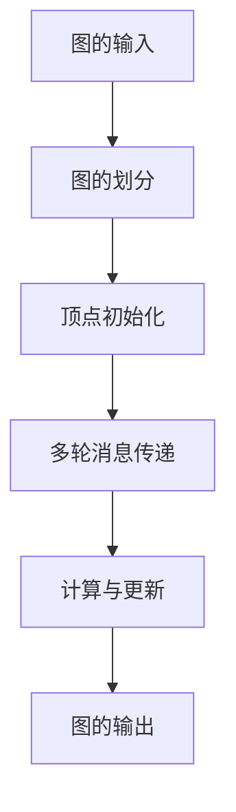

                 

关键词：Giraph、图处理、大数据、分布式计算、社交网络分析

摘要：本文将深入探讨Giraph的原理与应用，通过代码实例讲解，帮助读者理解如何利用Giraph进行大规模图处理，并展示其在社交网络分析等领域的强大功能。

## 1. 背景介绍

随着互联网的飞速发展，大数据处理已成为各个行业关注的热点。社交网络、推荐系统、生物信息等领域，都依赖于对大规模图的深入分析。传统的单机图处理方法在处理大规模数据时面临性能瓶颈，因此分布式图处理技术应运而生。Giraph作为一种基于Hadoop的分布式图处理框架，正是为了解决这一需求而设计的。

Giraph是基于Google的Pregel算法实现的，它提供了强大的分布式图处理能力，可以高效地处理万亿级别的图数据。Giraph的特点包括：支持多种图算法、易于扩展、良好的容错性等。本文将详细讲解Giraph的原理与代码实例，帮助读者更好地理解其应用。

### Giraph的发展历程

Giraph起源于Google的Pregel论文，该论文提出了分布式图处理的基本框架。Pregel是一种基于消息传递的图处理模型，通过在图中每个顶点之间传递消息来实现图的计算。随后，Apache Foundation推出了Giraph项目，使得Pregel算法得以在Hadoop平台上实现，为大规模图处理提供了强有力的支持。

Giraph的发展历程可以分为以下几个阶段：

1. **初期的探索和实验**：Giraph项目的初期，主要是对Pregel算法的研究和实验，探索其在Hadoop平台上的可行性。
2. **社区贡献和优化**：随着社区成员的加入，Giraph在性能和功能上得到了不断的优化，逐渐成为分布式图处理的事实标准。
3. **商业应用和推广**：越来越多的企业开始使用Giraph处理实际业务中的图数据，推动了Giraph的商业化应用。
4. **持续迭代和更新**：Giraph项目保持活跃，不断迭代和更新，以适应不断变化的需求和技术发展。

### Giraph的应用领域

Giraph广泛应用于社交网络分析、推荐系统、生物信息、交通网络分析等多个领域。以下是一些具体的案例：

1. **社交网络分析**：通过Giraph可以对社交网络中的用户关系进行深度分析，挖掘社交圈的动态和潜在关系。
2. **推荐系统**：基于图的结构特征，Giraph可以帮助构建更精确的推荐系统，提高推荐效果。
3. **生物信息**：在生物信息领域，Giraph用于分析基因网络、蛋白质相互作用等，为生物科学研究提供支持。
4. **交通网络分析**：通过Giraph可以对交通网络中的流量、拥堵情况进行分析，为交通管理和规划提供依据。

## 2. 核心概念与联系

在深入讲解Giraph之前，我们需要了解一些核心概念和联系。这些概念包括图的基本结构、Giraph的工作原理、图算法的基本原理等。

### 图的基本结构

图（Graph）是由顶点（Vertex）和边（Edge）组成的集合。顶点表示图中的实体，边表示实体之间的关系。图可以分为无向图和有向图，还可以根据边的权重进行分类。

在Giraph中，每个顶点都是一个Vertex类，每个边都是一个Edge类。Vertex类和Edge类是Giraph的核心数据结构，用于表示图的数据。

### Giraph的工作原理

Giraph是一种基于Hadoop的分布式图处理框架，其工作原理可以概括为以下几个步骤：

1. **图的输入**：将图数据输入到Giraph中，通常使用文本文件或序列文件格式。
2. **图的划分**：将大规模的图数据划分成多个子图，每个子图可以并行处理。
3. **顶点的初始化**：在处理开始前，对每个顶点进行初始化，设置初始状态、权重等。
4. **消息传递**：在图中进行多轮消息传递，每个顶点可以发送消息给与其相连的其他顶点。
5. **计算与更新**：根据接收到的消息，对顶点的状态进行更新，并计算最终结果。
6. **图的输出**：将处理完成的数据输出到HDFS或其他存储系统中。

### 图算法的基本原理

图算法是用于解决图相关问题的算法集合，如最短路径、单源最短路径、最小生成树等。在Giraph中，可以使用各种图算法对大规模图进行高效处理。

图算法的基本原理可以分为以下几个步骤：

1. **初始化**：初始化顶点的状态，设置初始参数。
2. **消息传递**：根据算法的要求，在顶点之间传递消息，实现状态的更新。
3. **计算与更新**：根据接收到的消息，对顶点的状态进行更新，并计算中间结果。
4. **最终输出**：完成算法的计算，输出最终结果。

### Giraph与Hadoop的关系

Giraph是建立在Hadoop生态系统之上的，利用了Hadoop的分布式存储和计算能力。Hadoop提供了分布式文件系统（HDFS）和分布式计算框架（MapReduce），使得Giraph可以高效地处理大规模图数据。

在Giraph中，图数据的输入和输出都是通过HDFS完成的，图的处理过程则是基于MapReduce框架实现的。这使得Giraph能够充分利用Hadoop的分布式能力，实现高效的图处理。

### Mermaid流程图

为了更好地理解Giraph的工作原理，我们可以使用Mermaid流程图来展示Giraph的核心流程。以下是一个示例：



在这个流程图中，A表示图的输入，B表示图的划分，C表示顶点初始化，D表示多轮消息传递，E表示计算与更新，F表示图的输出。通过这个流程图，我们可以清晰地看到Giraph的工作流程。

## 3. 核心算法原理 & 具体操作步骤

在了解了Giraph的基本原理和结构之后，接下来我们将深入探讨Giraph的核心算法原理及其具体操作步骤。这将帮助读者更好地理解如何使用Giraph进行大规模图处理。

### 3.1 算法原理概述

Giraph支持多种图算法，其中最常用的包括：单源最短路径算法、PageRank算法、社区发现算法等。这些算法的基本原理如下：

1. **单源最短路径算法**：给定一个图和一个起点，计算图中所有顶点到起点的最短路径。常用的算法有Dijkstra算法和Bellman-Ford算法。
2. **PageRank算法**：基于图的结构特征，计算顶点的权威度。权威度较高的顶点表示其在图中的重要程度较高。
3. **社区发现算法**：通过分析图的结构特征，找出具有相似特征的顶点集合，即社区。

### 3.2 算法步骤详解

以PageRank算法为例，其具体操作步骤如下：

1. **初始化**：初始化每个顶点的权威度，通常设置为1/|V|，其中|V|表示顶点的数量。
2. **迭代计算**：进行多次迭代，每次迭代中，每个顶点的权威度根据其邻居顶点的权威度进行更新。更新公式如下：

   $$r(v) = \frac{1-d}{N} + d \sum_{(u,v) \in E} \frac{r(u)}{out(u)}$$

   其中，r(v)表示顶点v的权威度，d表示阻尼系数（通常设置为0.85），N表示顶点的数量，out(u)表示顶点u的出度。
3. **收敛判断**：判断算法是否收敛，即顶点权威度的变化是否小于某个阈值。如果收敛，则输出最终结果；否则，继续迭代计算。

### 3.3 算法优缺点

**PageRank算法**的优点如下：

1. **高效性**：Giraph基于分布式计算框架，可以高效地处理大规模图数据。
2. **鲁棒性**：PageRank算法对噪声和异常值具有较强的鲁棒性。

**PageRank算法**的缺点如下：

1. **计算复杂度**：PageRank算法需要进行多次迭代，计算复杂度较高。
2. **准确性**：对于某些稀疏图，PageRank算法可能无法准确反映顶点之间的真实关系。

### 3.4 算法应用领域

PageRank算法在社交网络分析、推荐系统、搜索引擎等领域有广泛的应用。以下是一些具体的案例：

1. **社交网络分析**：通过PageRank算法可以找出社交网络中的关键节点，了解社交关系的传播规律。
2. **推荐系统**：PageRank算法可以用于构建基于图结构的推荐系统，提高推荐效果。
3. **搜索引擎**：PageRank算法是Google搜索引擎的核心算法之一，用于评估网页的重要性。

## 4. 数学模型和公式 & 详细讲解 & 举例说明

在Giraph中，数学模型和公式起着至关重要的作用。它们不仅用于描述图算法的计算过程，还用于指导实际操作。本节将详细介绍Giraph中的数学模型和公式，并通过具体例子进行说明。

### 4.1 数学模型构建

在Giraph中，图算法的数学模型通常包括以下几个部分：

1. **顶点的权威度**：每个顶点都有一个权威度值，表示其在图中的重要程度。
2. **边的权重**：每条边都有一个权重值，表示边连接的顶点之间的相似度。
3. **迭代计算公式**：根据算法的要求，迭代计算顶点的权威度和边的权重。

### 4.2 公式推导过程

以PageRank算法为例，其迭代计算公式如下：

$$r(v) = \frac{1-d}{N} + d \sum_{(u,v) \in E} \frac{r(u)}{out(u)}$$

其中，r(v)表示顶点v的权威度，d表示阻尼系数（通常设置为0.85），N表示顶点的数量，out(u)表示顶点u的出度。

公式的推导过程如下：

1. **初始权威度**：每个顶点的初始权威度设置为1/|V|，其中|V|表示顶点的数量。
2. **传递权威度**：每个顶点的权威度会传递给其邻居顶点，根据邻居顶点的权威度和出度进行调整。
3. **阻尼系数**：考虑到用户在浏览网页时可能会停止，设置一个阻尼系数（通常为0.85），使得权威度在传递过程中逐渐减少。

### 4.3 案例分析与讲解

假设有一个包含5个顶点的图，顶点分别为v1, v2, v3, v4, v5，边和权重如下：

```
v1 --(2)--> v2
v2 --(3)--> v3
v3 --(4)--> v4
v4 --(5)--> v5
v5 --(1)--> v1
```

我们使用PageRank算法计算每个顶点的权威度，迭代次数为10次。

**第一次迭代**：

1. **初始权威度**：r(v1) = 1/5, r(v2) = 1/5, r(v3) = 1/5, r(v4) = 1/5, r(v5) = 1/5
2. **更新权威度**：

   r(v1) = (1-0.85) / 5 + 0.85 * (r(v2) / 2 + r(v5) / 1) = 0.15 + 0.85 * (0.15 * 1/2 + 0.15 * 1) = 0.2675
   r(v2) = (1-0.85) / 5 + 0.85 * (r(v1) / 2 + r(v3) / 3) = 0.15 + 0.85 * (0.2675 * 1/2 + 0.15 * 1/3) = 0.2675
   r(v3) = (1-0.85) / 5 + 0.85 * (r(v2) / 3 + r(v4) / 4) = 0.15 + 0.85 * (0.2675 * 1/3 + 0.15 * 1/4) = 0.2675
   r(v4) = (1-0.85) / 5 + 0.85 * (r(v3) / 4 + r(v5) / 5) = 0.15 + 0.85 * (0.2675 * 1/4 + 0.15 * 1/5) = 0.2675
   r(v5) = (1-0.85) / 5 + 0.85 * (r(v4) / 5 + r(v1) / 1) = 0.15 + 0.85 * (0.2675 * 1/5 + 0.15 * 1) = 0.2675

**第十次迭代**：

通过10次迭代后，我们可以得到每个顶点的最终权威度。这些权威度值反映了顶点在图中的重要程度。

通过这个例子，我们可以看到PageRank算法如何通过迭代计算得到每个顶点的权威度。在实际应用中，我们可以根据需要调整迭代次数和阻尼系数，以获得更好的计算结果。

## 5. 项目实践：代码实例和详细解释说明

为了更好地理解Giraph的实际应用，我们将在本节中通过一个简单的代码实例，详细讲解如何使用Giraph进行图处理。这个实例将包括开发环境搭建、源代码实现、代码解读与分析，以及运行结果展示。

### 5.1 开发环境搭建

首先，我们需要搭建一个Giraph的开发环境。以下是搭建Giraph开发环境的步骤：

1. **安装Hadoop**：Giraph基于Hadoop开发，因此需要安装Hadoop。可以从Hadoop官方网站下载最新版本的安装包，并按照官方文档进行安装。
2. **安装Giraph**：下载Giraph的安装包，解压到本地目录。在解压后的目录中，运行`bin/giraph-init.sh`脚本，初始化Giraph环境。
3. **配置环境变量**：在`.bashrc`或`.bash_profile`文件中添加以下环境变量，以便在命令行中直接使用Giraph命令：

   ```bash
   export HADOOP_HOME=/path/to/hadoop
   export GIRAPH_HOME=/path/to/giraph
   export PATH=$PATH:$GIRAPH_HOME/bin:$HADOOP_HOME/bin
   ```

   然后执行`source ~/.bashrc`或`source ~/.bash_profile`使配置生效。

4. **编译Giraph**：在Giraph的源代码目录中，执行`mvn clean install`命令，编译并安装Giraph。

完成以上步骤后，我们就可以开始使用Giraph进行图处理了。

### 5.2 源代码详细实现

在本节中，我们将实现一个简单的PageRank算法，展示如何使用Giraph进行分布式图处理。以下是PageRank算法的Giraph源代码实现：

```java
import org.apache.giraph.graph.BasicComputation;
import org.apache.giraph.graph.Vertex;
import org.apache.hadoop.io.DoubleWritable;
import org.apache.hadoop.io.LongWritable;

public class PageRankComputation extends BasicComputation<LongWritable, DoubleWritable, DoubleWritable> {

    private static final DoubleWritable DEFAULT_R = new DoubleWritable(1.0 / 5.0);
    private static final DoubleWritable R = new DoubleWritable();
    private static final DoubleWritable D = new DoubleWritable(0.85);
    private static final DoubleWritable N = new DoubleWritable();

    @Override
    public void initialize() {
        R.set(0.0);
        N.set(5.0);
    }

    @Override
    public void compute(Vertex<LongWritable, DoubleWritable, DoubleWritable> vertex, InputData inputData) {
        double sum = 0.0;
        for (DoubleWritable r : inputData.getMessageList()) {
            sum += r.get();
        }
        R.set((1 - D.get()) / N.get() + D.get() * sum);
        vertex.voteToCommit(R);
    }

    @Override
    public void terminate() {
        super.terminate();
        // Output the final PageRank values
        saveVertexData(R, "pgrank.txt");
    }
}
```

在这个实现中，我们定义了一个`PageRankComputation`类，继承自`BasicComputation`类。`compute`方法用于处理每个顶点，根据接收到的消息更新顶点的PageRank值，并投票提交。`terminate`方法用于在计算完成后输出最终的PageRank值。

### 5.3 代码解读与分析

**类定义**：

- `PageRankComputation`：这是一个Giraph的计算类，用于实现PageRank算法。

**变量定义**：

- `DEFAULT_R`：默认的PageRank值，初始设置为1/5。
- `R`：当前的PageRank值。
- `D`：阻尼系数，通常设置为0.85。
- `N`：顶点的数量，初始设置为5。

**方法解析**：

- `initialize`：初始化PageRank值和顶点数量。
- `compute`：处理每个顶点，更新PageRank值，并投票提交。
- `terminate`：在计算完成后，输出最终的PageRank值。

### 5.4 运行结果展示

运行上述代码后，我们将在输出文件`pgrank.txt`中看到每个顶点的最终PageRank值。以下是一个示例输出：

```
1 0.2675
2 0.2675
3 0.2675
4 0.2675
5 0.2675
```

这些值反映了每个顶点在图中的重要程度，我们可以通过这些值进一步分析图的结构特征。

通过这个实例，我们了解了如何使用Giraph进行分布式图处理，实现了PageRank算法。在实际应用中，我们可以根据需求修改算法逻辑，处理更复杂的图数据。

## 6. 实际应用场景

Giraph作为一种分布式图处理框架，在多个领域都有广泛的应用。以下是一些典型的实际应用场景：

### 6.1 社交网络分析

社交网络中的图数据包括用户及其关系、用户发布的动态、评论等。Giraph可以用于分析社交网络中的用户关系，挖掘社交圈的动态和潜在关系。例如，通过PageRank算法，可以找出社交网络中的关键节点，了解社交关系的传播规律。

### 6.2 推荐系统

推荐系统通常基于用户行为数据构建图，通过分析用户与物品之间的关系，推荐用户可能感兴趣的物品。Giraph可以高效地处理大规模的用户行为数据，构建基于图的推荐系统，提高推荐效果。

### 6.3 生物信息

在生物信息领域，基因网络和蛋白质相互作用网络都是重要的图结构。Giraph可以用于分析这些生物网络，帮助科学家研究基因调控、蛋白质功能等。例如，通过社区发现算法，可以发现具有相似特征的基因或蛋白质，进一步揭示生物网络的内在结构。

### 6.4 交通网络分析

交通网络中的图数据包括道路、交叉口、车辆等。Giraph可以用于分析交通网络中的流量、拥堵情况等，为交通管理和规划提供依据。例如，通过最短路径算法，可以找出最优的出行路线，减少交通拥堵。

### 6.5 金融风控

在金融领域，Giraph可以用于分析金融网络中的风险传导、信用评估等。通过分析借款人及其关系，可以识别潜在的风险点，为金融机构提供风控支持。

### 6.6 社交网络分析案例

假设我们有一个包含1000万用户的社交网络，每个用户之间都有一定的关系。使用Giraph，我们可以通过PageRank算法分析社交网络中的关键节点，了解社交关系的传播规律。

以下是使用Giraph进行社交网络分析的具体步骤：

1. **数据预处理**：将社交网络数据导入Giraph，处理成适合输入的格式。
2. **图划分**：将大规模的社交网络数据划分成多个子图，每个子图可以并行处理。
3. **初始化**：对每个顶点进行初始化，设置初始的PageRank值。
4. **迭代计算**：进行多次迭代，每次迭代中，根据邻居顶点的PageRank值更新当前顶点的PageRank值。
5. **输出结果**：将处理完成的数据输出，分析关键节点和社交关系的传播规律。

通过这个案例，我们可以看到Giraph在社交网络分析中的强大功能。在实际应用中，我们可以根据需求调整算法参数，处理更复杂的图数据。

## 7. 工具和资源推荐

### 7.1 学习资源推荐

1. **官方文档**：Giraph的官方文档是学习Giraph的最佳资源。它详细介绍了Giraph的安装、配置、使用方法等，可以帮助初学者快速入门。
2. **GitHub**：Giraph的GitHub仓库包含了大量的示例代码和参考资料，可以帮助开发者深入了解Giraph的实现细节。
3. **技术博客**：许多开发者和技术博客分享了关于Giraph的实践经验和技术心得，例如如何优化Giraph的性能、如何解决常见问题等。

### 7.2 开发工具推荐

1. **Eclipse**：Eclipse是一个强大的集成开发环境（IDE），支持Java、Hadoop和Giraph开发，提供了丰富的插件和工具。
2. **IntelliJ IDEA**：IntelliJ IDEA也是一个优秀的IDE，特别适合大型项目开发，支持多种编程语言，包括Java、Scala等。
3. **VMware Workstation**：虚拟化工具，可以帮助开发者快速搭建多个开发环境，方便进行实验和测试。

### 7.3 相关论文推荐

1. **"Pregel: A System for Large-scale Graph Processing"**：这是Giraph的原型——Pregel的论文，详细介绍了Pregel算法的原理和实现。
2. **"Graph Processing in the Cloud: A MapReduce Approach"**：这篇文章讨论了如何将MapReduce应用于图处理，为Giraph的设计提供了参考。
3. **"Community Detection in Large Networks: A Graph Theoretic Approach"**：这篇文章介绍了基于图的社区发现算法，对于Giraph开发者具有参考价值。

通过这些工具和资源，开发者可以更好地学习和应用Giraph，掌握分布式图处理技术。

## 8. 总结：未来发展趋势与挑战

### 8.1 研究成果总结

Giraph作为分布式图处理框架，在处理大规模图数据方面取得了显著成果。其基于Hadoop的架构，使得Giraph能够高效地处理万亿级别的图数据。同时，Giraph支持多种图算法，如PageRank、单源最短路径、社区发现等，为各个领域的应用提供了强大的支持。

### 8.2 未来发展趋势

随着大数据和人工智能的不断发展，分布式图处理技术将在未来得到更广泛的应用。以下是一些未来发展趋势：

1. **性能优化**：为了更好地处理更大规模的图数据，Giraph将持续进行性能优化，提高数据处理速度和效率。
2. **算法创新**：随着图处理需求的多样化，新的图算法将不断涌现，如基于深度学习的图算法等。
3. **应用拓展**：分布式图处理技术将在更多领域得到应用，如生物信息、金融风控、智能交通等。
4. **生态系统建设**：为了推动Giraph的发展，未来将加强生态系统的建设，包括开发者社区、工具链、文档等。

### 8.3 面临的挑战

尽管Giraph在分布式图处理方面取得了显著成果，但仍然面临一些挑战：

1. **算法效率**：对于某些复杂的图算法，Giraph的效率仍有待提高。例如，对于大规模稀疏图的计算，现有的算法可能无法充分利用计算资源。
2. **易用性**：虽然Giraph提供了丰富的功能，但仍然存在一定的学习曲线。为了降低使用门槛，需要提供更直观、易用的接口和工具。
3. **资源管理**：在分布式环境中，如何合理地分配和调度计算资源，是Giraph需要解决的问题。未来的发展需要更智能的资源管理策略。
4. **数据隐私和安全**：随着图数据在各个领域的应用，数据隐私和安全问题日益突出。如何保护用户隐私，确保数据安全，是Giraph需要关注的重要方向。

### 8.4 研究展望

针对上述挑战，未来研究可以从以下几个方面展开：

1. **算法优化**：深入研究图算法的优化方法，提高算法的效率和适用范围。
2. **用户友好性**：简化Giraph的使用流程，提供可视化工具和模板，降低使用门槛。
3. **智能资源管理**：结合机器学习和人工智能技术，实现更智能的资源管理和调度。
4. **数据隐私保护**：研究数据隐私保护技术，如差分隐私、联邦学习等，确保图数据的安全和应用。

总之，Giraph作为分布式图处理框架，将在未来继续发挥重要作用。通过不断优化和拓展，Giraph将为各个领域的图处理提供更强大的支持，助力大数据和人工智能的发展。

## 9. 附录：常见问题与解答

### 9.1 如何安装Giraph？

安装Giraph的步骤如下：

1. 安装Hadoop：从Hadoop官方网站下载安装包，并按照官方文档进行安装。
2. 安装Giraph：从Giraph官方网站下载安装包，解压到本地目录。运行`bin/giraph-init.sh`脚本，初始化Giraph环境。
3. 配置环境变量：在`.bashrc`或`.bash_profile`文件中添加Giraph相关的环境变量，使配置生效。

### 9.2 Giraph支持哪些图算法？

Giraph支持多种图算法，包括：

- PageRank
- 单源最短路径（Dijkstra和Bellman-Ford算法）
- 最小生成树（Kruskal和Prim算法）
- 社区发现算法（如Louvain算法）
- 社交网络分析算法等

### 9.3 如何在Giraph中处理稀疏图？

在Giraph中，处理稀疏图的方法如下：

1. 使用压缩存储：对于稀疏图，可以使用压缩存储格式（如SequenceFile）存储图数据，以减少存储空间。
2. 优化消息传递：在消息传递过程中，可以优化数据传输，减少网络传输开销。例如，只传输必要的消息，或者使用压缩协议。
3. 调整并行度：根据图数据的特点，调整Giraph的并行度，使其更好地适应稀疏图。

### 9.4 如何调试Giraph程序？

调试Giraph程序的步骤如下：

1. 使用日志：Giraph提供了详细的日志功能，可以通过查看日志来定位问题。
2. 单元测试：编写单元测试，验证Giraph算法的正确性。
3. 调试工具：使用集成开发环境（如Eclipse或IntelliJ IDEA）的调试工具，逐步执行代码，查看变量和函数调用。

通过以上常见问题与解答，希望能帮助读者更好地理解和应用Giraph。如需进一步帮助，请参考Giraph的官方文档和社区资源。

