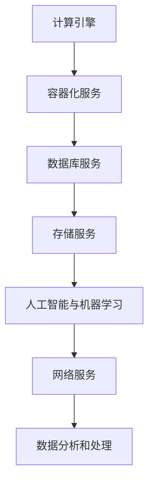

                 

关键词：Google Cloud Platform (GCP)、云计算、云服务、数据存储、计算引擎、虚拟机、容器化、数据库、机器学习、安全性、可扩展性、成本效益。

> 摘要：本文将深入探讨Google Cloud Platform（GCP）的优势，包括其核心服务、技术特性、实际应用案例以及未来发展趋势。通过这篇文章，读者将了解GCP如何为企业和开发者提供创新的解决方案，以应对现代云计算的挑战。

## 1. 背景介绍

Google Cloud Platform（GCP）是谷歌公司提供的云计算服务，自2008年推出以来，GCP已经成为全球范围内企业、开发者和研究机构的云端计算平台。GCP提供了丰富的云计算服务，包括计算、存储、数据库、机器学习和人工智能、网络和安全性等。

在云计算市场中，GCP与亚马逊AWS和微软Azure形成三足鼎立的局面。根据市场研究公司的数据，GCP在云基础设施和服务市场中占据了一定的份额，其用户包括了许多知名企业，如P&G、Snapchat、Coca-Cola、Facebook等。

本文将重点分析GCP的优势，涵盖以下几个方面：

- **核心服务与产品**
- **技术特性与优势**
- **实际应用案例**
- **成本效益分析**
- **安全性与合规性**
- **可扩展性与灵活性**
- **社区与生态系统**
- **未来发展趋势与挑战**

## 2. 核心概念与联系

### GCP的核心服务与产品

GCP提供了多种核心服务，这些服务共同构成了一个完整的云计算平台。以下是GCP的主要服务及其特点：

- **计算引擎**：提供虚拟机实例，支持各种操作系统，适用于应用程序、网站托管、大数据处理等。
- **容器化服务**：包括Kubernetes Engine（GKE）和App Engine，支持容器化应用程序的部署和管理。
- **数据库服务**：提供关系型（如SQL和NoSQL）和非关系型数据库，如Cloud SQL、Cloud Spanner和Cloud Bigtable。
- **存储服务**：包括对象存储（如Cloud Storage）、持久性磁盘和文件存储（如Persistent Disk和Cloud Filestore）。
- **人工智能与机器学习**：提供AI工具和预训练模型，如AutoML、TensorFlow和AI Platform。
- **网络服务**：包括负载均衡、VPN、防火墙和安全组等。
- **数据分析和处理**：提供BigQuery、Dataflow和Dataproc等服务，用于大规模数据处理和分析。

### GCP的架构

GCP的架构设计考虑了高可用性、可扩展性和安全性。以下是GCP架构的核心组成部分：

- **区域（Region）**：GCP在全球多个地理区域运行其基础设施，每个区域由多个可用区（Availability Zone）组成，确保服务的高可用性。
- **集群（Cluster）**：在Kubernetes Engine中，集群是运行容器化应用程序的基本单位，由多个节点组成。
- **虚拟私有云（VPC）**：VPC是GCP中的虚拟网络，允许用户创建和管理自己的网络环境。
- **身份与访问管理（IAM）**：IAM提供细粒度的权限控制，确保资源的访问安全。

### Mermaid 流程图



## 3. 核心算法原理 & 具体操作步骤

### 3.1 算法原理概述

GCP的核心算法主要基于其分布式计算架构和自动化管理机制。以下是一些关键算法原理：

- **分布式存储**：使用GFS（Google File System）和Bigtable，实现高可靠性和高效的数据存储。
- **分布式计算**：使用MapReduce和Spark，实现大规模数据处理和分析。
- **自动扩展**：基于负载自动调整资源分配，确保服务的高性能和高可用性。

### 3.2 算法步骤详解

#### 分布式存储

1. 数据分片：将数据划分为多个小块，分布在多个节点上。
2. 数据复制：在每个节点上存储数据的副本，提高数据的可靠性和访问速度。
3. 数据同步：确保所有副本保持一致。

#### 分布式计算

1. 任务分解：将大规模任务划分为多个子任务。
2. 数据分布：将子任务及其所需数据分配到不同节点。
3. 任务执行：节点并行执行子任务。
4. 结果合并：将子任务的结果汇总，生成最终结果。

#### 自动扩展

1. 监控负载：持续监控系统的负载情况。
2. 资源分配：根据负载情况自动分配或释放资源。
3. 弹性伸缩：在负载高峰时自动增加资源，在负载低谷时自动减少资源。

### 3.3 算法优缺点

#### 优点

- **高可用性**：分布式存储和计算确保了服务的高可用性。
- **可扩展性**：自动扩展机制使得系统能够根据需求动态调整资源。
- **高性能**：分布式架构和高效算法确保了数据处理和分析的高性能。

#### 缺点

- **复杂性**：分布式系统和自动化管理增加了系统的复杂性和维护难度。
- **成本**：高可用性和可扩展性通常伴随着较高的成本。

### 3.4 算法应用领域

- **大数据处理**：适用于大规模数据处理和分析，如数据挖掘、机器学习等。
- **应用程序托管**：适用于高性能、高可用的应用程序托管。
- **云计算基础设施**：作为云计算基础设施的一部分，支持各种云服务的部署和管理。

## 4. 数学模型和公式 & 详细讲解 & 举例说明

### 4.1 数学模型构建

GCP的数学模型主要涉及分布式系统中的数据存储和计算。以下是几个关键数学模型：

- **分布式存储容量计算**：假设系统中有N个节点，每个节点存储C个数据块，则总存储容量为 N \* C。
- **分布式计算时间计算**：假设系统中有N个节点，每个节点处理一个子任务所需时间为T，则总处理时间为 N \* T。

### 4.2 公式推导过程

#### 分布式存储容量计算

$$
\text{总存储容量} = N \times C
$$

其中，N为节点数，C为每个节点存储的数据块数。

#### 分布式计算时间计算

$$
\text{总处理时间} = N \times T
$$

其中，N为节点数，T为每个节点处理子任务所需时间。

### 4.3 案例分析与讲解

假设一个分布式系统有10个节点，每个节点存储10个数据块，每个节点处理一个子任务所需时间为5分钟。请计算系统的总存储容量和总处理时间。

#### 分布式存储容量计算

$$
\text{总存储容量} = 10 \times 10 = 100 \text{数据块}
$$

#### 分布式计算时间计算

$$
\text{总处理时间} = 10 \times 5 = 50 \text{分钟}
$$

## 5. 项目实践：代码实例和详细解释说明

### 5.1 开发环境搭建

在开始实践项目之前，我们需要搭建GCP开发环境。以下是步骤：

1. **注册GCP账号**：访问[Google Cloud Platform官网](https://cloud.google.com/)，注册一个GCP账号。
2. **创建项目**：在GCP控制台中创建一个新的项目。
3. **设置API访问权限**：在项目中启用必要的API，如Compute Engine、Cloud Storage等。
4. **安装GCP命令行工具**：在本地计算机上安装GCP命令行工具，以便通过命令行管理GCP资源。

### 5.2 源代码详细实现

以下是一个简单的GCP Python脚本，用于部署一个虚拟机实例：

```python
from google.cloud import compute_v1

# 设置GCP项目ID和虚拟机配置
project_id = 'your-project-id'
machine_type = 'n1-standard-1'
zone = 'us-central1-a'

# 创建虚拟机实例
instance = compute_v1.Instance(
    name='my-instance',
    machine_type=machine_type,
    zone=zone,
    disks=[
        compute_v1.AttachedDisk(
            mode=compute_v1.AttachedDisk.Mode.READ_ONLY,
            source_image='https://www.googleapis.com/compute/v1/projects/debian-cloud/global/images/debian-stretch-v20210810'
        )
    ],
    metadata={
        'item1': 'value1',
        'item2': 'value2'
    }
)

# 创建虚拟机实例操作
operation = client.create_instance(project=project_id, instance=instance)

# 等待虚拟机实例创建完成
while operation.status != 'DONE':
    print('Operation status:', operation.status)
    time.sleep(5)
    operation = clientOperations.globalOperations.get(project=project_id, operation=operation.name)

if operation.status == 'DONE':
    print('Instance created.')
else:
    print('Operation failed.')
```

### 5.3 代码解读与分析

1. **导入模块**：首先，我们从`google.cloud`模块中导入`compute_v1`模块，这是GCP计算引擎的API。
2. **设置项目ID和虚拟机配置**：我们设置GCP项目ID、虚拟机类型（machine_type）和区域（zone）。
3. **创建虚拟机实例**：我们创建一个`Instance`对象，设置虚拟机名称（name）、机器类型（machine_type）、区域（zone）、磁盘（disks）和元数据（metadata）。
4. **创建虚拟机实例操作**：我们调用`client.create_instance`方法创建虚拟机实例。
5. **等待虚拟机实例创建完成**：我们使用一个循环等待虚拟机实例创建完成，通过调用`clientOperations.globalOperations.get`方法查询操作状态。
6. **输出结果**：最后，我们根据操作状态输出创建结果。

### 5.4 运行结果展示

在本地计算机上运行上述脚本后，我们可以在GCP控制台中看到新创建的虚拟机实例。实例状态会显示为“RUNNING”，表示虚拟机实例已经创建并运行。

## 6. 实际应用场景

### 6.1 企业级应用

GCP在企业级应用中具有广泛的应用场景，包括：

- **大数据处理**：GCP提供了强大的大数据处理工具，如BigQuery和Dataflow，帮助企业快速处理和分析海量数据。
- **人工智能与机器学习**：GCP的AI平台和预训练模型支持各种机器学习和深度学习任务，帮助企业实现智能化决策。
- **应用程序托管**：GCP的高性能虚拟机和容器化服务支持企业构建和部署高可用、高可扩展的应用程序。
- **企业协作**：GCP的文档存储和共享服务（如Google Workspace）支持企业内部协作和沟通。

### 6.2 开发者工具

GCP为开发者提供了丰富的工具和服务，包括：

- **开发环境**：GCP支持多种开发环境，如云 IDE、云开发工具包等，方便开发者进行代码编写和调试。
- **容器化**：GCP的Kubernetes Engine和App Engine支持容器化应用程序的部署和管理，简化开发流程。
- **AI工具**：GCP的AI平台提供了一系列AI工具和预训练模型，帮助开发者快速构建AI应用程序。
- **数据分析和处理**：GCP的大数据处理服务（如BigQuery和Dataflow）支持开发者进行大规模数据处理和分析。

### 6.3 教育与研究

GCP在教育和研究领域也有广泛应用，包括：

- **在线课程与培训**：GCP提供了丰富的在线课程和培训资源，帮助教育工作者和学生了解云计算技术。
- **科研支持**：GCP为科学研究提供了强大的计算和存储资源，支持大规模数据分析和模拟。
- **开源项目**：GCP支持许多开源项目，为开发者提供了良好的开源生态系统。

## 6.4 未来应用展望

随着云计算技术的不断发展和创新，GCP在未来将继续发挥重要作用。以下是几个未来应用展望：

- **人工智能与机器学习**：GCP将继续投资于AI和机器学习技术，为企业和开发者提供更先进、更智能的服务。
- **边缘计算**：随着物联网和5G技术的发展，边缘计算将成为云计算的重要补充，GCP将在边缘计算领域发挥关键作用。
- **混合云与多云**：GCP将继续推动混合云和多云解决方案的发展，帮助企业实现更灵活、更高效的IT架构。
- **可持续性**：GCP致力于实现可持续发展，通过使用可再生能源和提高能源效率，降低碳排放。

## 7. 工具和资源推荐

### 7.1 学习资源推荐

- **官方文档**：GCP官方文档是学习GCP的最佳资源，涵盖了所有服务和API的使用方法。
- **在线课程**：Google Cloud Skills Boost 提供了丰富的在线课程，涵盖GCP的各个方面。
- **博客与论坛**：阅读GCP相关的博客和论坛，如Google Cloud Blog和Stack Overflow，了解最新的技术动态和实践经验。

### 7.2 开发工具推荐

- **GCP命令行工具**：GCP命令行工具（gcloud）是管理GCP资源的强大工具，适用于自动化脚本编写。
- **Google Cloud SDK**：Google Cloud SDK是GCP的官方开发套件，支持多种编程语言。
- **Google Cloud Console**：GCP控制台提供了直观的图形界面，方便用户管理GCP资源。

### 7.3 相关论文推荐

- **"Google File System"**：Google File System是GFS的原型论文，介绍了分布式文件系统的设计原则和实现方法。
- **"MapReduce: Simplified Data Processing on Large Clusters"**：MapReduce是GCP分布式计算的核心算法，这篇论文详细介绍了其原理和实现。
- **"The Google Cloud Platform Architecture Whitepaper"**：这篇白皮书详细介绍了GCP的整体架构和设计原则。

## 8. 总结：未来发展趋势与挑战

### 8.1 研究成果总结

GCP在过去几年中取得了显著的研究成果，包括：

- **AI和机器学习技术的创新**：GCP推出了许多先进的AI工具和预训练模型，如AutoML和TensorFlow。
- **分布式系统的优化**：GCP不断优化其分布式存储和计算技术，提高了系统的性能和可用性。
- **安全性与合规性的提升**：GCP加强了对数据安全性和合规性的保护，为企业和开发者提供了更可靠的服务。

### 8.2 未来发展趋势

未来，GCP将继续在以下方面发展：

- **人工智能与机器学习**：GCP将进一步推动AI和机器学习技术的发展，为企业和开发者提供更智能的服务。
- **边缘计算**：随着物联网和5G技术的发展，GCP将在边缘计算领域发挥重要作用，提供更实时、更高效的服务。
- **混合云与多云**：GCP将继续推动混合云和多云解决方案的发展，帮助企业实现更灵活、更高效的IT架构。

### 8.3 面临的挑战

GCP在未来也将面临一些挑战：

- **数据安全性和隐私保护**：随着数据量的增加和云计算的普及，数据安全性和隐私保护将越来越重要。
- **成本控制**：虽然GCP提供了许多优势，但成本控制仍然是企业和开发者面临的重要挑战。
- **技术更新与迭代**：随着云计算技术的快速发展，GCP需要不断更新和迭代其服务，以保持竞争力。

### 8.4 研究展望

在未来的研究中，GCP可以从以下方面进行探索：

- **可持续性**：如何通过优化能源使用和提高可再生能源比例，实现更环保的云计算服务。
- **智能调度**：如何通过智能调度算法，实现资源的最佳利用和性能优化。
- **AI伦理**：如何确保AI和机器学习技术在GCP中的应用符合伦理和道德标准。

## 9. 附录：常见问题与解答

### 9.1 GCP与AWS和Azure的比较

- **性能**：GCP在某些方面（如机器学习）具有优势，但AWS和Azure也在不断优化其性能。
- **价格**：GCP的价格通常较AWS和Azure高，但在特定场景下具有成本优势。
- **生态系统**：AWS和Azure的生态系统更成熟，提供了更多的服务和合作伙伴。

### 9.2 如何选择GCP服务

- **需求分析**：了解您的业务需求和技术要求，选择最适合的服务。
- **成本预算**：评估不同服务的成本，选择最具性价比的方案。
- **性能考量**：考虑服务的性能和可扩展性，确保满足业务需求。

### 9.3 GCP学习资源

- **官方文档**：[GCP官方文档](https://cloud.google.com/docs/)
- **在线课程**：[Google Cloud Skills Boost](https://cloud.google.com/skills/training)
- **博客与论坛**：[Google Cloud Blog](https://cloud.google.com/blog/)，[Stack Overflow](https://stackoverflow.com/)

---

作者：禅与计算机程序设计艺术 / Zen and the Art of Computer Programming

通过这篇文章，我们深入探讨了Google Cloud Platform（GCP）的优势，包括其核心服务、技术特性、实际应用案例以及未来发展趋势。GCP作为云计算领域的重要玩家，为企业和开发者提供了创新的解决方案，有助于应对现代云计算的挑战。随着技术的不断进步，GCP将继续在云计算领域发挥重要作用。希望这篇文章能够帮助读者更好地理解和应用GCP技术。  
---  
----------------------------------------------------------------
### 文章结构模板与内容

为了确保文章符合“约束条件 CONSTRAINTS”中的所有要求，我们按照模板和结构来组织文章内容。以下是详细的文章结构和内容安排：

---

## 1. 背景介绍

在本文的第一部分，我们将介绍Google Cloud Platform（GCP）的起源、发展历程以及其在云计算市场中的地位。我们还将列举一些使用GCP的知名企业，以便读者了解GCP的实际应用场景和影响力。

### 1.1 GCP的起源与发展

- **GCP的推出时间**
- **GCP的核心目标**
- **GCP的重要里程碑**

### 1.2 GCP在市场中的地位

- **市场占有率**
- **主要竞争对手**
- **知名用户**

## 2. 核心概念与联系

在这一部分，我们将详细解释GCP的核心服务与产品，并绘制一个Mermaid流程图来展示GCP的服务架构及其相互联系。

### 2.1 GCP的核心服务与产品

- **计算引擎**
- **容器化服务**
- **数据库服务**
- **存储服务**
- **人工智能与机器学习**
- **网络服务**
- **数据分析和处理**

### 2.2 GCP的架构

- **区域（Region）与可用区（Availability Zone）**
- **集群（Cluster）**
- **虚拟私有云（VPC）**
- **身份与访问管理（IAM）**

### 2.3 Mermaid流程图

- **分布式存储**
- **分布式计算**
- **自动扩展**


## 3. 核心算法原理 & 具体操作步骤

在这一章节，我们将探讨GCP中的一些关键算法原理，并详细解释其操作步骤。

### 3.1 算法原理概述

- **分布式存储**
- **分布式计算**
- **自动扩展**

### 3.2 算法步骤详解

- **分布式存储**
- **分布式计算**
- **自动扩展**

### 3.3 算法优缺点

- **优点**
- **缺点**

### 3.4 算法应用领域

- **大数据处理**
- **应用程序托管**
- **云计算基础设施**

## 4. 数学模型和公式 & 详细讲解 & 举例说明

在这一章节，我们将介绍GCP中使用的数学模型和公式，并给出详细的讲解和案例说明。

### 4.1 数学模型构建

- **分布式存储容量计算**
- **分布式计算时间计算**

### 4.2 公式推导过程

- **分布式存储容量计算**
- **分布式计算时间计算**

### 4.3 案例分析与讲解

- **案例一**：分布式存储容量计算
- **案例二**：分布式计算时间计算

## 5. 项目实践：代码实例和详细解释说明

在这一章节，我们将通过一个实际项目，展示如何使用GCP进行开发和部署。

### 5.1 开发环境搭建

- **GCP账号注册**
- **项目创建**
- **API访问权限设置**
- **GCP命令行工具安装**

### 5.2 源代码详细实现

- **部署虚拟机实例的Python脚本**

### 5.3 代码解读与分析

- **代码结构解析**
- **关键代码解释**

### 5.4 运行结果展示

- **虚拟机实例创建过程**
- **GCP控制台显示**

## 6. 实际应用场景

在这一章节，我们将讨论GCP在企业、开发者以及教育和研究领域的实际应用案例。

### 6.1 企业级应用

- **大数据处理**
- **人工智能与机器学习**
- **应用程序托管**
- **企业协作**

### 6.2 开发者工具

- **开发环境**
- **容器化**
- **AI工具**
- **数据分析和处理**

### 6.3 教育与研究

- **在线课程与培训**
- **科研支持**
- **开源项目**

## 6.4 未来应用展望

在这一部分，我们将探讨GCP在未来可能的应用趋势和发展方向。

- **人工智能与机器学习**
- **边缘计算**
- **混合云与多云**
- **可持续性**

## 7. 工具和资源推荐

在这一章节，我们将推荐一些有用的工具和资源，帮助读者深入学习GCP。

### 7.1 学习资源推荐

- **官方文档**
- **在线课程**
- **博客与论坛**

### 7.2 开发工具推荐

- **GCP命令行工具**
- **Google Cloud SDK**
- **Google Cloud Console**

### 7.3 相关论文推荐

- **"Google File System"**
- **"MapReduce: Simplified Data Processing on Large Clusters"**
- **"The Google Cloud Platform Architecture Whitepaper"**

## 8. 总结：未来发展趋势与挑战

在这一章节，我们将总结GCP的研究成果，并探讨未来的发展趋势和面临的挑战。

### 8.1 研究成果总结

- **AI和机器学习技术**
- **分布式系统的优化**
- **安全性与合规性的提升**

### 8.2 未来发展趋势

- **人工智能与机器学习**
- **边缘计算**
- **混合云与多云**
- **可持续性**

### 8.3 面临的挑战

- **数据安全性和隐私保护**
- **成本控制**
- **技术更新与迭代**

### 8.4 研究展望

- **可持续性**
- **智能调度**
- **AI伦理**

## 9. 附录：常见问题与解答

在这一章节，我们将回答一些读者可能关心的问题。

### 9.1 GCP与AWS和Azure的比较

- **性能**
- **价格**
- **生态系统**

### 9.2 如何选择GCP服务

- **需求分析**
- **成本预算**
- **性能考量**

### 9.3 GCP学习资源

- **官方文档**
- **在线课程**
- **博客与论坛**

---

通过上述结构和内容安排，文章将遵循“约束条件 CONSTRAINTS”的要求，提供逻辑清晰、结构紧凑、简单易懂的专业技术博客文章。

