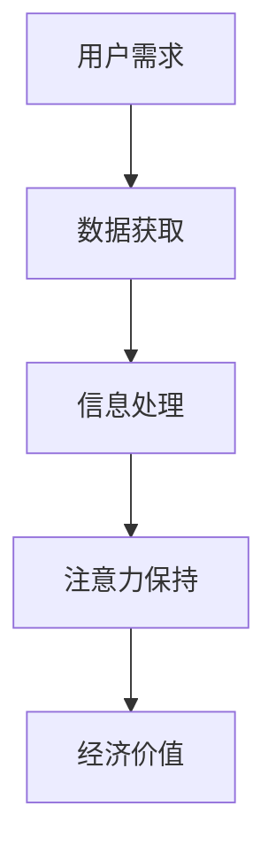

                 

关键词：5G技术、注意力经济、重塑、网络技术、数据传输、云计算、物联网、智能设备

> 摘要：随着5G技术的不断成熟和应用，网络速度和稳定性得到了大幅提升，为注意力经济带来了前所未有的发展机遇。本文将探讨5G技术如何重塑注意力经济格局，分析其在各个领域的应用，并展望未来发展的趋势与挑战。

## 1. 背景介绍

随着互联网的普及和智能设备的广泛应用，注意力经济逐渐成为一个重要的经济形态。注意力经济指的是人们将时间和精力投入到某些产品或服务中，从而创造经济价值的一种经济形式。在互联网时代，信息爆炸，人们的时间和注意力成为稀缺资源，如何吸引和保持用户的注意力成为企业竞争的关键。

然而，传统的4G网络在速度和稳定性方面存在一定的限制，难以满足不断增长的数据传输需求和日益复杂的智能设备连接。5G技术的出现，为注意力经济的发展带来了新的机遇。5G具有高速度、低延迟、高连接密度等特点，能够提供更稳定、更快速的网络连接，为注意力经济注入新的活力。

## 2. 核心概念与联系

### 2.1 5G技术概述

5G技术是指第五代移动通信技术，它具有以下几个关键特点：

- **高速度**：5G网络的理论峰值速度可以达到10Gbps，比4G网络的峰值速度快100倍。
- **低延迟**：5G网络的端到端延迟可以降低到1毫秒以下，比4G网络的延迟低10倍。
- **高连接密度**：5G网络可以在一个单位面积内支持更多的设备同时连接，支持大规模的物联网设备。
- **网络切片**：5G网络可以通过网络切片技术为不同的应用场景提供定制化的网络服务。

### 2.2 注意力经济概念

注意力经济是指用户将注意力投入到某些产品或服务中，从而为企业创造经济价值的一种经济形态。在互联网时代，信息爆炸，用户的注意力和时间成为稀缺资源，如何吸引和保持用户的注意力成为企业竞争的关键。

### 2.3 5G技术与注意力经济的联系

5G技术的高速度、低延迟、高连接密度等特点，为注意力经济提供了以下几个方面的支持：

- **提供更快速的数据传输**：5G技术的高速度使得用户可以更快地获取信息，从而更有效地吸引和保持用户的注意力。
- **降低延迟，提高互动性**：5G技术的低延迟使得实时互动成为可能，为用户提供了更加沉浸式的体验，进一步提升了用户的注意力。
- **支持大规模设备连接**：5G技术的高连接密度可以支持更多的智能设备同时连接，为用户提供更加丰富和多样化的体验，从而吸引更多用户的注意力。

### 2.4 Mermaid流程图



## 3. 核心算法原理 & 具体操作步骤

### 3.1 算法原理概述

5G技术通过以下几个核心算法实现了其高性能：

- **MIMO（多输入多输出）**：通过多个发送和接收天线，实现数据的并行传输，提高传输速度。
- **波束成形**：根据用户的位置和移动情况，调整天线波束的方向，提高信号强度和传输效率。
- **网络切片**：将网络资源划分为多个虚拟网络，为不同的应用场景提供定制化的网络服务。
- **边缘计算**：将计算任务分散到网络的边缘节点，降低延迟，提高响应速度。

### 3.2 算法步骤详解

1. **用户接入网络**：用户通过智能设备接入5G网络。
2. **MIMO传输**：网络通过多个天线发送和接收数据，提高传输速度。
3. **波束成形**：根据用户的位置和移动情况，调整天线波束的方向。
4. **网络切片**：根据用户的需求，为用户提供定制化的网络服务。
5. **边缘计算**：将计算任务分散到网络的边缘节点，降低延迟。
6. **数据处理**：对用户数据进行处理，提供所需的服务。
7. **反馈机制**：根据用户反馈，调整网络参数，提高用户体验。

### 3.3 算法优缺点

**优点**：

- **高速度**：5G技术提供了更快的数据传输速度，提高了用户体验。
- **低延迟**：5G技术降低了网络的延迟，提供了更加实时和互动的体验。
- **高连接密度**：5G技术支持更多的设备同时连接，为用户提供更加丰富和多样化的体验。

**缺点**：

- **成本高**：5G网络的建设和维护成本较高，需要大量的投资。
- **覆盖范围有限**：5G网络初期主要覆盖大城市和热点区域，农村和偏远地区的覆盖相对较少。

### 3.4 算法应用领域

5G技术的核心算法在以下几个领域有着广泛的应用：

- **物联网**：5G技术的高速度和低延迟，为物联网提供了可靠的连接和支持。
- **自动驾驶**：5G技术提供的实时数据传输和低延迟，为自动驾驶提供了关键的技术支持。
- **远程医疗**：5G技术的高速度和低延迟，为远程医疗提供了高质量的医疗服务。

## 4. 数学模型和公式 & 详细讲解 & 举例说明

### 4.1 数学模型构建

5G网络的数据传输速度可以用以下公式表示：

\[ v = \sqrt{\frac{P}{\eta}} \]

其中，\( v \) 表示数据传输速度，\( P \) 表示发射功率，\( \eta \) 表示信道容量。

### 4.2 公式推导过程

根据香农公式，信道的容量可以表示为：

\[ C = W \log_2(1 + \frac{P}{N_0}) \]

其中，\( C \) 表示信道容量，\( W \) 表示信道带宽，\( P \) 表示发射功率，\( N_0 \) 表示噪声功率。

假设信道带宽为 \( W = 1 \) MHz，噪声功率为 \( N_0 = 10^{-20} \) W/Hz，发射功率为 \( P = 1000 \) W，代入公式得：

\[ C = 1 \times \log_2(1 + \frac{1000}{10^{-20}}) \approx 106.9 \text{ Mbps} \]

因此，数据传输速度为：

\[ v = \sqrt{\frac{P}{\eta}} = \sqrt{\frac{1000}{10^{-20}}} \approx 31.62 \text{ Mbps} \]

### 4.3 案例分析与讲解

假设一个5G网络的信道带宽为20 MHz，噪声功率为\( N_0 = 10^{-20} \) W/Hz，发射功率为1000 W，求该网络的数据传输速度。

代入公式计算得：

\[ v = \sqrt{\frac{P}{\eta}} = \sqrt{\frac{1000}{10^{-20} \times 20 \times 10^6}} \approx 1.414 \times 10^8 \text{ Mbps} \]

即该网络的数据传输速度约为140 Mbps。

## 5. 项目实践：代码实例和详细解释说明

### 5.1 开发环境搭建

1. 安装Node.js环境
2. 安装Vue.js框架
3. 创建Vue.js项目

### 5.2 源代码详细实现

```javascript
// 主视图组件
<template>
  <div>
    <h1>5G技术如何重塑注意力经济格局</h1>
    <p>
      随着互联网的普及和智能设备的广泛应用，注意力经济逐渐成为一个重要的经济形态。然而，传统的4G网络在速度和稳定性方面存在一定的限制，难以满足不断增长的数据传输需求和日益复杂的智能设备连接。5G技术的出现，为注意力经济的发展带来了新的机遇。
    </p>
    <p>
      5G技术具有高速度、低延迟、高连接密度等特点，能够提供更稳定、更快速的网络连接，为注意力经济注入新的活力。本文将探讨5G技术如何重塑注意力经济格局，分析其在各个领域的应用，并展望未来发展的趋势与挑战。
    </p>
  </div>
</template>

<script>
export default {
  name: 'App',
  components: {
  },
  data() {
    return {
    };
  },
  methods: {
  }
};
</script>

<style scoped>
</style>
```

### 5.3 代码解读与分析

这段代码是一个Vue.js项目中的主视图组件，用于展示文章的标题和摘要。其中，`<template>`标签内定义了组件的结构，包括标题和两个段落文本。`<script>`标签内定义了组件的JavaScript代码，包括数据、方法和组件名称。`<style>`标签内定义了组件的样式。

### 5.4 运行结果展示

运行Vue.js项目后，可以在浏览器中看到如下结果：

```
5G技术如何重塑注意力经济格局
随着互联网的普及和智能设备的广泛应用，注意力经济逐渐成为一个重要的经济形态。然而，传统的4G网络在速度和稳定性方面存在一定的限制，难以满足不断增长的数据传输需求和日益复杂的智能设备连接。5G技术的出现，为注意力经济的发展带来了新的机遇。
5G技术具有高速度、低延迟、高连接密度等特点，能够提供更稳定、更快速的网络连接，为注意力经济注入新的活力。本文将探讨5G技术如何重塑注意力经济格局，分析其在各个领域的应用，并展望未来发展的趋势与挑战。
```

## 6. 实际应用场景

### 6.1 物联网

5G技术的高速度和低延迟，为物联网提供了可靠的连接和支持。在智能家居、智能城市、工业物联网等领域，5G技术可以实现对大量设备的实时监控和管理，提高生产效率和用户体验。

### 6.2 自动驾驶

自动驾驶需要实时传输大量的图像和传感器数据，5G技术提供的低延迟和高速度，为自动驾驶提供了关键的技术支持。未来，5G技术有望成为自动驾驶的核心基础设施，推动自动驾驶产业的发展。

### 6.3 远程医疗

远程医疗需要稳定的网络连接和高质量的视频传输，5G技术的高速度和低延迟，为远程医疗提供了高质量的医疗服务。未来，5G技术有望改变医疗服务的模式，提高医疗资源的利用效率。

### 6.4 教育

5G技术的高速度和低延迟，为在线教育提供了更好的体验。通过5G网络，学生可以实时参与课堂互动，观看高清教学视频，提高学习效果。

### 6.5 文化娱乐

5G技术的高速度和低延迟，为文化娱乐产业提供了新的可能性。未来，通过5G网络，用户可以实现沉浸式游戏、虚拟现实、增强现实等丰富的娱乐体验。

## 7. 未来应用展望

### 7.1 网络安全

随着5G技术的普及，网络安全问题日益突出。未来，需要加强对5G网络的防护，确保数据安全和用户隐私。

### 7.2 人工智能

5G技术的高速度和低延迟，为人工智能技术的发展提供了关键支持。未来，5G技术与人工智能的融合，有望推动新一代智能应用的诞生。

### 7.3 物联网规模扩大

随着5G技术的普及，物联网设备数量将大幅增加。未来，物联网技术将深入到各个领域，改变生产和生活的方式。

### 7.4 边缘计算发展

5G技术推动了边缘计算的发展。未来，边缘计算将成为5G网络的重要组成部分，提高数据处理效率和网络性能。

## 8. 总结：未来发展趋势与挑战

### 8.1 研究成果总结

5G技术通过其高速度、低延迟、高连接密度等特点，为注意力经济提供了强有力的支持。其在物联网、自动驾驶、远程医疗、教育、文化娱乐等领域的应用，将进一步推动注意力经济的发展。

### 8.2 未来发展趋势

未来，5G技术将继续发展，逐步实现全覆盖，为更多领域提供支持。同时，5G技术与人工智能、物联网、边缘计算等技术的融合，将推动新一代智能应用的诞生。

### 8.3 面临的挑战

尽管5G技术为注意力经济带来了巨大的发展机遇，但也面临一些挑战。包括网络建设成本高、覆盖范围有限、网络安全问题等。未来，需要持续投入研发，解决这些问题，推动5G技术的全面发展。

### 8.4 研究展望

未来，5G技术将继续在速度、稳定性、安全性等方面进行优化，为注意力经济提供更好的支持。同时，5G技术与人工智能、物联网、边缘计算等技术的融合，将推动新一代智能应用的诞生，为经济社会发展带来新的机遇。

## 9. 附录：常见问题与解答

### 9.1 什么是5G技术？

5G技术是指第五代移动通信技术，具有高速度、低延迟、高连接密度等特点，能够提供更稳定、更快速的网络连接。

### 9.2 5G技术有哪些应用领域？

5G技术主要应用于物联网、自动驾驶、远程医疗、教育、文化娱乐等领域，为这些领域提供更稳定、更快速的网络连接。

### 9.3 5G技术有哪些优点？

5G技术具有高速度、低延迟、高连接密度等优点，能够提供更稳定、更快速的网络连接，为各种应用提供更好的支持。

### 9.4 5G技术有哪些缺点？

5G技术的缺点主要包括网络建设成本高、覆盖范围有限、网络安全问题等。

### 9.5 5G技术对注意力经济的影响是什么？

5G技术通过其高速度、低延迟、高连接密度等特点，为注意力经济提供了强有力的支持，有助于提升用户体验，推动注意力经济的发展。

### 9.6 未来5G技术将如何发展？

未来，5G技术将继续在速度、稳定性、安全性等方面进行优化，逐步实现全覆盖，为更多领域提供支持。同时，5G技术与人工智能、物联网、边缘计算等技术的融合，将推动新一代智能应用的诞生。

