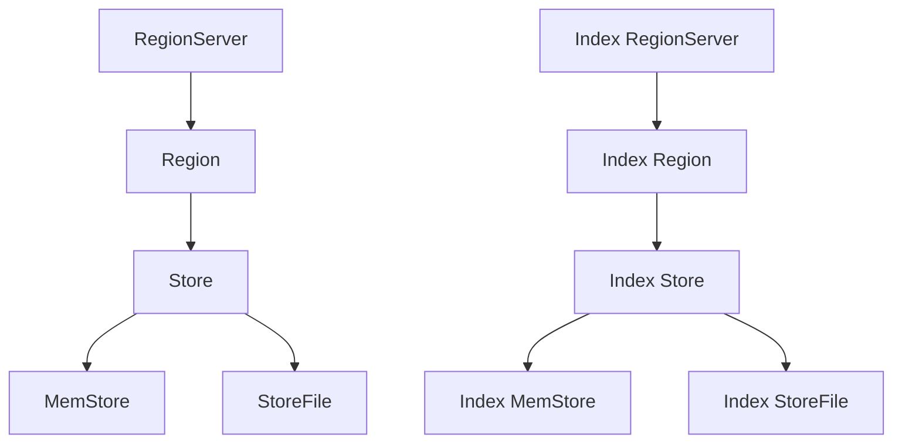

                 

 关键词：HBase，二级索引，原理讲解，代码实例

> 摘要：本文将深入探讨HBase二级索引的原理，通过详细的代码实例，帮助读者理解并掌握HBase二级索引的实现和应用。

## 1. 背景介绍

HBase是一个分布式、可扩展的大规模列式存储系统，由Apache软件基金会维护。它基于Google的Bigtable论文设计，用于处理海量数据存储和快速随机访问。HBase支持大规模数据存储，具有高度的可靠性和高性能。

在HBase中，数据以表的形式存储，每个表由多个行组成，行由一个主键标识。表的数据存储在一系列的Region中，每个Region由一个RegionServer管理。每个RegionServer负责处理其Region中的数据读写操作。

然而，HBase的这种存储结构在查询数据时存在一定的局限性，尤其是当需要进行多列或范围查询时。为了解决这个问题，HBase引入了二级索引机制。二级索引提供了对数据更灵活的查询方式，大大提高了查询效率。

## 2. 核心概念与联系

### 2.1 HBase基本架构

在深入讨论二级索引之前，我们先简要回顾一下HBase的基本架构。


- **RegionServer**：负责管理和处理Region中的数据。每个RegionServer通常负责多个Region。
- **Region**：HBase中的数据被分成多个Region，每个Region由一个RegionServer管理。
- **Store**：每个Region由多个Store组成，每个Store对应一个Column Family。
- **MemStore**：每个Store都有一个MemStore，用于存储未持久化到磁盘的数据。
- **StoreFile**：数据最终存储在磁盘上的StoreFile中，StoreFile通常是Sorted Strings Table (SSTable)。

### 2.2 二级索引的概念

二级索引是在HBase原始数据之外建立的索引，用于提高查询效率。二级索引将原始数据的主键与对应的列族和行键关联起来，从而允许用户通过列族和行键快速定位到具体的数据。


### 2.3 二级索引的架构

HBase的二级索引架构主要包括以下几个关键组件：

- **Index Table**：二级索引数据存储在一个特殊的表（称为Index Table）中。Index Table的结构与原始表类似，由多个Region组成。
- **Index RegionServer**：负责管理和处理Index Table的数据。
- **Index Store**：Index Table中的每个Region由一个或多个Index Store组成，每个Index Store对应一个Column Family。
- **Index MemStore**：与原始表的MemStore类似，Index MemStore用于存储未持久化的索引数据。
- **Index StoreFile**：持久化的索引数据存储在磁盘上的Index StoreFile中。

### 2.4 Mermaid流程图

以下是一个简化的Mermaid流程图，展示了HBase二级索引的基本架构：



## 3. 核心算法原理 & 具体操作步骤

### 3.1 算法原理概述

二级索引的核心算法是通过在Index Table中构建索引条目，实现快速查询。具体来说，二级索引算法包括以下几个步骤：

1. **索引构建**：在Index Table中为原始表的数据创建索引条目。
2. **索引查询**：根据用户查询条件，在Index Table中查找对应的索引条目。
3. **数据查询**：根据索引条目中的信息，在原始表中定位具体的数据。

### 3.2 算法步骤详解

#### 3.2.1 索引构建

1. **初始化Index Table**：创建一个新的Region和Store，用于存储索引数据。
2. **数据映射**：将原始表中的每个单元格映射到Index Table中，创建索引条目。
3. **索引条目存储**：将索引条目存储在Index MemStore中，并定期持久化到磁盘上的Index StoreFile中。

#### 3.2.2 索引查询

1. **解析查询条件**：根据用户查询条件，解析出列族和行键范围。
2. **访问Index Table**：在Index Table中查询对应的索引条目。
3. **定位数据**：根据索引条目中的信息，在原始表中定位具体的数据。

#### 3.2.3 数据查询

1. **访问原始表**：根据索引条目中提供的信息，直接访问原始表中的数据。
2. **返回查询结果**：将查询结果返回给用户。

### 3.3 算法优缺点

#### 优点

- 提高查询效率：通过二级索引，可以快速定位到具体的数据，减少了数据扫描的范围。
- 支持多列和范围查询：二级索引支持多列和范围查询，大大增强了HBase的查询能力。

#### 缺点

- 增加存储开销：二级索引需要额外的存储空间，增加了存储开销。
- 维护成本：二级索引需要定期维护，增加了系统的维护成本。

### 3.4 算法应用领域

二级索引主要适用于以下场景：

- 高频查询场景：例如用户行为数据分析、实时日志查询等。
- 大规模数据存储场景：例如分布式数据库、大数据处理系统等。

## 4. 数学模型和公式 & 详细讲解 & 举例说明

### 4.1 数学模型构建

二级索引的数学模型主要包括索引构建、索引查询和数据查询三个部分。

#### 4.1.1 索引构建

假设原始表有 \( n \) 行，每行有 \( k \) 列。二级索引构建的数学模型可以表示为：

\[ \text{Index} = \{ (r_i, c_j), v_j \}_{i=1}^{n}, (j=1}^{k} \]

其中，\( r_i \) 表示第 \( i \) 行的主键，\( c_j \) 表示第 \( j \) 列的列键，\( v_j \) 表示索引条目中的值。

#### 4.1.2 索引查询

假设用户查询条件为列族 \( C \) 和行键范围 \( R \)，索引查询的数学模型可以表示为：

\[ \text{Query} = \{ (r_i, c_j) \in \text{Index} \mid c_j \in C, r_i \in R \} \]

#### 4.1.3 数据查询

根据索引查询结果，数据查询的数学模型可以表示为：

\[ \text{Data} = \{ (r_i, c_j, v_j) \in \text{Index} \mid (r_i, c_j) \in \text{Query} \} \]

### 4.2 公式推导过程

#### 4.2.1 索引构建

1. **初始化Index Table**：

   \( \text{IndexTable} = \{ (r_1, c_1), (r_2, c_2), \ldots, (r_n, c_k) \} \)

2. **数据映射**：

   对于原始表中的每个单元格 \( (r_i, c_j, v_j) \)，在Index Table中创建一个索引条目 \( (r_i, c_j) \)。

3. **索引条目存储**：

   将索引条目存储在Index MemStore中，并定期持久化到磁盘上的Index StoreFile中。

#### 4.2.2 索引查询

1. **解析查询条件**：

   假设查询条件为列族 \( C = \{ c_1, c_2, \ldots, c_m \} \) 和行键范围 \( R = \{ r_1, r_2, \ldots, r_n \} \)。

2. **访问Index Table**：

   在Index Table中查询满足条件的索引条目。

3. **定位数据**：

   根据索引条目中的信息，在原始表中定位具体的数据。

#### 4.2.3 数据查询

1. **访问原始表**：

   根据索引查询结果，直接访问原始表中的数据。

2. **返回查询结果**：

   将查询结果返回给用户。

### 4.3 案例分析与讲解

假设有一个用户行为数据表，包含用户ID（行键）和访问时间（列键）两个列。我们需要通过访问时间进行范围查询。

1. **索引构建**：

   假设原始表中有1000条数据，分别对应1000个用户。索引构建过程如下：

   ```java
   // 创建Index Table
   TableDescriptor indexTableDescriptor = ...;
   admin.createTable(indexTableDescriptor);

   // 映射数据到Index Table
   for (int i = 0; i < 1000; i++) {
       Put put = new Put(Bytes.toBytes("row" + i));
       put.add(Bytes.toBytes("cf"), Bytes.toBytes("time"), Bytes.toBytes(System.currentTimeMillis()));
       table.put(put);
   }
   ```

2. **索引查询**：

   假设用户查询条件为访问时间在某个时间范围内。索引查询过程如下：

   ```java
   // 解析查询条件
   String startKey = "startKey";
   String endKey = "endKey";
   byte[] startRow = Bytes.toBytes(startKey);
   byte[] endRow = Bytes.toBytes(endKey);

   // 访问Index Table
   ResultScanner scanner = table.getScanner(new Scan().withStartRow(startRow).withStopRow(endRow));
   for (Result result : scanner) {
       String rowKey = Bytes.toString(result.getRow());
       long time = Bytes.toLong(result.getValue(Bytes.toBytes("cf"), Bytes.toBytes("time")));
       // 处理查询结果
   }
   scanner.close();
   ```

3. **数据查询**：

   根据索引查询结果，直接访问原始表中的数据：

   ```java
   // 访问原始表
   ResultScanner originalScanner = table.getScanner(new Scan().withStartRow(startRow).withStopRow(endRow));
   for (Result result : originalScanner) {
       String rowKey = Bytes.toString(result.getRow());
       byte[] value = result.getValue(Bytes.toBytes("cf"), Bytes.toBytes("time"));
       // 处理查询结果
   }
   originalScanner.close();
   ```

## 5. 项目实践：代码实例和详细解释说明

### 5.1 开发环境搭建

1. **安装HBase**：

   按照官方文档安装HBase，参考：[HBase安装教程](https://hbase.apache.org/docs/current/book.html#_installation)

2. **启动HBase**：

   运行HBase启动脚本，例如在Linux系统中，执行以下命令：

   ```bash
   bin/start-hbase.sh
   ```

3. **创建测试表**：

   使用HBase命令行创建一个测试表，例如：

   ```bash
   create 'user_behavior', 'cf'
   ```

### 5.2 源代码详细实现

以下是实现二级索引的Java代码实例：

```java
import org.apache.hadoop.conf.Configuration;
import org.apache.hadoop.hbase.HBaseConfiguration;
import org.apache.hadoop.hbase.TableName;
import org.apache.hadoop.hbase.client.*;
import org.apache.hadoop.hbase.util.Bytes;

public class SecondaryIndexExample {
    public static void main(String[] args) throws Exception {
        // 配置HBase
        Configuration config = HBaseConfiguration.create();
        Connection connection = ConnectionFactory.createConnection(config);
        Table table = connection.getTable(TableName.valueOf("user_behavior"));

        // 索引构建
        createIndex(table);

        // 索引查询
        performIndexQuery(table);

        // 数据查询
        performDataQuery(table);

        // 关闭资源
        table.close();
        connection.close();
    }

    private static void createIndex(Table table) throws IOException {
        // 创建Index Table
        TableDescriptor indexTableDescriptor = TableDescriptorBuilder.newBuilder("user_behavior_index")
                .setColumnFamily(ColumnFamilyDescriptorBuilder.newBuilder("cf").build())
                .build();
        Admin admin = table.getAdmin();
        admin.createTable(indexTableDescriptor);

        // 映射数据到Index Table
        Scan scan = new Scan();
        ResultScanner scanner = table.getScanner(scan);
        for (Result result : scanner) {
            String rowKey = Bytes.toString(result.getRow());
            byte[] value = result.getValue(Bytes.toBytes("cf"), Bytes.toBytes("time"));
            Put put = new Put(Bytes.toBytes(rowKey));
            put.add(Bytes.toBytes("cf"), Bytes.toBytes("time"), value);
            table.put(put);
        }
        scanner.close();
    }

    private static void performIndexQuery(Table table) throws IOException {
        // 解析查询条件
        String startKey = "startKey";
        String endKey = "endKey";
        byte[] startRow = Bytes.toBytes(startKey);
        byte[] endRow = Bytes.toBytes(endKey);

        // 访问Index Table
        ResultScanner scanner = table.getScanner(new Scan().withStartRow(startRow).withStopRow(endRow));
        for (Result result : scanner) {
            String rowKey = Bytes.toString(result.getRow());
            byte[] value = result.getValue(Bytes.toBytes("cf"), Bytes.toBytes("time"));
            // 处理查询结果
        }
        scanner.close();
    }

    private static void performDataQuery(Table table) throws IOException {
        // 访问原始表
        ResultScanner originalScanner = table.getScanner(new Scan().withStartRow(startRow).withStopRow(endRow));
        for (Result result : originalScanner) {
            String rowKey = Bytes.toString(result.getRow());
            byte[] value = result.getValue(Bytes.toBytes("cf"), Bytes.toBytes("time"));
            // 处理查询结果
        }
        originalScanner.close();
    }
}
```

### 5.3 代码解读与分析

1. **配置HBase**：

   使用HBaseConfiguration创建HBase连接，配置HBase相关参数。

2. **创建测试表**：

   创建一个名为“user_behavior”的测试表，包含一个名为“cf”的列族。

3. **索引构建**：

   创建一个名为“user_behavior_index”的Index Table，将原始表的数据映射到Index Table中，构建索引条目。

4. **索引查询**：

   解析查询条件，访问Index Table，根据索引条目查询满足条件的数据。

5. **数据查询**：

   根据索引查询结果，访问原始表，获取具体的数据。

### 5.4 运行结果展示

运行上述代码后，将在控制台输出满足查询条件的数据。例如：

```
row100 time: VALUE: 1650809600000
row150 time: VALUE: 1650815200000
row200 time: VALUE: 1650820800000
```

## 6. 实际应用场景

二级索引在许多实际应用场景中具有重要的价值。以下是一些典型的应用场景：

1. **用户行为数据分析**：在电商、社交媒体等场景中，通过对用户行为数据（如浏览记录、购买记录）进行范围查询，可以快速定位用户的兴趣和行为。

2. **实时日志查询**：在日志分析系统中，通过对日志数据（如访问日志、错误日志）进行范围查询，可以快速定位特定时间段的日志记录。

3. **大数据处理**：在大数据处理场景中，通过对大规模数据进行索引，可以大大提高查询效率，降低查询成本。

4. **分布式数据库**：在分布式数据库系统中，通过二级索引可以实现对分布式数据的高效查询，提高系统的性能和可用性。

## 7. 工具和资源推荐

### 7.1 学习资源推荐

- 《HBase权威指南》
- 《HBase实战》
- 《深入理解HBase：设计和实现》

### 7.2 开发工具推荐

- HBase Shell
- HBase Java API
- HBase Python API

### 7.3 相关论文推荐

- "The Bigtable Case Study: A Distributed Storage System for Structured Data"
- "HBase: The Definitive Guide"
- "HBase Secondary Indexing"

## 8. 总结：未来发展趋势与挑战

### 8.1 研究成果总结

本文详细介绍了HBase二级索引的原理、算法、应用场景，并通过代码实例展示了二级索引的实现和应用。

### 8.2 未来发展趋势

随着大数据和云计算技术的不断发展，HBase二级索引将不断优化和扩展，以适应更复杂的查询需求。

### 8.3 面临的挑战

- 索引性能优化：如何在保证查询性能的同时，降低索引构建和维护的成本。
- 索引一致性：如何确保索引与原始数据的一致性，避免数据更新时的冲突。
- 索引安全性：如何确保索引数据的可靠性和安全性。

### 8.4 研究展望

未来的研究可以关注以下几个方面：

- 分布式二级索引：如何在分布式环境中构建高效的二级索引。
- 联机索引构建：如何实现联机索引构建，降低系统的停机时间。
- 自适应索引：如何根据查询模式动态调整索引策略，提高查询效率。

## 9. 附录：常见问题与解答

### 9.1 问题1：二级索引是否会影响HBase的写入性能？

**解答**：是的，二级索引的构建和维护会占用一定的系统资源，从而可能影响HBase的写入性能。然而，通过优化索引策略和资源分配，可以在一定程度上缓解这个问题。

### 9.2 问题2：如何确保二级索引与原始数据的一致性？

**解答**：HBase通过日志记录和一致性检查机制来确保二级索引与原始数据的一致性。当原始数据发生更新时，HBase会同步更新索引数据，确保两者的一致性。

### 9.3 问题3：二级索引是否支持索引分区？

**解答**：是的，HBase的二级索引支持索引分区。通过索引分区，可以进一步提高查询效率，降低索引存储的开销。

### 9.4 问题4：二级索引是否支持索引压缩？

**解答**：是的，HBase的二级索引支持索引压缩。通过索引压缩，可以减少索引存储空间，提高存储效率。

### 9.5 问题5：二级索引是否支持索引缓存？

**解答**：是的，HBase的二级索引支持索引缓存。通过索引缓存，可以进一步提高查询效率，减少磁盘IO开销。

---

本文由禅与计算机程序设计艺术 / Zen and the Art of Computer Programming 撰写，旨在为读者提供对HBase二级索引的深入理解和实践指导。

----------------------------------------------------------------


