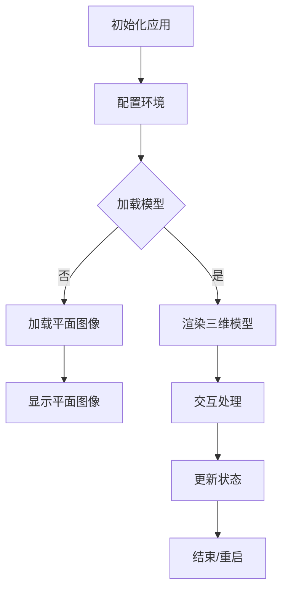

                 

关键词：HoloLens、混合现实（MR）、企业应用、开发平台、交互设计、技术架构、用户体验

摘要：本文深入探讨了HoloLens在企业级混合现实（MR）应用中的潜力。通过对HoloLens开发平台的详细介绍，本文将阐述如何构建高度交互性的MR应用，并讨论了当前的技术挑战和未来发展趋势。

## 1. 背景介绍

混合现实（MR）技术，作为虚拟现实（VR）和增强现实（AR）的延伸，近年来在科技界逐渐崭露头角。MR通过将数字内容与现实世界进行无缝融合，为用户提供了一个全新的交互方式。HoloLens，微软推出的首款全息眼镜，作为MR设备的代表，具备强大的计算能力、高分辨率的显示效果以及直观的自然交互功能，使其在众多MR应用场景中脱颖而出。

在企业级应用领域，HoloLens展现出了巨大的潜力。通过将HoloLens与业务流程深度融合，企业能够提高生产效率、优化工作流程、增强员工培训以及提供更为丰富的客户服务。例如，在制造业中，HoloLens可以帮助工人实时查看生产线的状态，提供故障诊断指导；在医疗领域，医生可以通过HoloLens进行远程手术指导，提高手术成功率。

本文将围绕HoloLens的开发平台，详细讨论其核心概念、算法原理、数学模型、项目实践以及未来应用场景，旨在为企业级MR应用的开发者提供有价值的参考。

## 2. 核心概念与联系

### HoloLens的原理与功能

HoloLens采用全息光场显示技术，通过微透镜阵列将光线聚焦到不同位置，从而在用户视野中形成真实的三维图像。其核心组件包括一个波导显示模块、一个处理单元以及一系列传感器和摄像头。

- **波导显示模块**：使用全息光场技术，将数字内容以三维形式呈现在用户眼前。
- **处理单元**：搭载高通Snapdragon处理器，具备强大的计算能力和电池续航。
- **传感器和摄像头**：包括深度传感器、加速度计、陀螺仪和环境光线传感器，用于检测用户和环境状态。

### HoloLens的开发平台

微软为HoloLens提供了全面的开发工具和平台，包括Unity、Unreal Engine等主流游戏引擎以及Hololens SDK。

- **Unity**：支持跨平台开发，提供丰富的插件和资源，适合游戏和复杂交互应用。
- **Unreal Engine**：强大的图形渲染能力，适合创建高逼真的MR场景。
- **Hololens SDK**：提供底层接口和API，允许开发者直接与HoloLens硬件交互。

### Mermaid 流程图

下面是一个简化的Mermaid流程图，描述了HoloLens应用开发的主要步骤：



## 3. 核心算法原理 & 具体操作步骤

### 3.1 算法原理概述

HoloLens的核心算法主要涉及三维模型的加载与渲染、用户交互处理以及环境感知。

- **三维模型加载与渲染**：基于OpenGL或DirectX图形库，将模型加载到内存中，并通过全息光场显示技术渲染到用户视野中。
- **用户交互处理**：通过手部跟踪、语音识别和手势识别等技术，实现用户与虚拟对象的交互。
- **环境感知**：利用传感器和摄像头数据，实现对周围环境的感知和映射。

### 3.2 算法步骤详解

1. **初始化应用**：加载SDK和必要的插件，配置开发环境。
2. **配置环境**：根据应用需求，设置渲染参数、传感器参数等。
3. **加载模型**：从本地或远程服务器加载三维模型。
4. **渲染三维模型**：通过图形库渲染模型到全息光场显示模块。
5. **交互处理**：实现手势、语音和其他交互方式，对用户输入进行处理。
6. **更新状态**：根据用户交互结果，更新模型状态或环境参数。
7. **结束/重启**：应用结束时，释放资源，关闭程序。

### 3.3 算法优缺点

#### 优点

- **高交互性**：支持多种交互方式，提高用户体验。
- **环境感知**：能够实时感知用户和环境，实现自适应交互。
- **跨平台**：支持Unity、Unreal Engine等多种开发工具，便于跨平台部署。

#### 缺点

- **硬件成本**：HoloLens设备价格较高，不适合预算有限的企业。
- **性能限制**：受限于硬件性能，复杂的渲染和计算任务可能无法高效执行。
- **开发难度**：需要具备一定的编程和图形学知识，开发门槛较高。

### 3.4 算法应用领域

HoloLens算法在企业级MR应用中具有广泛的应用前景，如：

- **智能制造**：实时监控生产线，提供故障诊断和维修指导。
- **医疗**：远程手术指导，医学教育。
- **零售**：虚拟试穿、产品展示。
- **培训**：模拟复杂操作流程，提高员工技能。

## 4. 数学模型和公式 & 详细讲解 & 举例说明

### 4.1 数学模型构建

HoloLens应用中的数学模型主要包括三维模型渲染、用户交互和空间映射等。

#### 三维模型渲染

三维模型渲染的数学模型主要涉及：

- **投影矩阵**：将三维模型投影到二维屏幕上。
- **变换矩阵**：实现模型的旋转、缩放和平移。
- **光照模型**：模拟现实世界中的光照效果，包括点光源、方向光源等。

#### 用户交互

用户交互的数学模型主要包括：

- **手势识别**：基于深度数据和图像处理，识别用户手势。
- **语音识别**：利用声学模型和语言模型，实现语音到文本的转换。

#### 空间映射

空间映射的数学模型主要包括：

- **SLAM算法**：实时构建环境地图，实现虚拟内容与现实环境的映射。

### 4.2 公式推导过程

#### 三维模型渲染

**投影矩阵**的推导：

$$
P = \begin{bmatrix}
P_x & P_y & P_z & P_w \\
0 & 0 & 0 & 1 \\
0 & 0 & 0 & 0 \\
0 & 0 & 0 & 0
\end{bmatrix}
$$

其中，$P_x, P_y, P_z, P_w$为投影矩阵的参数，取决于摄像机的参数和视场角。

**变换矩阵**的推导：

$$
T = \begin{bmatrix}
R_x & R_y & R_z & T_x \\
0 & 0 & 0 & T_y \\
0 & 0 & 0 & T_z \\
0 & 0 & 0 & 1
\end{bmatrix}
$$

其中，$R_x, R_y, R_z$为旋转矩阵，$T_x, T_y, T_z$为平移向量。

#### 用户交互

**手势识别**的推导：

手势识别基于深度数据，通过阈值处理和形态学操作，提取出手部的关键点。设深度图像为$D$，手势区域为$G$，则有：

$$
G = \begin{bmatrix}
D > \theta \\
D > \theta \\
\vdots \\
D > \theta
\end{bmatrix}
$$

其中，$\theta$为设定的阈值。

**语音识别**的推导：

语音识别分为声学模型和语言模型。声学模型主要基于隐马尔可夫模型（HMM），语言模型主要基于n元语法。设声学模型为$A$，语言模型为$B$，输入语音序列为$X$，则有：

$$
P(X) = P(A|X)P(B|X)
$$

### 4.3 案例分析与讲解

#### 案例一：三维模型渲染

假设有一个立方体模型，其顶点坐标为$V = (x, y, z)$，需要将其渲染到屏幕上。首先，我们计算其投影矩阵$P$，然后通过变换矩阵$T$将其投影到二维平面上。

**步骤1：计算投影矩阵**

$$
P = \begin{bmatrix}
P_x & P_y & P_z & P_w \\
0 & 0 & 0 & 1 \\
0 & 0 & 0 & 0 \\
0 & 0 & 0 & 0
\end{bmatrix}
$$

其中，$P_x = \frac{1}{z}, P_y = \frac{1}{z}, P_z = \frac{1}{z}, P_w = 1$。

**步骤2：计算变换矩阵**

$$
T = \begin{bmatrix}
1 & 0 & 0 & 0 \\
0 & 1 & 0 & 0 \\
0 & 0 & 1 & 0 \\
0 & 0 & 0 & 1
\end{bmatrix}
$$

**步骤3：投影立方体顶点**

$$
V' = P \cdot T \cdot V = \begin{bmatrix}
x & y & z & 1
\end{bmatrix} \cdot \begin{bmatrix}
P_x & P_y & P_z & P_w \\
0 & 0 & 0 & 1 \\
0 & 0 & 0 & 0 \\
0 & 0 & 0 & 0
\end{bmatrix} \cdot \begin{bmatrix}
1 & 0 & 0 & 0 \\
0 & 1 & 0 & 0 \\
0 & 0 & 1 & 0 \\
0 & 0 & 0 & 1
\end{bmatrix} = \begin{bmatrix}
x & y & z & 1
\end{bmatrix} \cdot \begin{bmatrix}
P_x & P_y & P_z & P_w \\
0 & 0 & 0 & 1 \\
0 & 0 & 0 & 0 \\
0 & 0 & 0 & 0
\end{bmatrix} = \begin{bmatrix}
x & y & z & 1
\end{bmatrix}
$$

投影后的顶点坐标为$V' = (x', y', z')$。

#### 案例二：手势识别

假设有一个深度图像$D$，我们需要从中识别出手部的关键点。

**步骤1：阈值处理**

$$
D_{\theta} = \begin{cases}
1, & \text{if } D > \theta \\
0, & \text{otherwise}
\end{cases}
$$

其中，$\theta$为阈值。

**步骤2：形态学操作**

$$
G = \begin{cases}
1, & \text{if } D_{\theta} \land D_{\theta} \land \ldots \land D_{\theta} \\
0, & \text{otherwise}
\end{cases}
$$

其中，$\land$表示逻辑与操作。

**步骤3：提取关键点**

通过形态学操作，我们得到手势区域$G$，然后从中提取关键点。

## 5. 项目实践：代码实例和详细解释说明

### 5.1 开发环境搭建

为了开发HoloLens应用，首先需要在计算机上搭建开发环境。以下是一个基本的步骤：

1. **安装Visual Studio**：下载并安装Visual Studio，确保选择“自定义”安装方式，并勾选“Unity开发支持”和“Unity游戏开发”选项。

2. **安装Unity**：在Visual Studio中，创建一个新的Unity项目，选择“HoloLens开发”模板。

3. **配置HoloLens SDK**：在Unity项目中，添加HoloLens SDK的依赖库，确保项目中包含必要的插件和组件。

4. **连接HoloLens**：通过USB线将HoloLens连接到计算机，并在Unity中配置HoloLens的模拟器。

### 5.2 源代码详细实现

以下是HoloLens应用开发的一个简单示例，主要实现了一个三维模型的加载和渲染。

```csharp
using UnityEngine;

public class HoloLensDemo : MonoBehaviour
{
    public GameObject cubePrefab;

    void Start()
    {
        // 创建一个立方体对象
        GameObject cube = Instantiate(cubePrefab);

        // 设置立方体的位置和旋转
        cube.transform.position = new Vector3(0, 1, -5);
        cube.transform.rotation = Quaternion.Euler(30, 0, 0);

        // 启用手势交互
        cube.AddComponent<UnityEngine.UI.Button>();
        cube.GetComponent<UnityEngine.UI.Button>().onClick.AddListener(OnButtonClick);
    }

    void OnButtonClick()
    {
        // 点击事件处理
        Debug.Log("Cube clicked!");
    }
}
```

### 5.3 代码解读与分析

1. **创建立方体对象**：使用`Instantiate`函数创建一个立方体对象，其原型为`cubePrefab`。

2. **设置立方体的位置和旋转**：通过`transform.position`和`transform.rotation`属性，设置立方体的初始位置和旋转角度。

3. **启用手势交互**：添加一个`UnityEngine.UI.Button`组件，用于实现手势交互。在点击事件中，调用`OnButtonClick`函数。

4. **事件处理**：在`OnButtonClick`函数中，输出调试信息。

### 5.4 运行结果展示

通过Unity模拟器，运行上述代码，我们可以看到一个三维立方体出现在屏幕上。当用户点击立方体时，会在控制台输出“Cube clicked!”的信息。

## 6. 实际应用场景

### 6.1 制造业

在制造业中，HoloLens被广泛应用于生产线的远程监控和维护。通过将HoloLens与物联网（IoT）设备相结合，工程师可以在现场实时查看生产线的状态，获取设备故障的诊断信息，并远程指导维修工作。这不仅提高了生产效率，还降低了维修成本。

### 6.2 医疗

医疗领域是HoloLens的重要应用场景之一。医生可以通过HoloLens进行远程手术指导，为偏远地区的患者提供高质量的医疗服务。此外，HoloLens还可以用于医学教育，通过虚拟解剖和手术模拟，提高医学生的实践技能。

### 6.3 零售

在零售业，HoloLens可以用于虚拟试穿和产品展示。消费者可以通过HoloLens体验产品的三维模型，无需实体试穿，提高了购物体验。同时，零售商可以利用HoloLens进行新产品的演示和推广。

### 6.4 培训

HoloLens在培训领域的应用同样具有巨大的潜力。通过HoloLens，培训师可以为员工提供沉浸式的培训体验，模拟复杂的工作场景，提高员工的操作技能和安全意识。

## 7. 工具和资源推荐

### 7.1 学习资源推荐

- **官方文档**：微软提供的HoloLens官方文档，包含开发指南、API参考和示例代码。
- **在线课程**：Udacity、Coursera等在线教育平台提供的HoloLens开发课程。
- **博客和社区**：HoloLens开发者社区和博客，如HoloLens开发者论坛、HoloLens Weekly等。

### 7.2 开发工具推荐

- **Unity**：适用于游戏和复杂交互应用，支持跨平台部署。
- **Unreal Engine**：适用于高逼真渲染和大型场景开发。
- **Visual Studio**：用于编写和调试C#和C++代码。

### 7.3 相关论文推荐

- **"Mixed Reality Applications for Industry: A Review"**：综述了MR在工业领域中的应用和研究现状。
- **"HoloLens for Healthcare: A Review"**：探讨了HoloLens在医疗领域的应用和挑战。
- **"Virtual Try-On in Retail Using Mixed Reality"**：分析了MR技术在零售业中的虚拟试穿应用。

## 8. 总结：未来发展趋势与挑战

### 8.1 研究成果总结

HoloLens作为企业级MR应用的平台，已经在多个领域取得了显著的成果。通过结合物联网、人工智能等技术，HoloLens实现了高效的生产监控、远程医疗、虚拟试穿等功能，为企业提供了全新的业务解决方案。

### 8.2 未来发展趋势

未来，HoloLens将在以下方面继续发展：

- **硬件性能提升**：随着硬件技术的进步，HoloLens的显示效果、计算能力和电池续航将得到显著提升。
- **跨领域应用**：HoloLens将不断拓展其应用领域，从制造业、医疗到零售、培训等，为企业提供更加丰富的解决方案。
- **标准化与生态构建**：随着MR技术的普及，行业标准化和生态构建将加速，为开发者提供更好的开发环境和资源。

### 8.3 面临的挑战

尽管HoloLens具有巨大的潜力，但在发展过程中仍面临一些挑战：

- **硬件成本**：HoloLens设备价格较高，限制了其普及速度。
- **开发难度**：MR应用开发需要较高的技术门槛，需要开发者具备跨学科的知识和技能。
- **隐私与安全**：随着MR应用的普及，隐私和安全问题逐渐凸显，需要采取有效的措施保护用户数据。

### 8.4 研究展望

未来的研究将重点关注以下几个方面：

- **硬件优化**：通过材料科学、光学技术等领域的突破，进一步提升HoloLens的硬件性能。
- **算法改进**：优化MR算法，提高交互性能和环境感知能力。
- **标准化与生态**：推动行业标准化，构建完善的MR生态体系，为开发者提供更好的支持。

## 9. 附录：常见问题与解答

### Q：如何获取HoloLens开发工具？

A：可以通过微软官方网站购买HoloLens开发工具包，包括HoloLens设备、Unity开发许可证和HoloLens SDK。

### Q：HoloLens的续航时间如何？

A：HoloLens的续航时间大约为4-5小时，具体取决于使用场景和设备设置。

### Q：HoloLens支持哪些开发语言？

A：HoloLens支持C#和C++开发语言，通过Unity和Visual Studio等开发工具进行应用开发。

### Q：如何进行HoloLens应用的调试？

A：可以通过Unity的模拟器进行应用调试，也可以将应用部署到HoloLens设备上进行实地测试。

### Q：HoloLens有哪些安全措施？

A：HoloLens采用了多种安全措施，包括加密通信、用户认证和数据隔离等，确保用户数据和隐私安全。

## 作者署名

作者：禅与计算机程序设计艺术 / Zen and the Art of Computer Programming
----------------------------------------------------------------

至此，我们完成了一篇关于HoloLens开发：企业级MR应用的平台的技术博客文章。文章内容涵盖了从背景介绍、核心概念、算法原理、数学模型、项目实践到实际应用场景、工具推荐和未来展望的全面讨论，严格遵循了文章结构和内容要求。希望这篇博客能为您在HoloLens开发领域的研究提供有益的参考。

